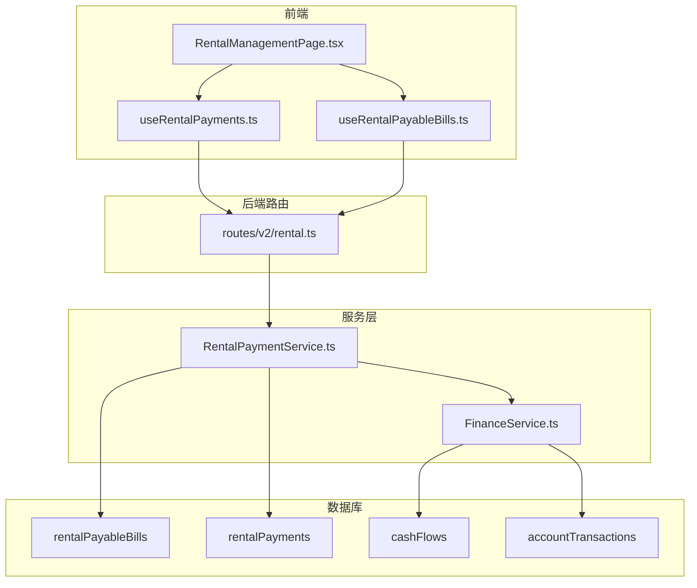
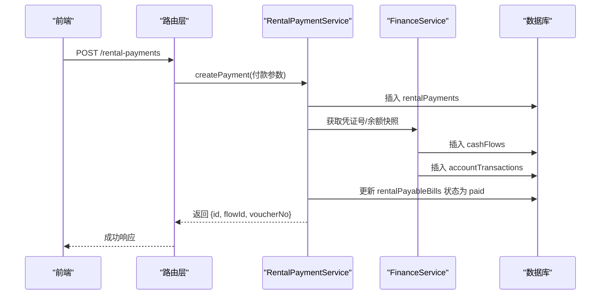
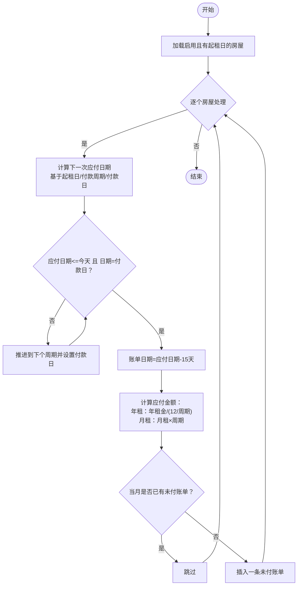
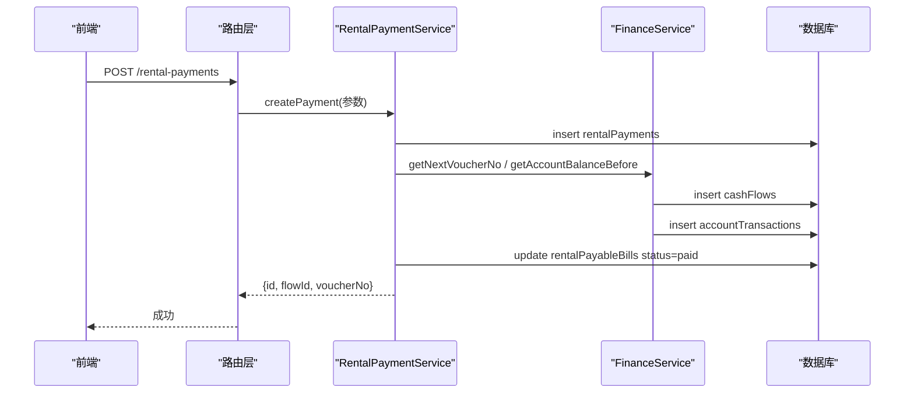
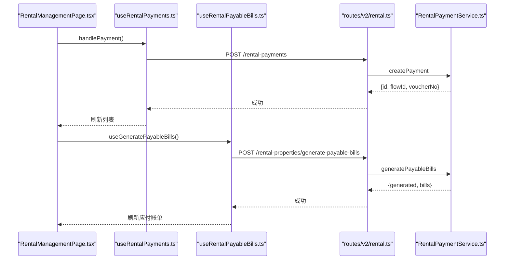
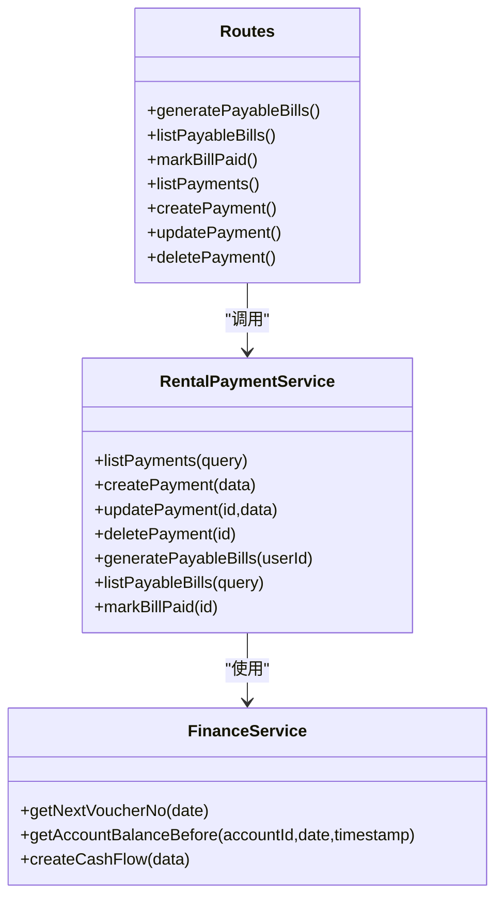

# 租赁账单与付款管理

<cite>
**本文引用的文件**
- [RentalPaymentService.ts](file://backend/src/services/RentalPaymentService.ts)
- [routes/v2/rental.ts](file://backend/src/routes/v2/rental.ts)
- [schema.ts](file://backend/src/db/schema.ts)
- [FinanceService.ts](file://backend/src/services/FinanceService.ts)
- [RentalManagementPage.tsx](file://frontend/src/features/assets/pages/RentalManagementPage.tsx)
- [useRentalPayments.ts](file://frontend/src/hooks/business/useRentalPayments.ts)
- [useRentalPayableBills.ts](file://frontend/src/hooks/business/useRentalPayableBills.ts)
- [rental.ts 类型定义](file://frontend/src/types/rental.ts)
- [openapi.json](file://backend/openapi.json)
</cite>

## 目录
1. [简介](#简介)
2. [项目结构](#项目结构)
3. [核心组件](#核心组件)
4. [架构总览](#架构总览)
5. [详细组件分析](#详细组件分析)
6. [依赖分析](#依赖分析)
7. [性能考虑](#性能考虑)
8. [故障排查指南](#故障排查指南)
9. [结论](#结论)
10. [附录](#附录)

## 简介
本文件围绕“租赁账单与付款管理”主题，系统化梳理后端服务层 RentalPaymentService 的业务逻辑与数据流，阐明应付账单生成机制、账单状态流转、付款记录创建与更新流程，以及与财务流水（cashFlows）和会计分录（accountTransactions）的集成关系。同时结合前端 RentalManagementPage 的交互流程，给出 API 使用规范与错误处理策略，帮助开发者与使用者高效完成月度账单生成、付款登记与账务核对。

## 项目结构
- 后端服务层位于 backend/src/services，其中 RentalPaymentService 负责租赁付款与应付账单的核心逻辑。
- 路由层位于 backend/src/routes/v2，提供 REST API 接口，统一暴露“生成应付账单”“应付账单列表”“标记已付”“付款记录 CRUD”等能力。
- 数据模型位于 backend/src/db/schema.ts，包含 rentalPayableBills、rentalPayments、cashFlows、accountTransactions 等关键表。
- 前端位于 frontend/src/features/assets/pages/RentalManagementPage.tsx，提供“记录付款”“查看应付账单”等交互入口；配套 hooks 在 frontend/src/hooks/business 下，负责调用后端 API 并进行缓存失效与状态联动。

图表来源
- [routes/v2/rental.ts](file://backend/src/routes/v2/rental.ts#L717-L851)
- [RentalPaymentService.ts](file://backend/src/services/RentalPaymentService.ts#L1-L400)
- [FinanceService.ts](file://backend/src/services/FinanceService.ts#L1-L200)
- [schema.ts](file://backend/src/db/schema.ts#L576-L706)

章节来源
- [routes/v2/rental.ts](file://backend/src/routes/v2/rental.ts#L1-L852)
- [RentalPaymentService.ts](file://backend/src/services/RentalPaymentService.ts#L1-L400)
- [schema.ts](file://backend/src/db/schema.ts#L576-L706)

## 核心组件
- RentalPaymentService：负责应付账单生成、应付账单列表查询、应付账单标记已付、付款记录的创建/更新/删除，并在创建付款时联动财务流水与会计分录。
- FinanceService：提供凭证号生成、账户余额快照查询、现金流水与会计分录的创建等通用财务能力。
- 路由层（routes/v2/rental.ts）：暴露租赁模块的 REST API，包括应付账单生成、应付账单列表、标记已付、付款记录 CRUD。
- 前端页面与 hooks：RentalManagementPage 提供“记录付款”“批量生成应付账单”等交互；useRentalPayments/useRentalPayableBills 负责调用后端 API 并维护查询缓存。

章节来源
- [RentalPaymentService.ts](file://backend/src/services/RentalPaymentService.ts#L1-L400)
- [FinanceService.ts](file://backend/src/services/FinanceService.ts#L1-L200)
- [routes/v2/rental.ts](file://backend/src/routes/v2/rental.ts#L484-L851)
- [RentalManagementPage.tsx](file://frontend/src/features/assets/pages/RentalManagementPage.tsx#L341-L373)
- [useRentalPayments.ts](file://frontend/src/hooks/business/useRentalPayments.ts#L1-L57)
- [useRentalPayableBills.ts](file://frontend/src/hooks/business/useRentalPayableBills.ts#L1-L56)

## 架构总览
后端采用“路由层 -> 服务层 -> 数据层”的分层架构：
- 路由层接收请求，校验权限与参数，调用对应服务方法。
- 服务层执行业务逻辑，必要时开启事务，保证一致性。
- 数据层通过 Drizzle ORM 访问 SQLite 表，涉及应付账单、付款记录、现金流水、会计分录等。

图表来源
- [routes/v2/rental.ts](file://backend/src/routes/v2/rental.ts#L538-L614)
- [RentalPaymentService.ts](file://backend/src/services/RentalPaymentService.ts#L53-L211)
- [FinanceService.ts](file://backend/src/services/FinanceService.ts#L25-L200)
- [schema.ts](file://backend/src/db/schema.ts#L159-L206)

## 详细组件分析

### 应付账单生成机制（generatePayableBills）
- 触发时机：管理员手动触发“生成应付账单”，或按月自动调度。
- 生成规则：
  - 遍历状态为“启用且存在起租日”的房屋。
  - 基于“起租日+付款周期+付款日”推导下一次应付日期。
  - 生成账单日期为应付日期前15天，到期日为应付日期。
  - 金额计算：年租按“年租金/(12/付款周期)”折算；月租按“月租金×付款周期”计算。
  - 若当月已存在未付账单，则跳过。
- 结果：返回生成数量与账单明细，用于前端提示与审计。

图表来源
- [RentalPaymentService.ts](file://backend/src/services/RentalPaymentService.ts#L244-L344)

章节来源
- [RentalPaymentService.ts](file://backend/src/services/RentalPaymentService.ts#L244-L344)

### 账单状态流转
- 状态枚举：unpaid（未付）、paid（已付）、cancelled（作废）。
- 生成：默认 unpaid。
- 标记已付：通过“应付账单列表”页或“生成应付账单”后，点击“标记已付”，服务层将状态置为 paid，并记录 paidDate。
- 手工登记付款：在“记录付款”时，服务层会同时创建付款记录、财务流水与会计分录，并回写应付账单状态为 paid。

章节来源
- [RentalPaymentService.ts](file://backend/src/services/RentalPaymentService.ts#L346-L398)
- [routes/v2/rental.ts](file://backend/src/routes/v2/rental.ts#L817-L851)

### 付款记录创建与更新流程
- 创建流程（含财务集成）：
  - 校验房屋存在性与账户有效性、币种匹配。
  - 插入 rentalPayments。
  - 生成凭证号（FinanceService.getNextVoucherNo）。
  - 查询账户余额快照（FinanceService.getAccountBalanceBefore）。
  - 插入 cashFlows（expense 类型，部门来自房屋所属部门，对手方为房东姓名）。
  - 插入 accountTransactions（记录余额前后值）。
  - 回写对应月份的应付账单为 paid，并绑定付款记录 ID。
- 更新/删除：支持更新付款信息与删除付款记录，删除时返回原记录。

图表来源
- [routes/v2/rental.ts](file://backend/src/routes/v2/rental.ts#L538-L614)
- [RentalPaymentService.ts](file://backend/src/services/RentalPaymentService.ts#L53-L211)
- [FinanceService.ts](file://backend/src/services/FinanceService.ts#L25-L200)

章节来源
- [RentalPaymentService.ts](file://backend/src/services/RentalPaymentService.ts#L53-L211)
- [routes/v2/rental.ts](file://backend/src/routes/v2/rental.ts#L538-L614)

### 财务流水与会计分录关联
- 现金流水（cashFlows）：
  - 类型：expense（支出）。
  - 凭证号：按“JZ+YYYYMMDD-XXX”规则生成，同一天递增。
  - 部门：来自房屋所属部门。
  - 对手方：房东姓名。
  - 关联字段：flowId 与 accountTransactions 关联。
- 会计分录（accountTransactions）：
  - 记录交易日、交易类型、金额、余额前后值。
  - 与 cashFlows 一一对应，便于对账与审计。
- 余额快照：
  - 通过“交易日期<业务日期 且 创建时间<当前时间”的历史交易，取最后一条的 balanceAfterCents 作为余额快照；若无历史则取账户期初余额。

章节来源
- [schema.ts](file://backend/src/db/schema.ts#L159-L206)
- [FinanceService.ts](file://backend/src/services/FinanceService.ts#L41-L110)
- [RentalPaymentService.ts](file://backend/src/services/RentalPaymentService.ts#L145-L190)

### 前端操作流程（RentalManagementPage）
- 记录付款：
  - 用户在“记录付款”弹窗中填写付款日期、金额、账户、费用分类、付款方式、凭证等。
  - 前端调用 createRentalPayment，成功后提示“凭证号：XXXX”，并刷新列表。
- 生成应付账单：
  - 点击“生成应付账单”，前端调用 generatePayableBills，成功后刷新应付账单与房屋列表。
- 应付账单处理：
  - 在应付账单列表中，可按房屋、状态、起止日期筛选。
  - 支持“标记已付”，前端调用 mark-paid 接口，成功后刷新应付账单与付款列表。

图表来源
- [RentalManagementPage.tsx](file://frontend/src/features/assets/pages/RentalManagementPage.tsx#L341-L373)
- [useRentalPayments.ts](file://frontend/src/hooks/business/useRentalPayments.ts#L1-L57)
- [useRentalPayableBills.ts](file://frontend/src/hooks/business/useRentalPayableBills.ts#L1-L56)
- [routes/v2/rental.ts](file://backend/src/routes/v2/rental.ts#L538-L614)

章节来源
- [RentalManagementPage.tsx](file://frontend/src/features/assets/pages/RentalManagementPage.tsx#L341-L373)
- [useRentalPayments.ts](file://frontend/src/hooks/business/useRentalPayments.ts#L1-L57)
- [useRentalPayableBills.ts](file://frontend/src/hooks/business/useRentalPayableBills.ts#L1-L56)

### API 接口使用规范与错误处理
- 生成应付账单
  - 方法：POST /rental-properties/generate-payable-bills
  - 权限：资产-租赁-创建
  - 响应：{ generated: number, bills: [...] }
  - 错误：无权限返回 403；内部异常返回 500
- 应付账单列表
  - 方法：GET /rental-payable-bills
  - 查询参数：propertyId、status、startDate、endDate
  - 权限：需具备用户岗位信息
  - 响应：results 数组，包含 bill、propertyCode、propertyName、propertyType、landlordName
- 标记已付
  - 方法：POST /rental-payable-bills/{id}/mark-paid
  - 权限：资产-租赁-更新
  - 响应：{ ok: true }
- 付款记录 CRUD
  - 列表：GET /rental-payments?propertyId&year&month
  - 创建：POST /rental-payments
  - 更新：PUT /rental-payments/{id}
  - 删除：DELETE /rental-payments/{id}
  - 权限：更新/删除需相应权限

章节来源
- [routes/v2/rental.ts](file://backend/src/routes/v2/rental.ts#L717-L851)
- [openapi.json](file://backend/openapi.json#L11777-L11831)

## 依赖分析
- 组件耦合
  - RentalPaymentService 依赖 FinanceService 完成凭证号与余额快照，依赖 Drizzle ORM 访问数据库。
  - 路由层通过 DI 注入服务实例，集中处理权限校验与审计日志。
- 数据依赖
  - 应付账单与付款记录通过 month/year 与 propertyId 关联，便于按月汇总与对账。
  - 现金流水与会计分录通过 flowId 关联，形成完整的财务链路。
- 外部依赖
  - 前端通过 React Query hooks 与后端 API 交互，实现查询缓存与自动刷新。

图表来源
- [RentalPaymentService.ts](file://backend/src/services/RentalPaymentService.ts#L1-L400)
- [FinanceService.ts](file://backend/src/services/FinanceService.ts#L1-L200)
- [routes/v2/rental.ts](file://backend/src/routes/v2/rental.ts#L484-L851)

## 性能考虑
- 事务与一致性：创建付款时在单事务内完成付款记录、现金流水、会计分录与应付账单状态更新，避免中间态。
- 索引与查询：cashFlows 与 accountTransactions 已建立索引，建议在高频查询字段上保持索引策略。
- 余额快照：余额计算基于历史交易快照，避免重复扫描全量交易，提升并发安全性。
- 前端缓存：React Query 默认 5 分钟 staleTime，减少重复请求；成功后主动失效相关查询，确保数据一致性。

## 故障排查指南
- 生成应付账单无结果
  - 检查房屋状态是否为“启用”，是否存在起租日。
  - 确认“付款周期/付款日”是否导致下一次应付日期在当前日期之后。
- 无法创建付款
  - 房屋不存在或账户停用/币种不匹配会抛出业务异常。
  - 余额不足会触发余额检查异常。
- 无法标记已付
  - 账单不存在或已为已付状态会触发业务异常。
- 前端无数据更新
  - 确认 mutation 成功回调是否触发了 queryClient.invalidateQueries。
  - 检查网络请求是否被拦截或跨域问题。

章节来源
- [RentalPaymentService.ts](file://backend/src/services/RentalPaymentService.ts#L53-L211)
- [RentalPaymentService.ts](file://backend/src/services/RentalPaymentService.ts#L373-L398)
- [useRentalPayments.ts](file://frontend/src/hooks/business/useRentalPayments.ts#L1-L57)
- [useRentalPayableBills.ts](file://frontend/src/hooks/business/useRentalPayableBills.ts#L1-L56)

## 结论
RentalPaymentService 将“应付账单生成、付款登记、财务流水与会计分录”有机整合，配合路由层的权限控制与审计日志，形成了闭环的租赁账务处理流程。前端通过 RentalManagementPage 与 hooks 实现直观的交互体验。遵循本文档的 API 使用规范与错误处理策略，可有效保障业务正确性与用户体验。

## 附录
- 数据模型概览（与租赁相关的表）
  - rentalPayableBills：应付账单，包含 propertyId、billDate、dueDate、year、month、amountCents、status、paidDate、paidPaymentId 等。
  - rentalPayments：付款记录，包含 propertyId、paymentDate、year、month、amountCents、currency、accountId、categoryId、memo 等。
  - cashFlows：现金流水，包含 voucherNo、bizDate、type、accountId、categoryId、method、amountCents、departmentId、counterparty、memo、voucherUrl 等。
  - accountTransactions：会计分录，包含 flowId、transactionDate、transactionType、amountCents、balanceBeforeCents、balanceAfterCents 等。

章节来源
- [schema.ts](file://backend/src/db/schema.ts#L576-L706)