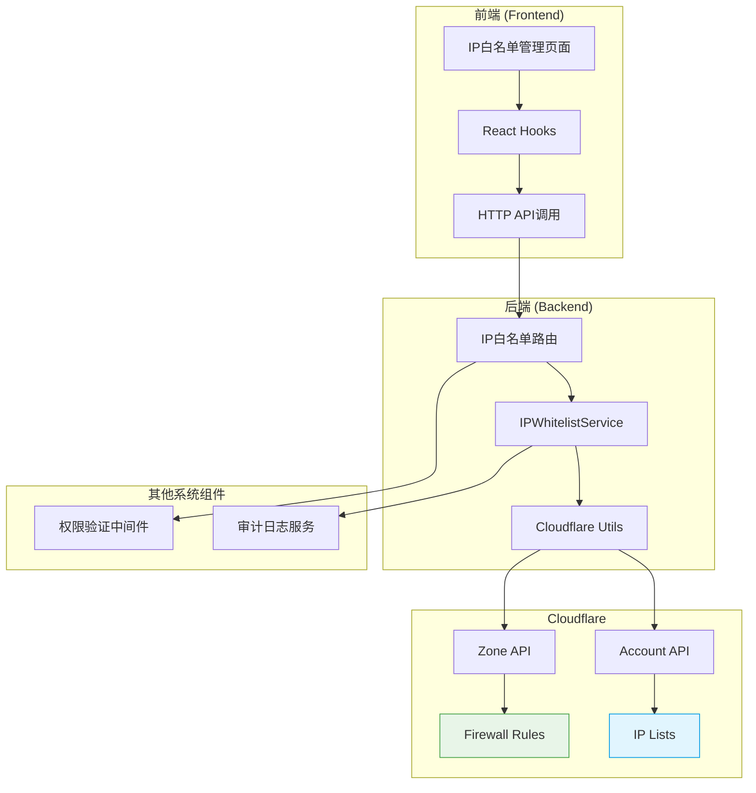
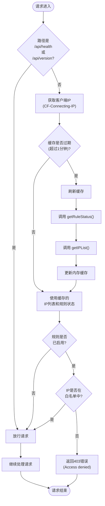

# IP白名单

<cite>
**本文档引用的文件**   
- [IPWhitelistService.ts](file://backend/src/services/IPWhitelistService.ts)
- [ipWhitelist.ts](file://backend/src/middleware/ipWhitelist.ts)
- [ip-whitelist.ts](file://backend/src/routes/v2/ip-whitelist.ts)
- [IPWhitelistManagementPage.tsx](file://frontend/src/features/system/pages/IPWhitelistManagementPage.tsx)
- [useIPWhitelist.ts](file://frontend/src/hooks/business/useIPWhitelist.ts)
- [cloudflare.ts](file://backend/src/utils/cloudflare.ts)
- [ipWhitelist.schema.ts](file://frontend/src/validations/ipWhitelist.schema.ts)
- [business.schema.ts](file://backend/src/schemas/business.schema.ts)
- [wrangler.toml](file://backend/wrangler.toml)
- [types.ts](file://backend/src/types.ts)
</cite>

## 目录
1. [简介](#简介)
2. [系统架构与集成](#系统架构与集成)
3. [核心服务实现](#核心服务实现)
4. [中间件请求拦截流程](#中间件请求拦截流程)
5. [前端管理页面功能](#前端管理页面功能)
6. [API接口与数据验证](#api接口与数据验证)
7. [错误处理与审计日志](#错误处理与审计日志)
8. [安全最佳实践](#安全最佳实践)
9. [故障排查指南](#故障排查指南)

## 简介

IP白名单功能是本财务系统的一项关键安全特性，旨在通过与Cloudflare API的深度集成，实现对访问系统的IP地址进行精细化的远程管理。该功能允许系统管理员将特定的IP地址添加到白名单中，只有来自这些白名单IP的请求才能成功访问系统API。其核心是`IPWhitelistService`，该服务负责与Cloudflare的Lists和Rules API进行交互，以管理IP列表和防火墙规则。

整个功能由后端服务、中间件和前端管理页面三部分协同工作。后端的`IPWhitelistService`封装了所有与Cloudflare通信的逻辑，包括获取、添加、删除IP以及控制防火墙规则的启用/禁用。`ipWhitelist`中间件在请求处理链的早期阶段运行，它会检查客户端的IP地址，并根据Cloudflare中配置的规则决定是否允许请求继续。前端的`IPWhitelistManagementPage`为管理员提供了一个直观的用户界面，用于执行IP地址的增删改查和规则开关操作。

此文档将深入解析该功能的各个组成部分，从代码实现到用户操作，为开发、运维和管理人员提供全面的技术参考。

## 系统架构与集成

IP白名单功能的架构是一个典型的前后端分离模式，其核心在于与Cloudflare平台的双向集成。系统通过专用的API Token与Cloudflare的Account和Zone API进行通信，实现了IP列表和防火墙规则的动态管理。

**图解说明**：
- **前端**：用户通过`IPWhitelistManagementPage`发起操作，该页面使用`useIPWhitelist`等React Hooks与后端API进行交互。
- **后端**：API请求首先经过权限验证，然后由`ip-whitelist.ts`中的路由处理，调用`IPWhitelistService`的相应方法。
- **Cloudflare集成**：`IPWhitelistService`通过`cloudflare.ts`中的工具函数，分别使用`CF_IP_LISTS_TOKEN`和`CF_FIREWALL_TOKEN`与Cloudflare的两个API端点通信：
  - **IP Lists**: 用于存储和管理IP地址列表，列表名为`caiwu_whitelist`。
  - **Firewall Rules**: 用于创建和管理一个自定义防火墙规则，该规则的表达式为`not ip.src in $caiwu_whitelist`，即阻止所有不在白名单中的IP。
- **安全与审计**：所有管理操作都会触发`logAuditAction`，将操作记录到审计日志中。

**Diagram sources**
- [IPWhitelistManagementPage.tsx](file://frontend/src/features/system/pages/IPWhitelistManagementPage.tsx)
- [ip-whitelist.ts](file://backend/src/routes/v2/ip-whitelist.ts)
- [IPWhitelistService.ts](file://backend/src/services/IPWhitelistService.ts)
- [cloudflare.ts](file://backend/src/utils/cloudflare.ts)

## 核心服务实现

`IPWhitelistService`是整个IP白名单功能的后端核心，它封装了所有与Cloudflare API交互的业务逻辑。该服务通过一系列方法实现了对IP列表和防火墙规则的完整生命周期管理。

### 核心方法解析

#### getIPList 方法
此方法用于从Cloudflare获取当前的IP白名单列表。它首先调用`fetchCloudflareIPListItems`工具函数，该函数会向Cloudflare的Account API发起请求，获取`caiwu_whitelist`列表中的所有IP项。返回的IP列表会被映射为系统内部的数据结构，包含ID、IP地址、描述和时间戳等信息。

**Section sources**
- [IPWhitelistService.ts](file://backend/src/services/IPWhitelistService.ts#L18-L27)

#### addIP 与 batchAddIPs 方法
`addIP`方法用于添加单个IP地址。在调用Cloudflare API之前，它会先检查该IP是否已存在于列表中，以避免重复添加。如果IP不存在，则调用`addIPToCloudflareList`发送创建请求。`batchAddIPs`方法则用于批量添加，它会一次性处理多个IP地址。在批量操作前，会先检查所有待添加的IP是否与现有列表有重复，若有重复则直接抛出业务错误，避免部分成功部分失败的复杂情况。

**Section sources**
- [IPWhitelistService.ts](file://backend/src/services/IPWhitelistService.ts#L30-L85)

#### toggleRule 方法
此方法用于启用或禁用IP白名单规则。它通过调用`toggleWhitelistRule`工具函数来实现。该函数的逻辑是：
1.  首先通过`getWhitelistRuleStatus`确认规则是否存在，如果不存在则自动调用`getOrCreateWhitelistRule`创建。
2.  获取包含目标规则的整个`ruleset`。
3.  在内存中修改目标规则的`enabled`状态，同时保持其他规则不变。
4.  将更新后的整个`ruleset`通过`PUT`请求发送回Cloudflare，完成状态切换。

**Section sources**
- [IPWhitelistService.ts](file://backend/src/services/IPWhitelistService.ts#L133-L138)

## 中间件请求拦截流程

`ipWhitelist`中间件是安全策略的执行者，它在每个API请求到达业务逻辑之前进行拦截和验证。该中间件采用了一种高效的缓存策略，以减少对Cloudflare API的频繁调用。

**流程说明**：
1.  **健康检查放行**：对于`/api/health`和`/api/version`这类健康检查接口，中间件会直接放行，确保监控系统正常工作。
2.  **获取客户端IP**：从`CF-Connecting-IP`请求头中提取真实的客户端IP地址。
3.  **缓存检查**：中间件使用内存缓存（`cachedIPs`和`cachedRuleEnabled`）来存储IP列表和规则状态，有效期为1分钟。如果缓存未过期，则直接使用缓存数据。
4.  **缓存刷新**：如果缓存已过期或为空，中间件会并行调用`getRuleStatus`和`getIPList`来从Cloudflare获取最新数据，并更新缓存。
5.  **规则与IP验证**：首先检查规则是否启用。如果规则已启用，则检查客户端IP是否在白名单列表中。如果IP不在列表中，则立即返回403 Forbidden错误。
6.  **错误处理**：在刷新缓存过程中如果发生任何错误，中间件会记录错误日志，并默认采用“允许”策略（fail-open），以避免因Cloudflare API暂时不可用而导致整个系统无法访问。

**Diagram sources**
- [ipWhitelist.ts](file://backend/src/middleware/ipWhitelist.ts#L12-L75)

## 前端管理页面功能

`IPWhitelistManagementPage`为系统管理员提供了一个功能完整、用户体验良好的管理界面。该页面清晰地分为两个主要区域：规则状态控制区和IP列表管理区。

### 规则状态控制
页面顶部的卡片展示了当前自定义防火墙规则的状态。它显示了规则的表达式`not ip.src in $caiwu-whitelist`和规则ID的前8位。管理员可以通过一个开关来启用或禁用该规则。当开关被打开时，如果规则尚未创建，系统会自动调用`createRule` API进行创建，然后立即启用。启用规则后，页面会显示一个醒目的警告提示，提醒管理员“不在白名单中的IP将被阻止访问”。

### IP列表管理
页面主体部分是一个数据表格，列出了所有已添加的IP地址及其描述和创建时间。管理功能通过工具栏的按钮实现：
- **添加IP**：点击“添加IP”按钮会弹出一个表单，要求输入IP地址和可选的描述。
- **批量添加**：点击“批量添加”按钮，可以粘贴多行IP地址（支持IPv4、IPv6及CIDR格式），并为所有IP设置一个统一的描述。
- **同步**：点击“从Cloudflare同步”按钮，会强制从Cloudflare拉取最新的IP列表，确保前端显示的数据与Cloudflare后端完全一致。
- **批量删除**：选中表格中的多个IP条目后，可以使用“批量删除”按钮一次性移除。

**Section sources**
- [IPWhitelistManagementPage.tsx](file://frontend/src/features/system/pages/IPWhitelistManagementPage.tsx#L16-L342)

## API接口与数据验证

系统通过`ip-whitelist.ts`路由文件暴露了一系列RESTful API，供前端调用。这些API都遵循统一的错误处理和响应格式。

### 核心API端点
- `GET /ip-whitelist`: 获取IP白名单列表。
- `POST /ip-whitelist`: 添加单个IP地址。
- `POST /ip-whitelist/batch`: 批量添加IP地址。
- `DELETE /ip-whitelist/batch`: 批量删除IP地址。
- `GET /ip-whitelist/rule`: 获取防火墙规则状态。
- `POST /ip-whitelist/rule/toggle`: 切换防火墙规则的启用/禁用状态。
- `POST /ip-whitelist/rule/create`: 创建防火墙规则。

### 数据验证
前后端均对输入数据进行了严格的验证。
- **前端验证**：使用`ipWhitelist.schema.ts`中的Zod Schema。`ipv4Regex`和`ipv6Regex`正则表达式确保了输入的IP地址格式正确。
- **后端验证**：在`business.schema.ts`中定义了`createIPWhitelistSchema`等Schema，API路由在处理请求前会自动验证JSON数据。

**Section sources**
- [ip-whitelist.ts](file://backend/src/routes/v2/ip-whitelist.ts#L53-L414)
- [ipWhitelist.schema.ts](file://frontend/src/validations/ipWhitelist.schema.ts#L1-L32)
- [business.schema.ts](file://backend/src/schemas/business.schema.ts#L559-L594)

## 错误处理与审计日志

系统的错误处理策略旨在保证稳定性和可维护性，同时通过审计日志提供完整的操作追溯能力。

### 错误处理
- **业务错误**：如添加重复IP，会抛出`Errors.DUPLICATE`或`Errors.BUSINESS_ERROR`，返回409或400状态码。
- **内部错误**：与Cloudflare API通信失败时，会抛出`Errors.INTERNAL_ERROR`，返回500状态码，并在日志中记录详细的错误信息。
- **降级策略**：在中间件中，如果无法从Cloudflare获取最新列表，系统会选择“允许”请求（fail-open），优先保证服务可用性。

### 审计日志
所有管理操作（创建、删除、启用/禁用）都会调用`logAuditAction`函数。该函数会记录操作者（`userId`）、操作类型（如`create`, `delete`）、实体类型（`ip_whitelist`）、操作详情（如IP地址）以及客户端的IP和地理位置信息。这为安全审计和问题排查提供了坚实的数据基础。

**Section sources**
- [IPWhitelistService.ts](file://backend/src/services/IPWhitelistService.ts#L30-L47)
- [ip-whitelist.ts](file://backend/src/routes/v2/ip-whitelist.ts#L121-L237)
- [errors.ts](file://backend/src/utils/errors.ts#L1-L228)
- [audit.ts](file://backend/src/utils/audit.ts#L1-L90)

## 安全最佳实践

为了确保IP白名单功能的安全可靠，应遵循以下最佳实践：
1.  **API Token最小权限原则**：为`CF_IP_LISTS_TOKEN`和`CF_FIREWALL_TOKEN`分配最小必要的权限。`CF_IP_LISTS_TOKEN`应仅具有“Account Rule Lists Write”权限，`CF_FIREWALL_TOKEN`应仅具有“Zone Firewall Services Write”权限。
2.  **环境隔离**：在`wrangler.toml`中，生产环境的API Token应通过Cloudflare Secret设置，避免硬编码在代码或配置文件中。
3.  **规则命名规范**：使用清晰的规则名称（如`IP Whitelist Rule`）和描述，便于在Cloudflare控制台中识别。
4.  **定期审查**：定期审查IP白名单列表，移除不再需要的IP地址。
5.  **谨慎启用规则**：在启用规则前，确保所有必要的IP地址（如公司办公网络、运维人员IP）都已添加到白名单中，避免误锁。

## 故障排查指南

当IP白名单功能出现问题时，可按以下步骤进行排查：

### 常见错误代码解决方案
- **403 Forbidden (Access denied)**:
  - **原因**：客户端IP不在白名单中，或规则已启用但IP未添加。
  - **解决**：检查`CF-Connecting-IP`头中的IP是否正确，并在管理页面确认该IP已添加且规则已启用。
- **500 Internal Server Error (切换规则状态失败)**:
  - **原因**：`CF_FIREWALL_TOKEN`无效或权限不足。
  - **解决**：检查`wrangler.toml`中的`CF_FIREWALL_TOKEN`是否正确配置，并确认其具有“Zone Firewall Services Write”权限。
- **500 Internal Server Error (添加IP到Cloudflare列表失败)**:
  - **原因**：`CF_IP_LISTS_TOKEN`无效、`CF_ACCOUNT_ID`错误，或IP格式不正确。
  - **解决**：检查`CF_IP_LISTS_TOKEN`和`CF_ACCOUNT_ID`的配置，并验证输入的IP地址是否符合IPv4/IPv6标准。
- **规则状态显示“规则未创建”**:
  - **原因**：`getOrCreateWhitelistRule`函数执行失败。
  - **解决**：检查`CF_FIREWALL_TOKEN`和`CF_ZONE_ID`的配置是否正确。

### 诊断步骤
1.  **检查环境变量**：确认`backend/.env`或Cloudflare Secret中已正确设置`CF_IP_LISTS_TOKEN`、`CF_FIREWALL_TOKEN`、`CF_ACCOUNT_ID`和`CF_ZONE_ID`。
2.  **查看日志**：检查应用日志中是否有来自`cloudflare.ts`的`console.error`信息，这些信息通常包含了Cloudflare API返回的详细错误。
3.  **手动测试API**：使用`curl`或Postman直接调用`GET /ip-whitelist/rule`和`GET /ip-whitelist`接口，观察返回结果。
4.  **检查Cloudflare控制台**：登录Cloudflare控制台，导航到“Account” -> “Lists”和“Rules” -> “Transform Rules”，确认`caiwu_whitelist`列表和相关防火墙规则是否存在且状态正确。