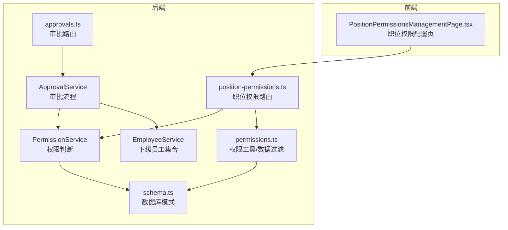
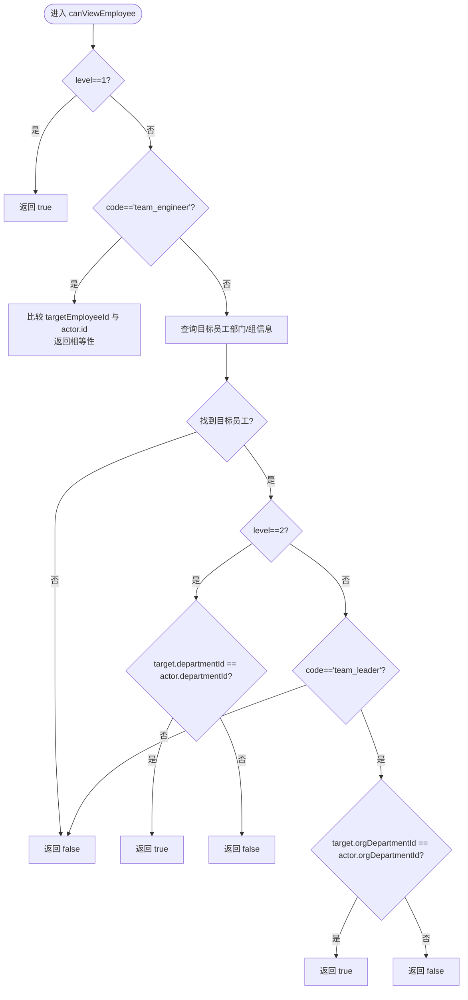
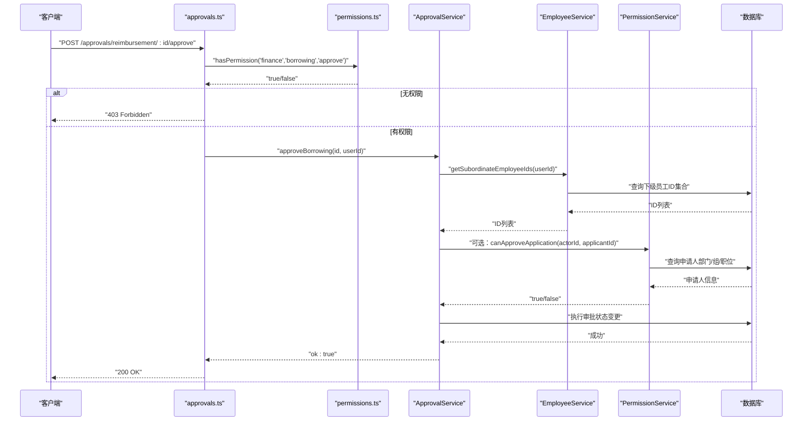
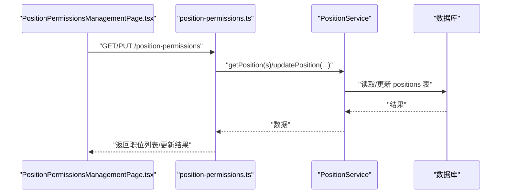
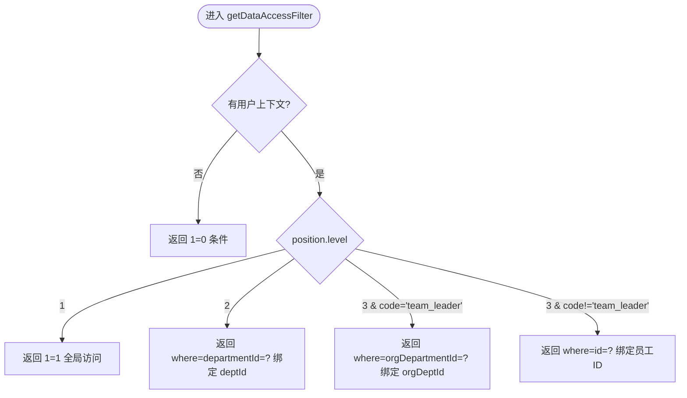
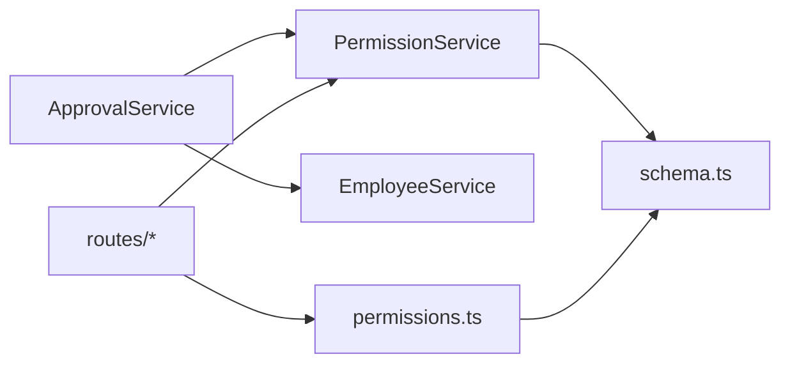

# 权限管理

<cite>
**本文引用的文件**
- [PermissionService.ts](file://backend/src/services/PermissionService.ts)
- [permissions.ts](file://backend/src/utils/permissions.ts)
- [schema.ts](file://backend/src/db/schema.ts)
- [position-permissions.ts](file://backend/src/routes/v2/position-permissions.ts)
- [PositionPermissionsManagementPage.tsx](file://frontend/src/features/system/pages/PositionPermissionsManagementPage.tsx)
- [approval.ts](file://backend/src/routes/v2/approvals.ts)
- [ApprovalService.ts](file://backend/src/services/ApprovalService.ts)
- [EmployeeService.ts](file://backend/src/services/EmployeeService.ts)
- [RBAC.test.ts](file://backend/test/services/RBAC.test.ts)
</cite>

## 目录
1. [简介](#简介)
2. [项目结构](#项目结构)
3. [核心组件](#核心组件)
4. [架构总览](#架构总览)
5. [详细组件分析](#详细组件分析)
6. [依赖分析](#依赖分析)
7. [性能考虑](#性能考虑)
8. [故障排查指南](#故障排查指南)
9. [结论](#结论)
10. [附录](#附录)

## 简介
本文件围绕基于职位的权限管理（RBAC）系统进行深入解析，重点覆盖以下内容：
- PermissionService 中 canViewEmployee 与 canApproveApplication 的权限判定逻辑
- 职位层级（level）、职位编码（code）与管理权限（canManageSubordinates）在权限决策中的作用
- 如何通过数据库查询实现跨部门、跨项目的访问控制
- 权限配置页面如何管理职位与权限的映射关系
- 权限检查的 API 调用示例
- 权限模型设计图、典型审批场景的权限流分析与权限缓存优化策略

## 项目结构
后端采用分层架构，权限相关能力主要分布在以下模块：
- 服务层：PermissionService（核心权限判断）、ApprovalService（审批流程集成）、EmployeeService（下级员工集合）
- 工具层：permissions.ts（通用权限工具、数据访问过滤器）
- 路由层：position-permissions.ts（职位与权限配置接口）、approvals.ts（审批接口）
- 前端：PositionPermissionsManagementPage.tsx（职位权限配置界面）



图表来源
- [PermissionService.ts](file://backend/src/services/PermissionService.ts#L1-L147)
- [permissions.ts](file://backend/src/utils/permissions.ts#L1-L273)
- [schema.ts](file://backend/src/db/schema.ts#L1-L120)
- [position-permissions.ts](file://backend/src/routes/v2/position-permissions.ts#L1-L252)
- [PositionPermissionsManagementPage.tsx](file://frontend/src/features/system/pages/PositionPermissionsManagementPage.tsx#L1-L457)
- [approval.ts](file://backend/src/routes/v2/approvals.ts#L377-L485)
- [ApprovalService.ts](file://backend/src/services/ApprovalService.ts#L1-L120)
- [EmployeeService.ts](file://backend/src/services/EmployeeService.ts#L566-L606)

章节来源
- [PermissionService.ts](file://backend/src/services/PermissionService.ts#L1-L147)
- [permissions.ts](file://backend/src/utils/permissions.ts#L1-L273)
- [schema.ts](file://backend/src/db/schema.ts#L1-L120)
- [position-permissions.ts](file://backend/src/routes/v2/position-permissions.ts#L1-L252)
- [PositionPermissionsManagementPage.tsx](file://frontend/src/features/system/pages/PositionPermissionsManagementPage.tsx#L1-L457)
- [approval.ts](file://backend/src/routes/v2/approvals.ts#L377-L485)
- [ApprovalService.ts](file://backend/src/services/ApprovalService.ts#L1-L120)
- [EmployeeService.ts](file://backend/src/services/EmployeeService.ts#L566-L606)

## 核心组件
- PermissionService：提供 canViewEmployee 与 canApproveApplication 等核心权限判断方法，结合数据库查询实现跨部门、跨项目的访问控制。
- permissions.ts：提供 hasPermission、getDataAccessFilter 等通用权限工具，支持模块级访问控制与数据访问范围过滤。
- schema.ts：定义 employees、positions 等核心表结构，支撑权限判断所需的字段（departmentId、orgDepartmentId、positionId 等）。
- position-permissions.ts：提供职位与权限配置的 CRUD 接口，前端通过 PositionPermissionsManagementPage.tsx 进行可视化配置。
- approvals.ts 与 ApprovalService.ts：审批流程路由与服务，集成 PermissionService 与 EmployeeService 实现“可审批”范围的动态判定。
- EmployeeService：提供 getSubordinateEmployeeIds，用于生成可审批的下级员工集合，配合 canApproveApplication 实现更广泛的审批边界。

章节来源
- [PermissionService.ts](file://backend/src/services/PermissionService.ts#L1-L147)
- [permissions.ts](file://backend/src/utils/permissions.ts#L1-L273)
- [schema.ts](file://backend/src/db/schema.ts#L1-L120)
- [position-permissions.ts](file://backend/src/routes/v2/position-permissions.ts#L1-L252)
- [PositionPermissionsManagementPage.tsx](file://frontend/src/features/system/pages/PositionPermissionsManagementPage.tsx#L1-L457)
- [approval.ts](file://backend/src/routes/v2/approvals.ts#L377-L485)
- [ApprovalService.ts](file://backend/src/services/ApprovalService.ts#L1-L120)
- [EmployeeService.ts](file://backend/src/services/EmployeeService.ts#L566-L606)

## 架构总览
RBAC 权限模型以“职位”为核心实体，通过 level、code、canManageSubordinates 三个关键维度决定访问范围与审批边界；同时通过 permissions 字段定义模块级权限，再结合部门模块白名单实现细粒度控制。

```mermaid
classDiagram
class PermissionService {
+canViewEmployee(actor, actorPosition, targetEmployeeId) Promise~boolean~
+canApproveApplication(actor, actorPosition, applicantEmployeeId) Promise~boolean~
+canApprove(actorId, applicantId) Promise~boolean~
}
class EmployeeService {
+getSubordinateEmployeeIds(userId) Promise~string[]~
}
class ApprovalService {
+getPendingApprovals(userId) Promise
}
class PermissionsUtils {
+hasPermission(c, module, subModule, action) boolean
+getDataAccessFilter(c, tableAlias, options) {where, binds}
}
class Schema {
<<tables>>
employees
positions
}
PermissionService --> Schema : "读取 employees/positions"
ApprovalService --> PermissionService : "审批权限判定"
ApprovalService --> EmployeeService : "下级员工集合"
PermissionsUtils --> Schema : "读取表结构"
```

图表来源
- [PermissionService.ts](file://backend/src/services/PermissionService.ts#L1-L147)
- [EmployeeService.ts](file://backend/src/services/EmployeeService.ts#L566-L606)
- [ApprovalService.ts](file://backend/src/services/ApprovalService.ts#L1-L120)
- [permissions.ts](file://backend/src/utils/permissions.ts#L1-L273)
- [schema.ts](file://backend/src/db/schema.ts#L1-L120)

## 详细组件分析

### PermissionService 权限判断逻辑
- canViewEmployee
  - 总部人员（level=1）：可查看任何人
  - 工程师（code=team_engineer）：仅能查看自身
  - 项目主管（level=2）：可查看本项目（departmentId 相同）
  - 组长（code=team_leader）：可查看本组（orgDepartmentId 相同）
  - 其他情况：返回 false
  - 数据来源：通过 employees 表查询目标员工的部门与组信息

- canApproveApplication
  - 必须具备 canManageSubordinates=1 才能审批
  - 总部主管（code=hq_manager）：可审批所有人
  - 项目主管（code=project_manager）：可审批本项目（departmentId 相同）
  - 组长（code=team_leader）：仅能审批本组工程师（team_engineer），且申请人必须有 positionId 并指向该编码
  - 其他情况：返回 false
  - 数据来源：先查询申请人基本信息，再根据 positionId 查询其职位编码

- canApprove（便捷方法）
  - 通过 actorId 与 applicantId 自动拉取员工与职位信息，再委托 canApproveApplication 执行判定



图表来源
- [PermissionService.ts](file://backend/src/services/PermissionService.ts#L12-L53)

章节来源
- [PermissionService.ts](file://backend/src/services/PermissionService.ts#L12-L146)

### 审批场景权限流（典型）
- 路由层校验：approvals.ts 在审批接口处使用 hasPermission 对模块/子模块/动作进行权限校验
- 服务层判定：ApprovalService 在获取待审批列表时，依赖 EmployeeService.getSubordinateEmployeeIds 生成可审批的下级集合；在具体审批操作中，可结合 PermissionService 的 canApproveApplication 进一步细化边界
- 数据访问范围：permissions.ts 的 getDataAccessFilter 可用于对查询结果进行数据范围过滤，避免越权访问



图表来源
- [approval.ts](file://backend/src/routes/v2/approvals.ts#L377-L485)
- [permissions.ts](file://backend/src/utils/permissions.ts#L99-L125)
- [ApprovalService.ts](file://backend/src/services/ApprovalService.ts#L41-L120)
- [EmployeeService.ts](file://backend/src/services/EmployeeService.ts#L566-L606)
- [PermissionService.ts](file://backend/src/services/PermissionService.ts#L58-L146)

章节来源
- [approval.ts](file://backend/src/routes/v2/approvals.ts#L377-L485)
- [ApprovalService.ts](file://backend/src/services/ApprovalService.ts#L41-L120)
- [EmployeeService.ts](file://backend/src/services/EmployeeService.ts#L566-L606)
- [permissions.ts](file://backend/src/utils/permissions.ts#L99-L125)
- [PermissionService.ts](file://backend/src/services/PermissionService.ts#L58-L146)

### 权限配置页面与职位权限映射
- 后端路由：position-permissions.ts 提供职位的增删改查接口，支持设置 canManageSubordinates、permissions 等字段
- 前端页面：PositionPermissionsManagementPage.tsx 提供可视化的权限配置界面，支持模块/子模块/动作的勾选，最终以 JSON 结构写入 positions.permissions
- 权限生效路径：permissions.ts 的 hasPermission 将“部门允许的模块”与“职位定义的操作权限”进行交集判断，从而决定具体操作是否允许



图表来源
- [position-permissions.ts](file://backend/src/routes/v2/position-permissions.ts#L53-L252)
- [PositionPermissionsManagementPage.tsx](file://frontend/src/features/system/pages/PositionPermissionsManagementPage.tsx#L1-L457)

章节来源
- [position-permissions.ts](file://backend/src/routes/v2/position-permissions.ts#L53-L252)
- [PositionPermissionsManagementPage.tsx](file://frontend/src/features/system/pages/PositionPermissionsManagementPage.tsx#L1-L457)

### 数据访问控制与跨部门/跨项目访问
- 通过 employees 表的 departmentId 与 orgDepartmentId 字段，结合职位层级与编码，实现：
  - level=1（总部）：全局访问
  - level=2（项目）：按部门过滤
  - level=3（组）：按组过滤或仅限自身
- permissions.ts 的 getDataAccessFilter 提供统一的数据访问范围过滤条件，支持传入表别名与列名定制



图表来源
- [permissions.ts](file://backend/src/utils/permissions.ts#L196-L263)

章节来源
- [permissions.ts](file://backend/src/utils/permissions.ts#L196-L263)
- [schema.ts](file://backend/src/db/schema.ts#L14-L48)

### API 调用示例（审批）
- 审批借支
  - 方法：POST /approvals/borrowing/{id}/approve
  - 参数：JSON（memo 可选）
  - 权限：finance.borrowing.approve
  - 成功响应：{ ok: true }

- 审批报销
  - 方法：POST /approvals/reimbursement/{id}/approve
  - 参数：JSON（memo 可选）
  - 权限：finance.reimbursement.approve
  - 成功响应：{ ok: true }

章节来源
- [approval.ts](file://backend/src/routes/v2/approvals.ts#L377-L485)

## 依赖分析
- 组件耦合
  - PermissionService 依赖 employees、positions 表结构，用于读取员工与职位信息
  - ApprovalService 依赖 PermissionService 与 EmployeeService，形成“可审批范围 + 权限判定”的双重保障
  - permissions.ts 作为通用工具被路由与服务广泛复用
- 外部依赖
  - Drizzle ORM 用于数据库查询
  - Hono 中间件 requirePermission/protectRoute 用于路由级权限拦截



图表来源
- [PermissionService.ts](file://backend/src/services/PermissionService.ts#L1-L147)
- [ApprovalService.ts](file://backend/src/services/ApprovalService.ts#L1-L120)
- [EmployeeService.ts](file://backend/src/services/EmployeeService.ts#L566-L606)
- [permissions.ts](file://backend/src/utils/permissions.ts#L1-L273)
- [schema.ts](file://backend/src/db/schema.ts#L1-L120)

章节来源
- [PermissionService.ts](file://backend/src/services/PermissionService.ts#L1-L147)
- [ApprovalService.ts](file://backend/src/services/ApprovalService.ts#L1-L120)
- [EmployeeService.ts](file://backend/src/services/EmployeeService.ts#L566-L606)
- [permissions.ts](file://backend/src/utils/permissions.ts#L1-L273)
- [schema.ts](file://backend/src/db/schema.ts#L1-L120)

## 性能考虑
- 数据访问过滤
  - 使用 getDataAccessFilter 生成精确的 WHERE 条件，减少不必要的数据扫描
- 查询优化
  - canApproveApplication 与 canViewEmployee 均为单次查询，复杂度低
  - 下级员工集合通过 EmployeeService.getSubordinateEmployeeIds 一次性生成，避免重复查询
- 缓存策略建议
  - 职位权限 JSON（permissions）可在内存中缓存，结合定时刷新或事件驱动失效
  - 员工与职位关联信息可短期缓存，降低频繁查询开销
  - 对高频查询（如审批列表）可引入本地缓存或数据库索引优化（departmentId、orgDepartmentId、positionId）

[本节为通用指导，不直接分析具体文件]

## 故障排查指南
- 常见问题
  - 无权限：检查 hasPermission 返回值，确认部门模块白名单与职位 permissions 是否匹配
  - 越权访问：核对 getDataAccessFilter 生成的 where 条件与绑定参数
  - 审批不可见：确认 getSubordinateEmployeeIds 是否为空，或 canApproveApplication 判定是否拒绝
- 单元测试参考
  - RBAC.test.ts 覆盖了数据访问过滤、权限判定与 canViewEmployee 的多场景断言，可据此定位问题

章节来源
- [RBAC.test.ts](file://backend/test/services/RBAC.test.ts#L1-L241)

## 结论
本系统通过“职位层级 + 职位编码 + 管理权限 + 模块权限 + 数据访问过滤”的组合，实现了清晰、可配置、可扩展的 RBAC 权限体系。PermissionService 的两个核心方法 canViewEmployee 与 canApproveApplication 明确界定了不同层级与角色的访问边界；permissions.ts 提供了模块级与数据级的统一控制入口；position-permissions 路由与前端页面则让权限配置变得直观可控。配合 ApprovalService 的下级集合与权限判定，系统在审批场景中实现了“可审批范围 + 权限动作”的双重安全保证。

[本节为总结，不直接分析具体文件]

## 附录

### 权限模型设计要点
- 职位层级（level）
  - 1：总部，拥有全局访问与审批能力
  - 2：项目，按部门访问
  - 3：组，按组访问或仅限自身
- 职位编码（code）
  - team_engineer：工程师，仅能查看自身
  - team_leader：组长，仅能查看本组工程师
  - project_manager：项目主管，可审批本项目所有人
  - hq_manager：总部主管，可审批所有人
- 管理权限（canManageSubordinates）
  - 1：具备审批/管理下级的资格
  - 0：不具备审批/管理下级的资格

章节来源
- [PermissionService.ts](file://backend/src/services/PermissionService.ts#L12-L146)
- [permissions.ts](file://backend/src/utils/permissions.ts#L99-L125)
- [schema.ts](file://backend/src/db/schema.ts#L50-L63)