# 系统主数据

<cite>
**本文档引用的文件**   
- [MasterDataService.ts](file://backend/src/services/MasterDataService.ts)
- [AccountService.ts](file://backend/src/services/AccountService.ts)
- [CategoryService.ts](file://backend/src/services/CategoryService.ts)
- [CurrencyService.ts](file://backend/src/services/CurrencyService.ts)
- [DepartmentService.ts](file://backend/src/services/DepartmentService.ts)
- [HeadquartersService.ts](file://backend/src/services/HeadquartersService.ts)
- [PositionService.ts](file://backend/src/services/PositionService.ts)
- [VendorService.ts](file://backend/src/services/VendorService.ts)
- [schema.ts](file://backend/src/db/schema.ts)
- [master-data.ts](file://backend/src/routes/v2/master-data.ts)
- [master-data.schema.ts](file://backend/src/schemas/master-data.schema.ts)
- [AccountManagementPage.tsx](file://frontend/src/features/system/pages/AccountManagementPage.tsx)
- [CurrencyManagementPage.tsx](file://frontend/src/features/system/pages/CurrencyManagementPage.tsx)
- [CategoryManagementPage.tsx](file://frontend/src/features/system/pages/CategoryManagementPage.tsx)
- [DepartmentManagementPage.tsx](file://frontend/src/features/system/pages/DepartmentManagementPage.tsx)
- [VendorManagementPage.tsx](file://frontend/src/features/system/pages/VendorManagementPage.tsx)
</cite>

## 目录
1. [简介](#简介)
2. [项目结构](#项目结构)
3. [核心组件](#核心组件)
4. [架构概述](#架构概述)
5. [详细组件分析](#详细组件分析)
6. [依赖分析](#依赖分析)
7. [性能考虑](#性能考虑)
8. [故障排除指南](#故障排除指南)
9. [结论](#结论)
10. [附录](#附录)（如有必要）

## 简介
本文档详细介绍了财务管理系统中的主数据管理模块，涵盖账户、分类、币种、部门、总部、职位、供应商等核心主数据实体。文档重点说明了`MasterDataService`如何通过组合多个具体服务（如`AccountService`、`CategoryService`、`CurrencyService`等）实现统一的主数据访问接口。详细解释了各主数据实体的数据结构、业务规则和CRUD操作实现，包括部门与总部的层级关系、账户类型与币种的关联、分类的树形结构管理。同时结合前端管理页面说明系统管理员的配置流程，并提供批量操作（如批量启用/禁用币种）的API使用示例。

## 项目结构
项目结构清晰地将主数据管理相关的代码组织在特定目录下。后端服务位于`backend/src/services/`目录，每个主数据实体都有对应的服务类。前端管理页面位于`frontend/src/features/system/pages/`目录，为系统管理员提供了直观的配置界面。

```mermaid
graph TB
subgraph "后端"
subgraph "服务层"
MasterDataService[MasterDataService.ts]
AccountService[AccountService.ts]
CategoryService[CategoryService.ts]
CurrencyService[CurrencyService.ts]
DepartmentService[DepartmentService.ts]
HeadquartersService[HeadquartersService.ts]
PositionService[PositionService.ts]
VendorService[VendorService.ts]
end
subgraph "数据库"
schema[db/schema.ts]
end
subgraph "路由"
masterDataRoute[routes/v2/master-data.ts]
end
subgraph "数据验证"
masterDataSchema[schemas/master-data.schema.ts]
end
end
subgraph "前端"
subgraph "管理页面"
AccountManagement[AccountManagementPage.tsx]
CurrencyManagement[CurrencyManagementPage.tsx]
CategoryManagement[CategoryManagementPage.tsx]
DepartmentManagement[DepartmentManagementPage.tsx]
VendorManagement[VendorManagementPage.tsx]
end
end
MasterDataService --> AccountService
MasterDataService --> CategoryService
MasterDataService --> CurrencyService
MasterDataService --> DepartmentService
MasterDataService --> HeadquartersService
MasterDataService --> PositionService
MasterDataService --> VendorService
AccountManagement --> AccountService
CurrencyManagement --> CurrencyService
CategoryManagement --> CategoryService
DepartmentManagement --> DepartmentService
VendorManagement --> VendorService
```

**图表来源**
- [MasterDataService.ts](file://backend/src/services/MasterDataService.ts)
- [AccountService.ts](file://backend/src/services/AccountService.ts)
- [CategoryService.ts](file://backend/src/services/CategoryService.ts)
- [CurrencyService.ts](file://backend/src/services/CurrencyService.ts)
- [DepartmentService.ts](file://backend/src/services/DepartmentService.ts)
- [HeadquartersService.ts](file://backend/src/services/HeadquartersService.ts)
- [PositionService.ts](file://backend/src/services/PositionService.ts)
- [VendorService.ts](file://backend/src/services/VendorService.ts)
- [AccountManagementPage.tsx](file://frontend/src/features/system/pages/AccountManagementPage.tsx)
- [CurrencyManagementPage.tsx](file://frontend/src/features/system/pages/CurrencyManagementPage.tsx)
- [CategoryManagementPage.tsx](file://frontend/src/features/system/pages/CategoryManagementPage.tsx)
- [DepartmentManagementPage.tsx](file://frontend/src/features/system/pages/DepartmentManagementPage.tsx)
- [VendorManagementPage.tsx](file://frontend/src/features/system/pages/VendorManagementPage.tsx)

**章节来源**
- [MasterDataService.ts](file://backend/src/services/MasterDataService.ts)
- [AccountService.ts](file://backend/src/services/AccountService.ts)
- [CategoryService.ts](file://backend/src/services/CategoryService.ts)
- [CurrencyService.ts](file://backend/src/services/CurrencyService.ts)
- [DepartmentService.ts](file://backend/src/services/DepartmentService.ts)
- [HeadquartersService.ts](file://backend/src/services/HeadquartersService.ts)
- [PositionService.ts](file://backend/src/services/PositionService.ts)
- [VendorService.ts](file://backend/src/services/VendorService.ts)
- [AccountManagementPage.tsx](file://frontend/src/features/system/pages/AccountManagementPage.tsx)
- [CurrencyManagementPage.tsx](file://frontend/src/features/system/pages/CurrencyManagementPage.tsx)
- [CategoryManagementPage.tsx](file://frontend/src/features/system/pages/CategoryManagementPage.tsx)
- [DepartmentManagementPage.tsx](file://frontend/src/features/system/pages/DepartmentManagementPage.tsx)
- [VendorManagementPage.tsx](file://frontend/src/features/system/pages/VendorManagementPage.tsx)

## 核心组件

主数据管理模块的核心是`MasterDataService`，它采用门面（Facade）设计模式，作为统一的入口点，将请求委托给具体的主数据服务类。这种设计模式简化了客户端的调用，隐藏了系统内部的复杂性。

**章节来源**
- [MasterDataService.ts](file://backend/src/services/MasterDataService.ts)

## 架构概述

主数据管理模块采用分层架构，前端通过API路由与后端交互，后端服务层处理业务逻辑并访问数据库。`MasterDataService`作为门面服务，协调多个具体服务，确保主数据操作的一致性和完整性。

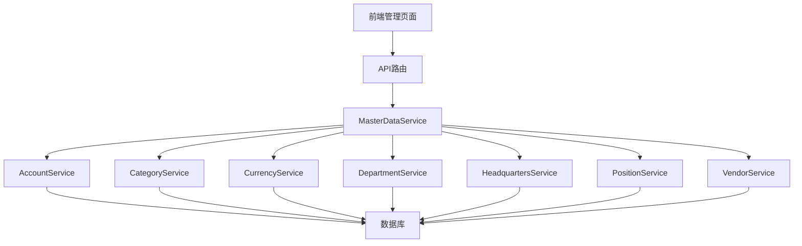

**图表来源**
- [MasterDataService.ts](file://backend/src/services/MasterDataService.ts)
- [AccountService.ts](file://backend/src/services/AccountService.ts)
- [CategoryService.ts](file://backend/src/services/CategoryService.ts)
- [CurrencyService.ts](file://backend/src/services/CurrencyService.ts)
- [DepartmentService.ts](file://backend/src/services/DepartmentService.ts)
- [HeadquartersService.ts](file://backend/src/services/HeadquartersService.ts)
- [PositionService.ts](file://backend/src/services/PositionService.ts)
- [VendorService.ts](file://backend/src/services/VendorService.ts)
- [master-data.ts](file://backend/src/routes/v2/master-data.ts)

## 详细组件分析

### 主数据服务分析
`MasterDataService`是主数据管理的核心，它通过组合多个具体服务来提供统一的接口。每个具体服务负责管理一个主数据实体。

#### 主数据服务类图
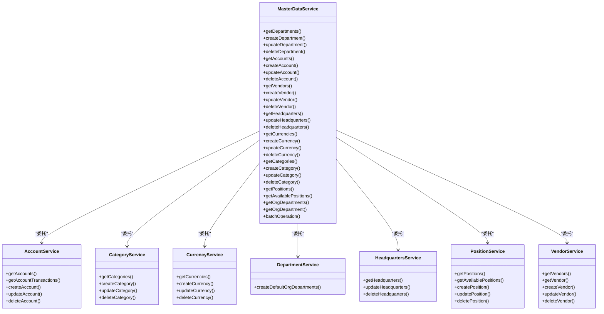

**图表来源**
- [MasterDataService.ts](file://backend/src/services/MasterDataService.ts)
- [AccountService.ts](file://backend/src/services/AccountService.ts)
- [CategoryService.ts](file://backend/src/services/CategoryService.ts)
- [CurrencyService.ts](file://backend/src/services/CurrencyService.ts)
- [DepartmentService.ts](file://backend/src/services/DepartmentService.ts)
- [HeadquartersService.ts](file://backend/src/services/HeadquartersService.ts)
- [PositionService.ts](file://backend/src/services/PositionService.ts)
- [VendorService.ts](file://backend/src/services/VendorService.ts)

**章节来源**
- [MasterDataService.ts](file://backend/src/services/MasterDataService.ts)
- [AccountService.ts](file://backend/src/services/AccountService.ts)
- [CategoryService.ts](file://backend/src/services/CategoryService.ts)
- [CurrencyService.ts](file://backend/src/services/CurrencyService.ts)
- [DepartmentService.ts](file://backend/src/services/DepartmentService.ts)
- [HeadquartersService.ts](file://backend/src/services/HeadquartersService.ts)
- [PositionService.ts](file://backend/src/services/PositionService.ts)
- [VendorService.ts](file://backend/src/services/VendorService.ts)

### 账户服务分析
`AccountService`负责管理账户实体，包括账户的创建、更新、删除和查询。账户与币种关联，确保账户的币种有效性。

#### 账户服务数据模型
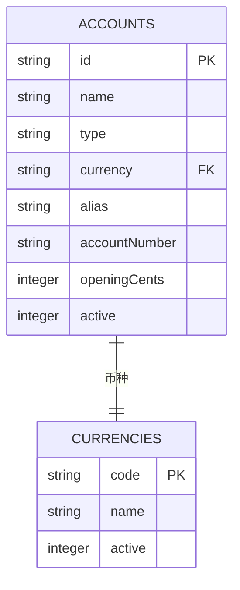

**图表来源**
- [schema.ts](file://backend/src/db/schema.ts)

**章节来源**
- [AccountService.ts](file://backend/src/services/AccountService.ts)
- [schema.ts](file://backend/src/db/schema.ts)

### 分类服务分析
`CategoryService`负责管理分类实体，支持树形结构，允许分类有父分类。

#### 分类服务数据模型
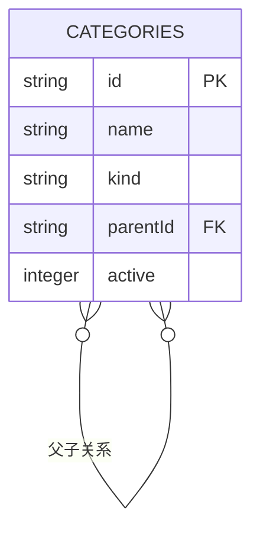

**图表来源**
- [schema.ts](file://backend/src/db/schema.ts)

**章节来源**
- [CategoryService.ts](file://backend/src/services/CategoryService.ts)
- [schema.ts](file://backend/src/db/schema.ts)

### 币种服务分析
`CurrencyService`负责管理币种实体，支持创建、更新、删除和查询币种。

#### 币种服务数据模型
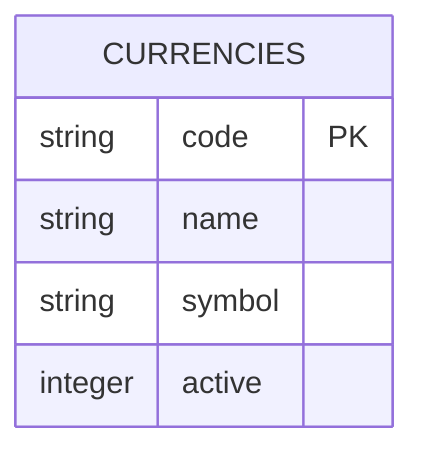

**图表来源**
- [schema.ts](file://backend/src/db/schema.ts)

**章节来源**
- [CurrencyService.ts](file://backend/src/services/CurrencyService.ts)
- [schema.ts](file://backend/src/db/schema.ts)

### 部门服务分析
`DepartmentService`负责管理项目部门，支持创建默认的组织部门。

#### 部门服务数据模型
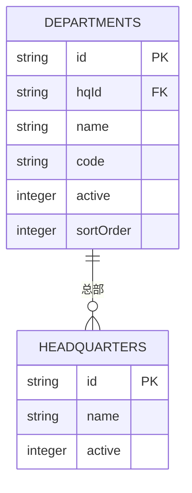

**图表来源**
- [schema.ts](file://backend/src/db/schema.ts)

**章节来源**
- [DepartmentService.ts](file://backend/src/services/DepartmentService.ts)
- [schema.ts](file://backend/src/db/schema.ts)

### 总部服务分析
`HeadquartersService`负责管理总部实体，支持更新和删除总部。

#### 总部服务数据模型
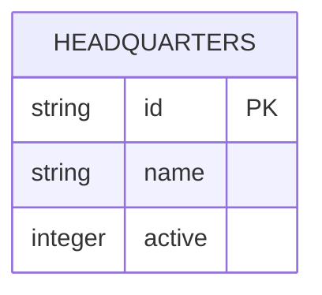

**图表来源**
- [schema.ts](file://backend/src/db/schema.ts)

**章节来源**
- [HeadquartersService.ts](file://backend/src/services/HeadquartersService.ts)
- [schema.ts](file://backend/src/db/schema.ts)

### 职位服务分析
`PositionService`负责管理职位实体，支持根据组织部门获取可用的职位。

#### 职位服务数据模型
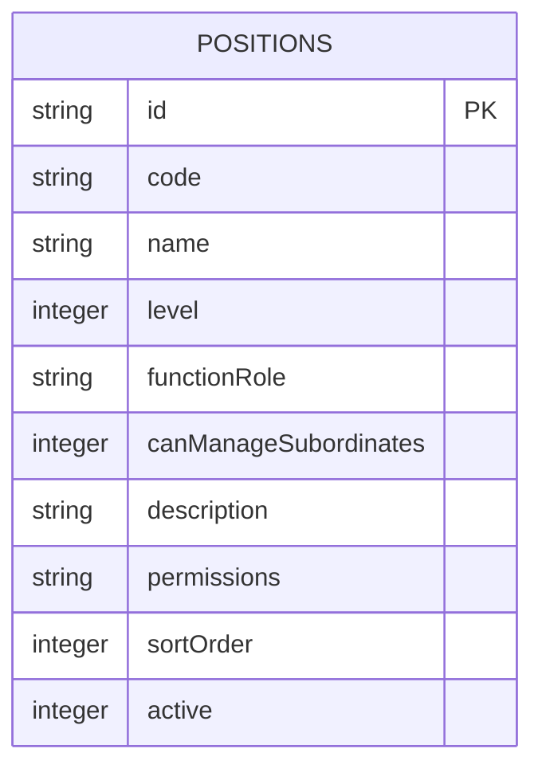

**图表来源**
- [schema.ts](file://backend/src/db/schema.ts)

**章节来源**
- [PositionService.ts](file://backend/src/services/PositionService.ts)
- [schema.ts](file://backend/src/db/schema.ts)

### 供应商服务分析
`VendorService`负责管理供应商实体，支持创建、更新、删除和查询供应商。

#### 供应商服务数据模型
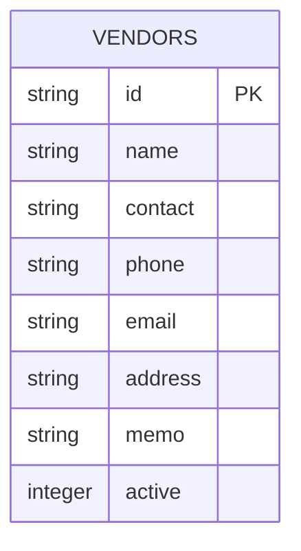

**图表来源**
- [schema.ts](file://backend/src/db/schema.ts)

**章节来源**
- [VendorService.ts](file://backend/src/services/VendorService.ts)
- [schema.ts](file://backend/src/db/schema.ts)

## 依赖分析

主数据管理模块的依赖关系清晰，`MasterDataService`依赖于多个具体服务，每个具体服务又依赖于数据库。

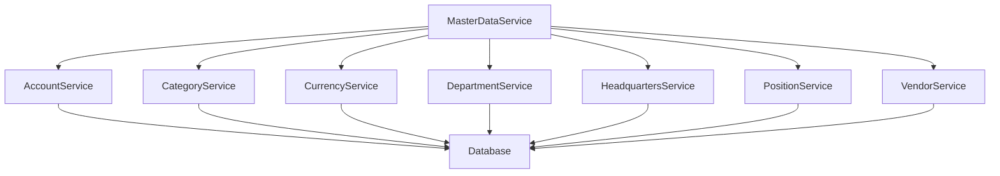

**图表来源**
- [MasterDataService.ts](file://backend/src/services/MasterDataService.ts)
- [AccountService.ts](file://backend/src/services/AccountService.ts)
- [CategoryService.ts](file://backend/src/services/CategoryService.ts)
- [CurrencyService.ts](file://backend/src/services/CurrencyService.ts)
- [DepartmentService.ts](file://backend/src/services/DepartmentService.ts)
- [HeadquartersService.ts](file://backend/src/services/HeadquartersService.ts)
- [PositionService.ts](file://backend/src/services/PositionService.ts)
- [VendorService.ts](file://backend/src/services/VendorService.ts)

**章节来源**
- [MasterDataService.ts](file://backend/src/services/MasterDataService.ts)
- [AccountService.ts](file://backend/src/services/AccountService.ts)
- [CategoryService.ts](file://backend/src/services/CategoryService.ts)
- [CurrencyService.ts](file://backend/src/services/CurrencyService.ts)
- [DepartmentService.ts](file://backend/src/services/DepartmentService.ts)
- [HeadquartersService.ts](file://backend/src/services/HeadquartersService.ts)
- [PositionService.ts](file://backend/src/services/PositionService.ts)
- [VendorService.ts](file://backend/src/services/VendorService.ts)

## 性能考虑

主数据管理模块在设计时考虑了性能优化，例如在查询账户时使用左连接获取币种名称，避免了多次数据库查询。同时，使用索引优化查询性能。

## 故障排除指南

### 常见问题及解决方案
1. **无法删除账户**：检查该账户是否有流水记录，如果有流水记录，则无法删除。
2. **无法删除币种**：检查该币种是否有账户使用，如果有账户使用，则无法删除。
3. **无法删除分类**：检查该分类是否有流水记录，如果有流水记录，则无法删除。
4. **无法删除供应商**：检查该供应商是否有相关业务记录，如果有相关业务记录，则无法删除。

**章节来源**
- [AccountService.ts](file://backend/src/services/AccountService.ts)
- [CurrencyService.ts](file://backend/src/services/CurrencyService.ts)
- [CategoryService.ts](file://backend/src/services/CategoryService.ts)
- [VendorService.ts](file://backend/src/services/VendorService.ts)

## 结论

主数据管理模块通过`MasterDataService`门面服务，有效地整合了多个具体服务，提供了统一的主数据访问接口。各主数据实体的设计合理，业务规则清晰，CRUD操作实现完善。前端管理页面为系统管理员提供了便捷的配置流程，批量操作功能提高了管理效率。整体架构清晰，性能优化得当，为系统的稳定运行提供了保障。

## 附录

### 批量操作API使用示例
```typescript
// 批量启用/禁用币种
const results = await masterDataService.batchOperation('currency', ['USD', 'EUR'], 'activate')
// results: { successCount: 2, failureCount: 0, failures: [] }
```

**章节来源**
- [MasterDataService.ts](file://backend/src/services/MasterDataService.ts)