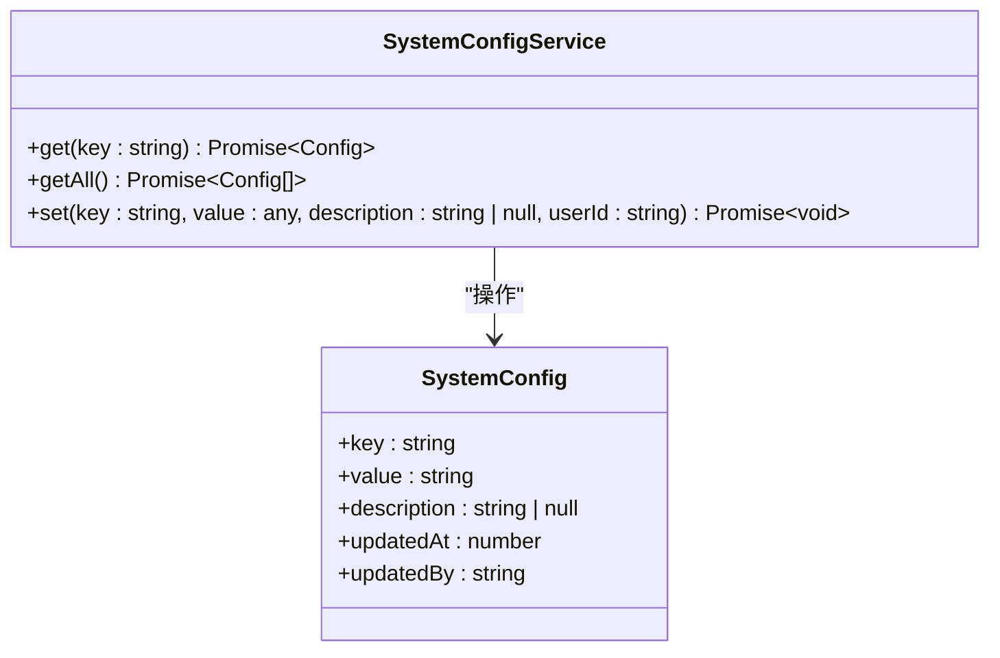
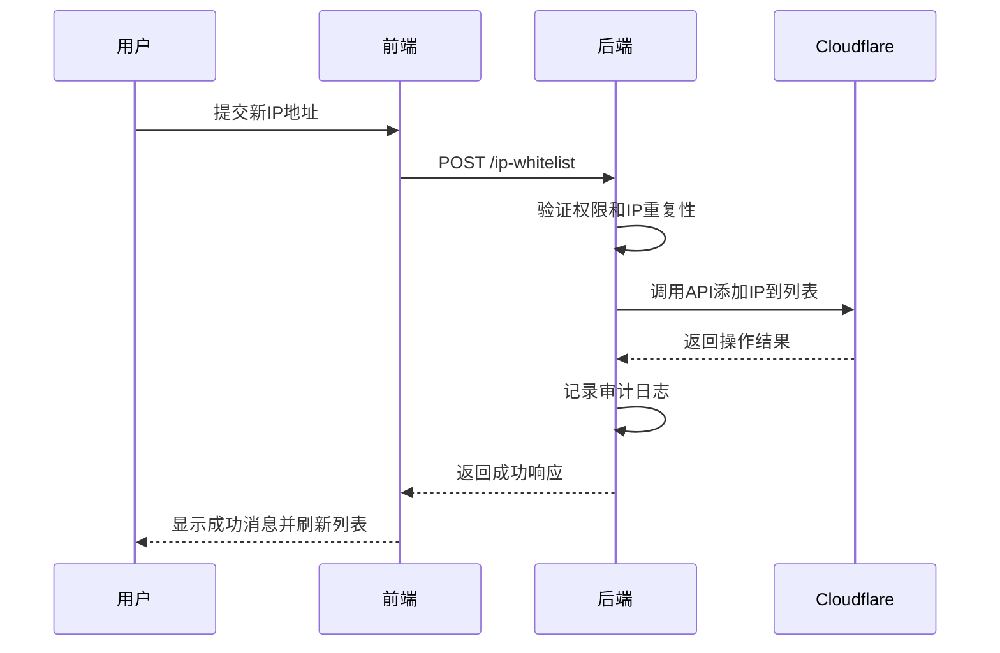

# 系统设置

<cite>
**本文档引用文件**   
- [MasterDataService.ts](file://backend/src/services/MasterDataService.ts)
- [system-config.ts](file://backend/src/routes/v2/system-config.ts)
- [SystemConfigService.ts](file://backend/src/services/SystemConfigService.ts)
- [ip-whitelist.ts](file://backend/src/routes/v2/ip-whitelist.ts)
- [IPWhitelistService.ts](file://backend/src/services/IPWhitelistService.ts)
- [position-permissions.ts](file://backend/src/routes/v2/position-permissions.ts)
- [PermissionService.ts](file://backend/src/services/PermissionService.ts)
- [permissions.ts](file://backend/src/utils/permissions.ts)
- [schema.ts](file://backend/src/db/schema.ts)
- [IPWhitelistManagementPage.tsx](file://frontend/src/features/system/pages/IPWhitelistManagementPage.tsx)
- [PositionPermissionsManagementPage.tsx](file://frontend/src/features/system/pages/PositionPermissionsManagementPage.tsx)
- [useIPWhitelist.ts](file://frontend/src/hooks/business/useIPWhitelist.ts)
- [useSystemConfig.ts](file://frontend/src/hooks/business/useSystemConfig.ts)
- [business.schema.ts](file://backend/src/schemas/business.schema.ts)
</cite>

## 目录
1. [主数据管理](#主数据管理)
2. [系统配置管理](#系统配置管理)
3. [IP白名单管理](#ip白名单管理)
4. [职位权限管理](#职位权限管理)
5. [前端管理页面](#前端管理页面)
6. [API使用说明](#api使用说明)
7. [安全最佳实践](#安全最佳实践)

## 主数据管理

主数据管理模块通过`MasterDataService`服务类实现，采用门面模式统一管理账户、分类、币种、部门、职位、供应商等核心主数据。该服务作为协调器，将具体操作委托给各个专用服务类，确保业务逻辑的单一职责和代码复用。

`MasterDataService`通过构造函数注入数据库实例，并初始化多个子服务，包括`AccountService`（账户服务）、`CategoryService`（分类服务）、`CurrencyService`（币种服务）、`DepartmentService`（部门服务）、`PositionService`（职位服务）和`VendorService`（供应商服务）。每个子服务负责特定主数据实体的CRUD操作，如创建、更新、删除和查询。

主数据的路由通过`master-data.ts`文件组织，采用模块化设计，将不同类型的主数据操作挂载到各自的子路由下。例如，账户管理路由挂载在`/accounts`路径下，币种管理路由挂载在`/currencies`路径下。这种设计使得API结构清晰，易于维护和扩展。

**Section sources**
- [MasterDataService.ts](file://backend/src/services/MasterDataService.ts#L1-L261)
- [master-data.ts](file://backend/src/routes/v2/master-data.ts#L1-L23)

## 系统配置管理

系统配置管理模块提供了一个灵活的键值对存储系统，用于管理应用的全局配置项。该功能由`SystemConfigService`服务类和`system-config.ts`路由文件共同实现。

`SystemConfigService`服务类提供了`get`、`getAll`、`set`三个核心方法。`get`方法根据配置键查询单个配置项，`getAll`方法获取所有配置项，`set`方法用于创建或更新配置项。配置值以JSON字符串形式存储在数据库中，支持任意复杂的数据结构。`set`方法使用`onConflictDoUpdate`策略，确保在键冲突时自动更新现有记录，避免了重复插入的异常。

系统配置的API设计遵循RESTful原则，支持对配置项的全面管理：
- `GET /system-config`：获取所有系统配置
- `GET /system-config/{key}`：获取指定键的配置
- `PUT /system-config/{key}`：更新或创建指定键的配置

所有配置操作都受到严格的权限控制，只有拥有`system.config.update`权限的用户才能修改配置。每次配置更新都会记录审计日志，包含操作类型、实体、实体ID和详细信息，便于追踪变更历史。



**Diagram sources **
- [SystemConfigService.ts](file://backend/src/services/SystemConfigService.ts#L1-L61)
- [schema.ts](file://backend/src/db/schema.ts#L3-L9)

**Section sources**
- [SystemConfigService.ts](file://backend/src/services/SystemConfigService.ts#L1-L61)
- [system-config.ts](file://backend/src/routes/v2/system-config.ts#L1-L243)

## IP白名单管理

IP白名单管理模块通过与Cloudflare API集成，实现对访问来源IP地址的精细化控制。该功能由`IPWhitelistService`服务类和`ip-whitelist.ts`路由文件构成，提供了一套完整的IP地址管理API。

`IPWhitelistService`服务类封装了与Cloudflare的交互逻辑，包括获取IP列表、添加/删除IP、批量操作和规则状态管理。所有IP地址操作都通过Cloudflare的Lists和Rulesets功能实现。服务类首先检查本地是否存在重复IP，然后调用Cloudflare API进行实际操作。成功后，返回包含IP地址、描述和Cloudflare规则ID的标准化对象。

IP白名单的核心功能包括：
- **IP地址管理**：支持单个和批量添加/删除IP地址
- **规则控制**：可以创建、启用/禁用IP白名单规则
- **状态同步**：提供手动同步功能，确保本地视图与Cloudflare状态一致

前端管理页面`IPWhitelistManagementPage.tsx`提供了直观的用户界面，支持通过表单添加单个IP，或通过文本框批量导入多个IP。页面顶部显示自定义规则的启用状态，并提供一键切换开关。用户可以对IP列表进行刷新、同步、批量删除等操作。



**Diagram sources **
- [IPWhitelistService.ts](file://backend/src/services/IPWhitelistService.ts#L1-L141)
- [ip-whitelist.ts](file://backend/src/routes/v2/ip-whitelist.ts#L1-L415)

**Section sources**
- [IPWhitelistService.ts](file://backend/src/services/IPWhitelistService.ts#L1-L141)
- [ip-whitelist.ts](file://backend/src/routes/v2/ip-whitelist.ts#L1-L415)
- [IPWhitelistManagementPage.tsx](file://frontend/src/features/system/pages/IPWhitelistManagementPage.tsx#L1-L343)
- [useIPWhitelist.ts](file://frontend/src/hooks/business/useIPWhitelist.ts#L1-L152)

## 职位权限管理

职位权限管理模块实现了基于角色的访问控制（RBAC），通过职位（Position）来定义用户的权限。该系统由`PermissionService`、`PositionService`和前端管理页面共同构成，支持细粒度的权限分配。

权限模型基于一个六职位体系：总部主管、总部专员、项目主管、项目专员、组长、工程师。每个职位拥有不同的层级（level）和管理权限。权限配置以JSON格式存储在`positions`表的`permissions`字段中，结构清晰，易于扩展。权限分为模块（module）、子模块（subModule）和操作（action）三个层级，例如`finance.flow.view`表示财务模块中资金流水的查看权限。

权限检查通过`hasPermission`工具函数实现。该函数首先验证用户所在部门是否允许访问目标模块，然后检查用户职位是否拥有具体的操作权限。数据访问范围也根据职位层级进行过滤：总部人员可访问所有数据，项目人员只能访问本项目数据，组长只能访问本组数据，工程师只能访问自己的数据。

前端管理页面`PositionPermissionsManagementPage.tsx`提供了权限配置的可视化界面。系统管理员可以查看所有职位的权限摘要，并通过展开面板查看详细权限。权限编辑采用树形结构，支持按模块和子模块批量勾选操作权限，操作直观高效。

```mermaid
classDiagram
class Position {
+id : string
+code : string
+name : string
+level : number
+functionRole : string
+canManageSubordinates : number
+permissions : JSON
+active : number
}
class PermissionService {
+canViewEmployee(actor, actorPosition, targetEmployeeId) Promise~boolean~
+canApproveApplication(actor, actorPosition, applicantEmployeeId) Promise~boolean~
+canApprove(actorId, applicantId) Promise~boolean~
}
class permissions {
+hasPermission(c, module, subModule, action) boolean
+getDataAccessFilter(c, tableAlias, options) {where : string, binds : any[]}
}
Position --> PermissionService : "定义"
PermissionService --> permissions : "使用"
```

**Diagram sources **
- [PositionService.ts](file://backend/src/services/PositionService.ts)
- [PermissionService.ts](file://backend/src/services/PermissionService.ts#L1-L147)
- [permissions.ts](file://backend/src/utils/permissions.ts#L1-L273)
- [schema.ts](file://backend/src/db/schema.ts#L50-L63)

**Section sources**
- [PermissionService.ts](file://backend/src/services/PermissionService.ts#L1-L147)
- [permissions.ts](file://backend/src/utils/permissions.ts#L1-L273)
- [position-permissions.ts](file://backend/src/routes/v2/position-permissions.ts#L1-L252)
- [PositionPermissionsManagementPage.tsx](file://frontend/src/features/system/pages/PositionPermissionsManagementPage.tsx#L1-L457)

## 前端管理页面

系统设置模块的前端管理页面采用React和Ant Design组件库构建，提供了直观、易用的用户界面。所有管理页面均位于`frontend/src/features/system/pages/`目录下，遵循统一的设计规范。

IP白名单管理页面（`IPWhitelistManagementPage.tsx`）以卡片形式展示规则状态，清晰地显示规则是否启用。IP列表采用表格展示，支持刷新、同步、批量删除和批量添加等操作。批量添加功能允许管理员通过文本框粘贴多行IP地址，极大地提高了配置效率。

职位权限管理页面（`PositionPermissionsManagementPage.tsx`）将复杂的权限配置可视化。每个职位在表格中显示其权限摘要，点击“编辑”按钮可展开一个大型模态框，在其中通过树形复选框精确配置每个模块的权限。权限详情支持展开查看，方便管理员进行审计。

所有管理页面都集成了错误处理和成功提示，通过`withErrorHandler`高阶函数统一处理API调用的异常情况，确保用户体验的一致性。

**Section sources**
- [IPWhitelistManagementPage.tsx](file://frontend/src/features/system/pages/IPWhitelistManagementPage.tsx#L1-L343)
- [PositionPermissionsManagementPage.tsx](file://frontend/src/features/system/pages/PositionPermissionsManagementPage.tsx#L1-L457)

## API使用说明

系统设置模块提供了RESTful API，所有端点均以`/v2`为前缀。API使用JSON Web Token (JWT)进行身份验证，并通过`hasPermission`中间件进行权限校验。

### 系统配置API
- `GET /system-config`：获取所有配置。需要`system.config.view`权限。
- `GET /system-config/{key}`：获取指定配置。需要`system.config.view`权限。
- `PUT /system-config/{key}`：更新配置。需要`system.config.update`权限，请求体包含`value`和可选的`description`。

### IP白名单API
- `GET /ip-whitelist`：获取IP列表。需要`system.config.update`权限。
- `POST /ip-whitelist`：添加单个IP。需要`system.config.update`权限，请求体包含`ipAddress`和可选的`description`。
- `POST /ip-whitelist/batch`：批量添加IP。需要`system.config.update`权限，请求体包含`ips`数组。
- `POST /ip-whitelist/rule/toggle`：启用/禁用规则。需要`system.config.update`权限，请求体包含`enabled`布尔值。

### 职位权限API
- `GET /position-permissions`：获取所有职位。需要`system.position.view`权限。
- `PUT /position-permissions/{id}`：更新职位权限。需要`system.position.update`权限，请求体包含`permissions` JSON对象。

**Section sources**
- [system-config.ts](file://backend/src/routes/v2/system-config.ts#L1-L243)
- [ip-whitelist.ts](file://backend/src/routes/v2/ip-whitelist.ts#L1-L415)
- [position-permissions.ts](file://backend/src/routes/v2/position-permissions.ts#L1-L252)

## 安全最佳实践

1. **最小权限原则**：为每个职位分配完成其工作所需的最小权限，避免权限过度分配。
2. **IP白名单保护**：始终启用IP白名单规则，仅允许受信任的IP地址访问系统，特别是在生产环境中。
3. **定期审计**：利用审计日志功能，定期审查关键配置的变更历史，及时发现异常操作。
4. **密码策略**：确保所有用户使用强密码，并启用双因素认证（2FA）以增强账户安全。
5. **敏感数据保护**：对包含敏感信息的权限（如`view_sensitive`）进行严格控制，仅授予必要人员。
6. **定期更新**：保持系统和依赖库的最新状态，及时修补已知的安全漏洞。

**Section sources**
- [security.ts](file://backend/src/middleware/security.ts#L1-L81)
- [permissions.ts](file://backend/src/utils/permissions.ts#L1-L273)
- [audit.ts](file://backend/src/utils/audit.ts)