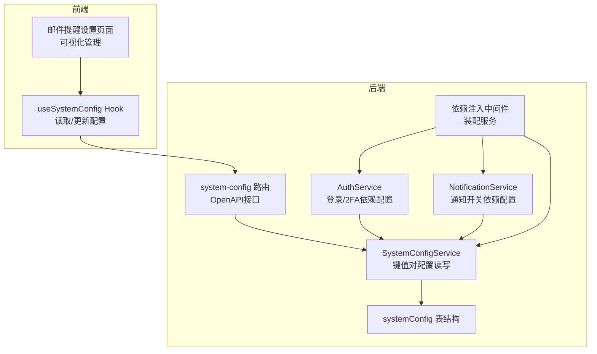
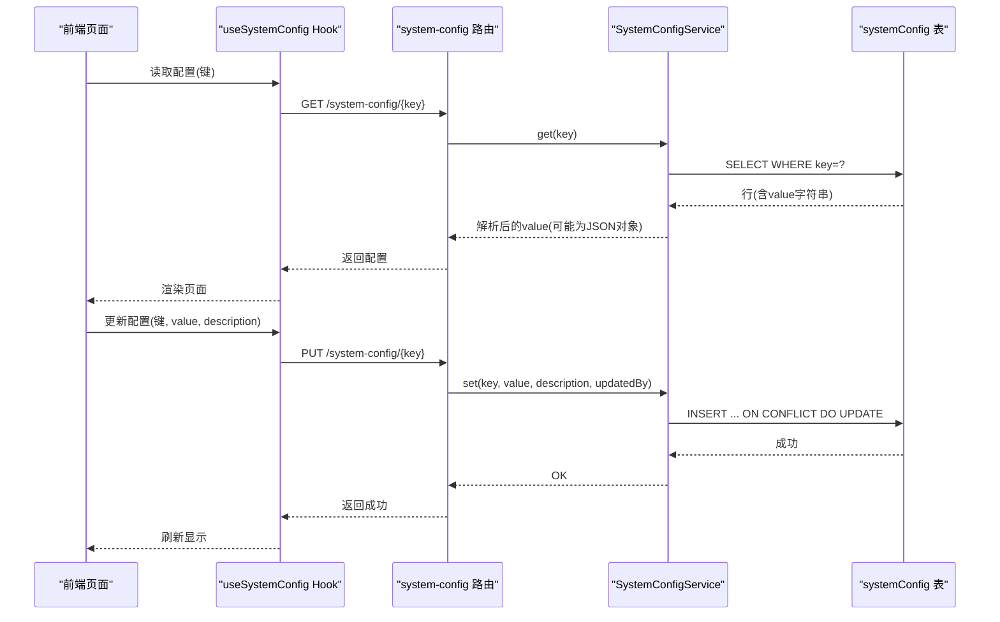
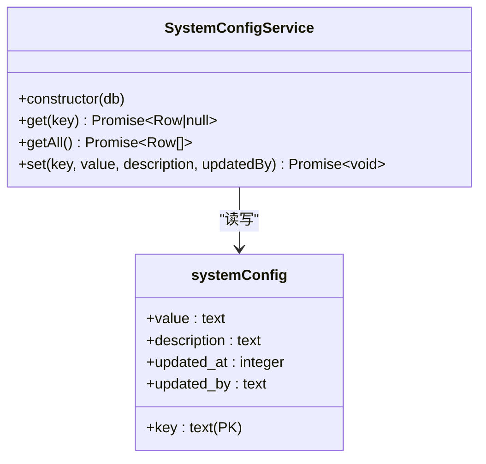
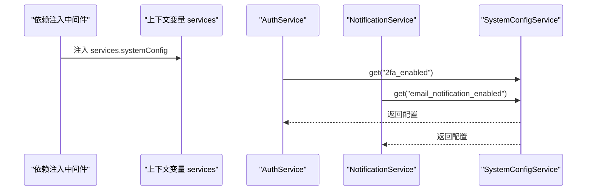
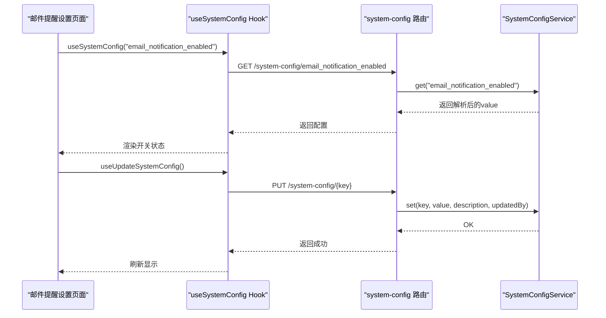
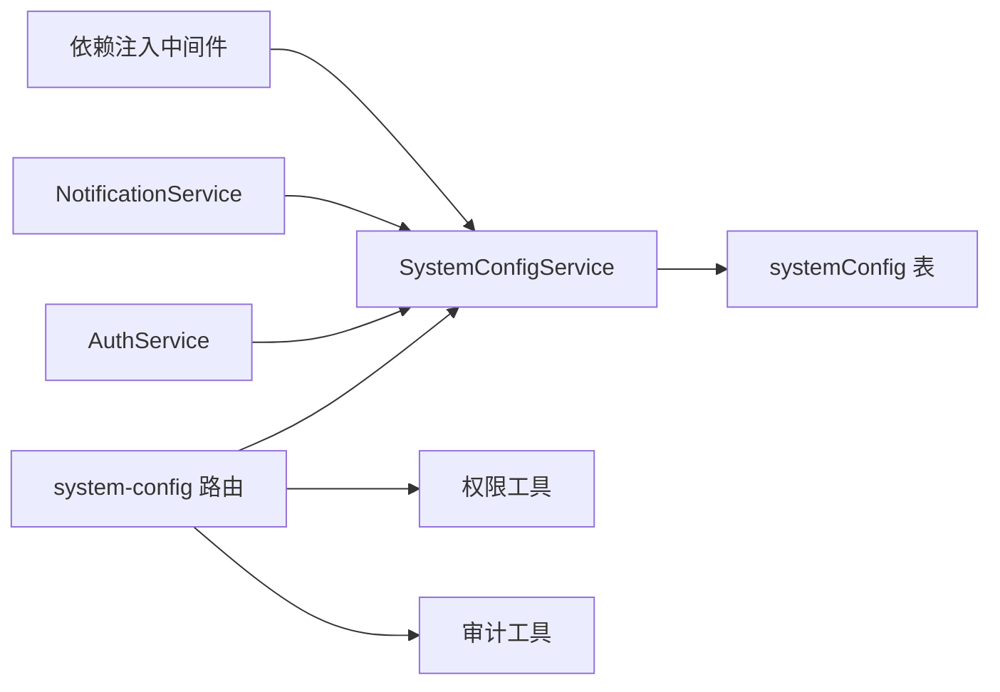

# 系统配置

<cite>
**本文引用的文件**
- [SystemConfigService.ts](file://backend/src/services/SystemConfigService.ts)
- [system-config.ts](file://backend/src/routes/v2/system-config.ts)
- [schema.ts](file://backend/src/db/schema.ts)
- [di.ts](file://backend/src/middleware/di.ts)
- [AuthService.ts](file://backend/src/services/AuthService.ts)
- [NotificationService.ts](file://backend/src/services/NotificationService.ts)
- [business.schema.ts](file://backend/src/schemas/business.schema.ts)
- [useSystemConfig.ts](file://frontend/src/hooks/business/useSystemConfig.ts)
- [EmailNotificationSettingsPage.tsx](file://frontend/src/features/system/pages/EmailNotificationSettingsPage.tsx)
- [SystemConfigService.test.ts](file://backend/test/services/SystemConfigService.test.ts)
- [system-config.test.ts](file://backend/test/system-config.test.ts)
</cite>

## 目录
1. [简介](#简介)
2. [项目结构](#项目结构)
3. [核心组件](#核心组件)
4. [架构总览](#架构总览)
5. [详细组件分析](#详细组件分析)
6. [依赖关系分析](#依赖关系分析)
7. [性能与可靠性](#性能与可靠性)
8. [故障排查指南](#故障排查指南)
9. [结论](#结论)
10. [附录](#附录)

## 简介
本文件围绕系统配置模块进行深入文档化，重点阐述 SystemConfigService 基于键值对存储的配置管理机制，覆盖以下主题：
- 配置项的存储结构（systemConfig 表）
- JSON 序列化与反序列化处理
- 更新审计（updatedBy、updatedAt）
- 多服务依赖注入（AuthService、NotificationService）
- 实际应用场景（如邮件通知开关）
- 前端配置页面的可视化管理流程
- 动态配置读取与更新的 API 调用示例
- 配置项清单、安全访问控制策略与配置变更的副作用分析

## 项目结构
系统配置模块由后端服务层、路由层、数据库层以及前端 Hook 页面共同组成，采用依赖注入方式在运行时装配，确保各服务对配置的读写解耦。



图表来源
- [SystemConfigService.ts](file://backend/src/services/SystemConfigService.ts#L1-L61)
- [system-config.ts](file://backend/src/routes/v2/system-config.ts#L1-L243)
- [schema.ts](file://backend/src/db/schema.ts#L1-L12)
- [di.ts](file://backend/src/middleware/di.ts#L41-L155)
- [AuthService.ts](file://backend/src/services/AuthService.ts#L1-L120)
- [NotificationService.ts](file://backend/src/services/NotificationService.ts#L1-L130)
- [useSystemConfig.ts](file://frontend/src/hooks/business/useSystemConfig.ts#L1-L41)
- [EmailNotificationSettingsPage.tsx](file://frontend/src/features/system/pages/EmailNotificationSettingsPage.tsx#L1-L76)

章节来源
- [di.ts](file://backend/src/middleware/di.ts#L41-L155)
- [schema.ts](file://backend/src/db/schema.ts#L1-L12)

## 核心组件
- SystemConfigService：提供 get、getAll、set 三个核心方法，负责键值对配置的读取、批量读取与更新，并自动处理 JSON 序列化/反序列化与审计字段。
- system-config 路由：提供 OpenAPI 接口，包括按键读取、批量读取、按键更新、邮件通知开关查询等。
- 依赖注入：在中间件中统一创建 SystemConfigService，并注入到上下文中供路由与服务使用。
- 业务服务依赖：AuthService 与 NotificationService 在运行时通过 SystemConfigService 读取系统配置，实现 2FA 强制策略与邮件通知开关控制。
- 前端 Hook 与页面：useSystemConfig Hook 提供读取与更新配置的能力，EmailNotificationSettingsPage 页面提供可视化开关与说明。

章节来源
- [SystemConfigService.ts](file://backend/src/services/SystemConfigService.ts#L1-L61)
- [system-config.ts](file://backend/src/routes/v2/system-config.ts#L1-L243)
- [di.ts](file://backend/src/middleware/di.ts#L41-L155)
- [AuthService.ts](file://backend/src/services/AuthService.ts#L73-L104)
- [NotificationService.ts](file://backend/src/services/NotificationService.ts#L1-L130)
- [useSystemConfig.ts](file://frontend/src/hooks/business/useSystemConfig.ts#L1-L41)
- [EmailNotificationSettingsPage.tsx](file://frontend/src/features/system/pages/EmailNotificationSettingsPage.tsx#L1-L76)

## 架构总览
系统配置模块遵循“键值对存储 + OpenAPI 接口 + 依赖注入 + 业务服务消费”的分层设计。数据层以 SQLite 表 systemConfig 存储键值对，服务层负责序列化/反序列化与审计字段，路由层提供对外接口，业务服务通过依赖注入获取 SystemConfigService 并在运行时读取配置。



图表来源
- [system-config.ts](file://backend/src/routes/v2/system-config.ts#L113-L181)
- [SystemConfigService.ts](file://backend/src/services/SystemConfigService.ts#L9-L60)
- [schema.ts](file://backend/src/db/schema.ts#L1-L12)
- [useSystemConfig.ts](file://frontend/src/hooks/business/useSystemConfig.ts#L1-L41)

## 详细组件分析

### SystemConfigService 组件分析
- 存储结构：systemConfig 表包含 key（主键）、value（文本）、description、updated_at、updated_by 字段。
- 读取逻辑：
  - get(key)：按键查询，若存在则尝试 JSON.parse(value)，解析失败则原样返回字符串。
  - getAll()：查询全部行，逐条尝试 JSON.parse(value)。
- 写入逻辑：
  - set(key, value, description, updatedBy)：若 value 为字符串则直接保存，否则 JSON.stringify；同时写入 updated_at（毫秒时间戳）与 updated_by；使用 ON CONFLICT DO UPDATE 实现幂等更新。
- 审计字段：updated_at 与 updated_by 由调用方传入，便于审计追踪。



图表来源
- [SystemConfigService.ts](file://backend/src/services/SystemConfigService.ts#L1-L61)
- [schema.ts](file://backend/src/db/schema.ts#L1-L12)

章节来源
- [SystemConfigService.ts](file://backend/src/services/SystemConfigService.ts#L1-L61)
- [schema.ts](file://backend/src/db/schema.ts#L1-L12)

### 路由与权限控制
- OpenAPI 接口：
  - GET /system-config/email-notification/enabled：查询邮件通知开关状态。
  - GET /system-config：批量读取所有配置（需权限）。
  - GET /system-config/{key}：按键读取配置（需权限）。
  - PUT /system-config/{key}：按键更新配置（需权限）。
- 权限控制：批量读取与按键读取均要求具备 system.config.view 权限；更新要求 system.config.update 权限。
- 审计日志：更新接口记录审计动作，detail 包含 key 与 value。

```mermaid
flowchart TD
Start(["请求进入"]) --> CheckPerm["校验权限<br/>system.config.{view|update}"]
CheckPerm --> |无权限| Forbidden["返回403"]
CheckPerm --> |有权限| Dispatch{"请求方法"}
Dispatch --> |GET /system-config| GetAll["调用 service.getAll()"]
Dispatch --> |GET /system-config/{key}| GetKey["调用 service.get(key)"]
Dispatch --> |PUT /system-config/{key}| Update["调用 service.set(key, value, description, updatedBy)"]
GetAll --> ReturnAll["返回配置集合"]
GetKey --> ReturnKey["返回单个配置"]
Update --> LogAudit["记录审计动作"]
LogAudit --> ReturnOk["返回OK"]
```

图表来源
- [system-config.ts](file://backend/src/routes/v2/system-config.ts#L1-L243)
- [business.schema.ts](file://backend/src/schemas/business.schema.ts#L596-L600)

章节来源
- [system-config.ts](file://backend/src/routes/v2/system-config.ts#L1-L243)
- [business.schema.ts](file://backend/src/schemas/business.schema.ts#L596-L600)

### 依赖注入与服务消费
- 依赖注入：在中间件中创建 SystemConfigService，并注入到 c.set('services')，供后续路由与服务使用。
- 服务消费：
  - AuthService：登录时读取 2fa_enabled 配置，决定是否强制 2FA。
  - NotificationService：通知审批结果前读取 email_notification_enabled 配置，决定是否发送邮件。



图表来源
- [di.ts](file://backend/src/middleware/di.ts#L41-L155)
- [AuthService.ts](file://backend/src/services/AuthService.ts#L73-L104)
- [NotificationService.ts](file://backend/src/services/NotificationService.ts#L1-L130)

章节来源
- [di.ts](file://backend/src/middleware/di.ts#L41-L155)
- [AuthService.ts](file://backend/src/services/AuthService.ts#L73-L104)
- [NotificationService.ts](file://backend/src/services/NotificationService.ts#L1-L130)

### 前端可视化管理流程
- Hook 使用：useSystemConfig(key) 用于读取配置；useUpdateSystemConfig() 用于更新配置并触发本地缓存失效。
- 页面使用：EmailNotificationSettingsPage 页面通过 Hook 读取 email_notification_enabled，提供开关切换，更新后提示成功。
- 缓存策略：Hook 设置了 5 分钟的 staleTime，避免频繁请求。



图表来源
- [useSystemConfig.ts](file://frontend/src/hooks/business/useSystemConfig.ts#L1-L41)
- [EmailNotificationSettingsPage.tsx](file://frontend/src/features/system/pages/EmailNotificationSettingsPage.tsx#L1-L76)
- [system-config.ts](file://backend/src/routes/v2/system-config.ts#L1-L243)
- [SystemConfigService.ts](file://backend/src/services/SystemConfigService.ts#L1-L61)

章节来源
- [useSystemConfig.ts](file://frontend/src/hooks/business/useSystemConfig.ts#L1-L41)
- [EmailNotificationSettingsPage.tsx](file://frontend/src/features/system/pages/EmailNotificationSettingsPage.tsx#L1-L76)

## 依赖关系分析
- 组件耦合度：SystemConfigService 与 systemConfig 表耦合紧密，但通过 Drizzle ORM 抽象，降低对具体 SQL 的直接依赖。
- 间接依赖：AuthService 与 NotificationService 间接依赖 SystemConfigService，形成“配置驱动行为”的模式。
- 外部依赖：路由层依赖权限工具与审计工具；服务层依赖 EmailService（在通知场景）。



图表来源
- [SystemConfigService.ts](file://backend/src/services/SystemConfigService.ts#L1-L61)
- [system-config.ts](file://backend/src/routes/v2/system-config.ts#L1-L243)
- [di.ts](file://backend/src/middleware/di.ts#L41-L155)
- [AuthService.ts](file://backend/src/services/AuthService.ts#L1-L120)
- [NotificationService.ts](file://backend/src/services/NotificationService.ts#L1-L130)

章节来源
- [SystemConfigService.ts](file://backend/src/services/SystemConfigService.ts#L1-L61)
- [system-config.ts](file://backend/src/routes/v2/system-config.ts#L1-L243)
- [di.ts](file://backend/src/middleware/di.ts#L41-L155)
- [AuthService.ts](file://backend/src/services/AuthService.ts#L1-L120)
- [NotificationService.ts](file://backend/src/services/NotificationService.ts#L1-L130)

## 性能与可靠性
- 性能特征：
  - 读取：get/getAll 为单表查询，索引命中 key 主键，复杂度 O(1) 或接近 O(1)。
  - 写入：INSERT ... ON CONFLICT DO UPDATE，幂等更新，避免重复键冲突。
- 可靠性：
  - JSON 解析容错：当 value 非合法 JSON 时，get/getAll 返回原始字符串，避免异常传播。
  - 审计字段：updated_at 与 updated_by 记录更新时间与操作者，便于审计与回溯。
- 建议优化：
  - 对高频读取的配置键增加内存缓存（例如 LRU 缓存）以减少数据库访问。
  - 对批量读取接口增加分页或限制返回数量，避免一次性返回过多配置导致响应过大。

[本节为通用指导，不直接分析具体文件]

## 故障排查指南
- 常见问题与定位：
  - 配置读取为字符串而非期望对象：检查 value 是否为合法 JSON；SystemConfigService 已做容错，若非 JSON 将返回原始字符串。
  - 权限不足导致 403：确认调用方是否具备 system.config.view 或 system.config.update 权限。
  - 更新未生效：确认 updatedBy 参数是否正确传入；确认 ON CONFLICT DO UPDATE 是否按预期执行。
  - 业务服务未按预期行为：检查 AuthService/NotificationService 是否正确读取配置键（如 2fa_enabled、email_notification_enabled）。
- 测试参考：
  - SystemConfigService 单元测试覆盖 set/get/update/解析失败等场景。
  - system-config 集成测试包含初始化表与种子数据。

章节来源
- [SystemConfigService.test.ts](file://backend/test/services/SystemConfigService.test.ts#L1-L94)
- [system-config.test.ts](file://backend/test/system-config.test.ts#L1-L73)

## 结论
系统配置模块通过键值对存储与 OpenAPI 接口实现了灵活、可审计的配置管理能力。SystemConfigService 提供了简洁的读写接口与 JSON 解析容错，配合依赖注入与权限控制，使得 AuthService 与 NotificationService 等业务服务能够以配置驱动行为。前端通过 Hook 与页面实现了可视化管理，整体架构清晰、扩展性强。

[本节为总结性内容，不直接分析具体文件]

## 附录

### 配置项清单与典型用途
- email_notification_enabled
  - 类型：布尔或字符串
  - 用途：控制是否启用登录邮件提醒
  - 读取位置：NotificationService.notifyApprovalResult 前读取
  - 前端页面：邮件提醒设置页面
- 2fa_enabled
  - 类型：布尔或字符串
  - 用途：控制登录是否强制 2FA
  - 读取位置：AuthService.login 中读取
  - 默认行为：未设置时默认开启

章节来源
- [NotificationService.ts](file://backend/src/services/NotificationService.ts#L1-L130)
- [AuthService.ts](file://backend/src/services/AuthService.ts#L73-L104)
- [EmailNotificationSettingsPage.tsx](file://frontend/src/features/system/pages/EmailNotificationSettingsPage.tsx#L1-L76)

### 安全访问控制策略
- 权限模型：
  - 查看配置：system.config.view
  - 更新配置：system.config.update
- 审计日志：
  - 更新配置时记录审计动作，detail 包含 key 与 value，便于追踪变更。
- 最佳实践：
  - 限制更新权限至可信管理员；
  - 对敏感配置（如 2FA 开关）增加二次确认；
  - 对批量读取接口增加访问频率限制。

章节来源
- [system-config.ts](file://backend/src/routes/v2/system-config.ts#L98-L181)

### 配置变更的副作用分析
- 2FA 强制策略：
  - 若开启 2FA，新设备登录需验证 TOTP；若用户未绑定 TOTP，将被拒绝登录。
- 邮件通知：
  - 若关闭 email_notification_enabled，通知服务将跳过发送，不影响审批流程。
- 其他潜在影响：
  - 配置键命名需保持稳定，避免硬编码键名的服务在键名变更后失效。
  - 对于布尔型配置，注意字符串 "true"/"false" 与布尔值 true/false 的兼容判断。

章节来源
- [AuthService.ts](file://backend/src/services/AuthService.ts#L73-L104)
- [NotificationService.ts](file://backend/src/services/NotificationService.ts#L1-L130)

### API 调用示例（路径引用）
- 读取单个配置
  - GET /api/system-config/{key}
  - 示例路径：[system-config.ts](file://backend/src/routes/v2/system-config.ts#L183-L242)
- 批量读取配置
  - GET /api/system-config
  - 示例路径：[system-config.ts](file://backend/src/routes/v2/system-config.ts#L60-L111)
- 更新配置
  - PUT /api/system-config/{key}
  - 请求体 schema：[business.schema.ts](file://backend/src/schemas/business.schema.ts#L596-L600)
  - 示例路径：[system-config.ts](file://backend/src/routes/v2/system-config.ts#L113-L181)

章节来源
- [system-config.ts](file://backend/src/routes/v2/system-config.ts#L60-L242)
- [business.schema.ts](file://backend/src/schemas/business.schema.ts#L596-L600)