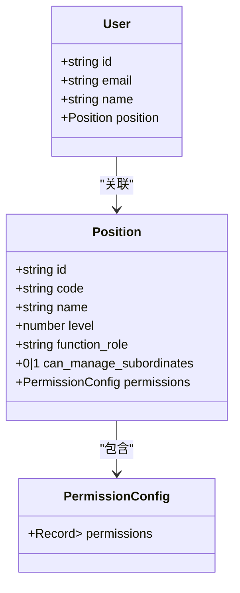
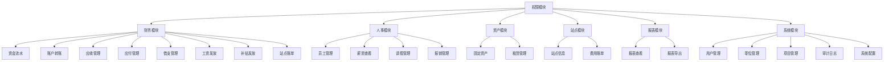
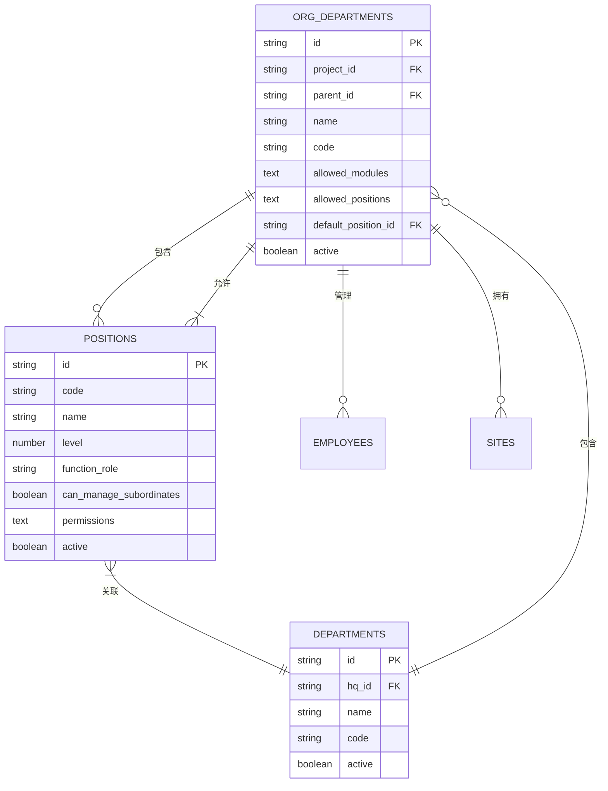
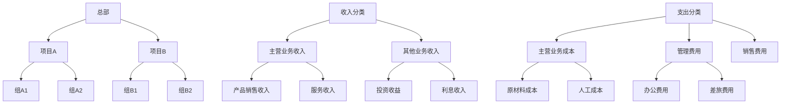
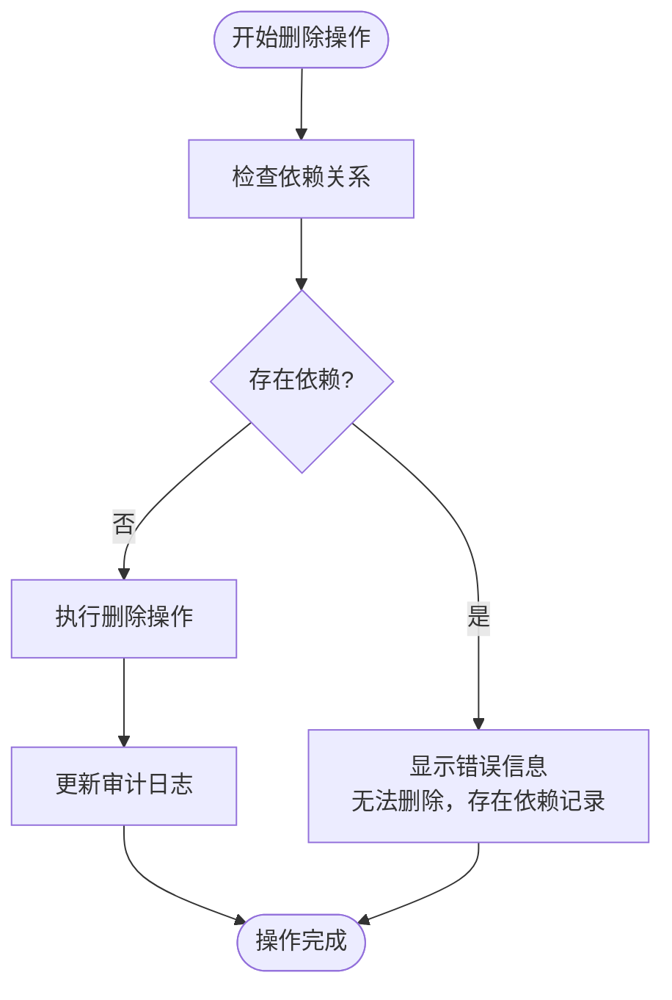
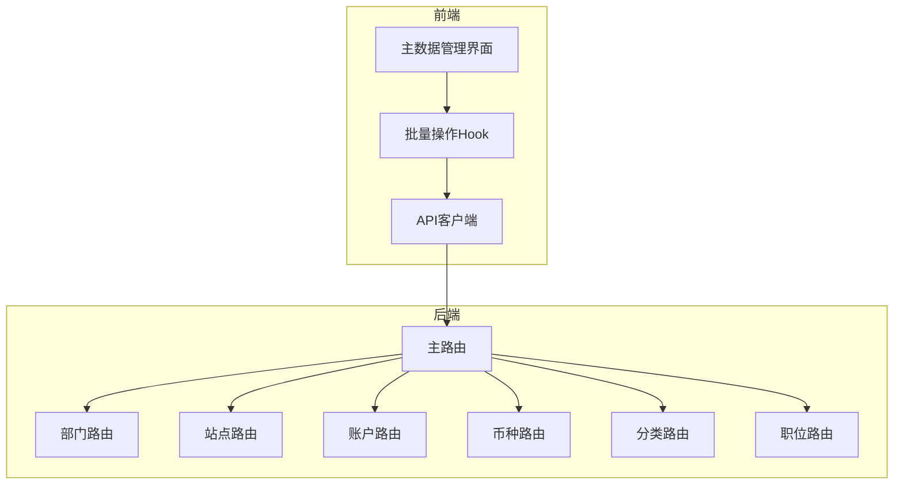

# 系统设置模块

<cite>
**本文档引用文件**   
- [PositionPermissionsManagement.tsx](file://frontend/src/features/system/pages/PositionPermissionsManagement.tsx)
- [DepartmentManagement.tsx](file://frontend/src/features/system/pages/DepartmentManagement.tsx)
- [VendorManagement.tsx](file://frontend/src/features/system/pages/VendorManagement.tsx)
- [CategoryManagement.tsx](file://frontend/src/features/system/pages/CategoryManagement.tsx)
- [CurrencyManagement.tsx](file://frontend/src/features/system/pages/CurrencyManagement.tsx)
- [master-data.ts](file://backend/src/routes/master-data.ts)
- [MasterDataService.ts](file://backend/src/services/MasterDataService.ts)
- [schema.ts](file://backend/src/db/schema.ts)
- [permissions.ts](file://frontend/src/utils/permissions.ts)
- [domain.ts](file://frontend/src/types/domain.ts)
</cite>

## 目录
1. [引言](#引言)
2. [主数据管理功能](#主数据管理功能)
3. [基于职位的权限控制系统](#基于职位的权限控制系统)
4. [部门模块权限配置](#部门模块权限配置)
5. [主数据层级结构管理](#主数据层级结构管理)
6. [数据一致性维护机制](#数据一致性维护机制)
7. [API批量操作支持](#api批量操作支持)
8. [系统预设值管理策略](#系统预设值管理策略)
9. [配置最佳实践](#配置最佳实践)

## 引言
本系统设置模块为财务管理系统的核心配置中心，提供全面的基础数据配置功能。系统通过基于职位的权限控制系统（RBAC）实现精细化的权限管理，支持部门、职位、权限、供应商、分类等主数据的全生命周期管理。所有主数据均采用层级结构设计，确保数据组织的逻辑性和可扩展性。系统通过API批量操作支持提高配置效率，并通过严格的数据一致性维护机制保障数据完整性。

**Section sources**
- [PositionPermissionsManagement.tsx](file://frontend/src/features/system/pages/PositionPermissionsManagement.tsx#L1-L454)
- [DepartmentManagement.tsx](file://frontend/src/features/system/pages/DepartmentManagement.tsx#L1-L129)

## 主数据管理功能
系统提供全面的主数据管理功能，包括部门、职位、权限、供应商、分类和币种等核心数据实体的管理。每个主数据模块均提供创建、查看、编辑和删除功能，并通过状态字段（active）支持软删除机制。主数据管理界面采用统一的设计模式，包含数据表格、操作按钮和表单模态框，确保用户体验的一致性。

### 部门管理
部门管理模块用于维护组织架构中的项目信息。系统支持创建、启用/禁用和删除部门，删除操作受数据完整性约束保护。当部门下存在站点、员工或组织部门时，系统将阻止删除操作，确保数据一致性。

**Section sources**
- [DepartmentManagement.tsx](file://frontend/src/features/system/pages/DepartmentManagement.tsx#L1-L129)
- [master-data.ts](file://backend/src/routes/master-data.ts#L1-L23)

### 供应商管理
供应商管理模块用于维护供应商信息，支持新建、编辑和删除供应商。系统提供批量删除功能，允许管理员一次性删除多个供应商。删除操作受数据完整性约束保护，当供应商存在应付账款记录时，系统将阻止删除操作。

**Section sources**
- [VendorManagement.tsx](file://frontend/src/features/system/pages/VendorManagement.tsx#L1-L167)
- [MasterDataService.ts](file://backend/src/services/MasterDataService.ts#L280-L334)

### 分类管理
分类管理模块用于维护收入和支出类别。系统支持创建收入类和支出类两种类型的分类，每种分类都有唯一的名称。删除操作受数据完整性约束保护，当分类被资金流水使用时，系统将阻止删除操作。

**Section sources**
- [CategoryManagement.tsx](file://frontend/src/features/system/pages/CategoryManagement.tsx#L1-L141)
- [MasterDataService.ts](file://backend/src/services/MasterDataService.ts#L415-L464)

### 币种管理
币种管理模块用于维护系统支持的货币类型。系统支持创建、启用/禁用和删除币种，删除操作受数据完整性约束保护。当币种被账户使用时，系统将阻止删除操作。币种代码自动转换为大写格式存储。

**Section sources**
- [CurrencyManagement.tsx](file://frontend/src/features/system/pages/CurrencyManagement.tsx#L1-L176)
- [MasterDataService.ts](file://backend/src/services/MasterDataService.ts#L363-L413)

## 基于职位的权限控制系统
系统采用基于职位的权限控制系统（RBAC），通过职位关联权限配置，实现精细化的权限管理。权限模型采用模块化设计，将系统功能划分为多个模块和子模块，每个子模块包含一组操作权限。

**Diagram sources **
- [PositionPermissionsManagement.tsx](file://frontend/src/features/system/pages/PositionPermissionsManagement.tsx#L28-L96)
- [domain.ts](file://frontend/src/types/domain.ts#L29-L48)
- [schema.ts](file://backend/src/db/schema.ts#L58-L71)

### 权限模型设计
权限模型采用三层结构：模块、子模块和操作。系统定义了财务、人事、资产、站点、报表和系统等主要模块，每个模块下包含多个子模块，每个子模块包含一组操作权限（查看、创建、编辑、删除、导出等）。权限配置以JSON格式存储在职位记录中，便于序列化和反序列化。

**Diagram sources **
- [PositionPermissionsManagement.tsx](file://frontend/src/features/system/pages/PositionPermissionsManagement.tsx#L28-L96)

### 权限配置界面
权限配置界面采用树形结构展示权限模块，支持按模块批量选择权限。界面提供权限摘要显示，以标签形式展示各模块的权限覆盖情况。编辑权限时，系统提供详细的权限选择界面，支持按子模块选择具体操作权限。

**Section sources**
- [PositionPermissionsManagement.tsx](file://frontend/src/features/system/pages/PositionPermissionsManagement.tsx#L105-L284)

## 部门模块权限配置
系统通过组织部门（org_departments）的allowed_modules字段实现部门级别的模块权限配置。每个组织部门可以配置允许访问的功能模块，从而实现不同部门（如财务部、人事部）访问不同功能的业务逻辑。

**Diagram sources **
- [schema.ts](file://backend/src/db/schema.ts#L102-L116)
- [MasterDataService.ts](file://backend/src/services/MasterDataService.ts#L548-L583)

### 业务逻辑实现
财务部门和人事部门的权限配置通过组织部门的allowed_modules字段实现。当用户访问系统时，系统根据用户所属的组织部门，加载其允许访问的模块列表。例如，财务部门的allowed_modules配置为["finance", "report"]，则该部门用户只能访问财务模块和报表模块。

**Section sources**
- [MasterDataService.ts](file://backend/src/services/MasterDataService.ts#L548-L583)
- [schema.ts](file://backend/src/db/schema.ts#L102-L116)

## 主数据层级结构管理
系统采用树形结构管理主数据的层级关系，支持多级组织架构。部门、组织部门和分类均支持层级结构，通过parent_id字段建立父子关系。系统提供层级标签显示，将数字层级转换为可读的标签（总部、项目、组）。

**Diagram sources **
- [schema.ts](file://backend/src/db/schema.ts#L102-L106)
- [schema.ts](file://backend/src/db/schema.ts#L303-L310)

### 层级结构实现
层级结构通过parent_id字段实现，每个记录可以关联到父级记录。系统在查询时通过递归或连接查询获取完整的层级路径。对于组织部门，系统支持多级嵌套，最大层级深度为3级（总部、项目、组）。

**Section sources**
- [schema.ts](file://backend/src/db/schema.ts#L102-L106)
- [schema.ts](file://backend/src/db/schema.ts#L303-L310)

## 数据一致性维护机制
系统通过多种机制维护数据一致性，包括外键约束、业务规则验证和级联操作。当删除主数据时，系统检查其依赖关系，如果存在依赖记录则阻止删除操作。系统还通过事务确保数据操作的原子性。

### 删除保护机制
系统在删除主数据时实施严格的保护机制：
- 删除部门时，检查是否存在关联的站点、员工或组织部门
- 删除供应商时，检查是否存在应付账款记录
- 删除分类时，检查是否存在资金流水记录
- 删除币种时，检查是否存在账户使用该币种

**Diagram sources **
- [MasterDataService.ts](file://backend/src/services/MasterDataService.ts#L71-L88)
- [MasterDataService.ts](file://backend/src/services/MasterDataService.ts#L326-L333)

**Section sources**
- [MasterDataService.ts](file://backend/src/services/MasterDataService.ts#L71-L88)
- [MasterDataService.ts](file://backend/src/services/MasterDataService.ts#L326-L333)

## API批量操作支持
系统通过master-data.ts路由文件统一管理主数据API，采用模块化路由设计。每个主数据类型（部门、站点、账户、币种、分类、职位等）都有独立的路由模块，通过主路由文件进行聚合。系统支持批量操作，如批量删除供应商，通过useBatchOperation Hook实现。

**Diagram sources **
- [master-data.ts](file://backend/src/routes/master-data.ts#L1-L23)
- [MasterDataService.ts](file://backend/src/services/MasterDataService.ts#L1-L608)

### 批量操作实现
批量操作通过useBatchOperation Hook实现，该Hook封装了批量操作的通用逻辑，包括loading状态管理、错误处理和选中状态清除。系统在供应商管理模块中实现了批量删除功能，用户可以选择多个供应商进行一次性删除。

**Section sources**
- [master-data.ts](file://backend/src/routes/master-data.ts#L1-L23)
- [useBatchOperation.ts](file://frontend/src/hooks/business/useBatchOperation.ts#L1-L53)

## 系统预设值管理策略
系统通过数据库迁移脚本和种子数据实现预设值管理。系统预设了常用的币种（如CNY、USD）、分类（如主营业务收入、管理费用）和职位（如财务经理、人事专员）。预设值在系统初始化时自动创建，确保系统开箱即用。

### 预设值初始化
系统预设值通过seed_local.sql脚本初始化，该脚本在数据库创建时执行。预设值包括：
- 基础币种：CNY、USD、EUR
- 收入分类：主营业务收入、其他业务收入
- 支出分类：主营业务成本、管理费用、销售费用
- 职位：财务经理、人事专员、项目经理

**Section sources**
- [seed_local.sql](file://backend/src/db/seed_local.sql)
- [schema.sql](file://backend/src/db/schema.sql)

## 配置最佳实践
为确保系统稳定运行和数据一致性，建议遵循以下配置最佳实践：

### 权限配置最佳实践
1. **最小权限原则**：为职位分配完成工作所需的最小权限集
2. **模块化配置**：按功能模块组织权限，便于管理和审计
3. **定期审查**：定期审查职位权限配置，确保权限与职责匹配
4. **层级继承**：利用组织部门的allowed_modules实现部门级权限控制

### 主数据管理最佳实践
1. **命名规范**：采用统一的命名规范，确保数据一致性
2. **状态管理**：通过active字段管理数据状态，避免硬删除
3. **层级规划**：合理规划组织层级，避免层级过深
4. **数据验证**：在创建和编辑时进行数据验证，确保数据质量

### 系统维护最佳实践
1. **备份策略**：定期备份主数据，防止数据丢失
2. **审计日志**：启用审计日志，记录关键操作
3. **性能监控**：监控主数据查询性能，优化慢查询
4. **文档记录**：记录主数据配置变更，便于追溯

**Section sources**
- [PositionPermissionsManagement.tsx](file://frontend/src/features/system/pages/PositionPermissionsManagement.tsx#L28-L96)
- [MasterDataService.ts](file://backend/src/services/MasterDataService.ts#L1-L608)
- [schema.ts](file://backend/src/db/schema.ts#L1-L644)