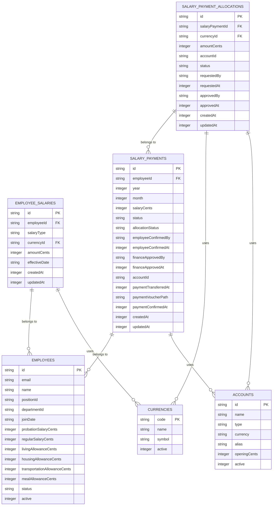
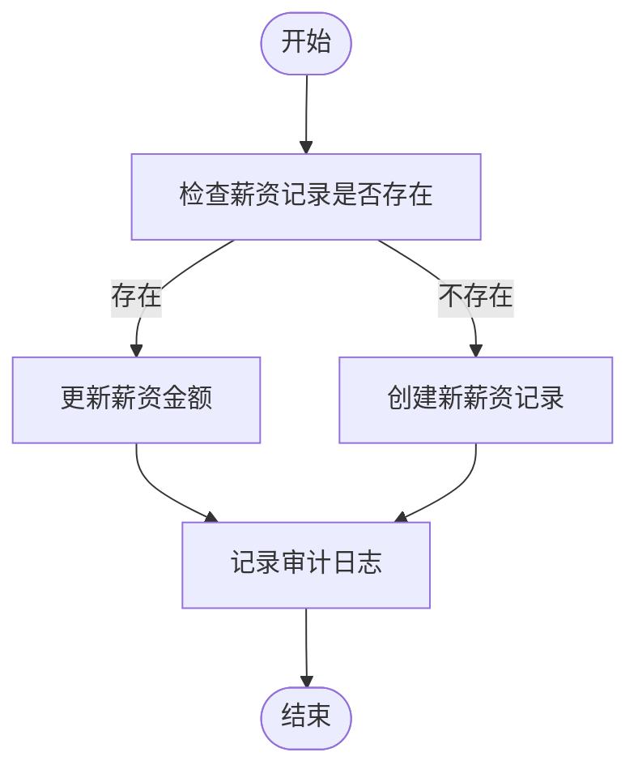
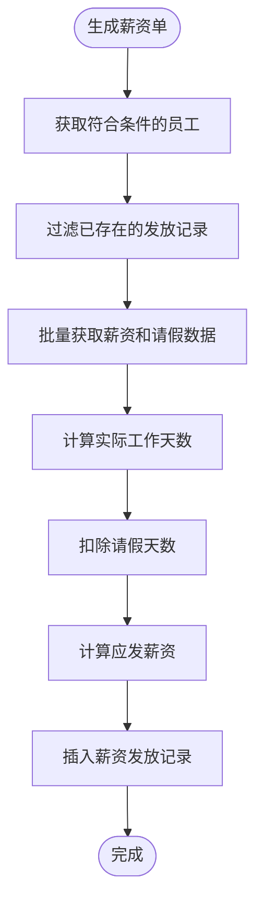
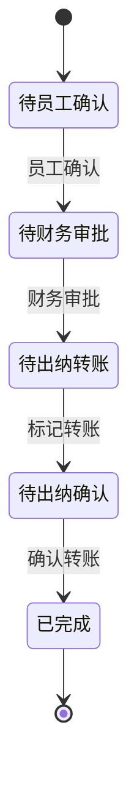
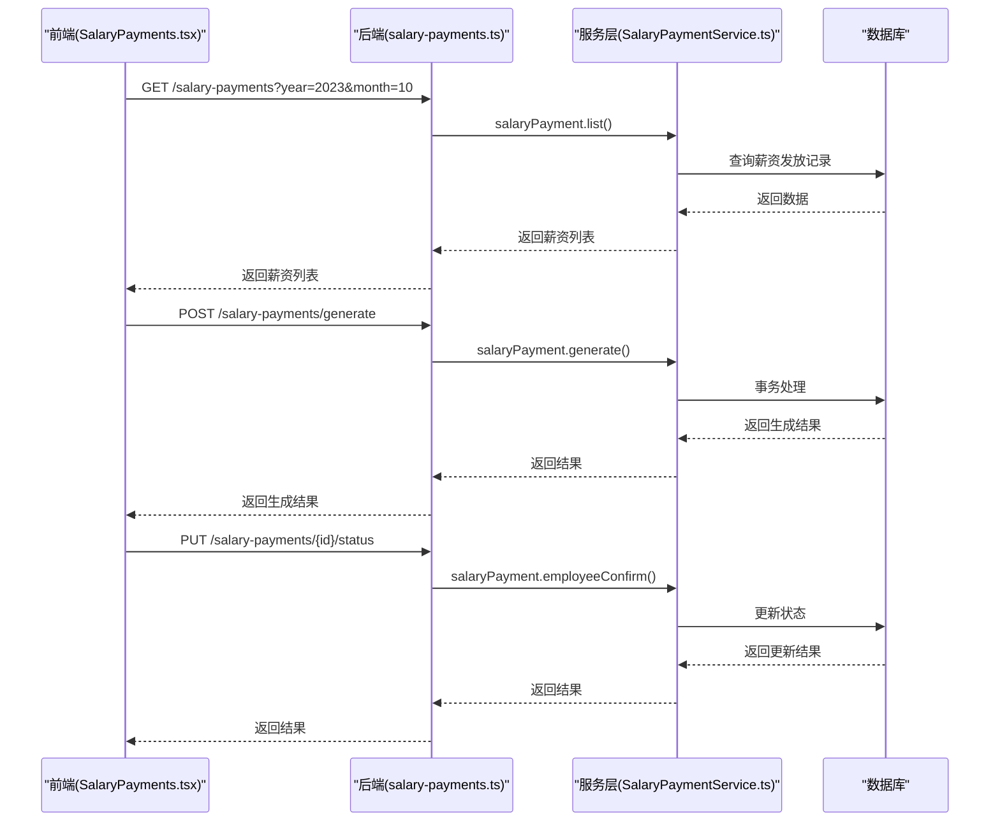
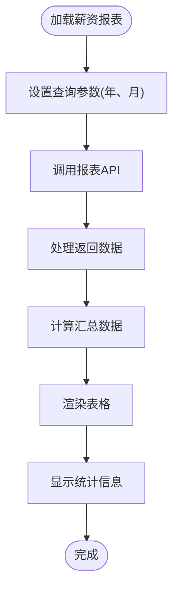

# 薪资管理模块

<cite>
**本文档引用文件**   
- [SalaryPayments.tsx](file://frontend/src/features/hr/pages/SalaryPayments.tsx)
- [employee-salaries.ts](file://backend/src/routes/employee-salaries.ts)
- [salary-payments.ts](file://backend/src/routes/salary-payments.ts)
- [SalaryPaymentService.ts](file://backend/src/services/SalaryPaymentService.ts)
- [SalaryService.ts](file://backend/src/services/SalaryService.ts)
- [schema.ts](file://backend/src/db/schema.ts)
- [business.schema.ts](file://backend/src/schemas/business.schema.ts)
- [salary.schema.ts](file://frontend/src/validations/salary.schema.ts)
- [ReportEmployeeSalary.tsx](file://frontend/src/features/reports/pages/ReportEmployeeSalary.tsx)
- [reports.ts](file://backend/src/routes/reports.ts)
</cite>

## 目录
1. [简介](#简介)
2. [薪资数据模型](#薪资数据模型)
3. [薪资结构配置](#薪资结构配置)
4. [薪资计算规则](#薪资计算规则)
5. [薪资发放流程](#薪资发放流程)
6. [前后端交互流程](#前后端交互流程)
7. [安全访问控制](#安全访问控制)
8. [历史记录查询](#历史记录查询)
9. [补贴类型配置](#补贴类型配置)
10. [批量处理技术方案](#批量处理技术方案)
11. [API调用示例](#api调用示例)
12. [常见问题排查指南](#常见问题排查指南)

## 简介
薪资管理模块是企业财务系统的核心功能之一，负责员工薪资的计算、发放、审批和记录。本模块实现了完整的薪资生命周期管理，包括薪资结构配置、薪资计算、发放流程、历史记录查询等功能。系统支持多币种薪资发放，具备灵活的审批流程和严格的安全访问控制机制。通过前后端分离架构，实现了高效的数据交互和用户体验。

**Section sources**
- [SalaryPayments.tsx](file://frontend/src/features/hr/pages/SalaryPayments.tsx#L1-L690)

## 薪资数据模型
薪资管理模块的核心数据模型包括员工薪资、薪资发放记录和薪资分配三个主要实体。



**Diagram sources**
- [schema.ts](file://backend/src/db/schema.ts#L202-L276)

## 薪资结构配置
薪资结构配置功能允许HR管理员为员工设置不同类型的薪资，包括试用期薪资和正式薪资。系统支持多币种薪资配置，每个员工可以拥有多个币种的薪资记录。

### 员工薪资配置
员工薪资配置通过`employee-salaries`接口实现，支持创建、更新和删除员工薪资记录。系统会自动处理薪资的创建和更新逻辑：如果员工已有相同类型和币种的薪资记录，则更新金额；否则创建新的薪资记录。



**Diagram sources**
- [employee-salaries.ts](file://backend/src/routes/employee-salaries.ts#L90-L154)
- [SalaryService.ts](file://backend/src/services/SalaryService.ts#L29-L63)

## 薪资计算规则
薪资计算规则是薪资管理模块的核心逻辑，系统根据员工的入职日期、工作天数、请假情况等因素自动计算应发薪资。

### 薪资计算流程
薪资计算流程包括以下几个关键步骤：
1. 获取符合条件的员工（在职且入职日期在计算月份之前）
2. 过滤已存在的薪资发放记录，避免重复生成
3. 批量获取员工的薪资和请假数据
4. 计算实际工作天数和应发薪资



**Diagram sources**
- [SalaryPaymentService.ts](file://backend/src/services/SalaryPaymentService.ts#L14-L166)

### 扣款逻辑实现
薪资计算中的扣款逻辑主要涉及请假天数的扣除。系统会查询员工在指定月份内的已批准请假记录，并计算需要扣除的工作天数。

```typescript
// 计算请假天数扣除
const leaveDaysToDeduct = 0
for (const leave of leaves) {
    if (leave.leaveType !== 'annual') {
        const leaveStart = new Date(leave.startDate + 'T00:00:00Z')
        const leaveEnd = new Date(leave.endDate + 'T00:00:00Z')
        const monthStartDate = new Date(monthStart + 'T00:00:00Z')
        const monthEndDate = new Date(monthEnd + 'T00:00:00Z')

        const overlapStart = leaveStart > monthStartDate ? leaveStart : monthStartDate
        const overlapEnd = leaveEnd < monthEndDate ? leaveEnd : monthEndDate

        if (overlapStart <= overlapEnd) {
            const overlapDays = Math.floor((overlapEnd.getTime() - overlapStart.getTime()) / (1000 * 60 * 60 * 24)) + 1
            leaveDaysToDeduct += overlapDays
        }
    }
}

workDays = Math.max(0, workDays - leaveDaysToDeduct)
const actualSalaryCents = Math.round((salaryCents * workDays) / daysInMonth)
```

**Section sources**
- [SalaryPaymentService.ts](file://backend/src/services/SalaryPaymentService.ts#L126-L147)

## 薪资发放流程
薪资发放流程采用多状态审批机制，确保薪资发放的安全性和合规性。流程包括员工确认、财务审批、转账标记和转账确认四个主要阶段。



### 状态转换规则
- **待员工确认** → **待财务审批**：员工确认薪资单后，状态变为待财务审批
- **待财务审批** → **待出纳转账**：财务审批通过后，状态变为待出纳转账
- **待出纳转账** → **待出纳确认**：出纳标记转账后，状态变为待出纳确认
- **待出纳确认** → **已完成**：出纳上传转账凭证并确认后，状态变为已完成

**Section sources**
- [salary-payments.ts](file://backend/src/routes/salary-payments.ts#L134-L193)
- [SalaryPaymentService.ts](file://backend/src/services/SalaryPaymentService.ts#L240-L338)

## 前后端交互流程
薪资发放的前后端交互流程通过RESTful API实现，前端组件与后端服务通过标准化的接口进行数据交换。



**Diagram sources**
- [SalaryPayments.tsx](file://frontend/src/features/hr/pages/SalaryPayments.tsx#L42-L449)
- [salary-payments.ts](file://backend/src/routes/salary-payments.ts#L15-L313)
- [SalaryPaymentService.ts](file://backend/src/services/SalaryPaymentService.ts#L14-L166)

## 安全访问控制
系统实现了严格的访问控制机制，确保薪资数据的安全性和隐私性。

### 权限控制
- **员工**：只能查看和确认自己的薪资单
- **HR**：可以配置薪资结构、查看薪资报表
- **财务**：可以审批薪资、标记转账、确认转账
- **管理员**：拥有所有权限

### 数据访问控制
系统通过以下机制实现数据访问控制：
1. 在查询薪资发放记录时，如果是团队成员（非管理员），则只返回该员工自己的记录
2. 在更新薪资状态时，验证用户权限
3. 敏感字段（如薪资金额）通过`SensitiveField`组件进行保护，只有有权限的用户才能查看

```typescript
// 权限检查示例
if (!hasPermission(c, 'finance', 'salary', 'approve')) throw Errors.FORBIDDEN()

// 团队成员数据过滤
if (isTeamMember(c)) {
    const userId = getUserId(c)
    // 只返回该用户相关的记录
}
```

**Section sources**
- [salary-payments.ts](file://backend/src/routes/salary-payments.ts#L80-L81)
- [SalaryPayments.tsx](file://frontend/src/features/hr/pages/SalaryPayments.tsx#L406-L409)
- [EmployeeManagement.tsx](file://frontend/src/features/hr/pages/EmployeeManagement.tsx#L405-L416)

## 历史记录查询
系统提供多种方式查询薪资历史记录，包括按年月筛选、按状态筛选和生成薪资报表。

### 薪资报表
薪资报表功能提供详细的薪资历史记录，包括员工姓名、部门、入职日期、状态、基础工资、工作天数、请假天数和应发工资等信息。



**Diagram sources**
- [ReportEmployeeSalary.tsx](file://frontend/src/features/reports/pages/ReportEmployeeSalary.tsx#L27-L247)
- [reports.ts](file://backend/src/routes/reports.ts#L407-L439)

## 补贴类型配置
系统支持多种补贴类型的配置和管理，包括生活补贴、住房补贴、交通补贴和伙食补贴等。

### 补贴类型
- **生活补贴**：为员工提供基本生活费用补贴
- **住房补贴**：为员工提供住房费用补贴
- **交通补贴**：为员工提供通勤费用补贴
- **伙食补贴**：为员工提供餐饮费用补贴
- **生日补贴**：在员工生日当月发放的特殊补贴

补贴配置通过`employee-allowances`接口实现，支持批量更新和单个更新。

**Section sources**
- [EditEmployeeModal.tsx](file://frontend/src/features/employees/components/modals/EditEmployeeModal.tsx#L154-L180)
- [EmployeeManagement.tsx](file://frontend/src/features/hr/pages/EmployeeManagement.tsx#L405-L416)

## 批量处理技术方案
系统采用异步任务队列和邮件通知集成的方式处理薪资发放的批量操作。

### 异步任务队列
薪资发放的批量处理通过数据库事务实现，确保数据的一致性和完整性。系统在生成薪资单时使用事务处理，批量插入薪资记录。

```typescript
async generate(year: number, month: number, userId: string) {
    return await this.db.transaction(async (tx) => {
        // 事务内的所有操作
        // 如果任何操作失败，整个事务回滚
    })
}
```

### 邮件通知集成
系统通过`EmailRoutingService`集成邮件通知功能，在关键操作（如薪资发放完成）时发送通知邮件给相关人员。

**Section sources**
- [SalaryPaymentService.ts](file://backend/src/services/SalaryPaymentService.ts#L14-L166)

## API调用示例
以下是薪资管理模块的主要API调用示例。

### 生成薪资单
```http
POST /salary-payments/generate
Content-Type: application/json
Authorization: Bearer <token>

{
    "year": 2023,
    "month": 10
}
```

**响应：**
```json
{
    "created": 5,
    "ids": ["uuid1", "uuid2", "uuid3", "uuid4", "uuid5"]
}
```

### 获取薪资发放列表
```http
GET /salary-payments?year=2023&month=10&status=pending_finance_approval
Authorization: Bearer <token>
```

**响应：**
```json
[
    {
        "id": "uuid1",
        "employeeId": "emp1",
        "employeeName": "张三",
        "departmentName": "技术部",
        "year": 2023,
        "month": 10,
        "salary_cents": 1500000,
        "status": "pending_finance_approval",
        "allocation_status": "approved"
    }
]
```

### 员工确认薪资
```http
PUT /salary-payments/uuid1/status
Content-Type: application/json
Authorization: Bearer <token>

{
    "status": "employee_confirmed"
}
```

**Section sources**
- [salary-payments.ts](file://backend/src/routes/salary-payments.ts#L50-L86)
- [salary-payments.ts](file://backend/src/routes/salary-payments.ts#L16-L47)

## 常见问题排查指南
以下是薪资管理模块的常见问题及解决方案。

### 问题1：无法生成薪资单
**可能原因：**
- 指定月份的薪资单已存在
- 没有符合条件的员工（在职且入职日期在计算月份之前）
- 用户权限不足

**解决方案：**
1. 检查是否已为指定月份生成过薪资单
2. 确认员工的入职日期和在职状态
3. 确认用户具有"finance:salary:create"权限

### 问题2：薪资计算结果不正确
**可能原因：**
- 请假记录未正确扣除
- 工作天数计算错误
- 基础薪资配置错误

**解决方案：**
1. 检查员工的请假记录是否已批准且在正确的时间范围内
2. 确认员工的入职日期和转正日期
3. 检查员工的基础薪资配置

### 问题3：无法进行财务审批
**可能原因：**
- 用户权限不足
- 薪资单状态不是"待财务审批"
- 币种分配未批准

**解决方案：**
1. 确认用户具有"finance:salary:approve"权限
2. 确认薪资单状态为"pending_employee_confirmation"
3. 如果启用了币种分配，确保所有分配已批准

**Section sources**
- [SalaryPaymentService.ts](file://backend/src/services/SalaryPaymentService.ts#L254-L287)
- [salary-payments.ts](file://backend/src/routes/salary-payments.ts#L177-L180)