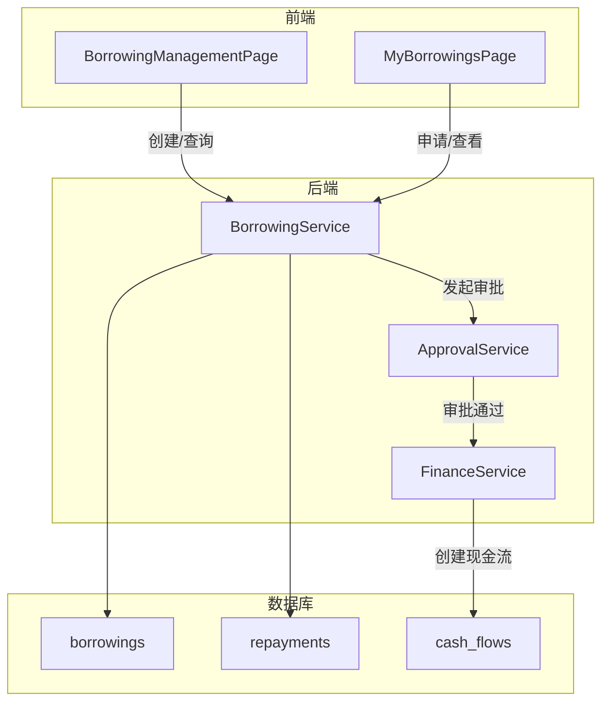
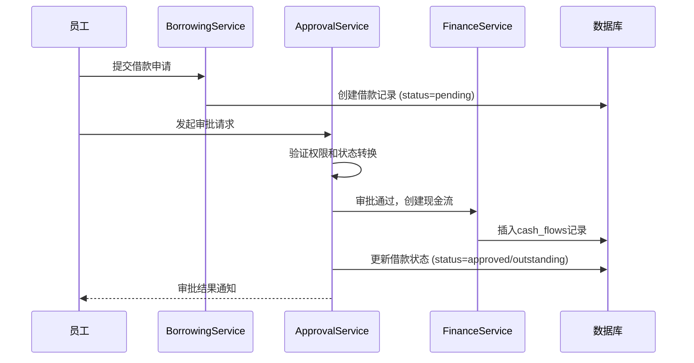
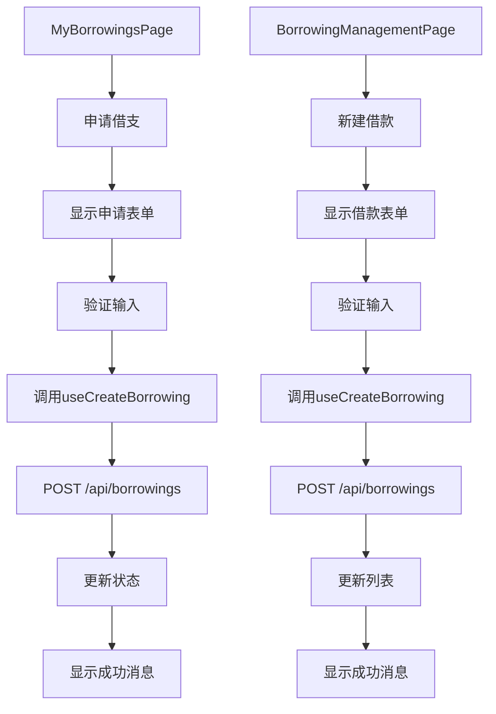
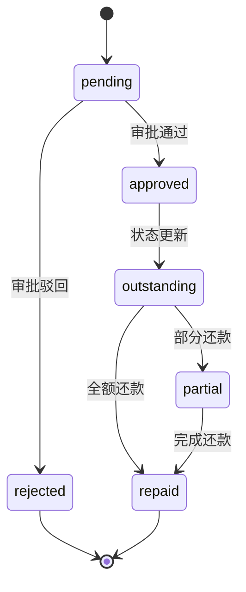
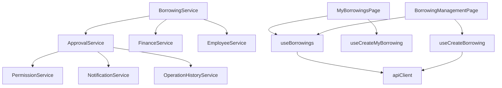

# 借款管理

<cite>
**本文档引用文件**   
- [BorrowingManagementPage.tsx](file://frontend/src/features/finance/pages/BorrowingManagementPage.tsx)
- [MyBorrowingsPage.tsx](file://frontend/src/features/my/pages/MyBorrowingsPage.tsx)
- [BorrowingService.ts](file://backend/src/services/BorrowingService.ts)
- [ApprovalService.ts](file://backend/src/services/ApprovalService.ts)
- [borrowings.ts](file://backend/src/routes/v2/borrowings.ts)
- [state-machine.ts](file://backend/src/utils/state-machine.ts)
- [business.schema.ts](file://backend/src/schemas/business.schema.ts)
- [schema.ts](file://backend/src/db/schema.ts)
- [useBorrowings.ts](file://frontend/src/hooks/business/useBorrowings.ts)
- [borrowing.schema.ts](file://frontend/src/validations/borrowing.schema.ts)
- [FinanceService.ts](file://backend/src/services/FinanceService.ts)
- [status.tsx](file://frontend/src/utils/status.tsx)
</cite>

## 目录
1. [简介](#简介)
2. [核心组件](#核心组件)
3. [架构概览](#架构概览)
4. [详细组件分析](#详细组件分析)
5. [依赖关系分析](#依赖关系分析)
6. [性能考量](#性能考量)
7. [故障排除指南](#故障排除指南)
8. [结论](#结论)

## 简介
本系统提供全面的借款管理功能，涵盖借款申请、审批、还款和状态追踪。系统通过 `BorrowingService` 和 `ApprovalService` 两个核心服务协同工作，实现了从员工申请到财务放款的完整业务流程。管理员可通过 `BorrowingManagementPage` 进行全局管理，而员工则通过 `MyBorrowingsPage` 管理个人借款。系统内置了严格的额度控制和风险预警机制，并通过状态机确保了业务流程的严谨性。

## 核心组件

借款管理模块的核心由后端服务和前端页面构成。`BorrowingService` 负责处理借款和还款的创建与查询，`ApprovalService` 则管理审批流程。前端通过 `BorrowingManagementPage` 和 `MyBorrowingsPage` 提供用户界面，分别服务于管理员和员工。`FinanceService` 在审批通过后自动创建现金流记录，确保账务一致性。

**Section sources**
- [BorrowingService.ts](file://backend/src/services/BorrowingService.ts#L1-L349)
- [ApprovalService.ts](file://backend/src/services/ApprovalService.ts#L1-L645)
- [BorrowingManagementPage.tsx](file://frontend/src/features/finance/pages/BorrowingManagementPage.tsx#L1-L167)
- [MyBorrowingsPage.tsx](file://frontend/src/features/my/pages/MyBorrowingsPage.tsx#L1-L221)

## 架构概览



**Diagram sources**
- [BorrowingService.ts](file://backend/src/services/BorrowingService.ts#L1-L349)
- [ApprovalService.ts](file://backend/src/services/ApprovalService.ts#L1-L645)
- [FinanceService.ts](file://backend/src/services/FinanceService.ts#L1-L443)
- [schema.ts](file://backend/src/db/schema.ts#L368-L437)

## 详细组件分析

### 借款服务分析
`BorrowingService` 是借款管理的核心，负责处理所有与借款和还款相关的数据操作。它提供了分页查询、创建借款/还款、计算余额等方法。服务通过事务确保数据一致性，并利用数据库连接进行高效的数据检索。

```mermaid
classDiagram
class BorrowingService {
+listBorrowings(page, pageSize, whereClause) Promise~{total, list}~
+getBorrowingById(id) Promise~Object | null~
+createBorrowing(data) Promise~{id}~
+listRepayments(limit, whereClause) Promise~Array~
+getRepaymentById(id) Promise~Object | null~
+createRepayment(data) Promise~{id}~
+getBorrowingBalances(whereClause) Promise~Array~
+getEmployeeBorrowings(employeeId) Promise~{borrowings, stats}~
}
class ApprovalService {
+approveBorrowing(id, userId, memo) Promise~void~
+rejectBorrowing(id, userId, memo) Promise~void~
+batchApproveBorrowings(ids, userId, memo) Promise~{success, failed}~
+batchRejectBorrowings(ids, userId, memo) Promise~{success, failed}~
}
class FinanceService {
+createCashFlow(data, tx) Promise~{id, voucherNo}~
}
BorrowingService --> ApprovalService : "协作"
BorrowingService --> FinanceService : "协作"
```

**Diagram sources**
- [BorrowingService.ts](file://backend/src/services/BorrowingService.ts#L1-L349)
- [ApprovalService.ts](file://backend/src/services/ApprovalService.ts#L378-L581)
- [FinanceService.ts](file://backend/src/services/FinanceService.ts#L70-L229)

### 审批服务分析
`ApprovalService` 实现了通用的审批处理逻辑，通过状态机（`borrowingStateMachine`）确保借款状态转换的合法性。它支持单个和批量审批操作，并在审批通过后调用 `FinanceService` 创建相应的现金流记录。



**Diagram sources**
- [ApprovalService.ts](file://backend/src/services/ApprovalService.ts#L152-L431)
- [FinanceService.ts](file://backend/src/services/FinanceService.ts#L70-L229)
- [schema.ts](file://backend/src/db/schema.ts#L368-L383)

### 前端页面分析
前端提供了两个主要页面：`BorrowingManagementPage` 供管理员使用，`MyBorrowingsPage` 供员工使用。两个页面都使用了 `useBorrowings` 和 `useCreateBorrowing` 等自定义Hook与后端API进行交互。



**Diagram sources**
- [MyBorrowingsPage.tsx](file://frontend/src/features/my/pages/MyBorrowingsPage.tsx#L1-L221)
- [BorrowingManagementPage.tsx](file://frontend/src/features/finance/pages/BorrowingManagementPage.tsx#L1-L167)
- [useBorrowings.ts](file://frontend/src/hooks/business/useBorrowings.ts#L1-L35)

### 状态管理分析
系统使用状态机（`StateMachine`）来管理借款的生命周期。状态转换是严格定义的，防止了非法的状态变更。



**Diagram sources**
- [state-machine.ts](file://backend/src/utils/state-machine.ts#L58-L67)
- [status.tsx](file://frontend/src/utils/status.tsx#L20-L27)

## 依赖关系分析



**Diagram sources**
- [BorrowingService.ts](file://backend/src/services/BorrowingService.ts#L1-L349)
- [ApprovalService.ts](file://backend/src/services/ApprovalService.ts#L1-L645)
- [MyBorrowingsPage.tsx](file://frontend/src/features/my/pages/MyBorrowingsPage.tsx#L1-L221)
- [BorrowingManagementPage.tsx](file://frontend/src/features/finance/pages/BorrowingManagementPage.tsx#L1-L167)
- [useBorrowings.ts](file://frontend/src/hooks/business/useBorrowings.ts#L1-L35)

## 性能考量
系统在处理大量借款数据时表现良好。`BorrowingService` 的 `listBorrowings` 方法使用了分页查询，避免了一次性加载过多数据。数据库查询通过索引优化，确保了查询效率。审批服务的批量操作采用循环处理，虽然不是并行，但保证了每个操作的原子性和错误隔离。

## 故障排除指南
- **问题：无法创建借款**
  - **原因**：可能缺少必要的权限或输入数据验证失败。
  - **解决方案**：检查用户是否具有 `finance.borrowing.create` 权限，并确保所有必填字段（如借款人、金额、账户）都已正确填写。

- **问题：审批通过后未生成现金流**
  - **原因**：`FinanceService.createCashFlow` 方法在审批服务中被调用，但可能因异常而失败。
  - **解决方案**：检查日志中是否有 `Failed to create cash flow for borrowing` 的错误信息，并确认借款类别ID配置正确。

- **问题：借款余额计算不正确**
  - **原因**：`getBorrowingBalances` 方法使用了复杂的子查询来计算余额，可能因数据不一致导致问题。
  - **解决方案**：验证 `borrowings` 和 `repayments` 表中的数据是否完整且关联正确。

**Section sources**
- [BorrowingService.ts](file://backend/src/services/BorrowingService.ts#L259-L294)
- [ApprovalService.ts](file://backend/src/services/ApprovalService.ts#L391-L412)
- [borrowings.ts](file://backend/src/routes/v2/borrowings.ts#L179-L180)

## 结论
该借款管理模块设计严谨，功能完整。通过 `BorrowingService` 和 `ApprovalService` 的清晰分工，实现了业务逻辑与审批流程的解耦。前端页面为不同角色提供了友好的操作界面。系统通过状态机和数据库事务确保了数据的一致性和流程的严谨性。整体架构清晰，易于维护和扩展。