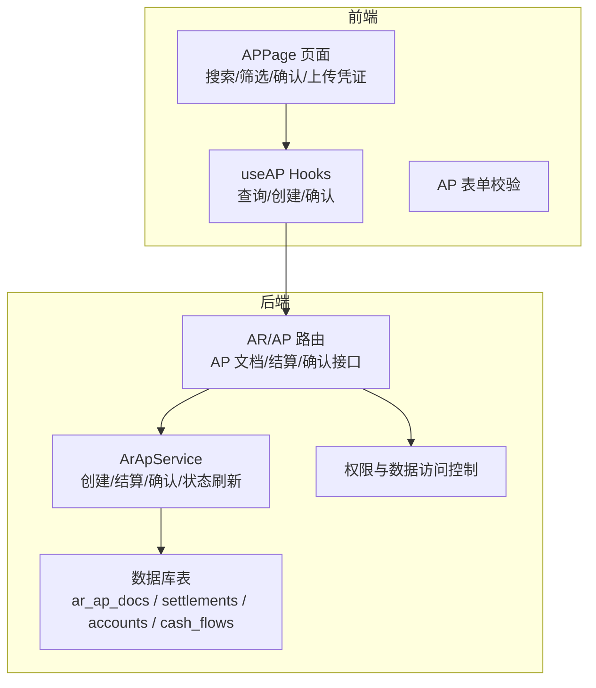
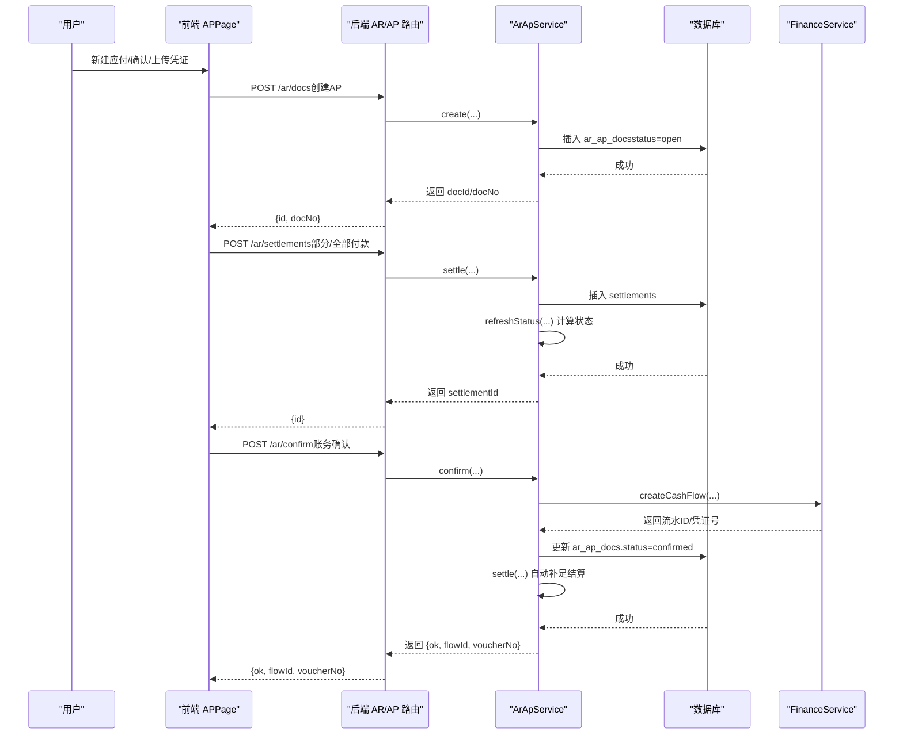
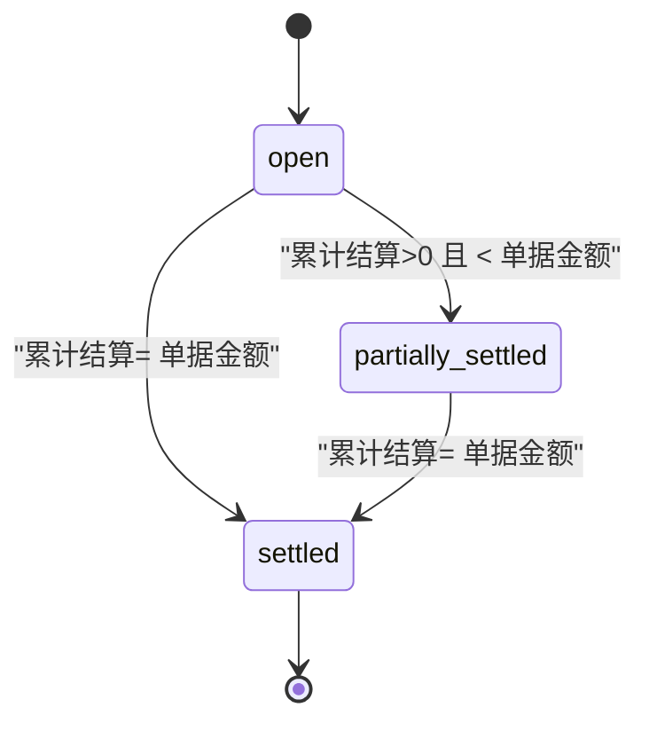
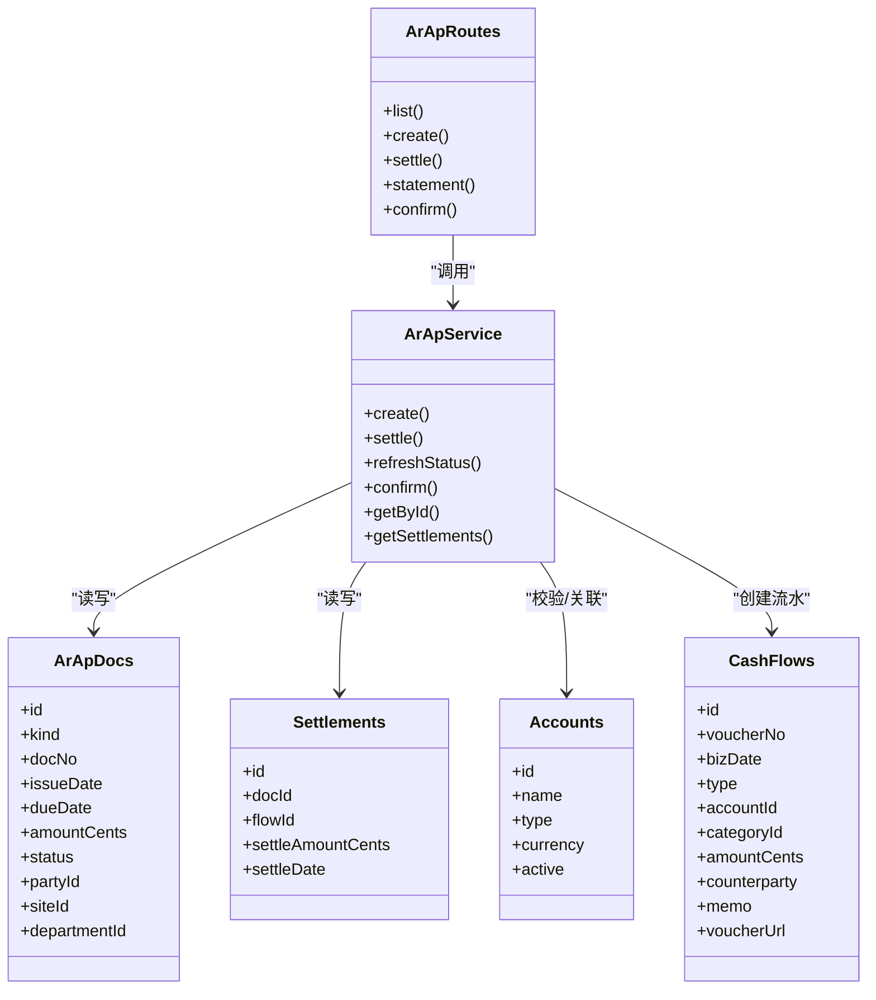

# 应付账款管理

<cite>
**本文引用的文件**
- [backend/src/routes/v2/ar-ap.ts](file://backend/src/routes/v2/ar-ap.ts)
- [backend/src/services/ArApService.ts](file://backend/src/services/ArApService.ts)
- [backend/src/db/schema.ts](file://backend/src/db/schema.ts)
- [backend/src/schemas/business.schema.ts](file://backend/src/schemas/business.schema.ts)
- [backend/src/utils/permissions.ts](file://backend/src/utils/permissions.ts)
- [backend/src/utils/state-machine.ts](file://backend/src/utils/state-machine.ts)
- [frontend/src/features/finance/pages/APPage.tsx](file://frontend/src/features/finance/pages/APPage.tsx)
- [frontend/src/hooks/business/useAP.ts](file://frontend/src/hooks/business/useAP.ts)
- [frontend/src/validations/ap.schema.ts](file://frontend/src/validations/ap.schema.ts)
- [frontend/src/utils/status.tsx](file://frontend/src/utils/status.tsx)
- [frontend/src/types/business.ts](file://frontend/src/types/business.ts)
</cite>

## 目录
1. [简介](#简介)
2. [项目结构](#项目结构)
3. [核心组件](#核心组件)
4. [架构总览](#架构总览)
5. [详细组件分析](#详细组件分析)
6. [依赖关系分析](#依赖关系分析)
7. [性能考量](#性能考量)
8. [故障排查指南](#故障排查指南)
9. [结论](#结论)
10. [附录](#附录)

## 简介
本文件面向应付账款（Accounts Payable, AP）业务模块，系统性阐述其业务模型设计、状态机与全生命周期管理，覆盖新建AP单据、供应商付款结算、部分支付与账务确认流程。文档同时结合前端AP页面说明用户操作流程（按供应商筛选、账期管理、批量付款），并提供API调用示例（创建AP单据、查询付款记录、获取应付账款明细），解释请求参数、响应结构与权限控制机制。

## 项目结构
AP模块由后端路由与服务层、数据库表结构、前端页面与Hooks组成，形成前后端协同的数据流与状态流转闭环。

图表来源
- [backend/src/routes/v2/ar-ap.ts](file://backend/src/routes/v2/ar-ap.ts#L1-L626)
- [backend/src/services/ArApService.ts](file://backend/src/services/ArApService.ts#L1-L264)
- [backend/src/db/schema.ts](file://backend/src/db/schema.ts#L352-L447)
- [frontend/src/features/finance/pages/APPage.tsx](file://frontend/src/features/finance/pages/APPage.tsx#L1-L320)
- [frontend/src/hooks/business/useAP.ts](file://frontend/src/hooks/business/useAP.ts#L1-L48)

章节来源
- [backend/src/routes/v2/ar-ap.ts](file://backend/src/routes/v2/ar-ap.ts#L1-L626)
- [backend/src/services/ArApService.ts](file://backend/src/services/ArApService.ts#L1-L264)
- [backend/src/db/schema.ts](file://backend/src/db/schema.ts#L352-L447)
- [frontend/src/features/finance/pages/APPage.tsx](file://frontend/src/features/finance/pages/APPage.tsx#L1-L320)
- [frontend/src/hooks/business/useAP.ts](file://frontend/src/hooks/business/useAP.ts#L1-L48)

## 核心组件
- 后端路由与接口
  - AP文档列表、创建、结算、账单明细、确认等接口均在AR/AP路由中实现，其中AP专用接口复用AR逻辑但限定kind=AP。
- 服务层
  - ArApService负责文档创建、结算、状态刷新、确认（含事务）、查询等。
- 数据库模型
  - ar_ap_docs：AP单据主表；settlements：结算明细；accounts/cash_flows：资金流水与科目关联。
- 前端页面与Hooks
  - APPage提供新建、筛选、确认、凭证上传；useAP提供查询、创建、确认的React Query封装；ap.schema提供表单校验。

章节来源
- [backend/src/routes/v2/ar-ap.ts](file://backend/src/routes/v2/ar-ap.ts#L1-L626)
- [backend/src/services/ArApService.ts](file://backend/src/services/ArApService.ts#L1-L264)
- [backend/src/db/schema.ts](file://backend/src/db/schema.ts#L352-L447)
- [frontend/src/features/finance/pages/APPage.tsx](file://frontend/src/features/finance/pages/APPage.tsx#L1-L320)
- [frontend/src/hooks/business/useAP.ts](file://frontend/src/hooks/business/useAP.ts#L1-L48)
- [frontend/src/validations/ap.schema.ts](file://frontend/src/validations/ap.schema.ts#L1-L23)

## 架构总览
AP业务采用“路由-服务-数据库”三层结构，配合权限与数据访问控制，确保安全与合规。

图表来源
- [backend/src/routes/v2/ar-ap.ts](file://backend/src/routes/v2/ar-ap.ts#L162-L437)
- [backend/src/services/ArApService.ts](file://backend/src/services/ArApService.ts#L84-L243)
- [backend/src/db/schema.ts](file://backend/src/db/schema.ts#L352-L447)

## 详细组件分析

### 业务模型与状态机
- 业务实体
  - AP单据：ar_ap_docs，包含单号、开立/到期日、金额、状态、部门/站点/供应商等。
  - 结算记录：settlements，记录每次付款的金额、日期、关联流水。
  - 资金流水：cash_flows，确认时创建，用于账务核对。
- 状态机
  - 文档状态：open（未结）、partially_settled（部分结清）、settled（已结清）。
  - 状态刷新逻辑：根据累计结算金额与单据金额比较自动更新。
  - 注意：前端状态映射包含pending/open/partial/settled等，后端持久化状态为open/partial/settled。

图表来源
- [backend/src/services/ArApService.ts](file://backend/src/services/ArApService.ts#L120-L140)
- [backend/src/db/schema.ts](file://backend/src/db/schema.ts#L362-L366)
- [frontend/src/utils/status.tsx](file://frontend/src/utils/status.tsx#L71-L81)

章节来源
- [backend/src/services/ArApService.ts](file://backend/src/services/ArApService.ts#L120-L140)
- [backend/src/db/schema.ts](file://backend/src/db/schema.ts#L352-L447)
- [frontend/src/utils/status.tsx](file://frontend/src/utils/status.tsx#L71-L81)

### 新建AP单据
- 接口
  - 方法：POST
  - 路径：/ar/docs
  - 请求体：kind=AP、partyId、issueDate、dueDate、amountCents、docNo、memo
  - 响应：{id, docNo}
- 服务实现要点
  - 自动生成单号（kind+日期+序号），默认状态open。
- 前端操作
  - APPage表单提交，调用useCreateAP，成功后刷新列表。

章节来源
- [backend/src/routes/v2/ar-ap.ts](file://backend/src/routes/v2/ar-ap.ts#L162-L221)
- [backend/src/services/ArApService.ts](file://backend/src/services/ArApService.ts#L84-L118)
- [frontend/src/features/finance/pages/APPage.tsx](file://frontend/src/features/finance/pages/APPage.tsx#L48-L65)
- [frontend/src/hooks/business/useAP.ts](file://frontend/src/hooks/business/useAP.ts#L25-L35)
- [backend/src/schemas/business.schema.ts](file://backend/src/schemas/business.schema.ts#L188-L200)

### 供应商付款结算（部分/全部）
- 接口
  - 方法：POST
  - 路径：/ar/settlements
  - 请求体：docId、flowId、settleAmountCents、settleDate
  - 响应：{id}
- 服务实现要点
  - 插入结算记录，随后刷新单据状态。
- 前端操作
  - 在APPage中选择单据，点击“确认”，填写账户、类别、业务日期、凭证URL后提交。

章节来源
- [backend/src/routes/v2/ar-ap.ts](file://backend/src/routes/v2/ar-ap.ts#L261-L316)
- [backend/src/services/ArApService.ts](file://backend/src/services/ArApService.ts#L142-L167)
- [frontend/src/features/finance/pages/APPage.tsx](file://frontend/src/features/finance/pages/APPage.tsx#L117-L148)
- [frontend/src/validations/ap.schema.ts](file://frontend/src/validations/ap.schema.ts#L1-L23)
- [backend/src/schemas/business.schema.ts](file://backend/src/schemas/business.schema.ts#L202-L210)

### 账务确认（生成支出记录）
- 接口
  - 方法：POST
  - 路径：/ar/confirm
  - 请求体：docId、accountId、bizDate、categoryId、method、memo、voucherUrl
  - 响应：{ok, flowId, voucherNo}
- 服务实现要点
  - 事务内完成：校验单据存在且未确认；创建资金流水；更新单据状态为confirmed；自动补足结算。
- 前端操作
  - APPage打开确认弹窗，上传凭证后提交。

章节来源
- [backend/src/routes/v2/ar-ap.ts](file://backend/src/routes/v2/ar-ap.ts#L372-L437)
- [backend/src/services/ArApService.ts](file://backend/src/services/ArApService.ts#L178-L243)
- [frontend/src/features/finance/pages/APPage.tsx](file://frontend/src/features/finance/pages/APPage.tsx#L67-L92)
- [frontend/src/validations/ap.schema.ts](file://frontend/src/validations/ap.schema.ts#L14-L23)
- [backend/src/schemas/business.schema.ts](file://backend/src/schemas/business.schema.ts#L212-L224)

### 查询与报表（应付明细）
- 接口
  - 方法：GET
  - 路径：/ar/statement?docId=...
  - 响应：doc、settlements、settledCents、remainingCents
- 服务实现要点
  - 并行查询单据与结算，计算已结与剩余金额。
- 前端操作
  - APPage表格展示已结、剩余金额，支持按供应商名称与状态筛选。

章节来源
- [backend/src/routes/v2/ar-ap.ts](file://backend/src/routes/v2/ar-ap.ts#L318-L371)
- [backend/src/services/ArApService.ts](file://backend/src/services/ArApService.ts#L169-L177)
- [frontend/src/features/finance/pages/APPage.tsx](file://frontend/src/features/finance/pages/APPage.tsx#L131-L156)
- [frontend/src/types/business.ts](file://frontend/src/types/business.ts#L101-L116)

### 用户操作流程（前端）
- 新建应付
  - 打开新建模态框，选择供应商、输入开立/到期日、金额、备注，提交创建。
- 确认应付
  - 选择单据，打开确认弹窗，选择账户/类别、业务日期，上传凭证，提交确认。
- 筛选与查询
  - 支持按供应商名称、状态、开立日期范围筛选；表格显示单号、开立/到期日、金额、已结、剩余、状态。

章节来源
- [frontend/src/features/finance/pages/APPage.tsx](file://frontend/src/features/finance/pages/APPage.tsx#L1-L320)
- [frontend/src/hooks/business/useAP.ts](file://frontend/src/hooks/business/useAP.ts#L1-L48)
- [frontend/src/validations/ap.schema.ts](file://frontend/src/validations/ap.schema.ts#L1-L23)
- [frontend/src/utils/status.tsx](file://frontend/src/utils/status.tsx#L71-L81)

### 权限与数据访问控制
- 权限
  - 路由层使用hasPermission检查finance.ar.create权限。
- 数据访问
  - 使用getDataAccessFilter根据用户职位层级生成SQL过滤条件，限制可见范围。
- 前端访问
  - useAPDocs通过/api/ar/docs?kind=AP分页查询，useCreateAP/useConfirmAP分别调用创建与确认接口。

章节来源
- [backend/src/routes/v2/ar-ap.ts](file://backend/src/routes/v2/ar-ap.ts#L92-L160)
- [backend/src/utils/permissions.ts](file://backend/src/utils/permissions.ts#L99-L125)
- [backend/src/utils/permissions.ts](file://backend/src/utils/permissions.ts#L196-L263)
- [frontend/src/hooks/business/useAP.ts](file://frontend/src/hooks/business/useAP.ts#L1-L48)

## 依赖关系分析
- 路由依赖服务：ar-ap.ts路由调用ArApService执行业务逻辑。
- 服务依赖数据库：ArApService读写ar_ap_docs、settlements、accounts、cash_flows。
- 前端依赖后端：APPage通过useAP Hooks与后端API交互。
- 状态映射：前端使用ARAP_STATUS进行状态渲染。

图表来源
- [backend/src/routes/v2/ar-ap.ts](file://backend/src/routes/v2/ar-ap.ts#L1-L626)
- [backend/src/services/ArApService.ts](file://backend/src/services/ArApService.ts#L1-L264)
- [backend/src/db/schema.ts](file://backend/src/db/schema.ts#L352-L447)

章节来源
- [backend/src/routes/v2/ar-ap.ts](file://backend/src/routes/v2/ar-ap.ts#L1-L626)
- [backend/src/services/ArApService.ts](file://backend/src/services/ArApService.ts#L1-L264)
- [backend/src/db/schema.ts](file://backend/src/db/schema.ts#L352-L447)

## 性能考量
- 查询优化
  - 列表接口使用分页与并行查询（文档与结算统计），减少往返次数。
- 状态计算
  - refreshStatus基于累计结算金额计算，避免复杂联表聚合。
- 前端缓存
  - useApiQuery使用keepPreviousData与staleTime降低重复请求。

章节来源
- [backend/src/routes/v2/ar-ap.ts](file://backend/src/routes/v2/ar-ap.ts#L92-L160)
- [backend/src/services/ArApService.ts](file://backend/src/services/ArApService.ts#L27-L82)
- [frontend/src/hooks/business/useAP.ts](file://frontend/src/hooks/business/useAP.ts#L1-L23)

## 故障排查指南
- 常见错误与定位
  - 权限不足：路由层hasPermission检查失败，返回禁止访问。
  - 数据访问受限：getDataAccessFilter生成的where条件导致查询为空。
  - 单据状态异常：确认接口要求单据未确认，否则抛业务错误。
  - 账户无效：确认前校验账户存在且有效。
- 建议排查步骤
  - 检查用户职位与模块权限配置。
  - 核对单据状态是否为open/pending（前端状态映射）。
  - 确认凭证URL上传成功后再提交确认。
  - 查看审计日志与流水ID，定位具体环节。

章节来源
- [backend/src/utils/permissions.ts](file://backend/src/utils/permissions.ts#L99-L125)
- [backend/src/utils/permissions.ts](file://backend/src/utils/permissions.ts#L196-L263)
- [backend/src/services/ArApService.ts](file://backend/src/services/ArApService.ts#L178-L200)
- [backend/src/routes/v2/ar-ap.ts](file://backend/src/routes/v2/ar-ap.ts#L372-L437)

## 结论
AP模块通过清晰的业务模型与状态机、严格的权限与数据访问控制、以及前后端协同的接口设计，实现了从新建、结算到账务确认的全生命周期管理。前端APPage提供了直观的筛选与确认体验，后端ArApService保证了数据一致性与事务完整性。建议后续扩展批量付款与账期提醒功能，进一步提升用户体验与运营效率。

## 附录

### API调用示例（不含代码片段）
- 创建AP单据
  - 方法：POST
  - 路径：/ar/docs
  - 请求体字段：kind=AP、partyId、issueDate、dueDate、amountCents、docNo、memo
  - 响应：{id, docNo}
- 查询付款记录
  - 方法：GET
  - 路径：/ar/settlements?docId=...
  - 响应：results（结算列表）
- 获取应付账款明细
  - 方法：GET
  - 路径：/ar/statement?docId=...
  - 响应：doc、settlements、settledCents、remainingCents
- 账务确认
  - 方法：POST
  - 路径：/ar/confirm
  - 请求体字段：docId、accountId、bizDate、categoryId、method、memo、voucherUrl
  - 响应：{ok, flowId, voucherNo}

章节来源
- [backend/src/routes/v2/ar-ap.ts](file://backend/src/routes/v2/ar-ap.ts#L162-L437)
- [backend/src/schemas/business.schema.ts](file://backend/src/schemas/business.schema.ts#L188-L224)