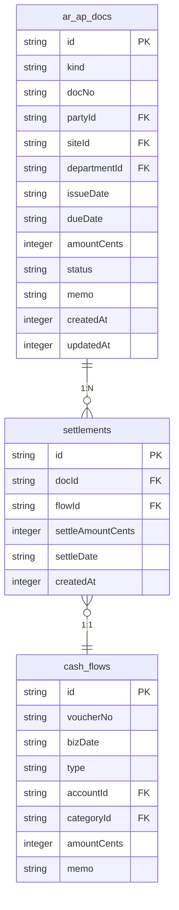
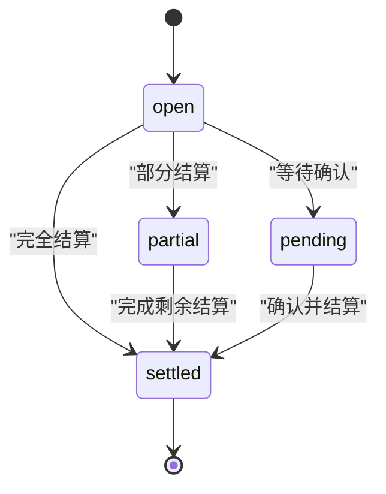
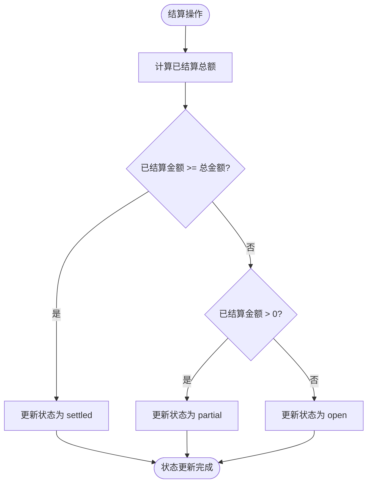
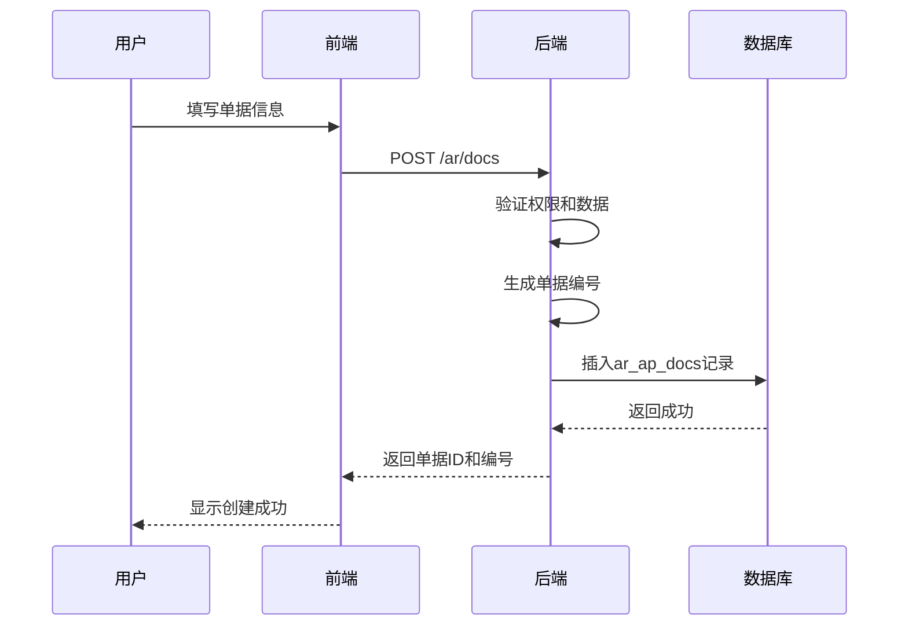
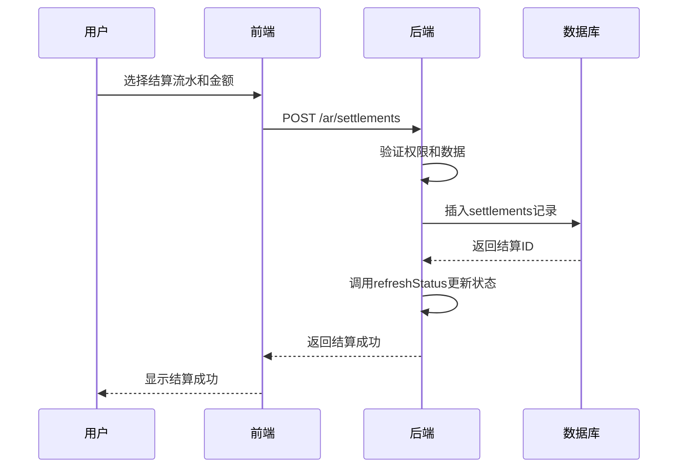
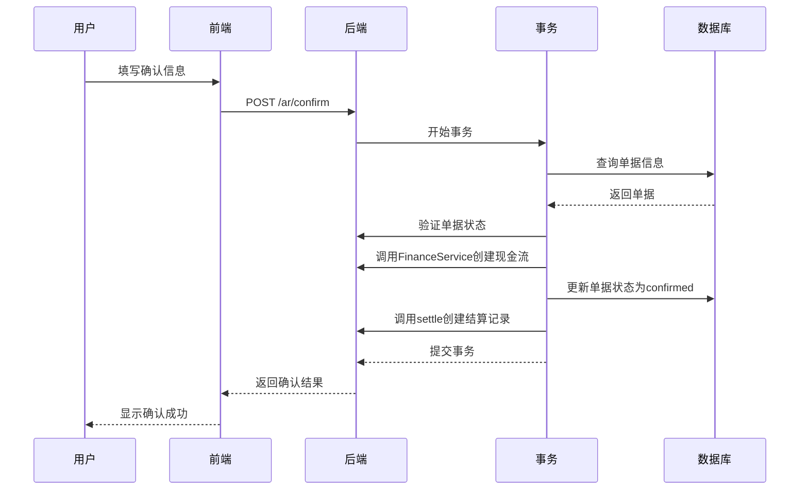
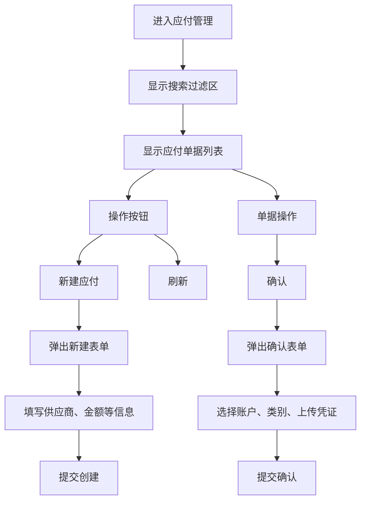
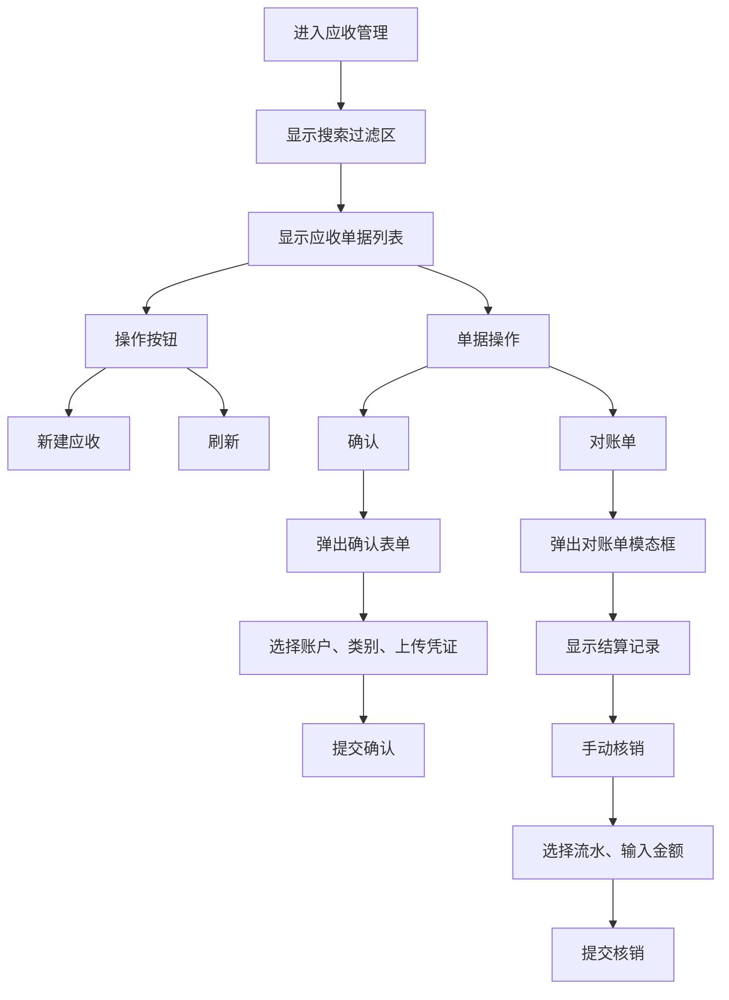

# 应收应付管理

<cite>
**本文档引用文件**  
- [ar-ap.ts](file://backend/src/routes/v2/ar-ap.ts)
- [ArApService.ts](file://backend/src/services/ArApService.ts)
- [APPage.tsx](file://frontend/src/features/finance/pages/APPage.tsx)
- [ARPage.tsx](file://frontend/src/features/finance/pages/ARPage.tsx)
- [business.schema.ts](file://backend/src/schemas/business.schema.ts)
- [schema.ts](file://backend/src/db/schema.ts)
- [useAP.ts](file://frontend/src/hooks/business/useAP.ts)
- [useAR.ts](file://frontend/src/hooks/business/useAR.ts)
- [ap.schema.ts](file://frontend/src/validations/ap.schema.ts)
- [ar.schema.ts](file://frontend/src/validations/ar.schema.ts)
- [status.tsx](file://frontend/src/utils/status.tsx)
- [import-ar-example.csv](file://frontend/public/examples/import-ar-example.csv)
</cite>

## 目录
1. [引言](#引言)
2. [业务模型设计](#业务模型设计)
3. [状态机与全生命周期管理](#状态机与全生命周期管理)
4. [核心流程实现逻辑](#核心流程实现逻辑)
5. [前端用户操作流程](#前端用户操作流程)
6. [数据导入与API调用](#数据导入与api调用)

## 引言
应收应付管理模块是财务系统的核心组成部分，用于管理企业与客户（AR）及供应商（AP）之间的财务往来。本模块支持新建应收/应付单据、结算、部分结算、确认等操作，并通过状态机精确跟踪每笔单据的生命周期。系统提供完整的前端页面（ARPage和APPage）支持用户操作，包括搜索过滤、批量操作和报表集成。同时支持通过CSV文件批量导入数据和API接口调用，实现高效的数据管理。

## 业务模型设计

### AR/AP数据模型
应收应付模块的核心数据模型基于`ar_ap_docs`表，该表存储所有应收（AR）和应付（AP）单据的基本信息。主要字段包括：

- **id**: 单据唯一标识符
- **kind**: 单据类型（AR-应收，AP-应付）
- **docNo**: 单据编号，按日期和序号自动生成
- **partyId**: 关联方ID（客户或供应商）
- **siteId**: 站点ID（对应客户）
- **departmentId**: 部门ID
- **issueDate**: 开立日期
- **dueDate**: 到期日
- **amountCents**: 金额（以分为单位存储）
- **status**: 状态（open/partial/settled/pending）
- **memo**: 备注信息



**Diagram sources**
- [schema.ts](file://backend/src/db/schema.ts#L352-L366)
- [ar-ap.ts](file://backend/src/routes/v2/ar-ap.ts#L20-L33)

### 结算模型
结算记录通过`settlements`表管理，每笔结算关联到一个AR/AP单据和一个现金流水（cash_flow）。这种设计实现了应收应付与实际现金流的精确对应，确保财务数据的一致性。

**Section sources**
- [schema.ts](file://backend/src/db/schema.ts#L439-L446)
- [ArApService.ts](file://backend/src/services/ArApService.ts#L142-L167)

## 状态机与全生命周期管理

### 状态定义
系统定义了四种核心状态来管理AR/AP单据的生命周期：

- **open（未结）**: 单据已创建但未结算
- **partial（部分结算）**: 单据已部分结算，仍有余额
- **settled（已结清）**: 单据已完全结算
- **pending（待确认）**: 单据等待确认（在确认流程中）



**Diagram sources**
- [ArApService.ts](file://backend/src/services/ArApService.ts#L132-L137)
- [status.tsx](file://frontend/src/utils/status.tsx#L74-L80)

### 状态转换逻辑
状态转换由`ArApService`中的`refreshStatus`方法自动管理。当发生结算操作时，系统会重新计算已结算金额总和，并根据以下规则更新状态：

1. 如果已结算金额 ≥ 总金额，则状态为`settled`
2. 如果已结算金额 > 0 但 < 总金额，则状态为`partial`
3. 如果已结算金额 = 0，则状态为`open`



**Diagram sources**
- [ArApService.ts](file://backend/src/services/ArApService.ts#L120-L140)

## 核心流程实现逻辑

### 新建应收/应付流程
新建流程通过`createArApDocSchema`验证输入数据，然后调用`ArApService.create`方法创建单据。系统会自动生成单据编号（格式：AR/AYYYYYMMDD-XXX）。



**Diagram sources**
- [ar-ap.ts](file://backend/src/routes/v2/ar-ap.ts#L162-L220)
- [ArApService.ts](file://backend/src/services/ArApService.ts#L84-L118)

### 结算与部分结算流程
结算流程通过`createSettlementSchema`验证输入，然后调用`ArApService.settle`方法创建结算记录。每次结算后，系统会自动调用`refreshStatus`更新单据状态。



**Diagram sources**
- [ar-ap.ts](file://backend/src/routes/v2/ar-ap.ts#L261-L316)
- [ArApService.ts](file://backend/src/services/ArApService.ts#L142-L167)

### 确认流程
确认流程是将应收/应付单据转化为实际现金流的关键步骤。通过`confirmArApDocSchema`验证输入后，系统会创建现金流水并自动完成全额结算。



**Diagram sources**
- [ar-ap.ts](file://backend/src/routes/v2/ar-ap.ts#L372-L437)
- [ArApService.ts](file://backend/src/services/ArApService.ts#L178-L243)

## 前端用户操作流程

### APPage操作流程
APPage（应付管理页面）提供完整的应付单据管理功能，包括新建、搜索、过滤和确认操作。



**Diagram sources**
- [APPage.tsx](file://frontend/src/features/finance/pages/APPage.tsx)

### ARPage操作流程
ARPage（应收管理页面）提供比APPage更复杂的功能，包括对账单查看和手动核销功能。



**Diagram sources**
- [ARPage.tsx](file://frontend/src/features/finance/pages/ARPage.tsx)

### 搜索过滤与批量操作
系统提供强大的搜索过滤功能，支持按供应商/客户、状态和日期范围进行筛选。虽然当前代码中未直接实现批量操作，但通过`useBatchOperation` Hook为未来扩展提供了基础。

**Section sources**
- [APPage.tsx](file://frontend/src/features/finance/pages/APPage.tsx#L164-L191)
- [ARPage.tsx](file://frontend/src/features/finance/pages/ARPage.tsx#L199-L226)

### 报表集成
系统通过`reports.ts`路由提供多种财务报表，包括仪表盘统计、部门现金流和应收应付汇总报表，实现了与报表系统的深度集成。

**Section sources**
- [reports.ts](file://backend/src/routes/v2/reports.ts#L48-L113)

## 数据导入与API调用

### 数据导入模板
系统提供标准的CSV导入模板，用于批量导入应收数据。`import-ar-example.csv`文件展示了正确的数据格式：

```csv
issue_date,due_date,amount,party_id,site_id,department_id,memo
2025-01-15,2025-02-15,5000.00,party-id-001,site-id-001,dept-id-001,客户A应收款
2025-01-20,2025-02-20,3000.00,party-id-002,site-id-002,dept-id-001,客户B应收款
```

**Section sources**
- [import-ar-example.csv](file://frontend/public/examples/import-ar-example.csv)

### API调用示例
#### 创建应收单据
```http
POST /ar/docs
Content-Type: application/json

{
  "kind": "AR",
  "siteId": "site-id-001",
  "issueDate": "2025-01-15",
  "dueDate": "2025-02-15",
  "amountCents": 500000,
  "memo": "客户A应收款"
}
```

#### 创建结算
```http
POST /ar/settlements
Content-Type: application/json

{
  "docId": "doc-id-001",
  "flowId": "flow-id-001",
  "settleAmountCents": 300000,
  "settleDate": "2025-01-20"
}
```

#### 确认应收单据
```http
POST /ar/confirm
Content-Type: application/json

{
  "docId": "doc-id-001",
  "accountId": "account-id-001",
  "categoryId": "category-id-001",
  "bizDate": "2025-01-15",
  "voucherUrl": "https://example.com/voucher.jpg",
  "memo": "确认客户A应收款"
}
```

**Section sources**
- [ar-ap.ts](file://backend/src/routes/v2/ar-ap.ts)
- [business.schema.ts](file://backend/src/schemas/business.schema.ts#L189-L223)