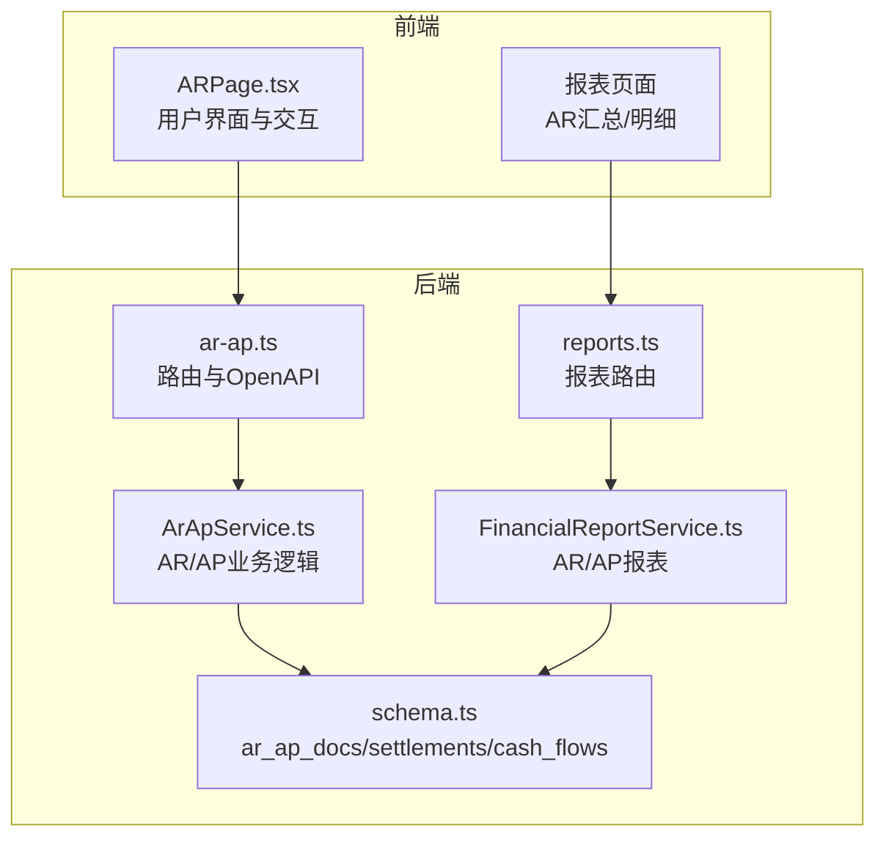
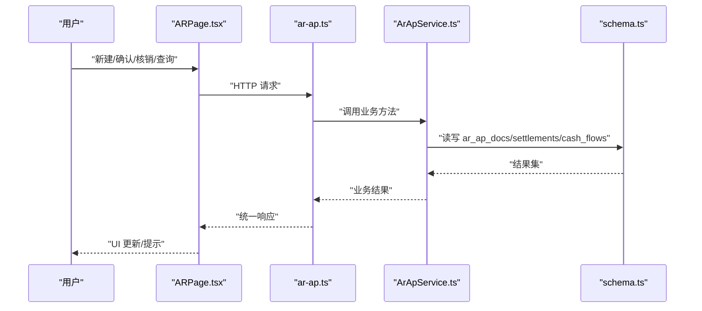
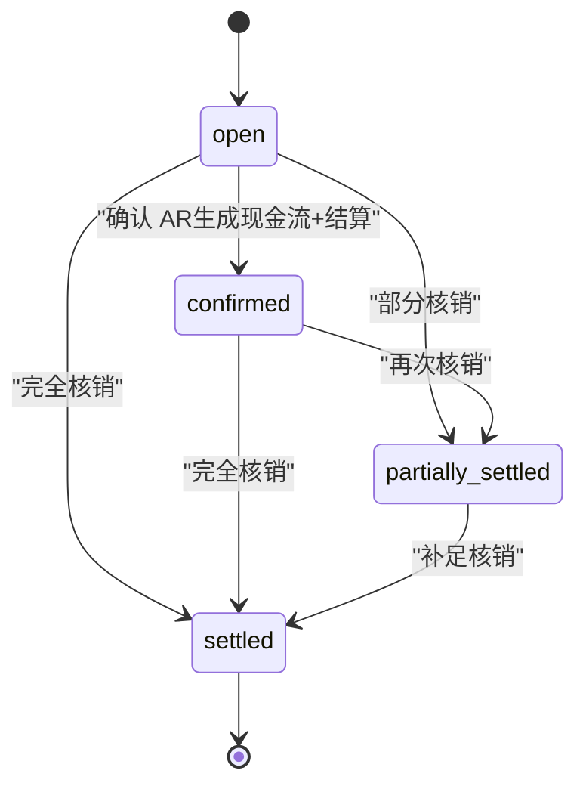
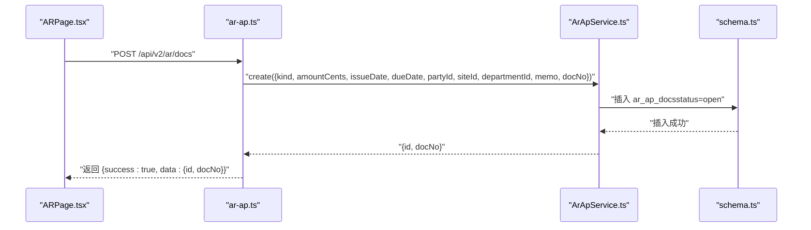
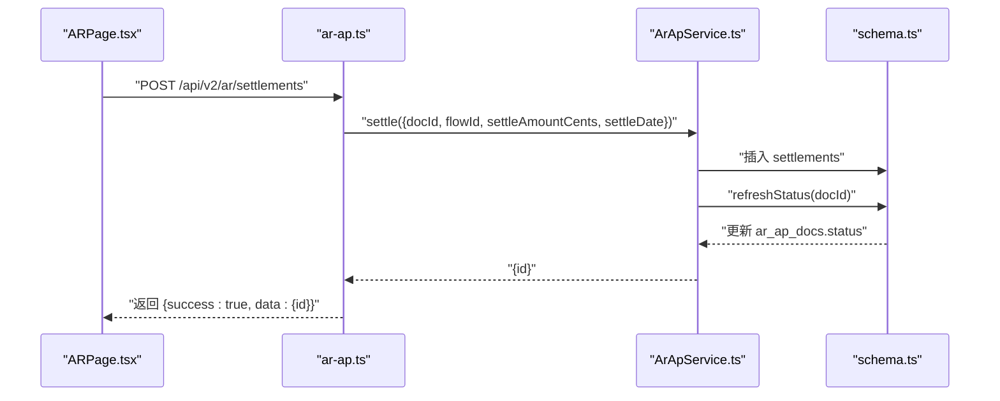
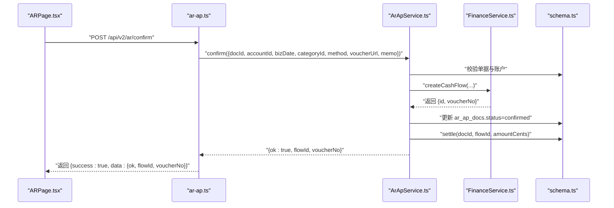
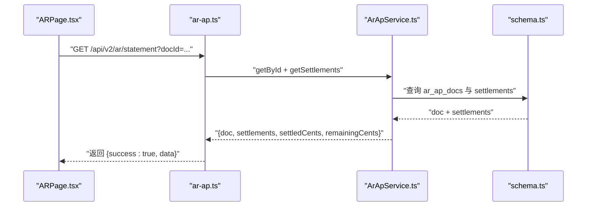
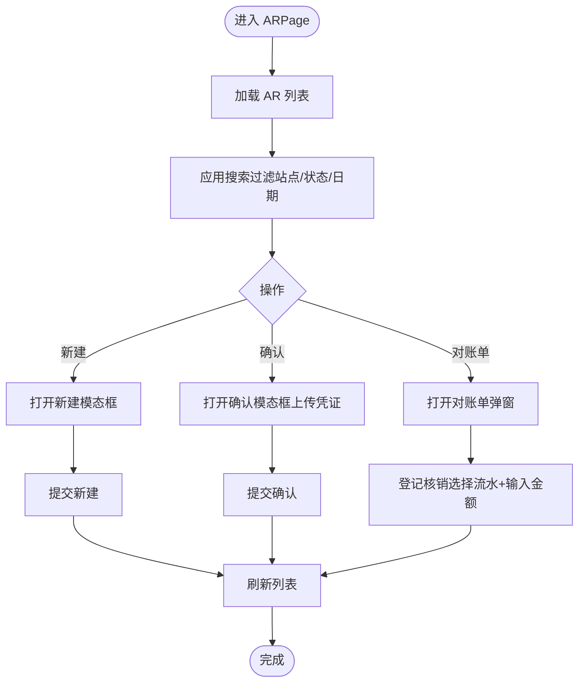
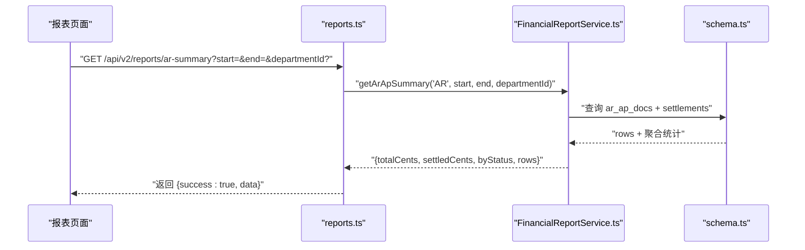
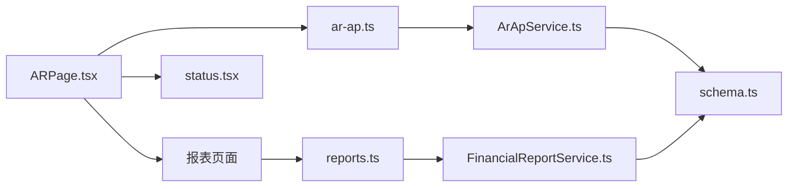

# 应收账款管理

<cite>
**本文引用的文件列表**
- [ar-ap.ts](file://backend/src/routes/v2/ar-ap.ts)
- [ArApService.ts](file://backend/src/services/ArApService.ts)
- [business.schema.ts](file://backend/src/schemas/business.schema.ts)
- [schema.ts](file://backend/src/db/schema.ts)
- [ARPage.tsx](file://frontend/src/features/finance/pages/ARPage.tsx)
- [ar.schema.ts](file://frontend/src/validations/ar.schema.ts)
- [status.tsx](file://frontend/src/utils/status.tsx)
- [reports.ts](file://backend/src/routes/v2/reports.ts)
- [FinancialReportService.ts](file://backend/src/services/FinancialReportService.ts)
- [ReportARSummaryPage.tsx](file://frontend/src/features/reports/pages/ReportARSummaryPage.tsx)
- [ReportARDetailPage.tsx](file://frontend/src/features/reports/pages/ReportARDetailPage.tsx)
</cite>

## 目录
1. [简介](#简介)
2. [项目结构与入口](#项目结构与入口)
3. [核心组件与职责](#核心组件与职责)
4. [架构总览](#架构总览)
5. [详细组件分析](#详细组件分析)
6. [依赖关系分析](#依赖关系分析)
7. [性能与扩展性](#性能与扩展性)
8. [故障排查指南](#故障排查指南)
9. [结论](#结论)
10. [附录：API与前端交互清单](#附录api与前端交互清单)

## 简介
本文件系统化梳理应收账款（AR）业务模型、状态机与全生命周期管理，覆盖从新建单据、部分/完全结算到确认入账的完整流程，并结合前端 ARPage 页面说明用户操作、搜索过滤、批量操作与报表集成。同时提供关键 API 的调用示例、请求参数、响应结构与错误处理机制，帮助开发者快速理解与扩展。

## 项目结构与入口
- 后端路由层：负责对外暴露 AR/AP 的 CRUD、结算、确认、对账单查询与报表接口。
- 服务层：ArApService 提供 AR/AP 文档与结算的核心业务逻辑，FinancialReportService 提供 AR/AP 报表聚合。
- 数据层：Drizzle ORM 映射 ar_ap_docs、settlements、cash_flows 等表。
- 前端页面：ARPage 负责 AR 单据的展示、搜索、确认、核销与凭证上传；报表页面提供 AR 汇总与明细。

图表来源
- [ar-ap.ts](file://backend/src/routes/v2/ar-ap.ts#L1-L626)
- [ArApService.ts](file://backend/src/services/ArApService.ts#L1-L264)
- [reports.ts](file://backend/src/routes/v2/reports.ts#L230-L357)
- [FinancialReportService.ts](file://backend/src/services/FinancialReportService.ts#L1-L120)
- [schema.ts](file://backend/src/db/schema.ts#L352-L446)

章节来源
- [ar-ap.ts](file://backend/src/routes/v2/ar-ap.ts#L1-L626)
- [ArApService.ts](file://backend/src/services/ArApService.ts#L1-L264)
- [reports.ts](file://backend/src/routes/v2/reports.ts#L230-L357)
- [FinancialReportService.ts](file://backend/src/services/FinancialReportService.ts#L1-L120)
- [schema.ts](file://backend/src/db/schema.ts#L352-L446)

## 核心组件与职责
- 路由层（ar-ap.ts）
  - 提供 AR 文档列表、创建、结算列表、创建结算、对账单查询、确认 AR 文档等接口。
  - 对外返回统一的 V2 响应结构（success/data）。
- 服务层（ArApService.ts）
  - 生成单据编号、分页查询、创建 AR 文档、计算并刷新状态、创建结算、确认 AR 并联动生成现金流与结算。
- 数据层（schema.ts）
  - ar_ap_docs：AR/AP 主表，含 kind、partyId/siteId/departmentId、issueDate/dueDate、amountCents、status、memo 等。
  - settlements：结算记录表，关联 docId、flowId、settleAmountCents、settleDate。
  - cash_flows：现金流表，用于确认 AR 时生成入账流水。
- 前端（ARPage.tsx）
  - 新建 AR、确认 AR（上传凭证）、对账单/核销、搜索过滤（站点/状态/日期范围）、分页与状态标签渲染。
- 报表（reports.ts + FinancialReportService.ts + 报表页面）
  - AR 汇总/明细接口与前端页面，支持按日期范围与部门筛选。

章节来源
- [ar-ap.ts](file://backend/src/routes/v2/ar-ap.ts#L56-L626)
- [ArApService.ts](file://backend/src/services/ArApService.ts#L14-L243)
- [schema.ts](file://backend/src/db/schema.ts#L352-L446)
- [ARPage.tsx](file://frontend/src/features/finance/pages/ARPage.tsx#L1-L407)
- [reports.ts](file://backend/src/routes/v2/reports.ts#L230-L357)
- [FinancialReportService.ts](file://backend/src/services/FinancialReportService.ts#L28-L82)
- [ReportARSummaryPage.tsx](file://frontend/src/features/reports/pages/ReportARSummaryPage.tsx#L1-L87)
- [ReportARDetailPage.tsx](file://frontend/src/features/reports/pages/ReportARDetailPage.tsx#L1-L22)

## 架构总览
AR 业务采用“路由-服务-数据”三层结构：
- 路由层负责参数校验、鉴权、分页与统一响应包装。
- 服务层封装业务规则（状态机、事务、金额校验、凭证必填等）。
- 数据层通过 Drizzle ORM 访问 SQLite，确保一致性与可维护性。

图表来源
- [ar-ap.ts](file://backend/src/routes/v2/ar-ap.ts#L162-L437)
- [ArApService.ts](file://backend/src/services/ArApService.ts#L84-L243)
- [schema.ts](file://backend/src/db/schema.ts#L352-L446)

## 详细组件分析

### 业务模型与状态机
- AR/AP 文档模型
  - 关键字段：kind（AR/AP）、partyId、siteId、departmentId、issueDate、dueDate、amountCents、status、memo。
  - 默认状态：创建时为 open。
- 结算模型
  - 关联 docId、flowId（现金流ID）、settleAmountCents、settleDate。
- 状态机
  - open：未结清
  - partial：部分结清（内部实现中为 partially_settled）
  - settled：已结清
  - pending：待确认（前端状态映射为 pending）
  - 注：系统内状态枚举与前端状态映射略有差异，需注意转换。

图表来源
- [ArApService.ts](file://backend/src/services/ArApService.ts#L120-L140)
- [schema.ts](file://backend/src/db/schema.ts#L362-L366)
- [status.tsx](file://frontend/src/utils/status.tsx#L71-L81)

章节来源
- [schema.ts](file://backend/src/db/schema.ts#L352-L366)
- [ArApService.ts](file://backend/src/services/ArApService.ts#L120-L140)
- [status.tsx](file://frontend/src/utils/status.tsx#L71-L81)

### 生命周期与关键流程

#### 1) 新建 AR 单据
- 前端：ARPage 提交新建表单，金额以元为单位，后端转换为分。
- 后端：自动生成 docNo（AR+日期+序号），默认状态 open。
- 返回：创建成功返回 id 与 docNo。

图表来源
- [ar-ap.ts](file://backend/src/routes/v2/ar-ap.ts#L162-L221)
- [ArApService.ts](file://backend/src/services/ArApService.ts#L84-L118)
- [schema.ts](file://backend/src/db/schema.ts#L352-L366)

章节来源
- [ar-ap.ts](file://backend/src/routes/v2/ar-ap.ts#L162-L221)
- [ArApService.ts](file://backend/src/services/ArApService.ts#L84-L118)

#### 2) 部分结算与完全结算
- 前端：在对账单弹窗中选择收款流水 flowId，输入核销金额，提交核销。
- 后端：插入一条 settlement 记录，并调用 refreshStatus 计算并更新 AR 状态。
- 状态变化：累计核销金额 > 0 且 < 总额 → partially_settled；= 总额 → settled。

图表来源
- [ar-ap.ts](file://backend/src/routes/v2/ar-ap.ts#L261-L316)
- [ArApService.ts](file://backend/src/services/ArApService.ts#L142-L167)
- [schema.ts](file://backend/src/db/schema.ts#L439-L446)

章节来源
- [ar-ap.ts](file://backend/src/routes/v2/ar-ap.ts#L261-L316)
- [ArApService.ts](file://backend/src/services/ArApService.ts#L142-L167)

#### 3) 确认 AR（生成现金流与结算）
- 前端：在 ARPage 中点击“确认”，填写账户、类别、业务日期、备注，上传凭证（必填）。
- 后端：ArApService 在事务中完成以下步骤：
  - 校验单据存在且未确认；
  - 校验账户有效；
  - 通过 FinanceService 创建现金流（type=income）；
  - 将单据状态置为 confirmed；
  - 自动创建一笔与单据金额一致的结算记录。
- 返回：返回 {ok:true, flowId, voucherNo}。

图表来源
- [ar-ap.ts](file://backend/src/routes/v2/ar-ap.ts#L372-L437)
- [ArApService.ts](file://backend/src/services/ArApService.ts#L178-L243)
- [schema.ts](file://backend/src/db/schema.ts#L352-L446)

章节来源
- [ar-ap.ts](file://backend/src/routes/v2/ar-ap.ts#L372-L437)
- [ArApService.ts](file://backend/src/services/ArApService.ts#L178-L243)

#### 4) 对账单与结算查询
- 前端：打开对账单弹窗，调用对账单接口获取 doc、所有 settlement 以及已结/未结金额。
- 后端：并行查询单据与结算，计算已结与未结金额，返回结构化数据。

图表来源
- [ar-ap.ts](file://backend/src/routes/v2/ar-ap.ts#L318-L371)
- [ArApService.ts](file://backend/src/services/ArApService.ts#L169-L177)
- [schema.ts](file://backend/src/db/schema.ts#L352-L446)

章节来源
- [ar-ap.ts](file://backend/src/routes/v2/ar-ap.ts#L318-L371)
- [ArApService.ts](file://backend/src/services/ArApService.ts#L169-L177)

### 前端页面与用户操作流程
- 搜索过滤
  - 支持按“客户（站点）名称”、“状态”、“开立日期范围”过滤。
  - 前端本地过滤 AR 单据列表，支持重置。
- 批量操作
  - 刷新按钮触发重新拉取数据。
  - 新建按钮打开新建模态框，提交后刷新列表。
- 对账单与核销
  - “对账单”按钮打开弹窗，展示单据信息与结算明细，支持登记核销。
- 状态显示
  - 使用 ARAP_STATUS 映射渲染状态标签，区分 open/partial/settled/pending。

图表来源
- [ARPage.tsx](file://frontend/src/features/finance/pages/ARPage.tsx#L1-L407)
- [status.tsx](file://frontend/src/utils/status.tsx#L71-L81)

章节来源
- [ARPage.tsx](file://frontend/src/features/finance/pages/ARPage.tsx#L1-L407)
- [status.tsx](file://frontend/src/utils/status.tsx#L71-L81)

### 报表集成
- AR 汇总/明细接口
  - 路由：/api/v2/reports/ar-summary、/api/v2/reports/ar-detail
  - 参数：start、end、departmentId（可选）
  - 返回：按日期范围与部门聚合的 AR 汇总/明细，包含每笔单据的已结金额与状态分布。
- 前端页面
  - 报表 AR 汇总/明细页面提供日期范围筛选与表格展示。

图表来源
- [reports.ts](file://backend/src/routes/v2/reports.ts#L230-L357)
- [FinancialReportService.ts](file://backend/src/services/FinancialReportService.ts#L28-L82)
- [schema.ts](file://backend/src/db/schema.ts#L352-L446)

章节来源
- [reports.ts](file://backend/src/routes/v2/reports.ts#L230-L357)
- [FinancialReportService.ts](file://backend/src/services/FinancialReportService.ts#L28-L82)
- [ReportARSummaryPage.tsx](file://frontend/src/features/reports/pages/ReportARSummaryPage.tsx#L1-L87)
- [ReportARDetailPage.tsx](file://frontend/src/features/reports/pages/ReportARDetailPage.tsx#L1-L22)

## 依赖关系分析
- 路由依赖服务：ar-ap.ts 依赖 ArApService；reports.ts 依赖 FinancialReportService。
- 服务依赖数据层：ArApService 与 FinancialReportService 依赖 schema.ts 中的表定义。
- 前端依赖后端：ARPage 通过 hooks 调用后端接口；报表页面通过 hooks 调用报表接口。
- 状态映射：前端使用 ARAP_STATUS 将后端状态码映射为 UI 标签。

图表来源
- [ar-ap.ts](file://backend/src/routes/v2/ar-ap.ts#L1-L626)
- [ArApService.ts](file://backend/src/services/ArApService.ts#L1-L264)
- [reports.ts](file://backend/src/routes/v2/reports.ts#L230-L357)
- [FinancialReportService.ts](file://backend/src/services/FinancialReportService.ts#L1-L120)
- [schema.ts](file://backend/src/db/schema.ts#L352-L446)
- [ARPage.tsx](file://frontend/src/features/finance/pages/ARPage.tsx#L1-L407)
- [status.tsx](file://frontend/src/utils/status.tsx#L71-L81)

章节来源
- [ar-ap.ts](file://backend/src/routes/v2/ar-ap.ts#L1-L626)
- [ArApService.ts](file://backend/src/services/ArApService.ts#L1-L264)
- [reports.ts](file://backend/src/routes/v2/reports.ts#L230-L357)
- [FinancialReportService.ts](file://backend/src/services/FinancialReportService.ts#L1-L120)
- [schema.ts](file://backend/src/db/schema.ts#L352-L446)
- [ARPage.tsx](file://frontend/src/features/finance/pages/ARPage.tsx#L1-L407)
- [status.tsx](file://frontend/src/utils/status.tsx#L71-L81)

## 性能与扩展性
- 查询优化
  - 列表接口使用分页与 where 条件拼接，避免全表扫描。
  - 对账单接口并行查询单据与结算，减少往返。
- 状态计算
  - refreshStatus 通过一次聚合查询结算总和，避免逐条更新。
- 报表缓存
  - 账户余额报表使用 KV 缓存短期结果，降低重复查询成本。
- 扩展建议
  - 为 ar_ap_docs 添加索引（kind、issueDate、status）提升报表查询性能。
  - 对结算记录按 docId 建立索引，加速 refreshStatus 与对账单查询。
  - 前端对高频接口增加缓存策略与去抖。

[本节为通用建议，无需特定文件引用]

## 故障排查指南
- 常见错误与定位
  - 无权限：路由层在多个接口处进行权限校验，若报 403，请检查登录态与角色权限。
  - 单据不存在：确认 docId 正确；确认单据状态是否被提前修改。
  - 账户无效：确认账户存在且处于启用状态。
  - 凭证缺失：确认上传凭证 URL 符合要求。
  - 金额异常：前端将元转分为分，后端校验金额必须大于 0。
- 日志与审计
  - 路由层在关键操作（创建、核销、确认）记录审计日志，便于追踪。
- 建议排查步骤
  - 检查请求参数与响应体中的 success/data 字段。
  - 查看审计日志与数据库状态变更。
  - 复现最小场景（单条数据）验证问题边界。

章节来源
- [ar-ap.ts](file://backend/src/routes/v2/ar-ap.ts#L194-L220)
- [ar-ap.ts](file://backend/src/routes/v2/ar-ap.ts#L292-L316)
- [ar-ap.ts](file://backend/src/routes/v2/ar-ap.ts#L405-L437)
- [ArApService.ts](file://backend/src/services/ArApService.ts#L178-L243)

## 结论
本模块围绕 AR 文档的全生命周期构建了清晰的前后端协作流程：前端负责用户交互与报表展示，后端通过路由与服务层实现严谨的业务规则与状态机控制。通过统一的 OpenAPI 接口与标准化响应，系统具备良好的可维护性与扩展性。建议后续完善索引与缓存策略，进一步提升报表与列表查询性能。

[本节为总结，无需特定文件引用]

## 附录：API与前端交互清单

### 1) 新建 AR 单据
- 路由：POST /api/v2/ar/docs
- 请求体（示例字段）
  - kind: AR/AP
  - siteId: 站点ID
  - issueDate: 开立日期
  - dueDate: 到期日
  - amount: 金额（元）
  - memo: 备注
  - docNo: 可选，系统自动生成
- 成功响应：{ success: true, data: { id, docNo } }

章节来源
- [ar-ap.ts](file://backend/src/routes/v2/ar-ap.ts#L162-L221)
- [business.schema.ts](file://backend/src/schemas/business.schema.ts#L189-L200)
- [ar.schema.ts](file://frontend/src/validations/ar.schema.ts#L1-L11)

### 2) 查询 AR 列表
- 路由：GET /api/v2/ar/docs
- 查询参数
  - kind: AR/AP（可选）
  - status: 状态（可选）
  - page/pageSize: 分页
- 成功响应：{ success: true, data: { items[], pagination } }

章节来源
- [ar-ap.ts](file://backend/src/routes/v2/ar-ap.ts#L56-L160)
- [business.schema.ts](file://backend/src/schemas/business.schema.ts#L189-L200)

### 3) 查询结算记录
- 路由：GET /api/v2/ar/settlements?docId=...
- 成功响应：{ success: true, data: { results[] } }

章节来源
- [ar-ap.ts](file://backend/src/routes/v2/ar-ap.ts#L222-L259)
- [schema.ts](file://backend/src/db/schema.ts#L439-L446)

### 4) 创建结算
- 路由：POST /api/v2/ar/settlements
- 请求体
  - docId: AR 文档ID
  - flowId: 收款流水ID
  - settleAmountCents: 核销金额（分）
  - settleDate: 核销日期
- 成功响应：{ success: true, data: { id } }

章节来源
- [ar-ap.ts](file://backend/src/routes/v2/ar-ap.ts#L261-L316)
- [business.schema.ts](file://backend/src/schemas/business.schema.ts#L203-L210)
- [ar.schema.ts](file://frontend/src/validations/ar.schema.ts#L24-L29)

### 5) 获取对账单
- 路由：GET /api/v2/ar/statement?docId=...
- 成功响应：{ success: true, data: { doc, settlements[], settledCents, remainingCents } }

章节来源
- [ar-ap.ts](file://backend/src/routes/v2/ar-ap.ts#L318-L371)
- [schema.ts](file://backend/src/db/schema.ts#L352-L446)

### 6) 确认 AR（生成现金流与结算）
- 路由：POST /api/v2/ar/confirm
- 请求体
  - docId: AR 文档ID
  - accountId: 收款账户ID
  - categoryId: 收入类别ID
  - bizDate: 业务日期
  - voucherUrl: 凭证URL（必填）
  - memo: 备注
- 成功响应：{ success: true, data: { ok: true, flowId, voucherNo } }

章节来源
- [ar-ap.ts](file://backend/src/routes/v2/ar-ap.ts#L372-L437)
- [business.schema.ts](file://backend/src/schemas/business.schema.ts#L212-L224)
- [ar.schema.ts](file://frontend/src/validations/ar.schema.ts#L14-L23)

### 7) 报表：AR 汇总
- 路由：GET /api/v2/reports/ar-summary
- 查询参数：start、end、departmentId（可选）
- 成功响应：{ success: true, data: { totalCents, settledCents, byStatus, rows[] } }

章节来源
- [reports.ts](file://backend/src/routes/v2/reports.ts#L230-L357)
- [FinancialReportService.ts](file://backend/src/services/FinancialReportService.ts#L28-L82)
- [ReportARSummaryPage.tsx](file://frontend/src/features/reports/pages/ReportARSummaryPage.tsx#L1-L87)

### 8) 报表：AR 明细
- 路由：GET /api/v2/reports/ar-detail
- 查询参数：start、end、departmentId（可选）
- 成功响应：{ success: true, data: { rows[] } }

章节来源
- [reports.ts](file://backend/src/routes/v2/reports.ts#L320-L357)
- [FinancialReportService.ts](file://backend/src/services/FinancialReportService.ts#L62-L82)
- [ReportARDetailPage.tsx](file://frontend/src/features/reports/pages/ReportARDetailPage.tsx#L1-L22)