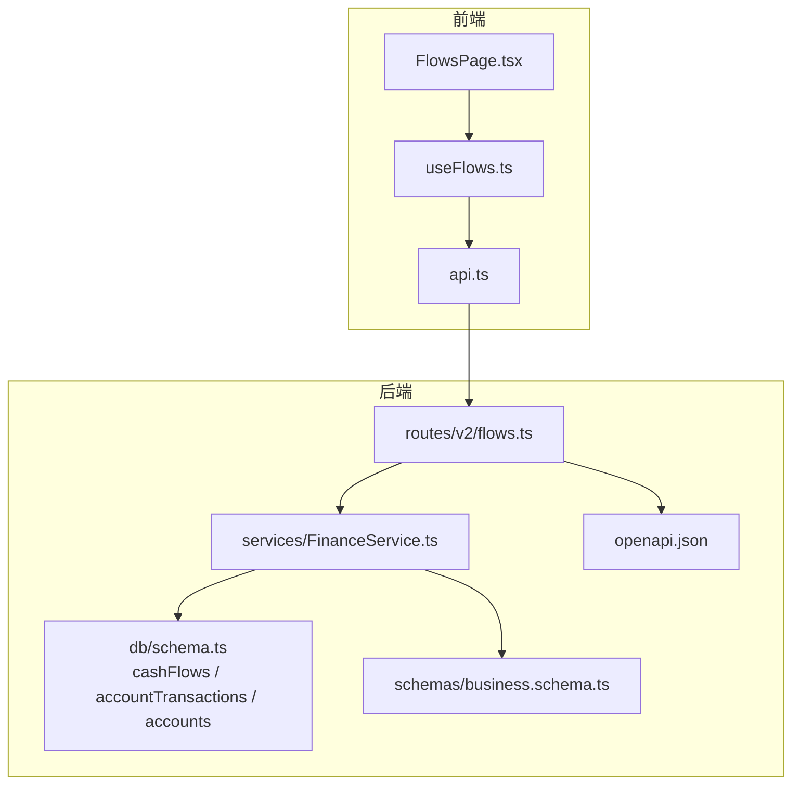
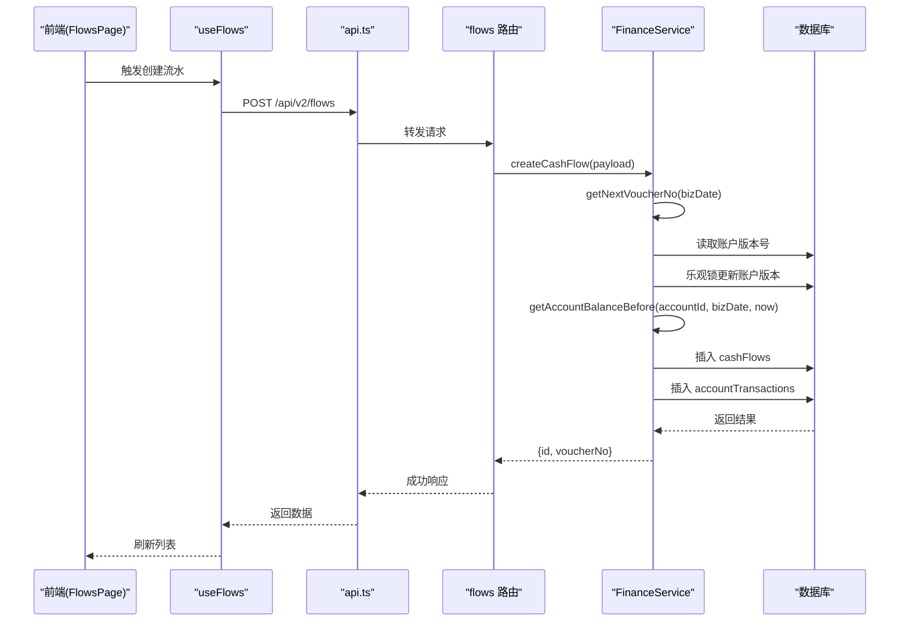
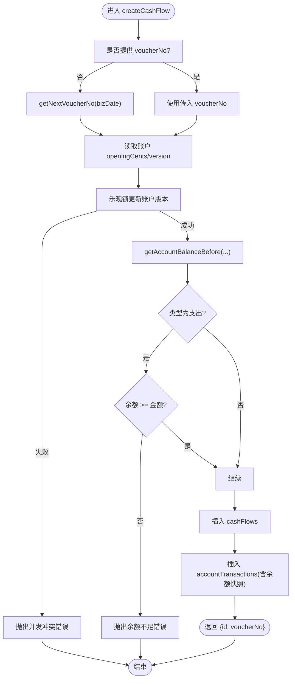
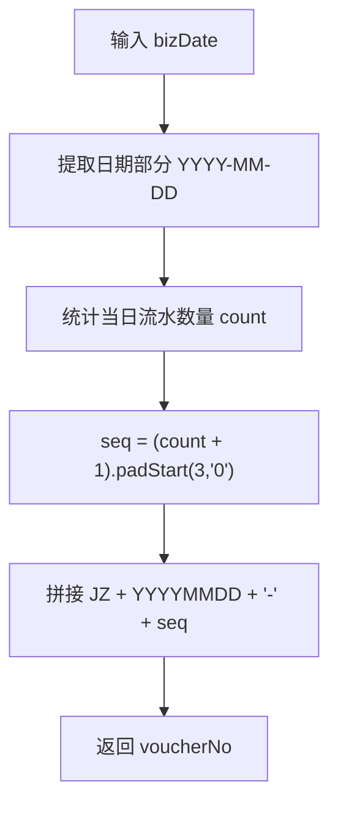
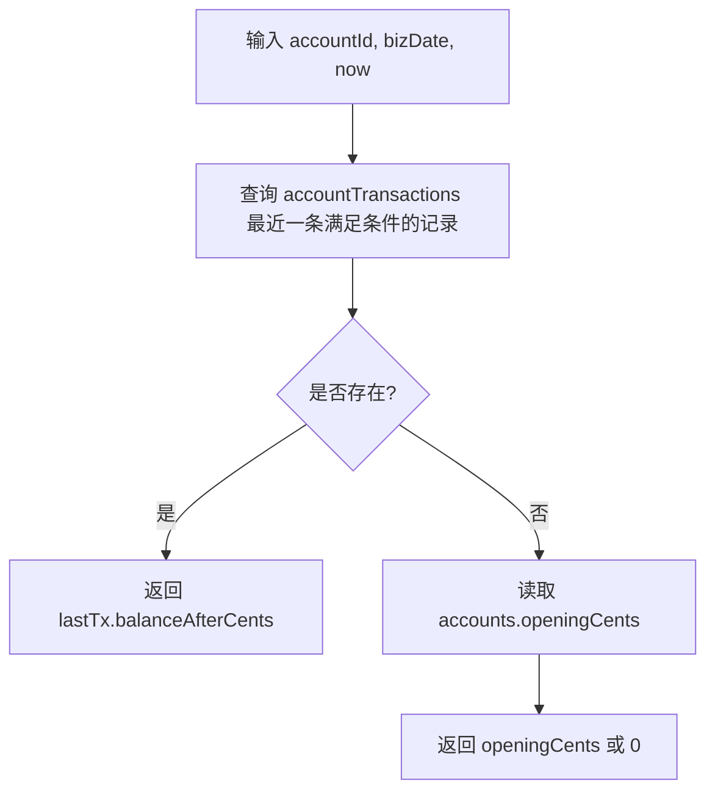
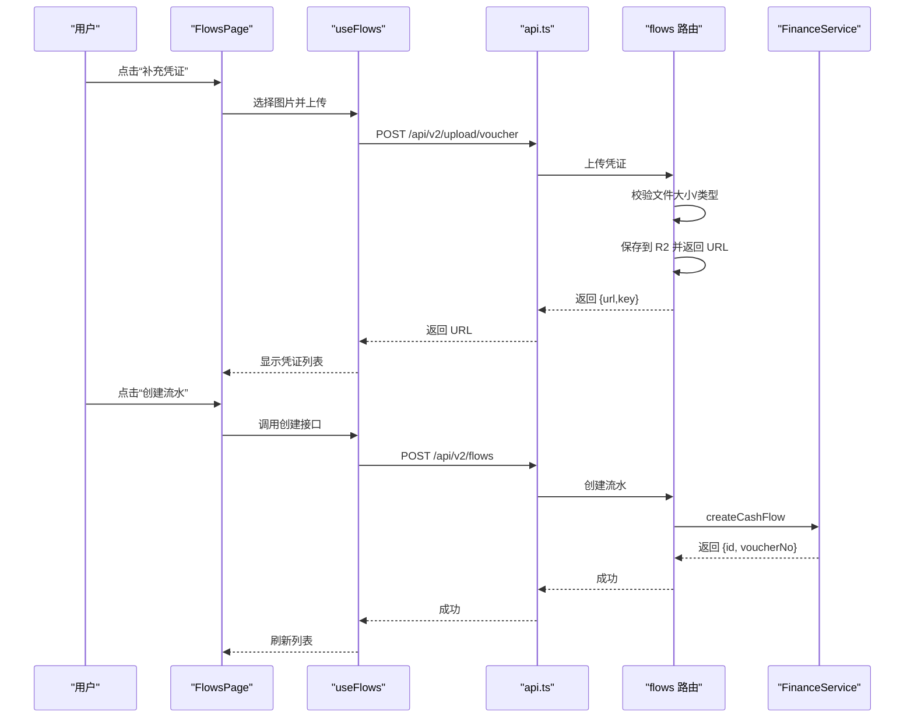
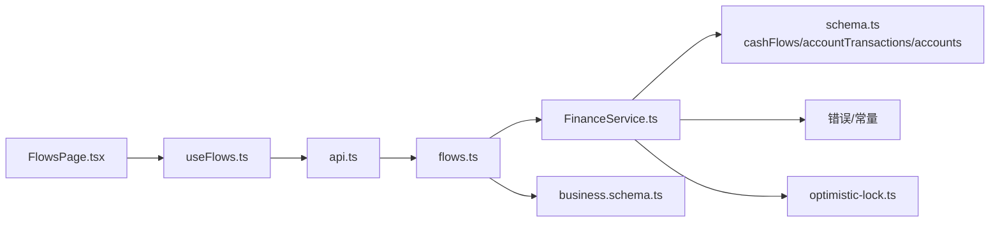

# 财务流水创建

<cite>
**本文引用的文件**
- [FinanceService.ts](file://backend/src/services/FinanceService.ts)
- [flows.ts](file://backend/src/routes/v2/flows.ts)
- [schema.ts](file://backend/src/db/schema.ts)
- [business.schema.ts](file://backend/src/schemas/business.schema.ts)
- [optimistic-lock.ts](file://backend/src/utils/optimistic-lock.ts)
- [FlowsPage.tsx](file://frontend/src/features/finance/pages/FlowsPage.tsx)
- [useFlows.ts](file://frontend/src/hooks/business/useFlows.ts)
- [api.ts](file://frontend/src/config/api.ts)
- [openapi.json](file://backend/openapi.json)
- [finance-core.test.ts](file://backend/test/routes/finance-core.test.ts)
- [FinanceService.test.ts](file://backend/test/services/FinanceService.test.ts)
</cite>

## 目录
1. [简介](#简介)
2. [项目结构](#项目结构)
3. [核心组件](#核心组件)
4. [架构总览](#架构总览)
5. [详细组件分析](#详细组件分析)
6. [依赖关系分析](#依赖关系分析)
7. [性能考量](#性能考量)
8. [故障排查指南](#故障排查指南)
9. [结论](#结论)
10. [附录](#附录)

## 简介
本文件围绕“财务流水创建”功能，系统性说明以下内容：
- FinanceService 中 createCashFlow 方法如何实现流水创建、凭证号生成、余额计算与乐观锁机制
- getNextVoucherNo 方法的凭证号生成逻辑
- getAccountBalanceBefore 方法的余额计算原理
- 结合 FlowsPage 前端页面说明用户操作流程
- API 调用示例与常见问题解决方案（如凭证号重复、余额计算错误）

## 项目结构
财务流水创建涉及前后端协作：
- 后端
  - 路由层：flows 路由负责凭证号查询、流水列表、凭证上传/下载、流水创建、凭证更新、红冲等接口
  - 服务层：FinanceService 实现流水创建、余额计算、凭证号生成、红冲等核心逻辑
  - 数据模型：cashFlows、accountTransactions、accounts 等表结构
  - 校验与响应：business.schema.ts 定义请求体校验；openapi.json 提供接口契约
- 前端
  - FlowsPage 页面展示流水列表、凭证上传/预览、红冲操作
  - useFlows 钩子封装查询、创建、更新凭证、获取下一凭证号等调用
  - api.ts 配置统一 API 基址与各端点

图表来源
- [flows.ts](file://backend/src/routes/v2/flows.ts#L326-L426)
- [FinanceService.ts](file://backend/src/services/FinanceService.ts#L70-L229)
- [schema.ts](file://backend/src/db/schema.ts#L139-L200)
- [business.schema.ts](file://backend/src/schemas/business.schema.ts#L11-L41)
- [openapi.json](file://backend/openapi.json#L3072-L3106)

章节来源
- [flows.ts](file://backend/src/routes/v2/flows.ts#L1-L120)
- [FinanceService.ts](file://backend/src/services/FinanceService.ts#L1-L40)
- [schema.ts](file://backend/src/db/schema.ts#L139-L200)
- [business.schema.ts](file://backend/src/schemas/business.schema.ts#L11-L41)
- [openapi.json](file://backend/openapi.json#L3072-L3106)

## 核心组件
- FinanceService.createCashFlow：核心流水创建入口，负责凭证号生成、余额计算、插入 cashFlows 与 accountTransactions，并通过乐观锁保证并发安全
- FinanceService.getNextVoucherNo：按业务日期统计当日流水数量，生成 JZYYYYMMDD-PPP 的凭证号
- FinanceService.getAccountBalanceBefore：基于历史交易快照计算某时刻之前的余额
- flows 路由：暴露凭证号查询、流水列表、凭证上传/下载、流水创建、凭证更新、红冲等接口
- 前端 FlowsPage：展示流水、凭证上传/预览、红冲操作；useFlows 钩子封装 API 调用

章节来源
- [FinanceService.ts](file://backend/src/services/FinanceService.ts#L25-L229)
- [flows.ts](file://backend/src/routes/v2/flows.ts#L68-L120)

## 架构总览
后端采用 OpenAPIHono 路由 + Drizzle ORM + SQLite（D1）持久化，前端使用 React Query 管理状态与缓存。流水创建的关键流程如下：

图表来源
- [flows.ts](file://backend/src/routes/v2/flows.ts#L326-L426)
- [FinanceService.ts](file://backend/src/services/FinanceService.ts#L70-L229)
- [useFlows.ts](file://frontend/src/hooks/business/useFlows.ts#L31-L42)
- [api.ts](file://frontend/src/config/api.ts#L40-L44)

## 详细组件分析

### FinanceService.createCashFlow 流程与要点
- 凭证号生成：若未显式提供 voucherNo，则调用 getNextVoucherNo 生成
- 乐观锁：先读取账户版本号，再尝试更新版本号+1，若变更数为 0 则判定并发冲突并抛错
- 余额计算：通过 getAccountBalanceBefore 获取“业务日期之前”的最后一条交易的 balanceAfterCents，若无历史则回退到账户 openingCents
- 支出校验：当类型为支出时，比较余额与支出金额，不足则报错
- 插入两条记录：cashFlows（流水主表）、accountTransactions（交易明细，含余额快照）

图表来源
- [FinanceService.ts](file://backend/src/services/FinanceService.ts#L70-L229)

章节来源
- [FinanceService.ts](file://backend/src/services/FinanceService.ts#L70-L229)

### getNextVoucherNo 凭证号生成逻辑
- 输入：业务日期（支持 'YYYY-MM-DD' 或 'YYYY-MM-DD HH:mm:ss'）
- 处理：
  - 截取日期部分为 'YYYY-MM-DD'
  - 统计该日期下 cashFlows 数量 count
  - 序号 seq = (count + 1)，补零至 3 位
  - 组合为 JZ + 日期去掉分隔符 + '-' + 序号
- 输出：凭证号字符串

图表来源
- [FinanceService.ts](file://backend/src/services/FinanceService.ts#L25-L39)

章节来源
- [FinanceService.ts](file://backend/src/services/FinanceService.ts#L25-L39)

### getAccountBalanceBefore 余额计算原理
- 目标：计算“业务日期之前”的最后一个交易的“余额后值”，作为本次流水的“余额前值”
- 查询条件：同一账户，交易日期 < bizDate，或日期相等时 createdAt < now
- 排序：按交易日期降序、创建时间降序，取第一条
- 若存在该交易：返回其 balanceAfterCents
- 若不存在：回退到账户 openingCents

图表来源
- [FinanceService.ts](file://backend/src/services/FinanceService.ts#L41-L68)

章节来源
- [FinanceService.ts](file://backend/src/services/FinanceService.ts#L41-L68)

### 前端操作流程（FlowsPage）
- 展示流水列表：支持按类型、账户、类别、日期范围筛选
- 凭证上传：选择图片文件（WebP），上传到后端 R2 存储，返回 URL；支持查看/删除/重新上传
- 红冲：具备权限的用户可对未冲正/非红冲单执行红冲，需填写冲正原因
- 列表刷新：创建/更新凭证/红冲后触发查询失效，重新拉取最新数据

图表来源
- [FlowsPage.tsx](file://frontend/src/features/finance/pages/FlowsPage.tsx#L1-L120)
- [useFlows.ts](file://frontend/src/hooks/business/useFlows.ts#L31-L59)
- [api.ts](file://frontend/src/config/api.ts#L40-L49)
- [flows.ts](file://backend/src/routes/v2/flows.ts#L208-L325)

章节来源
- [FlowsPage.tsx](file://frontend/src/features/finance/pages/FlowsPage.tsx#L1-L120)
- [useFlows.ts](file://frontend/src/hooks/business/useFlows.ts#L31-L59)
- [api.ts](file://frontend/src/config/api.ts#L40-L49)

### API 调用示例
- 获取下一凭证号
  - GET /api/v2/flows/next-voucher?date=YYYY-MM-DD
  - 响应：{ voucherNo }
- 创建流水
  - POST /api/v2/flows
  - 请求体：参考 createCashFlowSchema（类型、金额、账户、类别、业务日期、凭证 URL、可选 voucherNo、memo 等）
  - 响应：{ id, voucherNo }
- 更新凭证
  - PUT /api/v2/flows/{id}/voucher
  - 请求体：{ voucherUrls: string[] } 或 { voucherUrl: string }
  - 响应：{ ok: true }
- 上传凭证
  - POST /api/v2/upload/voucher
  - 请求体：multipart/form-data，file 字段（WebP）
  - 响应：{ url, key }
- 下载凭证
  - GET /api/v2/vouchers/{key}

章节来源
- [flows.ts](file://backend/src/routes/v2/flows.ts#L68-L120)
- [flows.ts](file://backend/src/routes/v2/flows.ts#L208-L325)
- [flows.ts](file://backend/src/routes/v2/flows.ts#L326-L426)
- [business.schema.ts](file://backend/src/schemas/business.schema.ts#L11-L41)
- [openapi.json](file://backend/openapi.json#L3072-L3106)

## 依赖关系分析
- FinanceService 依赖
  - 数据模型：cashFlows、accountTransactions、accounts
  - 错误与常量：错误码、业务错误封装
  - 乐观锁工具：validateVersion/incrementVersion（虽未直接在 createCashFlow 中使用，但 accounts.version 字段用于乐观锁）
- 路由层依赖
  - 权限校验、审计日志、分页、查询构建
  - 业务 Schema 校验
- 前端依赖
  - useFlows 钩子封装查询、创建、更新凭证、获取下一凭证号
  - FlowsPage 页面渲染与交互

图表来源
- [FinanceService.ts](file://backend/src/services/FinanceService.ts#L1-L40)
- [schema.ts](file://backend/src/db/schema.ts#L139-L200)
- [optimistic-lock.ts](file://backend/src/utils/optimistic-lock.ts#L1-L41)
- [flows.ts](file://backend/src/routes/v2/flows.ts#L1-L67)
- [business.schema.ts](file://backend/src/schemas/business.schema.ts#L11-L41)
- [FlowsPage.tsx](file://frontend/src/features/finance/pages/FlowsPage.tsx#L1-L60)
- [useFlows.ts](file://frontend/src/hooks/business/useFlows.ts#L1-L59)
- [api.ts](file://frontend/src/config/api.ts#L40-L49)

章节来源
- [FinanceService.ts](file://backend/src/services/FinanceService.ts#L1-L40)
- [flows.ts](file://backend/src/routes/v2/flows.ts#L1-L67)
- [schema.ts](file://backend/src/db/schema.ts#L139-L200)
- [optimistic-lock.ts](file://backend/src/utils/optimistic-lock.ts#L1-L41)
- [business.schema.ts](file://backend/src/schemas/business.schema.ts#L11-L41)
- [FlowsPage.tsx](file://frontend/src/features/finance/pages/FlowsPage.tsx#L1-L60)
- [useFlows.ts](file://frontend/src/hooks/business/useFlows.ts#L1-L59)
- [api.ts](file://frontend/src/config/api.ts#L40-L49)

## 性能考量
- 凭证号生成：按日期统计，索引 idx_cash_flows_account_biz 对业务日期与账户有帮助，但凭证号生成仅按 bizDate 统计，建议评估是否需要在 cashFlows 上增加按 bizDate 的索引以优化统计
- 余额计算：getAccountBalanceBefore 使用复合排序与 limit 1，建议确保 accountTransactions 上存在按 accountId、transactionDate、createdAt 的合适索引，避免全表扫描
- 乐观锁：accounts.version 的更新作为并发控制手段，避免了对账户余额字段的写冲突，但注意 SQLite 的原子性与事务隔离级别
- 前端缓存：useFlows 使用 React Query 缓存，合理设置 staleTime 与 invalidate 时机，减少重复请求

[本节为通用指导，无需特定文件来源]

## 故障排查指南
- 凭证号重复
  - 现象：同一日期出现重复凭证号
  - 原因：getNextVoucherNo 依赖当日流水计数，若并发插入导致计数不一致
  - 解决：createCashFlow 已通过乐观锁更新 accounts.version 作为互斥保护；若仍出现重复，检查业务日期是否跨天或并发过高，必要时在 cashFlows 上按 bizDate 建立唯一约束或使用序列化事务
  - 参考测试：单元测试断言凭证号格式与生成逻辑
  章节来源
  - [FinanceService.test.ts](file://backend/test/services/FinanceService.test.ts#L157-L161)
  - [finance-core.test.ts](file://backend/test/routes/finance-core.test.ts#L226-L262)

- 余额计算错误
  - 现象：支出时提示余额不足或余额快照异常
  - 原因：getAccountBalanceBefore 依赖历史交易快照；若历史缺失或顺序异常，可能回退到 openingCents 导致偏差
  - 解决：确认 accountTransactions 插入顺序与时间戳正确；检查业务日期 bizDate 与 createdAt 的关系；必要时在 accountTransactions 上建立更严格的唯一/顺序约束
  章节来源
  - [FinanceService.ts](file://backend/src/services/FinanceService.ts#L41-L68)

- 并发冲突（409）
  - 现象：创建流水时报“账户状态已更变（并发冲突），请重试”
  - 原因：乐观锁 accounts.version 更新失败，说明同一账户在短时间内被并发写入
  - 解决：前端重试；后端保持乐观锁策略不变；若冲突频繁，考虑降低并发或引入队列
  章节来源
  - [FinanceService.ts](file://backend/src/services/FinanceService.ts#L146-L166)

- 凭证上传失败
  - 现象：上传凭证报错或无法下载
  - 原因：文件类型限制（仅 WebP）、大小超限、R2 存储异常
  - 解决：前端先转换为 WebP；后端严格校验；检查 R2 Bucket 配置与权限
  章节来源
  - [flows.ts](file://backend/src/routes/v2/flows.ts#L208-L325)

- 权限不足
  - 现象：创建/更新/红冲接口返回 403
  - 原因：缺少 finance.flow.create/update/reverse 权限
  - 解决：为用户授予相应岗位/角色权限
  章节来源
  - [flows.ts](file://backend/src/routes/v2/flows.ts#L326-L426)

## 结论
财务流水创建功能通过“凭证号生成 + 余额快照 + 乐观锁 + 两表写入”的组合，实现了高一致性与并发安全的流水记录。前端 FlowsPage 提供直观的操作界面与凭证管理能力。针对凭证号重复、余额计算错误、并发冲突等问题，建议从索引优化、历史数据完整性与权限配置等方面综合排查与加固。

[本节为总结，无需特定文件来源]

## 附录
- 数据模型概览（与流水相关）
  - accounts：账户基础信息与版本号
  - cashFlows：流水主表（凭证号、业务日期、类型、金额、账户、类别、部门、摘要、凭证 URL、创建人/时间、红冲标记）
  - accountTransactions：账户交易明细（余额快照、交易日期、金额、类型、关联流水）

章节来源
- [schema.ts](file://backend/src/db/schema.ts#L139-L200)