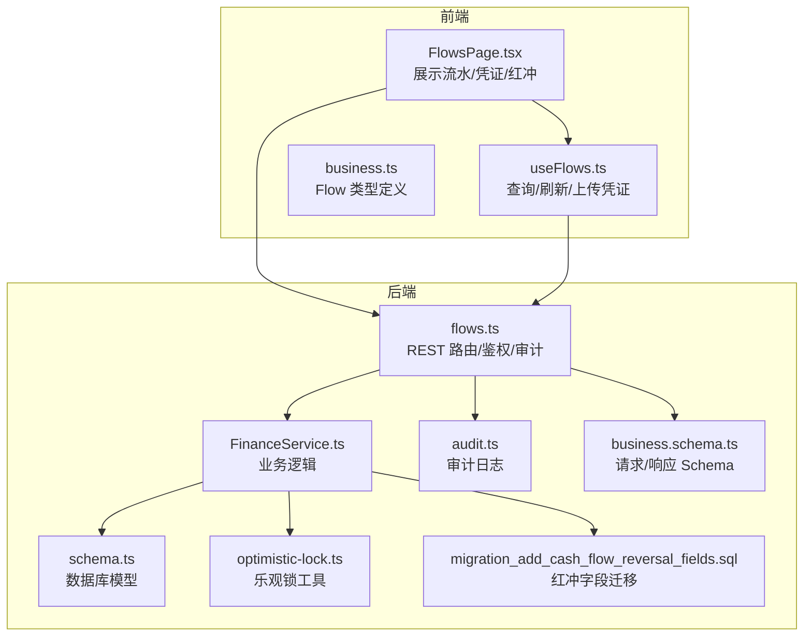
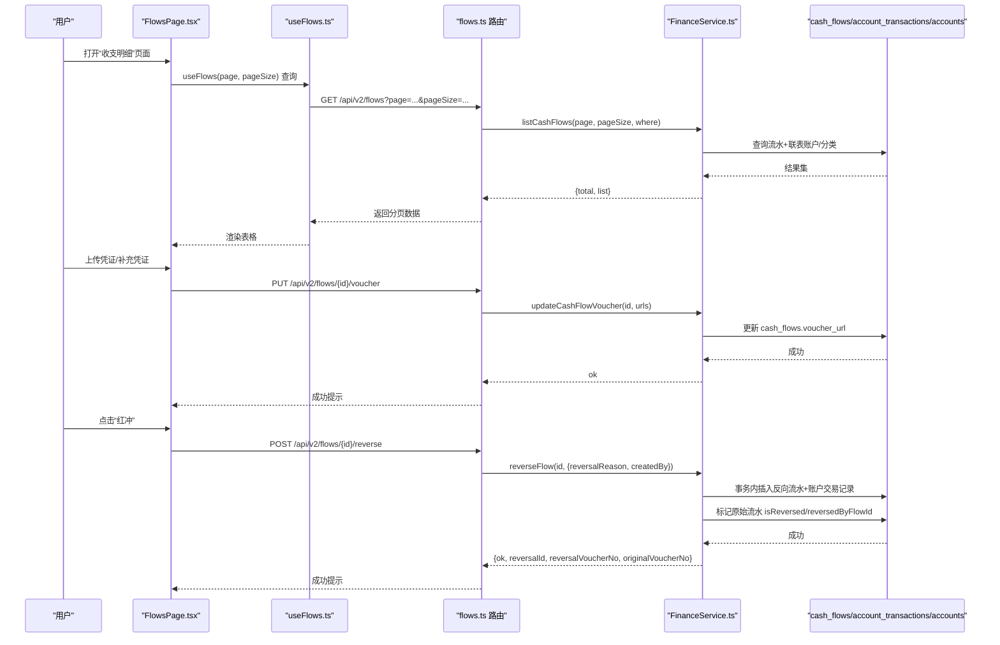
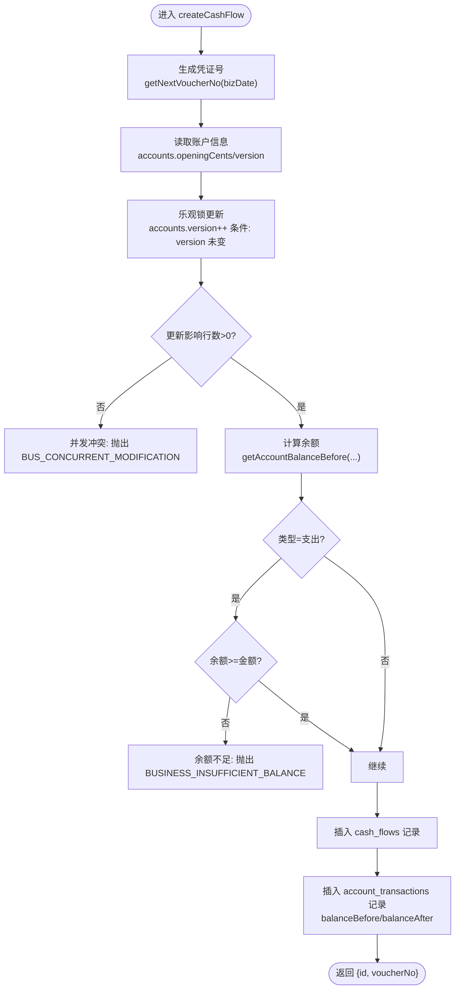
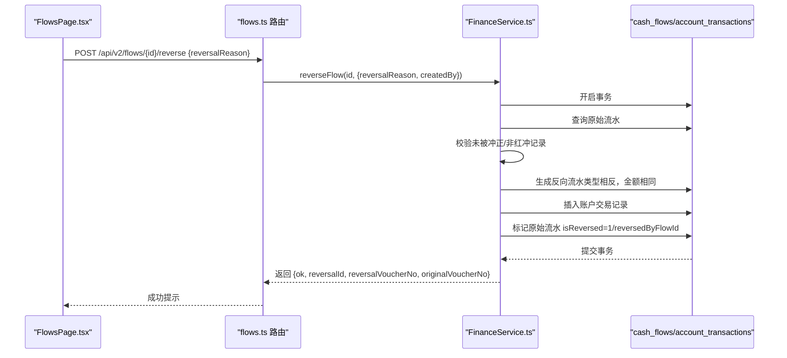
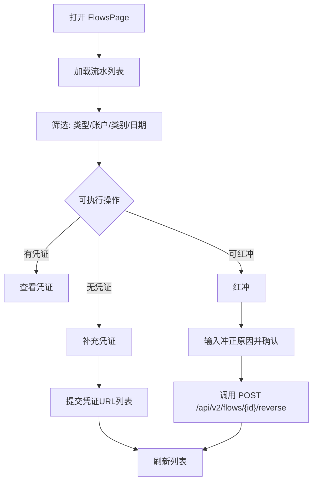
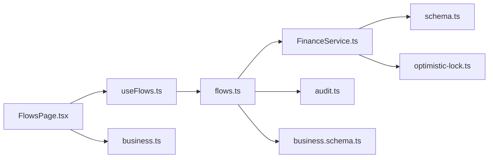

# 财务流水管理

<cite>
**本文引用的文件**
- [FinanceService.ts](file://backend/src/services/FinanceService.ts)
- [flows.ts](file://backend/src/routes/v2/flows.ts)
- [schema.ts](file://backend/src/db/schema.ts)
- [optimistic-lock.ts](file://backend/src/utils/optimistic-lock.ts)
- [audit.ts](file://backend/src/utils/audit.ts)
- [business.schema.ts](file://backend/src/schemas/business.schema.ts)
- [migration_add_cash_flow_reversal_fields.sql](file://backend/src/db/migration_add_cash_flow_reversal_fields.sql)
- [FlowsPage.tsx](file://frontend/src/features/finance/pages/FlowsPage.tsx)
- [useFlows.ts](file://frontend/src/hooks/business/useFlows.ts)
- [business.ts](file://frontend/src/types/business.ts)
- [finance-core.test.ts](file://backend/test/routes/finance-core.test.ts)
</cite>

## 目录
1. [简介](#简介)
2. [项目结构](#项目结构)
3. [核心组件](#核心组件)
4. [架构总览](#架构总览)
5. [详细组件分析](#详细组件分析)
6. [依赖关系分析](#依赖关系分析)
7. [性能考量](#性能考量)
8. [故障排查指南](#故障排查指南)
9. [结论](#结论)
10. [附录](#附录)

## 简介
本文件面向财务流水管理模块，围绕 FinanceService 中的 createCashFlow 方法与 reverseFlow 红冲功能展开，系统性说明凭证号生成策略、余额计算逻辑、乐观锁机制、事务处理、权限校验、审计日志记录以及前后端协作流程。同时结合 FlowsPage 前端页面，给出用户操作流程、API 调用示例与常见问题解决方案（如凭证号重复、余额计算错误等）。

## 项目结构
财务流水模块由后端服务层、路由层、数据库模型与前端页面/Hook 组成：
- 后端服务层：FinanceService 提供凭证号生成、余额计算、流水创建、红冲等核心能力
- 路由层：flows.ts 定义 REST 接口，负责鉴权、参数校验、审计日志与响应封装
- 数据库模型：schema.ts 定义 cash_flows、account_transactions、accounts 等表及字段
- 前端页面：FlowsPage.tsx 展示流水列表、凭证上传、红冲操作入口
- 前端 Hook：useFlows.ts 管理分页查询、缓存与刷新

图表来源
- [flows.ts](file://backend/src/routes/v2/flows.ts#L1-L120)
- [FinanceService.ts](file://backend/src/services/FinanceService.ts#L1-L120)
- [schema.ts](file://backend/src/db/schema.ts#L159-L206)
- [optimistic-lock.ts](file://backend/src/utils/optimistic-lock.ts#L1-L41)
- [audit.ts](file://backend/src/utils/audit.ts#L1-L90)
- [business.schema.ts](file://backend/src/schemas/business.schema.ts#L1-L41)
- [migration_add_cash_flow_reversal_fields.sql](file://backend/src/db/migration_add_cash_flow_reversal_fields.sql#L1-L18)
- [FlowsPage.tsx](file://frontend/src/features/finance/pages/FlowsPage.tsx#L1-L120)
- [useFlows.ts](file://frontend/src/hooks/business/useFlows.ts#L1-L77)
- [business.ts](file://frontend/src/types/business.ts#L1-L31)

章节来源
- [flows.ts](file://backend/src/routes/v2/flows.ts#L1-L120)
- [FinanceService.ts](file://backend/src/services/FinanceService.ts#L1-L120)
- [schema.ts](file://backend/src/db/schema.ts#L159-L206)
- [FlowsPage.tsx](file://frontend/src/features/finance/pages/FlowsPage.tsx#L1-L120)

## 核心组件
- 凭证号生成：getNextVoucherNo(date) 基于业务日期与序列号生成 JZYYYYMMDD-PPP 格式凭证号
- 余额计算：getAccountBalanceBefore(accountId, date, timestamp) 通过历史交易推导某时刻前的余额
- 乐观锁：通过 accounts.version 字段实现并发冲突检测
- 红冲：reverseFlow(originalFlowId, { reversalReason, createdBy }) 在事务内生成反向流水并标记原始流水状态

章节来源
- [FinanceService.ts](file://backend/src/services/FinanceService.ts#L25-L120)
- [FinanceService.ts](file://backend/src/services/FinanceService.ts#L280-L437)
- [schema.ts](file://backend/src/db/schema.ts#L159-L206)

## 架构总览
后端采用 Hono + Drizzle ORM，前端基于 React + TanStack Query。FlowsPage 作为入口，通过 useFlows.ts 发起查询与上传凭证请求，flows.ts 路由层统一做权限校验、参数校验与审计日志记录，FinanceService 执行业务逻辑并持久化到 cash_flows 与 account_transactions。

图表来源
- [flows.ts](file://backend/src/routes/v2/flows.ts#L120-L205)
- [flows.ts](file://backend/src/routes/v2/flows.ts#L207-L290)
- [flows.ts](file://backend/src/routes/v2/flows.ts#L292-L366)
- [flows.ts](file://backend/src/routes/v2/flows.ts#L494-L566)
- [FinanceService.ts](file://backend/src/services/FinanceService.ts#L280-L437)
- [schema.ts](file://backend/src/db/schema.ts#L159-L206)

## 详细组件分析

### 凭证号生成与流水创建（createCashFlow）
- 凭证号生成
  - 基于业务日期（YYYY-MM-DD 截取）统计当日流水数量，序列号按 3 位左填充
  - 输出格式为 JZYYYYMMDD-PPP
- 余额计算
  - 通过 getAccountBalanceBefore(accountId, bizDate, now) 查找 bizDate/now 之前最后一条交易的 balanceAfterCents
  - 若无历史交易，则回退到账户 openingCents
- 乐观锁
  - 读取 accounts.version 并尝试更新 accounts.version = version + 1，where 条件要求版本未变更
  - 若更新影响行数为 0，判定并发冲突，抛出错误
- 余额校验（仅支出）
  - 支出时若余额不足，抛出余额不足错误
- 写入流水与交易记录
  - 插入 cash_flows 记录（含凭证号、金额、类型、摘要等）
  - 插入 account_transactions 记录（含 balanceBeforeCents/balanceAfterCents）

图表来源
- [FinanceService.ts](file://backend/src/services/FinanceService.ts#L25-L120)
- [FinanceService.ts](file://backend/src/services/FinanceService.ts#L146-L229)
- [schema.ts](file://backend/src/db/schema.ts#L159-L206)

章节来源
- [FinanceService.ts](file://backend/src/services/FinanceService.ts#L25-L120)
- [FinanceService.ts](file://backend/src/services/FinanceService.ts#L146-L229)
- [finance-core.test.ts](file://backend/test/routes/finance-core.test.ts#L226-L262)

### 红冲功能（reverseFlow）
- 事务处理
  - 使用 db.transaction 包裹整个红冲流程，保证原子性
- 权限校验
  - 仅具备 finance.flow.reverse 权限的用户可执行红冲
- 审计日志
  - 调用 logAuditAction 记录 reverse 操作详情
- 数据一致性
  - 校验原始流水存在且未被冲正，且自身不是红冲记录
  - 生成反向流水（收入/支出互换，金额不变），并插入账户交易记录
  - 标记原始流水 isReversed=1 与 reversedByFlowId
- 数据库字段设计
  - cash_flows 新增字段：is_reversal、reversal_of_flow_id、is_reversed、reversed_by_flow_id
  - 迁移脚本已在 schema 中体现

图表来源
- [flows.ts](file://backend/src/routes/v2/flows.ts#L494-L566)
- [FinanceService.ts](file://backend/src/services/FinanceService.ts#L280-L437)
- [schema.ts](file://backend/src/db/schema.ts#L159-L206)
- [migration_add_cash_flow_reversal_fields.sql](file://backend/src/db/migration_add_cash_flow_reversal_fields.sql#L1-L18)

章节来源
- [FinanceService.ts](file://backend/src/services/FinanceService.ts#L280-L437)
- [flows.ts](file://backend/src/routes/v2/flows.ts#L494-L566)
- [schema.ts](file://backend/src/db/schema.ts#L159-L206)
- [migration_add_cash_flow_reversal_fields.sql](file://backend/src/db/migration_add_cash_flow_reversal_fields.sql#L1-L18)

### 前端页面与用户操作流程（FlowsPage）
- 页面职责
  - 展示流水列表、搜索过滤、凭证查看/上传、红冲入口
  - 基于 useFlows.ts 查询与刷新，支持分页
- 用户操作
  - 补充/重新上传凭证：选择文件，转换为 WebP，提交至后端
  - 红冲：输入冲正原因，确认后调用后端接口
- 权限控制
  - 仅具备 finance.flow.reverse 权限的用户可见红冲按钮

图表来源
- [FlowsPage.tsx](file://frontend/src/features/finance/pages/FlowsPage.tsx#L1-L120)
- [FlowsPage.tsx](file://frontend/src/features/finance/pages/FlowsPage.tsx#L120-L220)
- [useFlows.ts](file://frontend/src/hooks/business/useFlows.ts#L1-L77)

章节来源
- [FlowsPage.tsx](file://frontend/src/features/finance/pages/FlowsPage.tsx#L1-L120)
- [useFlows.ts](file://frontend/src/hooks/business/useFlows.ts#L1-L77)
- [business.ts](file://frontend/src/types/business.ts#L1-L31)

## 依赖关系分析
- 服务层依赖
  - FinanceService 依赖 schema.ts 中的 cash_flows、account_transactions、accounts 表
  - 乐观锁工具 optimistic-lock.ts 用于版本校验
- 路由层依赖
  - flows.ts 依赖权限校验、审计日志、响应封装与业务 Schema
- 前端依赖
  - FlowsPage.tsx 依赖 useFlows.ts 与类型定义 business.ts

图表来源
- [FinanceService.ts](file://backend/src/services/FinanceService.ts#L1-L120)
- [schema.ts](file://backend/src/db/schema.ts#L159-L206)
- [optimistic-lock.ts](file://backend/src/utils/optimistic-lock.ts#L1-L41)
- [flows.ts](file://backend/src/routes/v2/flows.ts#L1-L120)
- [audit.ts](file://backend/src/utils/audit.ts#L1-L90)
- [business.schema.ts](file://backend/src/schemas/business.schema.ts#L1-L41)
- [FlowsPage.tsx](file://frontend/src/features/finance/pages/FlowsPage.tsx#L1-L120)
- [useFlows.ts](file://frontend/src/hooks/business/useFlows.ts#L1-L77)
- [business.ts](file://frontend/src/types/business.ts#L1-L31)

章节来源
- [FinanceService.ts](file://backend/src/services/FinanceService.ts#L1-L120)
- [flows.ts](file://backend/src/routes/v2/flows.ts#L1-L120)

## 性能考量
- 索引与查询
  - cash_flows 对 (accountId, bizDate)、(type)、(reversal_of_flow_id) 建有索引，有助于按账户/类型/红冲关系查询
- 乐观锁与并发
  - 通过 accounts.version 实现轻量级并发控制，避免余额计算竞态
- 事务边界
  - 红冲在事务内执行，确保原子性与一致性
- 前端缓存
  - useFlows.ts 使用 TanStack Query 缓存与占位数据，减少重复请求

章节来源
- [schema.ts](file://backend/src/db/schema.ts#L159-L206)
- [FinanceService.ts](file://backend/src/services/FinanceService.ts#L146-L229)
- [useFlows.ts](file://frontend/src/hooks/business/useFlows.ts#L1-L77)

## 故障排查指南
- 凭证号重复
  - 现象：创建流水时报凭证号冲突
  - 原因：同一天序列号冲突
  - 处理：使用 GET /api/v2/flows/next-voucher 获取最新凭证号，或调整业务日期
  - 参考：[flows.ts](file://backend/src/routes/v2/flows.ts#L69-L95)、[FinanceService.ts](file://backend/src/services/FinanceService.ts#L25-L39)
- 余额不足
  - 现象：支出流水创建失败
  - 原因：getAccountBalanceBefore 计算的余额小于支出金额
  - 处理：检查历史交易、确认账户期初余额与期间入账；必要时先补入账再支出
  - 参考：[FinanceService.ts](file://backend/src/services/FinanceService.ts#L172-L186)
- 并发冲突
  - 现象：创建流水报“账户状态已更变（并发冲突）”
  - 原因：accounts.version 版本不匹配导致乐观锁更新失败
  - 处理：重试或等待其他写入完成
  - 参考：[FinanceService.ts](file://backend/src/services/FinanceService.ts#L146-L166)、[optimistic-lock.ts](file://backend/src/utils/optimistic-lock.ts#L16-L32)
- 红冲重复或错误
  - 现象：提示“该流水已被冲正”或“红冲记录不能再次冲正”
  - 处理：检查 isReversed/isReversal 字段，确认原始流水状态
  - 参考：[FinanceService.ts](file://backend/src/services/FinanceService.ts#L304-L322)、[schema.ts](file://backend/src/db/schema.ts#L159-L206)
- 凭证上传失败
  - 现象：前端提示上传失败或后端校验失败
  - 处理：确认文件类型为 WebP、大小限制、R2 存储可用性
  - 参考：[flows.ts](file://backend/src/routes/v2/flows.ts#L235-L290)、[FlowsPage.tsx](file://frontend/src/features/finance/pages/FlowsPage.tsx#L376-L407)

章节来源
- [FinanceService.ts](file://backend/src/services/FinanceService.ts#L25-L39)
- [FinanceService.ts](file://backend/src/services/FinanceService.ts#L146-L186)
- [optimistic-lock.ts](file://backend/src/utils/optimistic-lock.ts#L16-L32)
- [flows.ts](file://backend/src/routes/v2/flows.ts#L69-L95)
- [flows.ts](file://backend/src/routes/v2/flows.ts#L235-L290)
- [schema.ts](file://backend/src/db/schema.ts#L159-L206)

## 结论
财务流水管理模块通过明确的凭证号生成策略、严谨的余额计算与乐观锁机制、完善的红冲事务与权限控制，以及前后端协同的审计日志，实现了高一致性的流水记账与冲正能力。建议在生产环境中持续关注并发场景下的重试策略与监控告警，确保业务连续性与数据准确性。

## 附录

### API 调用示例（不含具体代码内容）
- 获取下一个凭证号
  - 方法：GET /api/v2/flows/next-voucher?date=YYYY-MM-DD
  - 返回：{ voucherNo }
  - 参考：[flows.ts](file://backend/src/routes/v2/flows.ts#L69-L95)
- 创建流水
  - 方法：POST /api/v2/flows
  - 请求体：参考 createCashFlowSchema
  - 返回：{ id, voucherNo }
  - 参考：[flows.ts](file://backend/src/routes/v2/flows.ts#L327-L426)、[business.schema.ts](file://backend/src/schemas/business.schema.ts#L1-L41)
- 更新凭证
  - 方法：PUT /api/v2/flows/{id}/voucher
  - 请求体：{ voucherUrls: string[] }
  - 返回：{ ok }
  - 参考：[flows.ts](file://backend/src/routes/v2/flows.ts#L428-L492)
- 红冲流水
  - 方法：POST /api/v2/flows/{id}/reverse
  - 请求体：{ reversalReason: string }
  - 返回：{ ok, reversalId, reversalVoucherNo, originalVoucherNo }
  - 参考：[flows.ts](file://backend/src/routes/v2/flows.ts#L494-L566)

章节来源
- [flows.ts](file://backend/src/routes/v2/flows.ts#L69-L95)
- [flows.ts](file://backend/src/routes/v2/flows.ts#L327-L426)
- [flows.ts](file://backend/src/routes/v2/flows.ts#L428-L492)
- [flows.ts](file://backend/src/routes/v2/flows.ts#L494-L566)
- [business.schema.ts](file://backend/src/schemas/business.schema.ts#L1-L41)