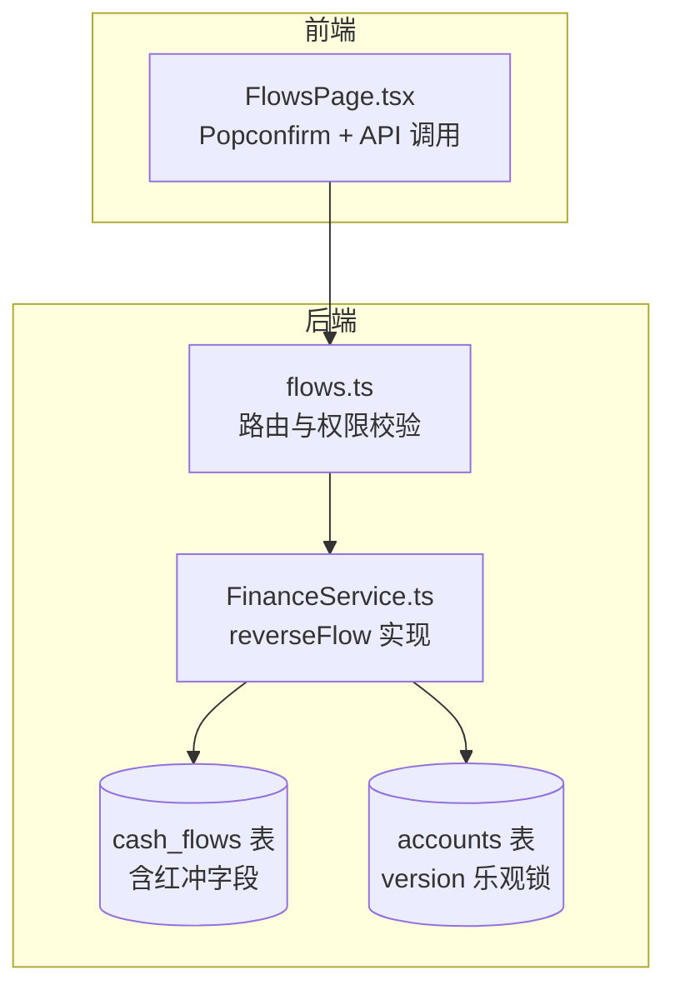
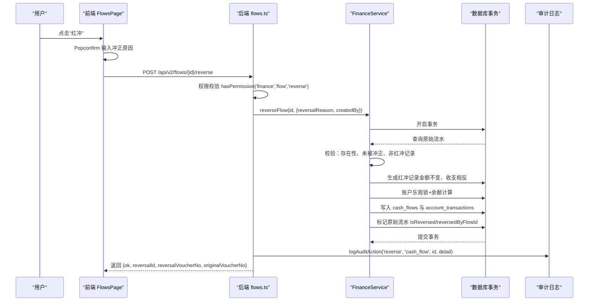
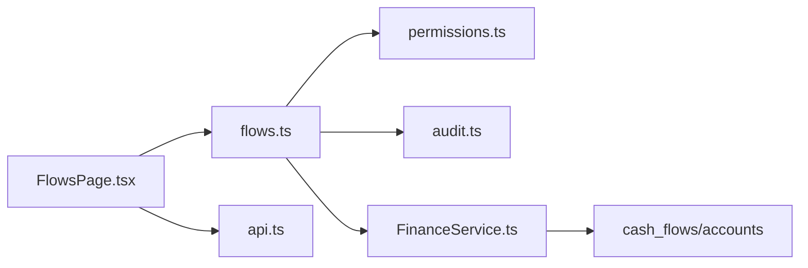
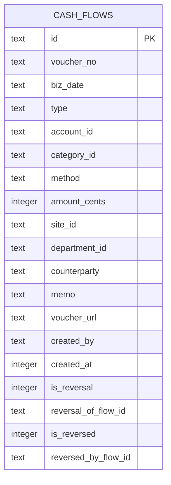

# 财务流水红冲

<cite>
**本文引用的文件**
- [flows.ts](file://backend/src/routes/v2/flows.ts)
- [FinanceService.ts](file://backend/src/services/FinanceService.ts)
- [schema.ts](file://backend/src/db/schema.ts)
- [migration_add_cash_flow_reversal_fields.sql](file://backend/src/db/migration_add_cash_flow_reversal_fields.sql)
- [permissions.ts](file://backend/src/utils/permissions.ts)
- [audit.ts](file://backend/src/utils/audit.ts)
- [errorCodes.ts](file://backend/src/constants/errorCodes.ts)
- [FlowsPage.tsx](file://frontend/src/features/finance/pages/FlowsPage.tsx)
- [api.ts](file://frontend/src/config/api.ts)
- [FinanceService.test.ts](file://backend/test/services/FinanceService.test.ts)
</cite>

## 目录
1. [简介](#简介)
2. [项目结构](#项目结构)
3. [核心组件](#核心组件)
4. [架构总览](#架构总览)
5. [详细组件分析](#详细组件分析)
6. [依赖关系分析](#依赖关系分析)
7. [性能与并发特性](#性能与并发特性)
8. [故障排查指南](#故障排查指南)
9. [结论](#结论)
10. [附录](#附录)

## 简介
本文件围绕“财务流水红冲”能力进行系统化说明，重点解析后端 reverseFlow 方法的实现逻辑，覆盖事务处理、权限校验、审计日志记录以及数据库字段设计（is_reversal、reversal_of_flow_id 等）。同时结合前端 FlowsPage 页面的 Popconfirm 组件，梳理用户交互流程，并给出 API 调用示例与常见问题解决方案（如冲正原因为空、权限不足等）。

## 项目结构
财务红冲功能涉及前后端协作：
- 后端路由层：提供 /flows/{id}/reverse 接口，负责权限校验、参数校验与调用服务层。
- 服务层：FinanceService 实现 reverseFlow 的业务规则与数据库事务。
- 数据层：cash_flows 表新增红冲相关字段；账户乐观锁版本字段用于并发保护。
- 前端页面：FlowsPage 展示流水列表，提供 Popconfirm 确认与调用后端 API。

图表来源
- [flows.ts](file://backend/src/routes/v2/flows.ts#L494-L565)
- [FinanceService.ts](file://backend/src/services/FinanceService.ts#L285-L437)
- [schema.ts](file://backend/src/db/schema.ts#L159-L188)

章节来源
- [flows.ts](file://backend/src/routes/v2/flows.ts#L494-L565)
- [FlowsPage.tsx](file://frontend/src/features/finance/pages/FlowsPage.tsx#L268-L304)

## 核心组件
- 后端路由 flows.ts 中的 reverseFlowRoute：定义接口、参数校验、权限校验与审计日志记录。
- 服务层 FinanceService.reverseFlow：实现红冲业务规则、事务处理、余额计算与标记。
- 数据库迁移 migration_add_cash_flow_reversal_fields.sql：新增 is_reversal、reversal_of_flow_id、is_reversed、reversed_by_flow_id 字段及索引。
- 前端 FlowsPage.tsx：Popconfirm 弹窗收集冲正原因，调用 /flows/{id}/reverse。

章节来源
- [flows.ts](file://backend/src/routes/v2/flows.ts#L494-L565)
- [FinanceService.ts](file://backend/src/services/FinanceService.ts#L285-L437)
- [migration_add_cash_flow_reversal_fields.sql](file://backend/src/db/migration_add_cash_flow_reversal_fields.sql#L1-L17)
- [FlowsPage.tsx](file://frontend/src/features/finance/pages/FlowsPage.tsx#L268-L304)

## 架构总览
后端采用 Hono + Drizzle ORM，前端基于 Ant Design 的 Popconfirm 与自定义 API 配置。整体流程如下：

图表来源
- [flows.ts](file://backend/src/routes/v2/flows.ts#L494-L565)
- [FinanceService.ts](file://backend/src/services/FinanceService.ts#L285-L437)
- [audit.ts](file://backend/src/utils/audit.ts#L33-L90)

## 详细组件分析

### 后端路由：reverseFlowRoute
- 路径与方法：POST /flows/{id}/reverse
- 参数校验：reversalReason 必填
- 权限校验：hasPermission(c, 'finance', 'flow', 'reverse')
- 审计日志：logAuditAction('reverse', 'cash_flow', id, detail)
- 返回值：包含 ok、reversalId、reversalVoucherNo、originalVoucherNo

章节来源
- [flows.ts](file://backend/src/routes/v2/flows.ts#L494-L565)
- [permissions.ts](file://backend/src/utils/permissions.ts#L99-L125)
- [audit.ts](file://backend/src/utils/audit.ts#L33-L90)

### 服务层：FinanceService.reverseFlow
- 事务处理：db.transaction 包裹，保证原子性
- 业务规则：
  - 原始流水必须存在
  - 原始流水未被冲正（isReversed=1 则拒绝）
  - 原始流水不可为红冲记录（isReversal=1 则拒绝）
- 红冲记录生成：
  - 金额不变，收支方向相反
  - 复制 voucherUrl、memo 等字段
  - 设置 isReversal=1、reversalOfFlowId 指向原始流水
- 账户并发保护：
  - 读取 accounts.version
  - 乐观锁更新 version，失败则提示并发冲突
  - 基于 getAccountBalanceBefore 计算余额
- 写入历史：
  - cash_flows 新增红冲记录
  - account_transactions 新增交易记录
- 标记原始流水：
  - isReversed=1、reversedByFlowId=红冲记录ID

章节来源
- [FinanceService.ts](file://backend/src/services/FinanceService.ts#L285-L437)

### 数据库字段设计
- cash_flows 新增字段：
  - is_reversal：是否为红冲记录（0/1）
  - reversal_of_flow_id：冲正的原始流水ID
  - is_reversed：是否已被冲正（0/1）
  - reversed_by_flow_id：冲正记录ID
- 索引：idx_cash_flows_reversal(reversal_of_flow_id)，优化查询
- accounts 新增字段：
  - version：乐观锁版本号，用于并发保护

章节来源
- [schema.ts](file://backend/src/db/schema.ts#L159-L188)
- [migration_add_cash_flow_reversal_fields.sql](file://backend/src/db/migration_add_cash_flow_reversal_fields.sql#L1-L17)

### 前端交互：FlowsPage 的 Popconfirm
- 权限判断：hasPermission('finance','flow','reverse') 控制显示
- 状态管理：reversalReason、reversingFlowId
- 用户体验：弹窗输入冲正原因，点击确认后调用 /flows/{id}/reverse
- 成功反馈：消息提示包含原凭证号与红冲凭证号
- 列表刷新：调用后重新拉取流水列表

章节来源
- [FlowsPage.tsx](file://frontend/src/features/finance/pages/FlowsPage.tsx#L268-L304)
- [api.ts](file://frontend/src/config/api.ts#L40-L46)

### API 调用示例
- 请求
  - 方法：POST
  - 路径：/api/v2/flows/{id}/reverse
  - 请求体：{ reversalReason: "字符串，必填" }
- 响应
  - data.ok：布尔
  - data.reversalId：红冲记录ID
  - data.reversalVoucherNo：红冲凭证号
  - data.originalVoucherNo：原始凭证号

章节来源
- [flows.ts](file://backend/src/routes/v2/flows.ts#L494-L565)
- [api.ts](file://frontend/src/config/api.ts#L40-L46)

## 依赖关系分析
- 路由依赖权限工具 hasPermission，依赖审计工具 logAuditAction
- 服务层依赖 Drizzle ORM 事务、账户余额计算、账户乐观锁
- 数据层依赖 cash_flows 与 accounts 的字段与索引
- 前端依赖 Ant Design Popconfirm 与自定义 API 配置

图表来源
- [flows.ts](file://backend/src/routes/v2/flows.ts#L494-L565)
- [permissions.ts](file://backend/src/utils/permissions.ts#L99-L125)
- [audit.ts](file://backend/src/utils/audit.ts#L33-L90)
- [FinanceService.ts](file://backend/src/services/FinanceService.ts#L285-L437)
- [schema.ts](file://backend/src/db/schema.ts#L159-L188)
- [FlowsPage.tsx](file://frontend/src/features/finance/pages/FlowsPage.tsx#L268-L304)
- [api.ts](file://frontend/src/config/api.ts#L40-L46)

## 性能与并发特性
- 事务隔离：reverseFlow 在单事务内完成查询、插入与更新，保证一致性
- 并发控制：通过 accounts.version 乐观锁，避免账户余额计算与更新的竞态
- 查询优化：cash_flows 对 reversal_of_flow_id 建立索引，便于按原始流水查询红冲记录
- 余额计算：基于历史交易表 account_transactions 的余额链路，避免存储冗余余额

章节来源
- [FinanceService.ts](file://backend/src/services/FinanceService.ts#L347-L373)
- [schema.ts](file://backend/src/db/schema.ts#L159-L188)
- [migration_add_cash_flow_reversal_fields.sql](file://backend/src/db/migration_add_cash_flow_reversal_fields.sql#L1-L17)

## 故障排查指南
- 冲正原因为空
  - 现象：后端参数校验失败
  - 解决：前端 Popconfirm 中必填冲正原因
  - 参考：[flows.ts](file://backend/src/routes/v2/flows.ts#L506-L508)
- 权限不足
  - 现象：抛出 403 Forbidden
  - 解决：确认职位权限包含 finance.flow.reverse
  - 参考：[flows.ts](file://backend/src/routes/v2/flows.ts#L536-L539)、[permissions.ts](file://backend/src/utils/permissions.ts#L99-L125)
- 原始流水不存在
  - 现象：抛出 404 Not Found
  - 解决：确认流水ID正确
  - 参考：[FinanceService.ts](file://backend/src/services/FinanceService.ts#L300-L302)
- 已被冲正的流水再次冲正
  - 现象：抛出“该流水已被冲正，不能重复操作”
  - 解决：避免对已冲正流水再次冲正
  - 参考：[FinanceService.ts](file://backend/src/services/FinanceService.ts#L304-L312)
- 红冲记录再次冲正
  - 现象：抛出“红冲记录不能再次冲正”
  - 解决：红冲记录本身即为冲正，不应再冲正
  - 参考：[FinanceService.ts](file://backend/src/services/FinanceService.ts#L314-L322)
- 账户并发冲突
  - 现象：抛出“账户状态已更变（并发冲突），请重试”
  - 解决：稍后重试，避免高并发同时修改同一账户
  - 参考：[FinanceService.ts](file://backend/src/services/FinanceService.ts#L347-L362)
- 审计日志未记录
  - 现象：敏感操作未留痕
  - 解决：确认 logAuditAction 能获取 userId 与 AuditService 可用
  - 参考：[audit.ts](file://backend/src/utils/audit.ts#L33-L90)

章节来源
- [flows.ts](file://backend/src/routes/v2/flows.ts#L506-L565)
- [permissions.ts](file://backend/src/utils/permissions.ts#L99-L125)
- [FinanceService.ts](file://backend/src/services/FinanceService.ts#L300-L362)
- [audit.ts](file://backend/src/utils/audit.ts#L33-L90)

## 结论
财务流水红冲通过严格的业务规则、事务与乐观锁保障一致性，并以审计日志记录敏感操作。数据库层面通过新增字段与索引支撑查询与报表过滤。前端以 Popconfirm 提供明确的用户交互，配合后端权限与参数校验，形成完整的冲正闭环。

## 附录

### 业务规则清单
- 原始流水必须存在
- 原始流水未被冲正
- 原始流水不可为红冲记录
- 红冲记录金额与原始一致，收支方向相反
- 冲正原因必填
- 仅具备 finance.flow.reverse 权限的用户可执行冲正

章节来源
- [FinanceService.ts](file://backend/src/services/FinanceService.ts#L300-L322)
- [flows.ts](file://backend/src/routes/v2/flows.ts#L506-L508)
- [permissions.ts](file://backend/src/utils/permissions.ts#L99-L125)

### 数据模型图（cash_flows 关键字段）

图表来源
- [schema.ts](file://backend/src/db/schema.ts#L159-L188)

### 单元测试要点（验证业务规则）
- 成功红冲：返回 ok、凭证号、原始凭证号
- 已冲正流水禁止再次冲正
- 红冲记录禁止再次冲正
- 余额链路正确（红冲为相反方向）

章节来源
- [FinanceService.test.ts](file://backend/test/services/FinanceService.test.ts#L216-L390)