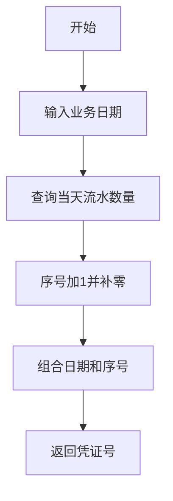
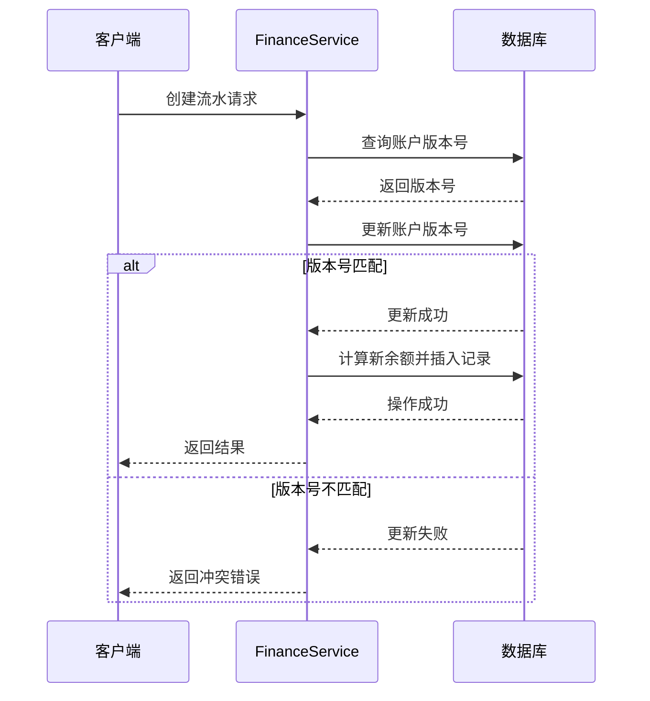
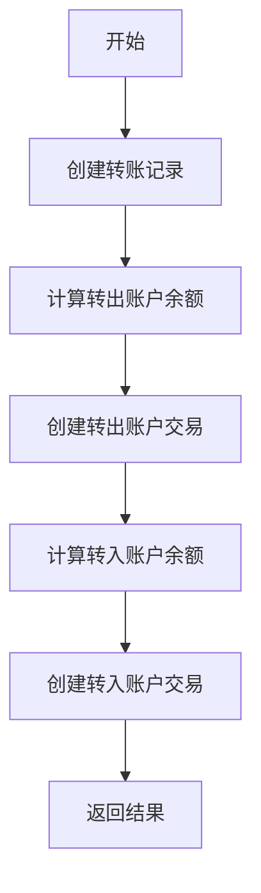
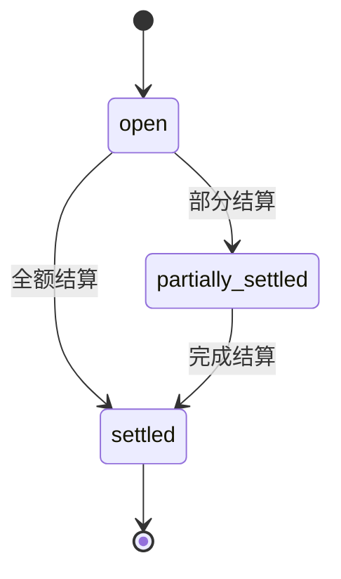

# 财务管理

<cite>
**本文档引用的文件**  
- [FinanceService.ts](file://backend/src/services/FinanceService.ts)
- [flows.ts](file://backend/src/routes/v2/flows.ts)
- [AccountTransferService.ts](file://backend/src/services/AccountTransferService.ts)
- [account-transfers.ts](file://backend/src/routes/v2/account-transfers.ts)
- [ArApService.ts](file://backend/src/services/ArApService.ts)
- [ar-ap.ts](file://backend/src/routes/v2/ar-ap.ts)
- [BorrowingService.ts](file://backend/src/services/BorrowingService.ts)
- [borrowings.ts](file://backend/src/routes/v2/borrowings.ts)
- [schema.ts](file://backend/src/db/schema.ts)
- [business.schema.ts](file://backend/src/schemas/business.schema.ts)
- [FlowsPage.tsx](file://frontend/src/features/finance/pages/FlowsPage.tsx)
- [AccountTransferPage.tsx](file://frontend/src/features/finance/pages/AccountTransferPage.tsx)
- [APPage.tsx](file://frontend/src/features/finance/pages/APPage.tsx)
- [ARPage.tsx](file://frontend/src/features/finance/pages/ARPage.tsx)
- [BorrowingManagementPage.tsx](file://frontend/src/features/finance/pages/BorrowingManagementPage.tsx)
</cite>

## 目录
1. [引言](#引言)
2. [财务流水管理](#财务流水管理)
   1. [创建财务流水](#创建财务流水)
   2. [凭证号生成](#凭证号生成)
   3. [余额计算](#余额计算)
   4. [乐观锁机制](#乐观锁机制)
   5. [红冲功能](#红冲功能)
3. [账户转账管理](#账户转账管理)
   1. [双账户记账流程](#双账户记账流程)
4. [应收应付（AR/AP）管理](#应收应付（ar/ap）管理)
   1. [业务模型](#业务模型)
   2. [状态机](#状态机)
5. [借款管理](#借款管理)
   1. [全生命周期管理](#全生命周期管理)
6. [用户操作流程](#用户操作流程)
   1. [财务流水操作](#财务流水操作)
   2. [账户转账操作](#账户转账操作)
   3. [应收应付操作](#应收应付操作)
   4. [借款管理操作](#借款管理操作)
7. [API调用示例](#api调用示例)
8. [常见问题解决方案](#常见问题解决方案)

## 引言
财务管理模块是企业财务系统的核心组成部分，负责处理财务流水、账户转账、应收应付（AR/AP）和借款管理四大核心功能。本模块通过后端服务和前端页面的协同工作，实现了财务数据的准确记录、安全处理和高效管理。系统采用乐观锁机制确保数据一致性，通过凭证号生成规则保证交易的可追溯性，并提供了红冲、转账、应收应付确认等关键业务功能。

## 财务流水管理

### 创建财务流水
`FinanceService`中的`createCashFlow`方法是创建财务流水的核心功能。该方法接收包含业务日期、类型、账户ID、金额等信息的数据对象，并在数据库中创建相应的流水记录。方法首先生成凭证号，然后获取账户的当前余额和版本号，通过乐观锁机制确保并发安全，最后计算新的余额并插入流水和账户交易记录。

**Section sources**
- [FinanceService.ts](file://backend/src/services/FinanceService.ts#L70-L229)
- [flows.ts](file://backend/src/routes/v2/flows.ts#L327-L426)

### 凭证号生成
凭证号的生成遵循`JZYYYYMMDD-XXX`的格式，其中`JZ`代表记账，`YYYYMMDD`是业务日期，`XXX`是当天的流水序号。`getNextVoucherNo`方法通过查询数据库中指定日期的流水数量，将序号加1后补零至三位，从而生成唯一的凭证号。



**Diagram sources**
- [FinanceService.ts](file://backend/src/services/FinanceService.ts#L25-L38)

### 余额计算
余额计算通过`getAccountBalanceBefore`方法实现。该方法根据指定的账户ID、日期和时间戳，查找此时间点之前的最后一笔交易，返回其交易后余额。如果未找到历史交易，则返回账户的期初余额。在创建流水时，系统根据流水类型（收入或支出）计算新的余额。

**Section sources**
- [FinanceService.ts](file://backend/src/services/FinanceService.ts#L41-L68)

### 乐观锁机制
为了防止并发修改导致的数据不一致，系统在`accounts`表中引入了`version`字段作为乐观锁。在创建流水时，系统首先获取账户的当前版本号，然后尝试更新版本号（`version + 1`），并检查更新影响的行数。如果影响行数为0，说明账户已被其他事务修改，系统将抛出并发冲突异常。



**Diagram sources**
- [FinanceService.ts](file://backend/src/services/FinanceService.ts#L146-L165)

### 红冲功能
红冲功能通过`reverseFlow`方法实现，用于纠正错误的财务流水。该方法首先检查原始流水是否存在、是否已被冲正或是否为红冲记录。然后生成一笔反向的流水记录（收入变支出，支出变收入），更新账户余额，并标记原始流水为已冲正。整个过程在数据库事务中执行，确保数据一致性。

**Section sources**
- [FinanceService.ts](file://backend/src/services/FinanceService.ts#L285-L437)
- [flows.ts](file://backend/src/routes/v2/flows.ts#L494-L565)

## 账户转账管理

### 双账户记账流程
账户转账通过`AccountTransferService`实现双账户记账。当用户发起转账时，系统首先创建转账记录，然后分别在转出账户和转入账户中创建交易记录。转出账户的交易类型为`transfer_out`，金额为负；转入账户的交易类型为`transfer_in`，金额为正。两个账户的余额计算都基于`getAccountBalanceBefore`方法，确保余额计算的准确性。



**Diagram sources**
- [AccountTransferService.ts](file://backend/src/services/AccountTransferService.ts#L59-L122)

## 应收应付（AR/AP）管理

### 业务模型
应收应付（AR/AP）管理通过`ArApService`实现。系统使用`ar_ap_docs`表存储应收应付单据，包含单据类型（AR或AP）、金额、开立日期、到期日等信息。当单据确认时，系统会创建相应的财务流水，并通过`settlements`表记录结算情况。单据的状态会根据结算金额自动更新。

**Section sources**
- [ArApService.ts](file://backend/src/services/ArApService.ts#L84-L117)
- [ar-ap.ts](file://backend/src/routes/v2/ar-ap.ts#L163-L220)

### 状态机
应收应付单据的状态机包括`open`（未结）、`partially_settled`（部分结算）和`settled`（已结清）。`refreshStatus`方法根据结算金额与单据金额的比较结果，自动更新单据状态。当结算金额等于或大于单据金额时，状态变为`settled`；当结算金额大于0但小于单据金额时，状态变为`partially_settled`。



**Diagram sources**
- [ArApService.ts](file://backend/src/services/ArApService.ts#L120-L140)

## 借款管理

### 全生命周期管理
借款管理通过`BorrowingService`实现全生命周期管理。系统使用`borrowings`表存储借款信息，`repayments`表存储还款信息。用户可以创建借款，然后通过还款记录逐步偿还。`getBorrowingBalances`方法计算每个员工的借款余额，通过比较借款总额和还款总额，提供准确的财务视图。

**Section sources**
- [BorrowingService.ts](file://backend/src/services/BorrowingService.ts#L109-L135)
- [borrowings.ts](file://backend/src/routes/v2/borrowings.ts#L148-L209)

## 用户操作流程

### 财务流水操作
用户通过`FlowsPage`页面管理财务流水。用户可以查看流水列表，按类型、账户、日期等条件筛选。对于每条流水，用户可以查看凭证、补充凭证或执行红冲操作。红冲操作需要输入冲正原因，并经过权限验证。

**Section sources**
- [FlowsPage.tsx](file://frontend/src/features/finance/pages/FlowsPage.tsx#L1-L456)

### 账户转账操作
用户通过`AccountTransferPage`页面执行账户转账。用户需要选择转出和转入账户，输入金额和汇率（如适用），并上传转账凭证。系统会根据汇率自动计算转入金额，确保转账的准确性。

**Section sources**
- [AccountTransferPage.tsx](file://frontend/src/features/finance/pages/AccountTransferPage.tsx#L1-L362)

### 应收应付操作
用户通过`APPage`和`ARPage`页面管理应付和应收。用户可以创建单据，填写金额、日期等信息。当单据需要确认时，用户通过确认流程创建相应的财务流水，并上传凭证。系统提供对账单功能，显示单据的结算历史。

**Section sources**
- [APPage.tsx](file://frontend/src/features/finance/pages/APPage.tsx#L1-L320)
- [ARPage.tsx](file://frontend/src/features/finance/pages/ARPage.tsx#L1-L407)

### 借款管理操作
用户通过`BorrowingManagementPage`页面管理借款。用户可以创建新的借款记录，指定借款人、金额、币种和账户。系统显示所有借款记录，包括借款人、金额和日期等信息。

**Section sources**
- [BorrowingManagementPage.tsx](file://frontend/src/features/finance/pages/BorrowingManagementPage.tsx#L1-L167)

## API调用示例
创建财务流水的API调用示例：
```json
POST /api/v2/flows
{
  "accountId": "acc-123",
  "categoryId": "cat-456",
  "bizDate": "2023-12-01",
  "type": "income",
  "amountCents": 10000,
  "voucherUrls": ["https://example.com/voucher1.webp"]
}
```

红冲财务流水的API调用示例：
```json
POST /api/v2/flows/{id}/reverse
{
  "reversalReason": "金额录入错误"
}
```

## 常见问题解决方案
1. **余额不足错误**：检查账户余额是否足够，确保在支出流水前有足够的收入。
2. **并发冲突错误**：当多个用户同时修改同一账户时可能发生。建议用户重试操作。
3. **凭证上传失败**：检查文件格式是否为支持的图片格式（JPEG、PNG、GIF、WebP），并确保文件大小不超过10MB。
4. **红冲失败**：检查原始流水是否已被冲正或是否为红冲记录，确保冲正原因不为空。