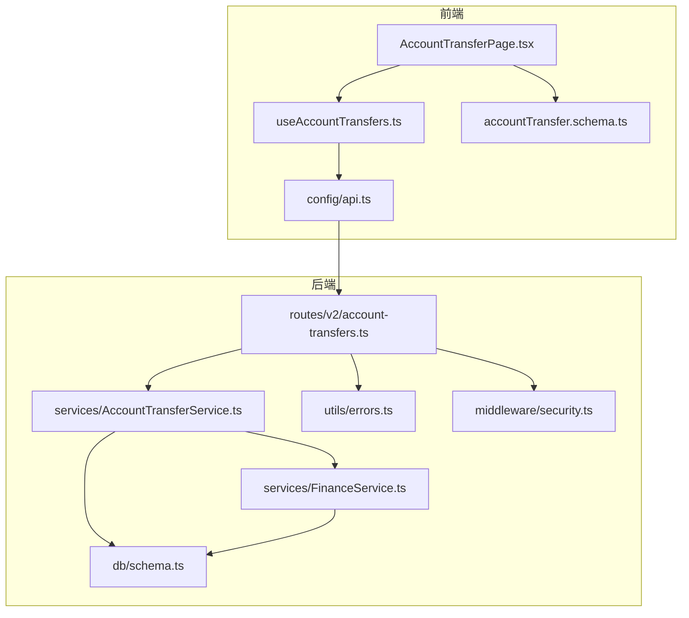
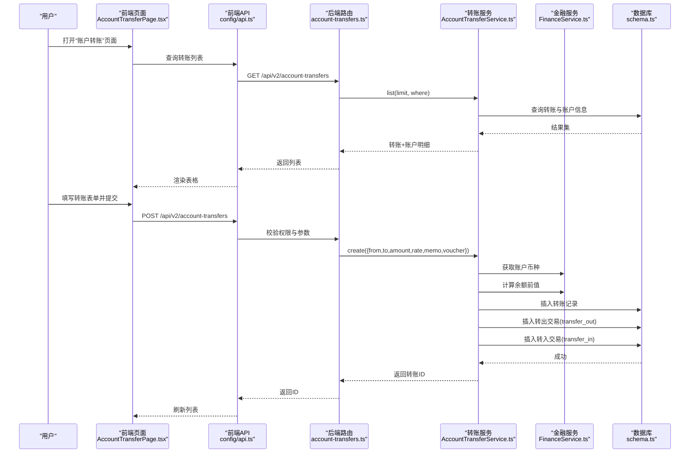
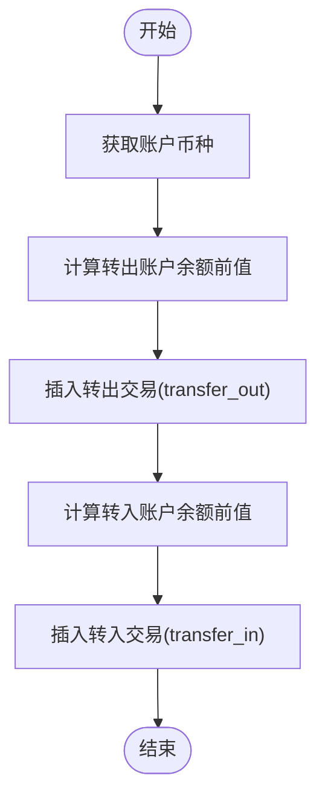
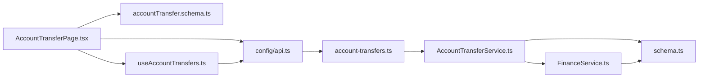

# 账户转账

<cite>
**本文引用的文件**
- [backend/src/routes/v2/account-transfers.ts](file://backend/src/routes/v2/account-transfers.ts)
- [backend/src/services/AccountTransferService.ts](file://backend/src/services/AccountTransferService.ts)
- [backend/src/services/FinanceService.ts](file://backend/src/services/FinanceService.ts)
- [backend/src/db/schema.ts](file://backend/src/db/schema.ts)
- [frontend/src/features/finance/pages/AccountTransferPage.tsx](file://frontend/src/features/finance/pages/AccountTransferPage.tsx)
- [frontend/src/validations/accountTransfer.schema.ts](file://frontend/src/validations/accountTransfer.schema.ts)
- [frontend/src/hooks/business/useAccountTransfers.ts](file://frontend/src/hooks/business/useAccountTransfers.ts)
- [frontend/src/config/api.ts](file://frontend/src/config/api.ts)
- [backend/src/utils/errors.ts](file://backend/src/utils/errors.ts)
- [backend/src/middleware/security.ts](file://backend/src/middleware/security.ts)
</cite>

## 目录
1. [简介](#简介)
2. [项目结构](#项目结构)
3. [核心组件](#核心组件)
4. [架构总览](#架构总览)
5. [详细组件分析](#详细组件分析)
6. [依赖关系分析](#依赖关系分析)
7. [性能考虑](#性能考虑)
8. [故障排查指南](#故障排查指南)
9. [结论](#结论)
10. [附录](#附录)

## 简介
本文件围绕“账户转账”功能，系统性阐述后端双账户记账与事务一致性保障、跨币种转账的汇率计算与余额更新策略，并结合前端 AccountTransferPage 页面说明用户界面操作流程（转账表单、账户选择、金额计算、凭证上传）。同时提供 API 接口规范、错误处理机制与性能优化建议，帮助开发者与使用者全面理解与正确使用该功能。

## 项目结构
- 后端采用 Hono + Drizzle ORM，路由层负责请求校验与鉴权，服务层封装业务逻辑，数据库层定义表结构。
- 前端基于 React + Ant Design，页面组件负责表单交互与数据展示，Hooks 负责调用后端 API 并缓存管理。

图表来源
- [frontend/src/features/finance/pages/AccountTransferPage.tsx](file://frontend/src/features/finance/pages/AccountTransferPage.tsx#L1-L362)
- [frontend/src/hooks/business/useAccountTransfers.ts](file://frontend/src/hooks/business/useAccountTransfers.ts#L1-L39)
- [frontend/src/validations/accountTransfer.schema.ts](file://frontend/src/validations/accountTransfer.schema.ts#L1-L19)
- [frontend/src/config/api.ts](file://frontend/src/config/api.ts#L1-L188)
- [backend/src/routes/v2/account-transfers.ts](file://backend/src/routes/v2/account-transfers.ts#L1-L235)
- [backend/src/services/AccountTransferService.ts](file://backend/src/services/AccountTransferService.ts#L1-L148)
- [backend/src/services/FinanceService.ts](file://backend/src/services/FinanceService.ts#L1-L443)
- [backend/src/db/schema.ts](file://backend/src/db/schema.ts#L448-L476)
- [backend/src/utils/errors.ts](file://backend/src/utils/errors.ts#L1-L228)
- [backend/src/middleware/security.ts](file://backend/src/middleware/security.ts#L1-L81)

章节来源
- [backend/src/routes/v2/account-transfers.ts](file://backend/src/routes/v2/account-transfers.ts#L1-L235)
- [frontend/src/features/finance/pages/AccountTransferPage.tsx](file://frontend/src/features/finance/pages/AccountTransferPage.tsx#L1-L362)

## 核心组件
- 路由层：提供转账列表查询、创建转账、获取转账详情三个接口；进行权限校验与审计日志记录。
- 服务层：
  - AccountTransferService：负责转账记录创建、双账户交易记录生成与余额更新策略。
  - FinanceService：提供账户余额计算、凭证号生成、乐观锁保护等通用金融能力。
- 数据库层：定义 account_transfers、account_transactions、accounts 等核心表。
- 前端页面：提供转账表单、账户选择、金额计算、凭证上传与列表展示。
- 错误处理：统一业务错误与验证错误处理，便于前后端一致化反馈。

章节来源
- [backend/src/services/AccountTransferService.ts](file://backend/src/services/AccountTransferService.ts#L1-L148)
- [backend/src/services/FinanceService.ts](file://backend/src/services/FinanceService.ts#L1-L443)
- [backend/src/db/schema.ts](file://backend/src/db/schema.ts#L448-L476)
- [frontend/src/features/finance/pages/AccountTransferPage.tsx](file://frontend/src/features/finance/pages/AccountTransferPage.tsx#L1-L362)

## 架构总览
转账流程从前端发起，经路由层校验与鉴权，进入服务层执行双账户记账与余额更新，最终持久化到数据库。前端通过 React Query 缓存与刷新机制保证数据一致性。

图表来源
- [frontend/src/features/finance/pages/AccountTransferPage.tsx](file://frontend/src/features/finance/pages/AccountTransferPage.tsx#L1-L362)
- [frontend/src/config/api.ts](file://frontend/src/config/api.ts#L1-L188)
- [backend/src/routes/v2/account-transfers.ts](file://backend/src/routes/v2/account-transfers.ts#L1-L235)
- [backend/src/services/AccountTransferService.ts](file://backend/src/services/AccountTransferService.ts#L1-L148)
- [backend/src/services/FinanceService.ts](file://backend/src/services/FinanceService.ts#L1-L443)
- [backend/src/db/schema.ts](file://backend/src/db/schema.ts#L448-L476)

## 详细组件分析

### 后端路由与权限控制
- 权限校验：创建与查看均要求具备 finance.transfer.create/view 权限。
- 审计日志：创建转账后记录审计动作，包含关键字段。
- 参数校验：使用 OpenAPI Schema 与 Zod Schema 双重约束，确保请求体与查询参数合法。
- 错误处理：统一抛出业务错误与验证错误，便于前端友好提示。

章节来源
- [backend/src/routes/v2/account-transfers.ts](file://backend/src/routes/v2/account-transfers.ts#L1-L235)
- [backend/src/utils/errors.ts](file://backend/src/utils/errors.ts#L1-L228)

### 转账服务：双账户记账与事务一致性
- 转账记录创建：写入 account_transfers 表，包含币种、金额、汇率、凭证等。
- 余额计算策略：
  - 使用 FinanceService.getAccountBalanceBefore 计算某账户在指定日期/时间点之前的最后一条交易余额作为“余额前值”，若无历史则取账户期初余额。
  - 转出账户：余额前值减去转出金额得到余额后值；转入账户：余额前值加上转入金额得到余额后值。
- 交易记录生成：
  - 转出：插入一条类型为 transfer_out 的 account_transactions。
  - 转入：插入一条类型为 transfer_in 的 account_transactions。
- 事务一致性：
  - 当前实现为多条独立插入，未显式包裹在数据库事务中。若需强一致性，可在服务层使用数据库事务包裹转账记录与两条交易记录的插入，确保原子性。
  - 若不包裹事务，可能出现“转账记录已落库，但交易记录未全部成功”的情况，需配合补偿机制或幂等设计。

图表来源
- [backend/src/services/AccountTransferService.ts](file://backend/src/services/AccountTransferService.ts#L44-L124)
- [backend/src/services/FinanceService.ts](file://backend/src/services/FinanceService.ts#L41-L68)

章节来源
- [backend/src/services/AccountTransferService.ts](file://backend/src/services/AccountTransferService.ts#L1-L148)
- [backend/src/services/FinanceService.ts](file://backend/src/services/FinanceService.ts#L1-L200)

### 数据模型与表结构
- account_transfers：存储转账主记录，包含转出/转入账户、币种、金额、汇率、凭证、创建者与时间戳。
- account_transactions：存储账户交易明细，包含交易类型、金额、余额前值与余额后值、关联的转账ID等。
- accounts：账户基础信息，包含币种与期初余额等。

章节来源
- [backend/src/db/schema.ts](file://backend/src/db/schema.ts#L139-L149)
- [backend/src/db/schema.ts](file://backend/src/db/schema.ts#L190-L206)
- [backend/src/db/schema.ts](file://backend/src/db/schema.ts#L448-L476)

### 前端页面：用户操作流程
- 表单字段：
  - 转账日期、转出账户、转入账户、转出金额、汇率（跨币种时必填）、转入金额、备注、凭证上传。
- 金额计算逻辑：
  - 同币种：转入金额等于转出金额，汇率固定为1。
  - 跨币种：根据汇率计算转入金额，前端自动回填。
- 凭证上传：
  - 支持图片格式上传，返回可访问URL，预览与删除。
- 列表展示：
  - 展示转账日期、转出/转入账户与币种、金额、汇率、备注与凭证链接。
- 权限与刷新：
  - 新建按钮触发弹窗，提交后刷新列表；搜索支持日期范围筛选。

章节来源
- [frontend/src/features/finance/pages/AccountTransferPage.tsx](file://frontend/src/features/finance/pages/AccountTransferPage.tsx#L1-L362)
- [frontend/src/validations/accountTransfer.schema.ts](file://frontend/src/validations/accountTransfer.schema.ts#L1-L19)
- [frontend/src/hooks/business/useAccountTransfers.ts](file://frontend/src/hooks/business/useAccountTransfers.ts#L1-L39)
- [frontend/src/config/api.ts](file://frontend/src/config/api.ts#L1-L188)

### API 接口规范
- 列表查询
  - 方法与路径：GET /api/v2/account-transfers
  - 查询参数：
    - fromAccountId（可选）
    - toAccountId（可选）
    - startDate（可选）
    - endDate（可选）
    - limit（可选，默认200）
  - 响应：success + results（数组），每项包含转账基本信息与账户名称/币种等。
- 创建转账
  - 方法与路径：POST /api/v2/account-transfers
  - 请求体字段：
    - transferDate（必填）
    - fromAccountId（必填）
    - toAccountId（必填）
    - fromAmount（必填，单位元，后端转换为分）
    - toAmount（必填，单位元，后端转换为分）
    - exchangeRate（跨币种时必填）
    - memo（可选）
    - voucherUrl（必填，凭证URL）
    - createdBy（由后端注入）
  - 响应：success + id
- 获取详情
  - 方法与路径：GET /api/v2/account-transfers/{id}
  - 响应：转账详情，包含账户名称与币种等扩展信息

章节来源
- [backend/src/routes/v2/account-transfers.ts](file://backend/src/routes/v2/account-transfers.ts#L1-L235)

### 错误处理机制
- 业务错误：如权限不足、资源不存在、验证失败、余额不足等，统一返回标准结构，包含错误码与详情。
- 验证错误：Zod 校验失败时返回结构化的错误数组，包含字段路径与消息。
- 安全响应头：设置多种安全响应头，提升传输与内容安全。

章节来源
- [backend/src/utils/errors.ts](file://backend/src/utils/errors.ts#L1-L228)
- [backend/src/middleware/security.ts](file://backend/src/middleware/security.ts#L1-L81)

## 依赖关系分析
- 前端依赖：
  - 页面组件依赖表单校验、API 配置与查询 Hook。
  - 查询 Hook 使用 React Query 管理缓存与失效。
- 后端依赖：
  - 路由依赖权限工具、审计工具与错误处理。
  - 转账服务依赖金融服务与数据库 schema。
  - 金融服务依赖数据库 schema 与错误常量。

图表来源
- [frontend/src/features/finance/pages/AccountTransferPage.tsx](file://frontend/src/features/finance/pages/AccountTransferPage.tsx#L1-L362)
- [frontend/src/validations/accountTransfer.schema.ts](file://frontend/src/validations/accountTransfer.schema.ts#L1-L19)
- [frontend/src/config/api.ts](file://frontend/src/config/api.ts#L1-L188)
- [frontend/src/hooks/business/useAccountTransfers.ts](file://frontend/src/hooks/business/useAccountTransfers.ts#L1-L39)
- [backend/src/routes/v2/account-transfers.ts](file://backend/src/routes/v2/account-transfers.ts#L1-L235)
- [backend/src/services/AccountTransferService.ts](file://backend/src/services/AccountTransferService.ts#L1-L148)
- [backend/src/services/FinanceService.ts](file://backend/src/services/FinanceService.ts#L1-L443)
- [backend/src/db/schema.ts](file://backend/src/db/schema.ts#L448-L476)

## 性能考虑
- 前端：
  - 列表查询使用 React Query 缓存，合理设置 staleTime 与 invalidate 时机，减少重复请求。
  - 金额计算在前端完成，避免额外网络往返。
- 后端：
  - 转账列表查询对账户ID与日期条件建立索引，提升过滤效率。
  - 余额计算依赖 account_transactions 的索引，确保按账户与日期排序查询高效。
  - 若未来出现高并发转账场景，建议将转账记录与两条交易记录放入数据库事务，确保强一致与可回滚。
- 安全与稳定性：
  - 设置安全响应头，降低常见 Web 攻击风险。
  - 对凭证上传进行格式校验与大小限制，避免异常请求影响系统性能。

[本节为通用指导，无需特定文件来源]

## 故障排查指南
- 权限不足
  - 现象：创建/查看接口返回权限错误。
  - 排查：确认用户角色是否具备 finance.transfer.create/view 权限。
- 参数校验失败
  - 现象：接口返回验证错误，包含字段路径与消息。
  - 排查：核对必填字段、金额范围、日期格式与凭证URL。
- 余额不足（现金流场景）
  - 现象：创建其他现金流时报余额不足。
  - 排查：确认账户余额计算逻辑与历史交易顺序，必要时调整余额计算策略。
- 转账记录与交易记录不一致
  - 现象：转账记录存在但交易记录缺失或不完整。
  - 排查：检查服务层是否包裹事务；若未包裹事务，需增加补偿机制或幂等设计。
- 凭证上传失败
  - 现象：上传图片后无法预览或报错。
  - 排查：确认上传接口可用、图片格式受支持、URL可访问。

章节来源
- [backend/src/utils/errors.ts](file://backend/src/utils/errors.ts#L1-L228)
- [backend/src/services/FinanceService.ts](file://backend/src/services/FinanceService.ts#L146-L186)
- [backend/src/services/AccountTransferService.ts](file://backend/src/services/AccountTransferService.ts#L44-L124)

## 结论
账户转账功能通过“双账户记账 + 余额前值计算”的方式实现了跨币种与同币种转账的灵活支持。前端提供直观的表单与凭证上传体验，后端通过权限校验与审计日志保障安全可控。为进一步提升一致性与可靠性，建议在转账服务层引入数据库事务，确保转账记录与两条交易记录的原子性。同时，持续优化前端缓存策略与后端索引设计，以满足高并发场景下的性能与稳定性需求。

[本节为总结性内容，无需特定文件来源]

## 附录

### 跨币种转账汇率与金额计算要点
- 同币种：转入金额等于转出金额，汇率固定为1。
- 跨币种：根据汇率计算转入金额，前端自动回填；后端保存汇率与金额（分）。
- 币种来源：从账户表读取币种，用于显示与后续报表统计。

章节来源
- [frontend/src/features/finance/pages/AccountTransferPage.tsx](file://frontend/src/features/finance/pages/AccountTransferPage.tsx#L100-L110)
- [backend/src/services/AccountTransferService.ts](file://backend/src/services/AccountTransferService.ts#L67-L76)
- [backend/src/db/schema.ts](file://backend/src/db/schema.ts#L139-L149)

### 余额更新策略与一致性建议
- 余额前值：按账户与日期/时间点查找最近一笔交易的“余额后值”作为前值，无历史则取期初余额。
- 余额后值：转出为前值减去转出金额，转入为前值加上转入金额。
- 一致性建议：将转账记录与两条交易记录放入数据库事务，避免部分写入导致的数据不一致。

章节来源
- [backend/src/services/FinanceService.ts](file://backend/src/services/FinanceService.ts#L41-L68)
- [backend/src/services/AccountTransferService.ts](file://backend/src/services/AccountTransferService.ts#L80-L121)