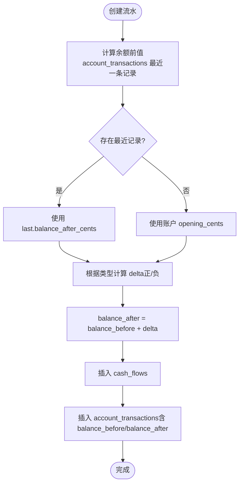

# 财务管理模块

<cite>
**本文引用的文件列表**
- [Flows.tsx](file://frontend/src/features/finance/pages/Flows.tsx)
- [flows.ts](file://backend/src/routes/flows.ts)
- [FinanceService.ts](file://backend/src/services/FinanceService.ts)
- [useFlows.ts](file://frontend/src/hooks/business/useFlows.ts)
- [AccountTransfer.tsx](file://frontend/src/features/finance/pages/AccountTransfer.tsx)
- [account-transfers.ts](file://backend/src/routes/account-transfers.ts)
- [AR.tsx](file://frontend/src/features/finance/pages/AR.tsx)
- [AP.tsx](file://frontend/src/features/finance/pages/AP.tsx)
- [ar-ap.ts](file://backend/src/routes/ar-ap.ts)
- [business.schema.ts](file://backend/src/schemas/business.schema.ts)
- [schema.ts](file://backend/src/db/schema.ts)
- [audit.ts](file://backend/src/utils/audit.ts)
- [permission.ts](file://backend/src/middleware/permission.ts)
- [flow.schema.ts](file://frontend/src/validations/flow.schema.ts)
- [business.ts](file://frontend/src/types/business.ts)
</cite>

## 目录
1. [引言](#引言)
2. [项目结构](#项目结构)
3. [核心组件](#核心组件)
4. [架构总览](#架构总览)
5. [详细组件分析](#详细组件分析)
6. [依赖关系分析](#依赖关系分析)
7. [性能与并发](#性能与并发)
8. [故障排查指南](#故障排查指南)
9. [结论](#结论)
10. [附录](#附录)

## 引言
本文件系统化梳理财务管理核心功能，覆盖资金流水记录、账户间转账、应收账款（AR）、应付账款（AP）管理，并深入解释财务流水的复式记账实现原理与数据一致性保障机制。文档同时结合前端 Flows.tsx 与后端 flows.ts 的交互，说明财务记录的创建、查询与凭证导出流程；详述账户转账的双账户余额同步更新逻辑与事务处理；阐述 AR/AP 的账期管理、逾期提醒与对账功能；最后给出财务数据模型图、关键 API 接口说明、并发操作处理策略以及审计日志集成方式。

## 项目结构
财务管理模块由前后端协同组成：
- 前端页面与表单校验：Flows.tsx、AccountTransfer.tsx、AR.tsx、AP.tsx 及对应验证与类型定义。
- 后端路由与服务：flows.ts、account-transfers.ts、ar-ap.ts 与 FinanceService.ts。
- 数据模型：db/schema.ts 定义了 cash_flows、account_transactions、ar_ap_docs、settlements、account_transfers 等核心表。
- 校验与权限：business.schema.ts 提供请求体校验；permission.ts 提供权限中间件；audit.ts 提供审计日志记录。

图表来源
- [Flows.tsx](file://frontend/src/features/finance/pages/Flows.tsx#L1-L537)
- [AccountTransfer.tsx](file://frontend/src/features/finance/pages/AccountTransfer.tsx#L1-L329)
- [AR.tsx](file://frontend/src/features/finance/pages/AR.tsx#L1-L339)
- [AP.tsx](file://frontend/src/features/finance/pages/AP.tsx#L1-L247)
- [flows.ts](file://backend/src/routes/flows.ts#L1-L424)
- [account-transfers.ts](file://backend/src/routes/account-transfers.ts#L1-L209)
- [ar-ap.ts](file://backend/src/routes/ar-ap.ts#L1-L353)
- [FinanceService.ts](file://backend/src/services/FinanceService.ts#L1-L614)
- [schema.ts](file://backend/src/db/schema.ts#L1-L644)
- [permission.ts](file://backend/src/middleware/permission.ts#L1-L39)
- [audit.ts](file://backend/src/utils/audit.ts#L1-L92)

章节来源
- [Flows.tsx](file://frontend/src/features/finance/pages/Flows.tsx#L1-L537)
- [flows.ts](file://backend/src/routes/flows.ts#L1-L424)
- [FinanceService.ts](file://backend/src/services/FinanceService.ts#L1-L614)
- [schema.ts](file://backend/src/db/schema.ts#L1-L644)

## 核心组件
- 收支记账（Flows）
  - 前端：Flows.tsx 提供收支记账的创建、凭证上传与批量删除；useFlows.ts 提供查询与缓存策略；flow.schema.ts 提供表单校验。
  - 后端：flows.ts 定义凭证上传/下载、流水创建/更新凭证、流水列表与下一张凭证号生成；FinanceService.createCashFlow 实现复式记账与余额计算。
- 账户转账（Account Transfers）
  - 前端：AccountTransfer.tsx 提供转账表单、汇率计算与凭证上传；useAccountTransfers/useCreateAccountTransfer 钩子负责查询与提交。
  - 后端：account-transfers.ts 定义转账列表、创建与详情；FinanceService.createAccountTransfer 实现双账户余额同步与两条交易记录。
- 应收应付（AR/AP）
  - 前端：AR.tsx/AP.tsx 提供 AR/AP 新建、确认与核销；AR 页面支持对账单与核销登记。
  - 后端：ar-ap.ts 定义 AR 文档列表、创建、核销、对账单与确认；FinanceService.createArApDoc/confirmArApDoc/settleArApDoc 实现账期管理与状态刷新。
- 数据模型与一致性
  - schema.ts 定义 cash_flows、account_transactions、ar_ap_docs、settlements、account_transfers 等表；FinanceService 通过“余额前值+变动=后值”的方式保证余额一致性。
- 审计与权限
  - permission.ts 提供权限中间件；audit.ts 记录审计日志；各路由在关键动作上记录审计事件。

章节来源
- [flows.ts](file://backend/src/routes/flows.ts#L1-L424)
- [FinanceService.ts](file://backend/src/services/FinanceService.ts#L1-L614)
- [account-transfers.ts](file://backend/src/routes/account-transfers.ts#L1-L209)
- [ar-ap.ts](file://backend/src/routes/ar-ap.ts#L1-L353)
- [schema.ts](file://backend/src/db/schema.ts#L1-L644)
- [permission.ts](file://backend/src/middleware/permission.ts#L1-L39)
- [audit.ts](file://backend/src/utils/audit.ts#L1-L92)

## 架构总览
财务模块采用“前端页面 + 路由 + 服务层 + 数据库”的分层架构。前端通过 React Query 进行数据拉取与缓存失效，后端使用 OpenAPI 路由定义接口，服务层封装业务逻辑与数据一致性，数据库层通过 Drizzle ORM 映射 SQLite。

图表来源
- [flows.ts](file://backend/src/routes/flows.ts#L302-L374)
- [account-transfers.ts](file://backend/src/routes/account-transfers.ts#L111-L161)
- [FinanceService.ts](file://backend/src/services/FinanceService.ts#L71-L128)
- [FinanceService.ts](file://backend/src/services/FinanceService.ts#L181-L244)

## 详细组件分析

### 资金流水记录（收支记账）
- 前端流程
  - Flows.tsx 提供创建表单（日期、类型、金额、账户、类别、对方、备注、凭证上传），并支持批量删除与凭证预览。
  - useFlows.ts 提供查询与缓存策略，调用后端 /flows 与 /flows/next-voucher。
  - flow.schema.ts 对表单字段进行严格校验，要求至少上传一张凭证。
- 后端流程
  - flows.ts 定义：
    - GET /flows/next-voucher：生成凭证号（按日期计数序列）。
    - GET /flows：列表查询（含数据访问过滤），返回带账户/类别名称的流水列表。
    - POST /upload/voucher：上传凭证（限制大小与类型，存储至 R2）。
    - POST /flows：创建流水，写入 cash_flows 并生成一条 account_transactions。
    - PUT /flows/{id}/voucher：更新流水凭证 URL 数组。
  - FinanceService.createCashFlow：
    - 计算余额前值：查找指定账户在业务日期前的最后一条交易的 balance_after_cents，若无则取账户 opening_cents。
    - 计算余额后值：balance_before + 金额（收入为正，支出为负）。
    - 插入两条记录：cash_flows 与 account_transactions，确保余额链路完整。
- 复式记账与一致性
  - 每笔流水仅产生一条 cash_flows 记录，但通过 account_transactions 维护账户余额链路，保证余额一致性。
  - 余额计算基于“交易日期 < 业务日期”或“交易日期 = 业务日期 且 创建时间 < 当前时间”，避免并发导致的时序问题。

图表来源
- [FinanceService.ts](file://backend/src/services/FinanceService.ts#L41-L128)

章节来源
- [Flows.tsx](file://frontend/src/features/finance/pages/Flows.tsx#L1-L537)
- [useFlows.ts](file://frontend/src/hooks/business/useFlows.ts#L1-L70)
- [flows.ts](file://backend/src/routes/flows.ts#L55-L196)
- [FinanceService.ts](file://backend/src/services/FinanceService.ts#L28-L128)
- [flow.schema.ts](file://frontend/src/validations/flow.schema.ts#L1-L30)

### 账户转账（双账户余额同步）
- 前端流程
  - AccountTransfer.tsx 提供转账表单（转出/转入账户、金额、汇率、备注、凭证上传），支持同币种与异币种场景。
  - 通过 useAccountTransfers/useCreateAccountTransfer 钩子进行查询与提交。
- 后端流程
  - account-transfers.ts 定义：
    - GET /account-transfers：按条件筛选转账列表。
    - POST /account-transfers：创建转账，写入 account_transfers，并生成两条 account_transactions（转出/转入）。
    - GET /account-transfers/{id}：转账详情（含账户名称与币种）。
  - FinanceService.createAccountTransfer：
    - 插入 account_transfers。
    - 计算转出账户余额：balance_before - from_amountCents。
    - 计算转入账户余额：balance_before + to_amountCents。
    - 分别插入两条 account_transactions，分别标记 transfer_out/transfer_in。
- 事务处理与一致性
  - 两条 account_transactions 必须在同一事务内提交，确保转出/转入同时生效。
  - 若异币种转账，exchange_rate 用于计算 to_amountCents，前端已提供汇率输入与自动计算。

图表来源
- [account-transfers.ts](file://backend/src/routes/account-transfers.ts#L111-L161)
- [FinanceService.ts](file://backend/src/services/FinanceService.ts#L181-L244)

章节来源
- [AccountTransfer.tsx](file://frontend/src/features/finance/pages/AccountTransfer.tsx#L1-L329)
- [account-transfers.ts](file://backend/src/routes/account-transfers.ts#L1-L209)
- [FinanceService.ts](file://backend/src/services/FinanceService.ts#L181-L244)

### 应收应付（AR/AP）管理
- 前端流程
  - AR.tsx/AP.tsx 提供新建、确认与核销功能；AR 页面支持对账单查看与核销登记。
  - 确认时需上传凭证，凭证 URL 将写入流水并触发状态刷新。
- 后端流程
  - ar-ap.ts 定义：
    - GET /ar/docs：按 kind/status 过滤 AR 文档列表。
    - POST /ar/docs：创建 AR/AP 文档（自动生成 docNo）。
    - POST /ar/settlements：登记核销（写入 settlements）。
    - GET /ar/statement：获取单据对账单（汇总已核销与剩余金额）。
    - POST /ar/confirm：确认单据，生成收入/支出流水并核销。
  - FinanceService.createArApDoc/confirmArApDoc/settleArApDoc：
    - createArApDoc：生成 docNo，插入 ar_ap_docs，默认状态 open。
    - confirmArApDoc：创建现金流（收入/支出），更新单据状态为 confirmed，并登记一次 settleArApDoc。
    - settleArApDoc：插入 settlements，并调用 refreshDocStatus 刷新单据状态（open/partially_settled/settled）。
- 账期管理与逾期提醒
  - 单据包含 issueDate/dueDate；前端 AR/AP 页面展示状态与到期日，便于逾期提醒。
  - refreshDocStatus 基于已核销总额与单据金额比较，自动更新状态。
- 对账功能
  - GET /ar/statement 返回 doc、settlements、settled_cents、remaining_cents，支持对账核对。

图表来源
- [ar-ap.ts](file://backend/src/routes/ar-ap.ts#L139-L353)
- [FinanceService.ts](file://backend/src/services/FinanceService.ts#L314-L435)

章节来源
- [AR.tsx](file://frontend/src/features/finance/pages/AR.tsx#L1-L339)
- [AP.tsx](file://frontend/src/features/finance/pages/AP.tsx#L1-L247)
- [ar-ap.ts](file://backend/src/routes/ar-ap.ts#L1-L353)
- [FinanceService.ts](file://backend/src/services/FinanceService.ts#L314-L435)

### 财务数据模型图

图表来源
- [schema.ts](file://backend/src/db/schema.ts#L146-L434)

## 依赖关系分析
- 前端到后端
  - Flows.tsx -> flows.ts（凭证上传/下载、流水创建/更新凭证、流水列表、下一张凭证号）
  - AccountTransfer.tsx -> account-transfers.ts（转账列表、创建、详情）
  - AR.tsx/AP.tsx -> ar-ap.ts（AR 文档列表、创建、核销、对账单、确认）
- 后端到服务层
  - routes -> FinanceService：所有业务逻辑集中在服务层，路由仅做参数校验与权限控制。
- 服务层到数据库
  - FinanceService 使用 Drizzle ORM 操作 SQLite，维护 cash_flows、account_transactions、ar_ap_docs、settlements、account_transfers 等表。
- 权限与审计
  - permission.ts 在路由层统一校验权限；audit.ts 在关键动作记录审计日志。

图表来源
- [flows.ts](file://backend/src/routes/flows.ts#L1-L424)
- [account-transfers.ts](file://backend/src/routes/account-transfers.ts#L1-L209)
- [ar-ap.ts](file://backend/src/routes/ar-ap.ts#L1-L353)
- [FinanceService.ts](file://backend/src/services/FinanceService.ts#L1-L614)
- [schema.ts](file://backend/src/db/schema.ts#L1-L644)
- [permission.ts](file://backend/src/middleware/permission.ts#L1-L39)
- [audit.ts](file://backend/src/utils/audit.ts#L1-L92)

章节来源
- [permission.ts](file://backend/src/middleware/permission.ts#L1-L39)
- [audit.ts](file://backend/src/utils/audit.ts#L1-L92)

## 性能与并发
- 查询性能
  - 列表默认限制 200 条，避免一次性加载过多数据。
  - Flows 列表通过左连接账户与类别名称，减少二次查询。
- 并发与一致性
  - 余额计算使用“交易日期 < 业务日期 或 交易日期=业务日期 且 创建时间 < 当前时间”的条件，降低并发写入导致的时序问题风险。
  - 转账涉及两条 account_transactions，建议在服务层使用事务包裹，确保原子性。
- 缓存策略
  - useFlows/useAccountTransfers 使用 React Query 缓存，变更后主动失效相关查询键，保证数据一致性。

[本节为通用指导，无需列出具体文件来源]

## 故障排查指南
- 凭证上传失败
  - 检查前端上传限制（类型、大小）与后端 /upload/voucher 校验。
  - 查看 R2 存储是否可用，路径是否正确。
- 权限不足
  - 确认路由是否应用 requirePermission/protectRoute 中间件；检查用户岗位与权限矩阵。
- 审计日志缺失
  - 确认 logAuditAction 是否被调用；检查 Cloudflare 请求头（cf-connecting-ip、cf-ipcountry、cf-ipcity）是否可获取。
- 余额异常
  - 检查 account_transactions 的 balance_before/balance_after 是否连续；确认业务日期与创建时间排序逻辑。

章节来源
- [flows.ts](file://backend/src/routes/flows.ts#L199-L300)
- [permission.ts](file://backend/src/middleware/permission.ts#L1-L39)
- [audit.ts](file://backend/src/utils/audit.ts#L1-L92)
- [FinanceService.ts](file://backend/src/services/FinanceService.ts#L41-L128)

## 结论
本模块通过清晰的前后端分层、严格的参数校验与权限控制、完善的审计日志与余额一致性保障，实现了从资金流水到转账再到 AR/AP 的全链路财务管理能力。建议后续进一步完善：
- 将转账与流水创建纳入统一事务，确保跨表一致性；
- 在前端增加对账单导出与逾期提醒通知；
- 优化 AR/AP 状态机与逾期规则，提升自动化程度。

[本节为总结性内容，无需列出具体文件来源]

## 附录

### 关键 API 接口说明
- 收支记账
  - GET /flows/next-voucher?date=YYYY-MM-DD：获取下一张凭证号
  - GET /flows：获取流水列表（支持数据访问过滤）
  - POST /upload/voucher：上传凭证（multipart/form-data）
  - POST /flows：创建流水
  - PUT /flows/{id}/voucher：更新流水凭证 URL 数组
- 账户转账
  - GET /account-transfers?from_accountId=&to_accountId=&startDate=&endDate=&limit=：转账列表
  - POST /account-transfers：创建转账
  - GET /account-transfers/{id}：转账详情
- AR/AP
  - GET /ar/docs?kind=&status=：AR 文档列表
  - POST /ar/docs：创建 AR 文档
  - POST /ar/settlements：登记核销
  - GET /ar/statement?docId=：获取对账单
  - POST /ar/confirm：确认单据并生成现金流

章节来源
- [flows.ts](file://backend/src/routes/flows.ts#L55-L424)
- [account-transfers.ts](file://backend/src/routes/account-transfers.ts#L40-L209)
- [ar-ap.ts](file://backend/src/routes/ar-ap.ts#L57-L353)

### 数据模型与字段说明
- cash_flows：凭证号、业务日期、类型（income/expense）、账户、类别、金额、站点/部门、对方、备注、凭证 URL、创建人与时间。
- account_transactions：账户、流水、交易日期、交易类型、金额、余额前值、余额后值、创建时间。
- ar_ap_docs：单据类型（AR/AP）、客户/供应商、站点/部门、开立/到期日期、金额、单据号、状态、创建/更新时间。
- settlements：单据、现金流、核销金额、核销日期、创建时间。
- account_transfers：转账日期、转出/转入账户、币种、金额、汇率、凭证 URL、创建人与时间。

章节来源
- [schema.ts](file://backend/src/db/schema.ts#L146-L434)