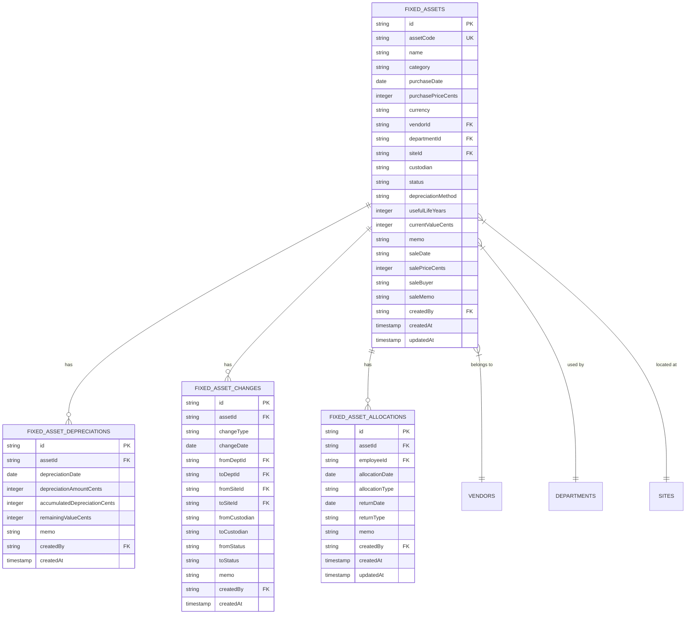

# 资产管理模块

<cite>
**本文档引用的文件**   
- [FixedAssetsManagement.tsx](file://frontend/src/features/assets/pages/FixedAssetsManagement.tsx)
- [fixed-assets.ts](file://backend/src/routes/fixed-assets.ts)
- [FixedAssetService.ts](file://backend/src/services/FixedAssetService.ts)
- [rental.ts](file://backend/src/routes/rental.ts)
- [RentalService.ts](file://backend/src/services/RentalService.ts)
- [schema.ts](file://backend/src/db/schema.ts)
- [business.schema.ts](file://backend/src/schemas/business.schema.ts)
- [domain.ts](file://frontend/src/types/domain.ts)
</cite>

## 目录
1. [引言](#引言)
2. [项目结构](#项目结构)
3. [核心组件](#核心组件)
4. [架构概述](#架构概述)
5. [详细组件分析](#详细组件分析)
6. [依赖分析](#依赖分析)
7. [性能考虑](#性能考虑)
8. [故障排除指南](#故障排除指南)
9. [结论](#结论)

## 引言
本系统是一个综合性的财务管理系统，其核心功能围绕固定资产管理与租赁管理两大模块展开。固定资产模块实现了从采购、折旧、分配、调拨到报废的全生命周期管理，支持多种折旧算法，并与财务模块深度集成。租赁管理模块则涵盖了租赁合同的创建、租金计算、续租与终止等完整流程。系统通过清晰的权限控制策略确保数据安全，并通过详细的审计日志记录所有关键操作。

## 项目结构
项目采用前后端分离的架构，前端使用React框架，后端基于Hono构建。前端代码位于`frontend`目录，核心功能组件在`frontend/src/features/assets/pages/`路径下。后端代码位于`backend`目录，业务逻辑由`backend/src/services/`中的服务类实现，API路由定义在`backend/src/routes/`中。数据库模式定义在`backend/src/db/schema.ts`文件中，明确了所有数据表的结构和关系。

## 核心组件
系统的核心功能由固定资产和租赁管理两大模块构成。固定资产模块通过`FixedAssetService`类实现，支持资产的全生命周期管理，包括采购、折旧、分配、调拨和报废。该模块与财务模块紧密集成，例如在采购时会自动生成应付账款。租赁管理模块通过`RentalService`类实现，负责管理租赁合同、生成应付账单和处理租金支付。两个模块都遵循严格的权限控制和审计日志记录。

**Section sources**
- [FixedAssetsManagement.tsx](file://frontend/src/features/assets/pages/FixedAssetsManagement.tsx)
- [fixed-assets.ts](file://backend/src/routes/fixed-assets.ts)
- [FixedAssetService.ts](file://backend/src/services/FixedAssetService.ts)
- [rental.ts](file://backend/src/routes/rental.ts)
- [RentalService.ts](file://backend/src/services/RentalService.ts)

## 架构概述
系统采用典型的分层架构，从前端UI到后端服务再到数据库，层次分明。前端通过API调用与后端交互，后端服务层处理业务逻辑并调用数据访问层。这种架构确保了代码的可维护性和可扩展性。

**Diagram sources **
- [FixedAssetsManagement.tsx](file://frontend/src/features/assets/pages/FixedAssetsManagement.tsx)
- [fixed-assets.ts](file://backend/src/routes/fixed-assets.ts)
- [FixedAssetService.ts](file://backend/src/services/FixedAssetService.ts)

## 详细组件分析

### 固定资产管理分析
固定资产模块是系统的核心功能之一，实现了资产的全生命周期管理。

#### 资产数据模型

**Diagram sources **
- [schema.ts](file://backend/src/db/schema.ts#L464-L532)

#### 资产状态转换

**Diagram sources **
- [FixedAssetService.ts](file://backend/src/services/FixedAssetService.ts#L279-L299)
- [FixedAssetsManagement.tsx](file://frontend/src/features/assets/pages/FixedAssetsManagement.tsx#L16-L22)

#### 关键服务方法说明
- **createDepreciation**: 记录资产折旧，更新累计折旧和剩余价值。
- **transfer**: 调拨资产，记录调拨前后的部门、位置和责任人。
- **allocate**: 分配资产给员工，更新资产状态为"在用"。
- **return**: 员工归还资产，更新资产状态为"闲置"。
- **purchase**: 采购资产，同时创建财务流水和应付账款。
- **sell**: 出售资产，更新状态并生成收入流水。

**Section sources**
- [FixedAssetService.ts](file://backend/src/services/FixedAssetService.ts)
- [fixed-assets.ts](file://backend/src/routes/fixed-assets.ts)

### 租赁管理分析
租赁管理模块负责处理公司租赁的物业，如办公室和员工宿舍。

#### 租赁数据模型

**Diagram sources **
- [schema.ts](file://backend/src/db/schema.ts#L534-L631)

#### 租赁合同流程

**Diagram sources **
- [RentalService.ts](file://backend/src/services/RentalService.ts#L276-L349)
- [rental.ts](file://backend/src/routes/rental.ts#L460-L491)

#### 关键服务方法说明
- **generatePayableBills**: 根据租赁合同自动生成应付账单。
- **createPayment**: 支付租金，同时创建财务流水和交易记录。
- **allocateDormitory**: 分配宿舍给员工。
- **returnDormitory**: 员工归还宿舍。
- **markBillPaid**: 标记账单为已支付。

**Section sources**
- [RentalService.ts](file://backend/src/services/RentalService.ts)
- [rental.ts](file://backend/src/routes/rental.ts)

## 依赖分析
系统各模块之间存在明确的依赖关系。固定资产模块依赖于财务模块，因为资产采购和出售会直接影响公司的财务状况。租赁管理模块同样依赖财务模块，因为租金支付是公司的一项重要支出。此外，两个模块都依赖于基础数据模块，如部门、员工和供应商信息。

**Diagram sources **
- [FixedAssetService.ts](file://backend/src/services/FixedAssetService.ts#L10)
- [RentalService.ts](file://backend/src/services/RentalService.ts#L8)

## 性能考虑
系统在设计时考虑了性能优化。例如，在查询固定资产列表时，服务层会并行获取相关的部门、供应商和用户信息，以减少数据库查询次数。对于复杂的查询，系统使用了适当的索引和分页机制。此外，前端通过React Query实现了数据缓存，减少了不必要的API调用。

## 故障排除指南
当遇到问题时，首先应检查相关模块的权限设置。例如，如果无法删除资产，可能是因为该资产已有折旧记录。如果无法生成应付账单，请检查租赁合同的状态和租期。所有关键操作都会被记录在审计日志中，可以通过审计日志追踪问题的根源。

**Section sources**
- [FixedAssetService.ts](file://backend/src/services/FixedAssetService.ts#L308-L315)
- [RentalService.ts](file://backend/src/services/RentalService.ts#L194-L195)

## 结论
本系统提供了一套完整的资产管理解决方案，涵盖了固定资产和租赁管理的各个方面。通过清晰的数据模型和业务流程，系统能够有效地支持企业的资产管理需求。未来可以考虑增加更多折旧算法和更复杂的租赁合同管理功能。