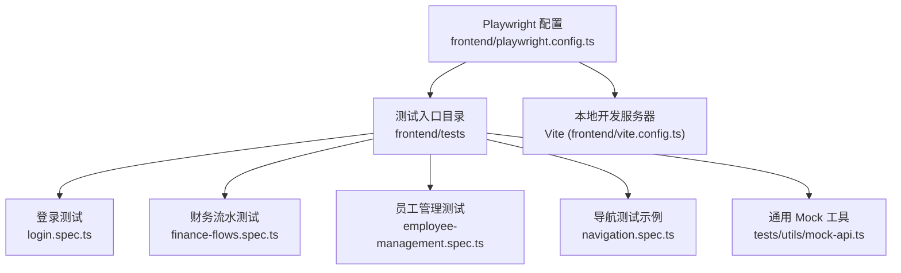
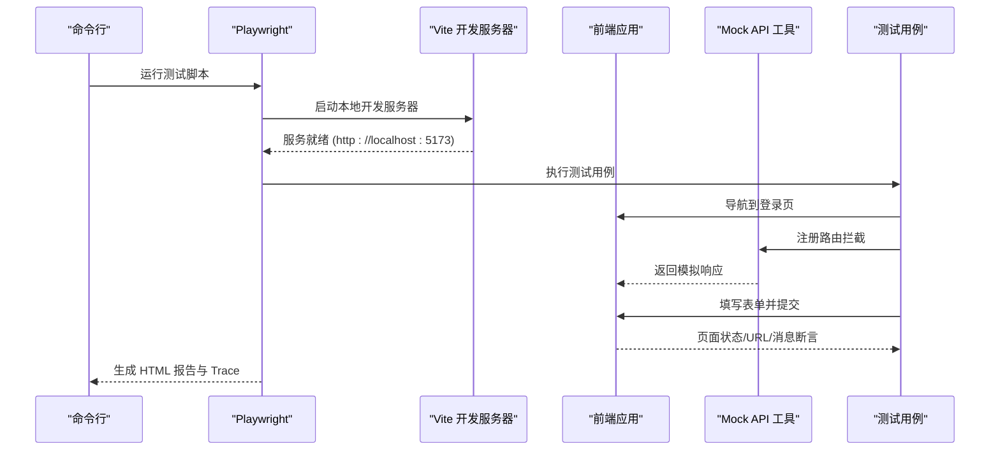
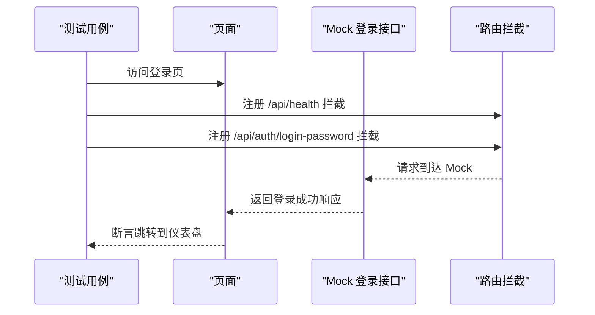
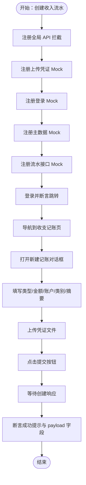
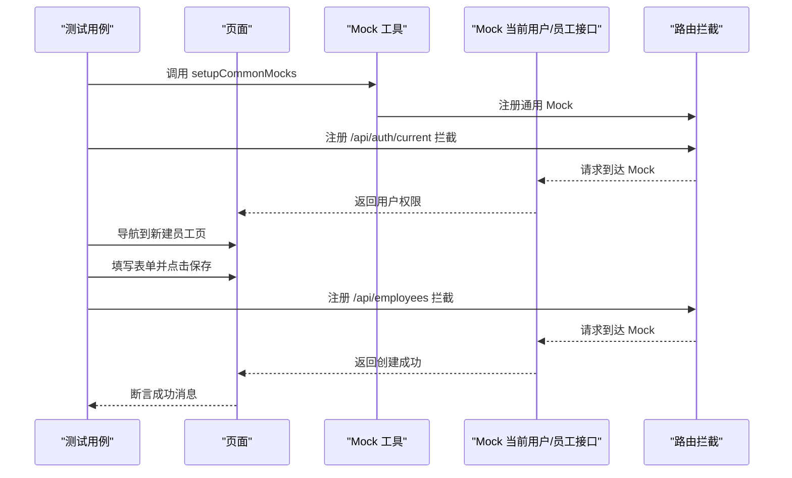
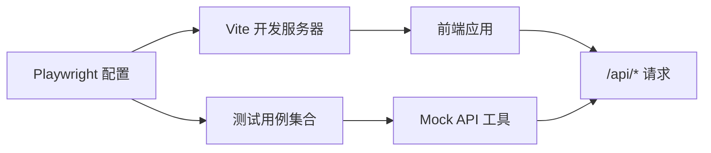

# 前端测试

<cite>
**本文引用的文件列表**
- [playwright.config.ts](file://frontend/playwright.config.ts)
- [package.json](file://frontend/package.json)
- [vite.config.ts](file://frontend/vite.config.ts)
- [login.spec.ts](file://frontend/tests/login.spec.ts)
- [finance-flows.spec.ts](file://frontend/tests/finance-flows.spec.ts)
- [employee-management.spec.ts](file://frontend/tests/employee-management.spec.ts)
- [navigation.spec.ts](file://frontend/tests/navigation.spec.ts)
- [mock-api.ts](file://frontend/tests/utils/mock-api.ts)
- [.gitignore](file://frontend/.gitignore)
</cite>

## 目录
1. [简介](#简介)
2. [项目结构](#项目结构)
3. [核心组件](#核心组件)
4. [架构总览](#架构总览)
5. [详细组件分析](#详细组件分析)
6. [依赖关系分析](#依赖关系分析)
7. [性能与稳定性建议](#性能与稳定性建议)
8. [故障排查指南](#故障排查指南)
9. [结论](#结论)
10. [附录](#附录)

## 简介
本文件面向前端团队，系统化梳理基于 Playwright 的端到端测试方案，覆盖测试环境配置、浏览器与重试策略、本地开发服务器启动、典型业务场景测试（登录、财务流水创建、员工管理 CRUD）、API 模拟（Mock）策略、最佳实践（定位器、异步处理、报告生成），以及调试与 Trace Viewer 使用方法。目标是帮助开发者快速上手并稳定运行 E2E 测试，保障关键业务流程质量。

## 项目结构
前端 E2E 测试位于 frontend/tests 目录，Playwright 配置位于 frontend/playwright.config.ts，测试脚本通过 npm 脚本触发。

图表来源
- [playwright.config.ts](file://frontend/playwright.config.ts#L1-L79)
- [vite.config.ts](file://frontend/vite.config.ts#L1-L56)
- [login.spec.ts](file://frontend/tests/login.spec.ts#L1-L114)
- [finance-flows.spec.ts](file://frontend/tests/finance-flows.spec.ts#L1-L290)
- [employee-management.spec.ts](file://frontend/tests/employee-management.spec.ts#L1-L116)
- [navigation.spec.ts](file://frontend/tests/navigation.spec.ts#L1-L68)
- [mock-api.ts](file://frontend/tests/utils/mock-api.ts#L1-L92)

章节来源
- [playwright.config.ts](file://frontend/playwright.config.ts#L1-L79)
- [vite.config.ts](file://frontend/vite.config.ts#L1-L56)
- [package.json](file://frontend/package.json#L1-L51)

## 核心组件
- Playwright 配置：定义测试目录、并行度、重试与 CI 集成、浏览器项目、webServer 启动命令与端口、trace 收集策略、HTML 报告等。
- 测试用例：登录流程（含 2FA）、财务流水创建全流程（表单、上传、提交、断言）、员工管理导航与创建。
- Mock 工具：统一注册 API 拦截、健康检查、登录、主数据、上传等常用接口，避免真实后端依赖。
- 开发服务器：Vite 提供本地服务，Playwright 通过 webServer 自动启动并在 CI 中复用已有进程。

章节来源
- [playwright.config.ts](file://frontend/playwright.config.ts#L1-L79)
- [mock-api.ts](file://frontend/tests/utils/mock-api.ts#L1-L92)
- [finance-flows.spec.ts](file://frontend/tests/finance-flows.spec.ts#L1-L290)
- [employee-management.spec.ts](file://frontend/tests/employee-management.spec.ts#L1-L116)
- [login.spec.ts](file://frontend/tests/login.spec.ts#L1-L114)

## 架构总览
下图展示从 Playwright 到前端应用与 Mock API 的交互路径，以及本地开发服务器的启动与复用策略。

图表来源
- [playwright.config.ts](file://frontend/playwright.config.ts#L73-L79)
- [vite.config.ts](file://frontend/vite.config.ts#L25-L32)
- [login.spec.ts](file://frontend/tests/login.spec.ts#L1-L114)
- [finance-flows.spec.ts](file://frontend/tests/finance-flows.spec.ts#L1-L290)
- [employee-management.spec.ts](file://frontend/tests/employee-management.spec.ts#L1-L116)
- [mock-api.ts](file://frontend/tests/utils/mock-api.ts#L1-L92)

## 详细组件分析

### Playwright 配置（playwright.config.ts）
- 测试目录与并行：testDir 指向 tests；fullyParallel 控制文件内并行；forbidOnly 在 CI 上禁止仅运行标记为 only 的用例。
- 重试与并发：CI 环境启用 retries 并降低 workers，确保稳定性。
- 报告与追踪：reporter 使用 HTML；trace 在首次重试时收集，便于后续 Trace Viewer 排查。
- 浏览器项目：默认启用 Chromium，其他浏览器可按需开启。
- webServer：command 指定 npm run dev；url 指向本地开发端口；reuseExistingServer 在非 CI 环境复用现有进程，提升效率。
- CI/CD 集成：通过环境变量控制 forbidOnly、retries、workers，适配流水线稳定性需求。

章节来源
- [playwright.config.ts](file://frontend/playwright.config.ts#L1-L79)
- [package.json](file://frontend/package.json#L1-L51)

### 登录测试（login.spec.ts）
- 健康检查 Mock：在 beforeEach 中拦截健康检查，保证应用启动阶段不报错。
- 基础登录流程：拦截登录接口，模拟成功返回 token 与用户信息；断言跳转至仪表盘并显示工作台标题。
- 2FA（TOTP）登录：分两步，先返回 needTotp，再校验正确/错误验证码；错误验证码应提示错误消息。
- 错误处理：错误凭据返回 401，断言错误消息可见。
- 定位器与交互：使用 id 选择器填充表单字段，提交按钮启用后点击；断言 URL 与页面文本。

图表来源
- [login.spec.ts](file://frontend/tests/login.spec.ts#L1-L114)

章节来源
- [login.spec.ts](file://frontend/tests/login.spec.ts#L1-L114)

### 财务流水测试（finance-flows.spec.ts）
- 全局 API 拦截：优先注册 catch-all 拦截，避免未匹配请求导致 401；同时记录未命中 URL 用于调试。
- 上传 Mock：模拟上传凭证接口，返回上传完成状态与文件信息。
- 登录 Mock：返回带权限的角色信息，确保菜单可见性。
- 主数据 Mock：账户、类别、部门、站点、员工、供应商、固定资产等主数据接口返回空结果或示例数据。
- 统一流水接口 Mock：区分 GET（列表）与 POST（创建），创建时保存请求体并返回带 id 的对象。
- 登录与导航：登录后断言仪表盘或我的中心；展开菜单并进入“收支记账”页面。
- 表单填写与上传：在模态框内选择类型、金额、账户、类别，填写摘要；上传 1x1 PNG 文件；断言上传成功指示出现。
- 提交与断言：等待响应，检查是否有表单错误；断言模态关闭、成功提示、payload 字段（如金额换算、凭证数量）。

图表来源
- [finance-flows.spec.ts](file://frontend/tests/finance-flows.spec.ts#L1-L290)

章节来源
- [finance-flows.spec.ts](file://frontend/tests/finance-flows.spec.ts#L1-L290)

### 员工管理测试（employee-management.spec.ts）
- 通用 Mock：通过工具函数 setupCommonMocks 注入健康检查、登录、主数据与上传等通用 Mock。
- 权限 Mock：拦截当前用户接口，返回 HR 权限，确保菜单项可见。
- 导航与页面加载：展开“人力资源”菜单，点击“新建员工”，断言页面标题与表单元素存在。
- 表单填写：输入姓名、邮箱、电话，选择职位；日期输入后触发回车。
- 创建 Mock：拦截 POST /api/employees，返回新员工对象；GET 回退为空列表。
- 成功断言：断言成功消息可见。

图表来源
- [employee-management.spec.ts](file://frontend/tests/employee-management.spec.ts#L1-L116)
- [mock-api.ts](file://frontend/tests/utils/mock-api.ts#L1-L92)

章节来源
- [employee-management.spec.ts](file://frontend/tests/employee-management.spec.ts#L1-L116)
- [mock-api.ts](file://frontend/tests/utils/mock-api.ts#L1-L92)

### 导航测试示例（navigation.spec.ts）
- 健康检查与登录 Mock：与登录测试一致。
- 员工列表 Mock：拦截员工列表接口，返回空结果。
- 导航流程：登录后断言仪表盘；展开“人力资源”，点击“人员管理”，断言 URL 与页面标题。

章节来源
- [navigation.spec.ts](file://frontend/tests/navigation.spec.ts#L1-L68)

### Mock API 工具（tests/utils/mock-api.ts）
- 全局 API 拦截：对所有 /api/** 请求进行兜底处理，排除源码与依赖路径，避免阻断构建资源。
- 健康检查：返回后端健康状态。
- 登录 Mock：返回 token 与用户信息，包含角色与权限（含 HR/Finance 权限）。
- 主数据 Mock：账户、类别、部门、站点、员工、固定资产、供应商等接口返回示例数据。
- 上传 Mock：模拟凭证上传返回成功状态与文件信息。

章节来源
- [mock-api.ts](file://frontend/tests/utils/mock-api.ts#L1-L92)

## 依赖关系分析
- Playwright 与 Vite：Playwright 通过 webServer 启动 Vite 开发服务器；Vite 配置了代理到后端服务，但 E2E 测试通过 Mock API 隔离真实后端。
- 测试与 Mock：各测试文件直接或间接依赖 mock-api.ts 提供的通用 Mock，减少对真实后端的耦合。
- CI/CD：通过环境变量控制 forbidOnly、retries、workers，确保流水线稳定性。

图表来源
- [playwright.config.ts](file://frontend/playwright.config.ts#L73-L79)
- [vite.config.ts](file://frontend/vite.config.ts#L25-L32)
- [mock-api.ts](file://frontend/tests/utils/mock-api.ts#L1-L92)

章节来源
- [playwright.config.ts](file://frontend/playwright.config.ts#L1-L79)
- [vite.config.ts](file://frontend/vite.config.ts#L1-L56)
- [mock-api.ts](file://frontend/tests/utils/mock-api.ts#L1-L92)

## 性能与稳定性建议
- 并行与重试：在本地开发时保持 fullyParallel 与较低 retries，提高反馈速度；在 CI 上适度增加 retries 并降低并发数，提升稳定性。
- webServer 复用：在非 CI 环境启用 reuseExistingServer，避免重复启动开发服务器带来的冷启动开销。
- 路由优先级：注意 Playwright 路由匹配顺序（后注册者优先），将通用兜底路由放在最前，具体接口 Mock 放在后面，确保覆盖预期。
- 异步等待：优先使用 waitForResponse、waitForTimeout 等显式等待，避免硬编码 sleep；对动态内容使用 isVisible/toBeVisible 等断言。
- 定位器健壮性：尽量使用语义化选择器（如按钮文本、标签文本），必要时结合上下文容器选择器，减少对 DOM 结构变化的脆弱性。
- 报告与追踪：在 CI 上启用 HTML 报告；在首次重试时开启 trace，便于失败后使用 Trace Viewer 分析。

[本节为通用建议，无需特定文件来源]

## 故障排查指南
- 测试失败但无明显错误：启用 trace（已在配置中设置），在首次重试时自动收集；在本地运行完成后，使用 Playwright 官方 Trace Viewer 打开 trace 文件进行逐帧回放与分析。
- 401 未授权：确认是否遗漏了 Mock 或 Mock 返回值不正确；可在测试中监听 response，定位具体请求 URL。
- 上传失败：检查上传 Mock 是否返回成功状态与文件信息；确认客户端上传组件的 input 类型与隐藏状态不影响 setInputFiles 的行为。
- 页面元素不可见：使用更稳健的选择器（如容器过滤、可见性断言）；必要时添加显式等待或重试逻辑。
- CI 环境不稳定：适当提高 retries 并降低 workers；确保本地开发服务器可复用（非 CI 环境）。

章节来源
- [playwright.config.ts](file://frontend/playwright.config.ts#L21-L23)
- [finance-flows.spec.ts](file://frontend/tests/finance-flows.spec.ts#L160-L173)
- [finance-flows.spec.ts](file://frontend/tests/finance-flows.spec.ts#L240-L252)

## 结论
通过 Playwright 配置与 Mock API 工具，前端 E2E 测试实现了对关键业务流程的稳定覆盖。登录、财务流水创建、员工管理等场景均以路由拦截方式隔离后端依赖，结合 HTML 报告与 Trace Viewer，能够高效定位问题并持续改进测试质量。建议在团队内推广统一的 Mock 策略与断言规范，进一步提升测试可维护性与稳定性。

[本节为总结性内容，无需特定文件来源]

## 附录

### 运行与调试
- 运行测试：通过 npm 脚本触发 Playwright 测试。
- 生成报告：HTML 报告输出在 playwright-report 目录（受 .gitignore 管理）。
- Trace Viewer：在首次重试时自动生成 trace，便于回放与分析。

章节来源
- [package.json](file://frontend/package.json#L1-L51)
- [playwright.config.ts](file://frontend/playwright.config.ts#L24-L33)
- [.gitignore](file://frontend/.gitignore#L2-L8)