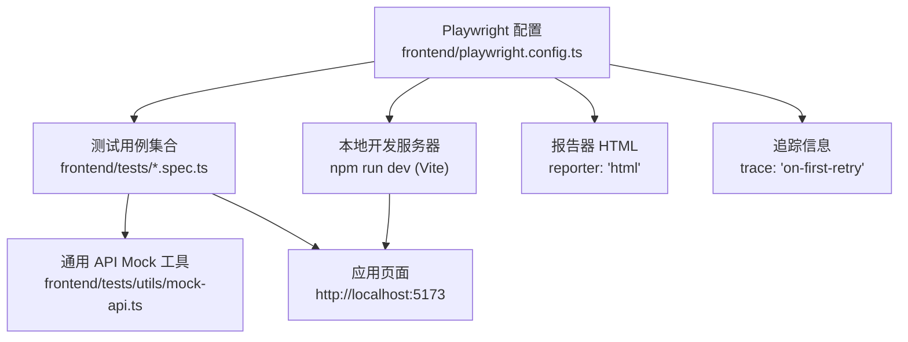
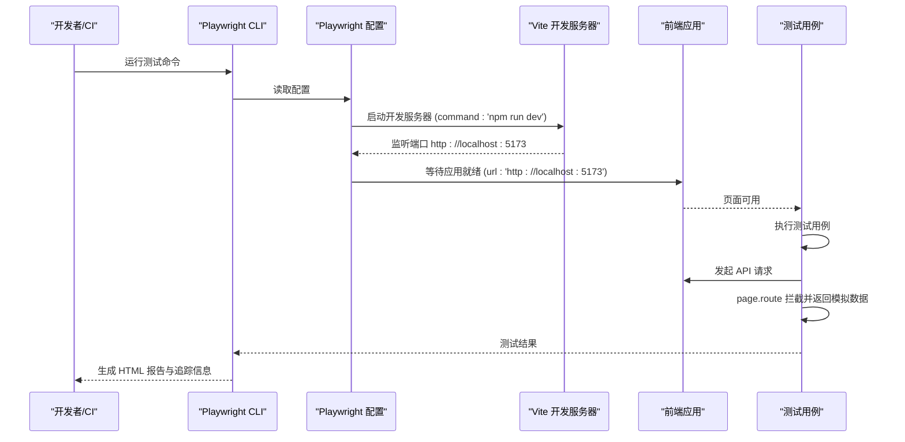
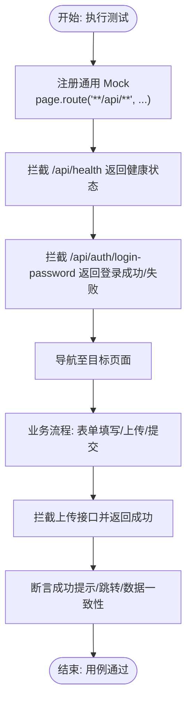
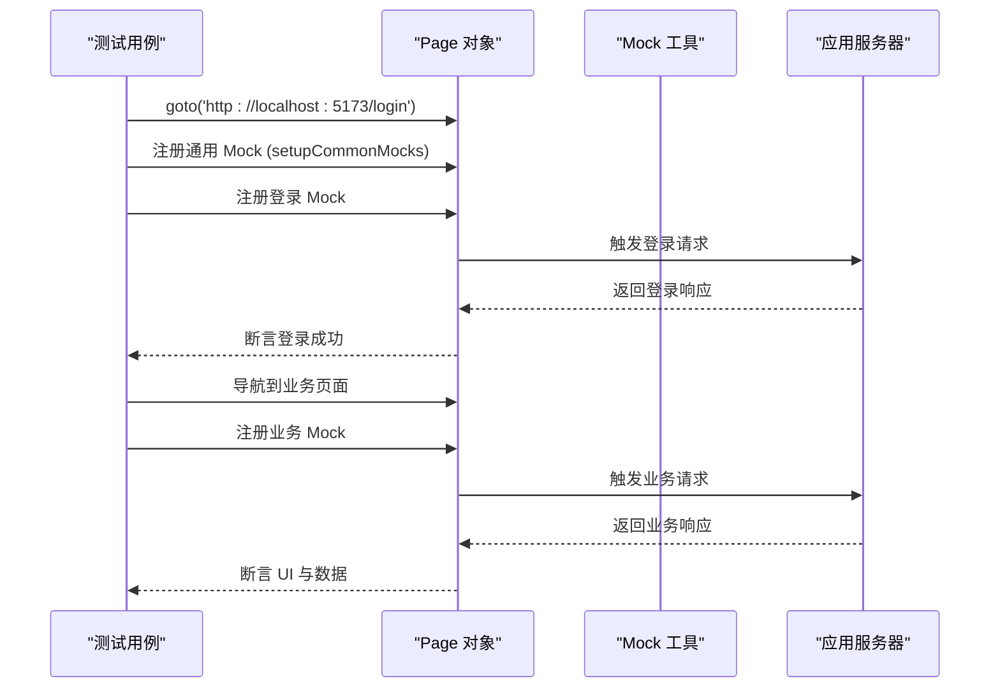
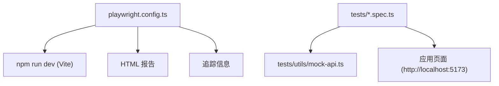

# 前端测试配置

<cite>
**本文引用的文件**
- [playwright.config.ts](file://frontend/playwright.config.ts)
- [mock-api.ts](file://frontend/tests/utils/mock-api.ts)
- [login.spec.ts](file://frontend/tests/login.spec.ts)
- [employee-management.spec.ts](file://frontend/tests/employee-management.spec.ts)
- [finance-flows.spec.ts](file://frontend/tests/finance-flows.spec.ts)
- [navigation.spec.ts](file://frontend/tests/navigation.spec.ts)
- [package.json](file://frontend/package.json)
- [setup.ts](file://frontend/src/test/setup.ts)
</cite>

## 目录
1. [简介](#简介)
2. [项目结构](#项目结构)
3. [核心组件](#核心组件)
4. [架构总览](#架构总览)
5. [详细组件分析](#详细组件分析)
6. [依赖关系分析](#依赖关系分析)
7. [性能考量](#性能考量)
8. [故障排查指南](#故障排查指南)
9. [结论](#结论)
10. [附录](#附录)

## 简介
本文件面向前端测试配置与实践，聚焦于 Playwright E2E 测试的配置与运行机制，围绕以下主题展开：
- 如何通过 playwright.config.ts 指定测试目录、启用并行执行、设置重试与 CI 安全策略
- webServer 配置如何与本地开发服务器协作，确保测试在应用就绪后开始
- 报告器与追踪信息收集策略，便于调试失败用例
- 通过 page.route 拦截 API 请求并返回模拟数据，实现测试环境隔离
- 结合 mock-api.ts 的通用拦截策略与各测试文件的登录、导航、业务流程等场景
- CI/CD 最佳实践：workers 设置与 forbidOnly 安全策略

## 项目结构
前端测试相关的关键位置如下：
- 测试配置：frontend/playwright.config.ts
- 测试用例：frontend/tests/*.spec.ts
- 通用 API Mock 工具：frontend/tests/utils/mock-api.ts
- 包脚本与开发命令：frontend/package.json
- React/Vitest 测试环境初始化：frontend/src/test/setup.ts

图表来源
- [playwright.config.ts](file://frontend/playwright.config.ts#L1-L80)
- [mock-api.ts](file://frontend/tests/utils/mock-api.ts#L1-L92)
- [package.json](file://frontend/package.json#L1-L51)

章节来源
- [playwright.config.ts](file://frontend/playwright.config.ts#L1-L80)
- [package.json](file://frontend/package.json#L1-L51)

## 核心组件
- 测试目录与并行执行
  - testDir 指定测试根目录为 ./tests，确保 Playwright 只扫描该目录下的测试文件。
  - fullyParallel 启用文件级并行，提升整体执行效率。
- CI 安全与重试策略
  - forbidOnly 在 CI 环境下强制禁止遗留 test.only，避免误触发单测阻塞流水线。
  - retries 在 CI 环境设置为 2，非 CI 环境为 0，平衡稳定性与速度。
  - workers 在 CI 环境设为 1，避免并发资源竞争；非 CI 默认 undefined，按默认并发执行。
- 报告与追踪
  - reporter: 'html' 生成可交互的 HTML 报告，便于团队复盘。
  - trace: 'on-first-retry' 在首次重试时采集浏览器与网络追踪，便于定位失败原因。
- 本地开发服务器
  - webServer.command 使用 npm run dev 启动 Vite 开发服务器。
  - webServer.url 指向 http://localhost:5173，Playwright 等待该地址可访问后再开始测试。
  - reuseExistingServer 在非 CI 环境复用已有服务，减少冷启动时间。

章节来源
- [playwright.config.ts](file://frontend/playwright.config.ts#L1-L80)

## 架构总览
下面的序列图展示了 Playwright 在 CI 与本地两种环境下的典型执行路径，以及 webServer 的启动与等待逻辑。

图表来源
- [playwright.config.ts](file://frontend/playwright.config.ts#L1-L80)
- [package.json](file://frontend/package.json#L1-L51)

## 详细组件分析

### Playwright 配置项详解
- testDir: './tests'
  - 作用：限定 Playwright 扫描测试文件的根目录，避免误包含 node_modules 或其他无关目录。
- fullyParallel: true
  - 作用：启用文件级并行，提高执行吞吐量。
- forbidOnly: !!process.env.CI
  - 作用：在 CI 环境下强制禁止遗留 test.only，防止意外阻塞流水线。
- retries: process.env.CI ? 2 : 0
  - 作用：CI 环境自动重试 2 次，非 CI 环境不重试，兼顾稳定性与速度。
- workers: process.env.CI ? 1 : undefined
  - 作用：CI 环境串行执行，避免资源竞争；本地默认并行。
- reporter: 'html'
  - 作用：生成 HTML 报告，便于团队共享与复盘。
- trace: 'on-first-retry'
  - 作用：仅在首次重试时收集追踪，降低开销并聚焦问题根因。
- webServer:
  - command: 'npm run dev'
  - url: 'http://localhost:5173'
  - reuseExistingServer: !process.env.CI
  - 作用：启动本地开发服务器并等待应用就绪；非 CI 复用现有进程，加速测试。

章节来源
- [playwright.config.ts](file://frontend/playwright.config.ts#L1-L80)
- [package.json](file://frontend/package.json#L1-L51)

### API Mock 与测试环境隔离
- 通用 Mock 工具：tests/utils/mock-api.ts
  - 提供 setupCommonMocks(page)，统一拦截 **/api/** 路径，避免真实后端调用导致 401 或不稳定。
  - 对特定健康检查、登录、主数据接口进行精确模拟，保证登录态与菜单可见性。
  - 对上传等异步流程加入延迟与成功响应，模拟客户端处理链路。
- 登录流程测试：tests/login.spec.ts
  - 在 beforeEach 中拦截 /api/health，确保应用启动阶段的健康检查通过。
  - 在具体用例中拦截 /api/auth/login-password，分别覆盖无 2FA、TOTP 正确/错误等分支。
- 导航与权限测试：tests/navigation.spec.ts
  - 模拟登录与员工列表接口，验证菜单展开与跳转后的 URL 与标题。
- 业务流程测试：tests/employee-management.spec.ts、tests/finance-flows.spec.ts
  - 组合 setupCommonMocks 与业务专属路由，覆盖从登录到表单提交、上传凭证、断言成功提示的完整链路。
  - 在 flows 场景中，对 /api/flows* 进行统一拦截，区分 POST 创建与 GET 列表行为，并断言请求体字段。

图表来源
- [mock-api.ts](file://frontend/tests/utils/mock-api.ts#L1-L92)
- [login.spec.ts](file://frontend/tests/login.spec.ts#L1-L114)
- [navigation.spec.ts](file://frontend/tests/navigation.spec.ts#L1-L68)
- [employee-management.spec.ts](file://frontend/tests/employee-management.spec.ts#L1-L116)
- [finance-flows.spec.ts](file://frontend/tests/finance-flows.spec.ts#L1-L290)

章节来源
- [mock-api.ts](file://frontend/tests/utils/mock-api.ts#L1-L92)
- [login.spec.ts](file://frontend/tests/login.spec.ts#L1-L114)
- [navigation.spec.ts](file://frontend/tests/navigation.spec.ts#L1-L68)
- [employee-management.spec.ts](file://frontend/tests/employee-management.spec.ts#L1-L116)
- [finance-flows.spec.ts](file://frontend/tests/finance-flows.spec.ts#L1-L290)

### 测试用例与 Mock 协作流程
- 登录场景（含 2FA）
  - 先拦截健康检查，再拦截登录接口，按条件返回不同响应。
  - 断言登录成功后的 URL 与页面元素可见性。
- 导航场景
  - 模拟登录与员工列表接口，断言菜单展开与跳转后的页面标题与 URL。
- 业务流程（员工管理/收支记账）
  - 统一使用 setupCommonMocks，再针对业务接口补充更精细的拦截。
  - 对上传、创建等异步流程进行等待与断言，确保 UI 与数据一致。

图表来源
- [mock-api.ts](file://frontend/tests/utils/mock-api.ts#L1-L92)
- [login.spec.ts](file://frontend/tests/login.spec.ts#L1-L114)
- [employee-management.spec.ts](file://frontend/tests/employee-management.spec.ts#L1-L116)
- [finance-flows.spec.ts](file://frontend/tests/finance-flows.spec.ts#L1-L290)

章节来源
- [login.spec.ts](file://frontend/tests/login.spec.ts#L1-L114)
- [employee-management.spec.ts](file://frontend/tests/employee-management.spec.ts#L1-L116)
- [finance-flows.spec.ts](file://frontend/tests/finance-flows.spec.ts#L1-L290)

## 依赖关系分析
- Playwright 配置依赖
  - 本地开发服务器：npm run dev（Vite），监听 5173 端口。
  - 测试用例依赖 page.route 拦截 API 请求，返回模拟数据。
  - 通用 Mock 工具被多个测试文件复用，降低重复代码。
- CI/CD 关键点
  - forbidOnly 在 CI 强制开启，避免误用 only 导致流水线卡住。
  - workers=1 降低并发资源竞争风险。
  - retries=2 提升偶发失败的容错能力。

图表来源
- [playwright.config.ts](file://frontend/playwright.config.ts#L1-L80)
- [mock-api.ts](file://frontend/tests/utils/mock-api.ts#L1-L92)
- [package.json](file://frontend/package.json#L1-L51)

章节来源
- [playwright.config.ts](file://frontend/playwright.config.ts#L1-L80)
- [package.json](file://frontend/package.json#L1-L51)

## 性能考量
- 并行与串行
  - 本地开发建议保持 fullyParallel=true，充分利用多核提升吞吐。
  - CI 环境使用 workers=1，避免并发带来的内存与网络抖动。
- 重试策略
  - CI 环境 retries=2，可显著降低间歇性失败的影响。
  - 非 CI 环境 retries=0，确保快速反馈。
- 服务器复用
  - 非 CI 环境 reuseExistingServer=true，避免每次测试都冷启动开发服务器。
- 追踪范围
  - trace 仅在首次重试时开启，减少不必要的追踪开销。

章节来源
- [playwright.config.ts](file://frontend/playwright.config.ts#L1-L80)

## 故障排查指南
- 应用未就绪导致测试超时
  - 检查 webServer.url 是否与实际开发服务器端口一致。
  - 确认 npm run dev 已正常启动且未报错。
- 401 或跨域错误
  - 使用 page.route 拦截对应 API，返回 200 或模拟数据。
  - 在通用工具中添加 catch-all 拦截，避免真实后端返回 401。
- 重试后仍失败
  - 查看 HTML 报告与追踪信息，定位首失败点。
  - 在 CI 环境下，确认 retries=2 生效且 workers=1。
- 本地与 CI 行为差异
  - 确认 CI 环境变量 CI 存在，使 forbidOnly、workers、retries 生效。
- 页面元素不可见或交互异常
  - 在测试中增加显式等待与断言，必要时使用 page.waitForTimeout。
  - 对上传、异步请求使用 page.waitForResponse 或 page.waitForLoadState。

章节来源
- [playwright.config.ts](file://frontend/playwright.config.ts#L1-L80)
- [login.spec.ts](file://frontend/tests/login.spec.ts#L1-L114)
- [finance-flows.spec.ts](file://frontend/tests/finance-flows.spec.ts#L1-L290)

## 结论
通过合理的 Playwright 配置与 Mock 策略，前端 E2E 测试能够在本地与 CI 环境中稳定高效地运行。关键在于：
- 明确的测试目录与并行策略
- CI 环境下的安全与稳定性配置
- 以 page.route 为核心的 API Mock 体系
- 以 HTML 报告与追踪信息为核心的可观测性

## 附录
- 常用命令
  - 运行 Playwright 测试：npm run test:e2e
  - 启动本地开发服务器：npm run dev
- 最佳实践清单
  - CI 环境：开启 forbidOnly、workers=1、retries=2
  - 本地环境：保持 fullyParallel=true、reuseExistingServer=true
  - 所有业务测试均应基于 setupCommonMocks，避免真实后端耦合
  - 对关键异步流程（上传、创建）使用 waitForResponse/断言响应体字段
  - 使用 HTML 报告与 trace 定位问题，优先查看首次重试的追踪

章节来源
- [package.json](file://frontend/package.json#L1-L51)
- [playwright.config.ts](file://frontend/playwright.config.ts#L1-L80)
- [mock-api.ts](file://frontend/tests/utils/mock-api.ts#L1-L92)