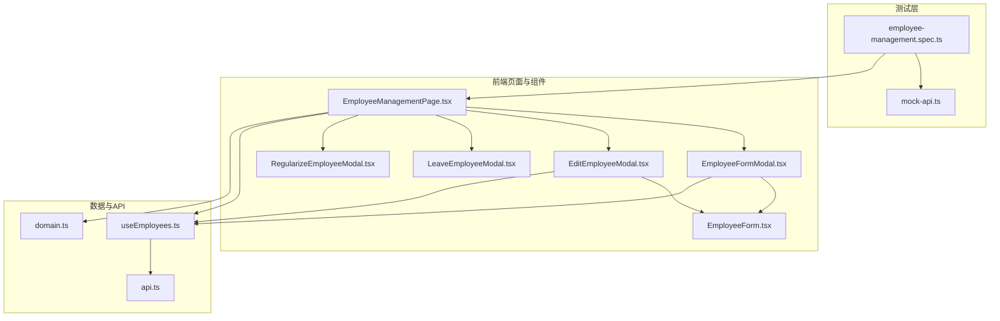
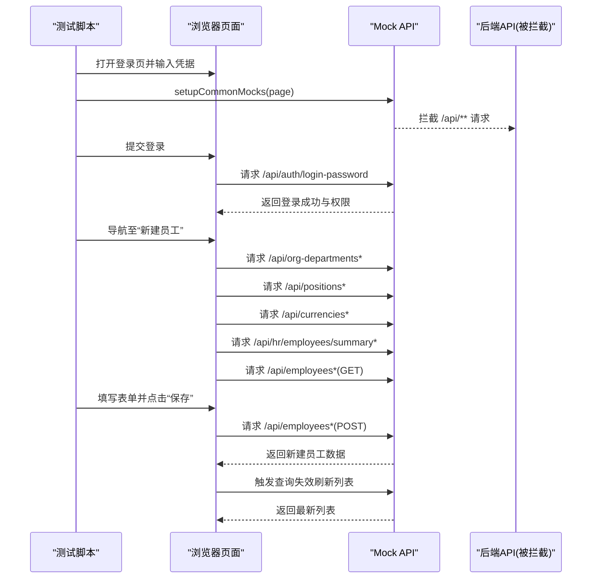
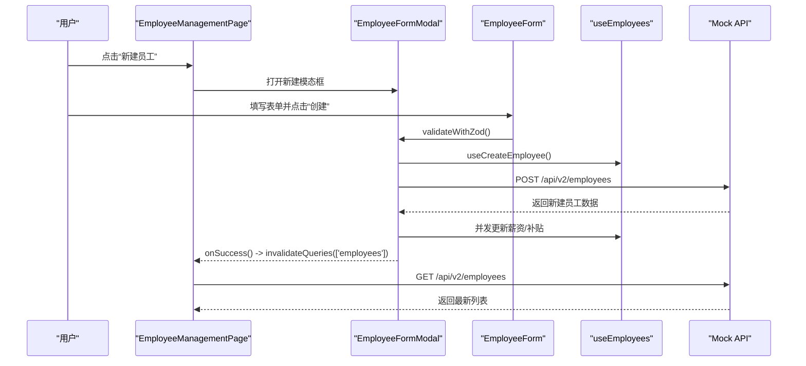
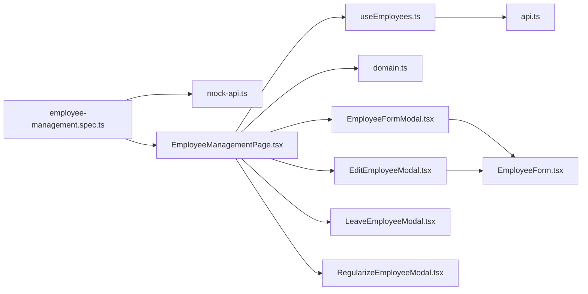

# 员工管理测试

<cite>
**本文引用的文件**
- [employee-management.spec.ts](file://frontend/tests/employee-management.spec.ts)
- [mock-api.ts](file://frontend/tests/utils/mock-api.ts)
- [EmployeeManagementPage.tsx](file://frontend/src/features/hr/pages/EmployeeManagementPage.tsx)
- [EmployeeFormModal.tsx](file://frontend/src/features/employees/components/modals/EmployeeFormModal.tsx)
- [EditEmployeeModal.tsx](file://frontend/src/features/employees/components/modals/EditEmployeeModal.tsx)
- [LeaveEmployeeModal.tsx](file://frontend/src/features/employees/components/modals/LeaveEmployeeModal.tsx)
- [RegularizeEmployeeModal.tsx](file://frontend/src/features/employees/components/modals/RegularizeEmployeeModal.tsx)
- [EmployeeForm.tsx](file://frontend/src/features/employees/components/forms/EmployeeForm.tsx)
- [useEmployees.ts](file://frontend/src/hooks/business/useEmployees.ts)
- [api.ts](file://frontend/src/config/api.ts)
- [domain.ts](file://frontend/src/types/domain.ts)
</cite>

## 目录
1. [简介](#简介)
2. [项目结构](#项目结构)
3. [核心组件](#核心组件)
4. [架构总览](#架构总览)
5. [详细组件分析](#详细组件分析)
6. [依赖关系分析](#依赖关系分析)
7. [性能考量](#性能考量)
8. [故障排查指南](#故障排查指南)
9. [结论](#结论)
10. [附录](#附录)

## 简介
本测试文档围绕员工管理功能的端到端测试展开，基于 employee-management.spec.ts 的实现，系统性说明如何通过 Playwright 测试覆盖员工管理的 CRUD（创建、读取、更新、删除/状态变更）流程。重点包括：
- 如何利用 mock-api.ts 为 /api/employees* 等端点提供空响应或预设响应，隔离后端服务，专注前端交互验证；
- 如何验证员工列表加载、搜索过滤、分页参数、以及操作后的数据刷新；
- 如何在复杂表单与模态框交互场景下进行最佳实践（如员工信息表单、薪资与补贴、状态变更等）。

## 项目结构
员工管理测试位于前端测试目录，核心文件如下：
- 端到端测试入口：frontend/tests/employee-management.spec.ts
- 通用 API Mock 工具：frontend/tests/utils/mock-api.ts
- 页面与组件：
  - 员工管理页面：frontend/src/features/hr/pages/EmployeeManagementPage.tsx
  - 新建/编辑员工模态框：frontend/src/features/employees/components/modals/EmployeeFormModal.tsx、EditEmployeeModal.tsx
  - 员工信息表单：frontend/src/features/employees/components/forms/EmployeeForm.tsx
  - 离职/转正等状态变更模态框：LeaveEmployeeModal.tsx、RegularizeEmployeeModal.tsx
- 数据钩子与 API 定义：
  - useEmployees 钩子：frontend/src/hooks/business/useEmployees.ts
  - API 常量：frontend/src/config/api.ts
  - 类型定义：frontend/src/types/domain.ts

图表来源
- [employee-management.spec.ts](file://frontend/tests/employee-management.spec.ts#L1-L116)
- [mock-api.ts](file://frontend/tests/utils/mock-api.ts#L1-L92)
- [EmployeeManagementPage.tsx](file://frontend/src/features/hr/pages/EmployeeManagementPage.tsx#L1-L367)
- [EmployeeFormModal.tsx](file://frontend/src/features/employees/components/modals/EmployeeFormModal.tsx#L1-L390)
- [EditEmployeeModal.tsx](file://frontend/src/features/employees/components/modals/EditEmployeeModal.tsx#L1-L295)
- [LeaveEmployeeModal.tsx](file://frontend/src/features/employees/components/modals/LeaveEmployeeModal.tsx#L1-L114)
- [RegularizeEmployeeModal.tsx](file://frontend/src/features/employees/components/modals/RegularizeEmployeeModal.tsx#L1-L73)
- [EmployeeForm.tsx](file://frontend/src/features/employees/components/forms/EmployeeForm.tsx#L1-L315)
- [useEmployees.ts](file://frontend/src/hooks/business/useEmployees.ts#L1-L212)
- [api.ts](file://frontend/src/config/api.ts#L1-L188)
- [domain.ts](file://frontend/src/types/domain.ts#L1-L371)

章节来源
- [employee-management.spec.ts](file://frontend/tests/employee-management.spec.ts#L1-L116)
- [mock-api.ts](file://frontend/tests/utils/mock-api.ts#L1-L92)

## 核心组件
- 员工管理页面：负责渲染员工列表、状态筛选、操作按钮（编辑、账号管理）、以及打开新建/编辑模态框；支持手动刷新数据。
- 新建/编辑员工模态框：封装表单校验、提交、并发更新薪资/补贴、状态变更等；提交后触发查询失效以刷新列表。
- 员工信息表单：包含基础信息、联系方式、工作安排、年假设置等；支持级联选择（项目/部门/职位）与分组展示。
- 状态变更模态框：转正、离职等状态变更，分别调用对应 API。
- 数据钩子 useEmployees：统一管理员工列表查询、创建、更新、删除、批量删除、状态切换、重置密码、重置TOTP、 resend 激活等 Mutation，并在成功后使查询失效以刷新缓存。

章节来源
- [EmployeeManagementPage.tsx](file://frontend/src/features/hr/pages/EmployeeManagementPage.tsx#L1-L367)
- [EmployeeFormModal.tsx](file://frontend/src/features/employees/components/modals/EmployeeFormModal.tsx#L1-L390)
- [EditEmployeeModal.tsx](file://frontend/src/features/employees/components/modals/EditEmployeeModal.tsx#L1-L295)
- [EmployeeForm.tsx](file://frontend/src/features/employees/components/forms/EmployeeForm.tsx#L1-L315)
- [useEmployees.ts](file://frontend/src/hooks/business/useEmployees.ts#L1-L212)

## 架构总览
端到端测试通过 mock-api.ts 对 /api/** 进行统一拦截，确保测试环境稳定且不依赖真实后端；同时在测试中对特定端点（如 /api/employees*）进行更细粒度的路由，以便：
- 登录与权限：模拟认证与权限返回；
- 列表与汇总：返回空列表或汇总统计；
- 表单提交：对 POST /api/employees 返回新建成功的数据，GET 作为回退；
- 主数据：部门、职位、币种等主数据返回预设值。

图表来源
- [employee-management.spec.ts](file://frontend/tests/employee-management.spec.ts#L1-L116)
- [mock-api.ts](file://frontend/tests/utils/mock-api.ts#L1-L92)

## 详细组件分析

### 员工管理页面（列表、筛选、操作）
- 列表加载：useEmployees 根据状态/激活状态/搜索关键词构造查询参数，返回员工数组。
- 状态筛选：支持“全部/在职/试用期/已转正/已离职”，并配合表格过滤器。
- 操作按钮：编辑、账号管理（重置密码、启用/停用账号、发送激活邮件、重置2FA）。
- 刷新机制：点击“刷新”按钮时，invalidateQueries(['employees']) 使列表重新拉取。
- 新建/编辑模态框：打开新建或编辑窗口，提交后同样触发查询失效刷新。

章节来源
- [EmployeeManagementPage.tsx](file://frontend/src/features/hr/pages/EmployeeManagementPage.tsx#L1-L367)
- [useEmployees.ts](file://frontend/src/hooks/business/useEmployees.ts#L1-L212)

### 新建员工流程（CRUD-C）
- 表单元素：姓名、邮箱、手机号、部门/职位、入职/转正/生日、工作安排、年假设置等。
- 级联选择：项目/部门/职位联动，编辑模式下若部门不在列表中也会临时补全显示。
- 提交流程：校验通过后，调用 useCreateEmployee 创建员工；并发更新薪资/补贴；成功后提示并关闭模态框，触发列表刷新。
- Mock 关键点：测试中对 /api/employees*(POST) 返回新建成功的数据，对 /api/employees*(GET) 返回空列表作为回退。

图表来源
- [EmployeeManagementPage.tsx](file://frontend/src/features/hr/pages/EmployeeManagementPage.tsx#L330-L367)
- [EmployeeFormModal.tsx](file://frontend/src/features/employees/components/modals/EmployeeFormModal.tsx#L180-L247)
- [EmployeeForm.tsx](file://frontend/src/features/employees/components/forms/EmployeeForm.tsx#L1-L315)
- [useEmployees.ts](file://frontend/src/hooks/business/useEmployees.ts#L36-L71)
- [api.ts](file://frontend/src/config/api.ts#L90-L106)

章节来源
- [employee-management.spec.ts](file://frontend/tests/employee-management.spec.ts#L43-L115)
- [EmployeeFormModal.tsx](file://frontend/src/features/employees/components/modals/EmployeeFormModal.tsx#L180-L247)
- [EmployeeForm.tsx](file://frontend/src/features/employees/components/forms/EmployeeForm.tsx#L1-L315)

### 编辑员工流程（CRUD-U）
- 编辑入口：从列表点击“编辑”，打开编辑模态框。
- 初始化：根据员工数据解析电话、工作安排等字段，设置表单默认值。
- 更新策略：并行执行基础信息更新、薪资更新、补贴更新；成功后提示并关闭模态框，触发列表刷新。
- Mock 关键点：测试中对 /api/employees*(GET) 返回空列表作为回退，确保列表加载稳定。

章节来源
- [EditEmployeeModal.tsx](file://frontend/src/features/employees/components/modals/EditEmployeeModal.tsx#L1-L295)
- [EmployeeManagementPage.tsx](file://frontend/src/features/hr/pages/EmployeeManagementPage.tsx#L190-L202)

### 删除/状态变更流程（CRUD-D/状态）
- 删除/批量删除：useDeleteEmployee 与 useBatchDeleteEmployee 提供删除能力，成功后刷新列表。
- 状态变更：
  - 转正：RegularizeEmployeeModal -> useRegularizeEmployee -> POST /api/v2/employees/:id/regularize
  - 离职：LeaveEmployeeModal -> useLeaveEmployee -> POST /api/v2/employees/:id/leave
  - 启用/停用账号：useToggleUserActive -> PUT /api/v2/employees/:id
- Mock 关键点：测试中对 /api/employees*(GET) 返回空列表作为回退，确保列表加载稳定。

章节来源
- [useEmployees.ts](file://frontend/src/hooks/business/useEmployees.ts#L139-L212)
- [RegularizeEmployeeModal.tsx](file://frontend/src/features/employees/components/modals/RegularizeEmployeeModal.tsx#L1-L73)
- [LeaveEmployeeModal.tsx](file://frontend/src/features/employees/components/modals/LeaveEmployeeModal.tsx#L1-L114)
- [api.ts](file://frontend/src/config/api.ts#L90-L106)

### 搜索与过滤（读取）
- 状态筛选：表格列定义包含过滤器，onChange 中根据 filters 更新状态筛选值。
- 搜索关键词：useEmployees 支持传入 search 参数，最终拼接到 GET /api/v2/employees。
- Mock 关键点：测试中对 /api/employees*(GET) 返回空列表，便于验证列表为空与刷新行为。

章节来源
- [EmployeeManagementPage.tsx](file://frontend/src/features/hr/pages/EmployeeManagementPage.tsx#L68-L124)
- [useEmployees.ts](file://frontend/src/hooks/business/useEmployees.ts#L20-L34)

### 复杂表单与模态框交互最佳实践
- 表单校验：使用 Zod Schema 与 useZodForm 进行统一校验，避免无效提交。
- 级联选择：通过监听表单字段变化，动态更新下一级选择项（项目 -> 部门 -> 职位）。
- 并发更新：在编辑场景中，基础信息、薪资、补贴更新采用 Promise.all 并行执行，提升用户体验。
- 错误处理：统一使用 withErrorHandler 与 handleConflictError，保证错误提示一致。
- 数据格式化：电话号码、工作安排等字段在初始化与提交时进行格式化/反格式化，确保前后端一致。

章节来源
- [EmployeeFormModal.tsx](file://frontend/src/features/employees/components/modals/EmployeeFormModal.tsx#L1-L390)
- [EditEmployeeModal.tsx](file://frontend/src/features/employees/components/modals/EditEmployeeModal.tsx#L1-L295)
- [EmployeeForm.tsx](file://frontend/src/features/employees/components/forms/EmployeeForm.tsx#L1-L315)

## 依赖关系分析
- 测试依赖 mock-api.ts 对 /api/** 的统一拦截，避免真实网络请求影响测试稳定性。
- 页面依赖 useEmployees 钩子进行数据查询与变更，Mutation 成功后通过 queryClient.invalidateQueries 刷新缓存。
- 组件依赖 api.ts 中的 API 常量，确保请求 URL 与后端接口一致。
- 类型定义 domain.ts 提供 Employee 等核心实体的结构约束，保障表单与 API 的数据一致性。

图表来源
- [employee-management.spec.ts](file://frontend/tests/employee-management.spec.ts#L1-L116)
- [mock-api.ts](file://frontend/tests/utils/mock-api.ts#L1-L92)
- [EmployeeManagementPage.tsx](file://frontend/src/features/hr/pages/EmployeeManagementPage.tsx#L1-L367)
- [useEmployees.ts](file://frontend/src/hooks/business/useEmployees.ts#L1-L212)
- [api.ts](file://frontend/src/config/api.ts#L1-L188)
- [domain.ts](file://frontend/src/types/domain.ts#L1-L371)
- [EmployeeFormModal.tsx](file://frontend/src/features/employees/components/modals/EmployeeFormModal.tsx#L1-L390)
- [EditEmployeeModal.tsx](file://frontend/src/features/employees/components/modals/EditEmployeeModal.tsx#L1-L295)
- [LeaveEmployeeModal.tsx](file://frontend/src/features/employees/components/modals/LeaveEmployeeModal.tsx#L1-L114)
- [RegularizeEmployeeModal.tsx](file://frontend/src/features/employees/components/modals/RegularizeEmployeeModal.tsx#L1-L73)
- [EmployeeForm.tsx](file://frontend/src/features/employees/components/forms/EmployeeForm.tsx#L1-L315)

## 性能考量
- 列表缓存：useEmployees 使用 staleTime 控制缓存新鲜度，减少重复请求。
- 并发更新：编辑场景中基础信息、薪资、补贴更新采用并行，缩短等待时间。
- 刷新策略：通过 invalidateQueries 主动刷新，避免手动刷新导致的延迟。
- Mock 稳定性：统一拦截 /api/** 并返回固定结构，降低网络抖动对测试的影响。

[本节为通用建议，不涉及具体文件分析]

## 故障排查指南
- 登录失败或权限不足：检查 mock-api.ts 中 /api/auth/login-password 的返回是否包含所需权限。
- 列表为空：确认 /api/employees*(GET) 是否被 mock 返回空列表；检查 useEmployees 的查询参数（status/activeOnly/search）。
- 表单提交失败：查看 EmployeeFormModal/EditEmployeeModal 的 validateWithZod 与 handleConflictError 的错误提示。
- 刷新无效：确认 onSuccess 中是否调用了 queryClient.invalidateQueries(['employees'])。
- 状态变更异常：核对 RegularizeEmployeeModal/LeaveEmployeeModal 的请求体格式与 useEmployees 中对应 Mutation 的 URL。

章节来源
- [mock-api.ts](file://frontend/tests/utils/mock-api.ts#L1-L92)
- [EmployeeFormModal.tsx](file://frontend/src/features/employees/components/modals/EmployeeFormModal.tsx#L180-L247)
- [EditEmployeeModal.tsx](file://frontend/src/features/employees/components/modals/EditEmployeeModal.tsx#L172-L268)
- [useEmployees.ts](file://frontend/src/hooks/business/useEmployees.ts#L139-L212)

## 结论
本测试文档基于现有代码与测试文件，系统梳理了员工管理功能的端到端测试覆盖范围与实现方式。通过 mock-api.ts 的统一拦截与细粒度路由，测试能够稳定地验证员工列表加载、搜索过滤、表单提交、并发更新与状态变更等关键流程。建议在后续迭代中补充删除与批量删除的测试用例，并扩展更多边界条件（如网络错误、冲突错误、权限不足等）以进一步提升测试覆盖率与鲁棒性。

[本节为总结性内容，不涉及具体文件分析]

## 附录
- API 常量参考：/api/v2/employees、/api/v2/employees/:id、/api/v2/employees/:id/regularize、/api/v2/employees/:id/leave、/api/v2/employees/:id/reset-password 等。
- 类型定义参考：Employee 接口字段与枚举值（状态、离职类型等）。

章节来源
- [api.ts](file://frontend/src/config/api.ts#L90-L106)
- [domain.ts](file://frontend/src/types/domain.ts#L55-L126)