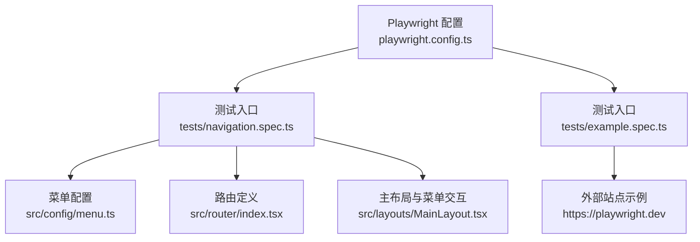
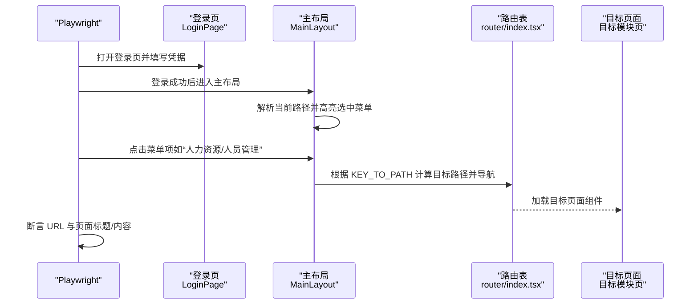
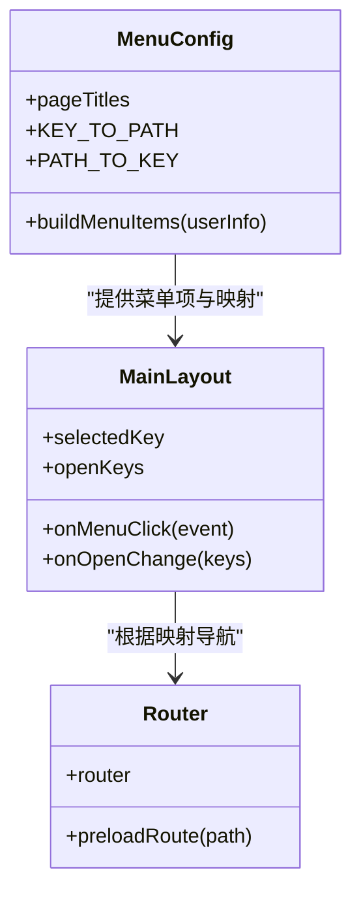
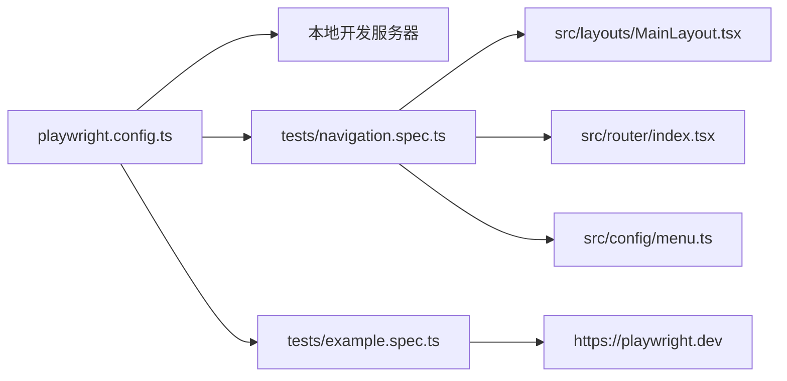

# 导航与基础测试

<cite>
**本文引用的文件**
- [navigation.spec.ts](file://frontend/tests/navigation.spec.ts)
- [example.spec.ts](file://frontend/tests/example.spec.ts)
- [login.spec.ts](file://frontend/tests/login.spec.ts)
- [employee-management.spec.ts](file://frontend/tests/employee-management.spec.ts)
- [finance-flows.spec.ts](file://frontend/tests/finance-flows.spec.ts)
- [playwright.config.ts](file://frontend/playwright.config.ts)
- [package.json](file://frontend/package.json)
- [menu.ts](file://frontend/src/config/menu.ts)
- [index.tsx](file://frontend/src/router/index.tsx)
- [MainLayout.tsx](file://frontend/src/layouts/MainLayout.tsx)
</cite>

## 目录
1. [引言](#引言)
2. [项目结构](#项目结构)
3. [核心组件](#核心组件)
4. [架构总览](#架构总览)
5. [详细组件分析](#详细组件分析)
6. [依赖关系分析](#依赖关系分析)
7. [性能考量](#性能考量)
8. [故障排查指南](#故障排查指南)
9. [结论](#结论)
10. [附录](#附录)

## 引言
本测试文档围绕前端 E2E 测试中的“导航与基础测试”主题，重点参考 navigation.spec.ts 与 example.spec.ts，系统性说明：
- 如何通过 navigation.spec.ts 验证主菜单与侧边栏导航链接能否正确跳转至对应页面（如仪表板、财务管理、人事管理等）。
- 如何通过 example.spec.ts 验证 Playwright 环境的基本设置与页面加载能力。
- 这些测试如何作为应用整体可用性的健康检查。
- 编写导航测试的可复用模式，确保路由系统与 UI 布局的稳定性。

## 项目结构
前端 E2E 测试位于 frontend/tests 目录，Playwright 配置位于 frontend/playwright.config.ts。导航与基础测试分别对应 navigation.spec.ts 与 example.spec.ts；同时，login.spec.ts、employee-management.spec.ts、finance-flows.spec.ts 提供了登录、菜单导航与业务流程的综合示例，便于理解导航测试的上下文与最佳实践。

图表来源
- [playwright.config.ts](file://frontend/playwright.config.ts#L1-L80)
- [navigation.spec.ts](file://frontend/tests/navigation.spec.ts#L1-L68)
- [example.spec.ts](file://frontend/tests/example.spec.ts#L1-L19)
- [menu.ts](file://frontend/src/config/menu.ts#L1-L313)
- [index.tsx](file://frontend/src/router/index.tsx#L1-L256)
- [MainLayout.tsx](file://frontend/src/layouts/MainLayout.tsx#L1-L286)

章节来源
- [playwright.config.ts](file://frontend/playwright.config.ts#L1-L80)
- [package.json](file://frontend/package.json#L1-L51)

## 核心组件
- Playwright 测试运行器与浏览器环境：通过 playwright.config.ts 的 webServer 启动本地开发服务器，自动执行 tests 目录下的测试。
- 菜单与路由映射：menu.ts 定义菜单项与路径映射，index.tsx 定义路由表，MainLayout.tsx 实现菜单点击跳转逻辑。
- 导航测试与基础示例：navigation.spec.ts 验证从登录到菜单跳转再到目标页面的完整链路；example.spec.ts 验证 Playwright 基本能力。

章节来源
- [playwright.config.ts](file://frontend/playwright.config.ts#L1-L80)
- [menu.ts](file://frontend/src/config/menu.ts#L1-L313)
- [index.tsx](file://frontend/src/router/index.tsx#L1-L256)
- [MainLayout.tsx](file://frontend/src/layouts/MainLayout.tsx#L1-L286)
- [navigation.spec.ts](file://frontend/tests/navigation.spec.ts#L1-L68)
- [example.spec.ts](file://frontend/tests/example.spec.ts#L1-L19)

## 架构总览
导航测试的端到端流程包括：启动本地服务 -> 登录 -> 点击菜单 -> 路由跳转 -> 页面渲染 -> 断言 URL 与标题/内容。

图表来源
- [MainLayout.tsx](file://frontend/src/layouts/MainLayout.tsx#L120-L135)
- [menu.ts](file://frontend/src/config/menu.ts#L249-L313)
- [index.tsx](file://frontend/src/router/index.tsx#L165-L256)
- [navigation.spec.ts](file://frontend/tests/navigation.spec.ts#L43-L67)

## 详细组件分析

### 导航测试：navigation.spec.ts
该测试通过模拟登录与 API 响应，验证从登录到菜单跳转再到目标页面的完整链路，并断言 URL 与页面标题。

- 关键步骤
  - 模拟健康检查与登录接口响应，确保登录成功。
  - 模拟员工列表接口响应，避免真实后端影响。
  - 登录后断言进入仪表板路径。
  - 点击“人力资源”与“人员管理”，断言最终 URL 与页面标题。

- 断言要点
  - 使用正则断言 URL 包含目标路径片段。
  - 使用页面文本断言确认页面标题可见。

- 与菜单/路由的关系
  - 菜单键与路径映射由 menu.ts 提供，MainLayout.tsx 在菜单点击时根据 KEY_TO_PATH 计算目标路径并导航。
  - 路由表 index.tsx 定义了各路径对应的页面组件，确保导航后能正确渲染目标页面。

- 可扩展模式
  - 为每个主要菜单项建立独立测试用例，覆盖不同角色权限下的菜单可见性与跳转。
  - 使用数据驱动方式批量校验多个菜单键到路径的映射一致性。

章节来源
- [navigation.spec.ts](file://frontend/tests/navigation.spec.ts#L1-L68)
- [menu.ts](file://frontend/src/config/menu.ts#L249-L313)
- [MainLayout.tsx](file://frontend/src/layouts/MainLayout.tsx#L120-L135)
- [index.tsx](file://frontend/src/router/index.tsx#L165-L256)

### 基础示例：example.spec.ts
该示例展示了 Playwright 的基本能力：访问外部站点、断言标题、点击链接并断言新页面标题。

- 关键点
  - 使用 page.goto 打开页面。
  - 使用 expect(page).toHaveTitle 断言标题包含特定子串。
  - 使用 getByRole 获取链接并点击，断言目标标题可见。

- 价值
  - 验证 Playwright 环境、浏览器驱动与断言机制正常工作。
  - 作为后续复杂测试（如登录、导航）的基础模板。

章节来源
- [example.spec.ts](file://frontend/tests/example.spec.ts#L1-L19)

### 综合导航与业务流程：login.spec.ts、employee-management.spec.ts、finance-flows.spec.ts
这些测试提供了导航与业务流程的综合范式，有助于理解 navigation.spec.ts 的上下文与最佳实践。

- 登录流程（login.spec.ts）
  - 模拟健康检查与登录接口，支持普通登录与二次验证（TOTP）两种场景。
  - 断言登录成功后的 URL 与页面元素可见性。

- 人员管理（employee-management.spec.ts）
  - 模拟权限与基础数据接口，登录后展开“人力资源”菜单并点击“新建员工”。
  - 断言目标页面标题与表单元素可见，并模拟提交成功提示。

- 收支记账（finance-flows.spec.ts）
  - 模拟上传、账户、类别、部门、员工、资产、供应商等多类接口。
  - 登录后展开“财务管理”菜单并点击“收支记账”，打开创建对话框并完成表单提交。
  - 断言创建响应与 UI 提示。

- 对导航测试的启示
  - 使用统一的 API 模拟策略，确保测试稳定且可重复。
  - 通过断言 URL 与页面标题/内容，验证路由与菜单联动的正确性。
  - 将菜单展开与点击动作抽象为可复用步骤，降低重复代码。

章节来源
- [login.spec.ts](file://frontend/tests/login.spec.ts#L1-L114)
- [employee-management.spec.ts](file://frontend/tests/employee-management.spec.ts#L1-L116)
- [finance-flows.spec.ts](file://frontend/tests/finance-flows.spec.ts#L1-L290)

### 类图：菜单、布局与路由的交互

图表来源
- [menu.ts](file://frontend/src/config/menu.ts#L1-L313)
- [MainLayout.tsx](file://frontend/src/layouts/MainLayout.tsx#L120-L149)
- [index.tsx](file://frontend/src/router/index.tsx#L144-L154)

## 依赖关系分析
- 测试对运行时的依赖
  - Playwright 通过 playwright.config.ts 的 webServer 自动启动本地开发服务器，测试期间无需手动维护服务状态。
  - package.json 中提供 test:e2e 脚本，便于一键运行所有 E2E 测试。

- 测试对前端组件的依赖
  - navigation.spec.ts 依赖 MainLayout 的菜单点击行为与路由表的路径映射。
  - login.spec.ts 依赖 LoginPage 与路由表中的登录路径。
  - employee-management.spec.ts 与 finance-flows.spec.ts 依赖各自页面组件与菜单项。

图表来源
- [playwright.config.ts](file://frontend/playwright.config.ts#L74-L79)
- [package.json](file://frontend/package.json#L1-L51)
- [navigation.spec.ts](file://frontend/tests/navigation.spec.ts#L1-L68)
- [MainLayout.tsx](file://frontend/src/layouts/MainLayout.tsx#L120-L135)
- [index.tsx](file://frontend/src/router/index.tsx#L165-L256)
- [menu.ts](file://frontend/src/config/menu.ts#L249-L313)
- [example.spec.ts](file://frontend/tests/example.spec.ts#L1-L19)

章节来源
- [playwright.config.ts](file://frontend/playwright.config.ts#L1-L80)
- [package.json](file://frontend/package.json#L1-L51)

## 性能考量
- 测试并发与重试
  - playwright.config.ts 启用了完全并行与按 CI 环境调整重试策略，有助于在 CI 上快速反馈问题。
- 路由懒加载与预加载
  - index.tsx 使用懒加载与预加载函数，可在菜单点击时提前加载目标页面组件，减少首屏等待时间。
- 菜单展开与 hover 体验
  - MainLayout.tsx 在折叠态下提供 hover 展开 overlay，减少频繁状态切换带来的卡顿。

章节来源
- [playwright.config.ts](file://frontend/playwright.config.ts#L1-L80)
- [index.tsx](file://frontend/src/router/index.tsx#L144-L154)
- [MainLayout.tsx](file://frontend/src/layouts/MainLayout.tsx#L196-L250)

## 故障排查指南
- 测试无法访问本地服务
  - 确认 playwright.config.ts 的 webServer 命令与端口配置正确，且本地开发服务器已启动。
  - 若 CI 环境，注意 reuseExistingServer 的行为。
- 登录失败或 401
  - 检查 login.spec.ts 中的登录接口模拟是否与实际请求体一致。
  - 确保 navigation.spec.ts 与 login.spec.ts 的登录模拟一致。
- 菜单点击无效或页面未跳转
  - 检查 MainLayout.tsx 的 onMenuClick 是否被触发，以及 KEY_TO_PATH 与路由表是否一致。
  - 确认菜单文本与选择器与实际 UI 保持一致。
- URL 断言失败
  - 使用更宽松的断言（如包含目标路径片段），或在测试中打印当前 URL 以定位差异。
- 页面标题/内容断言不稳定
  - 适当增加超时时间，或在关键步骤前后添加等待与断言，确保页面渲染完成。

章节来源
- [playwright.config.ts](file://frontend/playwright.config.ts#L1-L80)
- [login.spec.ts](file://frontend/tests/login.spec.ts#L1-L114)
- [navigation.spec.ts](file://frontend/tests/navigation.spec.ts#L1-L68)
- [MainLayout.tsx](file://frontend/src/layouts/MainLayout.tsx#L120-L135)
- [index.tsx](file://frontend/src/router/index.tsx#L165-L256)

## 结论
- navigation.spec.ts 通过模拟登录与 API 响应，验证了主菜单与侧边栏导航的正确性，是应用导航链路的健康检查。
- example.spec.ts 作为基础示例，验证了 Playwright 环境与基本断言能力，为更复杂的导航与业务测试提供模板。
- 结合 login.spec.ts、employee-management.spec.ts、finance-flows.spec.ts 的实践，可以形成一套稳定的导航测试模式：统一的 API 模拟、清晰的菜单与路由映射、稳健的断言策略与可复用的步骤封装。

## 附录
- 编写导航测试的推荐模式
  - 统一的 API 模拟：在测试开始前统一注册必要的 API 模拟，避免跨测试相互干扰。
  - 菜单与路由映射校验：基于 menu.ts 的 KEY_TO_PATH 与 index.tsx 的路由表，建立菜单键到路径的映射校验用例。
  - 菜单展开与点击：将菜单展开与点击动作抽象为可复用步骤，减少重复代码。
  - 断言策略：优先断言 URL 片段与页面标题/关键内容可见性，必要时结合等待与超时控制。
  - 角色与权限：针对不同角色权限，分别验证菜单可见性与跳转路径的一致性。