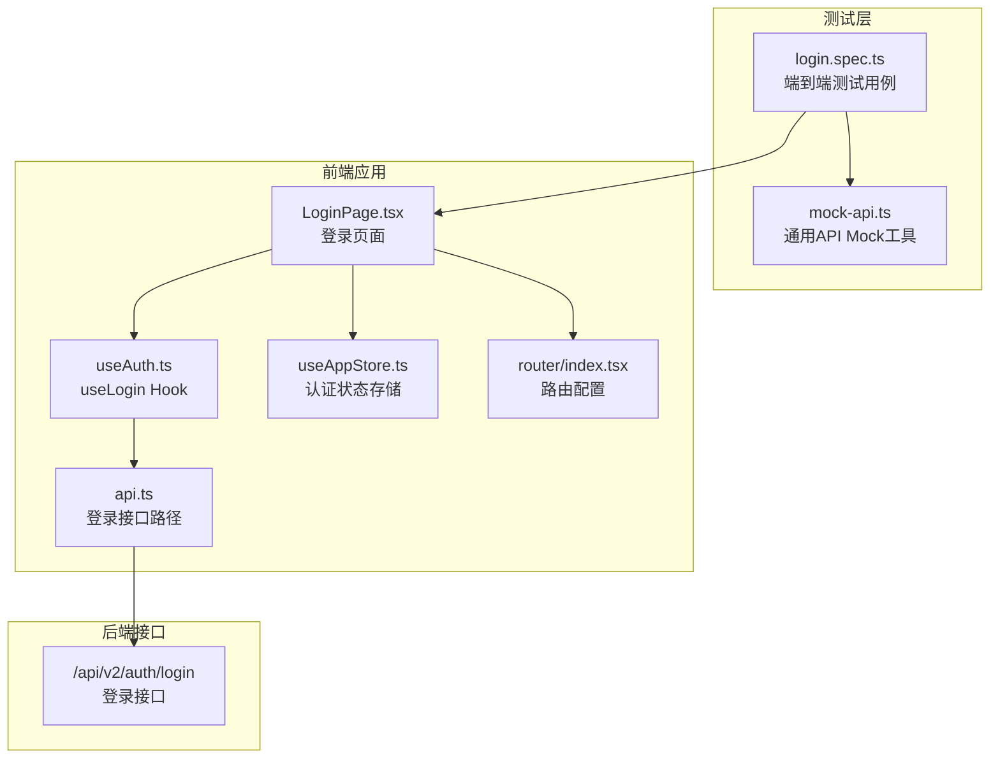
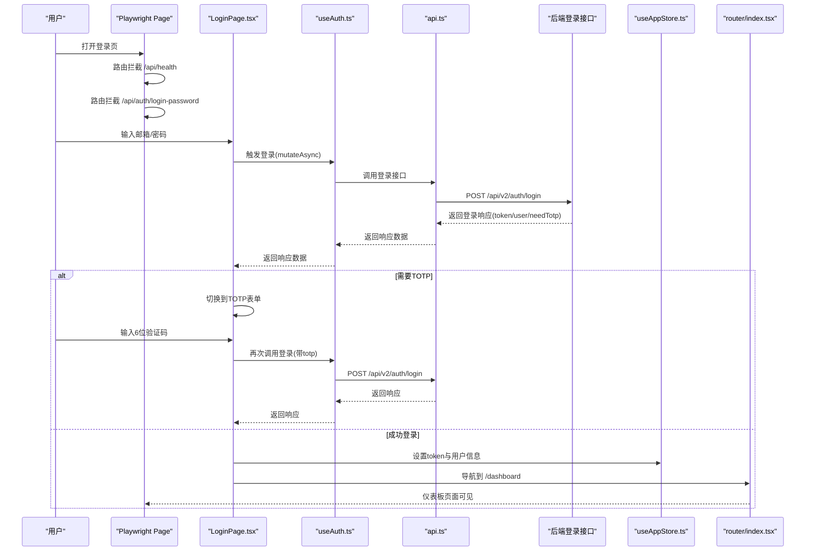
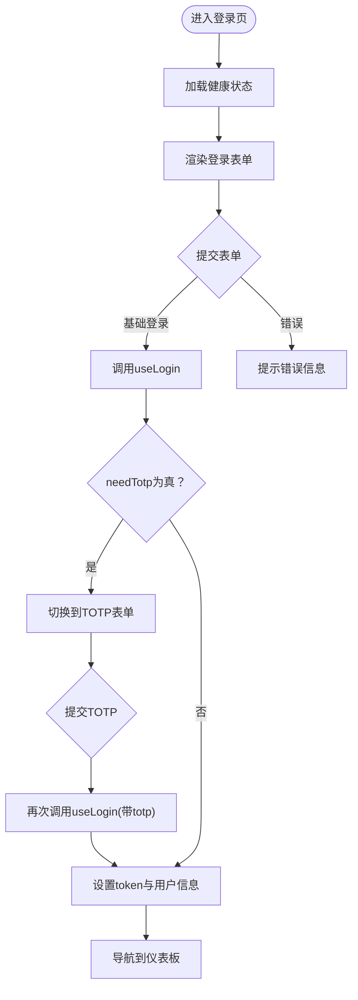
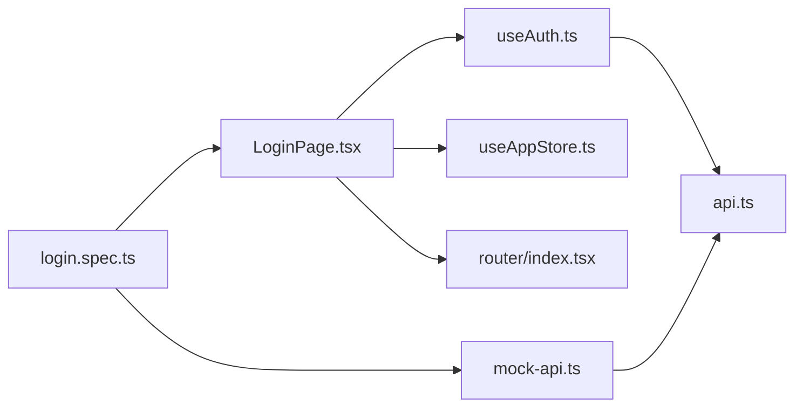

# 认证流程测试

<cite>
**本文引用的文件**
- [frontend/tests/login.spec.ts](file://frontend/tests/login.spec.ts)
- [frontend/tests/utils/mock-api.ts](file://frontend/tests/utils/mock-api.ts)
- [frontend/src/features/auth/pages/LoginPage.tsx](file://frontend/src/features/auth/pages/LoginPage.tsx)
- [frontend/src/hooks/business/useAuth.ts](file://frontend/src/hooks/business/useAuth.ts)
- [frontend/src/config/api.ts](file://frontend/src/config/api.ts)
- [frontend/src/store/useAppStore.ts](file://frontend/src/store/useAppStore.ts)
- [frontend/src/router/index.tsx](file://frontend/src/router/index.tsx)
- [frontend/playwright.config.ts](file://frontend/playwright.config.ts)
- [frontend/src/types/auth.ts](file://frontend/src/types/auth.ts)
- [frontend/src/types/domain.ts](file://frontend/src/types/domain.ts)
</cite>

## 目录
1. [简介](#简介)
2. [项目结构](#项目结构)
3. [核心组件](#核心组件)
4. [架构总览](#架构总览)
5. [详细组件分析](#详细组件分析)
6. [依赖关系分析](#依赖关系分析)
7. [性能考量](#性能考量)
8. [故障排查指南](#故障排查指南)
9. [结论](#结论)
10. [附录](#附录)

## 简介
本测试文档围绕前端认证端到端测试展开，以 login.spec.ts 为核心，系统性说明：
- 如何通过 setupCommonMocks 或直接在测试中拦截 /api/auth/login-password，模拟登录API响应，返回包含 token 与用户权限的 JSON 对象；
- 测试用例如何模拟用户在登录页输入凭据、提交表单，并验证成功登录后跳转至仪表板；
- 如何测试无效凭据的错误处理流程；
- 如何结合 mock-api.ts 中对 /api/auth/login-password 的路由拦截，模拟不同角色（如管理员、财务）的权限数据，支撑基于角色的 UI 测试；
- 提供测试编写指南，包括页面元素定位、表单交互与状态验证的最佳实践。

## 项目结构
认证测试涉及的关键文件与职责如下：
- 前端 Playwright 测试入口与用例：frontend/tests/login.spec.ts
- 通用 API Mock 工具：frontend/tests/utils/mock-api.ts
- 登录页面实现：frontend/src/features/auth/pages/LoginPage.tsx
- 登录 Hook（调用登录 API）：frontend/src/hooks/business/useAuth.ts
- API 配置（包含登录接口路径）：frontend/src/config/api.ts
- 应用状态存储（认证态与用户信息）：frontend/src/store/useAppStore.ts
- 路由配置（登录与仪表板等页面）：frontend/src/router/index.tsx
- Playwright 运行配置（本地开发服务器启动）：frontend/playwright.config.ts
- 类型定义（登录请求/响应、用户与权限）：frontend/src/types/auth.ts、frontend/src/types/domain.ts

图表来源
- [frontend/tests/login.spec.ts](file://frontend/tests/login.spec.ts#L1-L114)
- [frontend/tests/utils/mock-api.ts](file://frontend/tests/utils/mock-api.ts#L1-L92)
- [frontend/src/features/auth/pages/LoginPage.tsx](file://frontend/src/features/auth/pages/LoginPage.tsx#L1-L194)
- [frontend/src/hooks/business/useAuth.ts](file://frontend/src/hooks/business/useAuth.ts#L1-L69)
- [frontend/src/config/api.ts](file://frontend/src/config/api.ts#L1-L188)
- [frontend/src/store/useAppStore.ts](file://frontend/src/store/useAppStore.ts#L1-L90)
- [frontend/src/router/index.tsx](file://frontend/src/router/index.tsx#L1-L256)

章节来源
- [frontend/tests/login.spec.ts](file://frontend/tests/login.spec.ts#L1-L114)
- [frontend/tests/utils/mock-api.ts](file://frontend/tests/utils/mock-api.ts#L1-L92)
- [frontend/src/features/auth/pages/LoginPage.tsx](file://frontend/src/features/auth/pages/LoginPage.tsx#L1-L194)
- [frontend/src/hooks/business/useAuth.ts](file://frontend/src/hooks/business/useAuth.ts#L1-L69)
- [frontend/src/config/api.ts](file://frontend/src/config/api.ts#L1-L188)
- [frontend/src/store/useAppStore.ts](file://frontend/src/store/useAppStore.ts#L1-L90)
- [frontend/src/router/index.tsx](file://frontend/src/router/index.tsx#L1-L256)
- [frontend/playwright.config.ts](file://frontend/playwright.config.ts#L1-L80)

## 核心组件
- 登录页面 LoginPage.tsx：负责渲染登录表单、TOTP 表单、调用 useLogin Hook、处理登录成功/失败逻辑并导航至仪表板。
- 登录 Hook useAuth.ts：封装 useMutation 调用登录接口，返回登录响应数据。
- API 配置 api.ts：定义登录接口路径（如 /api/v2/auth/login），供 useAuth.ts 使用。
- 认证状态存储 useAppStore.ts：维护 token、用户信息与认证态，驱动页面导航与权限控制。
- 路由配置 router/index.tsx：定义 /login 与 /dashboard 等路由，以及仪表板等受保护页面。
- 端到端测试 login.spec.ts：覆盖基础登录、TOTP 登录与错误处理三类场景。
- 通用 Mock 工具 mock-api.ts：统一拦截 /api/**、/api/health 与 /api/auth/login-password，提供稳定可重复的测试环境。

章节来源
- [frontend/src/features/auth/pages/LoginPage.tsx](file://frontend/src/features/auth/pages/LoginPage.tsx#L1-L194)
- [frontend/src/hooks/business/useAuth.ts](file://frontend/src/hooks/business/useAuth.ts#L1-L69)
- [frontend/src/config/api.ts](file://frontend/src/config/api.ts#L1-L188)
- [frontend/src/store/useAppStore.ts](file://frontend/src/store/useAppStore.ts#L1-L90)
- [frontend/src/router/index.tsx](file://frontend/src/router/index.tsx#L1-L256)
- [frontend/tests/login.spec.ts](file://frontend/tests/login.spec.ts#L1-L114)
- [frontend/tests/utils/mock-api.ts](file://frontend/tests/utils/mock-api.ts#L1-L92)

## 架构总览
下图展示了从用户输入凭据到登录完成并跳转仪表板的端到端流程，以及测试如何通过路由拦截模拟后端响应。

图表来源
- [frontend/src/features/auth/pages/LoginPage.tsx](file://frontend/src/features/auth/pages/LoginPage.tsx#L1-L194)
- [frontend/src/hooks/business/useAuth.ts](file://frontend/src/hooks/business/useAuth.ts#L1-L69)
- [frontend/src/config/api.ts](file://frontend/src/config/api.ts#L1-L188)
- [frontend/src/store/useAppStore.ts](file://frontend/src/store/useAppStore.ts#L1-L90)
- [frontend/src/router/index.tsx](file://frontend/src/router/index.tsx#L1-L256)
- [frontend/tests/login.spec.ts](file://frontend/tests/login.spec.ts#L1-L114)
- [frontend/tests/utils/mock-api.ts](file://frontend/tests/utils/mock-api.ts#L1-L92)

## 详细组件分析

### 组件A：登录页面 LoginPage.tsx
- 表单与状态
  - 登录步骤：login 与 totp 两阶段；当登录响应包含 needTotp 时切换到 TOTP 表单。
  - 缓存邮箱：从本地存储读取并回填邮箱，失焦时更新缓存。
  - 健康检查：通过 useHealth 获取后端健康状态，禁用登录按钮直到健康。
- 登录流程
  - 基础登录：校验邮箱/密码，调用 useLogin，若 needTotp 切换到 TOTP 步骤；否则设置 token 与用户信息并导航到仪表板。
  - TOTP 登录：校验6位数字，携带 totp 参数再次调用登录，成功后同样设置 token 与用户信息并导航。
- 错误处理
  - 表单校验失败提示；网络异常统一错误处理；TOTP 错误时提示“验证码错误或已失效”。

图表来源
- [frontend/src/features/auth/pages/LoginPage.tsx](file://frontend/src/features/auth/pages/LoginPage.tsx#L1-L194)

章节来源
- [frontend/src/features/auth/pages/LoginPage.tsx](file://frontend/src/features/auth/pages/LoginPage.tsx#L1-L194)

### 组件B：登录 Hook useAuth.ts
- useLogin：封装 useMutation，调用 apiClient.post 调用登录接口，返回登录响应数据。
- useHealth：查询后端健康状态，用于登录页连接状态指示。

章节来源
- [frontend/src/hooks/business/useAuth.ts](file://frontend/src/hooks/business/useAuth.ts#L1-L69)
- [frontend/src/config/api.ts](file://frontend/src/config/api.ts#L1-L188)

### 组件C：通用 Mock 工具 mock-api.ts
- 拦截策略
  - 拦截所有 /api/** 请求，返回空结果数组，避免真实后端导致的 401。
  - 拦截 /api/health，返回健康状态。
  - 拦截 /api/auth/login-password，返回包含 token 与用户权限的完整响应，支持多角色与多模块权限。
- 主要用途
  - 为仪表板与主数据等页面提供稳定的初始数据，确保基于角色的 UI 测试可用。

章节来源
- [frontend/tests/utils/mock-api.ts](file://frontend/tests/utils/mock-api.ts#L1-L92)

### 组件D：端到端测试 login.spec.ts
- 基础登录流程
  - 在 beforeEach 中拦截 /api/health。
  - 在测试中拦截 /api/auth/login-password，模拟成功登录返回 token 与用户信息，并断言跳转到仪表板与可见文本。
- TOTP 登录流程
  - 第一步：返回 needTotp，断言显示 TOTP 表单。
  - 第二步：错误验证码与正确验证码分别断言错误消息与跳转。
- 错误处理流程
  - 直接返回 401，断言错误消息。

章节来源
- [frontend/tests/login.spec.ts](file://frontend/tests/login.spec.ts#L1-L114)

### 组件E：路由与导航 router/index.tsx
- 登录路由：/login 显示登录页。
- 仪表板路由：/dashboard 显示仪表板页。
- 其他受保护页面：在 PrivateRoute 包裹下，仅认证用户可见。

章节来源
- [frontend/src/router/index.tsx](file://frontend/src/router/index.tsx#L1-L256)

## 依赖关系分析
- LoginPage.tsx 依赖 useAuth.ts 与 useAppStore.ts，通过 useLogin 发起登录请求，通过 useHealth 检查健康状态。
- useAuth.ts 依赖 api.ts 中的登录接口路径，实际通过 apiClient.post 调用后端。
- login.spec.ts 通过 page.route 拦截 /api/auth/login-password，模拟后端响应。
- mock-api.ts 同样拦截 /api/auth/login-password 并返回更丰富的用户权限数据，便于基于角色的 UI 测试。

图表来源
- [frontend/src/features/auth/pages/LoginPage.tsx](file://frontend/src/features/auth/pages/LoginPage.tsx#L1-L194)
- [frontend/src/hooks/business/useAuth.ts](file://frontend/src/hooks/business/useAuth.ts#L1-L69)
- [frontend/src/config/api.ts](file://frontend/src/config/api.ts#L1-L188)
- [frontend/src/store/useAppStore.ts](file://frontend/src/store/useAppStore.ts#L1-L90)
- [frontend/src/router/index.tsx](file://frontend/src/router/index.tsx#L1-L256)
- [frontend/tests/login.spec.ts](file://frontend/tests/login.spec.ts#L1-L114)
- [frontend/tests/utils/mock-api.ts](file://frontend/tests/utils/mock-api.ts#L1-L92)

章节来源
- [frontend/src/features/auth/pages/LoginPage.tsx](file://frontend/src/features/auth/pages/LoginPage.tsx#L1-L194)
- [frontend/src/hooks/business/useAuth.ts](file://frontend/src/hooks/business/useAuth.ts#L1-L69)
- [frontend/src/config/api.ts](file://frontend/src/config/api.ts#L1-L188)
- [frontend/src/store/useAppStore.ts](file://frontend/src/store/useAppStore.ts#L1-L90)
- [frontend/src/router/index.tsx](file://frontend/src/router/index.tsx#L1-L256)
- [frontend/tests/login.spec.ts](file://frontend/tests/login.spec.ts#L1-L114)
- [frontend/tests/utils/mock-api.ts](file://frontend/tests/utils/mock-api.ts#L1-L92)

## 性能考量
- 测试稳定性优先：通过 page.route 拦截所有 /api/**，避免真实网络波动影响测试。
- 减少外部依赖：统一使用 mock-api.ts 提供的固定响应，保证测试可重复性。
- 页面等待策略：在登录按钮启用与导航断言中使用合理超时，避免不必要的等待。

## 故障排查指南
- 登录按钮不可点击
  - 检查 useHealth 返回的健康状态是否为健康；登录页会根据健康状态禁用按钮。
  - 参考：[frontend/src/features/auth/pages/LoginPage.tsx](file://frontend/src/features/auth/pages/LoginPage.tsx#L1-L194)
- 无法跳转到仪表板
  - 确认登录响应包含 token 与用户信息；LoginPage.tsx 在成功登录后设置 token 与用户信息并导航。
  - 参考：[frontend/src/features/auth/pages/LoginPage.tsx](file://frontend/src/features/auth/pages/LoginPage.tsx#L1-L194)
- TOTP 验证失败
  - 确认测试中拦截 /api/auth/login-password 的第二步返回了正确的 token；错误验证码应返回 401 并提示错误。
  - 参考：[frontend/tests/login.spec.ts](file://frontend/tests/login.spec.ts#L1-L114)
- 通用 API 未被拦截
  - 确保在测试中正确调用 setupCommonMocks 或在 beforeEach 中拦截 /api/health；mock-api.ts 默认会拦截 /api/**。
  - 参考：[frontend/tests/utils/mock-api.ts](file://frontend/tests/utils/mock-api.ts#L1-L92)

章节来源
- [frontend/src/features/auth/pages/LoginPage.tsx](file://frontend/src/features/auth/pages/LoginPage.tsx#L1-L194)
- [frontend/tests/login.spec.ts](file://frontend/tests/login.spec.ts#L1-L114)
- [frontend/tests/utils/mock-api.ts](file://frontend/tests/utils/mock-api.ts#L1-L92)

## 结论
通过 login.spec.ts 与 mock-api.ts 的配合，认证端到端测试能够稳定地覆盖基础登录、TOTP 登录与错误处理三大场景。测试通过路由拦截模拟后端响应，返回包含 token 与用户权限的数据，从而验证登录成功后的导航与 UI 行为。同时，mock-api.ts 提供的角色权限数据可用于支撑基于角色的 UI 测试，提升测试覆盖面与可维护性。

## 附录

### 测试编写指南（页面元素定位、表单交互与状态验证）
- 页面元素定位
  - 使用稳定的属性选择器（如 id）定位邮箱、密码与验证码输入框，以及提交按钮。
  - 使用可见文本断言（如“工作台”、“二步验证”）确认页面内容。
- 表单交互
  - 先填充邮箱与密码，再点击提交；对于 TOTP 场景，先断言 TOTP 表单出现后再输入验证码并提交。
- 状态验证
  - 登录成功后断言 URL 跳转到 /dashboard，并验证关键可见文本。
  - 登录失败时断言错误消息提示。
- Mock 数据设计
  - 基础登录：返回 token 与用户信息，role 与 permissions 字段按需设置。
  - TOTP 登录：第一步返回 needTotp，第二步返回 token 与用户信息。
  - 错误场景：返回 401 与错误信息。
- 角色与权限
  - 通过 mock-api.ts 的 /api/auth/login-password 返回不同角色（如 admin、finance）与权限配置，支撑基于角色的 UI 测试。
- 类型参考
  - 登录请求/响应类型：LoginPayload、LoginResponse
  - 用户与权限类型：User、PermissionConfig
  - 参考：
    - [frontend/src/types/auth.ts](file://frontend/src/types/auth.ts#L1-L57)
    - [frontend/src/types/domain.ts](file://frontend/src/types/domain.ts#L1-L371)

章节来源
- [frontend/tests/login.spec.ts](file://frontend/tests/login.spec.ts#L1-L114)
- [frontend/tests/utils/mock-api.ts](file://frontend/tests/utils/mock-api.ts#L1-L92)
- [frontend/src/types/auth.ts](file://frontend/src/types/auth.ts#L1-L57)
- [frontend/src/types/domain.ts](file://frontend/src/types/domain.ts#L1-L371)