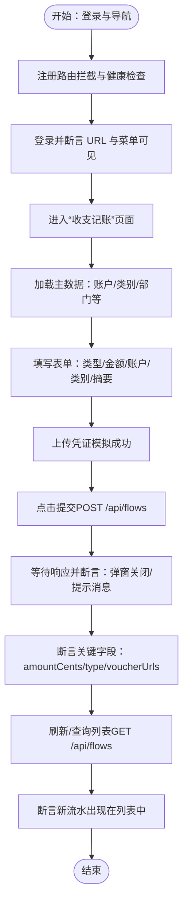

# 财务流程测试

<cite>
**本文引用的文件**
- [finance-flows.spec.ts](file://frontend/tests/finance-flows.spec.ts)
- [mock-api.ts](file://frontend/tests/utils/mock-api.ts)
- [flows.ts](file://backend/src/routes/v2/flows.ts)
- [accounts.ts](file://backend/src/routes/v2/master-data/accounts.ts)
- [FlowCreatePage.tsx](file://frontend/src/features/finance/pages/FlowCreatePage.tsx)
- [FlowsPage.tsx](file://frontend/src/features/finance/pages/FlowsPage.tsx)
- [flow.schema.ts](file://frontend/src/validations/flow.schema.ts)
</cite>

## 目录
1. [简介](#简介)
2. [项目结构](#项目结构)
3. [核心组件](#核心组件)
4. [架构总览](#架构总览)
5. [详细组件分析](#详细组件分析)
6. [依赖关系分析](#依赖关系分析)
7. [性能考量](#性能考量)
8. [故障排查指南](#故障排查指南)
9. [结论](#结论)

## 简介
本测试文档围绕财务核心业务“创建收支流水”的端到端测试流程展开，目标是基于 finance-flows.spec.ts，系统化说明：
- 如何通过测试模拟用户完成从登录到创建流水的完整操作链；
- 如何通过 mock-api.ts 为 /api/flows、/api/accounts 等端点提供稳定、可重复的模拟数据；
- 如何验证表单提交后的数据正确性与 UI 预期变化；
- 如何处理异步操作（如凭证上传）与复杂表单验证；
- 如何在财务流水列表页验证新创建流水的正确显示。

该测试文档同时结合后端路由定义与前端页面实现，帮助读者理解前后端协作的数据流与校验规则。

## 项目结构
财务流程测试主要涉及以下模块：
- 前端测试：Playwright 测试用例与通用 API Mock 工具
- 前端页面：收支记账创建页与流水列表页
- 前端校验：收支流水表单校验模式
- 后端路由：收支流水接口与主数据接口


图表来源
- [finance-flows.spec.ts](file://frontend/tests/finance-flows.spec.ts#L1-L290)
- [mock-api.ts](file://frontend/tests/utils/mock-api.ts#L1-L92)
- [FlowCreatePage.tsx](file://frontend/src/features/finance/pages/FlowCreatePage.tsx#L1-L308)
- [FlowsPage.tsx](file://frontend/src/features/finance/pages/FlowsPage.tsx#L1-L456)
- [flow.schema.ts](file://frontend/src/validations/flow.schema.ts#L1-L30)
- [flows.ts](file://backend/src/routes/v2/flows.ts#L1-L566)
- [accounts.ts](file://backend/src/routes/v2/master-data/accounts.ts#L1-L310)

章节来源
- [finance-flows.spec.ts](file://frontend/tests/finance-flows.spec.ts#L1-L290)
- [mock-api.ts](file://frontend/tests/utils/mock-api.ts#L1-L92)

## 核心组件
- Playwright 端到端测试用例：负责模拟用户行为、断言 UI 与数据一致性，并通过路由拦截实现稳定的 API 模拟。
- 通用 API Mock 工具：集中管理 /api/** 的回退拦截与健康检查、登录、主数据、凭证上传等模拟响应。
- 收支记账创建页：包含日期、类型、金额、账户、类别、归属项目/站点、对方、备注、凭证上传等表单项；提交前执行前端校验。
- 收支流水列表页：支持筛选、分页、凭证预览、补充/重新上传凭证、红冲等能力。
- 表单校验模式：定义创建流水的必填项、数值范围、凭证数量等约束。
- 后端收支流水路由：提供列表查询、创建流水、上传凭证、下载凭证、更新凭证、红冲等接口。
- 后端主数据路由：提供账户列表等主数据查询接口。

章节来源
- [FlowCreatePage.tsx](file://frontend/src/features/finance/pages/FlowCreatePage.tsx#L1-L308)
- [FlowsPage.tsx](file://frontend/src/features/finance/pages/FlowsPage.tsx#L1-L456)
- [flow.schema.ts](file://frontend/src/validations/flow.schema.ts#L1-L30)
- [flows.ts](file://backend/src/routes/v2/flows.ts#L1-L566)
- [accounts.ts](file://backend/src/routes/v2/master-data/accounts.ts#L1-L310)

## 架构总览
下图展示从测试到前端页面再到后端路由的整体调用链路与数据流。


图表来源
- [finance-flows.spec.ts](file://frontend/tests/finance-flows.spec.ts#L1-L290)
- [mock-api.ts](file://frontend/tests/utils/mock-api.ts#L1-L92)
- [FlowCreatePage.tsx](file://frontend/src/features/finance/pages/FlowCreatePage.tsx#L1-L308)
- [flows.ts](file://backend/src/routes/v2/flows.ts#L1-L566)
- [accounts.ts](file://backend/src/routes/v2/master-data/accounts.ts#L1-L310)

## 详细组件分析

### 组件A：财务流水创建端到端测试（finance-flows.spec.ts）
- 登录与导航
  - 通过路由拦截防止真实后端返回 401，保证测试稳定性。
  - 登录成功后断言 URL 与菜单可见性，再进入“收支记账”页面。
- 主数据加载
  - 对 /api/accounts、/api/categories、/api/departments、/api/sites、/api/employees、/api/fixed-assets、/api/vendors 等端点提供统一的空数组或示例数据，确保页面渲染不受真实数据影响。
- 凭证上传
  - 为 /api/upload/voucher 提供固定响应，模拟上传成功并返回 URL 与元信息；测试中使用 base64 图像缓冲触发客户端上传逻辑，并断言 UI 显示“查看/删除”按钮。
- 创建流水
  - 为 /api/flows 提供统一的 POST/GET 处理：POST 时保存请求体并返回带 id 与创建时间的响应；GET 时返回空列表与汇总统计。
  - 表单字段选择与输入：类型、金额、账户、类别、摘要、凭证上传；提交前等待上传完成并校验必填项。
- 提交与断言
  - 等待 POST /api/flows 成功响应，断言弹窗关闭、提示消息出现。
  - 断言已创建流水的关键字段：amountCents 为整数（分）、type 为 income、voucherUrls 非空。
- 列表页验证
  - 通过刷新或再次访问列表页，断言新流水出现在列表中（由 GET /api/flows 返回的 items 中包含新流水）。



图表来源
- [finance-flows.spec.ts](file://frontend/tests/finance-flows.spec.ts#L1-L290)

章节来源
- [finance-flows.spec.ts](file://frontend/tests/finance-flows.spec.ts#L1-L290)

### 组件B：通用 API Mock 工具（mock-api.ts）
- 全局回退拦截
  - 对匹配 **/api/** 的请求进行拦截，排除源码与依赖路径，其余请求统一返回 200 + { results: [] }，避免真实后端干扰。
- 健康检查
  - /api/health 返回健康状态，便于测试前置检查。
- 登录模拟
  - /api/auth/login-password 返回 token 与用户信息（含岗位与财务权限），用于后续页面与接口鉴权。
- 主数据模拟
  - /api/accounts、/api/categories、/api/departments、/api/sites、/api/employees、/api/fixed-assets、/api/vendors 等端点返回示例数据，确保页面渲染与选择器可用。
- 凭证上传模拟
  - /api/upload/voucher 返回固定上传结果（URL、状态、UID、名称），延迟约 500ms 模拟网络耗时。


图表来源
- [mock-api.ts](file://frontend/tests/utils/mock-api.ts#L1-L92)

章节来源
- [mock-api.ts](file://frontend/tests/utils/mock-api.ts#L1-L92)

### 组件C：前端页面与表单校验（FlowCreatePage.tsx 与 flow.schema.ts）
- 页面布局与表单字段
  - 包含日期时间、类型（收入/支出/转账/调整）、金额、账户、类别、归属项目/站点、对方、备注、凭证上传等。
  - 默认值初始化：类型为收入，日期为当前时间。
- 凭证上传逻辑
  - beforeUpload 中进行格式校验与 WebP 转换，调用 /api/upload/voucher 接口，成功后将 URL 追加到 voucherUrls 并更新表单字段。
- 提交流程
  - 必须至少上传一张凭证；金额需大于 0；账户与类别必选；类型必选。
  - 提交时将金额转换为“分”，并将 bizDate 格式化为服务端期望格式，最终调用创建流水接口。
- 表单校验模式
  - createFlowSchema 定义了必填项、最小金额、账户与类别必选、凭证至少一张等规则。


图表来源
- [FlowCreatePage.tsx](file://frontend/src/features/finance/pages/FlowCreatePage.tsx#L1-L308)
- [flow.schema.ts](file://frontend/src/validations/flow.schema.ts#L1-L30)

章节来源
- [FlowCreatePage.tsx](file://frontend/src/features/finance/pages/FlowCreatePage.tsx#L1-L308)
- [flow.schema.ts](file://frontend/src/validations/flow.schema.ts#L1-L30)

### 组件D：后端路由与数据模型（flows.ts 与 accounts.ts）
- 收支流水接口
  - GET /flows：返回分页列表与汇总统计，映射 voucherUrl 为数组或单个 URL。
  - POST /flows：创建流水，自动解析部门归属（departmentId/siteId/ownerScope 兼容），写入审计日志。
  - POST /upload/voucher：上传凭证，限制大小与类型，强制 WebP，返回 URL 与键。
  - PUT /flows/{id}/voucher：更新流水凭证 URL 数组。
  - POST /flows/{id}/reverse：红冲流水（需权限）。
- 主数据接口
  - GET /accounts：返回账户列表，支持 activeOnly、accountType、currency、search 等过滤条件。

```mermaid
classDiagram
class FlowsRoutes {
+GET "/flows" listCashFlows()
+POST "/flows" createCashFlow()
+POST "/upload/voucher" uploadVoucher()
+PUT "/flows/{id}/voucher" updateVoucher()
+POST "/flows/{id}/reverse" reverseFlow()
}
class AccountsRoutes {
+GET "/" listAccounts()
+GET "/{id}/transactions" listAccountTransactions()
+POST "/" createAccount()
+PUT "/{id}" updateAccount()
+DELETE "/{id}" deleteAccount()
}
FlowsRoutes --> AccountsRoutes : "账户/类别等主数据查询"
```

图表来源
- [flows.ts](file://backend/src/routes/v2/flows.ts#L1-L566)
- [accounts.ts](file://backend/src/routes/v2/master-data/accounts.ts#L1-L310)

章节来源
- [flows.ts](file://backend/src/routes/v2/flows.ts#L1-L566)
- [accounts.ts](file://backend/src/routes/v2/master-data/accounts.ts#L1-L310)

## 依赖关系分析
- 测试对前端页面与校验的依赖
  - 测试用例依赖 FlowCreatePage.tsx 的表单字段与上传逻辑，以及 flow.schema.ts 的校验规则。
- 测试对后端路由的依赖
  - 通过路由拦截模拟 /api/flows、/api/accounts、/api/upload/voucher 等端点，确保测试稳定。
- 前端对后端的依赖
  - FlowCreatePage.tsx 依赖 /api/upload/voucher 与 /api/flows；FlowsPage.tsx 依赖 /api/flows 列表与凭证上传/更新接口。


图表来源
- [finance-flows.spec.ts](file://frontend/tests/finance-flows.spec.ts#L1-L290)
- [mock-api.ts](file://frontend/tests/utils/mock-api.ts#L1-L92)
- [FlowCreatePage.tsx](file://frontend/src/features/finance/pages/FlowCreatePage.tsx#L1-L308)
- [FlowsPage.tsx](file://frontend/src/features/finance/pages/FlowsPage.tsx#L1-L456)
- [flow.schema.ts](file://frontend/src/validations/flow.schema.ts#L1-L30)
- [flows.ts](file://backend/src/routes/v2/flows.ts#L1-L566)
- [accounts.ts](file://backend/src/routes/v2/master-data/accounts.ts#L1-L310)

章节来源
- [finance-flows.spec.ts](file://frontend/tests/finance-flows.spec.ts#L1-L290)
- [mock-api.ts](file://frontend/tests/utils/mock-api.ts#L1-L92)
- [FlowCreatePage.tsx](file://frontend/src/features/finance/pages/FlowCreatePage.tsx#L1-L308)
- [FlowsPage.tsx](file://frontend/src/features/finance/pages/FlowsPage.tsx#L1-L456)
- [flow.schema.ts](file://frontend/src/validations/flow.schema.ts#L1-L30)
- [flows.ts](file://backend/src/routes/v2/flows.ts#L1-L566)
- [accounts.ts](file://backend/src/routes/v2/master-data/accounts.ts#L1-L310)

## 性能考量
- 路由拦截顺序与优先级
  - Playwright 路由按“创建顺序逆序匹配”，因此应先注册全局回退拦截，再注册更具体的 mock，以确保未命中具体路由时能回落到回退逻辑。
- 异步上传与 UI 渲染
  - 凭证上传模拟中加入延迟，有助于验证前端上传状态与 UI 反馈；测试中等待上传完成后再提交，避免竞态。
- 列表查询与分页
  - 列表页支持分页与筛选，建议在测试中切换页码与应用筛选条件，验证后端分页与过滤逻辑。

[本节为通用指导，不直接分析具体文件]

## 故障排查指南
- 401 未授权问题
  - 若真实后端返回 401，测试会记录日志；应检查登录拦截是否生效，以及 token 是否写入 localStorage。
- 未命中路由
  - 若出现“未模拟的 API 被命中”，检查路由拦截注册顺序与通配符匹配规则，确保回退拦截位于更具体路由之前。
- 表单校验失败
  - 当金额小于等于 0、未选择账户/类别、未上传凭证时，前端会阻止提交；测试中应先修正表单字段再提交。
- 上传凭证失败
  - 检查 beforeUpload 中的格式校验与 WebP 转换逻辑，确认 /api/upload/voucher 返回的 URL 能被前端正确接收并更新 UI。
- 列表未显示新流水
  - 确认 POST /api/flows 返回的 id 能在 GET /api/flows 的 items 中找到；若使用缓存或乐观更新，需确保刷新或重新拉取数据。

章节来源
- [finance-flows.spec.ts](file://frontend/tests/finance-flows.spec.ts#L1-L290)
- [FlowCreatePage.tsx](file://frontend/src/features/finance/pages/FlowCreatePage.tsx#L1-L308)
- [flows.ts](file://backend/src/routes/v2/flows.ts#L1-L566)

## 结论
本测试文档系统化梳理了财务流水创建的端到端测试流程，明确了：
- 测试如何通过路由拦截与通用 Mock 工具稳定地模拟后端接口；
- 前端页面如何组织表单字段与上传逻辑，并在提交前执行严格校验；
- 后端路由如何处理凭证上传、流水创建与列表查询；
- 如何在列表页验证新流水的正确显示。

通过以上机制，测试能够覆盖从用户操作到数据落库与 UI 反馈的完整闭环，确保财务数据操作的准确性与稳定性。