# 后端测试

<cite>
**本文档中引用的文件**  
- [vitest.config.ts](file://backend/vitest.config.ts)
- [setup.ts](file://backend/test/setup.ts)
- [AuthService.ts](file://backend/src/services/AuthService.ts)
- [AccountService.ts](file://backend/src/services/AccountService.ts)
- [auth.test.ts](file://backend/test/routes/v2/auth.test.ts)
- [AuthService.test.ts](file://backend/test/services/AuthService.test.ts)
- [AccountService.test.ts](file://backend/test/services/AccountService.test.ts)
- [logger.test.ts](file://backend/test/utils/logger.test.ts)
- [amount-validator.test.ts](file://backend/test/utils/amount-validator.test.ts)
- [logger.ts](file://backend/src/utils/logger.ts)
- [amount-validator.ts](file://backend/src/utils/amount-validator.ts)
- [di.ts](file://backend/src/middleware/di.ts)
- [errors.ts](file://backend/src/utils/errors.ts)
- [errorCodes.test.ts](file://backend/test/utils/errorCodes.test.ts)
- [response.ts](file://backend/test/utils/response.ts)
</cite>

## 目录
1. [简介](#简介)
2. [测试配置](#测试配置)
3. [测试环境初始化](#测试环境初始化)
4. [服务层测试](#服务层测试)
5. [路由测试](#路由测试)
6. [工具函数测试](#工具函数测试)
7. [依赖注入与Mock](#依赖注入与mock)
8. [数据库测试策略](#数据库测试策略)
9. [覆盖率与质量保证](#覆盖率与质量保证)
10. [常见问题解决方案](#常见问题解决方案)

## 简介
本文档详细介绍了后端系统的测试策略，重点阐述了使用Vitest进行单元测试和集成测试的实现方式。文档涵盖了服务层、路由和工具函数的测试模式，以及测试配置、环境初始化和质量保证措施。

## 测试配置

Vitest测试框架的配置文件`vitest.config.ts`定义了测试运行器的核心设置，包括Cloudflare Workers环境的兼容性配置和代码覆盖率阈值。

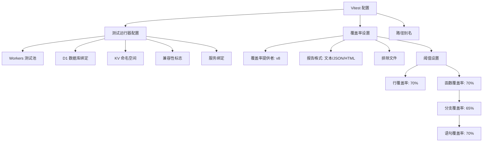

**Diagram sources**
- [vitest.config.ts](file://backend/vitest.config.ts#L7-L47)

**Section sources**
- [vitest.config.ts](file://backend/vitest.config.ts#L1-L48)

## 测试环境初始化

测试环境的初始化通过`setup.ts`文件实现，确保每次测试都在一致的数据库状态下运行。该文件提供了初始化测试数据库和应用数据库模式的工具函数。

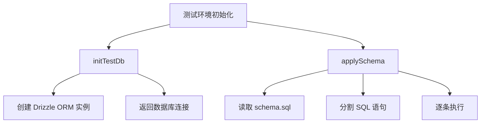

**Diagram sources**
- [setup.ts](file://backend/test/setup.ts#L7-L27)

**Section sources**
- [setup.ts](file://backend/test/setup.ts#L1-L27)

## 服务层测试

服务层测试是后端测试的核心，主要针对`AccountService`和`AuthService`等业务服务类进行单元测试和集成测试。

### AccountService 测试

`AccountService`测试验证了账户管理功能的正确性，包括账户的创建、查询、更新和删除操作。

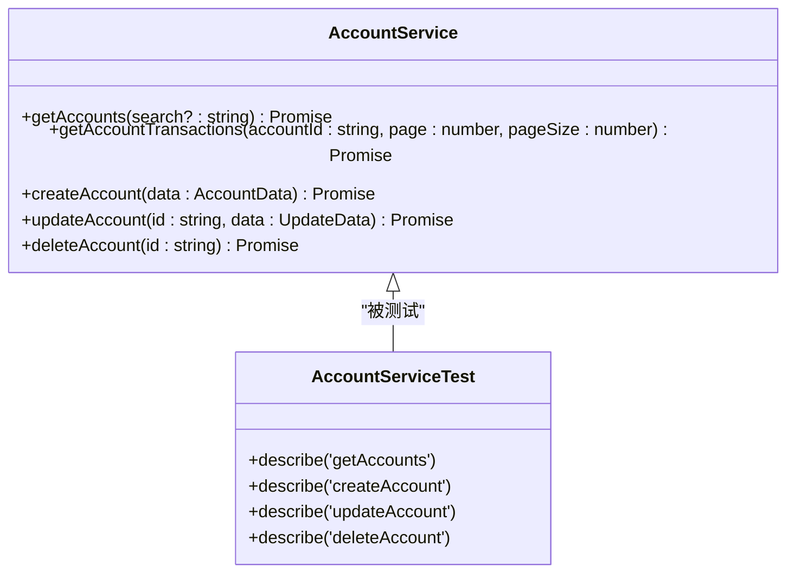

**Diagram sources**
- [AccountService.ts](file://backend/src/services/AccountService.ts#L12-L168)
- [AccountService.test.ts](file://backend/test/services/AccountService.test.ts#L12-L282)

**Section sources**
- [AccountService.ts](file://backend/src/services/AccountService.ts#L1-L168)
- [AccountService.test.ts](file://backend/test/services/AccountService.test.ts#L1-L282)

### AuthService 测试

`AuthService`测试涵盖了用户认证的各个方面，包括登录、登出、密码重置和账户激活等功能。

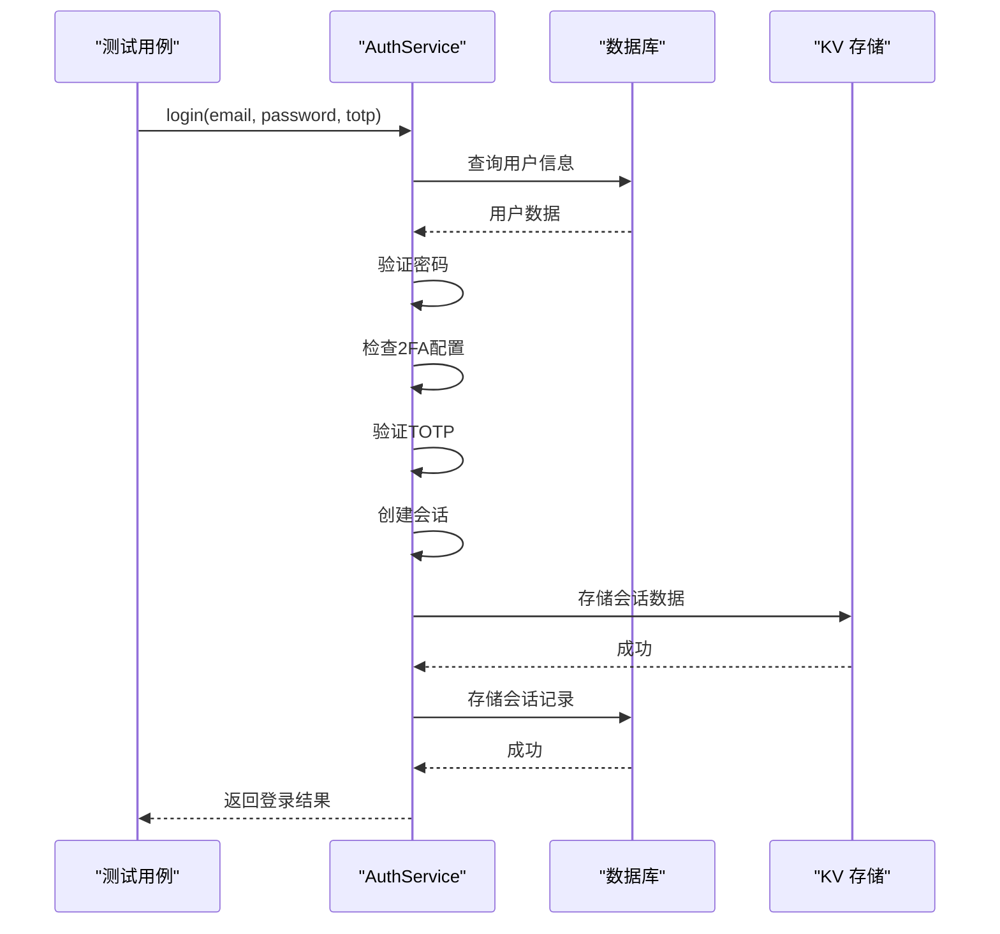

**Diagram sources**
- [AuthService.ts](file://backend/src/services/AuthService.ts#L18-L495)
- [AuthService.test.ts](file://backend/test/services/AuthService.test.ts#L22-L282)

**Section sources**
- [AuthService.ts](file://backend/src/services/AuthService.ts#L1-L495)
- [AuthService.test.ts](file://backend/test/services/AuthService.test.ts#L1-L282)

## 路由测试

路由测试验证API端点的正确性，包括请求验证、权限控制和响应格式。

### 认证路由测试

`auth.test.ts`文件中的测试用例验证了认证相关API端点的功能。

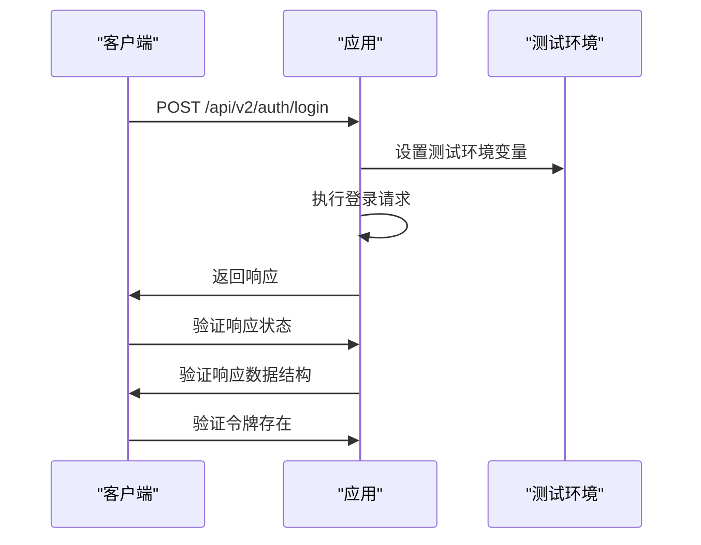

**Diagram sources**
- [auth.test.ts](file://backend/test/routes/v2/auth.test.ts#L12-L189)

**Section sources**
- [auth.test.ts](file://backend/test/routes/v2/auth.test.ts#L1-L189)

## 工具函数测试

工具函数测试确保核心工具函数的正确性和可靠性。

### 日志工具测试

`logger.test.ts`验证了日志工具的敏感信息屏蔽功能。

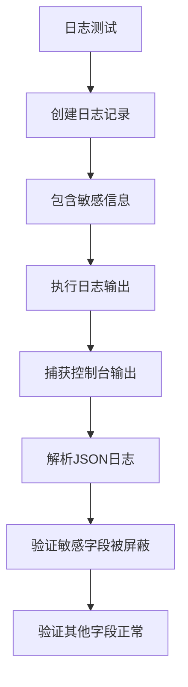

**Diagram sources**
- [logger.ts](file://backend/src/utils/logger.ts#L15-L111)
- [logger.test.ts](file://backend/test/utils/logger.test.ts#L1-L29)

**Section sources**
- [logger.ts](file://backend/src/utils/logger.ts#L1-L111)
- [logger.test.ts](file://backend/test/utils/logger.test.ts#L1-L29)

### 金额验证工具测试

`amount-validator.test.ts`验证了金额验证工具的各种边界条件。

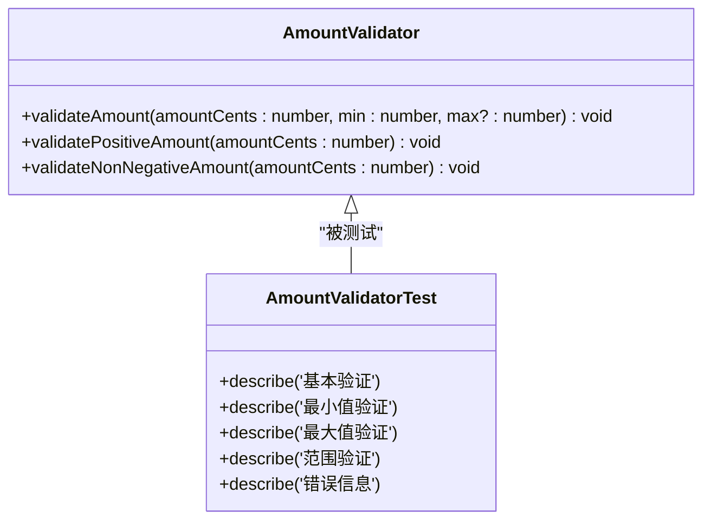

**Diagram sources**
- [amount-validator.ts](file://backend/src/utils/amount-validator.ts#L11-L39)
- [amount-validator.test.ts](file://backend/test/utils/amount-validator.test.ts#L5-L88)

**Section sources**
- [amount-validator.ts](file://backend/src/utils/amount-validator.ts#L1-L39)
- [amount-validator.test.ts](file://backend/test/utils/amount-validator.test.ts#L1-L88)

## 依赖注入与Mock

依赖注入和Mock是测试中的关键技术，确保测试的隔离性和可预测性。

### 依赖注入测试

`di.ts`文件中的依赖注入中间件在测试中需要被正确模拟。

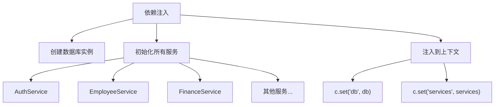

**Diagram sources**
- [di.ts](file://backend/src/middleware/di.ts#L41-L156)

**Section sources**
- [di.ts](file://backend/src/middleware/di.ts#L1-L156)

### Mock 实现

测试中使用Vitest的`vi.mock`功能来模拟外部依赖。

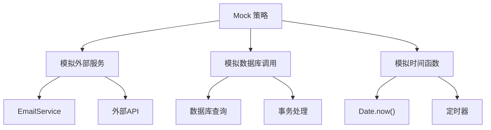

**Section sources**
- [AuthService.test.ts](file://backend/test/services/AuthService.test.ts#L14-L20)

## 数据库测试策略

数据库测试策略确保数据操作的正确性和一致性。

### 测试数据管理

测试数据通过`beforeAll`和`beforeEach`钩子进行管理。

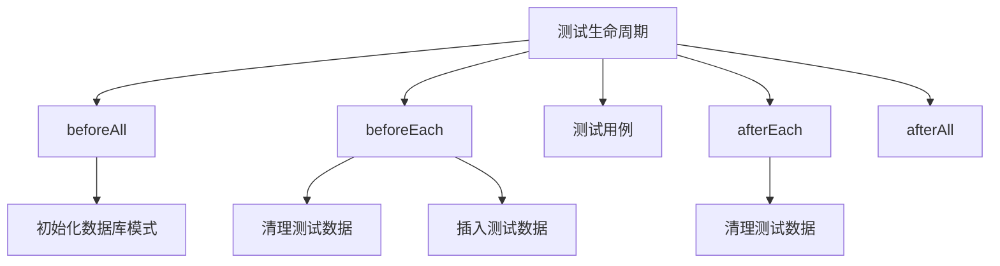

**Section sources**
- [AccountService.test.ts](file://backend/test/services/AccountService.test.ts#L16-L24)
- [AuthService.test.ts](file://backend/test/services/AuthService.test.ts#L26-L31)

## 覆盖率与质量保证

测试覆盖率是代码质量的重要指标，通过Vitest的覆盖率功能进行监控。

### 覆盖率配置

覆盖率配置在`vitest.config.ts`中定义。

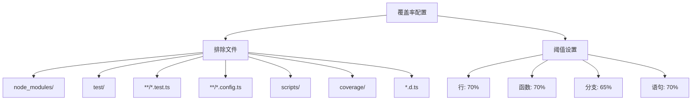

**Diagram sources**
- [vitest.config.ts](file://backend/vitest.config.ts#L22-L39)

**Section sources**
- [vitest.config.ts](file://backend/vitest.config.ts#L1-L48)

## 常见问题解决方案

### 异步处理

异步测试需要正确处理Promise和异步操作。

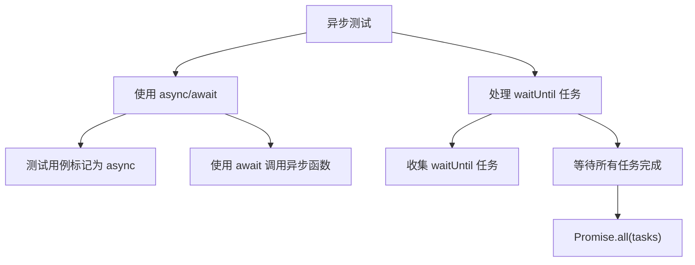

**Section sources**
- [auth.test.ts](file://backend/test/routes/v2/auth.test.ts#L60-L67)

### 事务隔离

数据库事务的隔离通过测试钩子确保。

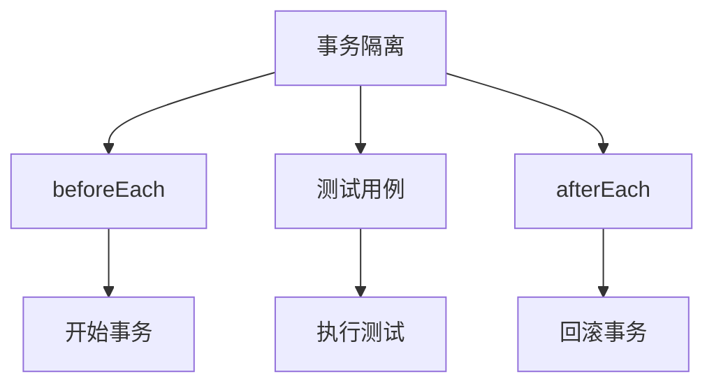

**Section sources**
- [AccountService.test.ts](file://backend/test/services/AccountService.test.ts#L26-L32)