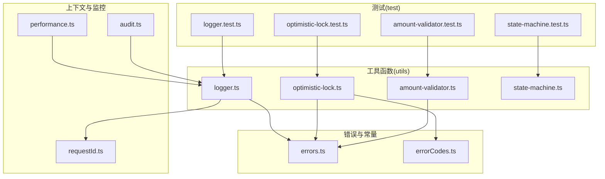
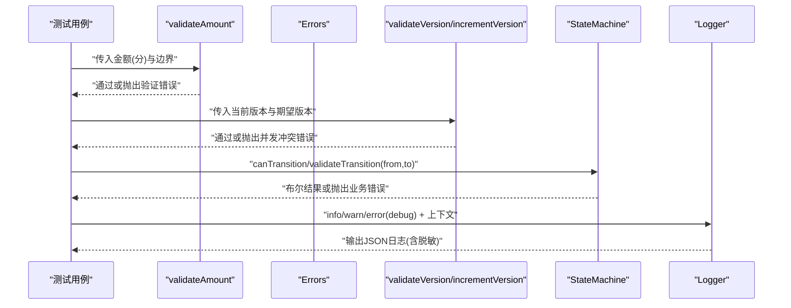
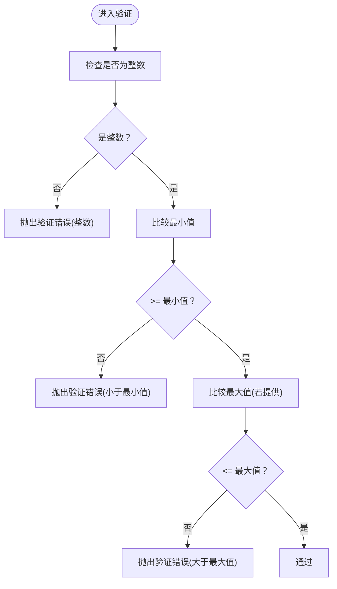
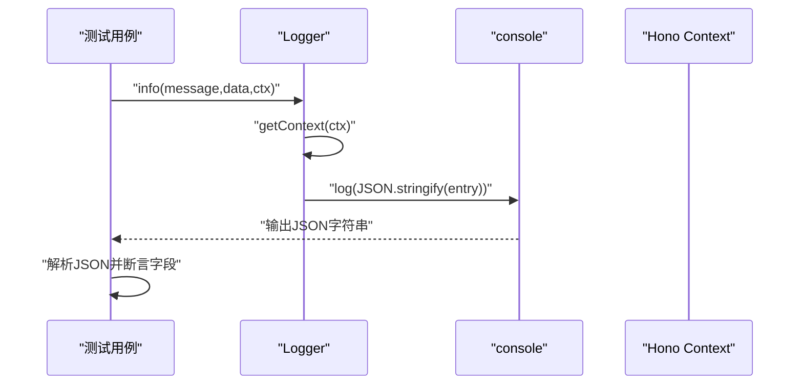
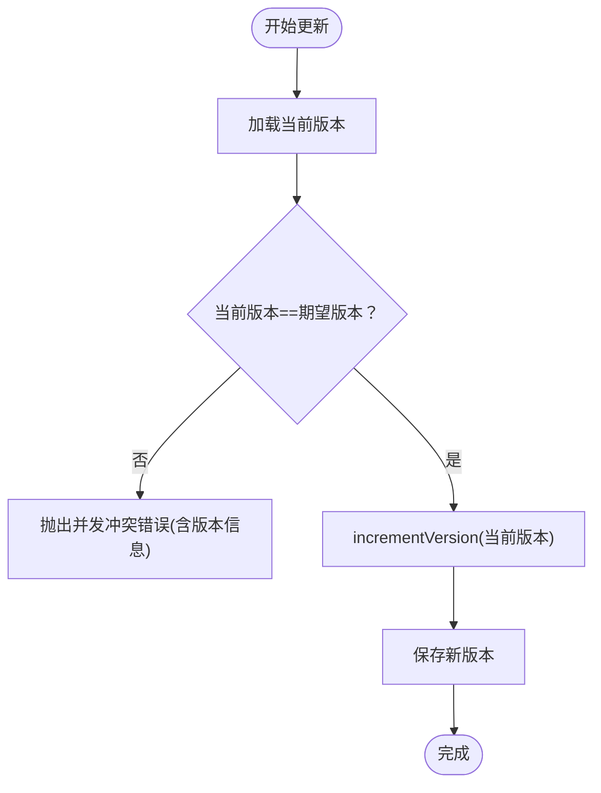
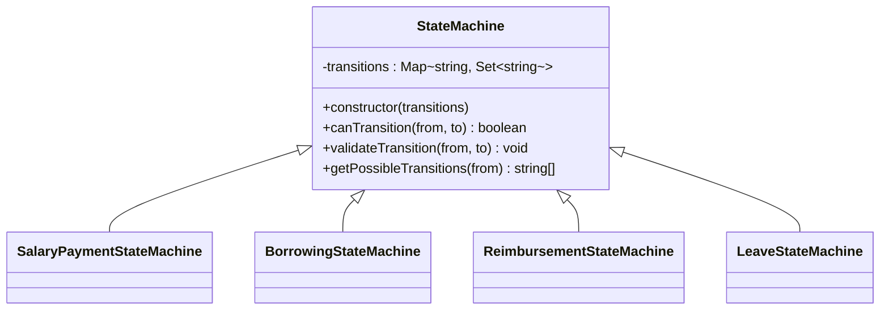
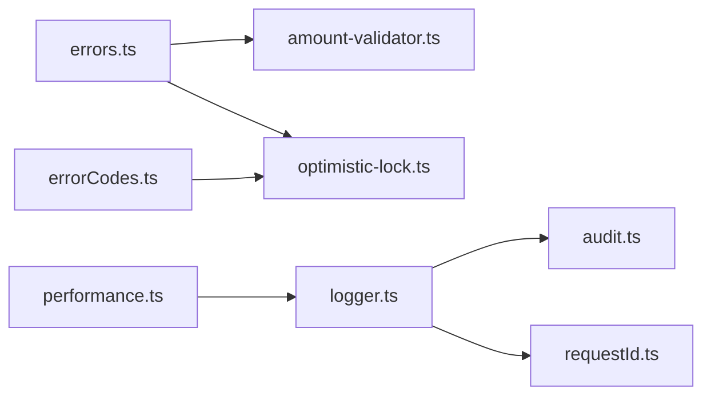

# 工具函数测试

<cite>
**本文引用的文件**
- [amount-validator.ts](file://backend/src/utils/amount-validator.ts)
- [amount-validator.test.ts](file://backend/test/utils/amount-validator.test.ts)
- [logger.ts](file://backend/src/utils/logger.ts)
- [logger.test.ts](file://backend/test/utils/logger.test.ts)
- [optimistic-lock.ts](file://backend/src/utils/optimistic-lock.ts)
- [optimistic-lock.test.ts](file://backend/test/utils/optimistic-lock.test.ts)
- [state-machine.ts](file://backend/src/utils/state-machine.ts)
- [state-machine.test.ts](file://backend/test/utils/state-machine.test.ts)
- [errors.ts](file://backend/src/utils/errors.ts)
- [errorCodes.ts](file://backend/src/constants/errorCodes.ts)
- [requestId.ts](file://backend/src/middleware/requestId.ts)
- [audit.ts](file://backend/src/utils/audit.ts)
- [performance.ts](file://backend/src/middleware/performance.ts)
</cite>

## 目录
1. [引言](#引言)
2. [项目结构](#项目结构)
3. [核心组件](#核心组件)
4. [架构总览](#架构总览)
5. [详细组件分析](#详细组件分析)
6. [依赖关系分析](#依赖关系分析)
7. [性能考量](#性能考量)
8. [故障排查指南](#故障排查指南)
9. [结论](#结论)
10. [附录](#附录)

## 引言
本文件围绕后端工具函数的测试方法论展开，重点覆盖以下方面：
- 金额验证器的边界测试、异常处理与错误信息校验
- 日志器的敏感信息脱敏、日志级别与上下文注入的验证策略
- 乐观锁的并发更新测试，包括版本号校验、冲突检测与重试逻辑
- 状态机的转换规则、非法状态迁移与事件驱动行为的测试策略
- 纯函数测试模式与高覆盖率达成技巧
- 性能敏感型工具（金额计算）的基准测试建议

## 项目结构
本仓库采用“按层+按功能”的组织方式，工具函数位于 backend/src/utils，对应的单元测试位于 backend/test/utils。日志器与错误处理贯穿中间件与服务层，乐观锁与状态机分别用于并发控制与业务状态演进。

图表来源
- [amount-validator.ts](file://backend/src/utils/amount-validator.ts#L1-L39)
- [amount-validator.test.ts](file://backend/test/utils/amount-validator.test.ts#L1-L88)
- [logger.ts](file://backend/src/utils/logger.ts#L1-L111)
- [logger.test.ts](file://backend/test/utils/logger.test.ts#L1-L29)
- [optimistic-lock.ts](file://backend/src/utils/optimistic-lock.ts#L1-L41)
- [optimistic-lock.test.ts](file://backend/test/utils/optimistic-lock.test.ts#L1-L47)
- [state-machine.ts](file://backend/src/utils/state-machine.ts#L1-L89)
- [state-machine.test.ts](file://backend/test/utils/state-machine.test.ts#L1-L140)
- [errors.ts](file://backend/src/utils/errors.ts#L1-L228)
- [errorCodes.ts](file://backend/src/constants/errorCodes.ts#L1-L32)
- [requestId.ts](file://backend/src/middleware/requestId.ts#L1-L19)
- [audit.ts](file://backend/src/utils/audit.ts#L43-L89)
- [performance.ts](file://backend/src/middleware/performance.ts#L47-L130)

章节来源
- [amount-validator.ts](file://backend/src/utils/amount-validator.ts#L1-L39)
- [logger.ts](file://backend/src/utils/logger.ts#L1-L111)
- [optimistic-lock.ts](file://backend/src/utils/optimistic-lock.ts#L1-L41)
- [state-machine.ts](file://backend/src/utils/state-machine.ts#L1-L89)

## 核心组件
- 金额验证器：提供整数、最小值、最大值与正数/非负数等验证能力，统一抛出业务错误。
- 日志器：提供敏感信息脱敏、上下文注入（请求ID、用户ID、IP）、多级别输出与JSON格式化。
- 乐观锁：基于版本号的并发冲突检测与版本递增工具，配合错误码返回冲突详情。
- 状态机：通用状态转换验证与错误抛出，内置薪资支付、借款、报销、请假等业务状态机实例。

章节来源
- [amount-validator.ts](file://backend/src/utils/amount-validator.ts#L1-L39)
- [logger.ts](file://backend/src/utils/logger.ts#L1-L111)
- [optimistic-lock.ts](file://backend/src/utils/optimistic-lock.ts#L1-L41)
- [state-machine.ts](file://backend/src/utils/state-machine.ts#L1-L89)

## 架构总览
工具函数在测试中的角色定位：
- 金额验证器与乐观锁作为纯函数，输入确定、输出确定，适合参数化与边界值测试。
- 日志器作为侧效函数，通过spy捕获console输出并解析JSON进行断言，同时验证上下文注入。
- 状态机作为纯函数+错误抛出，通过canTransition与validateTransition验证状态规则。

图表来源
- [amount-validator.test.ts](file://backend/test/utils/amount-validator.test.ts#L1-L88)
- [optimistic-lock.test.ts](file://backend/test/utils/optimistic-lock.test.ts#L1-L47)
- [state-machine.test.ts](file://backend/test/utils/state-machine.test.ts#L1-L140)
- [logger.test.ts](file://backend/test/utils/logger.test.ts#L1-L29)

## 详细组件分析

### 金额验证器测试方法论
- 纯函数测试模式
  - 输入为金额（分）、最小值、最大值；输出为无副作用的抛错或通过。
  - 通过参数化与组合场景覆盖：整数/非整数、负数、越界、边界相等、空最大值等。
- 边界测试
  - 最小值边界：等于最小值应通过；小于最小值应失败。
  - 最大值边界：等于最大值应通过；大于最大值应失败。
  - 正数/非负数快捷函数分别复用上述逻辑。
- 异常处理与错误信息
  - 统一抛出业务错误，便于上层中间件识别与记录。
  - 测试中验证错误消息包含关键提示词，确保可读性与可诊断性。
- 精度校验
  - 金额以“分”为单位，避免浮点误差；非整数直接拒绝，保证精度一致性。

图表来源
- [amount-validator.ts](file://backend/src/utils/amount-validator.ts#L11-L23)
- [amount-validator.test.ts](file://backend/test/utils/amount-validator.test.ts#L1-L88)

章节来源
- [amount-validator.ts](file://backend/src/utils/amount-validator.ts#L1-L39)
- [amount-validator.test.ts](file://backend/test/utils/amount-validator.test.ts#L1-L88)
- [errors.ts](file://backend/src/utils/errors.ts#L45-L50)
- [errorCodes.ts](file://backend/src/constants/errorCodes.ts#L13-L17)

### 日志器测试方法论
- 敏感信息脱敏
  - 对包含敏感键的数据进行递归脱敏，统一替换为固定掩码，避免泄露。
- 日志级别与格式化输出
  - 提供INFO/WARN/ERROR/DEBUG四个级别，分别映射到不同console接口；统一输出JSON字符串，包含时间戳、级别、请求ID、用户ID、IP、消息与脱敏后的数据。
- 上下文信息正确性
  - 通过中间件注入请求ID，日志器从上下文中读取并写入；测试中模拟Hono上下文，验证请求ID、用户ID、IP等字段被正确提取。
- 测试策略
  - 使用spy捕获console输出，解析JSON并断言关键字段；验证敏感键被脱敏、非敏感键保留原值。

图表来源
- [logger.ts](file://backend/src/utils/logger.ts#L54-L110)
- [logger.test.ts](file://backend/test/utils/logger.test.ts#L1-L29)
- [requestId.ts](file://backend/src/middleware/requestId.ts#L1-L19)

章节来源
- [logger.ts](file://backend/src/utils/logger.ts#L1-L111)
- [logger.test.ts](file://backend/test/utils/logger.test.ts#L1-L29)
- [requestId.ts](file://backend/src/middleware/requestId.ts#L1-L19)
- [audit.ts](file://backend/src/utils/audit.ts#L43-L89)

### 乐观锁测试方法论
- 并发更新测试
  - 核心逻辑：validateVersion比较当前版本与期望版本，不一致则抛出并发冲突错误；incrementVersion对版本号进行安全递增。
- 版本号校验
  - 匹配通过：当前版本=期望版本。
  - 不匹配拒绝：抛出业务错误并携带错误码与版本信息，便于前端提示与重试。
- 冲突检测与重试逻辑
  - 冲突检测：在提交更新前调用validateVersion，失败即捕获错误并提示刷新重试。
  - 重试建议：前端收到冲突错误后拉取最新数据与版本号，重新计算并提交。
- 向后兼容
  - 允许空版本号，避免历史数据迁移期间的兼容问题。

图表来源
- [optimistic-lock.ts](file://backend/src/utils/optimistic-lock.ts#L16-L40)
- [optimistic-lock.test.ts](file://backend/test/utils/optimistic-lock.test.ts#L1-L47)
- [errorCodes.ts](file://backend/src/constants/errorCodes.ts#L23-L25)

章节来源
- [optimistic-lock.ts](file://backend/src/utils/optimistic-lock.ts#L1-L41)
- [optimistic-lock.test.ts](file://backend/test/utils/optimistic-lock.test.ts#L1-L47)
- [errors.ts](file://backend/src/utils/errors.ts#L49-L50)
- [errorCodes.ts](file://backend/src/constants/errorCodes.ts#L23-L25)

### 状态机测试方法论
- 状态转换规则
  - 通用状态机：通过构造函数接收映射表，提供canTransition与validateTransition两个接口；validateTransition不合法时抛出业务错误。
  - 业务状态机：内置薪资支付、借款、报销、请假四类状态机，覆盖典型业务流转。
- 非法状态迁移
  - 通过canTransition断言不允许的转换；通过validateTransition断言抛错，确保业务规则强制执行。
- 事件驱动行为
  - 将状态转换封装为受控事件，前端仅触发事件，后端通过状态机校验并执行后续动作。
- 测试策略
  - 分组覆盖：基础功能（允许/拒绝转换）、各业务状态机的允许与拒绝路径、终态不可逆性。

图表来源
- [state-machine.ts](file://backend/src/utils/state-machine.ts#L1-L89)
- [state-machine.test.ts](file://backend/test/utils/state-machine.test.ts#L1-L140)

章节来源
- [state-machine.ts](file://backend/src/utils/state-machine.ts#L1-L89)
- [state-machine.test.ts](file://backend/test/utils/state-machine.test.ts#L1-L140)
- [errors.ts](file://backend/src/utils/errors.ts#L49-L50)

## 依赖关系分析
- 错误体系
  - 金额验证器与乐观锁均使用统一错误工厂创建业务错误，便于上层中间件识别与记录。
  - 错误码枚举定义了并发修改等关键业务错误码，便于前端与监控系统识别。
- 上下文与监控
  - 日志器依赖请求ID中间件注入的上下文；审计模块在记录审计日志时也会使用日志器并捕获异常，避免阻断主流程。
  - 性能中间件记录HTTP请求耗时与慢请求指标，为工具函数的性能回归提供参考。

图表来源
- [errors.ts](file://backend/src/utils/errors.ts#L45-L50)
- [errorCodes.ts](file://backend/src/constants/errorCodes.ts#L23-L25)
- [logger.ts](file://backend/src/utils/logger.ts#L54-L110)
- [audit.ts](file://backend/src/utils/audit.ts#L43-L89)
- [requestId.ts](file://backend/src/middleware/requestId.ts#L1-L19)
- [performance.ts](file://backend/src/middleware/performance.ts#L47-L130)

章节来源
- [errors.ts](file://backend/src/utils/errors.ts#L1-L228)
- [errorCodes.ts](file://backend/src/constants/errorCodes.ts#L1-L32)
- [logger.ts](file://backend/src/utils/logger.ts#L1-L111)
- [audit.ts](file://backend/src/utils/audit.ts#L43-L89)
- [requestId.ts](file://backend/src/middleware/requestId.ts#L1-L19)
- [performance.ts](file://backend/src/middleware/performance.ts#L47-L130)

## 性能考量
- 金额计算与精度
  - 金额以“分”为单位，避免浮点运算误差；测试中应覆盖边界值与极端值，确保在高并发下仍保持稳定。
- 日志输出
  - 日志器输出为单行JSON，便于外部日志系统解析；在高频日志场景下，建议结合采样与异步落盘策略。
- 并发控制
  - 乐观锁通过版本号避免ABA问题；在高冲突场景下，建议引入指数退避与最大重试次数，减少抖动。
- 监控与指标
  - 使用性能中间件记录慢请求与慢查询，结合错误统计与指标聚合，持续优化工具函数的性能瓶颈。

[本节为通用指导，无需列出具体文件来源]

## 故障排查指南
- 金额验证失败
  - 检查输入是否为整数（以“分”为单位）；确认最小/最大值设置是否合理；查看错误消息中的提示词定位问题。
- 并发冲突
  - 收到冲突错误时，前端应刷新数据并重新提交；核对版本号是否正确传递。
- 日志缺失或上下文不完整
  - 确认请求ID中间件已在路由中启用；检查上下文是否正确注入；验证敏感信息是否被正确脱敏。
- 状态机转换异常
  - 使用canTransition先自检，再用validateTransition触发错误；核对业务状态机映射表是否符合预期。

章节来源
- [amount-validator.test.ts](file://backend/test/utils/amount-validator.test.ts#L1-L88)
- [optimistic-lock.test.ts](file://backend/test/utils/optimistic-lock.test.ts#L1-L47)
- [logger.test.ts](file://backend/test/utils/logger.test.ts#L1-L29)
- [state-machine.test.ts](file://backend/test/utils/state-machine.test.ts#L1-L140)

## 结论
通过对金额验证器、日志器、乐观锁与状态机的测试实践总结，可以形成一套可复用的工具函数测试方法论：
- 纯函数优先：以参数化与边界值为核心，覆盖所有分支与异常路径。
- 侧效函数隔离：通过spy与解析JSON的方式验证输出，确保上下文与脱敏逻辑正确。
- 并发与状态约束：以版本号与状态映射表为契约，严格校验冲突与非法迁移。
- 可观测性与可维护性：统一错误码与日志格式，结合监控指标持续改进。

[本节为总结性内容，无需列出具体文件来源]

## 附录
- 高覆盖率达成技巧
  - 分组测试：将相似场景归类，减少重复代码；使用describe嵌套组织用例。
  - 参数化：对边界值与异常输入进行批量断言，提升覆盖面。
  - 反向验证：对不允许的输入进行显式断言，确保规则完备。
- 基准测试建议（性能敏感型工具）
  - 使用性能中间件记录平均耗时与分位指标；对金额计算密集场景进行压力测试，观察慢请求比例与错误率。
  - 对日志器进行吞吐测试，评估在高QPS下的输出延迟与磁盘I/O影响。
  - 对乐观锁重试场景进行模拟，评估冲突率与重试次数对整体性能的影响。

[本节为通用指导，无需列出具体文件来源]