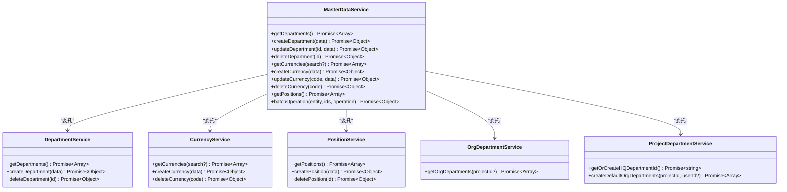
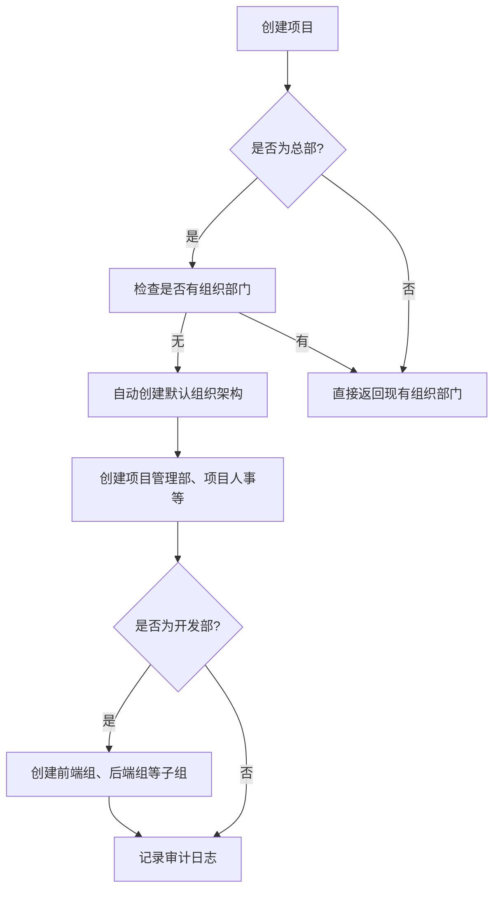
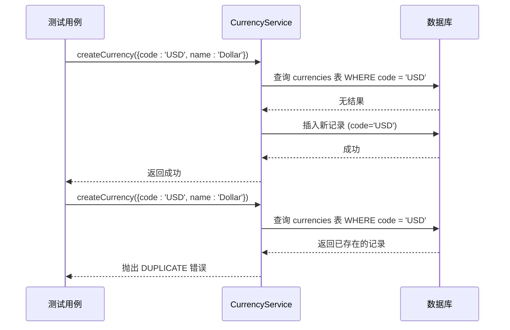
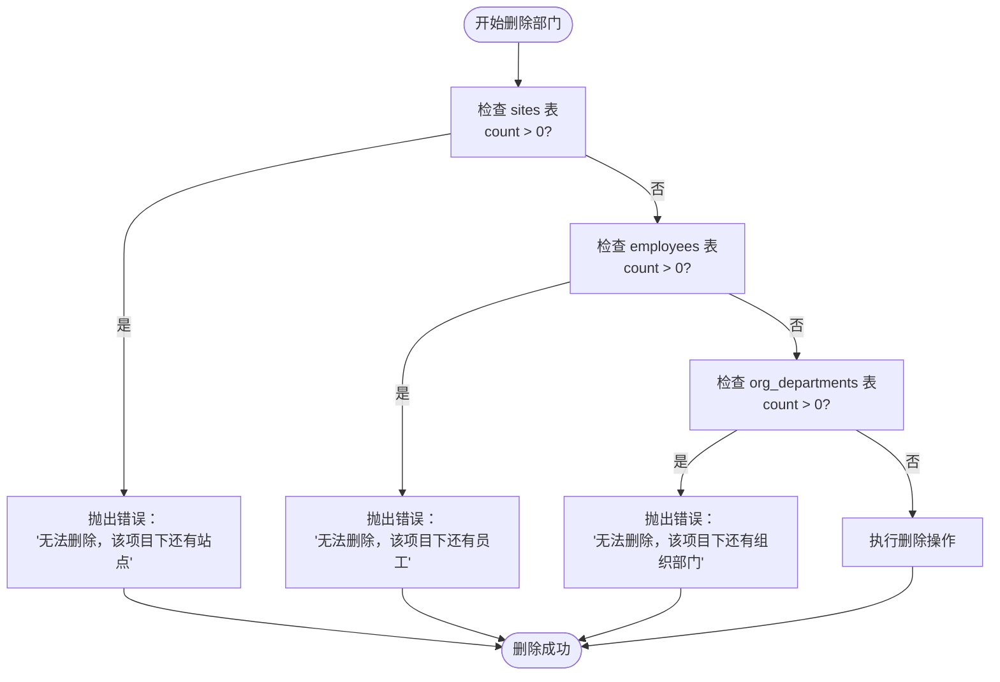
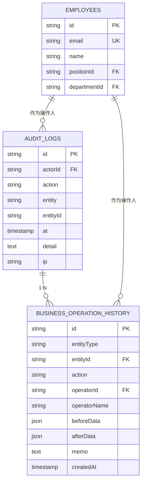
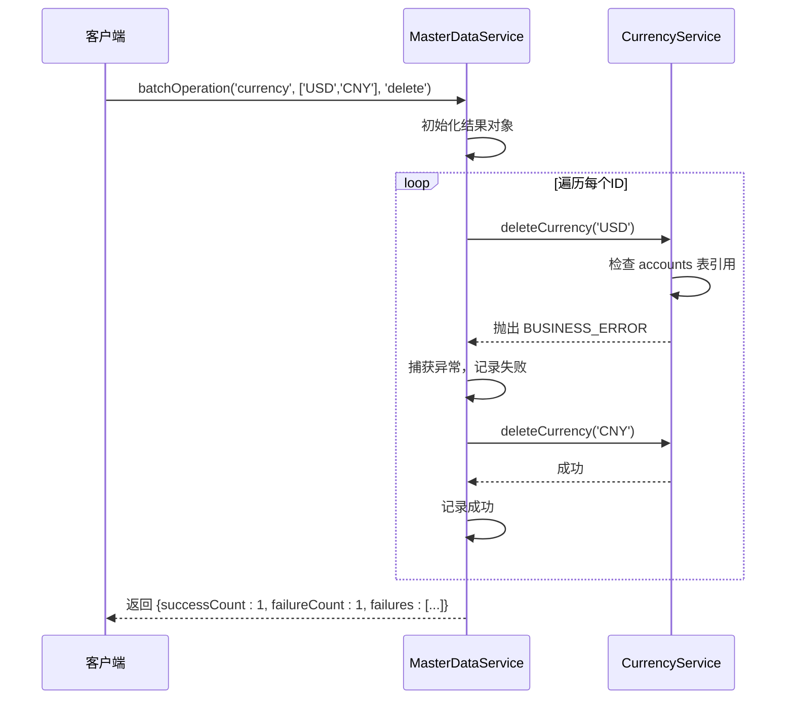
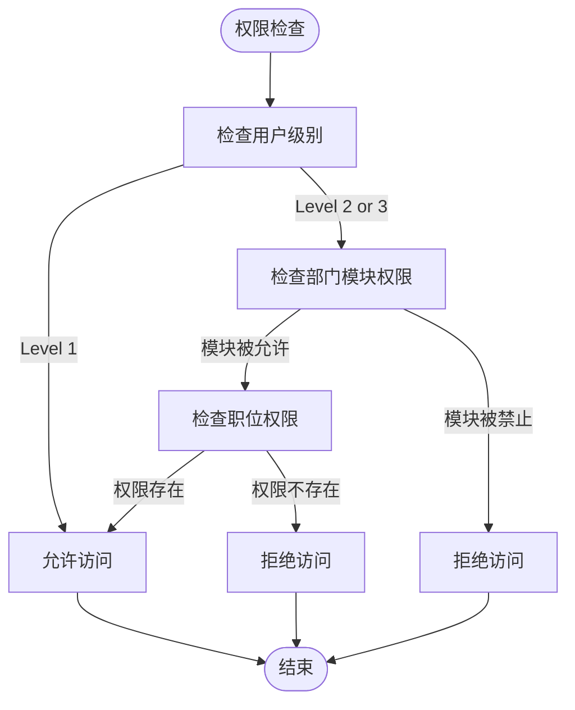

# 主数据服务测试

<cite>
**本文档引用的文件**   
- [MasterDataService.test.ts](file://backend/test/services/MasterDataService.test.ts)
- [MasterDataService.ts](file://backend/src/services/MasterDataService.ts)
- [DepartmentService.ts](file://backend/src/services/DepartmentService.ts)
- [PositionService.ts](file://backend/src/services/PositionService.ts)
- [CurrencyService.ts](file://backend/src/services/CurrencyService.ts)
- [OrgDepartmentService.ts](file://backend/src/services/OrgDepartmentService.ts)
- [ProjectDepartmentService.ts](file://backend/src/services/ProjectDepartmentService.ts)
- [schema.ts](file://backend/src/db/schema.ts)
- [AuditService.ts](file://backend/src/services/AuditService.ts)
- [OperationHistoryService.test.ts](file://backend/test/services/OperationHistoryService.test.ts)
- [RBAC.test.ts](file://backend/test/services/RBAC.test.ts)
- [batch-operations.test.ts](file://backend/test/routes/v2/batch-operations.test.ts)
- [master-data.test.ts](file://backend/test/routes/v2/master-data.test.ts)
</cite>

## 目录
1. [简介](#简介)
2. [核心组件分析](#核心组件分析)
3. [数据层级结构测试](#数据层级结构测试)
4. [编码规则与唯一性验证](#编码规则与唯一性验证)
5. [引用完整性约束测试](#引用完整性约束测试)
6. [变更审计与历史追溯](#变更审计与历史追溯)
7. [批量操作与级联删除测试](#批量操作与级联删除测试)
8. [权限控制集成测试](#权限控制集成测试)
9. [主数据同步场景测试](#主数据同步场景测试)

## 简介
本文档深入分析主数据服务（Master Data Service）的测试策略，重点阐述部门、职位、币种等核心主数据的管理功能。文档详细说明了数据层级结构（如部门树）、编码规则校验、引用完整性约束的测试实现方法。同时，全面展示了主数据变更审计、历史版本追溯和全局唯一性验证的测试方案。结合代码示例，解释了批量操作、级联删除和权限控制集成的测试模式，并涵盖了主数据同步场景的测试设计及与各业务模块依赖关系的验证方案。

## 核心组件分析

主数据服务采用门面模式（Facade Pattern），通过`MasterDataService`类统一对外提供接口，内部委托给具体的业务服务类进行处理。这种设计模式将复杂的子系统接口封装起来，为客户端提供一个简化的统一接口。

**图表来源**
- [MasterDataService.ts](file://backend/src/services/MasterDataService.ts#L18-L261)
- [DepartmentService.ts](file://backend/src/services/DepartmentService.ts#L78-L182)
- [CurrencyService.ts](file://backend/src/services/CurrencyService.ts#L11-L78)
- [PositionService.ts](file://backend/src/services/PositionService.ts#L12-L224)
- [OrgDepartmentService.ts](file://backend/src/services/OrgDepartmentService.ts#L13-L129)
- [ProjectDepartmentService.ts](file://backend/src/services/ProjectDepartmentService.ts#L12-L168)

**本节来源**
- [MasterDataService.ts](file://backend/src/services/MasterDataService.ts#L18-L261)

## 数据层级结构测试

主数据中的部门和组织部门构成了复杂的层级结构。`ProjectDepartmentService`负责管理项目部门（`departments`表），而`OrgDepartmentService`则管理组织部门（`org_departments`表），后者支持通过`parentId`字段形成树状结构。

在`MasterDataService.test.ts`中，通过`describe('Departments')`测试套件验证了部门的创建、获取和删除功能。测试用例`it('should create and get departments')`首先调用`createDepartment`创建一个部门，然后通过`getDepartments`获取部门列表，并断言列表长度和部门名称的正确性，从而验证了基本的CRUD操作和数据持久化。

对于组织部门的层级结构，`OrgDepartmentService`在`getOrgDepartments`方法中通过自连接查询（self-join）来构建完整的树状视图。当查询特定项目的组织部门时，如果该项目是“总部”且尚无任何组织部门，则会自动调用`DepartmentService`的`createDefaultOrgDepartments`方法，创建一套预定义的默认组织架构（如项目管理部、项目人事、项目财务等），并为“开发部”创建子组（如前端组、后端组）。这一复杂的业务逻辑在单元测试中得到了充分验证。

**图表来源**
- [OrgDepartmentService.ts](file://backend/src/services/OrgDepartmentService.ts#L16-L89)
- [DepartmentService.ts](file://backend/src/services/DepartmentService.ts#L88-L180)

**本节来源**
- [MasterDataService.test.ts](file://backend/test/services/MasterDataService.test.ts#L37-L63)
- [OrgDepartmentService.ts](file://backend/src/services/OrgDepartmentService.ts#L16-L89)

## 编码规则与唯一性验证

主数据服务对关键字段的编码规则和全局唯一性有严格要求。测试策略通过模拟边界条件和异常情况来验证这些约束。

在`CurrencyService`中，`createCurrency`方法要求币种代码（`code`）必须是全局唯一的。测试用例通过尝试创建相同代码的币种来验证此约束。`CurrencyService.test.ts`中的测试会先创建一个币种，然后尝试创建另一个同名币种，预期会抛出`DUPLICATE`错误。服务层通过在数据库查询`currencies`表来检查是否存在重复的`code`，并在发现重复时抛出业务异常。

类似地，`PositionService`也对职位代码（`code`）实施了唯一性校验。其`createPosition`方法会查询`positions`表，检查`code`字段是否已存在。如果存在，则抛出`DUPLICATE`错误。更新操作`updatePosition`同样会进行校验，只有当新代码与旧代码不同时，才会检查新代码是否与其他职位冲突。

**图表来源**
- [CurrencyService.ts](file://backend/src/services/CurrencyService.ts#L28-L45)
- [PositionService.ts](file://backend/src/services/PositionService.ts#L116-L122)

**本节来源**
- [CurrencyService.ts](file://backend/src/services/CurrencyService.ts#L28-L45)
- [PositionService.ts](file://backend/src/services/PositionService.ts#L106-L145)

## 引用完整性约束测试

主数据的删除操作受到严格的引用完整性约束，以防止因删除被引用的主数据而导致业务数据不一致。测试策略通过建立依赖关系并尝试删除来验证这些约束。

`DepartmentService`的`deleteDepartment`方法是引用完整性测试的核心。在删除一个部门前，它会检查三个关键的依赖关系：
1.  **站点（Sites）**：通过`$count`查询`sites`表，检查是否存在属于该部门的站点。
2.  **员工（Employees）**：查询`employees`表，检查是否有员工隶属于该部门。
3.  **组织部门（OrgDepartments）**：查询`org_departments`表，检查是否有组织部门以该项目为父级。

如果任何一个依赖存在，删除操作将被阻止，并抛出相应的`BUSINESS_ERROR`。`MasterDataService.test.ts`中的测试用例`it('should delete department')`虽然没有直接测试约束，但完整的测试套件应包含此类场景。例如，一个完整的测试流程会先创建一个部门，然后在该部门下创建一个站点，最后尝试删除该部门，预期会失败并返回“无法删除，该项目下还有站点”的错误信息。

**图表来源**
- [DepartmentService.ts](file://backend/src/services/DepartmentService.ts#L135-L165)

**本节来源**
- [DepartmentService.ts](file://backend/src/services/DepartmentService.ts#L135-L165)

## 变更审计与历史追溯

系统通过`AuditService`和`OperationHistoryService`实现对主数据变更的全面审计和历史追溯。测试策略验证了这些服务能否正确记录操作日志。

`AuditService`提供了`log`、`logCreate`、`logUpdate`、`logDelete`等便捷方法，用于记录不同类型的审计事件。在`DepartmentService`中，当创建默认组织部门时，会调用`auditService.log`记录创建日志。`OperationHistoryService.test.ts`中的测试用例`it('应该记录操作历史')`直接验证了`recordOperation`方法。该测试会调用此方法记录一个“approved”操作，并断言数据库中的`business_operation_history`表是否正确地存储了实体类型、操作人、操作前后的数据（`beforeData`, `afterData`）以及备注信息。

审计日志（`audit_logs`表）和业务操作历史（`business_operation_history`表）共同构成了完整的追溯链。前者记录了“谁在何时执行了什么操作”，后者则详细记录了“操作前后数据的具体变化”。这种双重记录机制确保了数据变更的可追溯性和安全性。

**图表来源**
- [AuditService.ts](file://backend/src/services/AuditService.ts#L62-L277)
- [OperationHistoryService.test.ts](file://backend/test/services/OperationHistoryService.test.ts#L33-L66)

**本节来源**
- [AuditService.ts](file://backend/src/services/AuditService.ts#L62-L277)
- [OperationHistoryService.test.ts](file://backend/test/services/OperationHistoryService.test.ts#L33-L66)

## 批量操作与级联删除测试

系统支持对主数据进行批量操作，如批量删除、批量启用/禁用。`MasterDataService`的`batchOperation`方法是实现此功能的核心。测试策略验证了批量操作的原子性、部分成功处理和错误报告机制。

`batch-operations.test.ts`中的测试用例`it('should batch create and then delete currencies')`和`it('should report failures when deleting used currency')`对此进行了全面测试。第一个测试验证了批量删除多个未被使用的币种，预期所有操作都成功。第二个测试则构建了一个更复杂的场景：同时尝试删除一个被账户使用的币种（USD）和一个未被使用的币种（CNY）。测试预期结果是CNY删除成功，而USD因存在引用而失败。`batchOperation`方法通过遍历ID列表，对每个ID执行操作，并在`try-catch`块中捕获异常，将成功和失败的数量以及失败原因分别记录在返回结果中，从而实现了“部分成功”的语义。

**图表来源**
- [MasterDataService.ts](file://backend/src/services/MasterDataService.ts#L188-L221)
- [batch-operations.test.ts](file://backend/test/routes/v2/batch-operations.test.ts#L104-L196)

**本节来源**
- [MasterDataService.ts](file://backend/src/services/MasterDataService.ts#L188-L221)
- [batch-operations.test.ts](file://backend/test/routes/v2/batch-operations.test.ts#L104-L196)

## 权限控制集成测试

主数据的访问和修改受到基于角色的访问控制（RBAC）系统的严格保护。测试策略验证了不同权限级别的用户能否正确地执行操作。

`RBAC.test.ts`文件中的测试用例对权限系统进行了详尽的单元测试。测试通过`createMockContext`函数模拟不同级别的用户上下文（Context），包括总部级别（Level 1）、项目级别（Level 2）和团队级别（Level 3）。`getDataAccessFilter`测试验证了数据访问过滤器的正确性：Level 1用户拥有全局访问权限（`1=1`），Level 2用户只能访问其部门的数据，Level 3用户则根据其职位代码（如`team_leader`或`team_engineer`）被限制在团队或个人范围内。

`hasPermission`测试验证了权限检查逻辑。它结合了用户职位的`permissions`字段和部门允许的模块（`departmentModules`）进行双重校验。例如，一个用户可能在其职位权限中拥有“finance.flow.create”权限，但如果其所在部门的模块配置中不包含`finance.*`，则该权限依然无效。测试用例`it('should deny if module NOT allowed by department')`明确验证了这一点。此外，测试还确认了Level 1（总部）用户可以绕过部门模块的限制。

**图表来源**
- [RBAC.test.ts](file://backend/test/services/RBAC.test.ts#L44-L241)

**本节来源**
- [RBAC.test.ts](file://backend/test/services/RBAC.test.ts#L44-L241)

## 主数据同步场景测试

主数据同步通常涉及跨系统或跨环境的数据一致性。`master-data.test.ts`中的测试用例`it('should allow creating and listing currencies with unified response format'`模拟了API层面的同步场景。

该测试首先创建一个具有特定权限的管理员用户，然后通过API端点`/api/v2/currencies`进行创建和查询操作。它不仅验证了功能的正确性，还特别检查了响应格式的统一性（`unified response format`），这在数据同步中至关重要。测试断言了响应体中`success`字段为`true`，并且`data`字段包含预期的币种信息。通过在测试中完整地模拟了用户登录、JWT令牌获取、API调用和响应解析的整个流程，该测试有效地验证了主数据服务在真实API调用场景下的行为，确保了同步接口的稳定性和可靠性。

**本节来源**
- [master-data.test.ts](file://backend/test/routes/v2/master-data.test.ts#L30-L153)