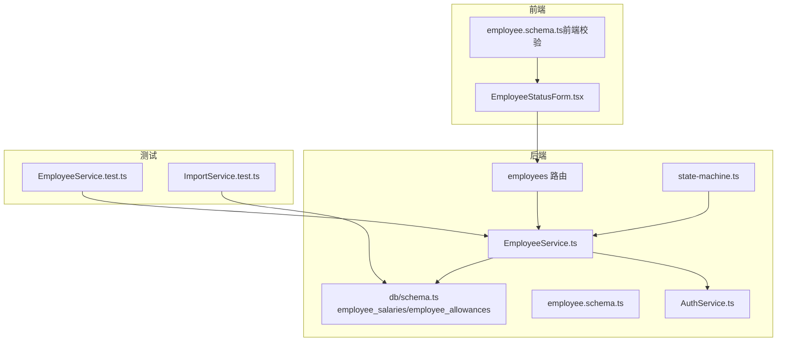
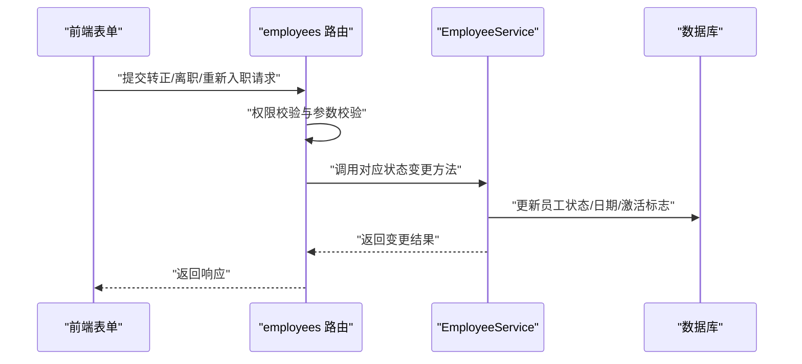
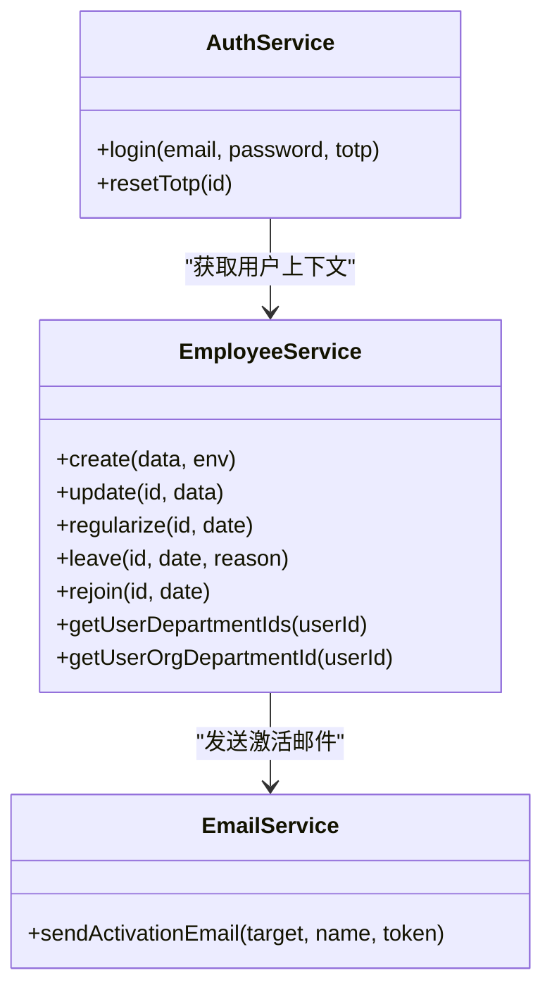

# 员工服务测试

<cite>
**本文引用的文件**
- [EmployeeService.ts](file://backend/src/services/EmployeeService.ts)
- [EmployeeService.test.ts](file://backend/test/services/EmployeeService.test.ts)
- [employees.ts](file://backend/src/routes/v2/employees.ts)
- [employee.schema.ts](file://backend/src/schemas/employee.schema.ts)
- [AuthService.ts](file://backend/src/services/AuthService.ts)
- [errorCodes.ts](file://backend/src/constants/errorCodes.ts)
- [errors.ts](file://backend/src/utils/errors.ts)
- [state-machine.ts](file://backend/src/utils/state-machine.ts)
- [schema.ts](file://backend/src/db/schema.ts)
- [migration_add_salary_tables.sql](file://backend/src/db/migration_add_salary_tables.sql)
- [migration_force_recreate_salary_tables.sql](file://backend/src/db/migration_force_recreate_salary_tables.sql)
- [BusinessReportService.ts](file://backend/src/services/BusinessReportService.ts)
- [EmployeeStatusForm.tsx](file://frontend/src/features/employees/components/forms/EmployeeStatusForm.tsx)
- [employee.schema.ts（前端校验）](file://frontend/src/validations/employee.schema.ts)
- [ImportService.test.ts](file://backend/test/services/ImportService.test.ts)
</cite>

## 目录
1. [引言](#引言)
2. [项目结构](#项目结构)
3. [核心组件](#核心组件)
4. [架构总览](#架构总览)
5. [详细组件分析](#详细组件分析)
6. [依赖分析](#依赖分析)
7. [性能考虑](#性能考虑)
8. [故障排查指南](#故障排查指南)
9. [结论](#结论)
10. [附录](#附录)

## 引言
本文件系统化阐述 EmployeeService 的测试方案，覆盖员工全生命周期管理的关键状态流转（入职、转正、调岗、离职、重新入职），并重点说明如何验证员工与薪资、部门、权限的关联一致性。文档结合代码路径示例，展示复杂业务规则（如薪资类型与状态匹配、部门归属推导）的测试实现；同时提供嵌套服务调用的 Mock 模式、员工敏感信息处理（密码哈希、TOTP）的测试策略，以及批量导入场景的异常处理验证思路。

## 项目结构
- 后端服务层位于 backend/src/services，其中 EmployeeService 负责员工全生命周期管理。
- 测试位于 backend/test/services，EmployeeService.test.ts 提供了创建、更新、查询、列表、迁移等基础用例。
- 前端提供了员工状态变更表单与校验，便于理解业务规则与期望行为。
- 数据模型位于 backend/src/db/schema.ts，薪资与补贴分别由 employee_salaries、employee_allowances 独立维护。

图表来源
- [EmployeeService.ts](file://backend/src/services/EmployeeService.ts#L1-L758)
- [EmployeeService.test.ts](file://backend/test/services/EmployeeService.test.ts#L1-L237)
- [employees.ts](file://backend/src/routes/v2/employees.ts#L1-L200)
- [employee.schema.ts](file://backend/src/schemas/employee.schema.ts#L37-L69)
- [AuthService.ts](file://backend/src/services/AuthService.ts#L1-L120)
- [schema.ts](file://backend/src/db/schema.ts#L220-L239)
- [state-machine.ts](file://backend/src/utils/state-machine.ts#L1-L89)
- [ImportService.test.ts](file://backend/test/services/ImportService.test.ts#L1-L75)
- [EmployeeStatusForm.tsx](file://frontend/src/features/employees/components/forms/EmployeeStatusForm.tsx#L1-L244)
- [employee.schema.ts（前端校验）](file://frontend/src/validations/employee.schema.ts#L27-L49)

章节来源
- [EmployeeService.ts](file://backend/src/services/EmployeeService.ts#L1-L758)
- [EmployeeService.test.ts](file://backend/test/services/EmployeeService.test.ts#L1-L237)

## 核心组件
- EmployeeService：负责员工创建、更新、查询、状态变更（转正、离职、重新入职）、权限与部门关联查询、用户上下文获取等。
- 路由层 employees.ts：对状态变更接口进行权限控制与参数校验。
- 前端 EmployeeStatusForm.tsx：提供转正、离职、重新入职的交互与校验。
- 数据模型 schema.ts：定义 employee_salaries、employee_allowances 等表结构。
- 状态机 state-machine.ts：提供通用状态机工具，用于校验状态转换合法性（虽主要用于薪资支付，但体现了状态约束思想）。

章节来源
- [EmployeeService.ts](file://backend/src/services/EmployeeService.ts#L1-L758)
- [employees.ts](file://backend/src/routes/v2/employees.ts#L1-L200)
- [EmployeeStatusForm.tsx](file://frontend/src/features/employees/components/forms/EmployeeStatusForm.tsx#L1-L244)
- [schema.ts](file://backend/src/db/schema.ts#L220-L239)
- [state-machine.ts](file://backend/src/utils/state-machine.ts#L1-L89)

## 架构总览
员工全生命周期测试围绕以下关键点展开：
- 入职：创建员工记录、派发激活令牌、建立部门与组织部门关联、可选邮箱路由配置。
- 转正：更新状态为 regular，并记录转正日期。
- 调岗：通过更新部门与组织部门字段实现，同时维护 user_departments 关联。
- 离职：更新状态为 resignd、禁用登录、记录离职原因。
- 重新入职：将状态重置为 probation、启用登录、更新入职日期。
- 薪资与补贴：通过 employee_salaries、employee_allowances 独立维护，状态与薪资类型匹配（试用/转正）。
- 权限与部门：通过职位层级与 user_departments 实现访问控制与数据可见性。

图表来源
- [employees.ts](file://backend/src/routes/v2/employees.ts#L155-L200)
- [EmployeeService.ts](file://backend/src/services/EmployeeService.ts#L485-L564)
- [employee.schema.ts](file://backend/src/schemas/employee.schema.ts#L58-L69)

## 详细组件分析

### 员工入职测试（创建与关联一致性）
- 测试要点
  - 创建员工时，根据 orgDepartment 推导 departmentId（若 orgDepartment 无 project_id，则回退到“总部”部门）。
  - 读取职位以确定 functionRole 作为用户角色。
  - 设置激活令牌与过期时间，用于后续激活邮件发送。
  - 建立 user_departments 关联，确保部门权限链路正确。
  - 个人邮箱去重检查，避免重复。
- 关键验证
  - 存储后的员工记录 departmentId 与 orgDepartment 推导一致。
  - user_departments 是否存在且与 userId、departmentId 匹配。
  - 个人邮箱唯一性约束生效。
- 嵌套服务调用 Mock
  - 在测试中注入 Mock EmailService，断言 sendActivationEmail 被调用或返回值符合预期。
  - 通过 db.transaction 代理为顺序执行，保证测试环境下的原子性近似。

章节来源
- [EmployeeService.test.ts](file://backend/test/services/EmployeeService.test.ts#L1-L237)
- [EmployeeService.ts](file://backend/src/services/EmployeeService.ts#L1-L255)

### 员工转正测试（状态与日期）
- 测试要点
  - 调用 regularize 方法，将状态更新为 regular，并记录 regularDate。
  - 参数校验来自 employee.schema.ts 的 RegularizeEmployeeSchema。
- 关联一致性
  - 转正后，薪资类型应与状态匹配（试用/转正），可通过 employee_salaries 查询验证。
- 前端交互
  - 前端 EmployeeStatusForm.tsx 提供转正日期输入与校验。

章节来源
- [EmployeeService.ts](file://backend/src/services/EmployeeService.ts#L485-L502)
- [employee.schema.ts](file://backend/src/schemas/employee.schema.ts#L58-L61)
- [EmployeeStatusForm.tsx](file://frontend/src/features/employees/components/forms/EmployeeStatusForm.tsx#L1-L133)

### 员工调岗测试（部门与组织部门变更）
- 测试要点
  - 通过 update 方法更新 departmentId 与 orgDepartmentId。
  - 若 user_departments 中不存在对应记录则插入。
- 关联一致性
  - user_departments 中 userId 与 departmentId 必须与员工记录一致。
  - 可通过 getUserDepartmentIds、getUserOrgDepartmentId 验证用户所属部门链路。

章节来源
- [EmployeeService.ts](file://backend/src/services/EmployeeService.ts#L404-L483)
- [EmployeeService.ts](file://backend/src/services/EmployeeService.ts#L736-L756)

### 员工离职测试（状态、禁用登录与备注）
- 测试要点
  - 调用 leave 方法，将状态更新为 resignd、active 置 0，并追加 memo（含离职原因）。
  - 同步禁用与员工邮箱匹配的登录账户（通过 personalEmail 与 email 关联）。
- 关联一致性
  - 离职后，员工状态与登录可用性应一致。
  - memo 中应包含“离职原因”。

章节来源
- [EmployeeService.ts](file://backend/src/services/EmployeeService.ts#L504-L535)

### 员工重新入职测试（状态重置与登录启用）
- 测试要点
  - 调用 rejoin 方法，将状态重置为 probation、active 置 1、更新 joinDate。
  - 同步启用与员工邮箱匹配的登录账户。
- 关联一致性
  - 重新入职后，状态与登录可用性恢复。

章节来源
- [EmployeeService.ts](file://backend/src/services/EmployeeService.ts#L536-L564)

### 薪资与补贴规则验证（薪资类型与状态匹配）
- 数据模型
  - employee_salaries：按 salary_type（probation/regular）与 currency_id 维度存储。
  - employee_allowances：按 allowance_type（living/housing/transportation/meal）与 currency_id 维度存储。
- 规则验证
  - 转正后，应仅存在 regular 类型的薪资记录；试用期仅存在 probation 类型。
  - 前端校验要求至少填写一种试用/转正薪资，保障数据完整性。
- 报表与统计
  - BusinessReportService 根据员工状态选择 regular 或 probation 计算当月实际薪资，体现薪资类型与状态的一致性。

章节来源
- [schema.ts](file://backend/src/db/schema.ts#L220-L239)
- [migration_add_salary_tables.sql](file://backend/src/db/migration_add_salary_tables.sql#L1-L20)
- [migration_force_recreate_salary_tables.sql](file://backend/src/db/migration_force_recreate_salary_tables.sql#L1-L23)
- [employee.schema.ts（前端校验）](file://frontend/src/validations/employee.schema.ts#L27-L49)
- [BusinessReportService.ts](file://backend/src/services/BusinessReportService.ts#L352-L496)

### 部门编制与权限关联一致性
- 部门归属
  - create 时根据 orgDepartment 推导 departmentId；若无 project_id 则回退到“总部”部门。
  - update 时若显式指定 departmentId，则维护 user_departments。
- 权限链路
  - getUserDepartmentIds、getUserOrgDepartmentId、getUserGroupId 等方法确保用户所属部门链路正确。
  - 路由层 employees.ts 使用权限过滤工具，基于职位层级与 user_departments 限制可见范围。

章节来源
- [EmployeeService.ts](file://backend/src/services/EmployeeService.ts#L85-L108)
- [EmployeeService.ts](file://backend/src/services/EmployeeService.ts#L461-L481)
- [EmployeeService.ts](file://backend/src/services/EmployeeService.ts#L736-L756)
- [employees.ts](file://backend/src/routes/v2/employees.ts#L46-L102)

### 嵌套服务调用的 Mock 模式
- Mock 注入
  - 在测试中构造 Mock EmailService，包含 sendActivationEmail 等方法，断言其被调用或返回值。
- 事务模拟
  - 通过 db.transaction 代理为顺序执行，保证测试环境下的原子性近似，避免真实事务不可用导致的回滚问题。

章节来源
- [EmployeeService.test.ts](file://backend/test/services/EmployeeService.test.ts#L1-L36)

### 员工敏感信息处理（密码哈希与 TOTP）
- 密码哈希
  - 登录流程通过 AuthService 校验 passwordHash，确保密码正确性。
  - 员工创建时设置激活令牌与过期时间，用于后续激活。
- TOTP
  - 支持 resetTotp 接口，管理员可重置员工 TOTP 秘钥。
- 测试策略
  - 使用 bcrypt 生成哈希，断言登录成功与 TOTP 重置成功。
  - 验证未设置密码或账号停用时的错误处理。

章节来源
- [AuthService.ts](file://backend/src/services/AuthService.ts#L1-L120)
- [EmployeeService.ts](file://backend/src/services/EmployeeService.ts#L185-L202)
- [employees.ts](file://backend/src/routes/v2/employees.ts#L286-L329)

### 批量导入场景的异常处理验证
- 批量导入 CSV
  - ImportService.test.ts 展示了 CSV 导入流程与异常处理：非法 CSV 应抛出“没有数据行”等错误。
- 员工导入建议
  - 在员工导入场景中，应模拟 CSV 内容不合法、缺少必填字段、重复邮箱等情况，断言抛出相应业务错误或验证错误。
  - 可参考 ImportService.test.ts 的断言风格，使用 reject.toThrow 验证异常。

章节来源
- [ImportService.test.ts](file://backend/test/services/ImportService.test.ts#L1-L75)

## 依赖分析
- 组件耦合
  - EmployeeService 依赖 db/schema.ts 的表结构与 drizzle ORM。
  - 依赖 EmailService 进行激活邮件发送（测试中通过 Mock 替换）。
  - 依赖 AuthService 的用户上下文与权限判断（在路由层使用）。
- 外部依赖
  - Cloudflare Email Routing（创建员工时可选启用，测试中通过 Mock 控制）。
  - 错误码与错误封装来自 errorCodes.ts 与 errors.ts。

图表来源
- [EmployeeService.ts](file://backend/src/services/EmployeeService.ts#L1-L758)
- [AuthService.ts](file://backend/src/services/AuthService.ts#L1-L120)

章节来源
- [EmployeeService.ts](file://backend/src/services/EmployeeService.ts#L1-L758)
- [AuthService.ts](file://backend/src/services/AuthService.ts#L1-L120)
- [errorCodes.ts](file://backend/src/constants/errorCodes.ts#L1-L31)
- [errors.ts](file://backend/src/utils/errors.ts#L181-L227)

## 性能考虑
- 测试环境顺序执行
  - 通过 db.transaction 代理为顺序执行，避免真实事务不可用导致的回滚复杂性，适合测试场景。
- 查询优化
  - buildEmployeeQuery 使用左连接聚合员工、部门、组织部门、职位信息，注意在测试中使用 limit/offset 控制结果集规模。
- 缓存与报表
  - BusinessReportService 对报表结果进行缓存，测试中可关注缓存命中与失效策略对性能的影响。

[本节为通用指导，不直接分析具体文件]

## 故障排查指南
- 常见错误码
  - 未授权/禁止访问：AUTH_UNAUTHORIZED/AUTH_FORBIDDEN
  - 验证失败：VALIDATION_BAD_REQUEST
  - 资源不存在：BUSINESS_NOT_FOUND
  - 重复资源：BUSINESS_DUPLICATE
  - 业务状态非法：BUSINESS_STATE_INVALID
- 排查步骤
  - 检查路由层权限校验与参数校验是否通过。
  - 核对 EmployeeService 方法中的业务规则（如状态变更、邮箱唯一性、部门归属推导）。
  - 查看错误封装与日志输出，定位具体失败环节。

章节来源
- [errorCodes.ts](file://backend/src/constants/errorCodes.ts#L1-L31)
- [errors.ts](file://backend/src/utils/errors.ts#L181-L227)

## 结论
通过对 EmployeeService 的全生命周期测试设计，可以有效验证员工状态流转、薪资与补贴规则、部门与权限关联一致性。测试采用 Mock 模式隔离外部依赖，结合顺序执行的事务代理，确保测试稳定性。针对批量导入与敏感信息处理，建议沿用现有断言风格与错误码体系，持续完善异常场景覆盖。

[本节为总结，不直接分析具体文件]

## 附录
- 前端状态变更表单与校验
  - 转正、离职、重新入职的表单与校验规则，有助于理解后端状态变更的输入约束与预期行为。
- 状态机工具
  - 虽主要用于薪资支付，但体现了状态转换的约束思想，可借鉴到员工状态变更的边界条件测试中。

章节来源
- [EmployeeStatusForm.tsx](file://frontend/src/features/employees/components/forms/EmployeeStatusForm.tsx#L1-L244)
- [state-machine.ts](file://backend/src/utils/state-machine.ts#L1-L89)