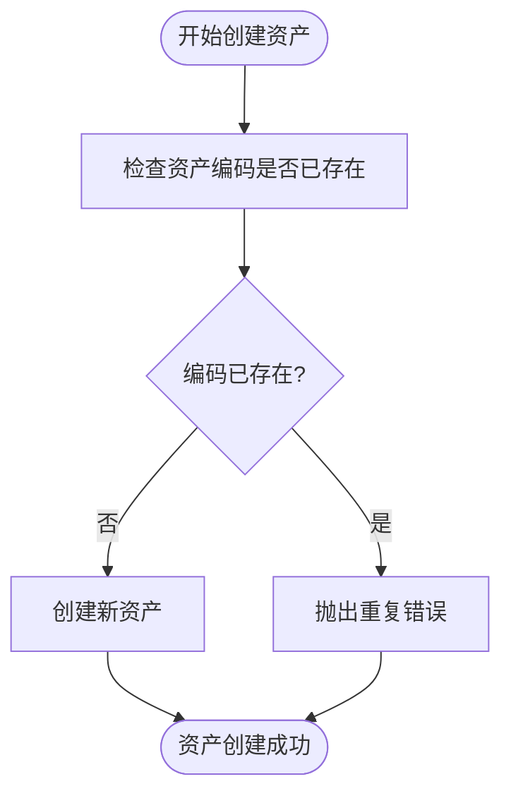
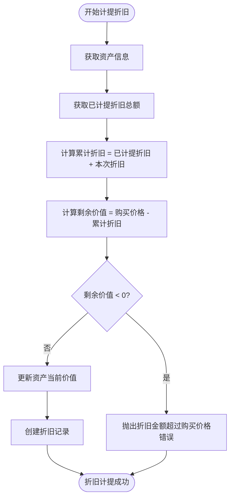
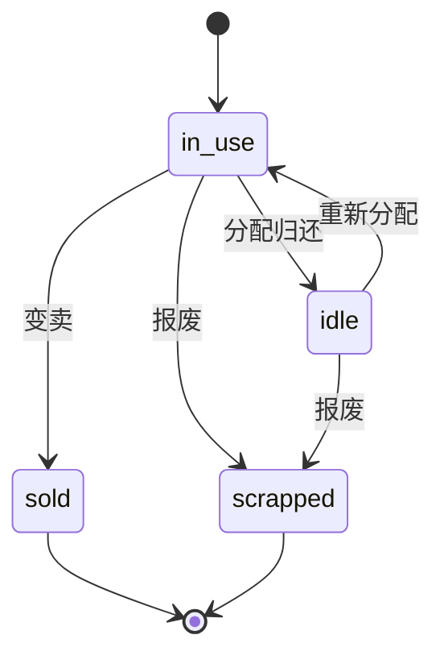
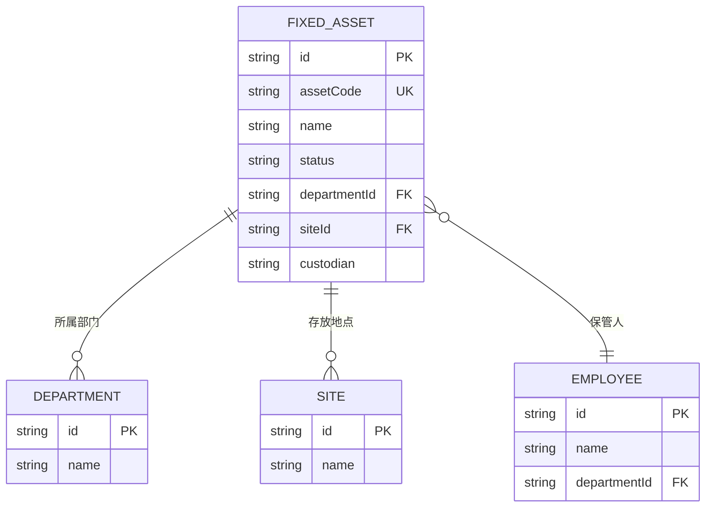
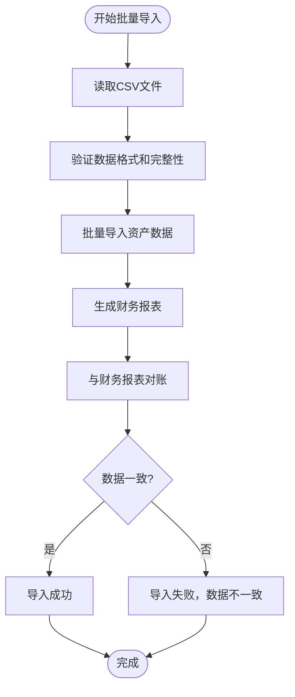

# 固定资产服务测试

<cite>
**本文档引用的文件**  
- [FixedAssetService.test.ts](file://backend/test/services/FixedAssetService.test.ts)
- [FixedAssetService.ts](file://backend/src/services/FixedAssetService.ts)
- [FixedAssetDepreciationService.ts](file://backend/src/services/FixedAssetDepreciationService.ts)
- [FixedAssetAllocationService.ts](file://backend/src/services/FixedAssetAllocationService.ts)
- [FixedAssetChangeService.ts](file://backend/src/services/FixedAssetChangeService.ts)
- [fixed-assets.test.ts](file://backend/test/routes/fixed-assets.test.ts)
- [state-machine.test.ts](file://backend/test/utils/state-machine.test.ts)
</cite>

## 目录
1. [引言](#引言)
2. [核心功能测试实现](#核心功能测试实现)
3. [资产编码唯一性验证](#资产编码唯一性验证)
4. [折旧方法与残值计算测试](#折旧方法与残值计算测试)
5. [资产状态机转换测试](#资产状态机转换测试)
6. [资产关联关系完整性测试](#资产关联关系完整性测试)
7. [批量导入与财务报表一致性验证](#批量导入与财务报表一致性验证)
8. [结论](#结论)

## 引言

固定资产服务测试文档旨在深入解析`FixedAssetService.test.ts`中关于资产增减、折旧计提、调拨处置等核心功能的测试实现。通过分析测试用例，说明系统如何验证资产编码的唯一性、折旧方法的正确性以及残值计算的精确度。同时，文档将结合代码示例展示资产状态机转换（如在用、闲置、报废）的测试覆盖策略，并涵盖资产关联关系（使用人、存放地点）的完整性测试、批量导入校验以及与财务报表数据一致性验证的方法。

## 核心功能测试实现

固定资产服务的测试覆盖了资产的全生命周期管理，包括资产的创建、更新、删除、采购、变卖、分配、归还和折旧等核心功能。测试用例通过模拟数据库操作和业务逻辑，验证每个功能的正确性和健壮性。

**Section sources**
- [FixedAssetService.test.ts](file://backend/test/services/FixedAssetService.test.ts#L23-L635)

## 资产编码唯一性验证

系统通过在创建资产时检查数据库中是否已存在相同资产编码来确保资产编码的唯一性。测试用例`should reject duplicate asset codes`验证了这一功能。

**Diagram sources**
- [FixedAssetService.test.ts](file://backend/test/services/FixedAssetService.test.ts#L448-L479)
- [FixedAssetService.ts](file://backend/src/services/FixedAssetService.ts#L201-L208)

## 折旧方法与残值计算测试

折旧计提功能通过`FixedAssetDepreciationService`实现，系统在创建折旧记录时会验证折旧金额是否超过购买价格，并更新资产的当前价值。测试用例`should create depreciation record`验证了折旧记录的创建和资产价值的更新。

**Diagram sources**
- [FixedAssetDepreciationService.ts](file://backend/src/services/FixedAssetDepreciationService.ts#L29-L73)
- [FixedAssetDepreciationService.ts](file://backend/src/services/FixedAssetDepreciationService.ts#L45-L47)

## 资产状态机转换测试

资产状态机定义了资产在不同状态之间的转换规则，如从“在用”到“闲置”、从“在用”到“报废”等。测试用例通过模拟状态变更操作，验证状态转换的正确性和完整性。

**Diagram sources**
- [FixedAssetAllocationService.ts](file://backend/src/services/FixedAssetAllocationService.ts#L125-L127)
- [FixedAssetAllocationService.ts](file://backend/src/services/FixedAssetAllocationService.ts#L260-L264)
- [FixedAssetService.ts](file://backend/src/services/FixedAssetService.ts#L260-L283)

## 资产关联关系完整性测试

系统通过关联查询确保资产与使用人、存放地点等信息的完整性。测试用例通过模拟关联数据的查询和映射，验证关联关系的正确性。

**Diagram sources**
- [FixedAssetService.ts](file://backend/src/services/FixedAssetService.ts#L59-L87)
- [FixedAssetAllocationService.ts](file://backend/src/services/FixedAssetAllocationService.ts#L69-L103)

## 批量导入与财务报表一致性验证

系统通过批量导入功能支持资产数据的批量创建，并通过与财务报表的对账确保数据的一致性。测试用例通过模拟批量导入操作和财务报表对账，验证数据的完整性和一致性。

**Diagram sources**
- [ImportService.ts](file://backend/src/services/ImportService.ts)
- [FinancialReportService.ts](file://backend/src/services/FinancialReportService.ts)

## 结论

通过全面的测试覆盖，固定资产服务确保了资产增减、折旧计提、调拨处置等核心功能的正确性和可靠性。系统通过严格的验证机制确保资产编码的唯一性、折旧方法的正确性以及残值计算的精确度。资产状态机转换测试确保了资产状态变更的合规性，而资产关联关系完整性测试则保证了资产与使用人、存放地点等信息的关联正确。批量导入与财务报表一致性验证进一步确保了数据的完整性和一致性，为固定资产的全生命周期管理提供了坚实的技术保障。