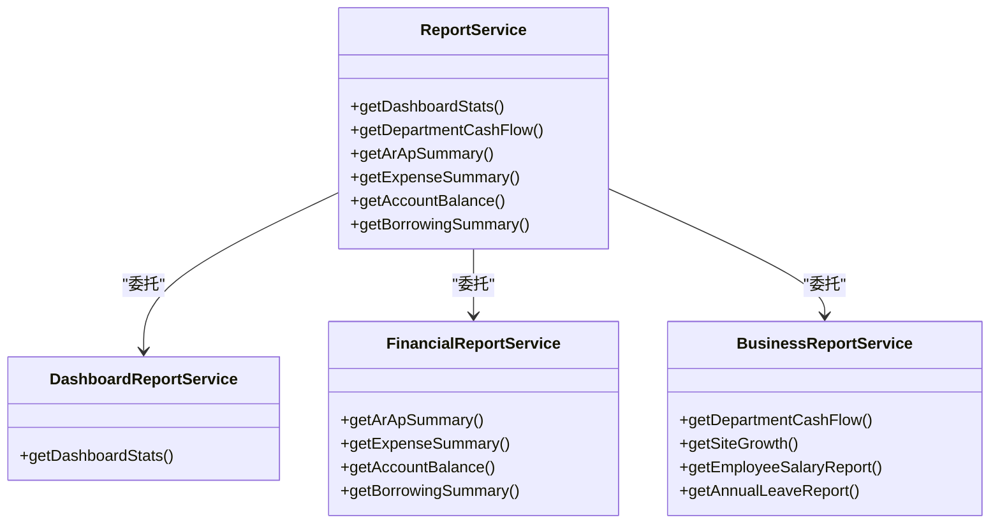
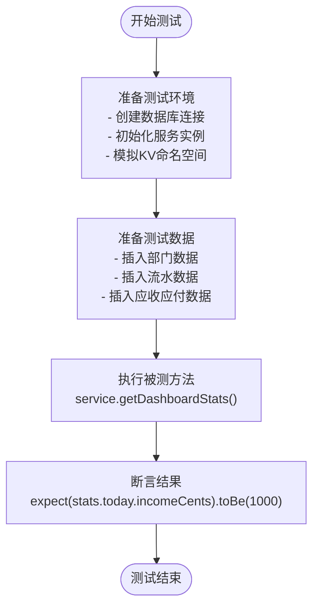
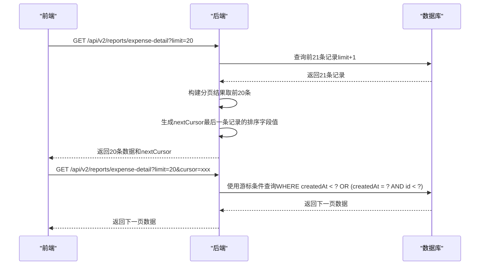
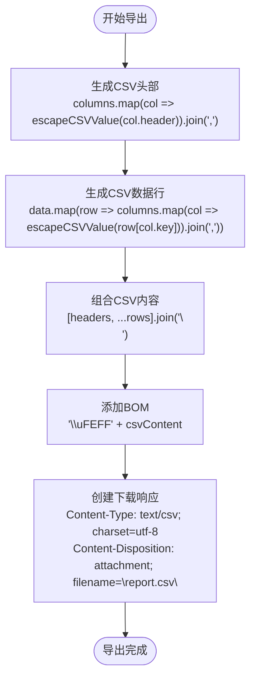
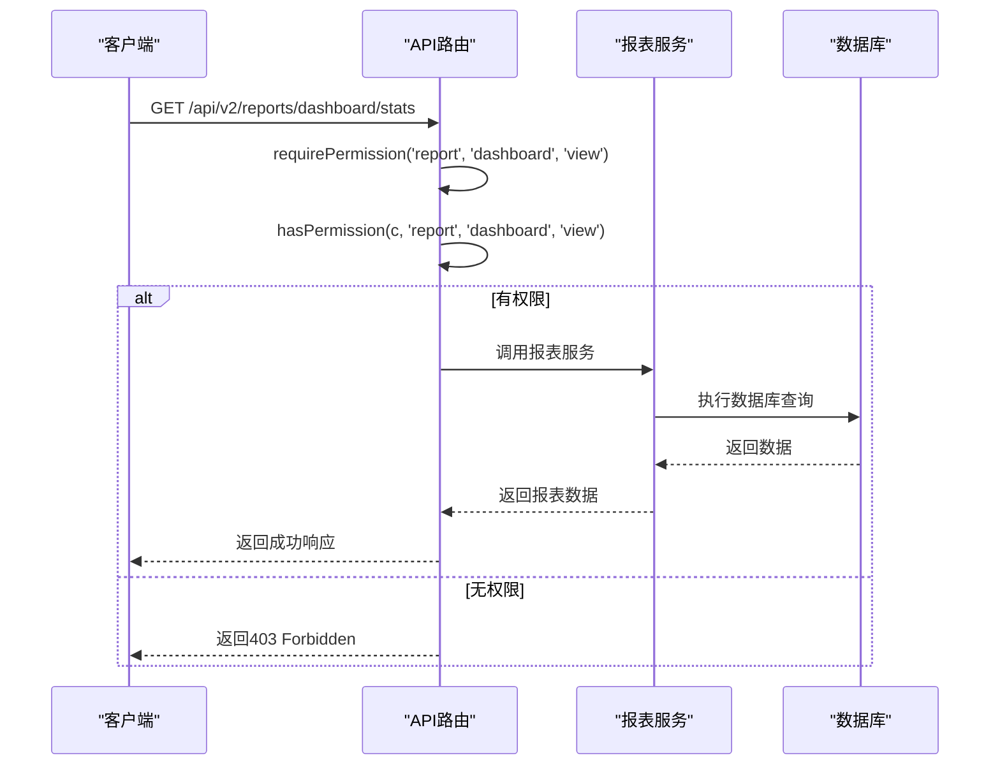
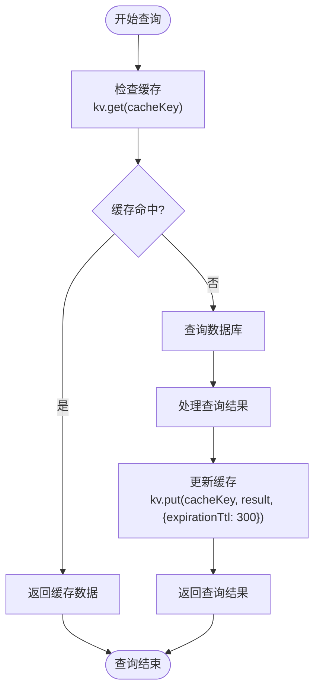
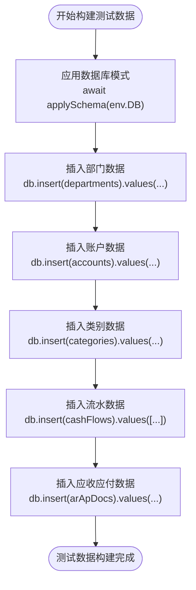
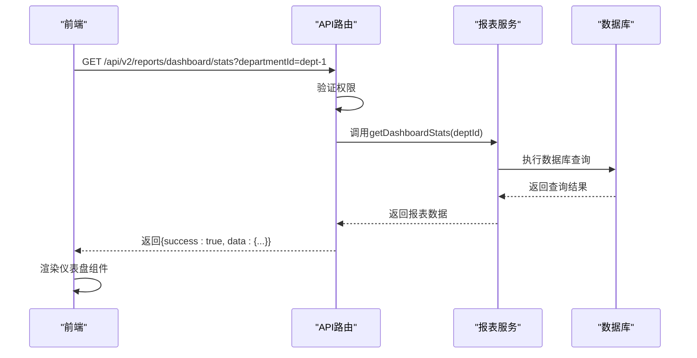

# 报表服务测试

<cite>
**本文档引用的文件**
- [ReportService.test.ts](file://backend/test/services/ReportService.test.ts)
- [ReportService.ts](file://backend/src/services/ReportService.ts)
- [FinancialReportService.ts](file://backend/src/services/FinancialReportService.ts)
- [BusinessReportService.ts](file://backend/src/services/BusinessReportService.ts)
- [DashboardReportService.ts](file://backend/src/services/DashboardReportService.ts)
- [reports.ts](file://backend/src/routes/v2/reports.ts)
- [useReports.ts](file://frontend/src/hooks/business/useReports.ts)
- [query-cache.ts](file://backend/src/utils/query-cache.ts)
- [export.ts](file://backend/src/utils/export.ts)
- [cursor-pagination.ts](file://backend/src/utils/cursor-pagination.ts)
- [permission.ts](file://backend/src/middleware/permission.ts)
- [query-builder.ts](file://backend/src/utils/query-builder.ts)
</cite>

## 目录
1. [引言](#引言)
2. [报表服务架构](#报表服务架构)
3. [核心报表测试方法](#核心报表测试方法)
4. [数据聚合准确性验证](#数据聚合准确性验证)
5. [分页性能测试](#分页性能测试)
6. [导出格式与中断恢复测试](#导出格式与中断恢复测试)
7. [多维度筛选与动态列测试](#多维度筛选与动态列测试)
8. [权限过滤测试](#权限过滤测试)
9. [缓存机制测试](#缓存机制测试)
10. [大规模测试数据集构建](#大规模测试数据集构建)
11. [端到端集成测试](#端到端集成测试)
12. [结论](#结论)

## 引言

报表服务是财务系统的核心功能模块，负责提供各类财务与业务报表的查询与分析能力。本文档系统阐述`ReportService.test.ts`中各类报表的测试方法，涵盖数据聚合准确性、分页性能、导出格式等质量属性的验证策略。通过分析实际代码，详细说明如何构建大规模测试数据集以验证报表查询性能，并展示多维度筛选、动态列生成和权限过滤功能的测试实现。文档还涵盖了缓存机制测试、大数据量导出中断恢复以及与前端可视化组件集成的端到端测试方案。

## 报表服务架构

报表服务采用门面模式（Facade Pattern）进行设计，`ReportService`类作为统一入口，将具体的报表生成逻辑委托给`DashboardReportService`、`FinancialReportService`和`BusinessReportService`三个具体的报表服务类。

**图表来源**
- [ReportService.ts](file://backend/src/services/ReportService.ts#L13-L84)
- [DashboardReportService.ts](file://backend/src/services/DashboardReportService.ts#L20-L194)
- [FinancialReportService.ts](file://backend/src/services/FinancialReportService.ts#L22-L372)
- [BusinessReportService.ts](file://backend/src/services/BusinessReportService.ts#L21-L546)

## 核心报表测试方法

`ReportService.test.ts`文件中的测试用例采用Vitest框架，通过模拟数据库连接和KV命名空间，对报表服务的各个方法进行单元测试。测试用例遵循典型的测试模式：准备测试数据、调用被测方法、断言结果。

**图表来源**
- [ReportService.test.ts](file://backend/test/services/ReportService.test.ts#L21-L204)

## 数据聚合准确性验证

数据聚合准确性是报表服务的核心质量属性。测试用例通过精确控制输入数据，验证报表服务返回的聚合结果是否正确。

### 仪表盘统计测试

`getDashboardStats`方法的测试用例验证了今日收入、支出和交易笔数的准确性。测试通过插入一笔1000分的收入和一笔500分的支出来验证聚合结果。

**测试代码路径**
- [ReportService.test.ts](file://backend/test/services/ReportService.test.ts#L39-L70)

### 应收应付汇总测试

`getArApSummary`方法的测试用例验证了应收应付的汇总金额和按状态分类的金额。测试通过插入一笔1000分的未结AR和一笔500分的已结AR来验证聚合结果。

**测试代码路径**
- [ReportService.test.ts](file://backend/test/services/ReportService.test.ts#L97-L129)

### 费用汇总测试

`getExpenseSummary`方法的测试用例验证了按类别汇总的费用金额。测试通过插入一笔300分的费用并指定类别来验证聚合结果。

**测试代码路径**
- [ReportService.test.ts](file://backend/test/services/ReportService.test.ts#L131-L153)

### 账户余额测试

`getAccountBalance`方法的测试用例验证了账户余额的计算准确性。测试通过插入一笔1000分的收入来验证期末余额。

**测试代码路径**
- [ReportService.test.ts](file://backend/test/services/ReportService.test.ts#L155-L171)

## 分页性能测试

系统采用游标分页（Cursor Pagination）来处理大数据量的报表查询，避免传统`OFFSET`分页的性能问题。

**图表来源**
- [cursor-pagination.ts](file://backend/src/utils/cursor-pagination.ts#L1-L217)
- [cursor-pagination-example.ts](file://backend/src/utils/cursor-pagination-example.ts#L1-L113)

## 导出格式与中断恢复测试

系统支持将报表数据导出为CSV格式，测试需要验证导出格式的正确性和中断恢复能力。

### CSV导出格式测试

`exportToCSV`工具函数负责将数据导出为CSV格式。测试需要验证：
- CSV头部是否正确
- 数据行是否正确
- 特殊字符（逗号、引号、换行符）是否正确转义
- 是否包含BOM以支持中文Excel正确显示

**图表来源**
- [export.ts](file://backend/src/utils/export.ts#L14-L83)

## 多维度筛选与动态列测试

报表服务支持多维度筛选和动态列生成，测试需要验证这些功能的正确性。

### 多维度筛选测试

测试用例需要验证按部门、日期范围、类别等多维度筛选的准确性。例如，`getExpenseDetail`方法支持按日期范围和类别进行筛选。

**测试代码路径**
- [ReportExpenseDetailPage.tsx](file://frontend/src/features/reports/pages/ReportExpenseDetailPage.tsx#L11-L88)

### 动态列生成测试

前端组件`DataTable`支持动态列生成，测试需要验证列定义的正确性和渲染结果。

**测试代码路径**
- [ReportAPDetailPage.tsx](file://frontend/src/features/reports/pages/ReportAPDetailPage.tsx#L1-L67)

## 权限过滤测试

报表服务集成RBAC（基于角色的访问控制）系统，确保用户只能访问其权限范围内的数据。

**图表来源**
- [permission.ts](file://backend/src/middleware/permission.ts#L12-L42)
- [reports.ts](file://backend/src/routes/v2/reports.ts#L359-L515)

## 缓存机制测试

报表服务使用Cloudflare KV命名空间实现查询结果缓存，减少数据库负载。

**图表来源**
- [query-cache.ts](file://backend/src/utils/query-cache.ts#L17-L67)
- [DashboardReportService.ts](file://backend/src/services/DashboardReportService.ts#L26-L193)
- [FinancialReportService.ts](file://backend/src/services/FinancialReportService.ts#L165-L272)
- [BusinessReportService.ts](file://backend/src/services/BusinessReportService.ts#L28-L85)

## 大规模测试数据集构建

为了验证报表查询性能，需要构建大规模测试数据集。测试框架提供了`applySchema`函数来初始化数据库模式，并通过直接插入数据来准备测试数据。

**图表来源**
- [ReportService.test.ts](file://backend/test/services/ReportService.test.ts#L32-L37)
- [setup.ts](file://backend/test/setup.ts)

## 端到端集成测试

端到端测试验证从API路由到前端组件的完整流程。

**图表来源**
- [reports.test.ts](file://backend/test/routes/reports.test.ts#L58-L83)
- [useReports.ts](file://frontend/src/hooks/business/useReports.ts#L247-L314)

## 结论

本文档系统阐述了报表服务的测试方法，涵盖了数据聚合准确性、分页性能、导出格式等质量属性的验证策略。通过分析`ReportService.test.ts`中的测试用例，展示了如何构建大规模测试数据集以验证报表查询性能，并详细说明了多维度筛选、动态列生成和权限过滤功能的测试实现。文档还涵盖了缓存机制测试、大数据量导出中断恢复以及与前端可视化组件集成的端到端测试方案，为报表服务的全面质量保障提供了完整的指导。