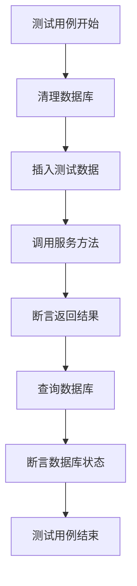
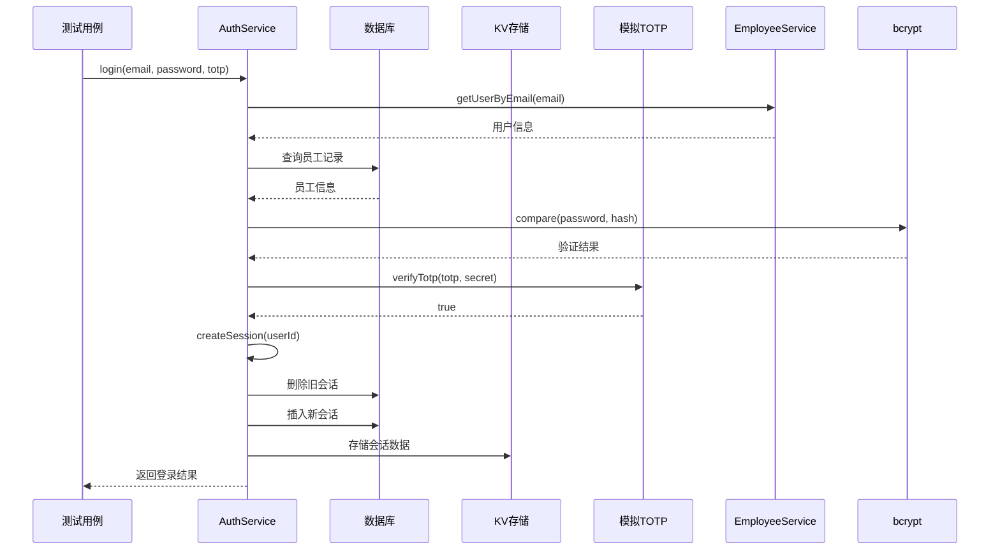
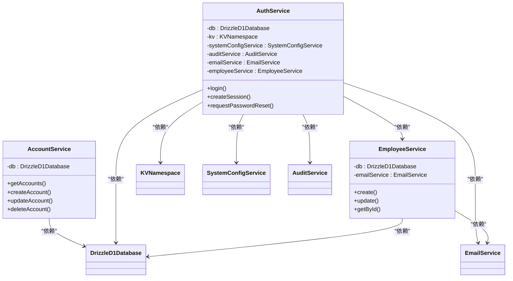
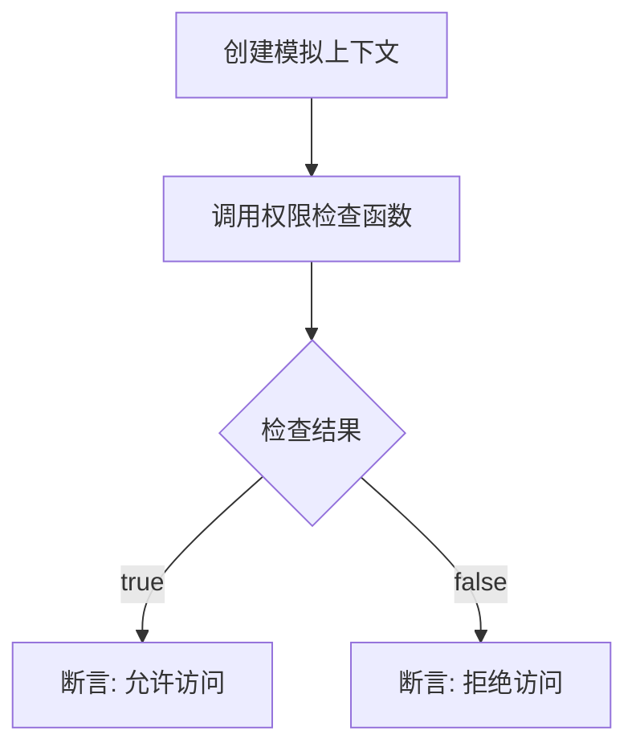
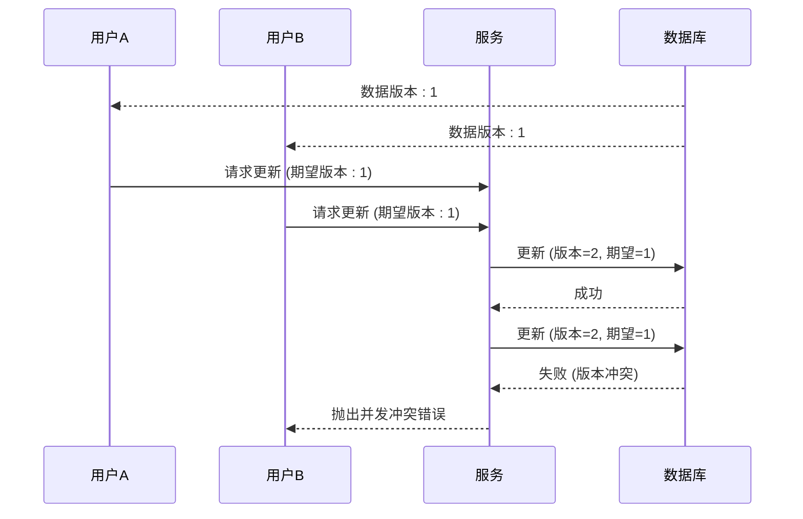

# 服务层测试

<cite>
**本文档引用的文件**   
- [AccountService.ts](file://backend/src/services/AccountService.ts)
- [AccountService.test.ts](file://backend/test/services/AccountService.test.ts)
- [AuthService.ts](file://backend/src/services/AuthService.ts)
- [AuthService.test.ts](file://backend/test/services/AuthService.test.ts)
- [EmployeeService.ts](file://backend/src/services/EmployeeService.ts)
- [EmployeeService.test.ts](file://backend/test/services/EmployeeService.test.ts)
- [RBAC.test.ts](file://backend/test/services/RBAC.test.ts)
- [permissions.ts](file://backend/src/utils/permissions.ts)
- [PermissionService.ts](file://backend/src/services/PermissionService.ts)
- [optimistic-lock.ts](file://backend/src/utils/optimistic-lock.ts)
- [optimistic-lock.test.ts](file://backend/test/utils/optimistic-lock.test.ts)
- [vitest.config.ts](file://backend/vitest.config.ts)
- [setup.ts](file://backend/test/setup.ts)
</cite>

## 目录
1. [引言](#引言)
2. [核心服务测试策略](#核心服务测试策略)
3. [依赖注入与模拟](#依赖注入与模拟)
4. [测试数据构造与清理](#测试数据构造与清理)
5. [权限控制测试](#权限控制测试)
6. [并发与事务测试](#并发与事务测试)
7. [高覆盖率达成](#高覆盖率达成)
8. [常见问题解决方案](#常见问题解决方案)
9. [结论](#结论)

## 引言

本项目的服务层单元测试采用Vitest框架，结合Cloudflare Workers的测试环境，对`AccountService`、`AuthService`、`EmployeeService`等核心服务进行严格的测试。测试策略的核心是通过依赖注入（DI）将数据库（D1）和外部服务（如KV、邮件服务）进行模拟，确保测试的隔离性和可重复性。测试用例设计覆盖了输入验证、业务逻辑、异常路径和权限控制等关键方面，旨在保证服务层代码的健壮性和可靠性。

**Section sources**
- [AccountService.test.ts](file://backend/test/services/AccountService.test.ts)
- [AuthService.test.ts](file://backend/test/services/AuthService.test.ts)
- [EmployeeService.test.ts](file://backend/test/services/EmployeeService.test.ts)

## 核心服务测试策略

### AccountService 测试

`AccountService`的测试用例设计全面覆盖了其所有公共方法。测试通过直接操作数据库来设置测试数据，然后调用服务方法并验证返回结果和数据库状态。



**Diagram sources**
- [AccountService.test.ts](file://backend/test/services/AccountService.test.ts)

**Section sources**
- [AccountService.ts](file://backend/src/services/AccountService.ts)
- [AccountService.test.ts](file://backend/test/services/AccountService.test.ts)

### AuthService 测试

`AuthService`的测试重点在于其复杂的业务逻辑，包括登录流程、2FA（双因素认证）和会话管理。测试中使用了`vi.mock`来模拟`verifyTotp`函数，使其始终返回`true`，从而隔离了外部TOTP库的依赖。



**Diagram sources**
- [AuthService.ts](file://backend/src/services/AuthService.ts)
- [AuthService.test.ts](file://backend/test/services/AuthService.test.ts)

**Section sources**
- [AuthService.ts](file://backend/src/services/AuthService.ts)
- [AuthService.test.ts](file://backend/test/services/AuthService.test.ts)

### EmployeeService 测试

`EmployeeService`的测试验证了员工创建、更新和状态变更等复杂操作。测试特别关注了创建员工时的事务性，尽管D1不支持传统事务，但测试通过验证最终状态来确保业务逻辑的正确性。

**Section sources**
- [EmployeeService.ts](file://backend/src/services/EmployeeService.ts)
- [EmployeeService.test.ts](file://backend/test/services/EmployeeService.test.ts)

## 依赖注入与模拟

服务层的单元测试成功的关键在于依赖注入和模拟策略。所有服务都通过构造函数接收其依赖项，这使得在测试中可以轻松地注入模拟对象。

### 数据库依赖

测试中，`DrizzleD1Database`实例通过`env.DB`从Cloudflare的测试环境获取，并在`beforeAll`钩子中初始化。每个测试用例在`beforeEach`中清理相关表的数据，确保测试的独立性。



**Diagram sources**
- [AccountService.ts](file://backend/src/services/AccountService.ts)
- [AuthService.ts](file://backend/src/services/AuthService.ts)
- [EmployeeService.ts](file://backend/src/services/EmployeeService.ts)

### 外部服务模拟

外部服务，如邮件服务和KV存储，通过`vi.mock`或直接传入模拟对象进行模拟。例如，在`AuthService.test.ts`中，`AuditService`和`EmailService`都被替换为模拟实现。

```typescript
// AuthService.test.ts 中的模拟
const mockSystemConfigService = { get: async () => ({ value: 'false' }) } as any
const mockEmailService = {
  sendActivationEmail: vi.fn(),
  sendLoginNotificationEmail: vi.fn(),
  // ... 其他方法
} as any
service = new AuthService(db, env.SESSIONS_KV, mockSystemConfigService, auditService, mockEmailService)
```

**Section sources**
- [AuthService.test.ts](file://backend/test/services/AuthService.test.ts)

## 测试数据构造与清理

测试数据的构造和清理是保证测试可靠性的基础。项目采用了一套标准化的流程：

1.  **初始化**：在`beforeAll`中，通过执行`schema.sql`文件来创建数据库表结构。
2.  **清理**：在`beforeEach`中，删除所有相关表的数据，为每个测试用例提供一个干净的环境。
3.  **构造**：在每个测试用例中，使用`db.insert()`方法插入所需的测试数据。

这种模式确保了测试用例之间互不干扰，提高了测试的可重复性。

**Section sources**
- [setup.ts](file://backend/test/setup.ts)
- [AccountService.test.ts](file://backend/test/services/AccountService.test.ts)
- [AuthService.test.ts](file://backend/test/services/AuthService.test.ts)

## 权限控制测试

权限控制是系统安全的核心。`RBAC.test.ts`文件专门用于测试基于角色的访问控制（RBAC）逻辑。

### RBAC 测试策略

测试通过创建一个`createMockContext`函数来模拟Hono的`Context`对象，该对象包含了用户职位、员工信息和部门模块权限。测试用例分别验证了不同层级（总部、项目、组）的用户在数据访问和权限检查上的行为。



**Diagram sources**
- [RBAC.test.ts](file://backend/test/services/RBAC.test.ts)

### 权限检查函数

`hasPermission`函数是权限检查的核心。它结合了部门模块权限和职位定义的权限，进行双重验证。测试用例验证了：
- 当用户拥有权限但部门未授权模块时，访问被拒绝。
- 总部人员（level=1）不受部门模块限制。
- 具体的权限（如`finance.flow.create`）是否被正确授予。

**Section sources**
- [permissions.ts](file://backend/src/utils/permissions.ts)
- [RBAC.test.ts](file://backend/test/services/RBAC.test.ts)

## 并发与事务测试

### 乐观锁测试

系统使用乐观锁来防止并发修改冲突。`optimistic-lock.test.ts`文件测试了`validateVersion`和`incrementVersion`两个工具函数。

- `validateVersion`：测试验证了当当前版本号与期望版本号不匹配时，会抛出“数据已被其他用户修改”的错误。
- `incrementVersion`：测试验证了版本号能正确递增，并能处理`null`值（向后兼容）。



**Diagram sources**
- [optimistic-lock.ts](file://backend/src/utils/optimistic-lock.ts)
- [optimistic-lock.test.ts](file://backend/test/utils/optimistic-lock.test.ts)

**Section sources**
- [optimistic-lock.ts](file://backend/src/utils/optimistic-lock.ts)
- [optimistic-lock.test.ts](file://backend/test/utils/optimistic-lock.test.ts)

## 高覆盖率达成

项目通过Vitest的内置覆盖率工具来衡量测试的完整性。`vitest.config.ts`中的配置定义了覆盖率的阈值：

```json
"coverage": {
  "thresholds": {
    "lines": 70,
    "functions": 70,
    "branches": 65,
    "statements": 70
  }
}
```

为了达成高覆盖率，测试用例设计遵循以下原则：
1.  **分支覆盖**：为每个`if`、`else`和`switch`语句编写正向和负向的测试用例。
2.  **异常路径**：专门测试各种错误条件，如无效输入、资源不存在、业务规则冲突等。
3.  **边界值**：测试边界条件，例如空字符串、`null`值、最大/最小数值。

**Section sources**
- [vitest.config.ts](file://backend/vitest.config.ts)

## 常见问题解决方案

### 异步操作超时

在Cloudflare Workers环境中，长时间运行的异步操作可能会超时。解决方案是确保所有数据库操作都是轻量级的，并且在测试中使用`await`正确处理Promise。

### 并发修改冲突

如前所述，系统通过乐观锁机制来解决并发修改问题。当检测到版本冲突时，服务会抛出一个明确的业务错误，前端可以捕获并提示用户刷新页面后重试。

### 模拟外部服务

对于邮件服务等外部依赖，测试中使用`vi.fn()`创建模拟函数，可以断言这些函数是否被调用以及调用的参数，而无需真正发送邮件。

**Section sources**
- [AuthService.test.ts](file://backend/test/services/AuthService.test.ts)
- [EmployeeService.test.ts](file://backend/test/services/EmployeeService.test.ts)

## 结论

本项目的服务层单元测试策略是全面且有效的。通过依赖注入、精心设计的模拟和详尽的测试用例，确保了核心业务逻辑的正确性和稳定性。测试不仅覆盖了正常流程，还深入验证了异常处理、权限控制和并发安全等关键场景。这种测试方法为代码的持续集成和交付提供了坚实的信心保障。