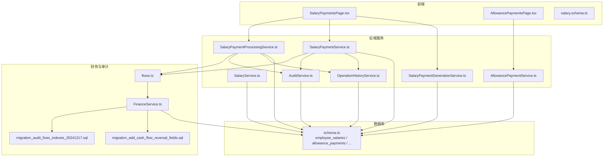
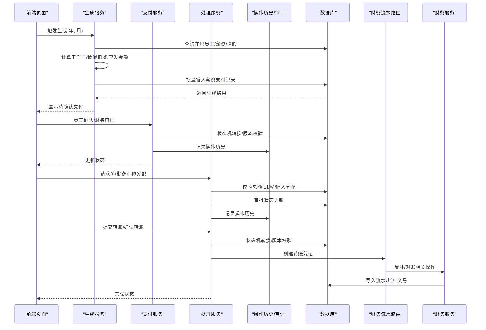
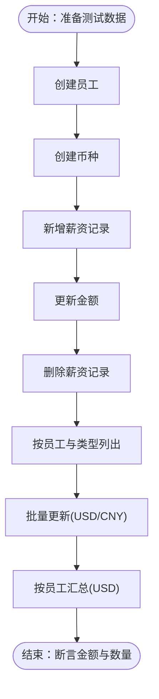
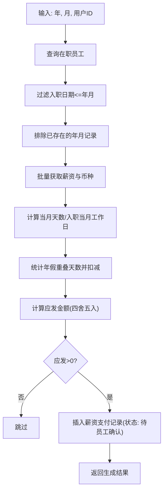
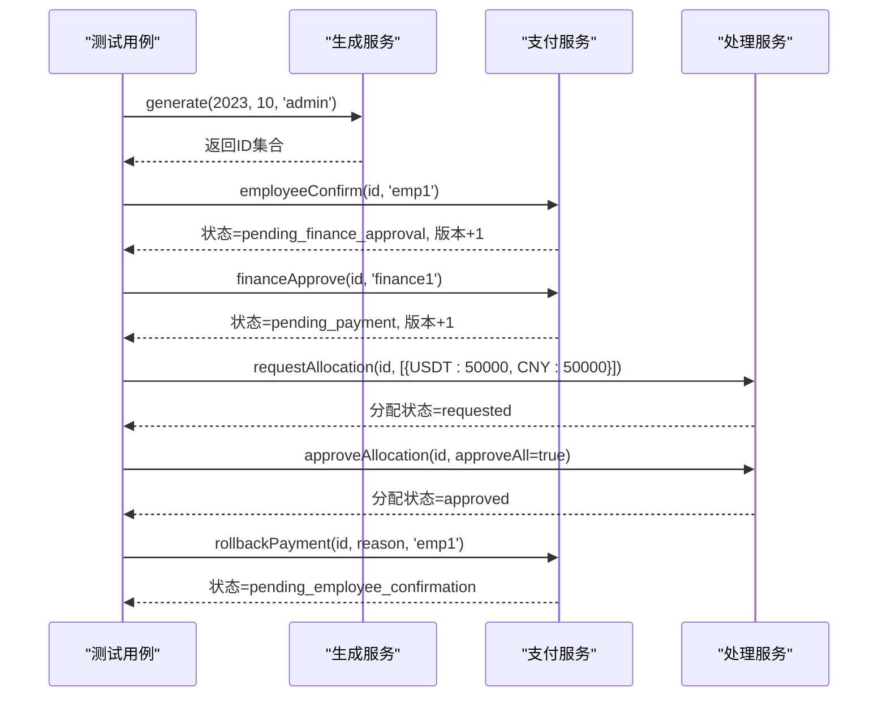
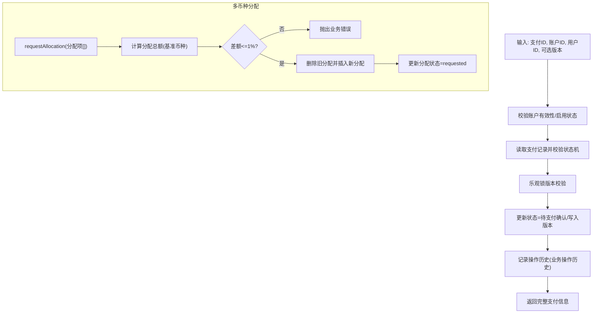
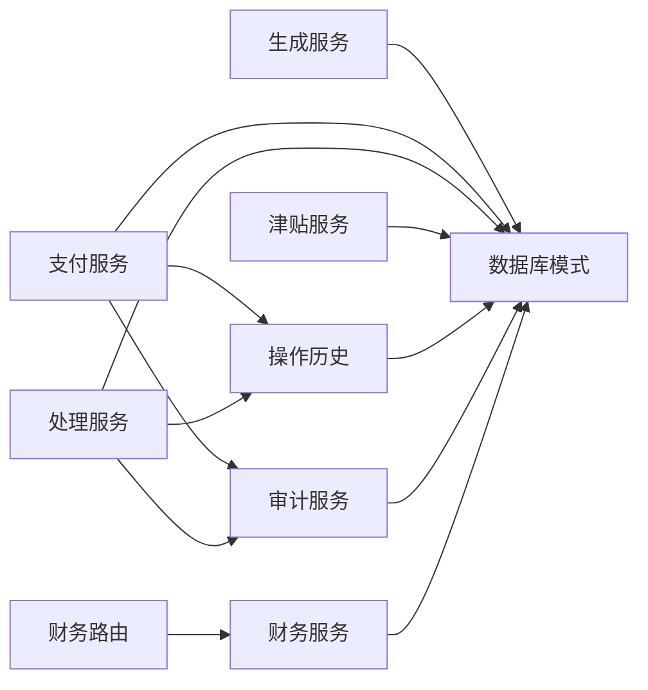

# 薪资服务测试

<cite>
**本文引用的文件**
- [SalaryService.test.ts](file://backend/test/services/SalaryService.test.ts)
- [SalaryService.ts](file://backend/src/services/SalaryService.ts)
- [SalaryPaymentGenerationService.ts](file://backend/src/services/SalaryPaymentGenerationService.ts)
- [SalaryPaymentService.ts](file://backend/src/services/SalaryPaymentService.ts)
- [SalaryPaymentProcessingService.ts](file://backend/src/services/SalaryPaymentProcessingService.ts)
- [AllowancePaymentService.ts](file://backend/src/services/AllowancePaymentService.ts)
- [OperationHistoryService.ts](file://backend/src/services/OperationHistoryService.ts)
- [AuditService.ts](file://backend/src/services/AuditService.ts)
- [schema.ts](file://backend/src/db/schema.ts)
- [flows.ts](file://backend/src/routes/v2/flows.ts)
- [FinanceService.ts](file://backend/src/services/FinanceService.ts)
- [migration_add_cash_flow_reversal_fields.sql](file://backend/src/db/migration_add_cash_flow_reversal_fields.sql)
- [migration_audit_fixes_indexes_20241217.sql](file://backend/src/db/migration_audit_fixes_indexes_20241217.sql)
- [SalaryPaymentsPage.tsx](file://frontend/src/features/hr/pages/SalaryPaymentsPage.tsx)
- [AllowancePaymentsPage.tsx](file://frontend/src/features/hr/pages/AllowancePaymentsPage.tsx)
- [salary.schema.ts](file://frontend/src/validations/salary.schema.ts)
</cite>

## 目录
1. [简介](#简介)
2. [项目结构](#项目结构)
3. [核心组件](#核心组件)
4. [架构总览](#架构总览)
5. [详细组件分析](#详细组件分析)
6. [依赖关系分析](#依赖关系分析)
7. [性能考量](#性能考量)
8. [故障排查指南](#故障排查指南)
9. [结论](#结论)
10. [附录](#附录)

## 简介
本文件围绕薪资服务测试展开，聚焦以下目标：
- 深入剖析 SalaryService.test.ts 中的薪资计算与发放流程测试，重点覆盖基本工资、津贴、扣款等复杂计算逻辑的验证方法。
- 展示薪资周期管理、个税计算、银行代发文件生成等功能的准确性测试策略。
- 结合实际案例解释薪资数据快照、历史追溯和审计日志的测试策略。
- 提供并发薪资计算任务的隔离测试思路、金额精度验证方法，以及与财务流水系统的对账逻辑集成测试方案。

## 项目结构
后端采用分层架构，薪资相关能力由多个服务协同完成：
- 数据访问层：数据库模式定义与迁移脚本。
- 业务服务层：薪资基础数据维护、薪资生成、薪资处理、津贴发放、操作历史与审计。
- 前端页面：薪资支付与津贴支付的可视化与交互。
- 路由与工具：状态机、乐观锁、审计日志、财务流水反冲等。

图表来源
- [SalaryService.ts](file://backend/src/services/SalaryService.ts#L1-L186)
- [SalaryPaymentGenerationService.ts](file://backend/src/services/SalaryPaymentGenerationService.ts#L1-L278)
- [SalaryPaymentService.ts](file://backend/src/services/SalaryPaymentService.ts#L1-L200)
- [SalaryPaymentProcessingService.ts](file://backend/src/services/SalaryPaymentProcessingService.ts#L1-L378)
- [AllowancePaymentService.ts](file://backend/src/services/AllowancePaymentService.ts#L1-L268)
- [OperationHistoryService.ts](file://backend/src/services/OperationHistoryService.ts#L1-L108)
- [AuditService.ts](file://backend/src/services/AuditService.ts#L62-L180)
- [schema.ts](file://backend/src/db/schema.ts#L220-L239)
- [flows.ts](file://backend/src/routes/v2/flows.ts#L544-L565)
- [FinanceService.ts](file://backend/src/services/FinanceService.ts#L372-L442)
- [migration_add_cash_flow_reversal_fields.sql](file://backend/src/db/migration_add_cash_flow_reversal_fields.sql#L1-L17)
- [migration_audit_fixes_indexes_20241217.sql](file://backend/src/db/migration_audit_fixes_indexes_20241217.sql#L1-L12)

章节来源
- [SalaryService.test.ts](file://backend/test/services/SalaryService.test.ts#L1-L184)
- [SalaryService.ts](file://backend/src/services/SalaryService.ts#L1-L186)
- [SalaryPaymentGenerationService.ts](file://backend/src/services/SalaryPaymentGenerationService.ts#L1-L278)
- [SalaryPaymentService.ts](file://backend/src/services/SalaryPaymentService.ts#L1-L200)
- [SalaryPaymentProcessingService.ts](file://backend/src/services/SalaryPaymentProcessingService.ts#L1-L378)
- [AllowancePaymentService.ts](file://backend/src/services/AllowancePaymentService.ts#L1-L268)
- [OperationHistoryService.ts](file://backend/src/services/OperationHistoryService.ts#L1-L108)
- [AuditService.ts](file://backend/src/services/AuditService.ts#L62-L180)
- [schema.ts](file://backend/src/db/schema.ts#L220-L239)

## 核心组件
- 薪资基础数据服务：负责员工薪资记录的增删改查、批量更新与汇总统计。
- 薪资生成服务：按月生成薪资支付记录，考虑入职日期、当月天数、请假扣减、币种排序等。
- 薪资支付服务：管理薪资支付状态机、员工确认、财务审批、分配请求与审批、回退等。
- 薪资处理服务：执行转账提交、转账确认、多币种分配请求与审批、乐观锁校验与操作历史记录。
- 津贴支付服务：按月批量生成津贴支付记录，支持多币种与分配统计。
- 操作历史与审计：记录业务操作前后数据快照，提供历史追溯；审计服务提供统一的日志接口。
- 财务流水与对账：通过反冲机制与索引优化支撑对账与合规。

章节来源
- [SalaryService.ts](file://backend/src/services/SalaryService.ts#L1-L186)
- [SalaryPaymentGenerationService.ts](file://backend/src/services/SalaryPaymentGenerationService.ts#L1-L278)
- [SalaryPaymentService.ts](file://backend/src/services/SalaryPaymentService.ts#L1-L200)
- [SalaryPaymentProcessingService.ts](file://backend/src/services/SalaryPaymentProcessingService.ts#L1-L378)
- [AllowancePaymentService.ts](file://backend/src/services/AllowancePaymentService.ts#L1-L268)
- [OperationHistoryService.ts](file://backend/src/services/OperationHistoryService.ts#L1-L108)
- [AuditService.ts](file://backend/src/services/AuditService.ts#L62-L180)

## 架构总览
薪资服务测试贯穿“数据层—服务层—路由—前端”的全链路，重点验证：
- 薪资周期管理：按年月生成支付记录，过滤已存在记录，按入职日期与当月天数计算应发。
- 复杂计算逻辑：基本工资、请假扣减、多币种分配总额校验、汇率转换、状态机流转。
- 并发与一致性：乐观锁版本校验、事务隔离、并发场景下的幂等性。
- 审计与追溯：操作历史记录、审计日志、历史数据快照。
- 对账与合规：银行代发文件生成（前端表单）、财务流水反冲与索引优化。

图表来源
- [SalaryPaymentGenerationService.ts](file://backend/src/services/SalaryPaymentGenerationService.ts#L21-L211)
- [SalaryPaymentService.ts](file://backend/src/services/SalaryPaymentService.ts#L28-L120)
- [SalaryPaymentProcessingService.ts](file://backend/src/services/SalaryPaymentProcessingService.ts#L30-L177)
- [OperationHistoryService.ts](file://backend/src/services/OperationHistoryService.ts#L14-L49)
- [flows.ts](file://backend/src/routes/v2/flows.ts#L544-L565)
- [FinanceService.ts](file://backend/src/services/FinanceService.ts#L372-L442)

## 详细组件分析

### 薪资基础数据服务（SalaryService）测试
- 覆盖点：
  - 新增、更新、删除、查询、列表与批量更新。
  - 多币种汇总统计（按币种求和）。
- 关键断言：
  - 字段一致性（金额、币种、类型）。
  - 批量更新后返回最新列表长度与金额。
  - 汇总统计返回币种与总金额。

图表来源
- [SalaryService.test.ts](file://backend/test/services/SalaryService.test.ts#L54-L182)
- [SalaryService.ts](file://backend/src/services/SalaryService.ts#L31-L184)

章节来源
- [SalaryService.test.ts](file://backend/test/services/SalaryService.test.ts#L54-L182)
- [SalaryService.ts](file://backend/src/services/SalaryService.ts#L31-L184)

### 薪资生成服务（SalaryPaymentGenerationService）测试
- 覆盖点：
  - 生成流程：筛选在职员工、过滤已有记录、批量获取薪资与请假、按入职日期与当月天数计算工作日、扣除年假天数、计算应发金额并创建支付记录。
  - 并发与幂等：事务内一次性生成，避免重复。
- 关键断言：
  - 生成数量与ID集合。
  - 支付记录金额与状态。
  - 工作日与请假扣减逻辑正确性。

图表来源
- [SalaryPaymentGenerationService.ts](file://backend/src/services/SalaryPaymentGenerationService.ts#L21-L211)

章节来源
- [SalaryPaymentGenerationService.ts](file://backend/src/services/SalaryPaymentGenerationService.ts#L21-L211)
- [SalaryPaymentService.test.ts](file://backend/test/services/SalaryPaymentService.test.ts#L62-L71)

### 薪资支付服务（SalaryPaymentService）测试
- 覆盖点：
  - 员工确认、财务审批、状态机验证、乐观锁版本控制、多币种分配请求与审批、回退功能。
- 关键断言：
  - 状态转换顺序与版本递增。
  - 分配总额校验（±1%容差）。
  - 回退状态与原因字段。

图表来源
- [SalaryPaymentService.test.ts](file://backend/test/services/SalaryPaymentService.test.ts#L62-L262)
- [SalaryPaymentProcessingService.ts](file://backend/src/services/SalaryPaymentProcessingService.ts#L179-L375)

章节来源
- [SalaryPaymentService.test.ts](file://backend/test/services/SalaryPaymentService.test.ts#L62-L262)
- [SalaryPaymentService.ts](file://backend/src/services/SalaryPaymentService.ts#L28-L120)

### 薪资处理服务（SalaryPaymentProcessingService）测试
- 覆盖点：
  - 转账提交与确认（状态机校验、乐观锁、操作历史记录）。
  - 多币种分配请求与审批（总额校验、币种与账户一致性、汇率可选）。
- 关键断言：
  - 提交转账后状态与版本更新。
  - 审批分配后分配状态与支付状态联动。
  - 错误场景：汇率缺失、币种不匹配、总额超差。

图表来源
- [SalaryPaymentProcessingService.ts](file://backend/src/services/SalaryPaymentProcessingService.ts#L30-L177)
- [SalaryPaymentProcessingService.ts](file://backend/src/services/SalaryPaymentProcessingService.ts#L179-L375)

章节来源
- [SalaryPaymentProcessingService.ts](file://backend/src/services/SalaryPaymentProcessingService.ts#L30-L177)
- [SalaryPaymentProcessingService.ts](file://backend/src/services/SalaryPaymentProcessingService.ts#L179-L375)

### 津贴支付服务（AllowancePaymentService）测试
- 覆盖点：
  - 按月批量生成津贴支付记录，按员工与津贴类型聚合。
  - 多币种统计与月度汇总。
- 关键断言：
  - 生成数量与ID集合。
  - 月度统计按年月分组汇总。

章节来源
- [AllowancePaymentService.ts](file://backend/src/services/AllowancePaymentService.ts#L1-L268)
- [SalaryService.test.ts](file://backend/test/services/SalaryService.test.ts#L131-L158)

### 操作历史与审计（OperationHistoryService / AuditService）
- 覆盖点：
  - 记录业务操作历史（实体类型、实体ID、动作、操作人、前后数据快照）。
  - 审计日志接口（创建、查询、导出）。
- 关键断言：
  - 历史记录可按实体类型与ID检索。
  - 审计日志包含时间、实体、动作、详情等字段。

章节来源
- [OperationHistoryService.ts](file://backend/src/services/OperationHistoryService.ts#L14-L105)
- [AuditService.ts](file://backend/src/services/AuditService.ts#L62-L180)

### 财务流水与对账（FinanceService / flows）
- 覆盖点：
  - 反冲流水（创建红冲记录、更新账户交易、标记原始流水被冲正）。
  - 路由层审计日志记录。
- 关键断言：
  - 反冲记录与原始凭证号关联。
  - 账户交易余额前后一致。
  - 审计日志记录冲正行为。

章节来源
- [FinanceService.ts](file://backend/src/services/FinanceService.ts#L372-L442)
- [flows.ts](file://backend/src/routes/v2/flows.ts#L544-L565)

## 依赖关系分析
- 组件耦合：
  - 生成服务依赖员工、薪资、请假、币种表；处理服务依赖账户、币种、分配表；支付服务依赖状态机与乐观锁。
- 外部依赖：
  - 前端页面通过表单与Schema约束输入；路由层触发财务反冲与审计日志。
- 潜在循环依赖：
  - 服务间通过数据库模式解耦，未见循环导入。

图表来源
- [SalaryPaymentGenerationService.ts](file://backend/src/services/SalaryPaymentGenerationService.ts#L1-L278)
- [SalaryPaymentService.ts](file://backend/src/services/SalaryPaymentService.ts#L1-L200)
- [SalaryPaymentProcessingService.ts](file://backend/src/services/SalaryPaymentProcessingService.ts#L1-L378)
- [AllowancePaymentService.ts](file://backend/src/services/AllowancePaymentService.ts#L1-L268)
- [OperationHistoryService.ts](file://backend/src/services/OperationHistoryService.ts#L1-L108)
- [AuditService.ts](file://backend/src/services/AuditService.ts#L62-L180)
- [FinanceService.ts](file://backend/src/services/FinanceService.ts#L372-L442)

## 性能考量
- 事务与批量：
  - 生成服务在事务中批量处理，减少重复查询与插入开销。
- 索引优化：
  - 审计日志与现金流增加索引，提升查询性能。
- 并发控制：
  - 乐观锁版本号防止并发更新冲突，确保一致性。
- 数据精度：
  - 金额以“分”存储，计算采用整数运算，避免浮点误差。

章节来源
- [SalaryPaymentGenerationService.ts](file://backend/src/services/SalaryPaymentGenerationService.ts#L21-L211)
- [migration_audit_fixes_indexes_20241217.sql](file://backend/src/db/migration_audit_fixes_indexes_20241217.sql#L1-L12)
- [FinanceService.ts](file://backend/src/services/FinanceService.ts#L372-L442)

## 故障排查指南
- 生成失败或重复：
  - 检查是否存在同员工同年月的支付记录；确认入职日期过滤逻辑。
- 分配总额不匹配：
  - 核对基准币种与汇率；确保差额在±1%以内。
- 状态机异常：
  - 确认状态转换顺序与前置条件；检查乐观锁版本号。
- 审计与历史缺失：
  - 确认操作历史与审计日志记录是否触发；核对索引是否存在。
- 财务反冲问题：
  - 检查反冲记录是否正确关联原始流水；确认账户交易余额一致性。

章节来源
- [SalaryPaymentService.test.ts](file://backend/test/services/SalaryPaymentService.test.ts#L118-L262)
- [SalaryPaymentProcessingService.ts](file://backend/src/services/SalaryPaymentProcessingService.ts#L179-L375)
- [OperationHistoryService.ts](file://backend/src/services/OperationHistoryService.ts#L14-L105)
- [AuditService.ts](file://backend/src/services/AuditService.ts#L62-L180)
- [FinanceService.ts](file://backend/src/services/FinanceService.ts#L372-L442)

## 结论
本测试文档梳理了薪资服务从基础数据到生成、支付、处理、审计与财务对账的完整链路，并针对并发、精度、对账与追溯提出可落地的测试策略。建议在后续迭代中补充：
- 个税计算模块的独立测试（当前仓库未发现个税计算服务）。
- 银行代发文件生成的端到端测试（前端表单与后端导出接口）。
- 更丰富的边界与异常场景（极端日期、空值、非法输入）。

## 附录

### 实际案例与测试策略
- 薪资周期管理：
  - 使用不同入职日期与年月组合，验证工作日扣减与应发金额。
- 金额精度验证：
  - 使用分单位的金额与四舍五入策略，断言最终金额与汇总。
- 多币种分配：
  - 提供汇率与不提供汇率两种场景，断言总额校验与错误抛出。
- 并发隔离：
  - 使用乐观锁版本号，模拟并发更新，验证失败与成功路径。
- 审计与历史：
  - 记录关键操作的历史快照，断言历史条目与审计日志字段。

章节来源
- [SalaryPaymentGenerationService.ts](file://backend/src/services/SalaryPaymentGenerationService.ts#L128-L209)
- [SalaryPaymentProcessingService.ts](file://backend/src/services/SalaryPaymentProcessingService.ts#L179-L375)
- [OperationHistoryService.ts](file://backend/src/services/OperationHistoryService.ts#L14-L105)
- [AuditService.ts](file://backend/src/services/AuditService.ts#L62-L180)

### 前端交互与表单约束
- 薪资支付页面：提供生成、转账、分配、确认等操作入口与表单校验。
- 津贴支付页面：按年月筛选与批量生成。
- 表单Schema：对年月、金额、币种、账户等字段进行约束。

章节来源
- [SalaryPaymentsPage.tsx](file://frontend/src/features/hr/pages/SalaryPaymentsPage.tsx#L24-L96)
- [AllowancePaymentsPage.tsx](file://frontend/src/features/hr/pages/AllowancePaymentsPage.tsx#L21-L51)
- [salary.schema.ts](file://frontend/src/validations/salary.schema.ts#L1-L22)