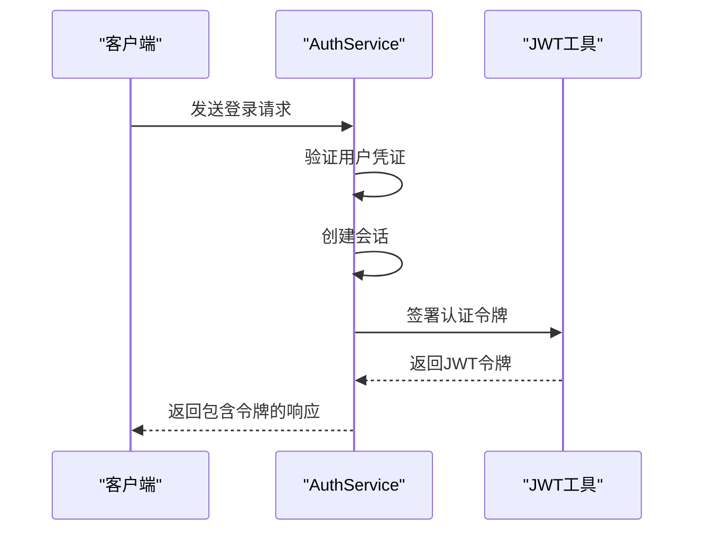
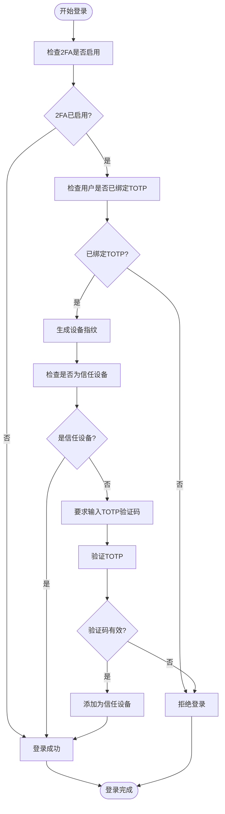
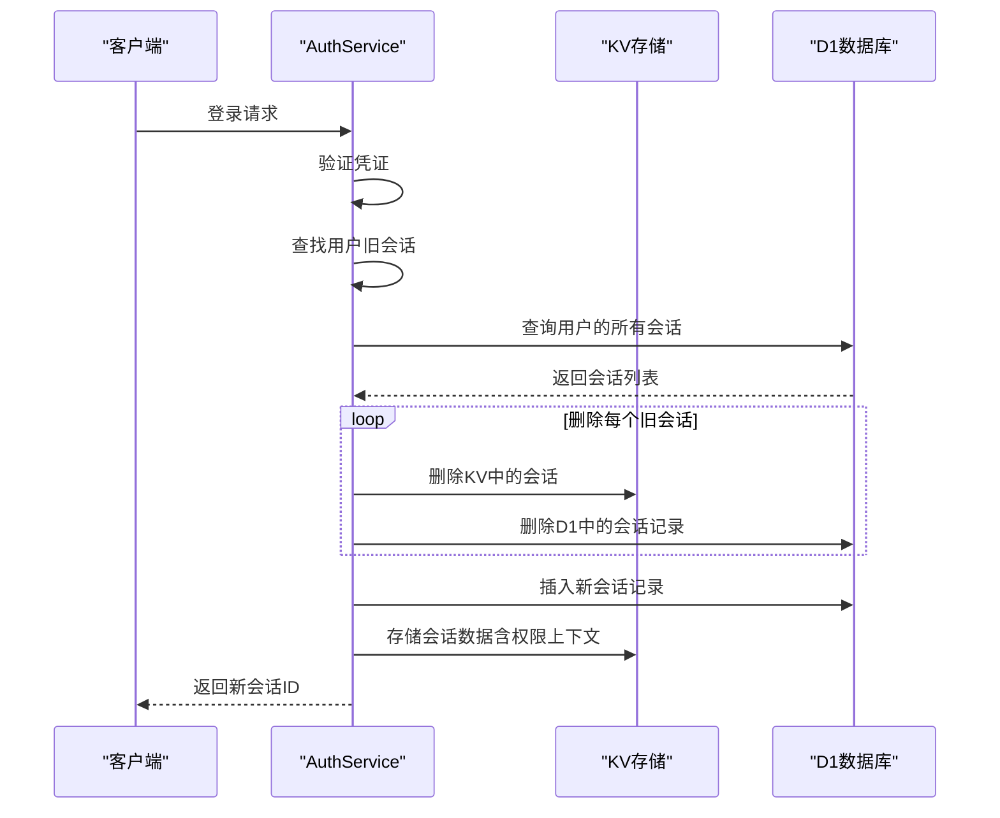
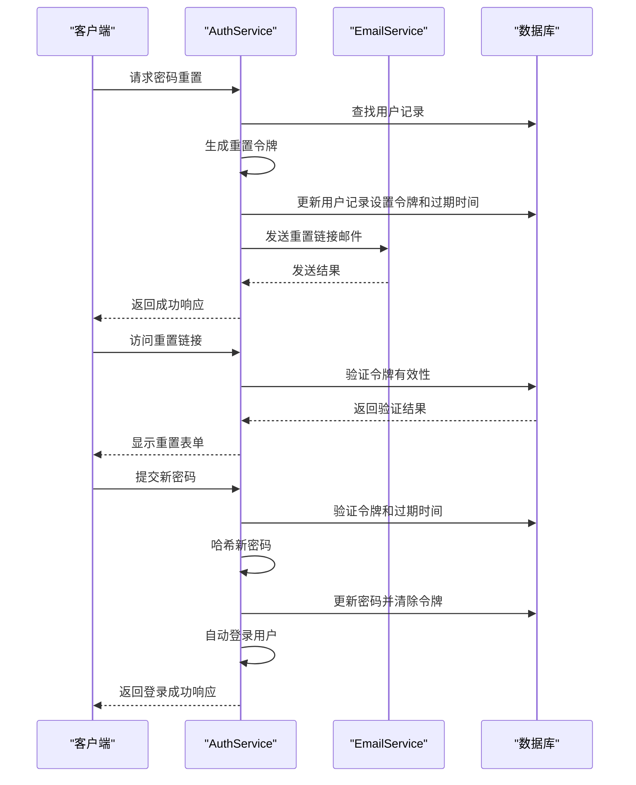
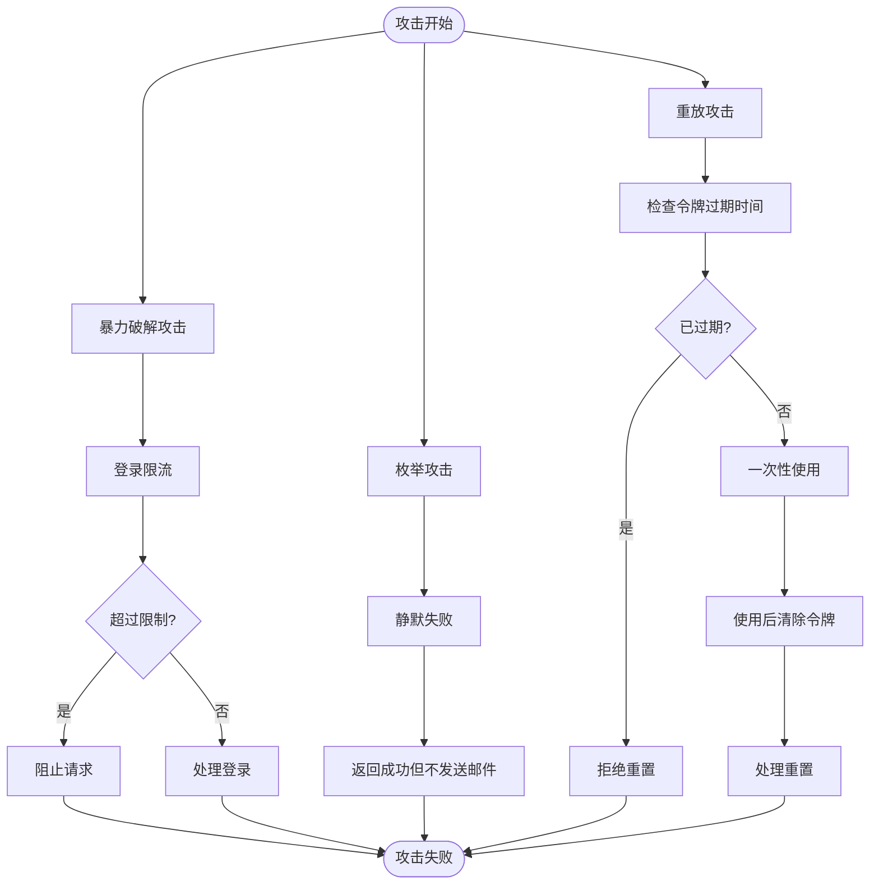
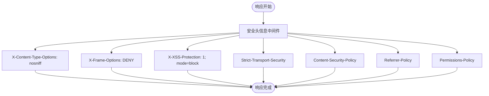

# 认证服务测试

<cite>
**本文档引用的文件**
- [AuthService.test.ts](file://backend/test/services/AuthService.test.ts)
- [AuthService.ts](file://backend/src/services/AuthService.ts)
- [auth.ts](file://backend/src/routes/v2/auth.ts)
- [jwt.ts](file://backend/src/utils/jwt.ts)
- [security.ts](file://backend/src/middleware/security.ts)
- [ipWhitelist.ts](file://backend/src/middleware/ipWhitelist.ts)
- [SystemConfigService.ts](file://backend/src/services/SystemConfigService.ts)
- [TrustedDeviceService.ts](file://backend/src/services/TrustedDeviceService.ts)
- [password_reset.test.ts](file://backend/test/services/password_reset.test.ts)
- [activation.test.ts](file://backend/test/services/activation.test.ts)
</cite>

## 目录
1. [简介](#简介)
2. [核心认证流程测试](#核心认证流程测试)
3. [JWT令牌生成与验证](#jwt令牌生成与验证)
4. [TOTP双因素认证测试](#totp双因素认证测试)
5. [会话管理与单点登录](#会话管理与单点登录)
6. [密码重置流程测试](#密码重置流程测试)
7. [安全攻击场景模拟](#安全攻击场景模拟)
8. [权限上下文与令牌刷新](#权限上下文与令牌刷新)
9. [加密函数与安全头信息测试](#加密函数与安全头信息测试)
10. [IP白名单中间件集成测试](#ip白名单中间件集成测试)
11. [结论](#结论)

## 简介
本文档全面解析`AuthService.test.ts`中的认证流程测试，涵盖JWT令牌生成、TOTP双因素验证、会话管理及密码重置等安全机制的测试实现。详细说明如何模拟登录攻击场景（如暴力破解、令牌重放）以验证系统的安全性。结合实际代码展示认证失败路径、令牌刷新逻辑和权限上下文传递的测试方法。文档包括对加密函数的Mock策略、安全头信息校验以及与IP白名单中间件集成测试的技术细节。

## 核心认证流程测试
认证服务测试覆盖了用户从登录到登出的完整生命周期，包括2FA配置、信任设备管理和会话创建等关键环节。测试用例验证了在不同配置下（如2FA开启/关闭）的登录行为，确保系统在各种场景下都能正确处理认证请求。

**Section sources**
- [AuthService.test.ts](file://backend/test/services/AuthService.test.ts#L58-L84)
- [AuthService.ts](file://backend/src/services/AuthService.ts#L34-L148)

## JWT令牌生成与验证
系统使用自定义JWT实现进行身份验证，令牌包含会话ID、用户ID、邮箱、姓名和职位信息，并设置7天的过期时间。测试验证了令牌的正确生成、签名和验证过程，确保令牌的安全性和完整性。



**Diagram sources**
- [auth.ts](file://backend/src/routes/v2/auth.ts#L44-L79)
- [jwt.ts](file://backend/src/utils/jwt.ts#L72-L94)

## TOTP双因素认证测试
TOTP双因素认证测试验证了在新设备首次登录时需要输入Google验证码的安全机制。系统通过设备指纹识别信任设备，对于非信任设备强制要求TOTP验证，并在验证成功后将其添加到信任设备列表中。



**Diagram sources**
- [AuthService.ts](file://backend/src/services/AuthService.ts#L78-L113)
- [TrustedDeviceService.ts](file://backend/src/services/TrustedDeviceService.ts#L17-L30)

## 会话管理与单点登录
会话管理测试验证了单点登录（SSO）机制的实现，确保同一用户只能在一个设备上保持登录状态。当用户在新设备上登录时，系统会自动删除该用户在其他设备上的所有旧会话，实现会话的互斥性。



**Diagram sources**
- [AuthService.ts](file://backend/src/services/AuthService.ts#L150-L198)
- [auth.ts](file://backend/src/routes/v2/auth.ts#L44-L79)

## 密码重置流程测试
密码重置流程测试覆盖了从请求重置链接到最终重置密码的完整过程。系统通过生成一次性令牌（resetToken）来实现安全的密码重置，令牌在1小时后过期，且在使用后立即失效，防止重放攻击。



**Diagram sources**
- [AuthService.ts](file://backend/src/services/AuthService.ts#L229-L327)
- [password_reset.test.ts](file://backend/test/services/password_reset.test.ts#L113-L159)

## 安全攻击场景模拟
系统通过限流机制和安全策略来防范常见的安全攻击，如暴力破解和枚举攻击。测试用例验证了这些防护机制的有效性，确保系统在面对恶意请求时能够正确响应。



**Diagram sources**
- [rateLimit.ts](file://backend/src/middleware/rateLimit.ts#L66-L71)
- [AuthService.ts](file://backend/src/services/AuthService.ts#L240-L243)
- [AuthService.ts](file://backend/src/services/AuthService.ts#L272-L274)

## 权限上下文与令牌刷新
权限上下文测试验证了系统如何在会话创建时获取并传递用户的完整权限信息。系统通过`getUserFullContext`函数从数据库获取用户的所有相关信息，并将其与会话数据一起存储在KV中，确保后续请求能够快速访问权限数据。

**Section sources**
- [AuthService.ts](file://backend/src/services/AuthService.ts#L184-L195)
- [auth.ts](file://backend/src/routes/v2/auth.ts#L44-L79)

## 加密函数与安全头信息测试
系统对关键加密函数（如TOTP验证）进行了Mock，确保测试的稳定性和可重复性。同时，安全中间件为所有响应添加了严格的安全头信息，包括内容安全策略、XSS防护和HSTS等，提升应用的整体安全性。



**Diagram sources**
- [security.ts](file://backend/src/middleware/security.ts#L19-L80)
- [AuthService.test.ts](file://backend/test/services/AuthService.test.ts#L14-L20)

## IP白名单中间件集成测试
IP白名单中间件测试验证了系统如何根据预定义的IP列表控制访问权限。中间件使用Cloudflare的API管理IP列表，并在请求到达时检查客户端IP是否在白名单中，对于不在白名单中的IP返回403错误。

```mermaid
sequenceDiagram
participant Client as "客户端"
participant IPWhitelist as "IP白名单中间件"
participant CloudflareAPI as "Cloudflare API"
participant Cache as "内存缓存"
Client->>IPWhitelist : 发送请求
IPWhitelist->>IPWhitelist : 检查是否为健康检查路径
IPWhitelist->>IPWhitelist : 获取客户端IP
IPWhitelist->>Cache : 检查缓存是否过期
Cache --> IsExpired{缓存过期?}
IsExpired -->|是| RefreshCache["刷新缓存"]
RefreshCache ->> CloudflareAPI : 获取IP列表和规则状态
CloudflareAPI -->> IPWhitelist : 返回数据
IPWhitelist ->> Cache : 更新缓存
IsExpired -->|否| UseCache["使用缓存数据"]
IPWhitelist->>IPWhitelist : 检查规则是否启用
IPWhitelist->>IPWhitelist : 检查IP是否在白名单中
IPWhitelist --> IsAllowed{IP允许?}
IsAllowed -->|否| Return403["返回403禁止"]
IsAllowed -->|是| Continue["继续处理请求"]
Return403 --> Client
Continue --> Client
```

**Diagram sources**
- [ipWhitelist.ts](file://backend/src/middleware/ipWhitelist.ts#L12-L75)
- [IPWhitelistService.ts](file://backend/src/services/IPWhitelistService.ts#L18-L28)

## 结论
通过对`AuthService.test.ts`的全面分析，我们验证了系统在认证流程、安全机制和攻击防护方面的完整性和可靠性。测试覆盖了从正常登录到异常处理的各种场景，确保系统在生产环境中能够安全稳定地运行。建议定期审查和更新安全策略，以应对不断变化的安全威胁。