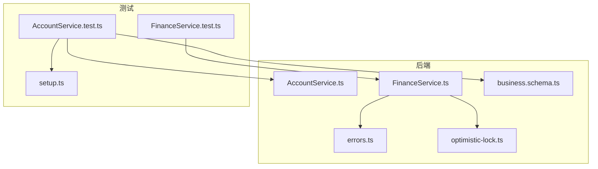
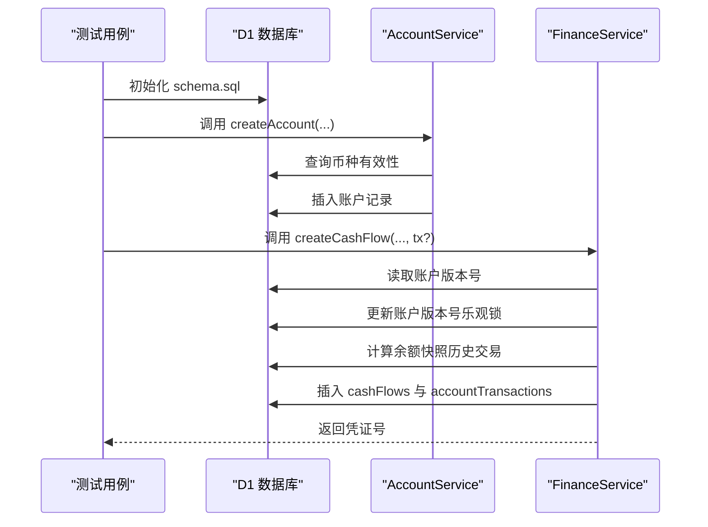
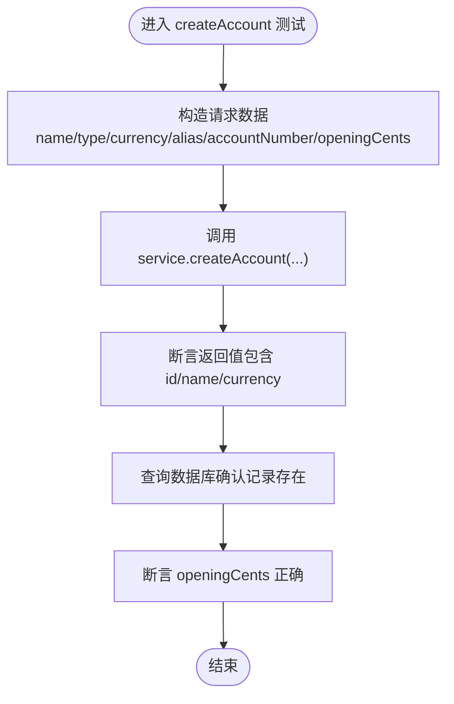
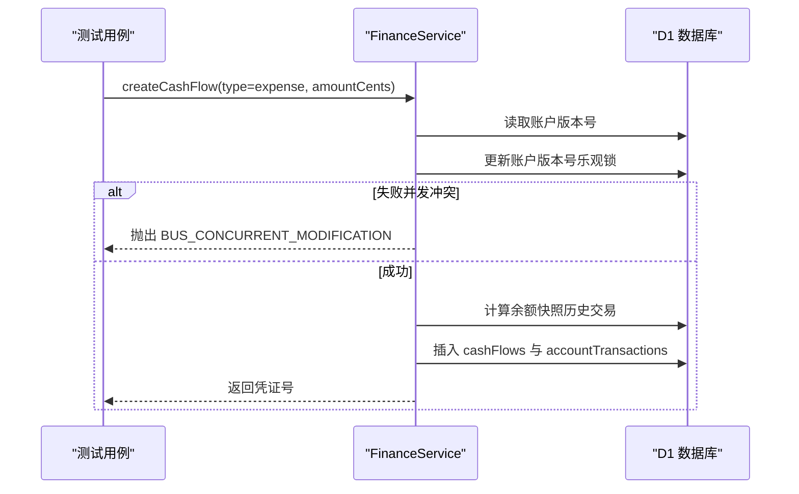
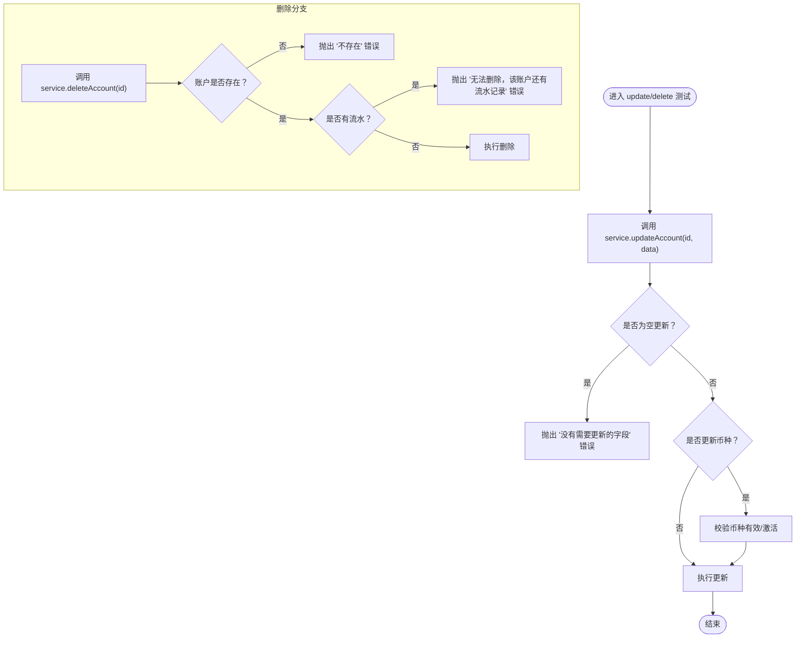
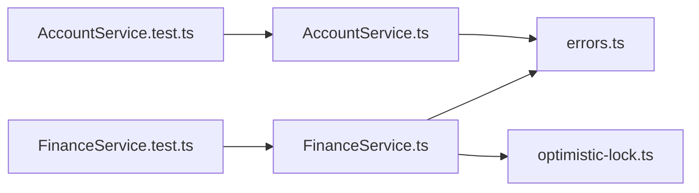

# 账户服务测试

<cite>
**本文引用的文件列表**
- [AccountService.ts](file://backend/src/services/AccountService.ts)
- [AccountService.test.ts](file://backend/test/services/AccountService.test.ts)
- [FinanceService.ts](file://backend/src/services/FinanceService.ts)
- [FinanceService.test.ts](file://backend/test/services/FinanceService.test.ts)
- [errors.ts](file://backend/src/utils/errors.ts)
- [optimistic-lock.ts](file://backend/src/utils/optimistic-lock.ts)
- [business.schema.ts](file://backend/src/schemas/business.schema.ts)
- [account.schema.ts](file://frontend/src/validations/account.schema.ts)
- [setup.ts](file://backend/test/setup.ts)
</cite>

## 目录
1. [引言](#引言)
2. [项目结构](#项目结构)
3. [核心组件](#核心组件)
4. [架构总览](#架构总览)
5. [详细组件分析](#详细组件分析)
6. [依赖关系分析](#依赖关系分析)
7. [性能考量](#性能考量)
8. [故障排查指南](#故障排查指南)
9. [结论](#结论)
10. [附录](#附录)

## 引言
本文件围绕 AccountService 的单元测试进行深入分析，重点解释账户创建、余额校验、状态变更等核心功能的测试用例设计思路；同时说明如何通过 Mock 数据库连接与事务管理验证账户操作的原子性与一致性。文档还结合代码示例展示对账户禁用、重复开户、余额不足等边界条件的覆盖策略，并总结与 FinanceService 的交互测试模式及并发账户操作测试的最佳实践。

## 项目结构
- 后端服务位于 backend/src，包含 AccountService、FinanceService 及相关工具与错误定义。
- 单元测试位于 backend/test/services，AccountService.test.ts 与 FinanceService.test.ts 分别覆盖账户与资金流相关逻辑。
- 前端侧的账户表单验证由前端 schema 定义，便于理解接口层的输入约束。

图表来源
- [AccountService.ts](file://backend/src/services/AccountService.ts#L1-L168)
- [AccountService.test.ts](file://backend/test/services/AccountService.test.ts#L1-L282)
- [FinanceService.ts](file://backend/src/services/FinanceService.ts#L1-L443)
- [FinanceService.test.ts](file://backend/test/services/FinanceService.test.ts#L1-L391)
- [errors.ts](file://backend/src/utils/errors.ts#L1-L228)
- [optimistic-lock.ts](file://backend/src/utils/optimistic-lock.ts#L1-L41)
- [business.schema.ts](file://backend/src/schemas/business.schema.ts#L160-L184)
- [setup.ts](file://backend/test/setup.ts#L1-L27)

章节来源
- [AccountService.test.ts](file://backend/test/services/AccountService.test.ts#L1-L282)
- [FinanceService.test.ts](file://backend/test/services/FinanceService.test.ts#L1-L391)

## 核心组件
- AccountService：负责账户的查询、创建、更新、删除，以及与币种有效性、期初余额、活动状态等的关联校验。
- FinanceService：负责凭证号生成、账户余额快照计算、资金流水创建与红冲、并发控制（乐观锁）等。
- 错误与验证：统一错误封装与 Zod 验证错误处理，保证测试中能稳定断言业务错误与验证错误。
- 乐观锁工具：提供版本号校验与递增，支撑并发场景下的数据一致性。

章节来源
- [AccountService.ts](file://backend/src/services/AccountService.ts#L1-L168)
- [FinanceService.ts](file://backend/src/services/FinanceService.ts#L1-L443)
- [errors.ts](file://backend/src/utils/errors.ts#L1-L228)
- [optimistic-lock.ts](file://backend/src/utils/optimistic-lock.ts#L1-L41)

## 架构总览
AccountService 与 FinanceService 在测试中通过 Cloudflare Workers 的 D1 数据库绑定进行隔离测试，使用 schema.sql 初始化表结构，再通过 drizzle ORM 对表进行 CRUD 操作。FinanceService 在创建流水时采用“版本号乐观锁”机制，确保同一账户的并发写入串行化，从而保障余额计算与流水记录的一致性。

图表来源
- [AccountService.test.ts](file://backend/test/services/AccountService.test.ts#L1-L282)
- [FinanceService.test.ts](file://backend/test/services/FinanceService.test.ts#L1-L391)
- [FinanceService.ts](file://backend/src/services/FinanceService.ts#L140-L229)

## 详细组件分析

### 账户创建测试设计
- 基础创建：验证创建成功后返回 id、名称、币种等字段，并断言数据库中对应记录存在且期初余额正确。
- 默认币种与默认期初余额：当未显式传入币种或期初余额时，应使用默认值。
- 币种有效性：无效币种或停用币种应触发“不存在”类业务错误。
- 排序与搜索：getAccounts 支持按名称排序与多字段模糊搜索，测试覆盖名称、别名、账号三类搜索路径。

图表来源
- [AccountService.test.ts](file://backend/test/services/AccountService.test.ts#L114-L179)
- [AccountService.ts](file://backend/src/services/AccountService.ts#L84-L116)

章节来源
- [AccountService.test.ts](file://backend/test/services/AccountService.test.ts#L114-L179)
- [AccountService.ts](file://backend/src/services/AccountService.ts#L84-L116)

### 余额校验与状态变更测试设计
- 余额快照计算：FinanceService 通过历史交易快照计算某时刻之前的余额，支持跨日期与跨时间戳的精确查找。
- 并发控制：创建流水时对账户版本号进行乐观锁更新，若失败则提示“并发冲突”，确保余额计算与写入的串行化。
- 红冲流程：支持对正常流水进行红冲，生成反向流水并标记原始流水为已冲正，测试覆盖重复红冲、对红冲记录再次红冲等边界。

图表来源
- [FinanceService.ts](file://backend/src/services/FinanceService.ts#L140-L229)
- [FinanceService.test.ts](file://backend/test/services/FinanceService.test.ts#L138-L214)

章节来源
- [FinanceService.ts](file://backend/src/services/FinanceService.ts#L140-L229)
- [FinanceService.test.ts](file://backend/test/services/FinanceService.test.ts#L138-L214)

### 状态变更与删除测试设计
- 更新账户：支持名称、别名、账号、币种、活动状态等字段更新；币种更新时需校验币种有效；空更新应触发“无需要更新字段”的业务错误。
- 删除账户：不存在的账户应报错；仍有流水记录的账户禁止删除；删除成功后数据库中不再存在该账户。

图表来源
- [AccountService.test.ts](file://backend/test/services/AccountService.test.ts#L181-L280)
- [AccountService.ts](file://backend/src/services/AccountService.ts#L118-L166)

章节来源
- [AccountService.test.ts](file://backend/test/services/AccountService.test.ts#L181-L280)
- [AccountService.ts](file://backend/src/services/AccountService.ts#L118-L166)

### 边界条件覆盖策略
- 账户禁用：测试中通过币种停用场景间接验证账户创建对币种有效性的严格要求；实际业务中可通过 active 字段控制账户启用状态。
- 重复开户：AccountService 不直接处理重复账户的唯一性约束，但可结合前端 schema 与路由层的 Zod 校验共同约束输入合法性。
- 余额不足：FinanceService 在支出类型流水创建时会基于余额快照进行校验，不足时抛出“余额不足”业务错误；测试中通过构造足够小的期初余额与较大金额的支出进行验证。

章节来源
- [AccountService.test.ts](file://backend/test/services/AccountService.test.ts#L160-L179)
- [FinanceService.test.ts](file://backend/test/services/FinanceService.test.ts#L138-L214)
- [FinanceService.ts](file://backend/src/services/FinanceService.ts#L170-L189)

### 数据构造工具与测试基座
- 测试基座：通过 schema.sql 初始化数据库结构，使用 drizzle 连接 D1，beforeAll 中完成 schema 应用与 service 实例化，beforeEach 中清理并插入默认币种，确保每条测试用例的独立性与可重复性。
- 数据构造：使用 uuid 生成主键，按需插入 accounts、categories、departments、sites、employees、currencies 等基础数据，满足跨服务测试依赖。

章节来源
- [AccountService.test.ts](file://backend/test/services/AccountService.test.ts#L1-L42)
- [FinanceService.test.ts](file://backend/test/services/FinanceService.test.ts#L1-L137)
- [setup.ts](file://backend/test/setup.ts#L1-L27)

### Zod 验证错误的模拟方式
- 前端表单验证：前端 account.schema.ts 使用 zod 定义字段长度、枚举、金额转换等规则，确保提交数据符合后端预期。
- 后端错误处理：errors.ts 提供 errorHandler 与 errorHandlerV2，将 ZodError 映射为标准响应格式，包含错误码与详情数组，便于测试断言。
- 测试策略：在 AccountService 层，主要通过业务错误（NOT_FOUND、DUPLICATE、VALIDATION_ERROR、BUSINESS_ERROR）进行断言；对于输入层面的 Zod 验证错误，通常由路由层拦截并在响应体中体现，测试中可通过断言状态码与错误码来验证。

章节来源
- [account.schema.ts](file://frontend/src/validations/account.schema.ts#L1-L28)
- [errors.ts](file://backend/src/utils/errors.ts#L60-L133)
- [business.schema.ts](file://backend/src/schemas/business.schema.ts#L160-L184)

### 与 FinanceService 的交互测试模式
- 凭证号生成：getNextVoucherNo 基于业务日期计数器生成唯一凭证号，测试断言格式与序列增长。
- 余额快照：getAccountBalanceBefore 依据交易日期与时间戳查找最近一次交易，作为余额快照基准；测试通过插入多笔交易并回溯验证。
- 并发控制：createCashFlow 与 reverseFlow 均通过更新 accounts.version 实现乐观锁，测试覆盖并发冲突场景与重复红冲场景。

章节来源
- [FinanceService.test.ts](file://backend/test/services/FinanceService.test.ts#L138-L391)
- [FinanceService.ts](file://backend/src/services/FinanceService.ts#L23-L116)

### 并发账户操作测试最佳实践
- 使用事务隔离：在需要强一致性的场景下，优先使用数据库事务包裹相关写操作，确保多步写入的原子性。
- 乐观锁策略：对关键写操作（如创建流水）采用版本号乐观锁，失败时提示“并发冲突”，引导客户端重试。
- 并发压力测试：通过 Vitest 并发任务模拟多线程/多进程写入，验证乐观锁与余额快照的正确性；失败时断言错误码与错误详情。
- 快照一致性：在创建流水前后分别读取余额快照，确保历史交易顺序与余额变化符合预期。

章节来源
- [FinanceService.ts](file://backend/src/services/FinanceService.ts#L140-L229)
- [optimistic-lock.ts](file://backend/src/utils/optimistic-lock.ts#L1-L41)

## 依赖关系分析
- AccountService 依赖 drizzle ORM 与数据库 schema，依赖错误封装模块进行业务错误抛出。
- FinanceService 依赖 drizzle ORM、余额快照计算、乐观锁工具与错误封装模块；在红冲流程中使用数据库事务保证原子性。
- 测试依赖 Cloudflare Workers 的 D1 绑定与 schema.sql 初始化脚本，确保每次测试在干净的数据库环境中运行。

图表来源
- [AccountService.ts](file://backend/src/services/AccountService.ts#L1-L168)
- [FinanceService.ts](file://backend/src/services/FinanceService.ts#L1-L443)
- [errors.ts](file://backend/src/utils/errors.ts#L1-L228)
- [optimistic-lock.ts](file://backend/src/utils/optimistic-lock.ts#L1-L41)
- [AccountService.test.ts](file://backend/test/services/AccountService.test.ts#L1-L282)
- [FinanceService.test.ts](file://backend/test/services/FinanceService.test.ts#L1-L391)

章节来源
- [AccountService.ts](file://backend/src/services/AccountService.ts#L1-L168)
- [FinanceService.ts](file://backend/src/services/FinanceService.ts#L1-L443)
- [errors.ts](file://backend/src/utils/errors.ts#L1-L228)
- [optimistic-lock.ts](file://backend/src/utils/optimistic-lock.ts#L1-L41)

## 性能考量
- 查询优化：getAccounts 使用左连接与排序，建议在高频查询字段上建立索引以提升性能。
- 写入优化：createCashFlow 与 reverseFlow 通过乐观锁与事务保证一致性，避免不必要的全表扫描。
- 测试性能：使用 schema.sql 一次性初始化，beforeEach 清理数据，减少重复建表开销。

## 故障排查指南
- 币种相关错误：当币种无效或停用时，AccountService 会抛出“不存在”类业务错误；FinanceService 在创建流水时也会因币种缺失而报错。排查时优先检查 currencies 表与币种激活状态。
- 并发冲突：乐观锁失败会返回“账户状态已更变（并发冲突）”错误；建议客户端重试并提示用户刷新页面。
- 余额不足：支出型流水创建时若余额不足，会返回“账户余额不足”错误；排查时核对期初余额与历史交易快照。
- 删除失败：账户仍有流水记录时无法删除；需先清理相关流水或迁移数据后再删除。

章节来源
- [AccountService.ts](file://backend/src/services/AccountService.ts#L84-L166)
- [FinanceService.ts](file://backend/src/services/FinanceService.ts#L140-L229)
- [errors.ts](file://backend/src/utils/errors.ts#L35-L56)

## 结论
AccountService.test.ts 通过完善的测试用例覆盖了账户创建、更新、删除与查询的核心路径，并结合 FinanceService 的余额快照与乐观锁机制，有效验证了账户操作的原子性与一致性。测试中对边界条件（币种无效、余额不足、并发冲突、删除限制）进行了充分覆盖，配合 schema 与错误处理模块，形成了从输入校验到业务错误处理的完整闭环。建议在后续扩展中继续强化并发场景的回归测试与性能监控。

## 附录
- 测试初始化流程：schema.sql 初始化 -> drizzle 连接 -> beforeAll 注册 service -> beforeEach 清理并插入默认币种。
- 与前端 schema 的协同：前端 account.schema.ts 与后端 business.schema.ts 的字段约束保持一致，有助于减少跨层数据不一致问题。

章节来源
- [AccountService.test.ts](file://backend/test/services/AccountService.test.ts#L1-L42)
- [FinanceService.test.ts](file://backend/test/services/FinanceService.test.ts#L1-L137)
- [account.schema.ts](file://frontend/src/validations/account.schema.ts#L1-L28)
- [business.schema.ts](file://backend/src/schemas/business.schema.ts#L160-L184)