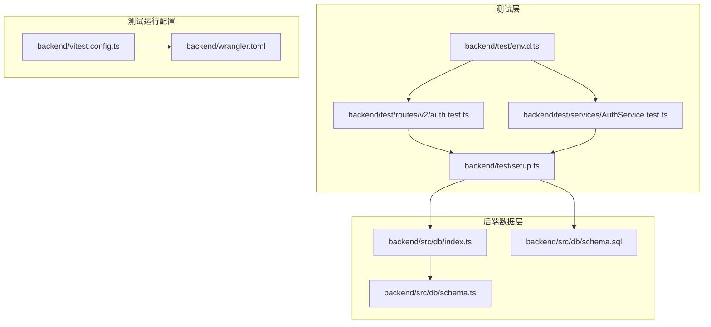
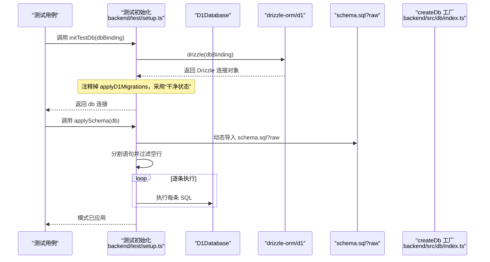
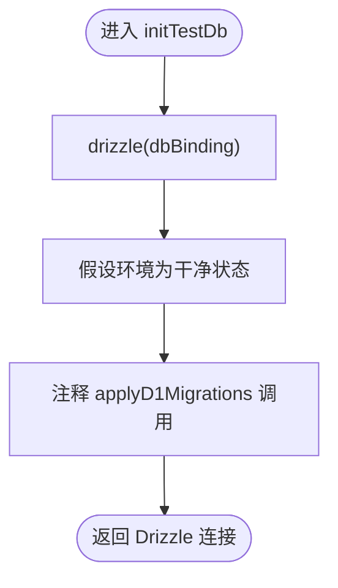
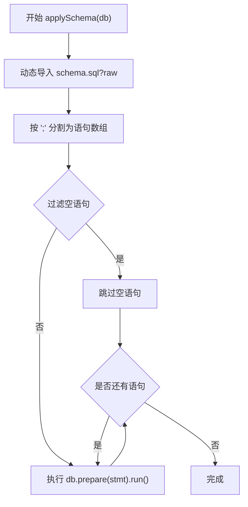
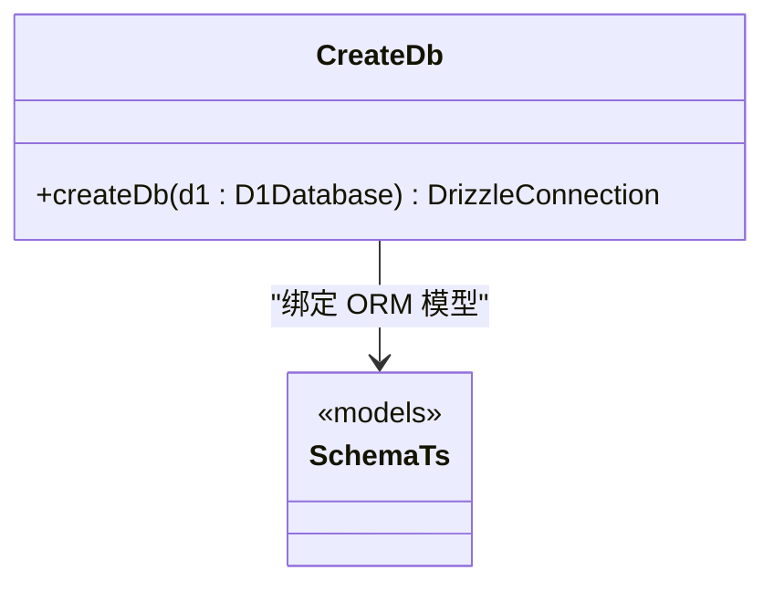
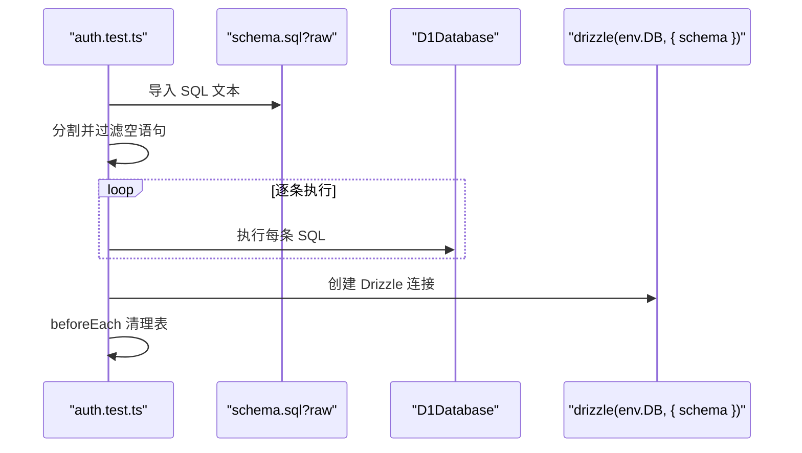
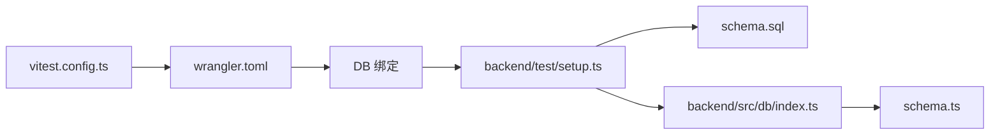

# 测试初始化

<cite>
**本文引用的文件列表**
- [backend/test/setup.ts](file://backend/test/setup.ts)
- [backend/src/db/index.ts](file://backend/src/db/index.ts)
- [backend/src/db/schema.ts](file://backend/src/db/schema.ts)
- [backend/src/db/schema.sql](file://backend/src/db/schema.sql)
- [backend/vitest.config.ts](file://backend/vitest.config.ts)
- [backend/wrangler.toml](file://backend/wrangler.toml)
- [backend/test/routes/v2/auth.test.ts](file://backend/test/routes/v2/auth.test.ts)
- [backend/test/services/AuthService.test.ts](file://backend/test/services/AuthService.test.ts)
- [backend/test/env.d.ts](file://backend/test/env.d.ts)
</cite>

## 目录
1. [引言](#引言)
2. [项目结构](#项目结构)
3. [核心组件](#核心组件)
4. [架构总览](#架构总览)
5. [详细组件分析](#详细组件分析)
6. [依赖关系分析](#依赖关系分析)
7. [性能考量](#性能考量)
8. [故障排查指南](#故障排查指南)
9. [结论](#结论)

## 引言
本文件聚焦于测试数据库初始化逻辑，系统性解析以下主题：
- initTestDb 函数如何通过 drizzle-orm/d1 绑定 D1Database 实例并返回 Drizzle ORM 数据库连接对象；
- applySchema 函数通过动态导入 schema.sql?raw 的方式执行 SQL 模式脚本，包括 SQL 语句分割、过滤空语句与逐条执行的流程；
- 在缺乏完整迁移运行器时直接应用模式的适用场景与局限性；
- 注释掉 applyD1Migrations 调用的原因；
- 测试环境“干净状态”的设计前提，以及其对测试可重复性与隔离性的保障。

## 项目结构
测试初始化相关的关键位置如下：
- 测试工具与初始化：backend/test/setup.ts
- 数据库连接封装：backend/src/db/index.ts
- ORM 模型定义：backend/src/db/schema.ts
- SQL 模式脚本：backend/src/db/schema.sql
- 测试运行配置：backend/vitest.config.ts、backend/wrangler.toml
- 具体测试用例：backend/test/routes/v2/auth.test.ts、backend/test/services/AuthService.test.ts
- 测试环境类型声明：backend/test/env.d.ts

图表来源
- [backend/test/setup.ts](file://backend/test/setup.ts#L1-L27)
- [backend/src/db/index.ts](file://backend/src/db/index.ts#L1-L7)
- [backend/src/db/schema.ts](file://backend/src/db/schema.ts#L1-L706)
- [backend/src/db/schema.sql](file://backend/src/db/schema.sql#L1-L678)
- [backend/vitest.config.ts](file://backend/vitest.config.ts#L1-L48)
- [backend/wrangler.toml](file://backend/wrangler.toml#L1-L48)
- [backend/test/routes/v2/auth.test.ts](file://backend/test/routes/v2/auth.test.ts#L1-L189)
- [backend/test/services/AuthService.test.ts](file://backend/test/services/AuthService.test.ts#L1-L282)
- [backend/test/env.d.ts](file://backend/test/env.d.ts#L1-L6)

章节来源
- [backend/test/setup.ts](file://backend/test/setup.ts#L1-L27)
- [backend/src/db/index.ts](file://backend/src/db/index.ts#L1-L7)
- [backend/src/db/schema.ts](file://backend/src/db/schema.ts#L1-L706)
- [backend/src/db/schema.sql](file://backend/src/db/schema.sql#L1-L678)
- [backend/vitest.config.ts](file://backend/vitest.config.ts#L1-L48)
- [backend/wrangler.toml](file://backend/wrangler.toml#L1-L48)
- [backend/test/routes/v2/auth.test.ts](file://backend/test/routes/v2/auth.test.ts#L1-L189)
- [backend/test/services/AuthService.test.ts](file://backend/test/services/AuthService.test.ts#L1-L282)
- [backend/test/env.d.ts](file://backend/test/env.d.ts#L1-L6)

## 核心组件
- initTestDb：将 D1Database 绑定到 drizzle-orm/d1，返回 Drizzle ORM 连接对象；同时注释了 applyD1Migrations 的调用，表明在当前测试策略下不使用迁移运行器，而是采用“干净状态”+直接应用 schema.sql 的方式。
- applySchema：通过动态导入 schema.sql?raw 获取 SQL 文本，按分号分割并过滤空语句，逐条执行以创建表结构与索引等。
- createDb：生产环境的数据库连接工厂，将 D1Database 与 schema.ts 中的 ORM 表模型绑定，供应用代码使用。

章节来源
- [backend/test/setup.ts](file://backend/test/setup.ts#L1-L27)
- [backend/src/db/index.ts](file://backend/src/db/index.ts#L1-L7)

## 架构总览
测试初始化的整体流程如下：

图表来源
- [backend/test/setup.ts](file://backend/test/setup.ts#L1-L27)
- [backend/src/db/index.ts](file://backend/src/db/index.ts#L1-L7)
- [backend/src/db/schema.sql](file://backend/src/db/schema.sql#L1-L678)

## 详细组件分析

### initTestDb：绑定 D1Database 并返回 Drizzle ORM 连接
- 输入：D1Database 绑定（来自测试运行器提供的 env.DB）。
- 处理：通过 drizzle(dbBinding) 创建 Drizzle ORM 连接对象。
- 设计要点：
  - 注释掉 applyD1Migrations(dbBinding, env.DB_MIGRATIONS)，明确当前测试策略不使用迁移运行器。
  - 假设测试环境为“干净状态”，即每次测试前先清空或重建表结构，从而避免迁移状态带来的不确定性。
- 输出：返回可用于测试的 Drizzle ORM 连接对象。

图表来源
- [backend/test/setup.ts](file://backend/test/setup.ts#L1-L27)

章节来源
- [backend/test/setup.ts](file://backend/test/setup.ts#L1-L27)

### applySchema：动态导入并执行 SQL 模式脚本
- 实现机制：
  - 使用动态导入 schema.sql?raw 获取 SQL 文本；
  - 将文本按分号分割，并过滤掉空字符串；
  - 对每个非空语句，通过 D1Database.prepare(statement).run() 逐条执行。
- 适用场景：
  - 单元测试或集成测试中快速建立“干净状态”的数据库结构；
  - 当迁移运行器不可用或不希望引入迁移复杂度时；
  - 需要频繁重置数据库状态的测试套件。
- 局限性：
  - 不包含迁移版本管理、回滚与依赖顺序控制；
  - 无法处理跨版本的结构变更与数据迁移；
  - 若 schema.sql 与实际 schema.ts 存在差异，可能导致运行时错误。
- 与生产环境的关系：
  - 生产环境通常使用迁移运行器与 schema.ts 定义的 ORM 模型进行同步；
  - 测试环境为了速度与可控性，选择直接应用 SQL 脚本。

图表来源
- [backend/test/setup.ts](file://backend/test/setup.ts#L20-L26)
- [backend/src/db/schema.sql](file://backend/src/db/schema.sql#L1-L678)

章节来源
- [backend/test/setup.ts](file://backend/test/setup.ts#L20-L26)

### createDb：生产环境数据库连接工厂
- 输入：D1Database 实例。
- 处理：将 D1Database 与 schema.ts 中的 ORM 表模型绑定，返回 Drizzle ORM 连接对象。
- 用途：应用代码在生产环境中使用该工厂创建数据库连接。

图表来源
- [backend/src/db/index.ts](file://backend/src/db/index.ts#L1-L7)
- [backend/src/db/schema.ts](file://backend/src/db/schema.ts#L1-L706)

章节来源
- [backend/src/db/index.ts](file://backend/src/db/index.ts#L1-L7)
- [backend/src/db/schema.ts](file://backend/src/db/schema.ts#L1-L706)

### 测试用例中的模式应用与“干净状态”
- 在具体测试文件中，常见做法是在 beforeAll 钩子中：
  - 通过 schema.sql?raw 动态导入 SQL；
  - 分割并逐条执行，确保测试开始前数据库处于预期结构；
  - 在 beforeEach 钩子中清理关键表（如 employees、sessions、positions），保证单测之间隔离。
- 这种模式与 initTestDb 的“干净状态”假设一致，确保每次测试都从零开始。

图表来源
- [backend/test/routes/v2/auth.test.ts](file://backend/test/routes/v2/auth.test.ts#L1-L189)
- [backend/test/services/AuthService.test.ts](file://backend/test/services/AuthService.test.ts#L1-L282)

章节来源
- [backend/test/routes/v2/auth.test.ts](file://backend/test/routes/v2/auth.test.ts#L1-L189)
- [backend/test/services/AuthService.test.ts](file://backend/test/services/AuthService.test.ts#L1-L282)

## 依赖关系分析
- 测试初始化依赖：
  - D1Database 绑定（由测试运行器提供，来自 vitest.config.ts 的 Miniflare 配置与 wrangler.toml 的 D1 绑定）；
  - schema.sql 作为模式脚本来源；
  - schema.ts 作为 ORM 模型定义（用于 createDb 工厂与测试中 drizzle(env.DB, { schema }) 的模型绑定）。
- 运行时配置：
  - vitest.config.ts 启用 @cloudflare/vitest-pool-workers，Miniflare 提供 D1/ KV/ 绑定服务；
  - wrangler.toml 定义 DB 绑定名称与数据库 ID，供测试运行器注入到 env.DB。

图表来源
- [backend/vitest.config.ts](file://backend/vitest.config.ts#L1-L48)
- [backend/wrangler.toml](file://backend/wrangler.toml#L1-L48)
- [backend/test/setup.ts](file://backend/test/setup.ts#L1-L27)
- [backend/src/db/index.ts](file://backend/src/db/index.ts#L1-L7)
- [backend/src/db/schema.ts](file://backend/src/db/schema.ts#L1-L706)
- [backend/src/db/schema.sql](file://backend/src/db/schema.sql#L1-L678)

章节来源
- [backend/vitest.config.ts](file://backend/vitest.config.ts#L1-L48)
- [backend/wrangler.toml](file://backend/wrangler.toml#L1-L48)
- [backend/test/setup.ts](file://backend/test/setup.ts#L1-L27)
- [backend/src/db/index.ts](file://backend/src/db/index.ts#L1-L7)
- [backend/src/db/schema.ts](file://backend/src/db/schema.ts#L1-L706)
- [backend/src/db/schema.sql](file://backend/src/db/schema.sql#L1-L678)

## 性能考量
- 直接执行 schema.sql 的方式在测试中具备以下优势：
  - 快速建立结构，减少迁移运行器启动与解析开销；
  - 适合小规模、稳定的模式演进；
- 局限性：
  - 缺少迁移版本管理与回滚能力；
  - 对大型或复杂迁移场景，维护成本较高；
  - 与 schema.ts 的一致性需要严格管理，避免运行时差异导致失败。

[本节为通用建议，无需特定文件来源]

## 故障排查指南
- 症状：测试执行时报错，提示表不存在或列不匹配
  - 可能原因：applySchema 未正确执行或语句顺序不当
  - 排查步骤：
    - 确认 schema.sql?raw 导入成功且内容完整；
    - 检查分割与过滤逻辑是否遗漏分号或空语句；
    - 确保执行顺序与外键约束要求一致（例如先建表再建索引）。
- 症状：测试间相互影响，数据残留
  - 可能原因：未在 beforeEach 中清理相关表
  - 排查步骤：
    - 在 beforeEach 中显式删除关键表（如 employees、sessions、positions）；
    - 确保每次测试都从“干净状态”开始。
- 症状：生产与测试数据库不一致
  - 可能原因：schema.sql 与 schema.ts 发生漂移
  - 排查步骤：
    - 对比 schema.ts 与 schema.sql 的差异；
    - 如需迁移，优先完善迁移运行器，避免直接修改 schema.sql。

章节来源
- [backend/test/setup.ts](file://backend/test/setup.ts#L1-L27)
- [backend/test/routes/v2/auth.test.ts](file://backend/test/routes/v2/auth.test.ts#L1-L189)
- [backend/test/services/AuthService.test.ts](file://backend/test/services/AuthService.test.ts#L1-L282)

## 结论
- initTestDb 通过 drizzle-orm/d1 将 D1Database 绑定为 Drizzle ORM 连接对象，并采用“干净状态”策略，注释掉 applyD1Migrations 调用，避免引入迁移运行器的复杂性。
- applySchema 通过动态导入 schema.sql?raw，实现 SQL 语句的分割、过滤与逐条执行，满足测试快速建立结构的需求。
- 在缺乏完整迁移运行器时，直接应用模式适用于单元与集成测试场景，但需注意与 schema.ts 的一致性与执行顺序。
- “干净状态”的设计前提有效保障了测试的可重复性与隔离性，建议在 beforeEach 中清理关键表，确保测试互不干扰。