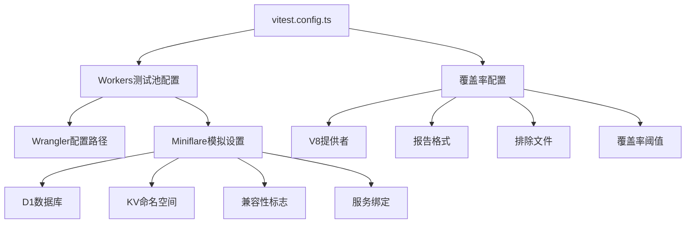
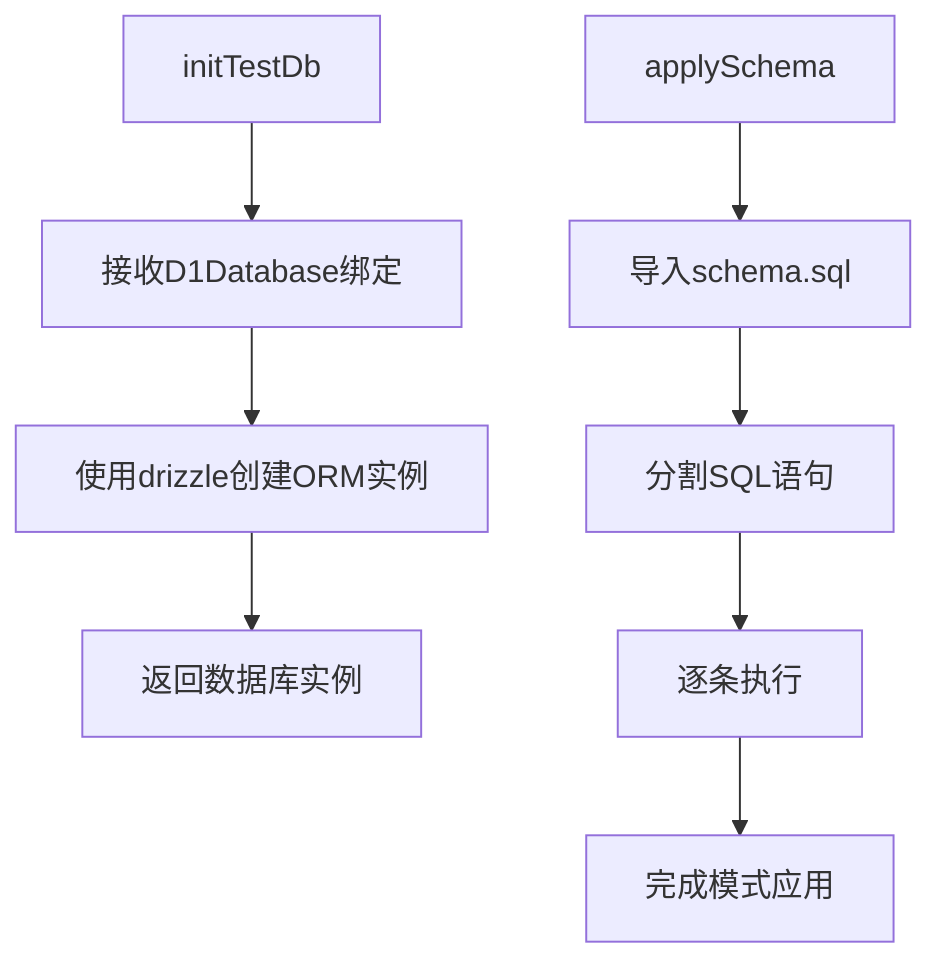

# 测试基础设施

<cite>
**本文档中引用的文件**  
- [vitest.config.ts](file://backend/vitest.config.ts)
- [test/setup.ts](file://backend/test/setup.ts)
- [package.json](file://backend/package.json)
- [wrangler.toml](file://backend/wrangler.toml)
- [src/db/schema.sql](file://backend/src/db/schema.sql)
- [src/db/schema.ts](file://backend/src/db/schema.ts)
- [src/types.ts](file://backend/src/types.ts)
- [test/routes/v2/auth.test.ts](file://backend/test/routes/v2/auth.test.ts)
- [test/services/AuthService.test.ts](file://backend/test/services/AuthService.test.ts)
</cite>

## 目录
1. [简介](#简介)
2. [测试环境配置](#测试环境配置)
3. [测试初始化机制](#测试初始化机制)
4. [测试隔离与环境变量管理](#测试隔离与环境变量管理)
5. [测试文件匹配与执行规则](#测试文件匹配与执行规则)
6. [测试快照与Mock管理](#测试快照与mock管理)
7. [测试性能优化](#测试性能优化)
8. [最佳实践总结](#最佳实践总结)

## 简介
本项目采用Vitest作为主要的测试框架，针对Cloudflare Workers环境进行了深度集成和优化。测试基础设施设计旨在确保测试的可重复性、独立性和高效性，通过vitest.config.ts配置测试环境、覆盖率报告、Cloudflare兼容性设置等核心功能。测试代码分布在test目录下，包含路由、服务和工具函数的单元测试与集成测试。setup.ts文件负责测试数据库的初始化、迁移和数据准备，确保每个测试在干净、一致的环境中运行。通过环境变量隔离开发、测试和生产配置，实现了安全的测试执行。测试框架支持并行执行、缓存和覆盖率分析，优化了测试性能和开发体验。

## 测试环境配置

### Vitest核心配置
项目通过`vitest.config.ts`文件定义了完整的测试环境配置，使用`@cloudflare/vitest-pool-workers`插件实现对Cloudflare Workers环境的模拟。配置中定义了Workers测试池的选项，包括使用Wrangler配置文件`wrangler.toml`来管理环境绑定。测试覆盖率由`@vitest/coverage-v8`提供支持，生成文本、JSON和HTML格式的报告，便于分析和集成到CI/CD流程中。

**Diagram sources**
- [vitest.config.ts](file://backend/vitest.config.ts#L7-L47)

**Section sources**
- [vitest.config.ts](file://backend/vitest.config.ts#L1-L47)

### Cloudflare Workers兼容性配置
为了准确模拟Cloudflare Workers的运行环境，配置中启用了`nodejs_compat`兼容性标志，并声明了D1数据库和KV命名空间的绑定。D1数据库用于持久化数据存储，KV命名空间用于会话管理。服务绑定机制允许将`EMAIL_SERVICE`等外部服务模拟为返回预定义响应的函数，确保测试的稳定性和可预测性。这种配置使得测试可以在本地环境中精确复现生产环境的行为，而无需依赖真实的Cloudflare服务。

**Section sources**
- [vitest.config.ts](file://backend/vitest.config.ts#L11-L19)
- [wrangler.toml](file://backend/wrangler.toml#L6-L17)

### 覆盖率报告与阈值
测试框架集成了详细的覆盖率分析功能，配置了行、函数、分支和语句的覆盖率阈值（分别为70%、70%、65%和70%）。这些阈值作为代码质量的基准，确保新代码和修改的代码达到最低的测试覆盖要求。覆盖率报告排除了`node_modules`、`test`目录、脚本文件和类型定义文件，专注于业务逻辑的覆盖情况。通过`test:coverage`脚本可以运行测试并生成覆盖率报告，帮助开发者识别未充分测试的代码路径。

**Section sources**
- [vitest.config.ts](file://backend/vitest.config.ts#L22-L40)
- [package.json](file://backend/package.json#L25-L26)

## 测试初始化机制

### 测试数据库初始化
`setup.ts`文件中的`initTestDb`函数负责初始化测试数据库。该函数接收一个D1Database绑定，使用Drizzle ORM创建数据库实例。虽然注释中提到了`applyD1Migrations`，但当前实现假设测试环境是全新的，不执行迁移脚本。这简化了测试设置，确保每次测试运行都从一个干净的状态开始。数据库初始化是所有集成测试的基础，为数据操作提供了可靠的环境。

**Diagram sources**
- [test/setup.ts](file://backend/test/setup.ts#L7-L18)
- [test/setup.ts](file://backend/test/setup.ts#L20-L26)

**Section sources**
- [test/setup.ts](file://backend/test/setup.ts#L1-L26)

### 模式应用与数据准备
除了初始化数据库实例，`setup.ts`还提供了`applySchema`函数，用于直接应用`schema.sql`文件中的数据库模式。该函数读取SQL文件，将其分割成独立的语句，并逐条执行，从而在测试数据库中创建所有必需的表和索引。在实际的测试文件中，如`auth.test.ts`，`beforeAll`钩子会调用此函数来设置测试数据。通过`beforeEach`钩子，每个测试用例执行前都会清空相关表，确保测试之间的数据隔离和独立性。

**Section sources**
- [test/setup.ts](file://backend/test/setup.ts#L20-L26)
- [test/routes/v2/auth.test.ts](file://backend/test/routes/v2/auth.test.ts#L15-L27)

## 测试隔离与环境变量管理

### 环境隔离策略
项目通过环境变量实现了测试、开发和生产的严格隔离。在`wrangler.toml`中，`[env.dev.vars]`部分定义了开发环境的专用变量，如`AUTH_JWT_SECRET`。测试环境继承这些配置，并可以在运行时进行覆盖。例如，在`auth.test.ts`中，测试用例创建了一个包含`AUTH_JWT_SECRET`的`testEnv`对象，用于覆盖默认值。这种机制确保了敏感信息（如生产环境的JWT密钥）不会在测试中被意外使用，同时允许测试针对特定配置进行验证。

**Section sources**
- [wrangler.toml](file://backend/wrangler.toml#L42-L48)
- [test/routes/v2/auth.test.ts](file://backend/test/routes/v2/auth.test.ts#L55-L58)

### 全局钩子与上下文管理
Vitest的`beforeAll`和`beforeEach`全局钩子被广泛用于管理测试生命周期。`beforeAll`在测试文件的所有用例执行前运行一次，通常用于昂贵的初始化操作，如应用数据库模式。`beforeEach`在每个测试用例执行前运行，用于重置数据状态。此外，测试通过`createExecutionContext`和`waitOnExecutionContext`模拟Workers的执行上下文，确保异步操作（如日志记录、邮件发送）能被正确处理和等待，从而保证测试的完整性和准确性。

**Section sources**
- [test/routes/v2/auth.test.ts](file://backend/test/routes/v2/auth.test.ts#L15-L27)
- [test/services/AuthService.test.ts](file://backend/test/services/AuthService.test.ts#L26-L31)

## 测试文件匹配与执行规则

### 测试文件组织
测试文件遵循清晰的组织结构，位于`test`目录下，按`routes`和`services`进行分类。路由测试进一步按API版本（如`v2`）组织。文件命名以`.test.ts`结尾，这是Vitest默认的测试文件匹配模式。这种结构化的组织方式便于定位和维护测试代码。`V2_MIGRATION_GUIDE.md`文档详细说明了从旧版API到v2的测试迁移步骤，包括更新导入路径和响应格式断言，确保了测试的持续有效性。

**Section sources**
- [test/routes/v2/auth.test.ts](file://backend/test/routes/v2/auth.test.ts)
- [test/services/AuthService.test.ts](file://backend/test/services/AuthService.test.ts)
- [test/V2_MIGRATION_GUIDE.md](file://backend/test/V2_MIGRATION_GUIDE.md)

### 测试执行脚本
`package.json`中的`scripts`部分定义了多个测试相关的命令。`test`脚本直接运行Vitest，`test:coverage`运行测试并生成覆盖率报告，`test:coverage:ui`则启动带有覆盖率UI的Vitest界面。这些脚本简化了测试的执行，开发者可以轻松地在不同模式下运行测试。通过这些脚本，团队可以将测试集成到开发工作流和CI/CD管道中，确保代码质量。

**Section sources**
- [package.json](file://backend/package.json#L24-L26)

## 测试快照与Mock管理

### Mock服务注册
项目使用Vitest的`vi.mock`功能来模拟外部依赖。在`AuthService.test.ts`中，`utils/auth.js`模块被模拟，其`verifyTotp`函数被替换为始终返回`true`的实现。同时，`EmailService`被模拟为一个包含`vi.fn()`的虚拟对象，以便断言其方法是否被调用。这种细粒度的模拟允许测试专注于被测单元的逻辑，而不受外部服务不稳定或副作用的影响。

**Section sources**
- [test/services/AuthService.test.ts](file://backend/test/services/AuthService.test.ts#L14-L20)

### 自定义模块别名
`vitest.config.ts`中的`resolve.alias`配置将`mimetext`模块别名为`test/mocks/mimetext.ts`。这个自定义的mock模块提供了一个空的`createMimeMessage`函数，用于模拟邮件构建过程。通过模块别名，项目可以在不修改源代码的情况下，将生产依赖无缝替换为测试专用的模拟实现，增强了测试的灵活性和可维护性。

**Section sources**
- [vitest.config.ts](file://backend/vitest.config.ts#L42-L46)
- [test/mocks/mimetext.ts](file://backend/test/mocks/mimetext.ts)

## 测试性能优化

### 并行执行与缓存
Vitest默认支持并行执行测试文件，显著缩短了整体测试时间。通过`fullyParallel`配置（在Playwright配置中体现），多个测试可以在独立的进程中同时运行。Vitest还利用文件系统缓存来避免重复解析和编译，只有在文件发生变化时才会重新处理。这些优化措施使得即使在大型代码库中，测试也能快速反馈，提升了开发效率。

**Section sources**
- [frontend/playwright.config.ts](file://frontend/playwright.config.ts#L17)

### 异步操作管理
测试通过`executionCtx.waitUntil`捕获并等待异步任务（如`waitUntil`注册的任务），确保所有后台操作（如审计日志写入、邮件发送）在测试结束前完成。这种方法避免了因异步操作未完成而导致的测试失败，保证了测试结果的可靠性。通过显式等待这些任务，测试能够更真实地模拟生产环境中的请求处理流程。

**Section sources**
- [test/routes/v2/auth.test.ts](file://backend/test/routes/v2/auth.test.ts#L60-L66)

## 最佳实践总结
本项目的测试基础设施体现了现代Web应用测试的最佳实践。通过精确的Cloudflare环境模拟、严格的测试隔离、全面的覆盖率监控和高效的执行策略，构建了一个健壮、可靠的测试体系。关键的最佳实践包括：使用`beforeEach`钩子确保数据独立性、通过环境变量管理配置隔离、利用模块别名和`vi.mock`进行依赖注入、以及通过全局钩子管理测试生命周期。这些实践共同确保了代码的高质量和系统的稳定性，为持续交付提供了坚实的基础。