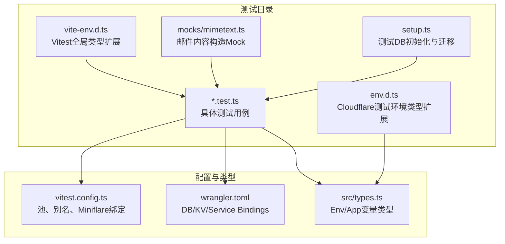
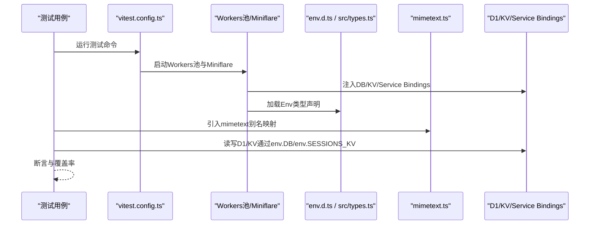
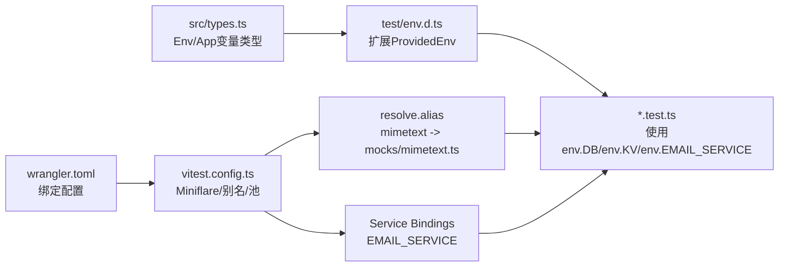

# 测试环境管理

<cite>
**本文引用的文件**
- [backend/test/env.d.ts](file://backend/test/env.d.ts)
- [backend/test/vite-env.d.ts](file://backend/test/vite-env.d.ts)
- [backend/vitest.config.ts](file://backend/vitest.config.ts)
- [backend/test/mocks/mimetext.ts](file://backend/test/mocks/mimetext.ts)
- [backend/test/setup.ts](file://backend/test/setup.ts)
- [backend/src/types.ts](file://backend/src/types.ts)
- [backend/wrangler.toml](file://backend/wrangler.toml)
- [backend/src/services/EmailService.ts](file://backend/src/services/EmailService.ts)
- [backend/test/routes/v2/auth.test.ts](file://backend/test/routes/v2/auth.test.ts)
- [backend/package.json](file://backend/package.json)
</cite>

## 目录
1. [引言](#引言)
2. [项目结构](#项目结构)
3. [核心组件](#核心组件)
4. [架构总览](#架构总览)
5. [详细组件分析](#详细组件分析)
6. [依赖关系分析](#依赖关系分析)
7. [性能与稳定性考量](#性能与稳定性考量)
8. [故障排查指南](#故障排查指南)
9. [结论](#结论)

## 引言
本文件聚焦于后端测试环境的类型定义、配置与Mock协作机制，解释以下要点：
- env.d.ts如何为Cloudflare测试环境绑定（如D1Database、KVNamespace）提供全局类型声明，确保测试代码的类型安全。
- vite-env.d.ts如何扩展Vitest的全局类型，集成自定义断言与测试上下文类型。
- 结合vitest.config.ts中的alias配置，说明mimetext模块别名的映射机制及其在测试中替代真实邮件发送服务的用途。
- 整个测试环境如何通过类型定义、配置文件和Mock服务协同工作，构建一个稳定、可预测且高度模拟生产环境的测试运行时。

## 项目结构
后端测试相关的关键位置如下：
- 类型与环境声明：backend/test/env.d.ts、backend/test/vite-env.d.ts
- 测试运行时配置：backend/vitest.config.ts
- Mock服务：backend/test/mocks/mimetext.ts
- 测试初始化与数据库准备：backend/test/setup.ts
- 生产环境绑定与变量：backend/wrangler.toml
- 应用类型定义：backend/src/types.ts
- 邮件服务调用示例：backend/test/routes/v2/auth.test.ts
- 依赖与脚本：backend/package.json

图表来源
- [backend/test/env.d.ts](file://backend/test/env.d.ts#L1-L6)
- [backend/test/vite-env.d.ts](file://backend/test/vite-env.d.ts#L1-L7)
- [backend/vitest.config.ts](file://backend/vitest.config.ts#L1-L48)
- [backend/test/mocks/mimetext.ts](file://backend/test/mocks/mimetext.ts#L1-L10)
- [backend/test/setup.ts](file://backend/test/setup.ts#L1-L27)
- [backend/wrangler.toml](file://backend/wrangler.toml#L1-L48)
- [backend/src/types.ts](file://backend/src/types.ts#L1-L109)

章节来源
- [backend/test/env.d.ts](file://backend/test/env.d.ts#L1-L6)
- [backend/test/vite-env.d.ts](file://backend/test/vite-env.d.ts#L1-L7)
- [backend/vitest.config.ts](file://backend/vitest.config.ts#L1-L48)
- [backend/test/mocks/mimetext.ts](file://backend/test/mocks/mimetext.ts#L1-L10)
- [backend/test/setup.ts](file://backend/test/setup.ts#L1-L27)
- [backend/wrangler.toml](file://backend/wrangler.toml#L1-L48)
- [backend/src/types.ts](file://backend/src/types.ts#L1-L109)
- [backend/package.json](file://backend/package.json#L1-L70)

## 核心组件
- Cloudflare测试环境类型扩展（env.d.ts）
  - 通过模块声明扩展cloudflare:test提供的ProvidedEnv，使其包含应用的Env类型字段，从而在测试中获得DB、KV、Fetcher等绑定的类型推断。
- Vitest全局类型扩展（vite-env.d.ts）
  - 声明对.sql?raw资源的类型支持，便于在测试中以字符串形式导入SQL文件，提升迁移与初始化流程的类型安全。
- Vitest配置与别名（vitest.config.ts）
  - 使用@cloudflare/vitest-pool-workers定义Workers测试池，并通过Miniflare注入D1、KV、Service Bindings。
  - 通过resolve.alias将mimetext映射到测试目录下的Mock实现，使业务代码在测试中无需真实邮件服务即可完成编译与运行。
- Mock邮件服务（mimetext.ts）
  - 提供createMimeMessage返回一个最小可用的Mock对象，满足业务代码对邮件内容构造的需求，避免真实网络调用。
- 测试初始化（setup.ts）
  - 提供initTestDb与applySchema，用于在测试前准备DB结构或执行迁移，保证测试数据隔离与一致性。
- 生产环境绑定（wrangler.toml）
  - 定义DB、KV、R2、Service Bindings等，为Miniflare在测试中提供与生产一致的绑定名称与类型。
- 应用类型定义（src/types.ts）
  - 统一声明Env接口，包括DB、KV、Fetcher等，确保env.d.ts与实际代码一致。

章节来源
- [backend/test/env.d.ts](file://backend/test/env.d.ts#L1-L6)
- [backend/test/vite-env.d.ts](file://backend/test/vite-env.d.ts#L1-L7)
- [backend/vitest.config.ts](file://backend/vitest.config.ts#L1-L48)
- [backend/test/mocks/mimetext.ts](file://backend/test/mocks/mimetext.ts#L1-L10)
- [backend/test/setup.ts](file://backend/test/setup.ts#L1-L27)
- [backend/wrangler.toml](file://backend/wrangler.toml#L1-L48)
- [backend/src/types.ts](file://backend/src/types.ts#L1-L109)

## 架构总览
测试运行时通过Vitest Workers池与Miniflare在本地模拟Cloudflare运行时，结合类型声明与别名映射，形成“类型安全 + 可预测 + 无外部依赖”的测试闭环。

图表来源
- [backend/vitest.config.ts](file://backend/vitest.config.ts#L1-L48)
- [backend/test/env.d.ts](file://backend/test/env.d.ts#L1-L6)
- [backend/src/types.ts](file://backend/src/types.ts#L1-L109)
- [backend/test/mocks/mimetext.ts](file://backend/test/mocks/mimetext.ts#L1-L10)

## 详细组件分析

### env.d.ts：为Cloudflare测试环境绑定提供全局类型声明
- 目标
  - 在cloudflare:test模块中扩展ProvidedEnv，使其具备与应用Env相同的键值（如DB、SESSIONS_KV、EMAIL_SERVICE等），从而在测试中通过env访问这些绑定时获得完整的类型推断。
- 关键点
  - 与src/types.ts中的Env保持一致，确保env.d.ts不会引入不匹配的类型。
  - 通过模块声明的方式，不改变运行时行为，仅增强TypeScript类型检查。
- 影响范围
  - 所有使用cloudflare:test的测试文件均可获得DB、KV、Fetcher等类型的自动补全与错误提示。

章节来源
- [backend/test/env.d.ts](file://backend/test/env.d.ts#L1-L6)
- [backend/src/types.ts](file://backend/src/types.ts#L1-L109)

### vite-env.d.ts：扩展Vitest全局类型与资源导入类型
- 目标
  - 为.sql?raw资源提供默认导出类型，使得在测试中可以安全地导入SQL文件字符串，用于初始化或迁移。
- 关键点
  - 通过declare module '*.sql?raw'声明，配合import时的?raw查询参数，避免手动解析SQL文件带来的类型风险。
- 实际用途
  - 在测试初始化阶段（如setup.ts）或测试用例中（如auth.test.ts）导入schema.sql或迁移SQL，进行数据库结构准备。

章节来源
- [backend/test/vite-env.d.ts](file://backend/test/vite-env.d.ts#L1-L7)

### vitest.config.ts：池、别名与Miniflare绑定
- 目标
  - 配置Workers测试池、Miniflare选项、Service Bindings、覆盖率与路径别名。
- 关键点
  - poolOptions.workers.wrangler：指向wrangler.toml，确保Miniflare加载与生产一致的绑定。
  - poolOptions.workers.miniflare：显式声明D1、KV、兼容标志与Service Bindings；其中EMAIL_SERVICE绑定到一个简单响应的函数，用于测试中替代真实邮件Worker。
  - resolve.alias：将mimetext映射到测试目录下的Mock实现，使业务代码在测试中无需真实邮件服务即可编译。
- 影响范围
  - 所有测试用例在启动时都会获得与生产一致的Miniflare运行时，同时具备Mock邮件能力。

章节来源
- [backend/vitest.config.ts](file://backend/vitest.config.ts#L1-L48)
- [backend/wrangler.toml](file://backend/wrangler.toml#L1-L48)

### mimetext模块别名映射与Mock服务
- 目标
  - 在测试中用Mock替代真实邮件发送逻辑，避免网络调用与外部依赖。
- 机制
  - 通过resolve.alias将mimetext映射到backend/test/mocks/mimetext.ts。
  - Mock实现提供createMimeMessage，返回一个最小可用的对象，包含setSender、setRecipient、setSubject、addMessage、asRaw等方法，asRaw返回固定的字符串，满足业务代码对邮件内容构造的调用链。
- 适用场景
  - 当业务代码在测试中需要构造邮件内容但不需要真正发送时，别名映射确保编译通过且运行时行为可预测。
- 注意事项
  - 该Mock仅覆盖内容构造部分，不替代EmailService的网络调用逻辑；EmailService仍会尝试通过EMAIL_SERVICE发送，但Miniflare已将其绑定为简单响应函数，便于测试断言。

章节来源
- [backend/vitest.config.ts](file://backend/vitest.config.ts#L41-L47)
- [backend/test/mocks/mimetext.ts](file://backend/test/mocks/mimetext.ts#L1-L10)

### 测试初始化与数据库准备（setup.ts）
- 目标
  - 在测试前准备数据库结构或执行迁移，确保每个测试用例在干净、一致的环境下运行。
- 关键点
  - initTestDb：接受D1Database绑定，返回drizzle实例，便于在测试中进行数据操作。
  - applySchema：通过导入schema.sql?raw并逐条执行SQL语句，快速建立测试所需的表结构。
- 与Miniflare的协作
  - Miniflare注入DB绑定，测试通过env.DB访问；setup.ts在测试前执行applySchema，确保结构就绪。

章节来源
- [backend/test/setup.ts](file://backend/test/setup.ts#L1-L27)

### 生产环境绑定与变量（wrangler.toml）
- 目标
  - 定义与生产一致的DB、KV、R2、Service Bindings等，确保测试与生产环境在绑定层面保持一致。
- 关键点
  - [[d1_databases]]、[[kv_namespaces]]、[[r2_buckets]]、[[services]]等配置项，与env.d.ts与src/types.ts中的Env键名一一对应。
- 与测试的关系
  - vitest.config.ts通过wrangler指向同一配置文件，使Miniflare在测试中加载相同的绑定名称与类型。

章节来源
- [backend/wrangler.toml](file://backend/wrangler.toml#L1-L48)

### EmailService与测试交互（示例）
- 目标
  - 展示测试如何通过Miniflare的Service Bindings与Mock实现协同工作。
- 关键点
  - EmailService构造函数接收包含EMAIL_SERVICE与可选EMAIL_TOKEN的env对象。
  - 在测试中，通过vitest.config.ts的serviceBindings将EMAIL_SERVICE绑定为一个返回固定JSON的函数，从而避免真实邮件Worker。
  - 测试用例auth.test.ts通过app.request发起HTTP请求，EmailService在运行时通过env.EMAIL_SERVICE.fetch调用，测试断言其返回的成功状态。
- 类型保障
  - env.d.ts扩展ProvidedEnv，使env.EMAIL_SERVICE具有Fetcher类型，确保fetch调用的类型安全。

章节来源
- [backend/src/services/EmailService.ts](file://backend/src/services/EmailService.ts#L1-L146)
- [backend/test/routes/v2/auth.test.ts](file://backend/test/routes/v2/auth.test.ts#L1-L189)
- [backend/vitest.config.ts](file://backend/vitest.config.ts#L11-L19)
- [backend/test/env.d.ts](file://backend/test/env.d.ts#L1-L6)

## 依赖关系分析
- 类型依赖
  - env.d.ts依赖src/types.ts中的Env定义，确保测试环境的ProvidedEnv与应用Env一致。
- 运行时依赖
  - vitest.config.ts依赖wrangler.toml中的绑定配置，确保Miniflare加载正确的DB/KV/Service Bindings。
- 模块别名依赖
  - vitest.config.ts的resolve.alias将mimetext映射到测试目录下的Mock实现，影响业务代码在测试中的模块解析。
- 测试用例依赖
  - 具体测试用例（如auth.test.ts）依赖env.DB、env.SESSIONS_KV等绑定，以及EmailService的Service Bindings。

图表来源
- [backend/src/types.ts](file://backend/src/types.ts#L1-L109)
- [backend/test/env.d.ts](file://backend/test/env.d.ts#L1-L6)
- [backend/wrangler.toml](file://backend/wrangler.toml#L1-L48)
- [backend/vitest.config.ts](file://backend/vitest.config.ts#L1-L48)
- [backend/test/mocks/mimetext.ts](file://backend/test/mocks/mimetext.ts#L1-L10)

章节来源
- [backend/src/types.ts](file://backend/src/types.ts#L1-L109)
- [backend/test/env.d.ts](file://backend/test/env.d.ts#L1-L6)
- [backend/wrangler.toml](file://backend/wrangler.toml#L1-L48)
- [backend/vitest.config.ts](file://backend/vitest.config.ts#L1-L48)
- [backend/test/mocks/mimetext.ts](file://backend/test/mocks/mimetext.ts#L1-L10)

## 性能与稳定性考量
- Miniflare与Workers池
  - 使用Workers池与Miniflare可在本地快速启动接近生产的运行时，减少外部依赖，提高测试稳定性。
- 别名与Mock
  - 通过mimetext别名映射到Mock实现，避免真实邮件服务调用，降低测试时延与失败率。
- 数据隔离
  - 测试前执行applySchema或迁移，确保每次测试在干净的数据库状态下运行，减少跨用例污染。
- 覆盖率与阈值
  - 配置了v8覆盖率与阈值，有助于持续改进测试质量，但需注意排除策略与报告格式。

章节来源
- [backend/vitest.config.ts](file://backend/vitest.config.ts#L22-L40)
- [backend/test/setup.ts](file://backend/test/setup.ts#L1-L27)

## 故障排查指南
- 环境变量未生效
  - 确认wrangler.toml中的绑定名称与src/types.ts一致，且env.d.ts扩展了ProvidedEnv。
  - 检查vitest.config.ts是否正确指向wrangler.toml。
- EMAIL_SERVICE调用失败
  - 检查serviceBindings是否正确配置为返回成功响应的函数。
  - 确认EmailService构造函数接收的env对象包含EMAIL_SERVICE与可选EMAIL_TOKEN。
- mimetext导入报错
  - 确认resolve.alias已将mimetext映射到测试目录下的Mock实现。
  - 确保业务代码在测试中通过别名导入mimetext，而非真实包。
- 数据库结构问题
  - 在测试前执行applySchema或迁移，确保表结构与schema.sql一致。
  - 检查env.DB是否可用，必要时在beforeAll中初始化。

章节来源
- [backend/wrangler.toml](file://backend/wrangler.toml#L1-L48)
- [backend/vitest.config.ts](file://backend/vitest.config.ts#L11-L19)
- [backend/src/services/EmailService.ts](file://backend/src/services/EmailService.ts#L1-L146)
- [backend/test/mocks/mimetext.ts](file://backend/test/mocks/mimetext.ts#L1-L10)
- [backend/test/setup.ts](file://backend/test/setup.ts#L1-L27)

## 结论
通过env.d.ts、vite-env.d.ts、vitest.config.ts与mimetext Mock的协同，测试环境实现了：
- 类型安全：env.d.ts与src/types.ts保持一致，确保env.DB、env.KV、env.EMAIL_SERVICE等绑定具备完整类型推断。
- 可预测性：Miniflare与Workers池提供接近生产的运行时，serviceBindings与别名映射保证行为稳定。
- 无外部依赖：mimetext别名映射与EMAIL_SERVICE Mock替代真实邮件服务，降低测试复杂度与失败率。
- 易维护性：wrangler.toml集中管理绑定，vitest.config.ts统一配置池与别名，setup.ts标准化数据库初始化流程。