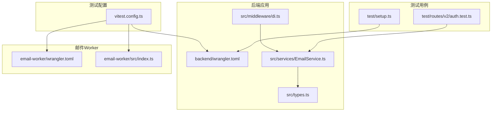
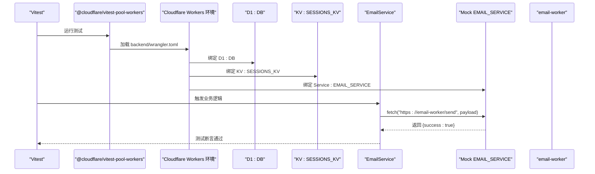
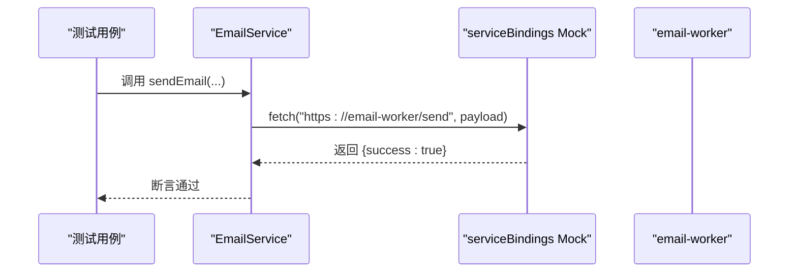
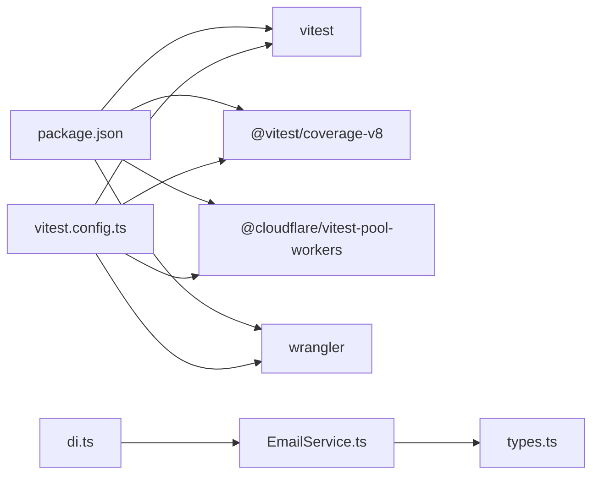

# 测试配置

<cite>
**本文引用的文件**
- [vitest.config.ts](file://backend/vitest.config.ts)
- [wrangler.toml](file://backend/wrangler.toml)
- [email-worker/wrangler.toml](file://email-worker/wrangler.toml)
- [email-worker/src/index.ts](file://email-worker/src/index.ts)
- [src/services/EmailService.ts](file://backend/src/services/EmailService.ts)
- [src/types.ts](file://backend/src/types.ts)
- [src/middleware/di.ts](file://backend/src/middleware/di.ts)
- [test/routes/v2/auth.test.ts](file://backend/test/routes/v2/auth.test.ts)
- [test/setup.ts](file://backend/test/setup.ts)
- [package.json](file://backend/package.json)
</cite>

## 目录
1. [简介](#简介)
2. [项目结构](#项目结构)
3. [核心组件](#核心组件)
4. [架构总览](#架构总览)
5. [详细组件分析](#详细组件分析)
6. [依赖分析](#依赖分析)
7. [性能考虑](#性能考虑)
8. [故障排查指南](#故障排查指南)
9. [结论](#结论)
10. [附录](#附录)

## 简介
本文件围绕 backend/vitest.config.ts 的测试配置展开，重点解析以下方面：
- 使用 @cloudflare/vitest-pool-workers 在 Cloudflare Workers 环境中进行测试的配置机制
- poolOptions 中 wrangler 与 miniflare 的配置差异与适用场景
- d1Databases 与 kvNamespaces 的声明方式及在测试中的作用
- compatibilityFlags 中 nodejs_compat 的启用目的
- serviceBindings 对 EMAIL_SERVICE 的 Mock 响应实现与真实邮件 Worker 的交互
- coverage 配置中的 v8 覆盖率报告生成策略，包括 text、json、html 输出格式、exclude 过滤规则设计意图，以及 lines、functions、branches、statements 阈值的设定依据与质量控制目标

## 项目结构
后端测试相关的关键文件与角色如下：
- 测试配置：backend/vitest.config.ts
- 后端 Wrangler 配置：backend/wrangler.toml（定义 DB、KV、Service Binding、兼容标志等）
- 邮件 Worker：email-worker/src/index.ts 与 email-worker/wrangler.toml（提供 EMAIL_SERVICE 绑定与邮件发送能力）
- 应用服务：src/services/EmailService.ts（通过 EMAIL_SERVICE 发送邮件）
- 类型与注入：src/types.ts、src/middleware/di.ts（定义 Env 类型与服务注入）
- 示例测试：test/routes/v2/auth.test.ts（展示如何在测试中使用 env.DB、env.SESSIONS_KV 等）
- 测试初始化：test/setup.ts（演示如何在测试中初始化 D1 Schema）

图表来源
- [vitest.config.ts](file://backend/vitest.config.ts#L1-L48)
- [wrangler.toml](file://backend/wrangler.toml#L1-L48)
- [email-worker/wrangler.toml](file://email-worker/wrangler.toml#L1-L18)
- [email-worker/src/index.ts](file://email-worker/src/index.ts#L1-L75)
- [src/services/EmailService.ts](file://backend/src/services/EmailService.ts#L1-L146)
- [src/types.ts](file://backend/src/types.ts#L1-L20)
- [src/middleware/di.ts](file://backend/src/middleware/di.ts#L41-L49)
- [test/routes/v2/auth.test.ts](file://backend/test/routes/v2/auth.test.ts#L1-L189)
- [test/setup.ts](file://backend/test/setup.ts#L1-L27)

章节来源
- [vitest.config.ts](file://backend/vitest.config.ts#L1-L48)
- [wrangler.toml](file://backend/wrangler.toml#L1-L48)
- [email-worker/wrangler.toml](file://email-worker/wrangler.toml#L1-L18)
- [email-worker/src/index.ts](file://email-worker/src/index.ts#L1-L75)
- [src/services/EmailService.ts](file://backend/src/services/EmailService.ts#L1-L146)
- [src/types.ts](file://backend/src/types.ts#L1-L20)
- [src/middleware/di.ts](file://backend/src/middleware/di.ts#L41-L49)
- [test/routes/v2/auth.test.ts](file://backend/test/routes/v2/auth.test.ts#L1-L189)
- [test/setup.ts](file://backend/test/setup.ts#L1-L27)

## 核心组件
- 测试池与环境模拟
  - 使用 @cloudflare/vitest-pool-workers 的 defineWorkersConfig，将测试运行在 Cloudflare Workers 环境，支持 D1、KV、Service Binding、兼容标志等 Workers 特性。
  - poolOptions 支持两种模式：
    - wrangler：基于本地 wrangler.toml 配置启动 Workers 环境，适合与真实服务绑定、D1/KV 等资源联动。
    - miniflare：在 Vitest 内部通过 Miniflare 模拟 D1、KV、Service Binding 等，无需外部服务，速度快，适合纯单元/集成测试。
- 数据库与命名空间
  - d1Databases: ['DB']：将 D1 数据库绑定为 DB，便于测试访问。
  - kvNamespaces: ['SESSIONS_KV']：将 KV 命名空间绑定为 SESSIONS_KV，用于会话存储等。
- 兼容标志
  - compatibilityFlags: ['nodejs_compat']：启用 Node.js 兼容特性，使部分 Node 生态库能在 Workers 环境中正常工作。
- 服务绑定
  - serviceBindings: { EMAIL_SERVICE: async () => { return new Response('{"success": true}') } }：在测试环境中将 EMAIL_SERVICE 绑定为一个返回成功响应的 Fetcher，从而绕过真实邮件 Worker，保证测试稳定与可重复。
- 覆盖率
  - provider: 'v8'：使用 V8 引擎生成覆盖率数据。
  - reporter: ['text','json','html']：同时输出文本、JSON、HTML 报告，便于命令行查看、CI 汇总与可视化。
  - exclude：排除 node_modules、test、*.test.ts、*.config.ts、scripts、coverage、*.d.ts 等目录与文件，聚焦业务代码覆盖率。
  - thresholds：lines/functions/statements 70%，branches 65%，用于质量门槛控制，确保关键路径与分支得到充分覆盖。

章节来源
- [vitest.config.ts](file://backend/vitest.config.ts#L1-L48)
- [wrangler.toml](file://backend/wrangler.toml#L1-L48)

## 架构总览
下图展示了测试执行链路：Vitest 通过 @cloudflare/vitest-pool-workers 启动 Workers 环境，加载 backend/wrangler.toml 的资源绑定；在测试中通过 env.DB、env.SESSIONS_KV、env.EMAIL_SERVICE 访问 D1、KV、邮件服务；EmailService 通过 EMAIL_SERVICE 发送邮件，测试中使用 serviceBindings 的 Mock 实现。

图表来源
- [vitest.config.ts](file://backend/vitest.config.ts#L1-L48)
- [wrangler.toml](file://backend/wrangler.toml#L1-L48)
- [email-worker/wrangler.toml](file://email-worker/wrangler.toml#L1-L18)
- [email-worker/src/index.ts](file://email-worker/src/index.ts#L1-L75)
- [src/services/EmailService.ts](file://backend/src/services/EmailService.ts#L101-L145)

## 详细组件分析

### 配置机制与 poolOptions 差异
- wrangler 模式
  - 通过 configPath 指向 backend/wrangler.toml，加载真实的服务绑定、D1/KV、兼容标志等。
  - 适用于需要与真实邮件 Worker 或其他生产级资源联动的集成测试。
- miniflare 模式
  - 在 Vitest 内部通过 Miniflare 模拟 D1、KV、Service Binding，无需外部服务，速度快，适合快速反馈。
  - 本仓库在 vitest.config.ts 中使用 miniflare 并显式声明 d1Databases、kvNamespaces、compatibilityFlags、serviceBindings，确保测试环境与生产一致。
- 选择建议
  - 需要真实邮件 Worker 行为：优先 wrangler 模式。
  - 快速本地开发与单元测试：优先 miniflare 模式，并通过 serviceBindings 提供 Mock。

章节来源
- [vitest.config.ts](file://backend/vitest.config.ts#L1-L48)
- [wrangler.toml](file://backend/wrangler.toml#L1-L48)

### d1Databases 与 kvNamespaces 声明方式
- d1Databases: ['DB']
  - 将 D1 数据库绑定命名为 DB，测试中可通过 env.DB 访问，常用于初始化 Schema、插入测试数据、断言变更。
- kvNamespaces: ['SESSIONS_KV']
  - 将 KV 命名空间绑定命名为 SESSIONS_KV，用于模拟会话存储、缓存等。
- 在测试中的使用
  - test/setup.ts 展示了通过 env.DB 执行 SQL 初始化 Schema 的流程。
  - test/routes/v2/auth.test.ts 展示了在 beforeAll 中清理与初始化表数据，并在 beforeEach 中重置状态。

章节来源
- [vitest.config.ts](file://backend/vitest.config.ts#L1-L48)
- [test/setup.ts](file://backend/test/setup.ts#L1-L27)
- [test/routes/v2/auth.test.ts](file://backend/test/routes/v2/auth.test.ts#L1-L189)

### compatibilityFlags 与 nodejs_compat 启用目的
- compatibilityFlags: ['nodejs_compat']
  - 启用 Node.js 兼容特性，使部分 Node 生态库在 Workers 环境中可用，提升测试与业务代码的兼容性与复用度。
  - 在本仓库中，该标志与 wrangler.toml 保持一致，确保本地与生产环境行为一致。

章节来源
- [vitest.config.ts](file://backend/vitest.config.ts#L1-L48)
- [wrangler.toml](file://backend/wrangler.toml#L1-L48)

### serviceBindings 对 EMAIL_SERVICE 的 Mock 响应实现
- 配置位置
  - vitest.config.ts 中 serviceBindings: { EMAIL_SERVICE: async () => { return new Response('{"success": true}') } }
- 实际调用链
  - src/services/EmailService.ts 在构造函数中接收 env，其中包含 EMAIL_SERVICE。
  - sendEmail 方法通过 env.EMAIL_SERVICE.fetch(...) 调用邮件 Worker 的 /send 接口。
- 测试中的行为
  - 由于 serviceBindings 提供了 Mock Fetcher，EmailService 在测试中能收到 {success: true} 的响应，从而通过断言。
- 生产环境对比
  - backend/wrangler.toml 中通过 [[services]] 将 EMAIL_SERVICE 绑定到 email-worker 的 caiwu-email production 环境。
  - email-worker/src/index.ts 提供 /send 接口，校验 x-email-token（如配置），构造 MIME 并通过 Cloudflare Email 发送。

图表来源
- [vitest.config.ts](file://backend/vitest.config.ts#L1-L48)
- [src/services/EmailService.ts](file://backend/src/services/EmailService.ts#L101-L145)
- [email-worker/src/index.ts](file://email-worker/src/index.ts#L1-L75)

章节来源
- [vitest.config.ts](file://backend/vitest.config.ts#L1-L48)
- [src/services/EmailService.ts](file://backend/src/services/EmailService.ts#L101-L145)
- [email-worker/wrangler.toml](file://email-worker/wrangler.toml#L1-L18)
- [email-worker/src/index.ts](file://email-worker/src/index.ts#L1-L75)

### coverage 配置与报告策略
- provider: 'v8'
  - 使用 V8 引擎生成覆盖率数据，与 Node/Vitest 生态兼容良好。
- reporter: ['text','json','html']
  - text：便于在 CI 日志中查看覆盖率摘要。
  - json：便于 CI 平台或工具聚合与持久化。
  - html：生成可视化报告，便于本地深入分析未覆盖路径。
- exclude 设计意图
  - 排除 node_modules、test、*.test.ts、*.config.ts、scripts、coverage、*.d.ts 等，避免第三方库、测试代码、配置文件与类型声明影响覆盖率指标，聚焦业务代码质量。
- thresholds 设定依据与质量目标
  - lines/functions/statements 70%：平衡覆盖率与可维护性，确保主要逻辑路径被覆盖。
  - branches 65%：分支通常比语句更复杂，适当降低门槛以鼓励覆盖关键分支。
  - 目标：通过阈值约束，持续提升关键路径与分支的测试质量，减少回归风险。

章节来源
- [vitest.config.ts](file://backend/vitest.config.ts#L1-L48)

## 依赖分析
- 测试运行时依赖
  - @cloudflare/vitest-pool-workers：提供 Workers 环境模拟与 Service Binding 支持。
  - vitest 与 @vitest/coverage-v8：提供测试框架与覆盖率统计。
  - wrangler：提供本地开发与部署工具，测试中通过 configPath 指向 backend/wrangler.toml。
- 业务依赖
  - src/services/EmailService.ts 依赖 EMAIL_SERVICE（Fetcher）与 EMAIL_TOKEN（可选）。
  - src/types.ts 定义 Env 类型，包含 DB、SESSIONS_KV、VOUCHERS、EMAIL_SERVICE 等绑定。
  - src/middleware/di.ts 注入 EmailService，确保在运行时能获取到正确的 env。

图表来源
- [package.json](file://backend/package.json#L1-L70)
- [vitest.config.ts](file://backend/vitest.config.ts#L1-L48)
- [src/services/EmailService.ts](file://backend/src/services/EmailService.ts#L1-L146)
- [src/types.ts](file://backend/src/types.ts#L1-L20)
- [src/middleware/di.ts](file://backend/src/middleware/di.ts#L41-L49)

章节来源
- [package.json](file://backend/package.json#L1-L70)
- [vitest.config.ts](file://backend/vitest.config.ts#L1-L48)
- [src/services/EmailService.ts](file://backend/src/services/EmailService.ts#L1-L146)
- [src/types.ts](file://backend/src/types.ts#L1-L20)
- [src/middleware/di.ts](file://backend/src/middleware/di.ts#L41-L49)

## 性能考虑
- 使用 miniflare 模式可在本地快速执行测试，减少外部依赖带来的等待时间。
- 通过 serviceBindings 提供 Mock，避免真实网络请求与外部服务调用，提高测试稳定性与速度。
- coverage 报告生成建议在 CI 中按需开启，避免在本地频繁生成 HTML 报告影响开发效率。

## 故障排查指南
- EMAIL_SERVICE 未配置或返回失败
  - 症状：EmailService 返回错误或断言失败。
  - 排查：确认 vitest.config.ts 中 serviceBindings 是否正确配置；检查 email-worker 的 /send 接口与鉴权头（如 EMAIL_TOKEN）。
- D1 或 KV 未初始化
  - 症状：测试中访问 env.DB 或 env.SESSIONS_KV 失败。
  - 排查：确认 vitest.config.ts 中 d1Databases 与 kvNamespaces 的绑定名称与 backend/wrangler.toml 一致；在 test/setup.ts 中确认 Schema 初始化逻辑。
- 兼容性问题
  - 症状：某些 Node 生态库在 Workers 环境报错。
  - 排查：确认 compatibilityFlags 包含 nodejs_compat，并与 backend/wrangler.toml 保持一致。

章节来源
- [vitest.config.ts](file://backend/vitest.config.ts#L1-L48)
- [wrangler.toml](file://backend/wrangler.toml#L1-L48)
- [email-worker/src/index.ts](file://email-worker/src/index.ts#L1-L75)
- [test/setup.ts](file://backend/test/setup.ts#L1-L27)
- [src/services/EmailService.ts](file://backend/src/services/EmailService.ts#L101-L145)

## 结论
本仓库通过 @cloudflare/vitest-pool-workers 将测试运行在真实的 Cloudflare Workers 环境中，结合 d1Databases、kvNamespaces、compatibilityFlags 与 serviceBindings，实现了对 D1、KV、邮件服务绑定的完整模拟。在测试中，serviceBindings 的 Mock EMAIL_SERVICE 保证了邮件发送逻辑的可测性与稳定性；coverage 的多格式报告与阈值设定有助于持续提升代码质量。建议在需要真实邮件 Worker 行为时采用 wrangler 模式，在日常开发与单元测试中采用 miniflare 模式以获得更快的反馈。

## 附录
- 关键文件与职责
  - backend/vitest.config.ts：测试配置入口，定义 Workers 池、资源绑定、兼容标志与覆盖率策略。
  - backend/wrangler.toml：后端应用的 Wrangler 配置，定义 D1、KV、Service Binding、兼容标志等。
  - email-worker/wrangler.toml 与 email-worker/src/index.ts：邮件 Worker 的配置与实现，提供 /send 接口。
  - src/services/EmailService.ts：通过 EMAIL_SERVICE 发送邮件的核心服务。
  - src/types.ts 与 src/middleware/di.ts：定义 Env 类型与服务注入，确保运行时能获取到正确的绑定。
  - test/routes/v2/auth.test.ts 与 test/setup.ts：展示如何在测试中使用 env.DB、env.SESSIONS_KV，并初始化 Schema。