# 业务模块API测试

<cite>
**本文档引用的文件**   
- [fixed-assets.ts](file://backend/src/routes/v2/fixed-assets.ts)
- [rental.ts](file://backend/src/routes/v2/rental.ts)
- [reports.ts](file://backend/src/routes/v2/reports.ts)
- [site-bills.ts](file://backend/src/routes/v2/site-bills.ts)
- [fixed-assets.test.ts](file://backend/test/routes/fixed-assets.test.ts)
- [rental.test.ts](file://backend/test/routes/rental.test.ts)
- [reports.test.ts](file://backend/test/routes/reports.test.ts)
- [site-bills.test.ts](file://backend/test/routes/site-bills.test.ts)
- [FixedAssetService.ts](file://backend/src/services/FixedAssetService.ts)
- [RentalService.ts](file://backend/src/services/RentalService.ts)
- [ReportService.ts](file://backend/src/services/ReportService.ts)
- [SiteBillService.ts](file://backend/src/services/SiteBillService.ts)
- [batch-operations.test.ts](file://backend/test/routes/v2/batch-operations.test.ts)
- [ImportService.ts](file://backend/src/services/ImportService.ts)
</cite>

## 目录
1. [引言](#引言)
2. [核心业务模块API测试策略](#核心业务模块api测试策略)
3. [复杂业务流程测试用例设计](#复杂业务流程测试用例设计)
4. [批量操作与文件导入导出测试](#批量操作与文件导入导出测试)
5. [报表生成与数据一致性验证](#报表生成与数据一致性验证)
6. [测试数据隔离与环境准备](#测试数据隔离与环境准备)

## 引言
本文档旨在整合财务系统中人事、固定资产、租赁、报表和站点账单等核心业务模块的API测试实践。通过分析代码库中的路由、服务和测试文件，详细阐述如何为复杂业务流程设计测试用例，包括状态机转换、业务规则验证和跨模块数据一致性检查。文档结合具体测试文件，展示批量操作、文件导入导出、报表生成等复杂功能的测试实现，并提供测试数据隔离和环境准备的最佳方案。

## 核心业务模块API测试策略

### 固定资产模块测试
固定资产模块的API测试覆盖了资产的全生命周期管理，包括创建、更新、删除、采购、变卖、折旧和转移等操作。测试用例通过模拟HTTP请求，验证每个API端点的功能正确性、权限控制和数据一致性。

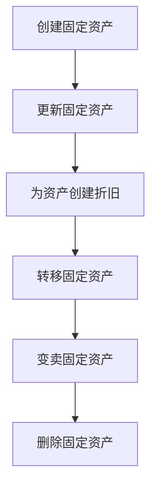

**Diagram sources**
- [fixed-assets.ts](file://backend/src/routes/v2/fixed-assets.ts)
- [fixed-assets.test.ts](file://backend/test/routes/fixed-assets.test.ts)

**Section sources**
- [fixed-assets.ts](file://backend/src/routes/v2/fixed-assets.ts#L1-L888)
- [fixed-assets.test.ts](file://backend/test/routes/fixed-assets.test.ts#L1-L388)

### 租赁模块测试
租赁模块的API测试涵盖了租赁物业的管理、租金支付、宿舍分配和应付账单生成等功能。测试重点验证了租赁物业与支付记录、分配记录之间的关联关系，以及生成应付账单的业务逻辑。

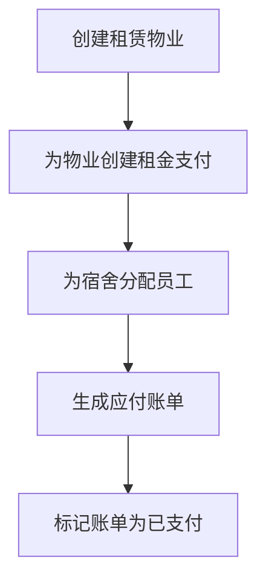

**Diagram sources**
- [rental.ts](file://backend/src/routes/v2/rental.ts)
- [rental.test.ts](file://backend/test/routes/rental.test.ts)

**Section sources**
- [rental.ts](file://backend/src/routes/v2/rental.ts#L1-L852)
- [rental.test.ts](file://backend/test/routes/rental.test.ts#L1-L313)

### 报表模块测试
报表模块的API测试主要验证各类财务和业务报表的生成逻辑，包括仪表盘统计、项目现金流、AR/AP汇总与明细、费用汇总与明细、账户余额和员工薪资报表等。测试用例通过预置测试数据，验证报表查询结果的准确性。

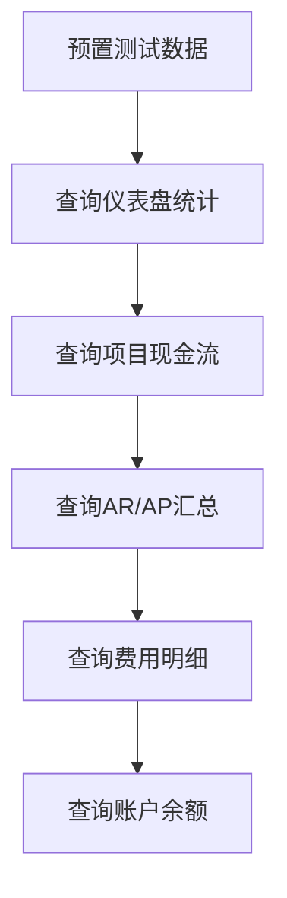

**Diagram sources**
- [reports.ts](file://backend/src/routes/v2/reports.ts)
- [reports.test.ts](file://backend/test/routes/reports.test.ts)

**Section sources**
- [reports.ts](file://backend/src/routes/v2/reports.ts#L1-L834)
- [reports.test.ts](file://backend/test/routes/reports.test.ts#L1-L149)

### 站点账单模块测试
站点账单模块的API测试覆盖了账单的增删改查操作。测试用例验证了账单与站点、账户、分类等实体的关联关系，以及账单状态的变更逻辑。

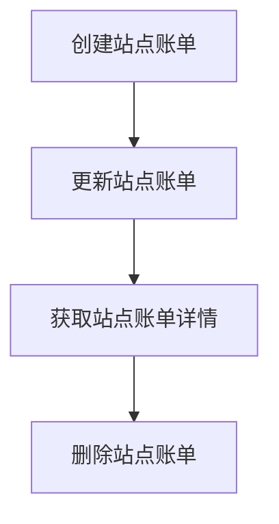

**Diagram sources**
- [site-bills.ts](file://backend/src/routes/v2/site-bills.ts)
- [site-bills.test.ts](file://backend/test/routes/site-bills.test.ts)

**Section sources**
- [site-bills.ts](file://backend/src/routes/v2/site-bills.ts#L1-L491)
- [site-bills.test.ts](file://backend/test/routes/site-bills.test.ts#L1-L311)

## 复杂业务流程测试用例设计

### 状态机转换测试
固定资产的状态机转换是复杂业务流程的核心。资产状态包括“在用”、“闲置”、“维修中”、“已出售”等。测试用例需要验证状态转换的合法性，例如，只有“在用”状态的资产才能被出售，出售后的资产状态应变为“已出售”。

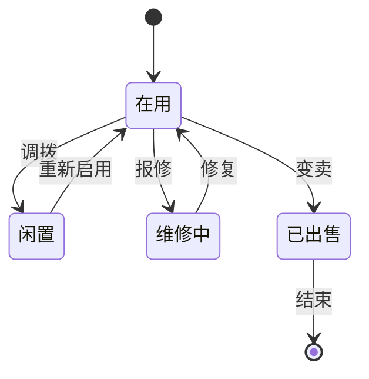

**Section sources**
- [FixedAssetService.ts](file://backend/src/services/FixedAssetService.ts#L228-L286)
- [fixed-assets.test.ts](file://backend/test/routes/fixed-assets.test.ts#L240-L252)

### 业务规则验证
业务规则验证是确保系统数据一致性和业务逻辑正确性的关键。例如，在创建固定资产时，系统会检查资产代码的唯一性；在删除资产时，会检查是否存在折旧记录，若存在则禁止删除。

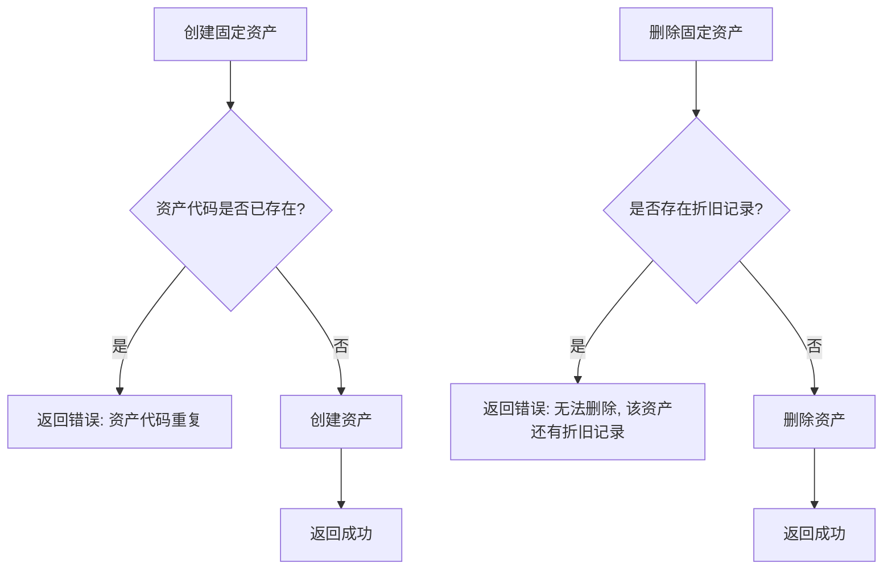

**Section sources**
- [FixedAssetService.ts](file://backend/src/services/FixedAssetService.ts#L201-L208)
- [FixedAssetService.ts](file://backend/src/services/FixedAssetService.ts#L288-L302)

### 跨模块数据一致性检查
跨模块数据一致性检查确保了不同业务模块之间的数据关联正确。例如，当采购固定资产时，系统会同时创建固定资产记录和对应的现金流水记录，这两条记录的金额、币种、日期等信息必须一致。

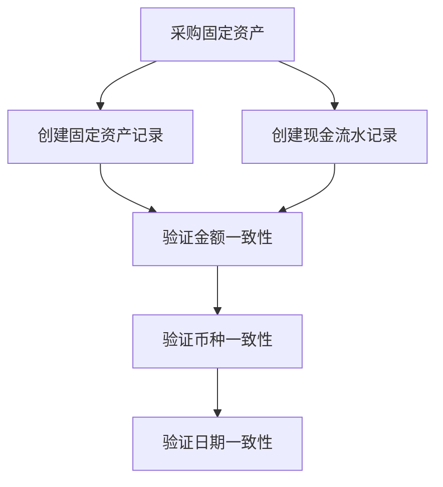

**Section sources**
- [FixedAssetService.ts](file://backend/src/services/FixedAssetService.ts#L313-L468)

## 批量操作与文件导入导出测试

### 批量操作测试
批量操作测试验证了系统对批量数据处理的能力。例如，批量删除货币类型时，系统需要处理成功和失败的情况，并返回详细的处理结果。

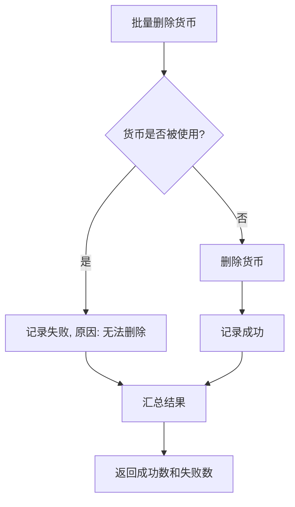

**Section sources**
- [batch-operations.test.ts](file://backend/test/routes/v2/batch-operations.test.ts#L104-L236)

### 文件导入导出测试
文件导入导出测试验证了系统与外部数据交互的能力。导入服务解析CSV文件，逐行处理数据，并在事务中插入记录，确保数据的完整性和余额计算的正确性。

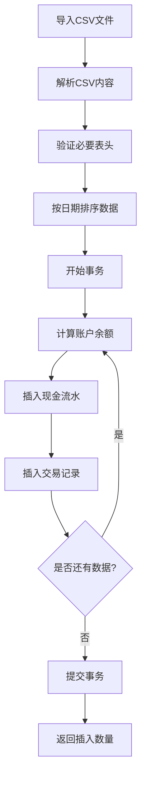

**Section sources**
- [ImportService.ts](file://backend/src/services/ImportService.ts#L13-L126)

## 报表生成与数据一致性验证

### 报表生成测试
报表生成测试验证了各类报表的查询逻辑和数据准确性。报表服务作为门面模式，委托给具体的报表服务类进行数据查询和处理。

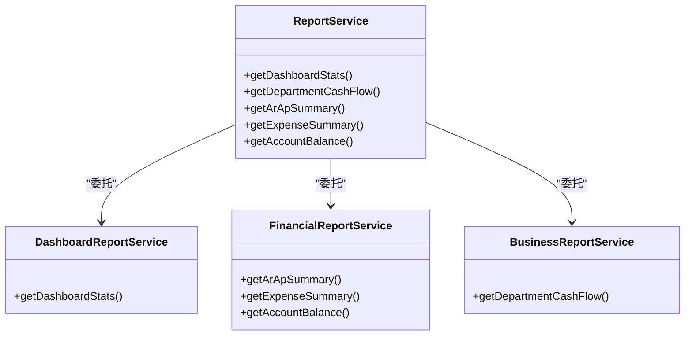

**Section sources**
- [ReportService.ts](file://backend/src/services/ReportService.ts#L13-L85)

### 数据一致性验证
数据一致性验证确保了报表数据与底层数据库数据的一致性。测试用例通过预置测试数据，然后查询报表，验证返回结果的准确性。

**Section sources**
- [reports.test.ts](file://backend/test/routes/reports.test.ts#L58-L148)

## 测试数据隔离与环境准备

### 测试数据隔离
测试数据隔离是确保测试用例独立性和可重复性的关键。本系统通过在每个测试用例执行前清空相关数据表，然后插入预置的测试数据，实现了测试数据的隔离。

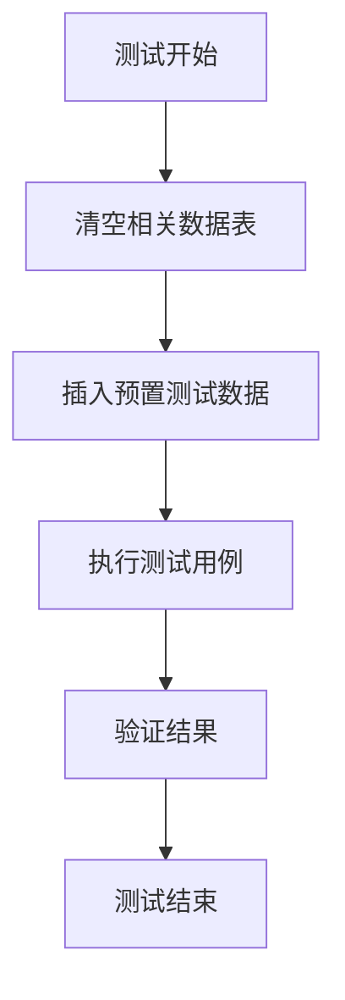

**Section sources**
- [reports.test.ts](file://backend/test/routes/reports.test.ts#L52-L56)
- [batch-operations.test.ts](file://backend/test/routes/v2/batch-operations.test.ts#L39-L44)

### 环境准备
环境准备包括数据库初始化、服务实例化和依赖注入。测试框架在测试执行前初始化数据库，创建服务实例，并将依赖注入到测试上下文中。

**Section sources**
- [reports.test.ts](file://backend/test/routes/reports.test.ts#L44-L50)
- [batch-operations.test.ts](file://backend/test/routes/v2/batch-operations.test.ts#L18-L28)