# 主数据API测试

<cite>
**本文档引用的文件**   
- [master-data.test.ts](file://backend/test/routes/v2/master-data.test.ts)
- [departments.ts](file://backend/src/routes/v2/master-data/departments.ts)
- [positions.ts](file://backend/src/routes/v2/master-data/positions.ts)
- [currencies.ts](file://backend/src/routes/v2/master-data/currencies.ts)
- [vendors.ts](file://backend/src/routes/v2/master-data/vendors.ts)
- [MasterDataService.ts](file://backend/src/services/MasterDataService.ts)
- [CurrencyService.ts](file://backend/src/services/CurrencyService.ts)
- [VendorService.ts](file://backend/src/services/VendorService.ts)
- [PositionService.ts](file://backend/src/services/PositionService.ts)
- [ProjectDepartmentService.ts](file://backend/src/services/ProjectDepartmentService.ts)
- [master-data.schema.ts](file://backend/src/schemas/master-data.schema.ts)
</cite>

## 目录
1. [简介](#简介)
2. [核心主数据API测试](#核心主数据api测试)
3. [数据完整性与约束验证](#数据完整性与约束验证)
4. [权限控制测试](#权限控制测试)
5. [审计日志验证](#审计日志验证)
6. [测试数据准备与依赖注入](#测试数据准备与依赖注入)
7. [响应验证最佳实践](#响应验证最佳实践)
8. [分页与查询测试](#分页与查询测试)
9. [结论](#结论)

## 简介
主数据管理模块是财务系统的核心组件，负责维护部门、职位、币种、供应商等关键业务实体。本文档深入解析该模块的API测试实现，涵盖增删改查操作的验证、数据完整性约束、权限控制、审计日志记录等关键方面。通过分析`master-data.test.ts`中的实际测试用例，展示如何确保主数据的一致性和可靠性。

## 核心主数据API测试

主数据API测试覆盖了部门、职位、币种、供应商等核心实体的完整生命周期操作。测试用例验证了创建、读取、更新和删除（CRUD）操作的正确性，确保API响应符合预期格式和业务规则。

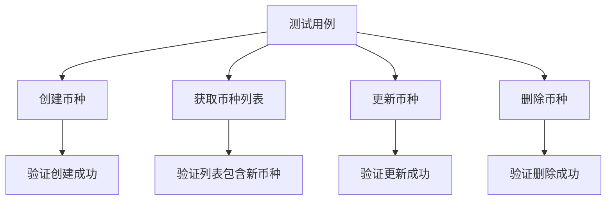

**图表来源**
- [master-data.test.ts](file://backend/test/routes/v2/master-data.test.ts#L30-L152)
- [currencies.ts](file://backend/src/routes/v2/master-data/currencies.ts#L80-L254)

**章节来源**
- [master-data.test.ts](file://backend/test/routes/v2/master-data.test.ts#L30-L152)

## 数据完整性与约束验证

主数据服务层实现了严格的数据完整性约束，确保业务数据的一致性和有效性。测试用例验证了这些约束的正确执行。

### 唯一性校验
系统确保部门名称、职位代码、币种代码等关键字段的唯一性。例如，`ProjectDepartmentService`在创建部门时会检查名称是否已存在：

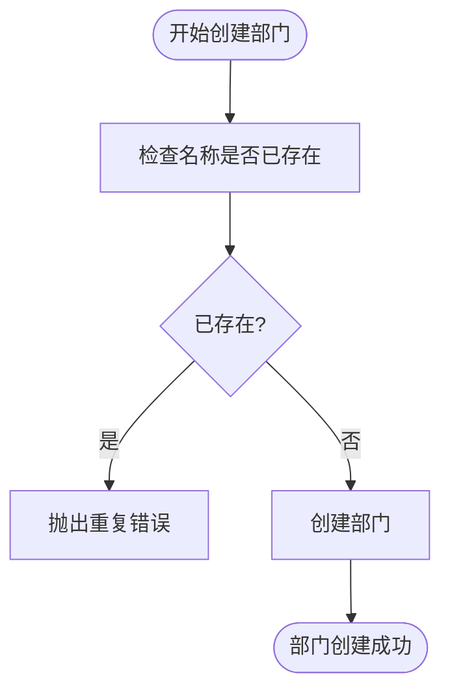

**图表来源**
- [ProjectDepartmentService.ts](file://backend/src/services/ProjectDepartmentService.ts#L68-L73)
- [master-data.schema.ts](file://backend/src/schemas/master-data.schema.ts#L23-L32)

### 级联关系维护
系统维护了主数据之间的级联关系，防止出现孤立或无效的引用。例如，删除部门前必须确保没有关联的站点、员工或组织部门：

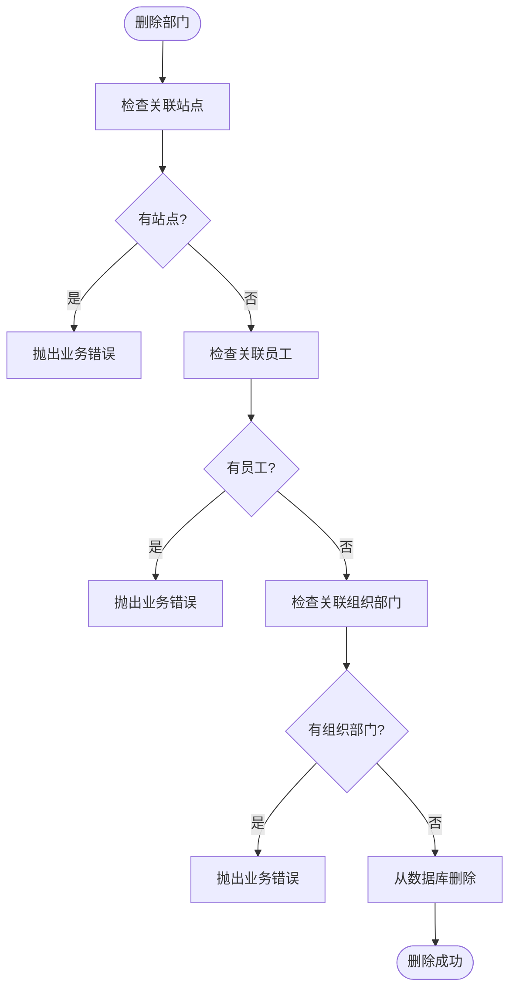

**图表来源**
- [ProjectDepartmentService.ts](file://backend/src/services/ProjectDepartmentService.ts#L135-L164)
- [MasterDataService.ts](file://backend/src/services/MasterDataService.ts#L47-L57)

### 软删除策略
对于供应商等实体，系统采用软删除策略而非物理删除，通过设置`active`字段为0来标记删除状态，保留历史数据完整性：

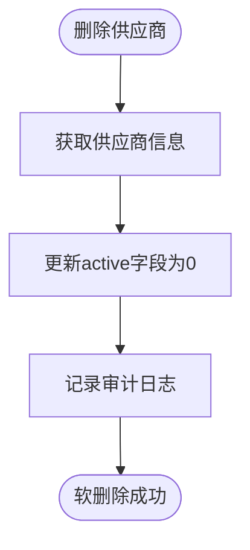

**图表来源**
- [VendorService.ts](file://backend/src/services/VendorService.ts#L80-L90)
- [vendors.ts](file://backend/src/routes/v2/master-data/vendors.ts#L221-L258)

**章节来源**
- [VendorService.ts](file://backend/src/services/VendorService.ts#L80-L90)

## 权限控制测试

主数据API实现了细粒度的权限控制，确保只有授权用户才能执行特定操作。测试用例验证了权限检查的正确性。

### 权限检查流程
API路由在执行操作前会调用`hasPermission`函数进行权限验证，不同操作需要不同的权限：

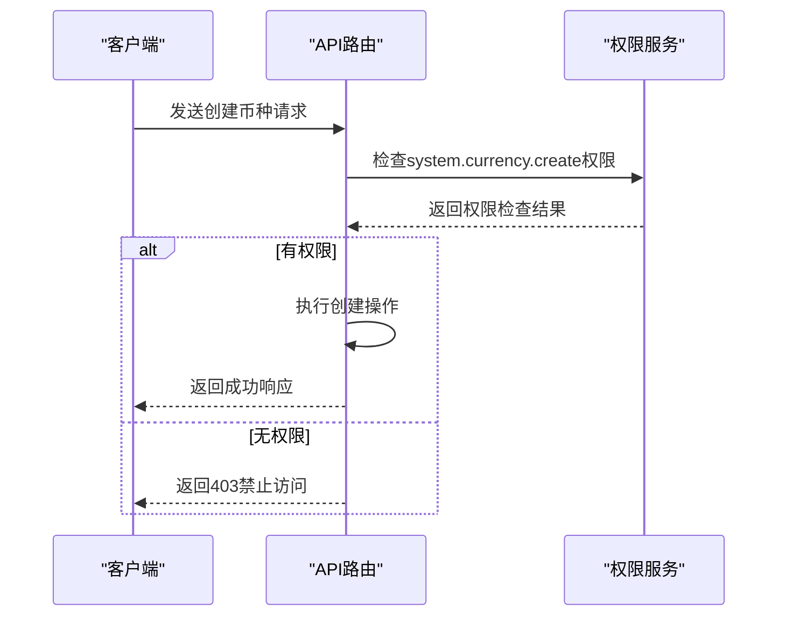

**图表来源**
- [currencies.ts](file://backend/src/routes/v2/master-data/currencies.ts#L111-L113)
- [permissions.ts](file://backend/src/utils/permissions.ts)

### 职位权限测试
对于职位管理，系统通过`getUserPosition`函数验证用户是否有权访问职位数据：

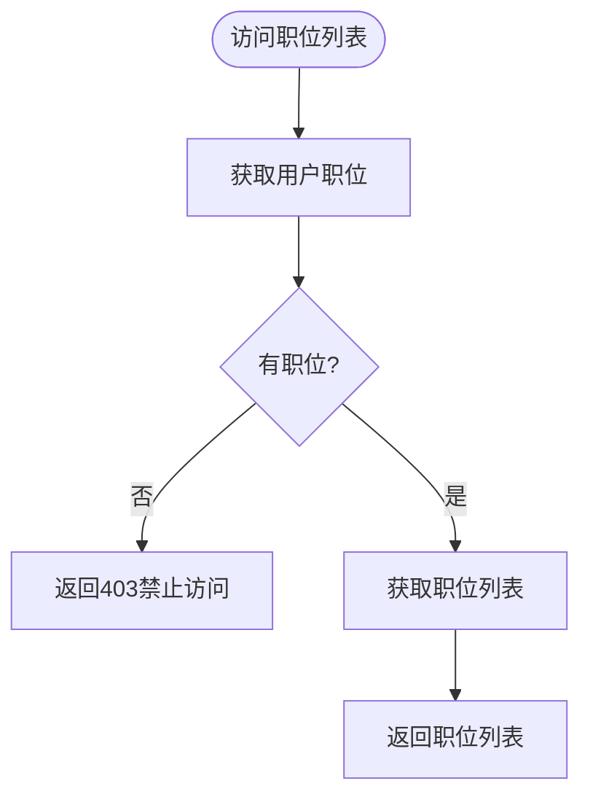

**图表来源**
- [positions.ts](file://backend/src/routes/v2/master-data/positions.ts#L38-L40)
- [MasterDataService.ts](file://backend/src/services/MasterDataService.ts#L243-L245)

**章节来源**
- [positions.ts](file://backend/src/routes/v2/master-data/positions.ts#L14-L45)

## 审计日志验证

系统为所有主数据变更操作记录审计日志，确保操作的可追溯性。测试用例验证了审计日志的正确记录。

### 审计日志记录流程
每次创建、更新或删除操作都会调用`logAuditAction`函数记录审计日志：

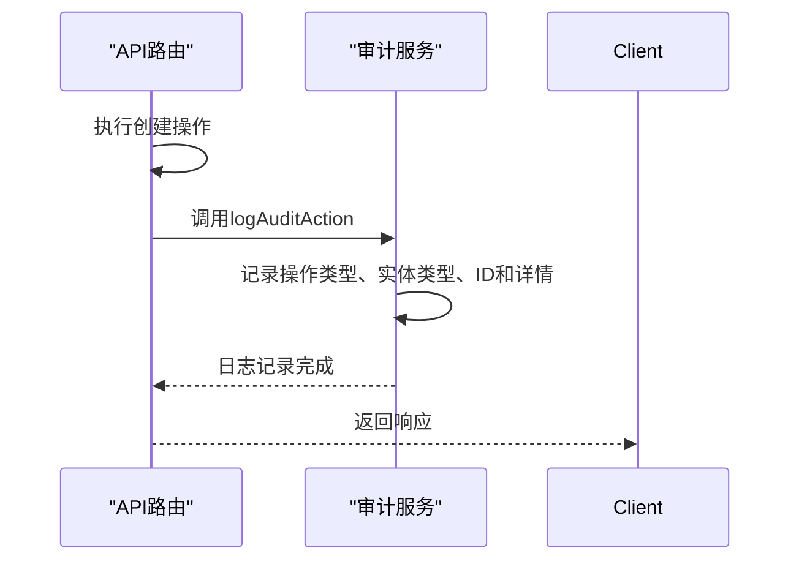

**图表来源**
- [currencies.ts](file://backend/src/routes/v2/master-data/currencies.ts#L133-L134)
- [departments.ts](file://backend/src/routes/v2/master-data/departments.ts#L118-L124)

### 批量操作审计
批量操作会记录操作类型、数量和成功计数，提供批量操作的概要信息：

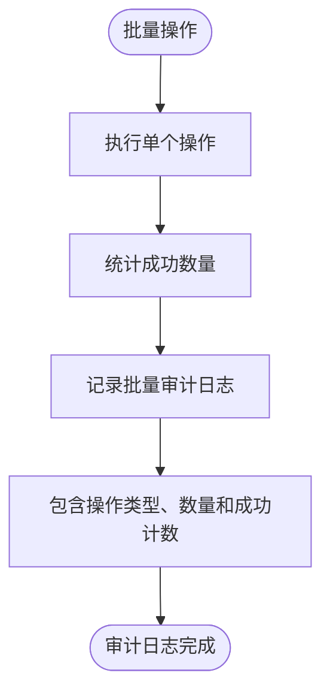

**图表来源**
- [currencies.ts](file://backend/src/routes/v2/master-data/currencies.ts#L308-L314)
- [MasterDataService.ts](file://backend/src/services/MasterDataService.ts#L188-L221)

**章节来源**
- [currencies.ts](file://backend/src/routes/v2/master-data/currencies.ts#L256-L317)

## 测试数据准备与依赖注入

测试用例通过精心准备测试数据和模拟依赖来验证API功能，确保测试的独立性和可重复性。

### 测试数据初始化
测试用例在`beforeAll`钩子中初始化数据库模式，并在`beforeEach`钩子中清理测试数据：

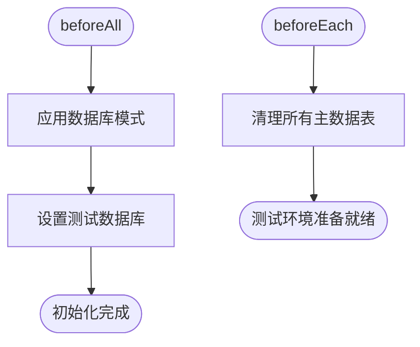

**图表来源**
- [master-data.test.ts](file://backend/test/routes/v2/master-data.test.ts#L15-L35)
- [MasterDataService.test.ts](file://backend/test/services/MasterDataService.test.ts#L13-L35)

### 依赖注入模拟
测试通过创建测试环境和执行上下文来模拟Cloudflare环境，包括JWT密钥和异步任务队列：

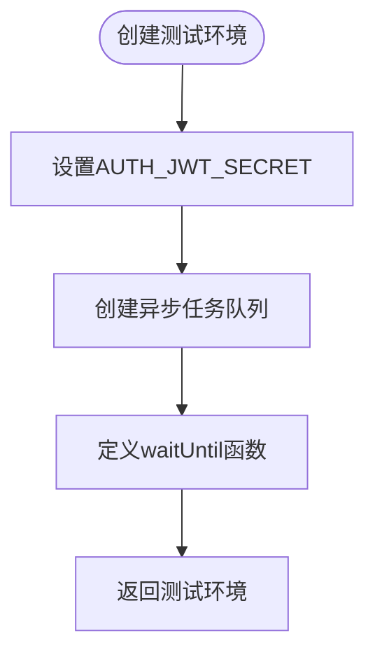

**图表来源**
- [master-data.test.ts](file://backend/test/routes/v2/master-data.test.ts#L71-L83)
- [MasterDataService.test.ts](file://backend/test/services/MasterDataService.test.ts#L21-L35)

**章节来源**
- [master-data.test.ts](file://backend/test/routes/v2/master-data.test.ts#L71-L83)

## 响应验证最佳实践

测试用例采用系统化的方法验证API响应，确保响应格式、状态码和数据内容的正确性。

### 统一响应格式验证
所有API响应遵循统一的格式，包含`success`标志和`data`字段。测试用例验证这些字段的存在和正确性：

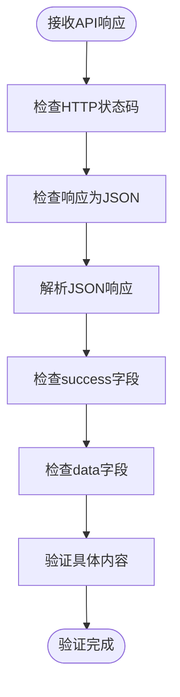

**图表来源**
- [master-data.test.ts](file://backend/test/routes/v2/master-data.test.ts#L121-L124)
- [response.ts](file://backend/src/utils/response.ts)

### 错误响应验证
测试用例还验证错误情况下的响应，确保系统在权限不足或数据验证失败时返回适当的错误信息：

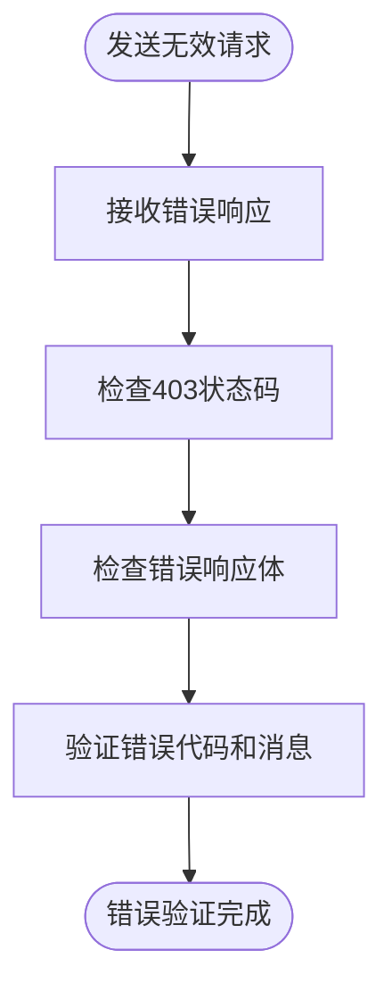

**图表来源**
- [master-data.test.ts](file://backend/test/routes/v2/master-data.test.ts#L99-L103)
- [errors.ts](file://backend/src/utils/errors.ts)

**章节来源**
- [master-data.test.ts](file://backend/test/routes/v2/master-data.test.ts#L97-L103)

## 分页与查询测试

主数据API支持分页和查询功能，测试用例验证了这些功能的正确实现。

### 列表查询测试
系统支持通过`activeOnly`和`search`参数过滤列表数据，测试用例验证这些查询参数的效果：

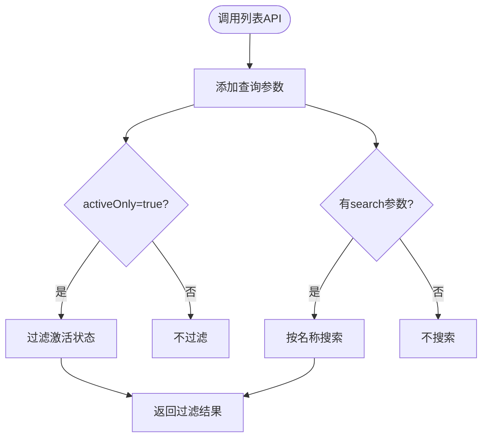

**图表来源**
- [currencies.ts](file://backend/src/routes/v2/master-data/currencies.ts#L47-L76)
- [vendors.ts](file://backend/src/routes/v2/master-data/vendors.ts#L49-L61)

### 缓存机制测试
系统为频繁访问的主数据列表实现了缓存机制，测试用例应验证缓存的正确使用和失效：

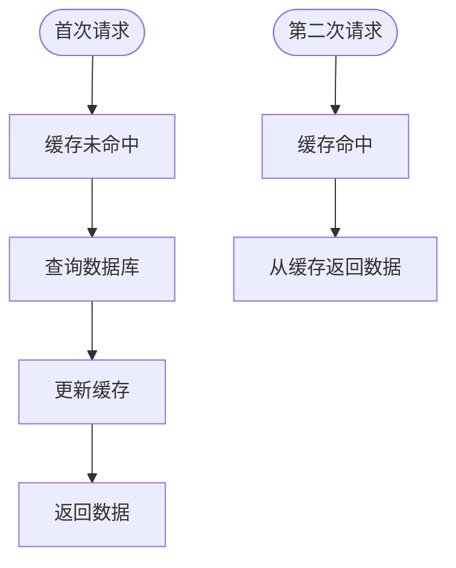

**图表来源**
- [departments.ts](file://backend/src/routes/v2/master-data/departments.ts#L49-L64)
- [currencies.ts](file://backend/src/routes/v2/master-data/currencies.ts#L51-L60)

**章节来源**
- [departments.ts](file://backend/src/routes/v2/master-data/departments.ts#L22-L65)

## 结论
主数据API测试通过全面的测试用例验证了核心主数据实体的CRUD操作、数据完整性约束、权限控制和审计日志功能。测试策略结合了单元测试和集成测试，确保了主数据管理模块的可靠性和稳定性。通过精心设计的测试数据准备、依赖注入模拟和响应验证，系统能够有效防止数据不一致和安全漏洞，为主数据的完整性和一致性提供了有力保障。