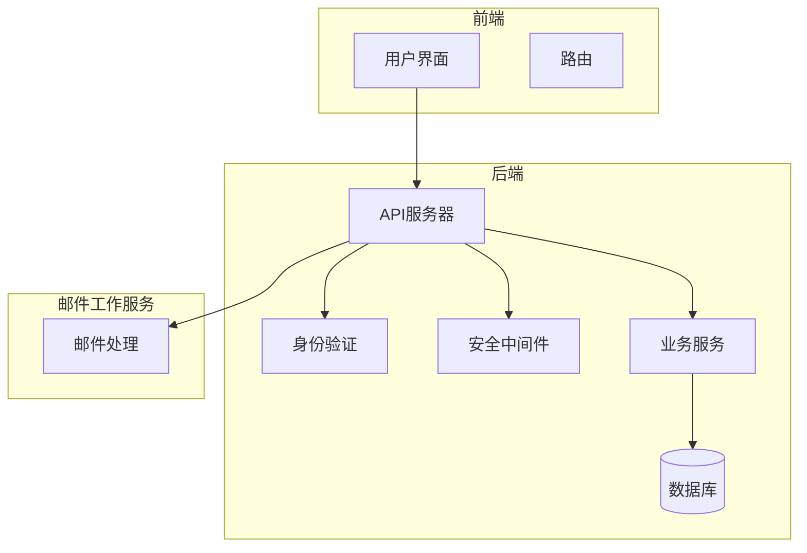
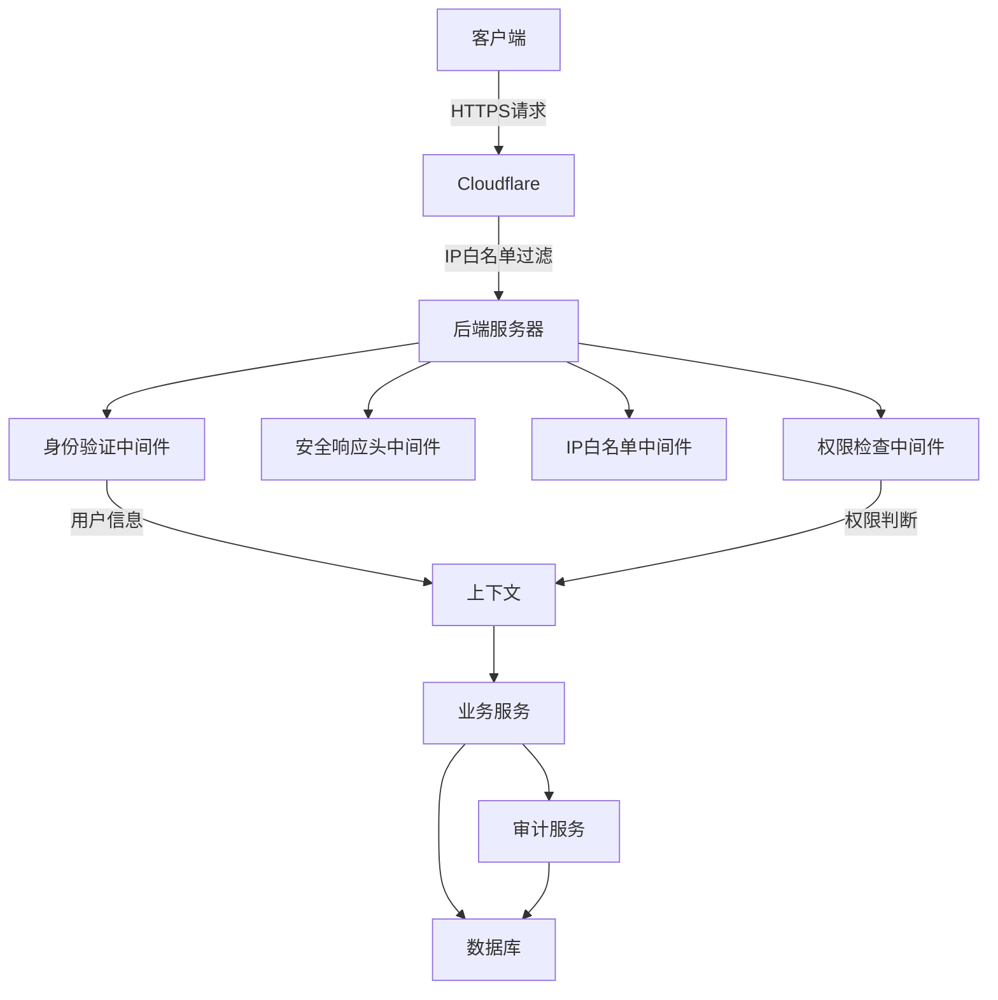
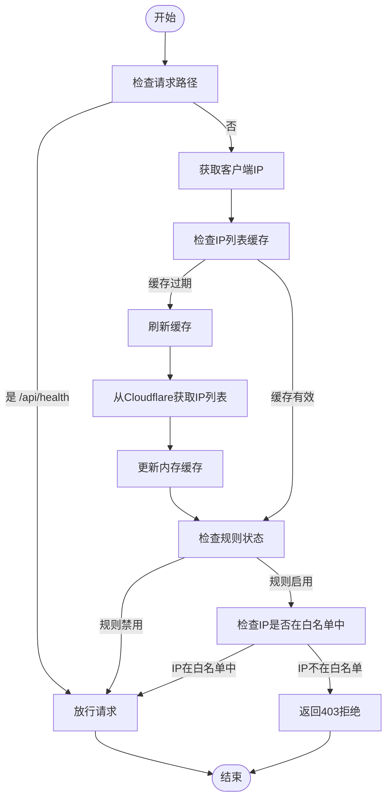
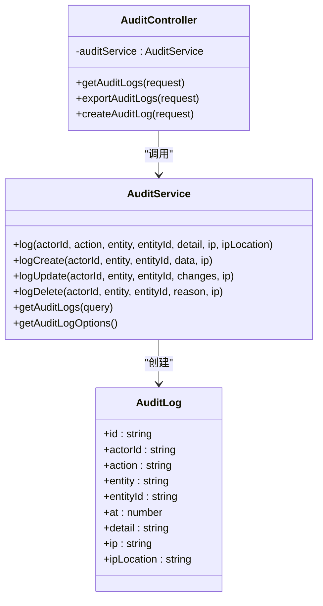
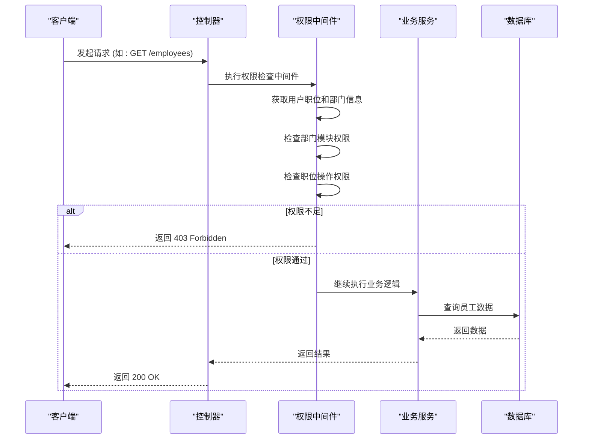
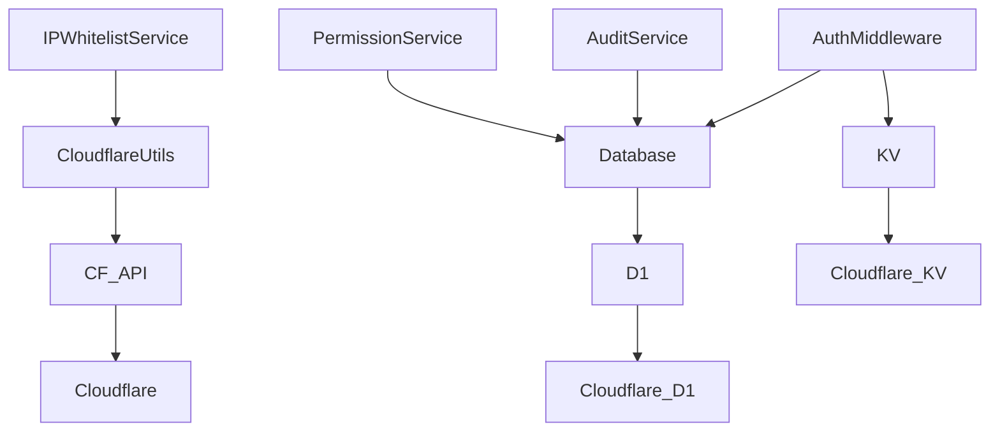

# 系统安全机制测试

<cite>
**本文档引用的文件**  
- [ipWhitelist.ts](file://backend/src/middleware/ipWhitelist.ts)
- [security.ts](file://backend/src/middleware/security.ts)
- [permission.ts](file://backend/src/middleware/permission.ts)
- [IPWhitelistService.ts](file://backend/src/services/IPWhitelistService.ts)
- [PermissionService.ts](file://backend/src/services/PermissionService.ts)
- [permissions.ts](file://backend/src/utils/permissions.ts)
- [audit.ts](file://backend/src/utils/audit.ts)
- [AuditService.ts](file://backend/src/services/AuditService.ts)
- [ip-whitelist.test.ts](file://backend/test/routes/ip-whitelist.test.ts)
- [audit.test.ts](file://backend/test/routes/audit.test.ts)
- [RBAC.test.ts](file://backend/test/services/RBAC.test.ts)
- [schema.ts](file://backend/src/db/schema.ts)
- [cloudflare.ts](file://backend/src/utils/cloudflare.ts)
</cite>

## 目录
1. [引言](#引言)
2. [项目结构](#项目结构)
3. [核心组件](#核心组件)
4. [架构概述](#架构概述)
5. [详细组件分析](#详细组件分析)
6. [依赖分析](#依赖分析)
7. [性能考虑](#性能考虑)
8. [故障排除指南](#故障排除指南)
9. [结论](#结论)

## 引言
本文档全面阐述了财务管理系统中系统级安全功能的测试方法，重点分析IP白名单、审计日志和职位权限控制（RBAC）的验证策略。通过分析实际代码实现和测试用例，详细说明如何测试IP过滤中间件的精确匹配、审计日志的完整性记录以及RBAC权限模型的细粒度控制。文档结合了安全测试的自动化集成方案和常见漏洞的预防措施，为确保系统安全提供了全面的指导。

## 项目结构
该财务管理系统采用分层架构，主要分为前端、后端和邮件工作服务。后端是安全机制的核心，其结构清晰，模块化程度高。安全相关的功能主要集中在`backend/src/middleware`、`backend/src/services`和`backend/src/utils`目录下。中间件（middleware）负责处理请求的预处理，如身份验证、权限检查和IP过滤。服务（services）层封装了业务逻辑，如权限服务和审计服务。工具（utils）层提供了通用的辅助函数，如权限判断和审计日志记录。

**图源**
- [middleware.ts](file://backend/src/middleware.ts)
- [IPWhitelistService.ts](file://backend/src/services/IPWhitelistService.ts)
- [PermissionService.ts](file://backend/src/services/PermissionService.ts)

**本节来源**
- [middleware.ts](file://backend/src/middleware.ts)
- [IPWhitelistService.ts](file://backend/src/services/IPWhitelistService.ts)
- [PermissionService.ts](file://backend/src/services/PermissionService.ts)

## 核心组件
系统的安全机制由三个核心组件构成：IP白名单、审计日志和基于职位的访问控制（RBAC）。IP白名单通过中间件在请求入口处进行过滤，利用Cloudflare的API实现高效的IP地址匹配。审计日志服务负责记录所有关键操作，确保所有行为可追溯。RBAC权限模型则根据用户的职位和部门，动态控制其对系统功能和数据的访问权限。这些组件协同工作，构建了一个纵深防御的安全体系。

**本节来源**
- [ipWhitelist.ts](file://backend/src/middleware/ipWhitelist.ts)
- [audit.ts](file://backend/src/utils/audit.ts)
- [permissions.ts](file://backend/src/utils/permissions.ts)

## 架构概述
系统的安全架构采用分层设计，从网络层到应用层，再到数据层，实现了多维度的防护。在网络层，通过Cloudflare的IP列表和防火墙规则，实现了对恶意IP的全局拦截。在应用层，通过中间件链（Middleware Chain）对每个请求进行身份验证、安全头设置、IP白名单检查和权限校验。在业务逻辑层，服务组件在执行操作前会进行细粒度的权限判断和数据访问控制。最后，所有关键操作都会被审计服务记录到数据库中，形成完整的操作日志。

**图源**
- [ipWhitelist.ts](file://backend/src/middleware/ipWhitelist.ts)
- [security.ts](file://backend/src/middleware/security.ts)
- [permission.ts](file://backend/src/middleware/permission.ts)
- [audit.ts](file://backend/src/utils/audit.ts)

## 详细组件分析

### IP白名单机制分析
IP白名单机制旨在限制只有特定IP地址的客户端才能访问系统。该机制通过一个中间件实现，它在请求处理流程的早期阶段运行。中间件首先检查请求路径，对健康检查等公共路径放行。然后，它从请求头中获取客户端IP，并查询一个缓存的IP列表。该列表从Cloudflare的IP列表服务中获取，并设置了60秒的缓存过期时间，以平衡性能和实时性。如果IP白名单规则已启用，且客户端IP不在白名单中，请求将被拒绝并返回403状态码。

**图源**
- [ipWhitelist.ts](file://backend/src/middleware/ipWhitelist.ts)
- [IPWhitelistService.ts](file://backend/src/services/IPWhitelistService.ts)
- [cloudflare.ts](file://backend/src/utils/cloudflare.ts)

**本节来源**
- [ipWhitelist.ts](file://backend/src/middleware/ipWhitelist.ts)
- [IPWhitelistService.ts](file://backend/src/services/IPWhitelistService.ts)
- [cloudflare.ts](file://backend/src/utils/cloudflare.ts)

### 审计日志机制分析
审计日志机制用于记录系统中所有关键操作，确保所有行为可追溯、可审计。该机制的核心是`AuditService`，它提供了一个`log`方法，用于将操作记录写入`audit_logs`数据库表。日志记录包含操作人（actor）、操作类型（action）、操作对象（entity）、操作时间（at）以及IP地址和归属地等信息。为了不影响主业务流程，日志记录被设计为异步操作，使用`waitUntil`来确保在请求响应后继续执行。此外，系统还提供了查询和导出审计日志的API，方便管理员进行审查。

**图源**
- [AuditService.ts](file://backend/src/services/AuditService.ts)
- [audit.ts](file://backend/src/utils/audit.ts)
- [schema.ts](file://backend/src/db/schema.ts)
- [audit.test.ts](file://backend/test/routes/audit.test.ts)

**本节来源**
- [AuditService.ts](file://backend/src/services/AuditService.ts)
- [audit.ts](file://backend/src/utils/audit.ts)
- [schema.ts](file://backend/src/db/schema.ts)

### 职位权限控制（RBAC）机制分析
职位权限控制（RBAC）机制是系统安全的核心，它根据员工的职位和部门来决定其访问权限。该机制基于一个六职位模型：总部主管、总部专员、项目主管、项目专员、组长和工程师。权限检查分为两个层面：模块访问权限和操作权限。首先，检查用户所在部门是否允许访问某个功能模块（如财务、人事）。其次，检查用户的职位是否具有执行特定操作（如创建、查看、审批）的权限。权限信息存储在职位（positions）表的`permissions`字段中，以JSON格式定义。

**图源**
- [permission.ts](file://backend/src/middleware/permission.ts)
- [permissions.ts](file://backend/src/utils/permissions.ts)
- [PermissionService.ts](file://backend/src/services/PermissionService.ts)
- [schema.ts](file://backend/src/db/schema.ts)

**本节来源**
- [permission.ts](file://backend/src/middleware/permission.ts)
- [permissions.ts](file://backend/src/utils/permissions.ts)
- [PermissionService.ts](file://backend/src/services/PermissionService.ts)

## 依赖分析
系统的安全功能依赖于多个内部和外部组件。内部依赖包括数据库（D1）、会话管理（KV）、日志记录和配置管理。外部依赖主要是Cloudflare的服务，包括IP列表（IP Lists）和自定义防火墙规则（Firewall Rules），用于实现IP白名单功能。这些依赖通过环境变量（Env）注入到服务中，确保了配置的灵活性和安全性。例如，`IPWhitelistService`依赖于`cloudflare.ts`中的工具函数来与Cloudflare API交互。

**图源**
- [IPWhitelistService.ts](file://backend/src/services/IPWhitelistService.ts)
- [PermissionService.ts](file://backend/src/services/PermissionService.ts)
- [AuditService.ts](file://backend/src/services/AuditService.ts)
- [middleware.ts](file://backend/src/middleware.ts)
- [cloudflare.ts](file://backend/src/utils/cloudflare.ts)

**本节来源**
- [IPWhitelistService.ts](file://backend/src/services/IPWhitelistService.ts)
- [PermissionService.ts](file://backend/src/services/PermissionService.ts)
- [AuditService.ts](file://backend/src/services/AuditService.ts)
- [middleware.ts](file://backend/src/middleware.ts)

## 性能考虑
在设计安全机制时，性能是一个关键考量因素。IP白名单中间件采用了内存缓存策略，将从Cloudflare获取的IP列表缓存在内存中，并设置了60秒的过期时间，这避免了对每个请求都进行外部API调用，极大地提升了性能。权限检查和审计日志记录也被设计为轻量级操作。权限检查主要依赖于内存中的上下文数据，而审计日志的写入则通过`waitUntil`异步执行，不会阻塞主请求流程。这种设计确保了安全功能不会成为系统的性能瓶颈。

## 故障排除指南
在测试和运行安全功能时，可能会遇到一些常见问题。对于IP白名单，如果规则未生效，应首先检查环境变量（如`CF_IP_LISTS_TOKEN`和`CF_ACCOUNT_ID`）是否正确配置，并确认Cloudflare API的权限是否足够。对于审计日志，如果日志未生成，应检查`logAuditAction`函数是否被正确调用，以及`waitUntil`是否在正确的执行上下文中。对于权限控制，如果出现意外的权限拒绝，应检查用户的职位`permissions`字段和部门`allowedModules`字段的配置是否正确。所有中间件和工具函数都包含了详细的错误日志，应优先查阅日志文件进行排查。

**本节来源**
- [ipWhitelist.ts](file://backend/src/middleware/ipWhitelist.ts)
- [audit.ts](file://backend/src/utils/audit.ts)
- [permissions.ts](file://backend/src/utils/permissions.ts)
- [cloudflare.ts](file://backend/src/utils/cloudflare.ts)

## 结论
本文档详细分析了财务管理系统中的IP白名单、审计日志和职位权限控制三大安全机制。通过结合代码实现和测试用例，展示了这些机制如何协同工作，构建一个安全、可靠、可审计的系统。IP白名单提供了网络层面的第一道防线，审计日志确保了所有操作的可追溯性，而RBAC权限模型则实现了细粒度的访问控制。这些机制的设计充分考虑了性能和可靠性，为系统的安全运行提供了坚实保障。未来的测试应重点关注这些组件的集成和边界情况，以确保整个安全体系的健壮性。