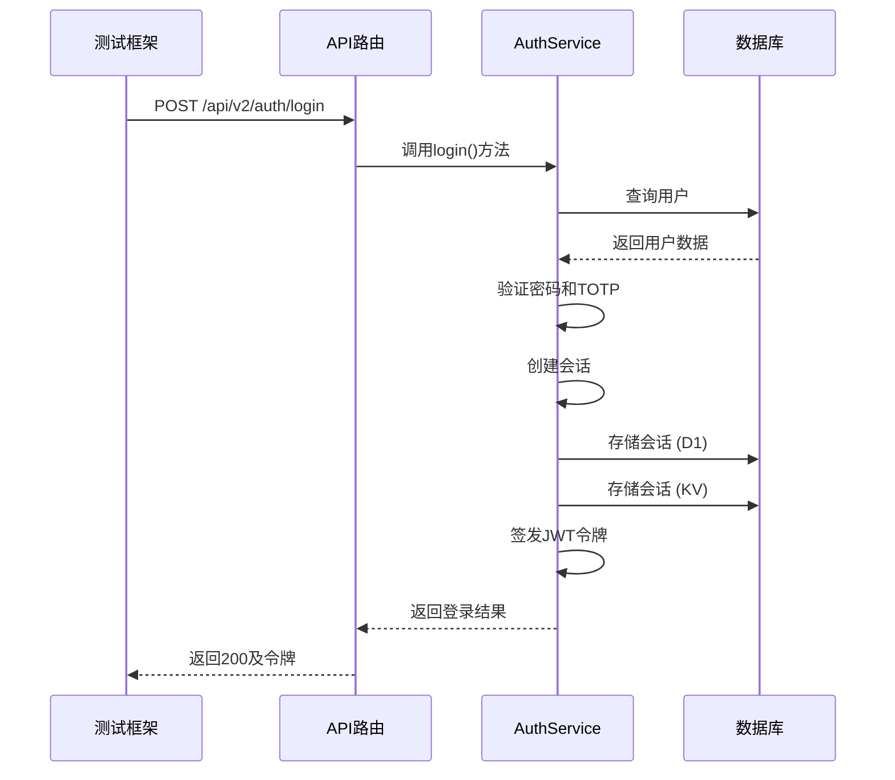
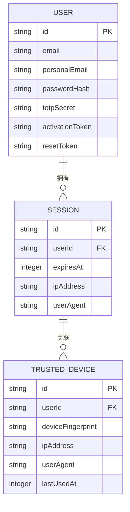
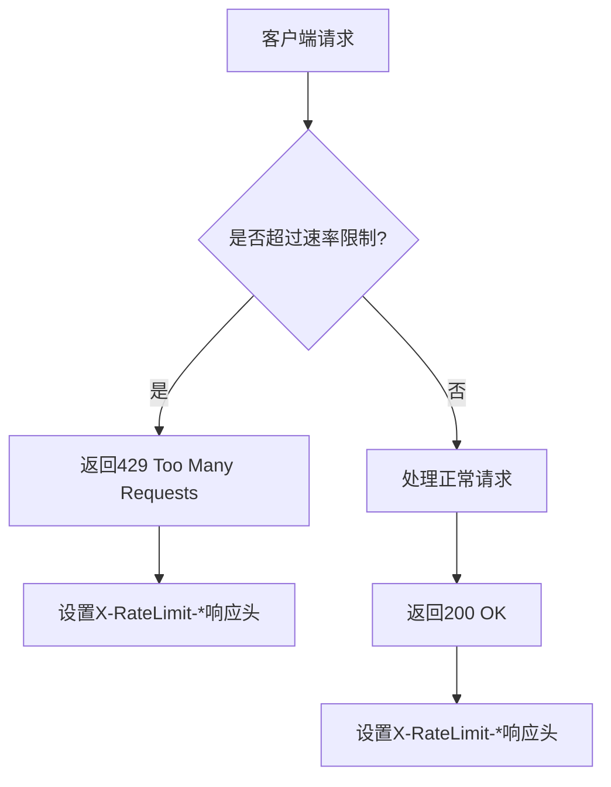

# 认证API测试

<cite>
**本文档引用的文件**
- [auth.test.ts](file://backend/test/routes/v2/auth.test.ts)
- [auth.ts](file://backend/src/routes/v2/auth.ts)
- [AuthService.ts](file://backend/src/services/AuthService.ts)
- [jwt.ts](file://backend/src/utils/jwt.ts)
- [security.ts](file://backend/src/middleware/security.ts)
- [rateLimit.ts](file://backend/middleware/rateLimit.ts)
- [RateLimitService.ts](file://backend/src/services/RateLimitService.ts)
- [schema.ts](file://backend/src/db/schema.ts)
- [response.ts](file://backend/src/utils/response.ts)
- [business.schema.ts](file://backend/src/schemas/business.schema.ts)
- [errorCodes.ts](file://backend/src/constants/errorCodes.ts)
- [activation.test.ts](file://backend/test/services/activation.test.ts)
- [password_reset.test.ts](file://backend/test/services/password_reset.test.ts)
</cite>

## 目录
1. [引言](#引言)
2. [认证API端到端测试策略](#认证api端到端测试策略)
3. [JWT令牌与会话管理测试](#jwt令牌与会话管理测试)
4. [安全中间件与头信息测试](#安全中间件与头信息测试)
5. [异常场景与错误处理测试](#异常场景与错误处理测试)
6. [测试工具与辅助方法](#测试工具与辅助方法)
7. [结论](#结论)

## 引言

本文件详细阐述了针对认证相关API的测试策略，重点分析了`v2/auth.test.ts`中的登录、双因素认证（TOTP）、密码重置和账户激活等核心端点的端到端测试。文档深入探讨了如何验证JWT令牌的生成与刷新机制、会话管理的持久性与安全性，以及关键安全头的正确设置。同时，涵盖了对无效凭证、TOTP码错误、账户锁定等异常场景的全面测试。此外，还提供了在测试中模拟认证流程、生成测试令牌以及验证安全中间件行为的具体实现方法。

**本文档引用的文件**
- [auth.test.ts](file://backend/test/routes/v2/auth.test.ts)
- [auth.ts](file://backend/src/routes/v2/auth.ts)

## 认证API端到端测试策略

认证API的测试策略旨在通过端到端（E2E）测试，全面验证从用户请求到系统响应的完整流程。测试用例直接调用API端点，确保路由、中间件、业务逻辑和数据库交互的正确性。

### 登录与账户激活测试

登录和账户激活是认证流程的核心。测试用例首先在数据库中创建一个模拟用户，然后通过`/api/v2/auth/login`端点发起登录请求。测试验证了成功登录后，响应体中包含有效的JWT令牌（`data.token`）和用户信息（`data.user`），并确认状态码为200。

对于账户激活流程，测试用例遵循“创建员工 -> 生成激活令牌 -> 验证令牌 -> 提交激活请求”的完整路径。`activation.test.ts`中的测试验证了新创建的员工记录包含有效的`activationToken`，并且`/auth/activate`端点在提供正确密码和TOTP码后，能够成功激活账户并自动登录，返回会话令牌。

**图源**
- [auth.test.ts](file://backend/test/routes/v2/auth.test.ts#L29-L98)
- [auth.ts](file://backend/src/routes/v2/auth.ts#L82-L144)
- [AuthService.ts](file://backend/src/services/AuthService.ts#L34-L148)

### 双因素认证（TOTP）测试

双因素认证（TOTP）的测试确保了在2FA启用时，新设备登录必须提供有效的TOTP码。测试用例通过`authenticator.generate(totpSecret)`生成一个有效的TOTP码，并将其作为请求体的一部分发送。系统会验证该码的有效性，若验证失败，则返回401错误。测试还验证了信任设备机制：当TOTP验证成功后，该设备的指纹会被添加到`trustedDevices`表中，后续登录将不再需要TOTP码。

### 密码重置与TOTP重置测试

密码重置流程的测试覆盖了从请求重置链接到最终重置密码的全过程。`password_reset.test.ts`中的测试用例首先调用`requestPasswordReset`，验证系统会为用户生成一个`resetToken`并发送邮件。随后，通过`verifyResetToken`验证令牌的有效性，最后调用`resetPassword`使用新密码完成重置。成功重置后，系统会自动登录用户，测试用例会验证新密码是否生效，旧密码是否失效。

TOTP重置流程（`/auth/mobile/request-totp-reset`）的设计旨在防止账户锁定。测试验证了该流程会生成一个一次性令牌（存储在KV中），用户点击链接后可以重置其TOTP绑定，从而恢复账户访问权限。

**本节源码**
- [password_reset.test.ts](file://backend/test/services/password_reset.test.ts#L113-L159)
- [AuthService.ts](file://backend/src/services/AuthService.ts#L229-L327)

## JWT令牌与会话管理测试

JWT令牌和会话管理是认证安全性的基石。测试策略确保了令牌的生成、验证和会话的持久化都符合预期。

### JWT令牌生成与验证

测试用例验证了`signAuthToken`和`verifyAuthToken`函数的正确性。在登录成功后，系统会调用`signAuthToken`生成一个包含用户会话ID（`sid`）、用户ID（`sub`）、邮箱和职位信息的JWT令牌。测试通过解析响应中的`data.token`来验证其结构和内容。同时，测试也验证了过期令牌和无效签名的处理，确保`verifyAuthToken`函数能正确抛出“Token expired”或“Invalid token signature”错误。

### 会话管理与单点登录

会话管理测试验证了会话在D1数据库和KV存储中的双重写入机制。`createSession`方法在创建会话时，会同时向`sessions`表和`SESSIONS_KV`命名空间写入数据，以实现高性能缓存和持久化备份。测试还验证了单点登录（SSO）行为：当用户在新设备上登录时，系统会删除该用户在所有旧设备上的会话记录，确保同一时间只有一个活跃会话。

**图源**
- [jwt.ts](file://backend/src/utils/jwt.ts#L72-L124)
- [AuthService.ts](file://backend/src/services/AuthService.ts#L150-L198)
- [schema.ts](file://backend/src/db/schema.ts#L118-L137)

## 安全中间件与头信息测试

安全中间件是保护API免受常见Web攻击的关键。测试策略确保了所有响应都包含了必要的安全头。

### 安全响应头验证

`securityHeaders`中间件为所有响应添加了多种安全头。测试用例通过检查API响应的头部信息来验证这些头的存在和正确性。例如，`X-Content-Type-Options: nosniff`防止了MIME类型嗅探，`X-Frame-Options: DENY`阻止了点击劫持攻击，`Content-Security-Policy`（CSP）限制了可加载资源的来源，有效防御了XSS攻击。

### 速率限制测试

速率限制中间件（`rateLimit.ts`）保护了敏感端点，如登录和密码重置，防止暴力破解。测试用例通过在短时间内发送大量请求来触发限流。例如，`loginRateLimit`配置为每IP每分钟最多5次尝试。测试验证了当超过限制时，系统会返回429状态码，并在响应头中包含`X-RateLimit-Remaining`和`Retry-After`，告知客户端剩余尝试次数和重试时间。

**图源**
- [security.ts](file://backend/src/middleware/security.ts#L19-L80)
- [rateLimit.ts](file://backend/src/middleware/rateLimit.ts#L66-L71)
- [RateLimitService.ts](file://backend/src/services/RateLimitService.ts#L15-L48)

## 异常场景与错误处理测试

全面的测试必须覆盖各种异常和错误场景，以确保系统的健壮性和用户体验。

### 无效凭证与账户状态测试

测试用例验证了系统对无效凭证的处理。当提供错误的邮箱或密码时，`login`方法会抛出`UNAUTHORIZED`错误，测试确保API返回正确的错误码（`AUTH_INVALID_CREDENTIALS`）和用户友好的消息。此外，测试还覆盖了各种账户状态，如停用账户（`active=0`）会返回`FORBIDDEN`错误，未设置密码的账户会阻止登录。

### TOTP与令牌过期测试

对于TOTP相关的异常，测试验证了提供错误TOTP码会返回401错误。对于令牌过期，测试用例通过手动修改数据库中的`resetExpiresAt`或`activationExpiresAt`字段，使其小于当前时间，然后调用`verifyResetToken`或`verifyActivationToken`，验证系统会正确返回“重置链接已过期”或“激活链接已过期”的业务错误。

### 统一错误响应格式

所有错误响应都遵循统一的`ApiResponse`格式，即`{ success: false, error: { code, message } }`。测试用例断言了错误响应的结构，确保前端能够一致地处理所有错误，提升用户体验。

**本节源码**
- [auth.test.ts](file://backend/test/routes/v2/auth.test.ts#L161-L181)
- [AuthService.ts](file://backend/src/services/AuthService.ts#L265-L274)
- [errorCodes.ts](file://backend/src/constants/errorCodes.ts#L5-L31)

## 测试工具与辅助方法

为了高效地编写和执行测试，项目利用了一系列工具和辅助方法。

### Vitest与Drizzle ORM

测试框架采用Vitest，它提供了`describe`、`it`、`expect`等简洁的API。数据库操作通过Drizzle ORM进行，测试用例在`beforeEach`钩子中清理相关表（如`employees`、`sessions`），确保每次测试都在一个干净的环境中运行，避免了测试间的相互干扰。

### 模拟环境与服务

测试通过`env`对象模拟了Cloudflare环境变量，如`AUTH_JWT_SECRET`，这对于JWT的生成和验证至关重要。同时，测试用例通过`vi.fn()`模拟了`EmailService`等外部依赖，避免了在测试中发送真实邮件，保证了测试的快速和可重复性。

### 请求上下文模拟

由于API运行在Cloudflare Workers环境中，测试需要模拟`executionCtx`。测试用例创建了一个包含`waitUntil`方法的对象，用于捕获异步任务（如发送邮件），并通过`Promise.all(tasks)`等待这些任务完成，从而确保了异步操作的完整性。

**本节源码**
- [auth.test.ts](file://backend/test/routes/v2/auth.test.ts#L1-L28)
- [password_reset.test.ts](file://backend/test/services/password_reset.test.ts#L27-L35)

## 结论

本文档详细阐述了认证API的全面测试策略。通过端到端测试，我们验证了登录、双因素认证、密码重置和账户激活等核心功能的正确性。测试覆盖了JWT令牌的生成与验证、会话管理的持久性、安全中间件的防护能力以及各种异常场景的处理。利用Vitest、Drizzle ORM和环境模拟，我们构建了一套高效、可靠且可维护的测试套件，为系统的安全性和稳定性提供了坚实保障。