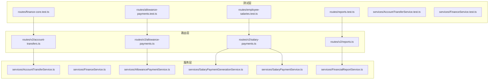
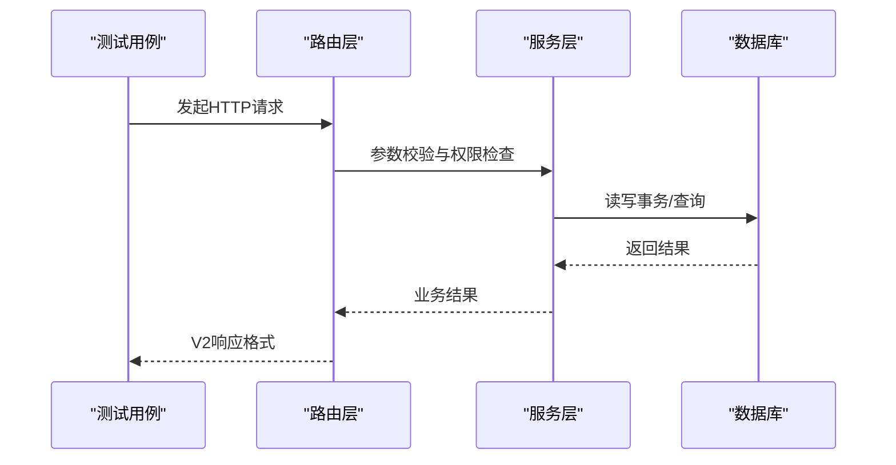
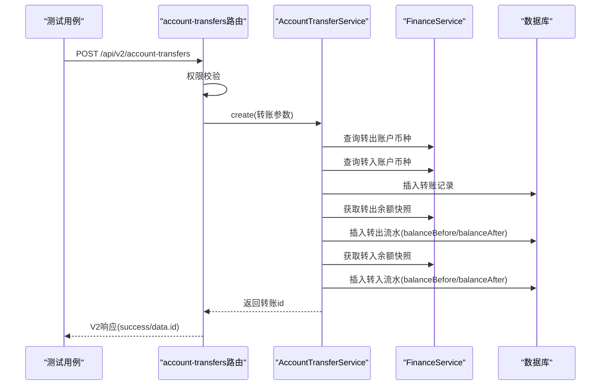
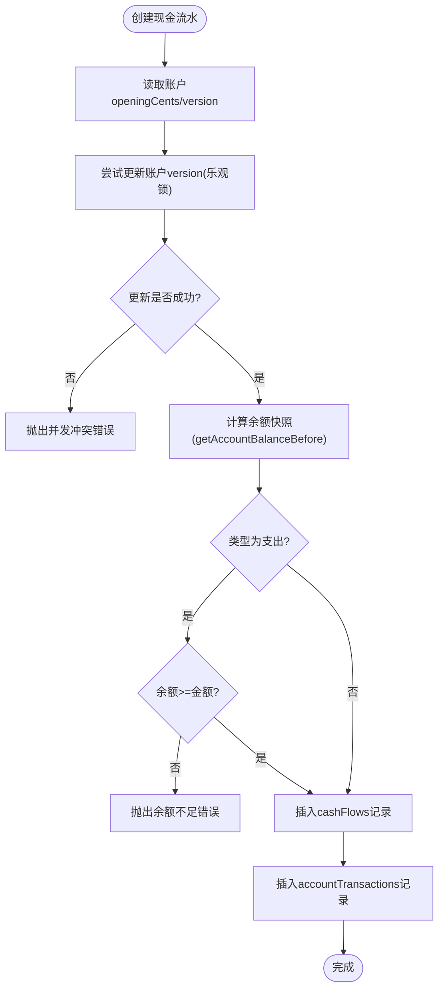
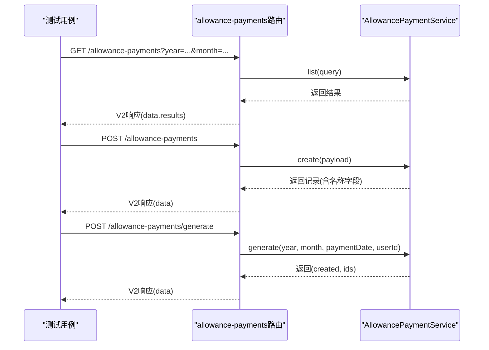
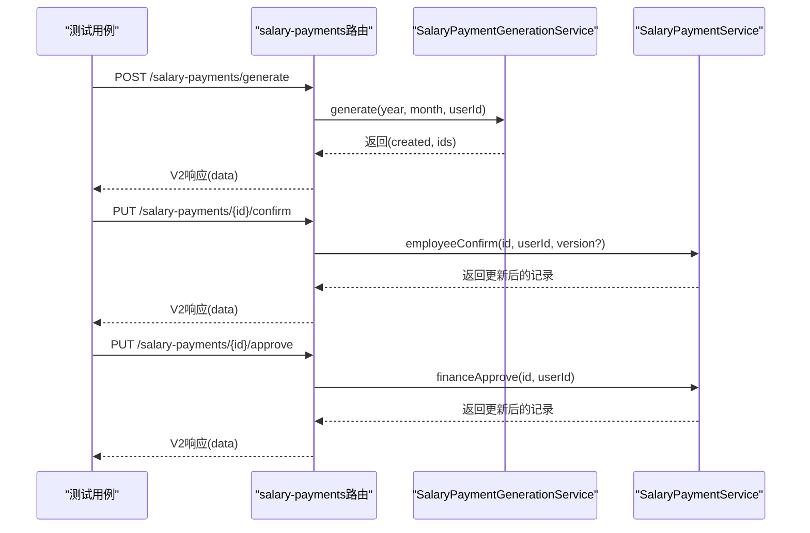
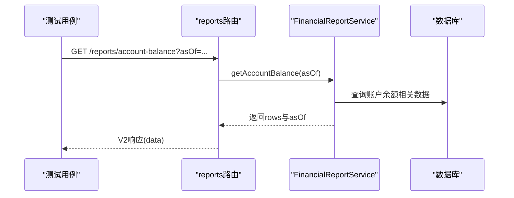
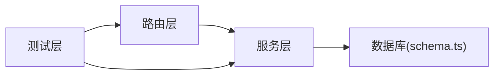

# 财务核心API测试

<cite>
**本文引用的文件**
- [finance-core.test.ts](file://backend/test/routes/finance-core.test.ts)
- [account-transfers.ts](file://backend/src/routes/v2/account-transfers.ts)
- [AccountTransferService.ts](file://backend/src/services/AccountTransferService.ts)
- [AccountTransferService.test.ts](file://backend/test/services/AccountTransferService.test.ts)
- [FinanceService.ts](file://backend/src/services/FinanceService.ts)
- [FinanceService.test.ts](file://backend/test/services/FinanceService.test.ts)
- [allowance-payments.test.ts](file://backend/test/routes/allowance-payments.test.ts)
- [allowance-payments.ts](file://backend/src/routes/v2/allowance-payments.ts)
- [AllowancePaymentService.ts](file://backend/src/services/AllowancePaymentService.ts)
- [employee-salaries.test.ts](file://backend/test/routes/employee-salaries.test.ts)
- [salary-payments.ts](file://backend/src/routes/v2/salary-payments.ts)
- [SalaryPaymentGenerationService.ts](file://backend/src/services/SalaryPaymentGenerationService.ts)
- [SalaryPaymentService.ts](file://backend/src/services/SalaryPaymentService.ts)
- [reports.test.ts](file://backend/test/routes/reports.test.ts)
- [reports.ts](file://backend/src/routes/v2/reports.ts)
- [FinancialReportService.ts](file://backend/src/services/FinancialReportService.ts)
- [schema.ts](file://backend/src/db/schema.ts)
</cite>

## 目录
1. [简介](#简介)
2. [项目结构](#项目结构)
3. [核心组件](#核心组件)
4. [架构总览](#架构总览)
5. [详细组件分析](#详细组件分析)
6. [依赖关系分析](#依赖关系分析)
7. [性能与并发特性](#性能与并发特性)
8. [故障排查指南](#故障排查指南)
9. [结论](#结论)
10. [附录](#附录)

## 简介
本文件系统化梳理财务核心API测试方案，聚焦以下目标：
- 解析 finance-core.test.ts 中账户、流水、转账等财务操作的测试逻辑
- 说明如何验证金额计算精度、账户余额一致性、事务完整性以及并发操作的正确性
- 结合 allowance-payments 和 employee-salaries 测试文件，展示薪资与津贴发放流程的端到端验证，包括审批状态变更、支付记录生成与财务报表数据同步的测试方法

## 项目结构
财务测试主要分布在 backend/test/routes 与 backend/test/services 下，分别覆盖路由层与服务层的端到端与单元测试；前端与后端的报表接口通过 reports 路由与服务进行验证。

图表来源
- [finance-core.test.ts](file://backend/test/routes/finance-core.test.ts#L1-L416)
- [allowance-payments.test.ts](file://backend/test/routes/allowance-payments.test.ts#L1-L252)
- [employee-salaries.test.ts](file://backend/test/routes/employee-salaries.test.ts#L1-L218)
- [reports.test.ts](file://backend/test/routes/reports.test.ts#L1-L149)
- [account-transfers.ts](file://backend/src/routes/v2/account-transfers.ts#L1-L234)
- [allowance-payments.ts](file://backend/src/routes/v2/allowance-payments.ts#L34-L71)
- [salary-payments.ts](file://backend/src/routes/v2/salary-payments.ts#L47-L95)
- [reports.ts](file://backend/src/routes/v2/reports.ts#L359-L515)
- [AccountTransferService.ts](file://backend/src/services/AccountTransferService.ts#L1-L124)
- [FinanceService.ts](file://backend/src/services/FinanceService.ts#L1-L200)
- [AllowancePaymentService.ts](file://backend/src/services/AllowancePaymentService.ts#L1-L200)
- [SalaryPaymentGenerationService.ts](file://backend/src/services/SalaryPaymentGenerationService.ts#L1-L276)
- [SalaryPaymentService.ts](file://backend/src/services/SalaryPaymentService.ts#L150-L326)
- [FinancialReportService.ts](file://backend/src/services/FinancialReportService.ts#L1-L49)

章节来源
- [finance-core.test.ts](file://backend/test/routes/finance-core.test.ts#L1-L416)
- [reports.test.ts](file://backend/test/routes/reports.test.ts#L1-L149)

## 核心组件
- 财务核心路由与服务
  - 账户转账：路由定义与服务实现，包含转账记录创建、转出/转入交易流水生成与余额快照计算
  - 现金流水：路由定义与服务实现，包含凭证号生成、余额快照与并发控制
- 薪资与津贴支付
  - 津贴支付：路由与服务，支持列表、创建、更新、删除、批量生成
  - 薪资支付：路由与服务，支持生成、查询、员工确认、财务审批、删除与回退，配合状态机与乐观锁
- 报表与数据校验
  - 报表接口：AR/AP汇总、明细、部门现金流、账户余额等
  - 服务层报表：按条件聚合、结算统计与汇总

章节来源
- [account-transfers.ts](file://backend/src/routes/v2/account-transfers.ts#L1-L234)
- [AccountTransferService.ts](file://backend/src/services/AccountTransferService.ts#L1-L124)
- [FinanceService.ts](file://backend/src/services/FinanceService.ts#L1-L200)
- [allowance-payments.ts](file://backend/src/routes/v2/allowance-payments.ts#L34-L71)
- [AllowancePaymentService.ts](file://backend/src/services/AllowancePaymentService.ts#L1-L200)
- [salary-payments.ts](file://backend/src/routes/v2/salary-payments.ts#L47-L95)
- [SalaryPaymentGenerationService.ts](file://backend/src/services/SalaryPaymentGenerationService.ts#L1-L276)
- [SalaryPaymentService.ts](file://backend/src/services/SalaryPaymentService.ts#L150-L326)
- [reports.ts](file://backend/src/routes/v2/reports.ts#L359-L515)
- [FinancialReportService.ts](file://backend/src/services/FinancialReportService.ts#L1-L49)

## 架构总览
财务核心API测试采用“路由层+服务层”的双层验证策略：
- 路由层测试：通过构造请求体与鉴权头，验证响应格式、权限校验与审计日志
- 服务层测试：直接调用服务方法，验证业务规则、并发控制与数据一致性

图表来源
- [finance-core.test.ts](file://backend/test/routes/finance-core.test.ts#L226-L311)
- [account-transfers.ts](file://backend/src/routes/v2/account-transfers.ts#L119-L184)
- [AccountTransferService.ts](file://backend/src/services/AccountTransferService.ts#L44-L124)

## 详细组件分析

### 账户转账测试与实现
- 测试要点
  - 转账创建：校验响应success与返回id
  - 权限与审计：路由层对转账创建进行权限校验并记录审计动作
  - 数据一致性：服务层在转账后生成两条流水记录（转出/转入），并基于余额快照计算balanceBefore/balanceAfter
- 并发与事务
  - 服务层通过余额快照函数获取转账前余额，避免跨事务读取导致的不一致
  - 路由层使用统一中间件注入服务实例，便于测试时替换为mock服务

图表来源
- [finance-core.test.ts](file://backend/test/routes/finance-core.test.ts#L264-L311)
- [account-transfers.ts](file://backend/src/routes/v2/account-transfers.ts#L119-L184)
- [AccountTransferService.ts](file://backend/src/services/AccountTransferService.ts#L44-L124)
- [schema.ts](file://backend/src/db/schema.ts#L448-L476)

章节来源
- [finance-core.test.ts](file://backend/test/routes/finance-core.test.ts#L264-L311)
- [AccountTransferService.test.ts](file://backend/test/services/AccountTransferService.test.ts#L127-L161)
- [AccountTransferService.ts](file://backend/src/services/AccountTransferService.ts#L1-L124)
- [account-transfers.ts](file://backend/src/routes/v2/account-transfers.ts#L119-L184)
- [schema.ts](file://backend/src/db/schema.ts#L448-L476)

### 现金流水测试与实现
- 测试要点
  - 凭证号生成：按业务日期与流水计数生成唯一凭证号
  - 余额快照：根据转账前最后一条交易计算balanceBefore
  - 并发控制：通过更新账户version字段实现乐观锁，防止并发写入导致的余额不一致
- 错误处理
  - 余额不足：支出类型且余额不足时抛出业务错误
  - 并发冲突：version不匹配时抛出冲突错误

图表来源
- [FinanceService.ts](file://backend/src/services/FinanceService.ts#L146-L190)
- [FinanceService.test.ts](file://backend/test/services/FinanceService.test.ts#L138-L200)

章节来源
- [FinanceService.ts](file://backend/src/services/FinanceService.ts#L1-L200)
- [FinanceService.test.ts](file://backend/test/services/FinanceService.test.ts#L138-L200)

### 津贴支付测试与实现
- 测试要点
  - 列表/创建/更新/删除：验证V2响应格式与字段映射
  - 批量生成：支持按年月生成，去重与幂等
- 业务规则
  - 重复校验：同员工、年、月、津贴类型、币种的组合不允许重复
  - 生成策略：按在职员工与津贴配置生成支付记录

图表来源
- [allowance-payments.test.ts](file://backend/test/routes/allowance-payments.test.ts#L87-L251)
- [allowance-payments.ts](file://backend/src/routes/v2/allowance-payments.ts#L34-L71)
- [AllowancePaymentService.ts](file://backend/src/services/AllowancePaymentService.ts#L1-L200)

章节来源
- [allowance-payments.test.ts](file://backend/test/routes/allowance-payments.test.ts#L1-L252)
- [allowance-payments.ts](file://backend/src/routes/v2/allowance-payments.ts#L34-L71)
- [AllowancePaymentService.ts](file://backend/src/services/AllowancePaymentService.ts#L1-L200)

### 薪资支付测试与实现
- 测试要点
  - 列表/创建/批量更新/删除：验证V2响应格式
  - 生成流程：按年月生成薪资支付记录，过滤入职日期与现有记录
  - 审批状态机：员工确认、财务审批、删除与回退均受状态机约束
- 并发与版本控制
  - 员工确认与财务审批支持版本号校验，避免并发修改导致的状态不一致

图表来源
- [employee-salaries.test.ts](file://backend/test/routes/employee-salaries.test.ts#L80-L218)
- [salary-payments.ts](file://backend/src/routes/v2/salary-payments.ts#L47-L95)
- [SalaryPaymentGenerationService.ts](file://backend/src/services/SalaryPaymentGenerationService.ts#L1-L276)
- [SalaryPaymentService.ts](file://backend/src/services/SalaryPaymentService.ts#L150-L326)

章节来源
- [employee-salaries.test.ts](file://backend/test/routes/employee-salaries.test.ts#L1-L218)
- [salary-payments.ts](file://backend/src/routes/v2/salary-payments.ts#L47-L95)
- [SalaryPaymentGenerationService.ts](file://backend/src/services/SalaryPaymentGenerationService.ts#L1-L276)
- [SalaryPaymentService.ts](file://backend/src/services/SalaryPaymentService.ts#L150-L326)

### 报表与数据同步测试
- 测试要点
  - 报表接口：支持AR/AP汇总/明细、部门现金流、账户余额等查询
  - 数据一致性：通过报表服务聚合数据，验证统计口径与范围
- 实现要点
  - 报表服务按条件筛选与聚合，支持结算金额汇总
  - 路由层进行权限校验与参数校验

图表来源
- [reports.test.ts](file://backend/test/routes/reports.test.ts#L1-L149)
- [reports.ts](file://backend/src/routes/v2/reports.ts#L480-L515)
- [FinancialReportService.ts](file://backend/src/services/FinancialReportService.ts#L1-L49)

章节来源
- [reports.test.ts](file://backend/test/routes/reports.test.ts#L1-L149)
- [reports.ts](file://backend/src/routes/v2/reports.ts#L359-L515)
- [FinancialReportService.ts](file://backend/src/services/FinancialReportService.ts#L1-L49)

## 依赖关系分析
- 路由层依赖服务层：路由负责参数校验、权限与审计，服务层负责业务逻辑与数据访问
- 服务层依赖数据库：通过Drizzle ORM访问schema定义的表结构
- 测试层通过mock中间件注入服务实例，隔离外部依赖

图表来源
- [account-transfers.ts](file://backend/src/routes/v2/account-transfers.ts#L1-L234)
- [AccountTransferService.ts](file://backend/src/services/AccountTransferService.ts#L1-L124)
- [schema.ts](file://backend/src/db/schema.ts#L448-L476)

章节来源
- [account-transfers.ts](file://backend/src/routes/v2/account-transfers.ts#L1-L234)
- [schema.ts](file://backend/src/db/schema.ts#L448-L476)

## 性能与并发特性
- 金额计算精度
  - 金额以“分”为单位存储，避免浮点误差
  - 转账exchangeRate字段使用real类型，若涉及汇率计算需注意精度
- 余额一致性
  - 余额快照通过“交易日期<业务日期且创建时间<当前时间”的规则查找最近一笔交易，保证快照一致性
- 事务完整性
  - 账户转账与薪资删除均使用事务包裹，确保多表写入的一致性
- 并发控制
  - 现金流创建通过账户version字段乐观锁，防止并发写入导致的余额不一致
  - 薪资支付的员工确认与财务审批支持版本号校验，避免竞态

章节来源
- [schema.ts](file://backend/src/db/schema.ts#L448-L476)
- [FinanceService.ts](file://backend/src/services/FinanceService.ts#L146-L190)
- [AccountTransferService.ts](file://backend/src/services/AccountTransferService.ts#L44-L124)
- [SalaryPaymentService.ts](file://backend/src/services/SalaryPaymentService.ts#L150-L326)

## 故障排查指南
- 余额不足
  - 现象：创建现金流水时报余额不足
  - 排查：确认业务日期前是否存在交易；检查账户openingCents与历史交易累计
- 并发冲突
  - 现象：创建现金流水报并发冲突
  - 排查：检查version字段是否被其他请求更新；重试或增加重试间隔
- 状态机错误
  - 现象：薪资支付状态转换失败
  - 排查：确认当前状态与目标状态是否满足状态机约束；检查分配状态是否已批准
- 重复记录
  - 现象：创建津贴支付报重复
  - 排查：确认员工、年、月、津贴类型、币种组合是否已存在

章节来源
- [FinanceService.ts](file://backend/src/services/FinanceService.ts#L146-L190)
- [SalaryPaymentService.ts](file://backend/src/services/SalaryPaymentService.ts#L150-L326)
- [AllowancePaymentService.ts](file://backend/src/services/AllowancePaymentService.ts#L62-L95)

## 结论
本测试方案通过路由层与服务层的协同验证，覆盖了财务核心功能的关键路径：账户转账、现金流水、津贴与薪资支付、以及报表数据。测试重点在于：
- 金额与凭证号的精确性
- 余额快照与乐观锁保障的事务一致性
- 审批状态机与版本控制的并发安全
- 报表接口的数据口径与范围校验

建议在回归测试中持续补充边界场景（如极端日期、高并发、异常网络中断）以进一步提升稳定性。

## 附录
- 测试文件清单
  - 财务核心：finance-core.test.ts
  - 津贴支付：allowance-payments.test.ts
  - 薪资支付：employee-salaries.test.ts
  - 报表：reports.test.ts
  - 服务层单元测试：AccountTransferService.test.ts、FinanceService.test.ts