# 测试策略

<cite>
**本文档中引用的文件**  
- [vitest.config.ts](file://backend/vitest.config.ts)
- [playwright.config.ts](file://frontend/playwright.config.ts)
- [setup.ts](file://backend/test/setup.ts)
- [AccountService.test.ts](file://backend/test/services/AccountService.test.ts)
- [auth.test.ts](file://backend/test/routes/v2/auth.test.ts)
- [logger.test.ts](file://backend/test/utils/logger.test.ts)
- [login.spec.ts](file://frontend/tests/login.spec.ts)
- [finance-flows.spec.ts](file://frontend/tests/finance-flows.spec.ts)
- [employee-management.spec.ts](file://frontend/tests/employee-management.spec.ts)
- [mock-api.ts](file://frontend/tests/utils/mock-api.ts)
- [package.json](file://backend/package.json)
- [package.json](file://frontend/package.json)
</cite>

## 目录
1. [简介](#简介)
2. [后端测试策略](#后端测试策略)
3. [前端测试策略](#前端测试策略)
4. [测试配置详解](#测试配置详解)
5. [CI/CD集成](#cicd集成)
6. [测试覆盖率与最佳实践](#测试覆盖率与最佳实践)
7. [结论](#结论)

## 简介
本测试策略文档旨在全面阐述财务管理系统中单元测试、集成测试和端到端测试的实施方法。系统采用Vitest作为后端测试框架，对服务层、路由和工具函数进行测试，同时使用Playwright进行前端UI自动化测试。文档详细说明了测试模式、配置参数、CI/CD集成方式以及测试覆盖率目标，确保代码质量和系统稳定性。

## 后端测试策略

### 单元测试与集成测试模式
后端测试采用Vitest框架，对服务层、路由和工具函数进行单元测试和集成测试。测试代码位于`backend/test`目录下，分为`services`、`routes`和`utils`三个子目录，分别对应不同层级的测试。

在服务层测试中，以`AccountService.test.ts`为例，测试用例验证了账户管理服务的完整功能，包括获取账户列表、创建账户、更新账户和删除账户等操作。测试通过Drizzle ORM与D1数据库进行交互，使用`beforeAll`和`beforeEach`钩子初始化数据库schema和清理测试数据，确保测试的独立性和可重复性。

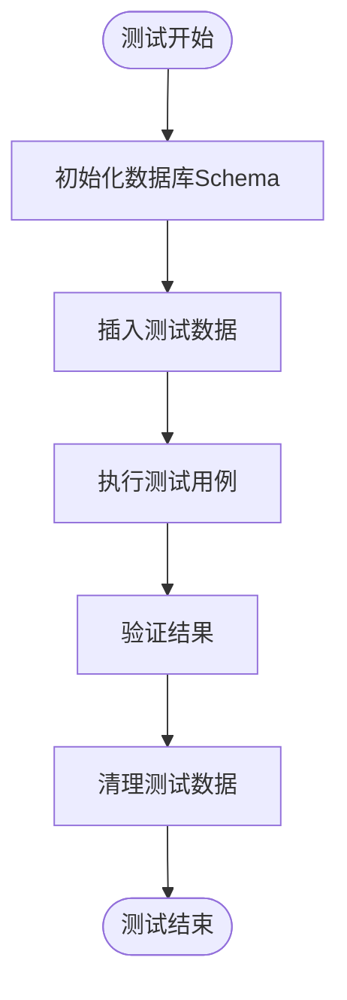

**Diagram sources**
- [AccountService.test.ts](file://backend/test/services/AccountService.test.ts#L16-L282)
- [setup.ts](file://backend/test/setup.ts#L1-L27)

**Section sources**
- [AccountService.test.ts](file://backend/test/services/AccountService.test.ts#L1-L282)
- [setup.ts](file://backend/test/setup.ts#L1-L27)

### Mock数据与依赖注入
后端测试中广泛使用Mock数据和依赖注入来隔离测试环境。在`vitest.config.ts`中，通过`resolve.alias`配置将`mimetext`模块指向测试专用的Mock实现，避免实际发送邮件。同时，在`miniflare`配置中，通过`serviceBindings`将`EMAIL_SERVICE`绑定到一个返回成功响应的Mock函数，确保邮件服务不会在测试中实际调用。

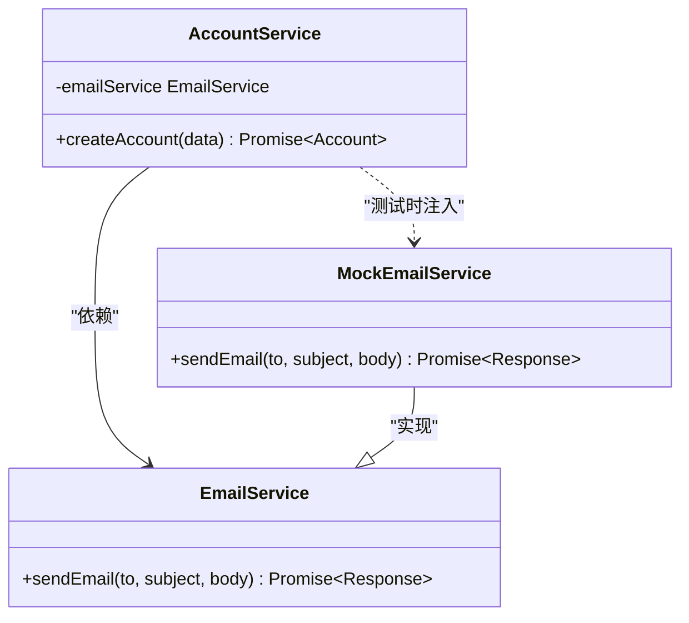

**Diagram sources**
- [vitest.config.ts](file://backend/vitest.config.ts#L17-L18)
- [AccountService.test.ts](file://backend/test/services/AccountService.test.ts#L4-L5)

**Section sources**
- [vitest.config.ts](file://backend/vitest.config.ts#L1-L47)
- [AccountService.test.ts](file://backend/test/services/AccountService.test.ts#L1-L282)

### 路由测试
路由测试通过直接调用Hono应用实例来模拟HTTP请求，验证API端点的正确性。以`auth.test.ts`为例，测试用例验证了登录和获取用户信息两个API端点。测试中使用`app.request`方法发送HTTP请求，并通过`testEnv`参数注入测试环境变量，如JWT密钥。

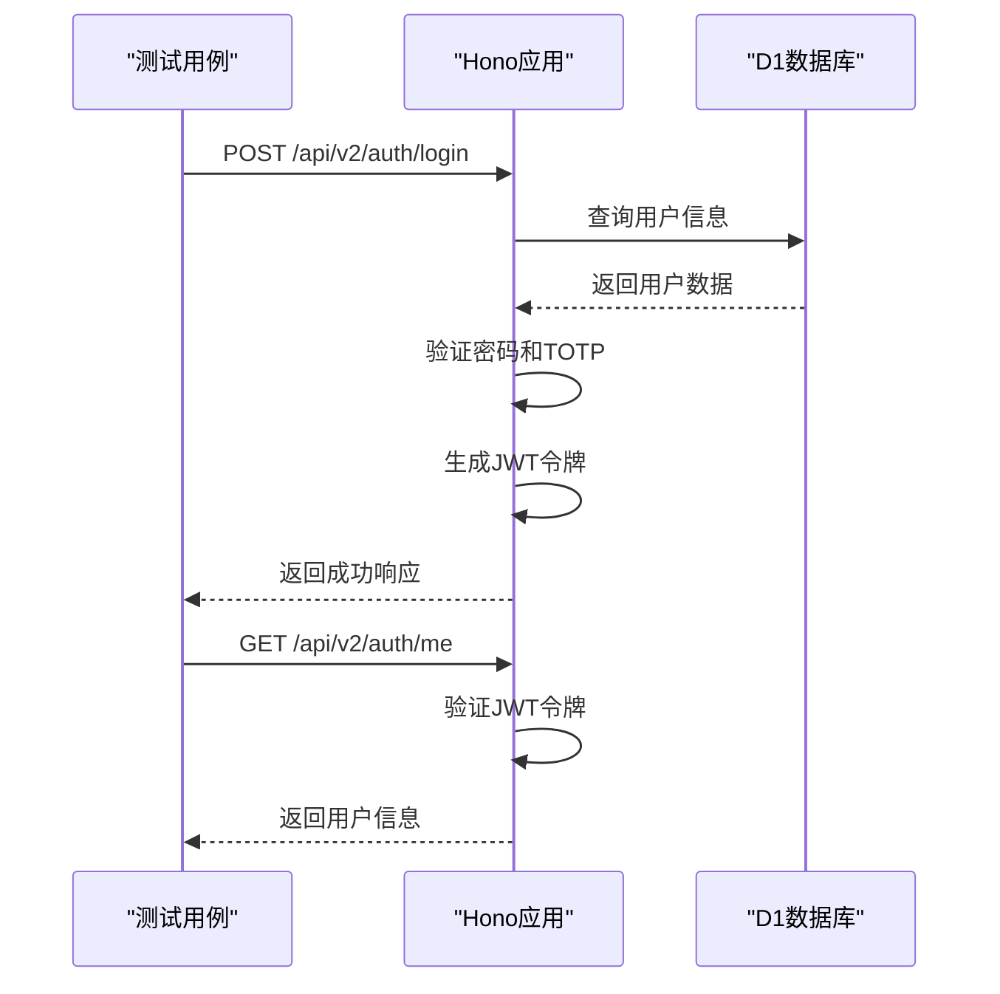

**Diagram sources**
- [auth.test.ts](file://backend/test/routes/v2/auth.test.ts#L1-L189)
- [index.ts](file://backend/src/index.ts#L1-L50)

**Section sources**
- [auth.test.ts](file://backend/test/routes/v2/auth.test.ts#L1-L189)

### 工具函数测试
工具函数测试专注于验证独立函数的正确性。以`logger.test.ts`为例，测试用例验证了日志记录器对敏感信息的脱敏功能。测试通过`vi.spyOn`方法监听`console.log`调用，捕获日志输出并验证敏感字段（如密码和令牌）是否被正确掩码。

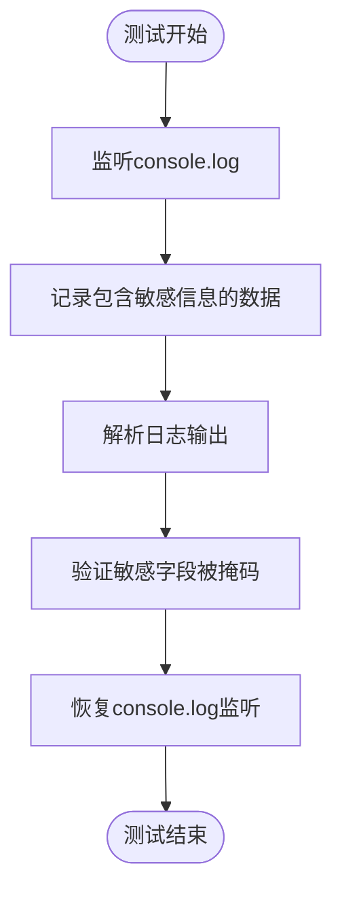

**Diagram sources**
- [logger.test.ts](file://backend/test/utils/logger.test.ts#L1-L29)
- [logger.ts](file://backend/src/utils/logger.ts#L1-L50)

**Section sources**
- [logger.test.ts](file://backend/test/utils/logger.test.ts#L1-L29)

## 前端测试策略

### UI自动化测试
前端测试使用Playwright框架进行UI自动化测试，测试代码位于`frontend/tests`目录下。测试用例覆盖了登录流程、财务流水创建、员工管理等关键业务场景。

以`login.spec.ts`为例，测试用例验证了基本登录、2FA登录和错误处理三种场景。测试通过`page.route`方法拦截API请求，返回预定义的Mock数据，确保测试不依赖后端服务。测试中使用`page.fill`、`page.click`等方法模拟用户操作，并通过`expect`断言验证页面状态。

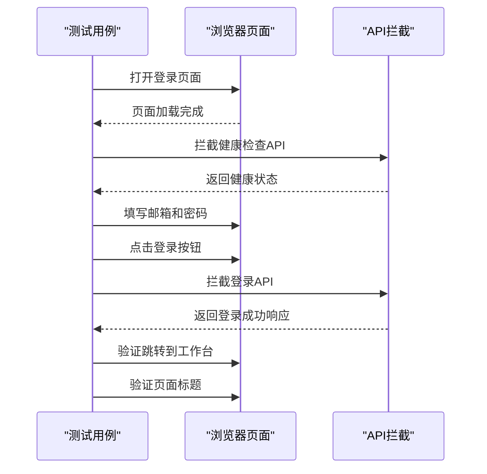

**Diagram sources**
- [login.spec.ts](file://frontend/tests/login.spec.ts#L1-L114)
- [LoginPage.tsx](file://frontend/src/features/auth/pages/LoginPage.tsx#L1-L100)

**Section sources**
- [login.spec.ts](file://frontend/tests/login.spec.ts#L1-L114)

### 财务流水创建测试
财务流水创建测试验证了用户创建收入和支出记录的完整流程。以`finance-flows.spec.ts`为例，测试用例模拟了从登录、导航到财务模块、填写表单到提交的全过程。测试中使用`page.setInputFiles`方法上传Mock凭证文件，并通过`page.waitForResponse`等待API响应，确保数据正确提交。

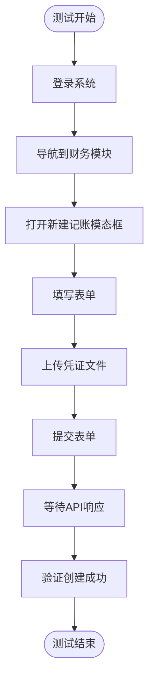

**Diagram sources**
- [finance-flows.spec.ts](file://frontend/tests/finance-flows.spec.ts#L1-L290)
- [FlowCreatePage.tsx](file://frontend/src/features/finance/pages/FlowCreatePage.tsx#L1-L100)

**Section sources**
- [finance-flows.spec.ts](file://frontend/tests/finance-flows.spec.ts#L1-L290)

### 员工管理测试
员工管理测试验证了人力资源模块的员工创建功能。以`employee-management.spec.ts`为例，测试用例覆盖了从导航到新建员工页面、填写表单到提交的完整流程。测试中使用`setupCommonMocks`函数批量设置API拦截，简化了Mock配置。

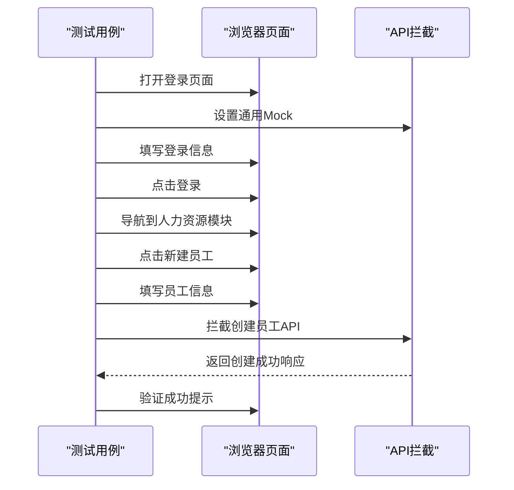

**Diagram sources**
- [employee-management.spec.ts](file://frontend/tests/employee-management.spec.ts#L1-L116)
- [EmployeeForm.tsx](file://frontend/src/features/employees/components/forms/EmployeeForm.tsx#L1-L100)

**Section sources**
- [employee-management.spec.ts](file://frontend/tests/employee-management.spec.ts#L1-L116)

### 公共Mock工具
前端测试中使用`mock-api.ts`文件定义了公共的API拦截函数`setupCommonMocks`，用于在多个测试用例中复用。该函数设置了健康检查、登录、主数据查询等常用API的Mock响应，减少了重复代码。

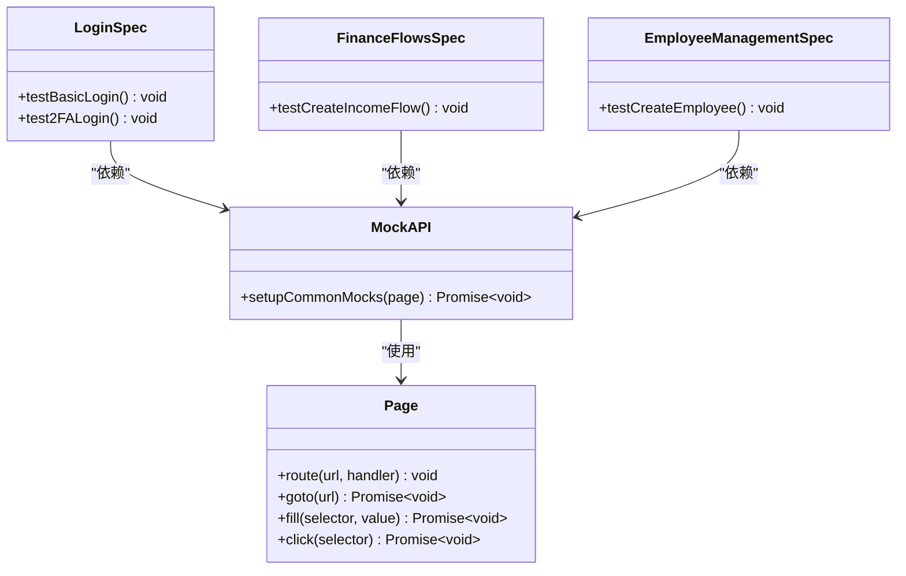

**Diagram sources**
- [mock-api.ts](file://frontend/tests/utils/mock-api.ts#L1-L92)
- [login.spec.ts](file://frontend/tests/login.spec.ts#L1-L114)

**Section sources**
- [mock-api.ts](file://frontend/tests/utils/mock-api.ts#L1-L92)

## 测试配置详解

### Vitest配置
后端测试配置文件`vitest.config.ts`定义了Vitest的运行环境和覆盖率要求。配置中使用`@cloudflare/vitest-pool-workers`插件，支持在Cloudflare Workers环境中运行测试。`miniflare`配置指定了D1数据库、KV命名空间和兼容性标志，确保测试环境与生产环境一致。

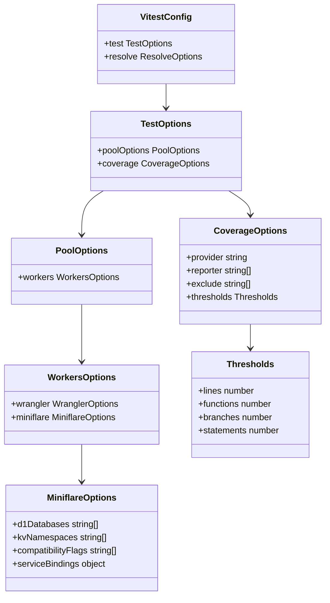

**Diagram sources**
- [vitest.config.ts](file://backend/vitest.config.ts#L1-L47)

**Section sources**
- [vitest.config.ts](file://backend/vitest.config.ts#L1-L47)

### Playwright配置
前端测试配置文件`playwright.config.ts`定义了Playwright的运行参数。配置中指定了测试目录、并行执行、重试机制和报告器。`webServer`配置确保在测试前启动本地开发服务器，`use`配置定义了测试的共享设置，如基础URL和跟踪收集。

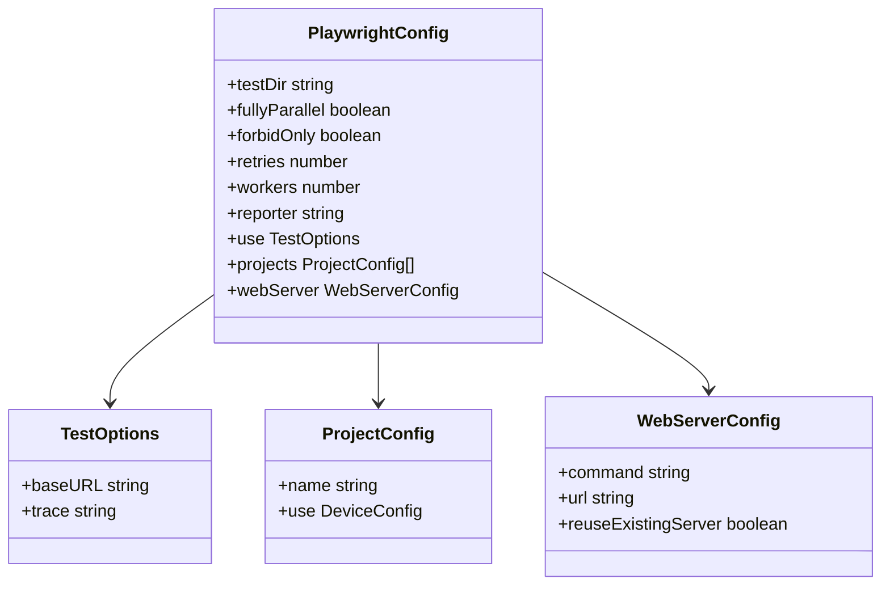

**Diagram sources**
- [playwright.config.ts](file://frontend/playwright.config.ts#L1-L79)

**Section sources**
- [playwright.config.ts](file://frontend/playwright.config.ts#L1-L79)

## CI/CD集成
测试策略与CI/CD流程紧密集成，确保代码质量。在`package.json`中，后端和前端的`test`脚本分别调用Vitest和Playwright执行测试。CI环境中，通过`process.env.CI`变量调整测试参数，如减少重试次数和禁用并行测试，确保测试稳定运行。

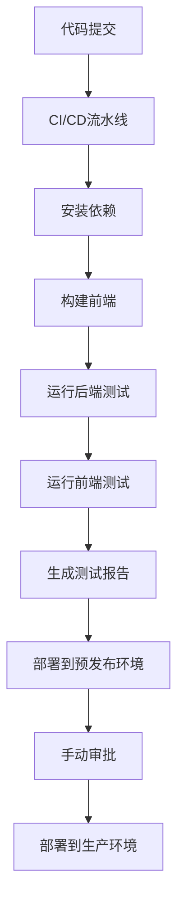

**Diagram sources**
- [package.json](file://backend/package.json#L24-L26)
- [package.json](file://frontend/package.json#L11-L12)

**Section sources**
- [package.json](file://backend/package.json#L1-L70)
- [package.json](file://frontend/package.json#L1-L51)

## 测试覆盖率与最佳实践

### 覆盖率目标
后端测试配置中定义了明确的覆盖率目标，要求行覆盖率、函数覆盖率和语句覆盖率不低于70%，分支覆盖率不低于65%。这些目标通过`vitest run --coverage`命令执行，并生成HTML报告供开发人员查看。

**Diagram sources**
- [vitest.config.ts](file://backend/vitest.config.ts#L35-L38)

**Section sources**
- [vitest.config.ts](file://backend/vitest.config.ts#L1-L47)

### 最佳实践
1. **测试独立性**：每个测试用例应独立运行，不依赖其他测试的状态。使用`beforeEach`钩子清理测试数据。
2. **Mock外部依赖**：使用Mock替代外部服务调用，如数据库、API和邮件服务，确保测试快速和可靠。
3. **全面的断言**：每个测试用例应包含明确的断言，验证预期结果。
4. **可读的测试名称**：使用描述性的测试名称，清晰表达测试目的。
5. **持续集成**：将测试集成到CI/CD流程中，确保每次代码提交都经过测试验证。

## 结论
本测试策略文档全面阐述了财务管理系统的测试方法，涵盖了后端服务层、路由和工具函数的单元测试与集成测试，以及前端UI自动化测试。通过Vitest和Playwright框架，结合合理的Mock策略和CI/CD集成，确保了代码质量和系统稳定性。明确的测试覆盖率目标和最佳实践为团队提供了清晰的指导，有助于持续交付高质量的软件产品。