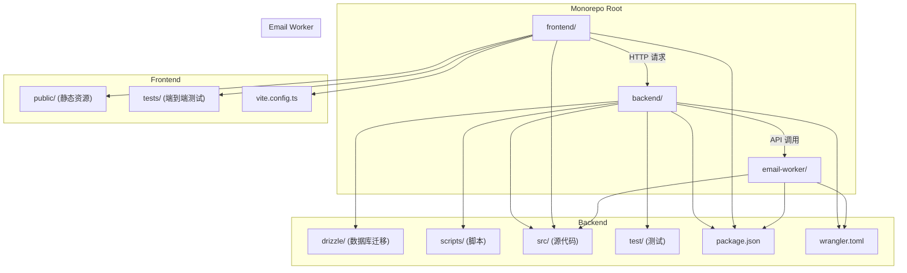
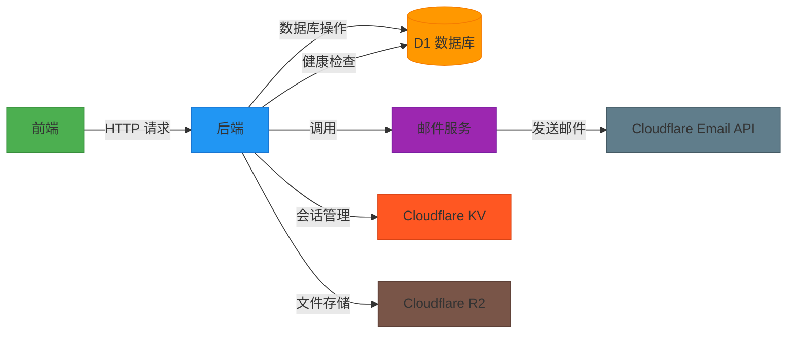
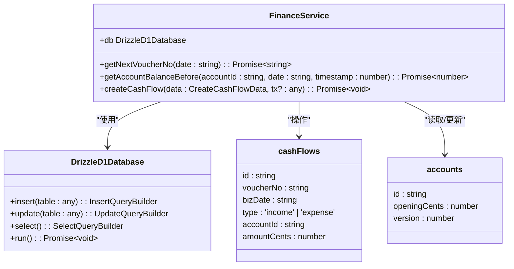
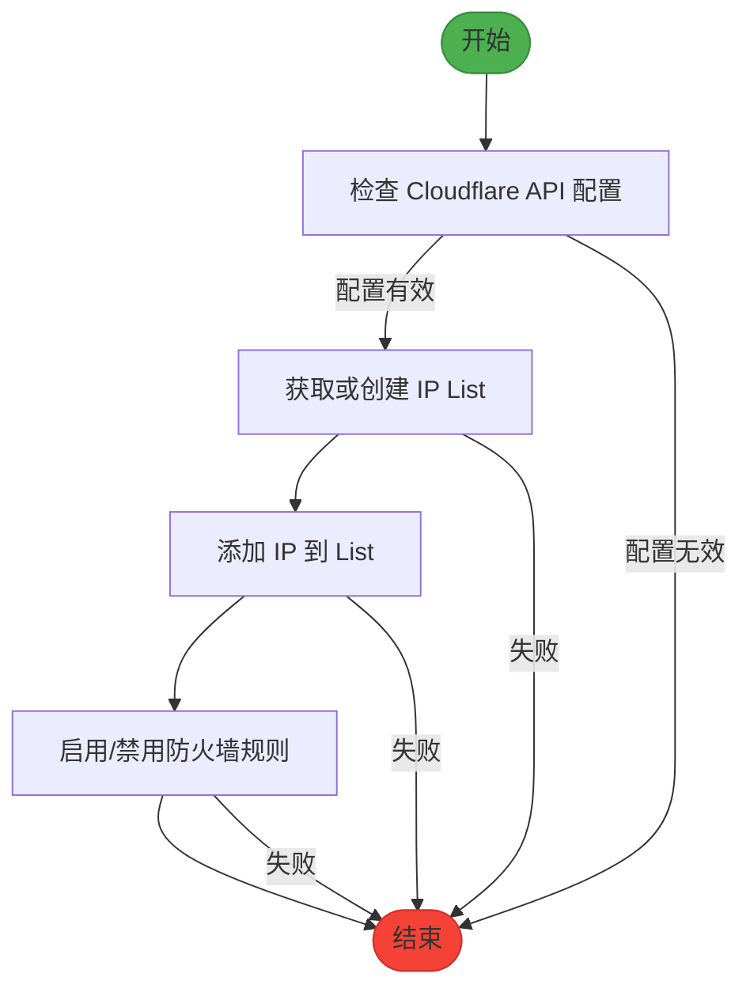
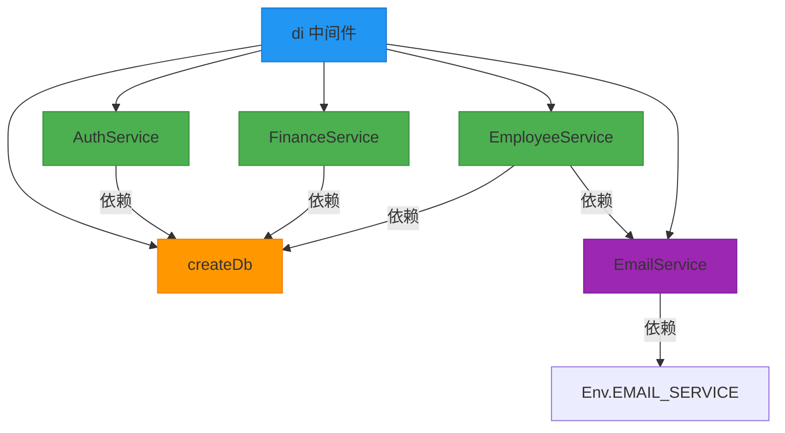

# 系统概述

<cite>
**本文档引用文件**  
- [package.json](file://backend/package.json)
- [index.ts](file://backend/src/index.ts)
- [wrangler.toml](file://backend/wrangler.toml)
- [main.tsx](file://frontend/src/main.tsx)
- [schema.ts](file://backend/src/db/schema.ts)
- [FinanceService.ts](file://backend/src/services/FinanceService.ts)
- [di.ts](file://backend/src/middleware/di.ts)
- [cloudflare.ts](file://backend/src/utils/cloudflare.ts)
- [menu.ts](file://frontend/src/config/menu.ts)
- [flows.ts](file://backend/src/routes/v2/flows.ts)
</cite>

## 目录
1. [引言](#引言)
2. [项目结构](#项目结构)
3. [核心组件](#核心组件)
4. [架构概述](#架构概述)
5. [详细组件分析](#详细组件分析)
6. [依赖关系分析](#依赖关系分析)
7. [性能考虑](#性能考虑)
8. [故障排除指南](#故障排除指南)
9. [结论](#结论)

## 引言
caiwu-main 是一个企业级财务管理系统，旨在实现企业财务流程的自动化、支持多角色协作并促进数据驱动的决策。该系统采用全栈单体仓库（Monorepo）结构，包含前端、后端和独立的邮件处理微服务。系统涵盖了财务管理、人事薪资、固定资产、租赁管理、报表系统和系统设置等核心模块。通过采用 Cloudflare Workers 和 Drizzle ORM 等现代技术栈，系统实现了高可扩展性、安全性和开发效率。

## 项目结构
caiwu-main 项目采用清晰的全栈单体仓库（Monorepo）结构，将前端、后端和独立服务统一管理，便于版本控制和依赖协调。

**图源**  
- [backend/package.json](file://backend/package.json)
- [frontend/package.json](file://frontend/package.json)
- [email-worker/package.json](file://email-worker/package.json)

**本节来源**  
- [backend/package.json](file://backend/package.json)
- [frontend/package.json](file://frontend/package.json)
- [email-worker/package.json](file://email-worker/package.json)

## 核心组件
系统的核心功能由后端的 Hono 框架驱动，通过 RESTful API 暴露给前端。后端服务通过 Drizzle ORM 与 D1 数据库交互，实现数据的持久化。前端使用 React 和 Ant Design 构建用户界面，通过 React Router 实现路由导航。邮件服务被独立为一个微服务，通过 Cloudflare Email API 发送邮件，实现了关注点分离和可扩展性。

**本节来源**  
- [index.ts](file://backend/src/index.ts)
- [main.tsx](file://frontend/src/main.tsx)
- [email-worker/src/index.ts](file://email-worker/src/index.ts)

## 架构概述
caiwu-main 系统采用前后端分离的架构，后端部署在 Cloudflare Workers 上，前端部署在 Cloudflare Pages 上。系统通过一个独立的邮件处理微服务来解耦邮件发送逻辑，提高了系统的可靠性和可维护性。系统上下文图展示了前端、后端、数据库和邮件服务之间的交互关系。

**图源**  
- [index.ts](file://backend/src/index.ts)
- [wrangler.toml](file://backend/wrangler.toml)
- [email-worker/src/index.ts](file://email-worker/src/index.ts)

## 详细组件分析

### 财务服务分析
`FinanceService` 是系统的核心业务逻辑组件，负责处理所有与财务相关的操作，如创建现金流水、计算账户余额等。该服务实现了乐观锁机制，以防止并发修改导致的数据不一致问题。

#### 财务服务类图

**图源**  
- [FinanceService.ts](file://backend/src/services/FinanceService.ts)
- [schema.ts](file://backend/src/db/schema.ts)

### 系统设置分析
系统设置模块允许管理员配置 IP 白名单、邮件通知等全局设置。该模块通过调用 Cloudflare API 来管理 IP 白名单和防火墙规则，实现了与基础设施的深度集成。

#### IP 白名单管理流程图

**图源**  
- [cloudflare.ts](file://backend/src/utils/cloudflare.ts)
- [IPWhitelistService.ts](file://backend/src/services/IPWhitelistService.ts)

## 依赖关系分析
系统内部组件通过依赖注入（DI）模式进行解耦。`di.ts` 中间件负责创建所有服务实例并将其注入到请求上下文中，确保了服务的单一实例和依赖关系的清晰管理。

**图源**  
- [di.ts](file://backend/src/middleware/di.ts)
- [wrangler.toml](file://backend/wrangler.toml)

**本节来源**  
- [di.ts](file://backend/src/middleware/di.ts)
- [wrangler.toml](file://backend/wrangler.toml)

## 性能考虑
系统在设计时充分考虑了性能因素。后端使用 Cloudflare Workers 的边缘计算能力，将代码部署在全球各地的边缘节点，显著降低了延迟。前端使用 React Query 进行数据缓存和同步，减少了不必要的网络请求。数据库操作通过 Drizzle ORM 的查询构建器进行优化，并利用 D1 数据库的高性能特性。

## 故障排除指南
当系统出现邮件发送失败时，应首先检查 `email-worker` 的健康检查端点 `/health` 是否返回正常。其次，确认 `wrangler.toml` 中的 `EMAIL_SERVICE` 绑定是否正确指向了邮件服务。最后，检查环境变量 `EMAIL_TOKEN` 是否已正确配置。

**本节来源**  
- [email-worker/src/index.ts](file://email-worker/src/index.ts)
- [wrangler.toml](file://backend/wrangler.toml)

## 结论
caiwu-main 系统通过采用现代化的技术栈和架构设计，成功构建了一个功能全面、安全可靠的企业级财务管理系统。全栈单体仓库的结构简化了开发和部署流程，而微服务化的邮件处理则保证了核心业务的稳定性。系统对 Cloudflare 生态的深度集成，不仅提升了性能，也增强了安全性。未来，系统可以进一步扩展，集成更多的自动化和智能化功能。