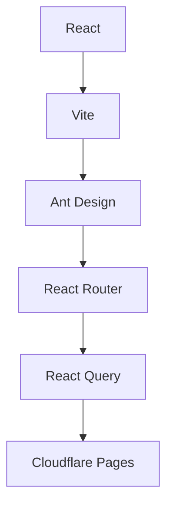
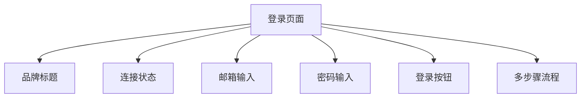
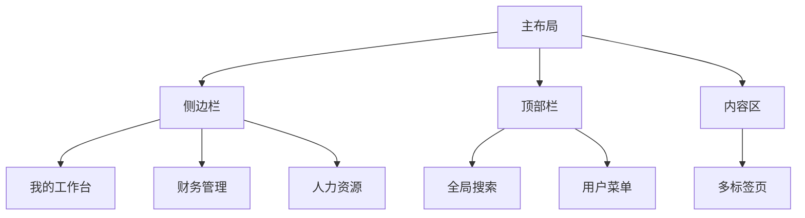

# 系统概述

<cite>
**本文档引用的文件**   
- [main.tsx](file://frontend/src/main.tsx)
- [index.ts](file://backend/src/index.ts)
- [Login.tsx](file://frontend/src/features/auth/pages/Login.tsx)
- [MainLayout.tsx](file://frontend/src/layouts/MainLayout.tsx)
- [menu.ts](file://frontend/src/config/menu.ts)
- [employees.ts](file://backend/src/routes/employees.ts)
- [flows.ts](file://backend/src/routes/flows.ts)
- [ar-ap.ts](file://backend/src/routes/ar-ap.ts)
- [reports.ts](file://backend/src/routes/reports.ts)
- [schema.ts](file://backend/src/db/schema.ts)
- [router.tsx](file://frontend/src/router/index.tsx)
- [FinanceService.ts](file://backend/src/services/FinanceService.ts)
- [permissions.ts](file://backend/src/utils/permissions.ts)
- [theme.ts](file://frontend/src/config/theme.ts)
- [wrangler.toml](file://backend/wrangler.toml)
- [package.json](file://frontend/package.json)
- [package.json](file://backend/package.json)
- [drizzle.config.ts](file://backend/drizzle.config.ts)
</cite>

## 目录
1. [系统核心目标与价值](#系统核心目标与价值)
2. [功能全景图](#功能全景图)
3. [技术架构](#技术架构)
4. [UI风格与用户体验](#ui风格与用户体验)
5. [系统边界与集成点](#系统边界与集成点)

## 系统核心目标与价值

AR公司管理系统（caiwu-main）是一个专为企业级财务管理设计的综合性平台，旨在通过数字化手段全面提升企业的财务运营效率和管理水平。系统以财务管理为核心，整合了人力资源、资产管理、项目运营等多个业务模块，构建了一个统一、高效的企业管理生态。其核心价值体现在以下几个方面：

首先，系统实现了财务流程的全面自动化和规范化。通过应收应付管理、财务流水记账、账户转账、借款还款等核心功能，企业可以精确追踪每一笔资金的流向，确保财务数据的准确性和可追溯性。系统支持多币种、多账户、多部门的复杂财务管理需求，能够满足跨国企业或大型集团的精细化核算要求。

其次，系统强化了人力资源管理与财务的协同。员工管理、薪资计算、补贴发放、请假报销等功能与财务模块深度集成，实现了从人事变动到薪资发放的无缝衔接。例如，当员工入职时，系统可自动创建用户账户并发送欢迎邮件；当员工请假或报销时，相关申请可自动流转至审批人，并在审批通过后触发财务支付流程。

再者，系统提供了强大的报表分析能力。通过预设的各类报表，如项目汇总报表、应收账款明细、日常支出汇总等，管理层可以实时掌握企业的财务状况和运营绩效。系统支持按部门、时间、项目等多维度进行数据钻取，帮助决策者发现潜在问题，优化资源配置。

最后，系统通过严格的权限控制和审计日志，保障了企业数据的安全。基于职位的权限模型确保了数据的最小化访问原则，而IP白名单和双因素认证则进一步提升了系统的安全性。

**Section sources**
- [index.ts](file://backend/src/index.ts#L1-L137)
- [schema.ts](file://backend/src/db/schema.ts#L1-L644)

## 功能全景图

AR公司管理系统涵盖了企业运营的多个关键领域，形成了一个功能完备的管理平台。系统的主要功能模块包括：

### 员工管理
该模块是人力资源管理的核心，支持员工的全生命周期管理。功能包括：
- **员工信息维护**：记录员工的基本信息、联系方式、紧急联系人、工作日程、年假额度等。
- **员工状态管理**：支持员工的入职、转正、离职、复职等状态变更操作。
- **权限管理**：根据员工的职位（如总部主管、项目主管、组长、工程师）自动分配相应的系统权限。
- **批量操作**：支持从CSV文件批量导入员工数据。

### 薪资与补贴
该模块实现了薪资和各类补贴的自动化计算与发放。
- **薪资管理**：为员工设置试用期和正式薪资，并生成薪资发放记录。
- **补贴管理**：管理员工的住房、交通、伙食等各项补贴。
- **发放管理**：创建薪资和补贴的发放计划，记录发放状态和凭证。

### 财务流水
这是系统最核心的财务功能，用于记录企业的所有收入和支出。
- **收支记账**：创建收入或支出流水，关联账户、类别、部门、项目等信息，并上传凭证图片。
- **账户明细**：查看每个账户的交易流水和余额变化。
- **账户转账**：在不同账户之间进行资金划转，支持不同币种的汇率换算。

### 应收应付
该模块专门用于管理企业与客户（应收账款）和供应商（应付账款）之间的往来款项。
- **创建单据**：创建AR（应收账款）或AP（应付账款）单据，记录金额、到期日等信息。
- **结算管理**：将财务流水与AR/AP单据进行结算，跟踪款项的收付进度。
- **账单对账**：提供账单的详细对账单，清晰展示已结算和未结算的金额。

### 固定资产
该模块用于管理企业的固定资产，如办公设备、车辆等。
- **资产采购与出售**：记录资产的买入和卖出信息。
- **资产分配**：将资产分配给特定员工或部门使用。
- **折旧管理**：支持按不同折旧方法计算资产的折旧值。

### 报销与借款
该模块处理员工的日常费用报销和借款申请。
- **报销管理**：员工提交报销申请，包含费用类型、金额、描述和凭证，经审批后由财务支付。
- **借款管理**：员工发起借款申请，经审批后从指定账户放款，并可创建还款记录。

### 报表分析
系统内置了丰富的报表，为管理层提供决策支持。
- **财务报表**：如项目汇总报表、账户余额报表、日常支出汇总等。
- **往来报表**：如应收账款汇总/明细、应付账款汇总/明细。
- **运营报表**：如站点增长报表。
- **专项报表**：如借款统计报表、员工薪资报表。

**Section sources**
- [employees.ts](file://backend/src/routes/employees.ts#L1-L462)
- [flows.ts](file://backend/src/routes/flows.ts#L1-L424)
- [ar-ap.ts](file://backend/src/routes/ar-ap.ts#L1-L353)
- [reports.ts](file://backend/src/routes/reports.ts#L1-L475)
- [menu.ts](file://frontend/src/config/menu.ts#L1-L293)

## 技术架构

AR公司管理系统采用了现代化的前后端分离架构，充分利用了Serverless技术的优势，实现了高性能、高可用和低成本的系统部署。

### 前端架构
前端基于 **React** 框架构建，采用 **Vite** 作为构建工具，提供了快速的开发体验。UI组件库选用 **Ant Design**，确保了界面的一致性和专业性。系统通过 **React Router** 实现客户端路由，结合 **React Query** 进行数据状态管理，有效减少了对后端API的重复请求。前端代码通过 **esbuild** 打包成静态文件，并部署在Cloudflare Pages上，利用其全球CDN网络实现快速的内容分发。



**Diagram sources **
- [main.tsx](file://frontend/src/main.tsx#L1-L43)
- [package.json](file://frontend/package.json#L1-L45)
- [router.tsx](file://frontend/src/router/index.tsx#L1-L152)

### 后端架构
后端运行在 **Cloudflare Workers** 环境中，这是一个典型的Serverless平台。核心框架采用轻量级的 **Hono**，它专为边缘计算环境优化，具有极低的启动延迟和高性能。数据库使用 **Cloudflare D1**，这是一个基于SQLite的边缘数据库，能够将数据存储在离用户更近的地理位置，从而降低延迟。ORM层使用 **Drizzle ORM**，它提供了类型安全的数据库查询能力，并与Zod无缝集成，确保了数据验证的准确性。

选择Serverless架构的主要动机是其卓越的可扩展性和成本效益。系统无需预置服务器，可以根据实际流量自动伸缩，对于访问量波动较大的企业应用来说，这可以显著降低运维成本和复杂性。同时，Cloudflare Workers的全球网络确保了无论用户身处何地，都能获得低延迟的访问体验。

选择SQLite（D1）作为数据库，是因为它非常适合Serverless场景。SQLite是一个轻量级、无服务器的数据库，启动速度快，资源占用少，与Workers的短生命周期完美契合。D1服务将SQLite数据库分布在全球，使得数据读写操作可以在边缘节点完成，极大地提升了性能。

```mermaid
graph TD
G[Hono] --> H[Cloudflare Workers]
H --> I[Cloudflare D1 (SQLite)]
I --> J[Drizzle ORM]
J --> K[Zod]
G --> L[Ant Design]
```

**Diagram sources **
- [index.ts](file://backend/src/index.ts#L1-L137)
- [wrangler.toml](file://backend/wrangler.toml#L1-L45)
- [package.json](file://backend/package.json#L1-L43)
- [drizzle.config.ts](file://backend/drizzle.config.ts#L1-L8)

### 安全与权限
系统实现了多层次的安全机制。后端通过JWT进行身份认证，并在 `wrangler.toml` 中配置了IP白名单，限制了API的访问来源。权限控制采用基于职位的模型（Role-Based Access Control, RBAC），用户的权限由其职位（如`hq_manager`, `project_manager`）决定。`permissions.ts` 文件中的 `hasPermission` 函数是权限校验的核心，它根据用户的职位代码和层级，动态判断其对特定模块和操作的访问权限。

## UI风格与用户体验

系统的UI设计遵循现代、简洁、专业的原则，旨在为用户提供高效、愉悦的操作体验。

### 登录页面
登录页面是用户进入系统的第一个界面。其设计特点是：
- **品牌标识**：页面顶部有醒目的“AR公司管理系统”标题和闪电图标，强化品牌认知。
- **状态指示**：右上角显示API连接状态，让用户一目了然地知道系统是否可用。
- **多步骤流程**：支持首次登录修改密码和绑定Google验证码的多步骤流程，确保账户安全。
- **响应式设计**：卡片式布局在各种屏幕尺寸下都能保持良好的视觉效果。



**Diagram sources **
- [Login.tsx](file://frontend/src/features/auth/pages/Login.tsx#L1-L258)

### 主布局
主布局采用经典的侧边栏导航模式，提供了清晰的信息架构。
- **侧边栏**：深色背景的侧边栏是系统的核心导航，包含“我的工作台”、“财务管理”、“人力资源”等主要模块。图标和文字结合，提升可读性。
- **顶部栏**：包含页面标题、全局搜索框和用户信息下拉菜单。用户可以快速切换个人中心、修改密码或退出登录。
- **多标签页**：系统支持多标签页浏览，方便用户在不同功能页面间快速切换。
- **主题设计**：通过 `theme.ts` 文件定义了统一的设计语言，主色调为靛蓝色（#6366f1），字体采用现代的Inter字体，圆角和阴影的运用增加了界面的层次感和现代感。



**Diagram sources **
- [MainLayout.tsx](file://frontend/src/layouts/MainLayout.tsx#L1-L146)
- [theme.ts](file://frontend/src/config/theme.ts#L1-L73)

## 系统边界与集成点

AR公司管理系统作为一个独立的SaaS应用，其边界清晰，主要通过API与外部系统进行交互。

### 内部集成
系统内部各模块通过后端的Hono路由进行集成。例如，当在“财务流水”模块创建一笔收入时，会调用 `/api/flows` 接口；当在“员工管理”模块创建新员工时，会调用 `/api/employees` 接口。前端通过统一的 `http.ts` API客户端与这些后端接口通信。

### 外部集成
系统的主要外部集成点是邮件服务。通过 `email-worker` 项目，系统可以向员工发送欢迎邮件、密码重置邮件等。在 `wrangler.toml` 文件中，通过 `services` 配置将主后端服务与 `email-worker` 服务绑定，实现了服务间的内部调用。

系统还通过Cloudflare的R2对象存储服务来存储凭证图片等文件，通过KV命名空间存储会话信息，这些都是Cloudflare平台提供的原生服务集成。

对于高级开发者而言，系统的扩展点主要在于：
1.  **API扩展**：可以通过在 `backend/src/routes/` 目录下添加新的路由文件来扩展API功能。
2.  **前端功能扩展**：可以在 `frontend/src/features/` 目录下创建新的功能模块，并在路由和菜单配置中注册。
3.  **数据库迁移**：通过Drizzle Kit和SQL迁移脚本，可以安全地升级数据库结构。