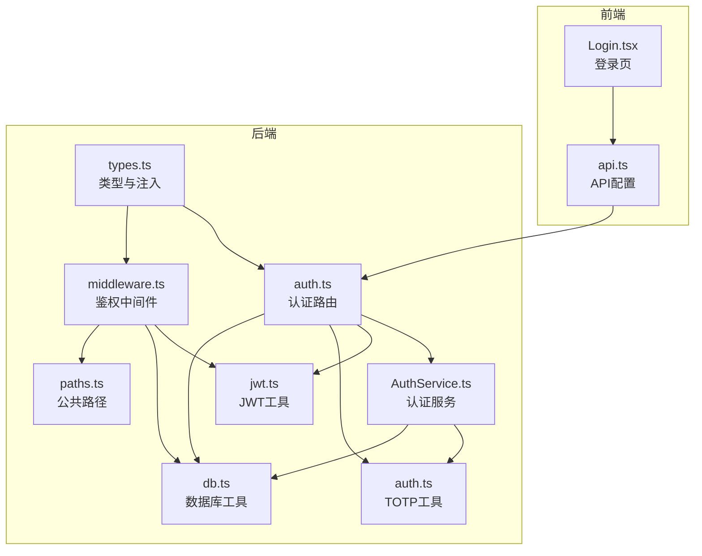
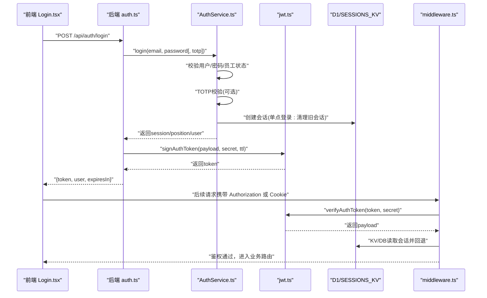
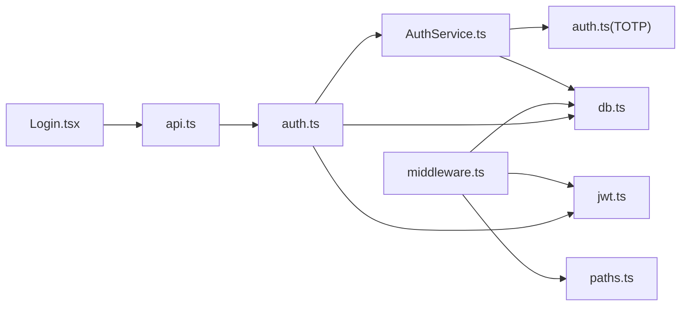
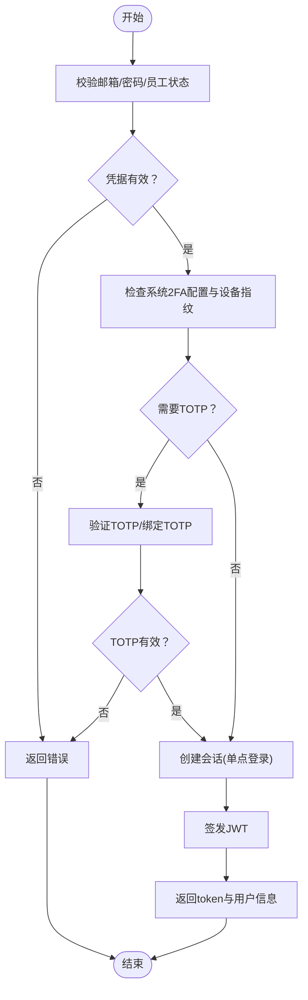
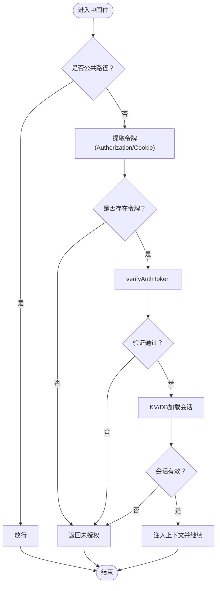

# JWT认证系统

<cite>
**本文引用的文件**
- [backend/src/routes/auth.ts](file://backend/src/routes/auth.ts)
- [backend/src/services/AuthService.ts](file://backend/src/services/AuthService.ts)
- [backend/src/utils/jwt.ts](file://backend/src/utils/jwt.ts)
- [backend/src/middleware.ts](file://backend/src/middleware.ts)
- [backend/src/utils/auth.ts](file://backend/src/utils/auth.ts)
- [backend/src/config/paths.ts](file://backend/src/config/paths.ts)
- [backend/src/utils/db.ts](file://backend/src/utils/db.ts)
- [backend/src/types.ts](file://backend/src/types.ts)
- [frontend/src/features/auth/pages/Login.tsx](file://frontend/src/features/auth/pages/Login.tsx)
- [frontend/src/config/api.ts](file://frontend/src/config/api.ts)
- [backend/test/routes/auth.test.ts](file://backend/test/routes/auth.test.ts)
- [backend/test/services/AuthService.test.ts](file://backend/test/services/AuthService.test.ts)
</cite>

## 目录
1. [简介](#简介)
2. [项目结构](#项目结构)
3. [核心组件](#核心组件)
4. [架构总览](#架构总览)
5. [详细组件分析](#详细组件分析)
6. [依赖关系分析](#依赖关系分析)
7. [性能考量](#性能考量)
8. [故障排查指南](#故障排查指南)
9. [结论](#结论)
10. [附录](#附录)

## 简介
本文件深入解析基于JWT的认证流程，覆盖从用户登录、令牌签发、会话创建与单点登录控制，到请求验证与令牌失效处理的完整生命周期。文档结合后端路由定义与AuthService的login方法，说明会话创建、单点登录控制与JWT令牌签发机制；解释AUTH_COOKIE_NAME与ALT_AUTH_HEADER的用途，并通过verifyAuthToken进行令牌验证。同时提供认证失败处理、令牌刷新与安全最佳实践的参考路径与建议。

## 项目结构
后端采用Hono框架，路由集中在routes目录，业务逻辑在services目录，工具函数在utils目录，中间件在middleware.ts中统一处理鉴权。前端通过Login页面发起登录请求，调用后端提供的认证接口。

图表来源
- [backend/src/routes/auth.ts](file://backend/src/routes/auth.ts#L1-L120)
- [backend/src/middleware.ts](file://backend/src/middleware.ts#L1-L82)
- [backend/src/services/AuthService.ts](file://backend/src/services/AuthService.ts#L1-L131)
- [backend/src/utils/jwt.ts](file://backend/src/utils/jwt.ts#L56-L119)
- [backend/src/utils/auth.ts](file://backend/src/utils/auth.ts#L1-L18)
- [backend/src/config/paths.ts](file://backend/src/config/paths.ts#L1-L23)
- [backend/src/utils/db.ts](file://backend/src/utils/db.ts#L116-L222)
- [backend/src/types.ts](file://backend/src/types.ts#L1-L88)

章节来源
- [backend/src/routes/auth.ts](file://backend/src/routes/auth.ts#L1-L120)
- [backend/src/middleware.ts](file://backend/src/middleware.ts#L1-L82)
- [backend/src/services/AuthService.ts](file://backend/src/services/AuthService.ts#L1-L131)
- [backend/src/utils/jwt.ts](file://backend/src/utils/jwt.ts#L56-L119)
- [backend/src/utils/auth.ts](file://backend/src/utils/auth.ts#L1-L18)
- [backend/src/config/paths.ts](file://backend/src/config/paths.ts#L1-L23)
- [backend/src/utils/db.ts](file://backend/src/utils/db.ts#L116-L222)
- [backend/src/types.ts](file://backend/src/types.ts#L1-L88)

## 核心组件
- 路由层(auth.ts)：定义登录、登出、获取当前用户等接口，负责提取令牌、构建成功响应、触发异步通知等。
- 服务层(AuthService.ts)：实现登录校验、密码比对、TOTP二次验证、会话创建与单点登录控制、登出清理等。
- 工具层(jwt.ts)：提供JWT签名、验证、提取Bearer Token、常量定义（AUTH_COOKIE_NAME、ALT_AUTH_HEADER、AUTH_TOKEN_TTL）。
- 中间件(middleware.ts)：统一鉴权入口，支持多来源令牌来源（Header、Cookie），验证JWT并加载会话上下文。
- 前端(Login.tsx)：登录UI与流程编排，处理首次登录改密、TOTP绑定/验证、登录成功后的状态存储与跳转。

章节来源
- [backend/src/routes/auth.ts](file://backend/src/routes/auth.ts#L1-L120)
- [backend/src/services/AuthService.ts](file://backend/src/services/AuthService.ts#L1-L131)
- [backend/src/utils/jwt.ts](file://backend/src/utils/jwt.ts#L56-L119)
- [backend/src/middleware.ts](file://backend/src/middleware.ts#L1-L82)
- [frontend/src/features/auth/pages/Login.tsx](file://frontend/src/features/auth/pages/Login.tsx#L1-L131)

## 架构总览
下图展示从用户登录到请求验证的整体流程，包括会话创建、单点登录控制、JWT签发与验证、以及前端交互。

图表来源
- [backend/src/routes/auth.ts](file://backend/src/routes/auth.ts#L58-L121)
- [backend/src/services/AuthService.ts](file://backend/src/services/AuthService.ts#L29-L131)
- [backend/src/utils/jwt.ts](file://backend/src/utils/jwt.ts#L72-L111)
- [backend/src/middleware.ts](file://backend/src/middleware.ts#L9-L71)
- [backend/src/utils/db.ts](file://backend/src/utils/db.ts#L116-L222)
- [frontend/src/features/auth/pages/Login.tsx](file://frontend/src/features/auth/pages/Login.tsx#L34-L131)

## 详细组件分析

### 路由与控制器：登录、登出、获取当前用户
- 登录处理(handleLogin)：接收邮箱与密码，调用AuthService.login，根据结果返回不同状态（需改密、需绑定TOTP、需TOTP、成功）。成功时清除历史Cookie，签发JWT并返回token与用户信息。
- 登出处理：从请求中提取令牌，验证后调用AuthService.logout清理会话，并清除Cookie。
- 获取当前用户(handleGetMe)：从请求中提取令牌，验证后查询会话、用户、职位信息并返回。

章节来源
- [backend/src/routes/auth.ts](file://backend/src/routes/auth.ts#L58-L121)
- [backend/src/routes/auth.ts](file://backend/src/routes/auth.ts#L301-L316)
- [backend/src/routes/auth.ts](file://backend/src/routes/auth.ts#L336-L386)

### 认证服务：登录、会话创建与单点登录
- 登录(login)：校验用户存在性、员工状态、密码；按系统配置与设备指纹判断是否需要TOTP；成功后更新最近登录时间，获取职位信息，创建会话。
- 会话创建(createSession)：删除该用户旧会话（KV与DB），写入新会话至D1与KV，实现单点登录控制。
- 登出(logout)：记录审计日志，删除KV与DB中的会话。

章节来源
- [backend/src/services/AuthService.ts](file://backend/src/services/AuthService.ts#L29-L131)
- [backend/src/services/AuthService.ts](file://backend/src/services/AuthService.ts#L133-L175)
- [backend/src/services/AuthService.ts](file://backend/src/services/AuthService.ts#L200-L207)

### JWT工具：签发、验证与令牌来源
- 常量定义：AUTH_COOKIE_NAME、AUTH_HEADER_NAME、ALT_AUTH_HEADER、AUTH_TOKEN_TTL。
- 签发(signAuthToken)：构造payload（含iat/exp），使用HMAC-SHA256签名，返回JWT字符串。
- 验证(verifyAuthToken)：拆分JWT三段，验证签名与过期时间，返回payload。
- 提取Bearer Token(extractBearerToken)：从Authorization头中提取Bearer令牌。
- 令牌来源(getAuthToken)：优先从Alt Header，其次Authorization，最后Cookie。

章节来源
- [backend/src/utils/jwt.ts](file://backend/src/utils/jwt.ts#L56-L119)
- [backend/src/middleware.ts](file://backend/src/middleware.ts#L74-L81)

### 鉴权中间件：统一验证与上下文注入
- 公共路径放行：通过paths.ts中的PUBLIC_PATHS判断是否放行。
- 多源令牌提取：优先Alt Header，其次Authorization，最后Cookie。
- 验证与回退：verifyAuthToken验证JWT；KV未命中则回退DB查询并异步写入KV缓存。
- 上下文注入：将userId、sessionId、userPosition、userEmployee、departmentModules注入到上下文中。

章节来源
- [backend/src/middleware.ts](file://backend/src/middleware.ts#L9-L71)
- [backend/src/config/paths.ts](file://backend/src/config/paths.ts#L1-L23)
- [backend/src/utils/jwt.ts](file://backend/src/utils/jwt.ts#L56-L119)
- [backend/src/utils/db.ts](file://backend/src/utils/db.ts#L116-L222)

### 前端登录流程：首次登录改密、TOTP绑定/验证
- 登录步骤：登录 -> 若需改密 -> 进入改密流程 -> 若需绑定TOTP -> 加载二维码 -> 绑定TOTP -> 自动登录。
- 请求路径：通过api.ts中的auth相关接口与后端交互。

章节来源
- [frontend/src/features/auth/pages/Login.tsx](file://frontend/src/features/auth/pages/Login.tsx#L34-L131)
- [frontend/src/config/api.ts](file://frontend/src/config/api.ts#L11-L21)

### TOTP辅助工具
- 生成TOTP密钥与otpauth URL。
- 验证TOTP验证码。

章节来源
- [backend/src/utils/auth.ts](file://backend/src/utils/auth.ts#L1-L18)

### 会话上下文与数据库工具
- getSessionWithUserAndPosition：一次性查询会话、用户、职位、员工与部门模块信息，用于中间件注入。
- getUserFullContext：生成完整上下文，供会话KV缓存使用。

章节来源
- [backend/src/utils/db.ts](file://backend/src/utils/db.ts#L116-L222)
- [backend/src/utils/db.ts](file://backend/src/utils/db.ts#L224-L313)

## 依赖关系分析
- 路由依赖AuthService与JWT工具，间接依赖数据库与KV存储。
- 中间件依赖JWT工具与数据库工具，依赖公共路径配置。
- 服务层依赖用户/员工/职位/会话等数据库schema，依赖TOTP工具与系统配置。
- 前端依赖API配置与登录页组件。

图表来源
- [backend/src/routes/auth.ts](file://backend/src/routes/auth.ts#L1-L120)
- [backend/src/middleware.ts](file://backend/src/middleware.ts#L1-L82)
- [backend/src/services/AuthService.ts](file://backend/src/services/AuthService.ts#L1-L131)
- [backend/src/utils/jwt.ts](file://backend/src/utils/jwt.ts#L56-L119)
- [backend/src/utils/auth.ts](file://backend/src/utils/auth.ts#L1-L18)
- [backend/src/utils/db.ts](file://backend/src/utils/db.ts#L116-L222)
- [backend/src/config/paths.ts](file://backend/src/config/paths.ts#L1-L23)
- [frontend/src/features/auth/pages/Login.tsx](file://frontend/src/features/auth/pages/Login.tsx#L1-L131)
- [frontend/src/config/api.ts](file://frontend/src/config/api.ts#L11-L21)

## 性能考量
- 令牌验证：verifyAuthToken为O(1)，签名验证与解码均为常数时间复杂度。
- 会话读取：中间件优先KV缓存，未命中回退DB并异步写入KV，减少DB压力。
- 单点登录：登录时清理旧会话，避免KV与DB冗余数据。
- 异步通知：登录成功后通过executionCtx.waitUntil异步发送邮件通知，不影响主流程响应时间。

章节来源
- [backend/src/middleware.ts](file://backend/src/middleware.ts#L26-L41)
- [backend/src/routes/auth.ts](file://backend/src/routes/auth.ts#L76-L101)
- [backend/src/services/AuthService.ts](file://backend/src/services/AuthService.ts#L133-L175)

## 故障排查指南
- 登录失败
  - 用户名或密码错误：AuthService.login中抛出未授权错误。
  - 停用账号/未找到员工记录：返回禁止访问。
  - 首次登录需改密：返回must_change_password。
  - 需要绑定TOTP或新设备首次登录需TOTP：返回need_bind_totp或need_totp。
- 令牌无效
  - 未携带令牌或Cookie：中间件返回未授权。
  - 令牌格式不正确或签名无效：verifyAuthToken抛错，中间件返回未授权。
  - 令牌过期：verifyAuthToken检测exp字段，返回未授权。
- 会话不存在
  - KV与DB均未命中：中间件返回未授权。
  - 会话过期：getSessionWithUserAndPosition过滤过期会话。
- 前端登录异常
  - 登录接口返回needBindTotp/needTotp：前端切换到TOTP绑定/验证流程。
  - 登录接口返回mustChangePassword：前端切换到改密流程。

章节来源
- [backend/src/services/AuthService.ts](file://backend/src/services/AuthService.ts#L29-L131)
- [backend/src/utils/jwt.ts](file://backend/src/utils/jwt.ts#L92-L111)
- [backend/src/middleware.ts](file://backend/src/middleware.ts#L12-L71)
- [backend/src/utils/db.ts](file://backend/src/utils/db.ts#L116-L222)
- [frontend/src/features/auth/pages/Login.tsx](file://frontend/src/features/auth/pages/Login.tsx#L34-L131)

## 结论
本系统采用“JWT + 会话缓存”的双层验证模型：JWT负责无状态的身份标识与过期控制，会话缓存负责快速检索用户上下文与单点登录控制。通过多源令牌提取与中间件统一鉴权，实现了灵活且安全的认证体验。前端登录流程清晰地处理了首次改密与TOTP绑定/验证场景，配合后端严格的会话与权限校验，保障了系统的安全性与可用性。

## 附录

### 关键流程图：登录与验证

#### 登录流程（含TOTP与单点登录）

图表来源
- [backend/src/services/AuthService.ts](file://backend/src/services/AuthService.ts#L29-L131)
- [backend/src/services/AuthService.ts](file://backend/src/services/AuthService.ts#L133-L175)
- [backend/src/utils/jwt.ts](file://backend/src/utils/jwt.ts#L72-L90)

#### 请求验证流程（中间件）

图表来源
- [backend/src/middleware.ts](file://backend/src/middleware.ts#L9-L71)
- [backend/src/utils/jwt.ts](file://backend/src/utils/jwt.ts#L92-L111)
- [backend/src/utils/db.ts](file://backend/src/utils/db.ts#L116-L222)

### 常量与配置要点
- AUTH_COOKIE_NAME：用于存储JWT的Cookie名称。
- ALT_AUTH_HEADER：备用令牌头名称，便于跨域或特殊网关场景。
- AUTH_TOKEN_TTL：JWT有效期（秒）。
- PUBLIC_PATHS：无需鉴权的公共路径集合。

章节来源
- [backend/src/utils/jwt.ts](file://backend/src/utils/jwt.ts#L56-L60)
- [backend/src/config/paths.ts](file://backend/src/config/paths.ts#L1-L23)

### 安全最佳实践与建议
- 令牌刷新：当前实现未内置自动刷新机制。建议在前端维护短期令牌与长期刷新令牌，或采用短令牌+后台轮询刷新策略，避免长时间持有高权限令牌。
- 传输安全：生产环境必须启用HTTPS，确保Authorization头与Cookie的安全传输。
- 令牌存储：前端应将JWT存储在HttpOnly Cookie或安全存储中，避免XSS泄露。
- 会话清理：定期清理过期会话与KV缓存，防止资源泄漏。
- 审计日志：登录/登出/改密/TOTP绑定等敏感操作均应记录审计日志。

[本节为通用指导，不直接分析具体文件]