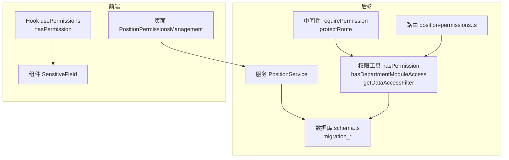
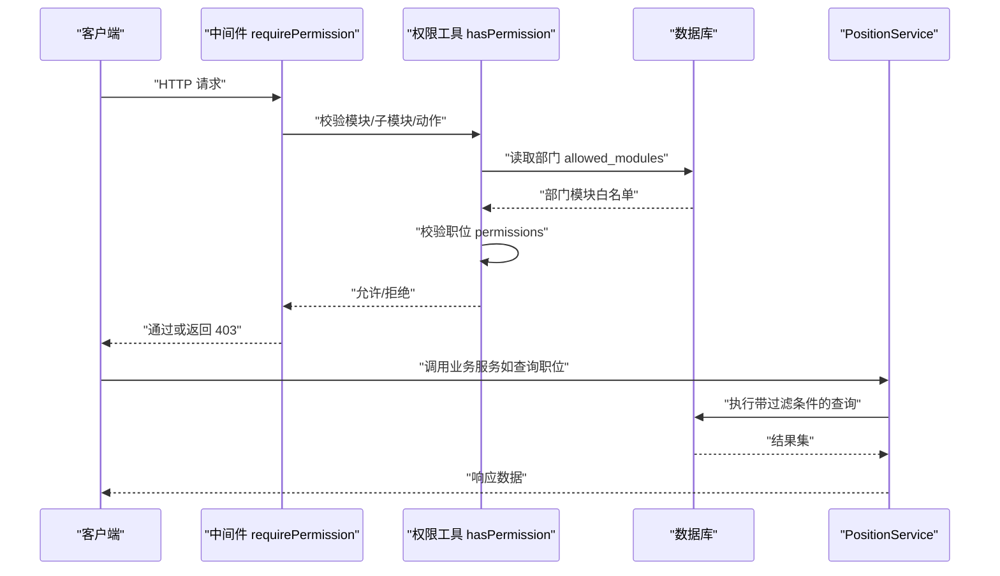
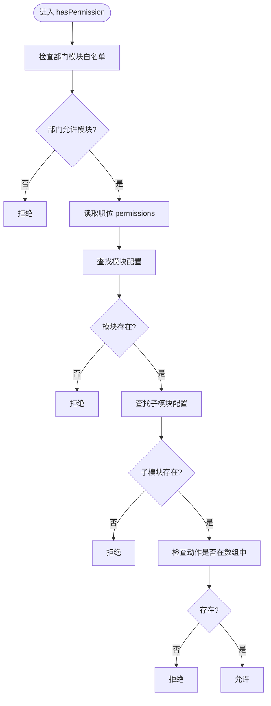
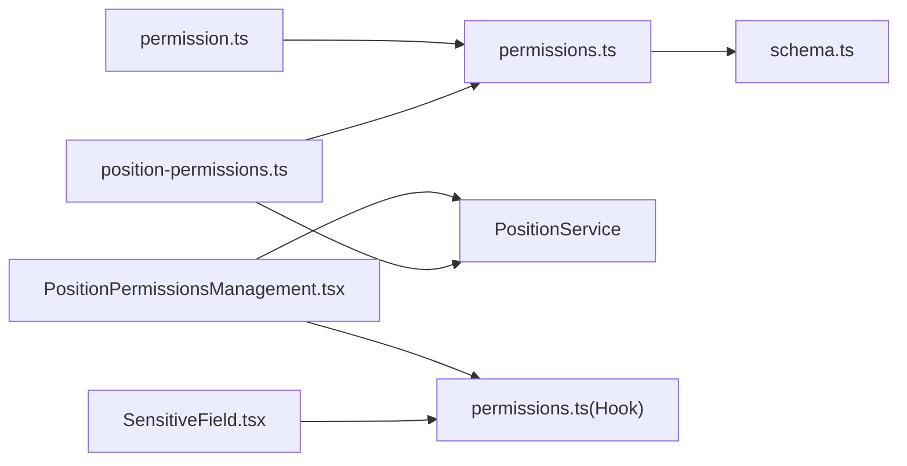

# RBAC权限控制系统

<cite>
**本文引用的文件**
- [backend/src/utils/permissions.ts](file://backend/src/utils/permissions.ts)
- [backend/src/middleware/permission.ts](file://backend/src/middleware/permission.ts)
- [backend/src/routes/position-permissions.ts](file://backend/src/routes/position-permissions.ts)
- [backend/src/services/PositionService.ts](file://backend/src/services/PositionService.ts)
- [backend/src/db/schema.ts](file://backend/src/db/schema.ts)
- [backend/src/db/archive/migration_department_modules.sql](file://backend/src/db/archive/migration_department_modules.sql)
- [backend/src/db/archive/migration_dept_positions.sql](file://backend/src/db/archive/migration_dept_positions.sql)
- [backend/src/db/archive/migration_position_replacement.sql](file://backend/src/db/archive/migration_position_replacement.sql)
- [backend/src/db/archive/migration_expand_permissions.sql](file://backend/src/db/archive/migration_expand_permissions.sql)
- [backend/test/services/RBAC.test.ts](file://backend/test/services/RBAC.test.ts)
- [frontend/src/utils/permissions.ts](file://frontend/src/utils/permissions.ts)
- [frontend/src/components/SensitiveField.tsx](file://frontend/src/components/SensitiveField.tsx)
- [frontend/src/features/system/pages/PositionPermissionsManagement.tsx](file://frontend/src/features/system/pages/PositionPermissionsManagement.tsx)
</cite>

## 目录
1. [简介](#简介)
2. [项目结构](#项目结构)
3. [核心组件](#核心组件)
4. [架构总览](#架构总览)
5. [详细组件分析](#详细组件分析)
6. [依赖关系分析](#依赖关系分析)
7. [性能考量](#性能考量)
8. [故障排查指南](#故障排查指南)
9. [结论](#结论)
10. [附录](#附录)

## 简介
本文件系统性解析基于职位的权限控制（RBAC）机制，围绕以下目标展开：
- 解释如何通过职位权限配置与数据库中的 allowed_modules 字段实现细粒度访问控制
- 分析后端中间件 requirePermission 的实现原理
- 解释前端 usePermissions Hook 的使用方式
- 结合 SensitiveField 组件的 permission 属性，展示前端如何实现敏感数据的权限控制
- 提供权限配置、继承与覆盖的业务规则说明

## 项目结构
RBAC 权限体系由“后端权限工具 + 中间件 + 路由 + 前端权限 Hook + 前端敏感字段组件 + 职位权限管理页面”构成，配合数据库中的 positions 与 org_departments 表完成“模块级 + 职位级”的双重控制。

图表来源
- [backend/src/middleware/permission.ts](file://backend/src/middleware/permission.ts#L1-L39)
- [backend/src/utils/permissions.ts](file://backend/src/utils/permissions.ts#L44-L114)
- [backend/src/routes/position-permissions.ts](file://backend/src/routes/position-permissions.ts#L33-L206)
- [backend/src/services/PositionService.ts](file://backend/src/services/PositionService.ts#L1-L180)
- [backend/src/db/schema.ts](file://backend/src/db/schema.ts#L58-L116)
- [frontend/src/utils/permissions.ts](file://frontend/src/utils/permissions.ts#L1-L100)
- [frontend/src/components/SensitiveField.tsx](file://frontend/src/components/SensitiveField.tsx#L1-L83)
- [frontend/src/features/system/pages/PositionPermissionsManagement.tsx](file://frontend/src/features/system/pages/PositionPermissionsManagement.tsx#L1-L454)

章节来源
- [backend/src/utils/permissions.ts](file://backend/src/utils/permissions.ts#L44-L114)
- [backend/src/middleware/permission.ts](file://backend/src/middleware/permission.ts#L1-L39)
- [backend/src/routes/position-permissions.ts](file://backend/src/routes/position-permissions.ts#L33-L206)
- [backend/src/services/PositionService.ts](file://backend/src/services/PositionService.ts#L1-L180)
- [backend/src/db/schema.ts](file://backend/src/db/schema.ts#L58-L116)
- [frontend/src/utils/permissions.ts](file://frontend/src/utils/permissions.ts#L1-L100)
- [frontend/src/components/SensitiveField.tsx](file://frontend/src/components/SensitiveField.tsx#L1-L83)
- [frontend/src/features/system/pages/PositionPermissionsManagement.tsx](file://frontend/src/features/system/pages/PositionPermissionsManagement.tsx#L1-L454)

## 核心组件
- 后端权限工具
  - hasDepartmentModuleAccess：基于部门 allowed_modules 与职位层级判断模块访问范围
  - hasPermission：在部门模块允许的前提下，校验职位 permissions 中是否存在具体操作
  - getDataAccessFilter：按职位层级生成数据访问过滤条件（SQL where + binds）
- 中间件
  - requirePermission：路由级权限保护，拒绝无权限请求
  - protectRoute：OpenAPI 路由包装器，先校验再执行处理器
- 路由
  - position-permissions.ts：提供职位列表、详情、创建、更新、删除等接口，并在每个接口上进行权限校验
- 服务
  - PositionService：负责职位的 CRUD，权限变更时清理受影响用户的会话缓存
- 前端 Hook
  - usePermissions：封装 hasPermission、isManager、isHQ、isFinance、isHR 等便捷方法
- 前端组件
  - SensitiveField：基于 permission 属性与 usePermissions 控制敏感数据的可见性与脱敏展示
- 页面
  - PositionPermissionsManagement：可视化编辑职位权限配置，写回后端 positions.permissions

章节来源
- [backend/src/utils/permissions.ts](file://backend/src/utils/permissions.ts#L44-L114)
- [backend/src/middleware/permission.ts](file://backend/src/middleware/permission.ts#L1-L39)
- [backend/src/routes/position-permissions.ts](file://backend/src/routes/position-permissions.ts#L33-L206)
- [backend/src/services/PositionService.ts](file://backend/src/services/PositionService.ts#L1-L180)
- [frontend/src/utils/permissions.ts](file://frontend/src/utils/permissions.ts#L1-L100)
- [frontend/src/components/SensitiveField.tsx](file://frontend/src/components/SensitiveField.tsx#L1-L83)
- [frontend/src/features/system/pages/PositionPermissionsManagement.tsx](file://frontend/src/features/system/pages/PositionPermissionsManagement.tsx#L1-L454)

## 架构总览
RBAC 的总体流程如下：
- 后端
  - 请求进入路由层，先通过 requirePermission/protectRoute 校验模块+子模块+动作
  - 若通过，调用权限工具 hasPermission，结合部门 allowed_modules 与职位 permissions 做最终判定
  - 对数据访问场景，使用 getDataAccessFilter 生成 SQL 过滤条件，确保最小化可见范围
- 前端
  - usePermissions 提供 hasPermission 与角色判断能力
  - SensitiveField 依据 permission 字符串（模块.子模块.动作）决定是否允许查看与脱敏展示
  - PositionPermissionsManagement 可视化编辑 positions.permissions 并持久化到数据库

图表来源
- [backend/src/middleware/permission.ts](file://backend/src/middleware/permission.ts#L1-L39)
- [backend/src/utils/permissions.ts](file://backend/src/utils/permissions.ts#L44-L114)
- [backend/src/services/PositionService.ts](file://backend/src/services/PositionService.ts#L1-L180)
- [backend/src/db/schema.ts](file://backend/src/db/schema.ts#L58-L116)

## 详细组件分析

### 后端权限工具：hasDepartmentModuleAccess 与 hasPermission
- hasDepartmentModuleAccess
  - 逻辑要点
    - 总部人员（level=1）直接放行，不受部门模块限制
    - 读取上下文中的部门模块白名单（departmentModules），若包含 "*" 则放行
    - 支持通配符匹配（如 hr.* 匹配 hr.employee、hr.leave 等）
- hasPermission
  - 两阶段校验
    - 首先调用 hasDepartmentModuleAccess 判断模块是否被允许
    - 再在职位 permissions 中查找对应模块、子模块、动作是否存在
  - 返回布尔值，作为中间件与业务层的统一判定依据

图表来源
- [backend/src/utils/permissions.ts](file://backend/src/utils/permissions.ts#L44-L114)

章节来源
- [backend/src/utils/permissions.ts](file://backend/src/utils/permissions.ts#L44-L114)

### 中间件：requirePermission 与 protectRoute
- requirePermission
  - 作用：为路由注入权限校验，若无权限则抛出 403
  - 参数：module、subModule、action
- protectRoute
  - 作用：OpenAPI 路由包装器，先校验再执行 handler
  - 与 requirePermission 协同，保证所有受保护接口的一致行为

章节来源
- [backend/src/middleware/permission.ts](file://backend/src/middleware/permission.ts#L1-L39)

### 路由：position-permissions.ts
- 接口职责
  - 获取职位列表、详情、创建、更新、删除
  - 在每个接口上均调用 hasPermission 校验 system.position.* 权限
- 审计日志
  - 创建/更新/删除操作记录审计日志

章节来源
- [backend/src/routes/position-permissions.ts](file://backend/src/routes/position-permissions.ts#L33-L206)

### 服务：PositionService
- 职责
  - 职位 CRUD：序列化/反序列化 permissions JSON，写入/更新 positions 表
  - 权限变更后的会话缓存失效：定位使用该职位的用户，删除其会话缓存键，强制下次请求重新加载权限
- 业务规则
  - 职位 code 唯一性校验
  - 删除前检查是否仍有员工/用户关联

章节来源
- [backend/src/services/PositionService.ts](file://backend/src/services/PositionService.ts#L1-L180)

### 数据库：positions 与 org_departments
- positions
  - 关键字段：code、name、level、functionRole、canManageSubordinates、permissions（JSON）
  - permissions 结构：模块 -> 子模块 -> 动作数组
- org_departments
  - 关键字段：allowedModules（JSON 数组，支持通配符）
  - 通过迁移脚本初始化各组织部门的 allowedModules，形成“部门级模块白名单”
- 迁移脚本
  - migration_department_modules.sql：为 org_departments 添加 allowed_modules 字段并初始化示例
  - migration_dept_positions.sql：为 org_departments 添加 allowed_positions 与 default_position_id
  - migration_position_replacement.sql：为各职位填充初始 permissions
  - migration_expand_permissions.sql：扩展总部负责人等职位的权限集合

章节来源
- [backend/src/db/schema.ts](file://backend/src/db/schema.ts#L58-L116)
- [backend/src/db/archive/migration_department_modules.sql](file://backend/src/db/archive/migration_department_modules.sql#L1-L33)
- [backend/src/db/archive/migration_dept_positions.sql](file://backend/src/db/archive/migration_dept_positions.sql#L1-L12)
- [backend/src/db/archive/migration_position_replacement.sql](file://backend/src/db/archive/migration_position_replacement.sql#L428-L481)
- [backend/src/db/archive/migration_expand_permissions.sql](file://backend/src/db/archive/migration_expand_permissions.sql#L1-L42)

### 前端 Hook：usePermissions
- 能力
  - hasPermission：按模块/子模块/动作检查权限
  - 角色判断：isManager、isHQ、isFinance、isHR
  - 位置信息：canManageSubordinates、positionCode、positionLevel、functionRole
- 设计要点
  - 基于用户职位的 permissions JSON 结构进行逐层查找
  - 支持仅检查模块/子模块/动作三个层级

章节来源
- [frontend/src/utils/permissions.ts](file://frontend/src/utils/permissions.ts#L1-L100)

### 前端组件：SensitiveField
- 能力
  - permission 属性：形如 "hr.employee.view_sensitive"，用于声明所需权限
  - 无权限时显示占位文案；有权限时根据类型进行脱敏展示
  - 显示/隐藏切换时触发审计日志（仅在可见态时记录）
- 使用方式
  - 在需要保护的敏感字段处传入 permission，组件内部通过 usePermissions.hasPermission 判断
  - 可选 entityId/entityType 用于审计记录

章节来源
- [frontend/src/components/SensitiveField.tsx](file://frontend/src/components/SensitiveField.tsx#L1-L83)

### 前端页面：PositionPermissionsManagement
- 能力
  - 可视化编辑 positions.permissions，支持模块/子模块/动作三级勾选
  - 将编辑结果 PUT 回后端，更新 positions.permissions
- 业务规则
  - 仅具有 system.position.update 权限的用户可编辑
  - 通过 PERMISSION_MODULES 常量与后端权限结构保持一致

章节来源
- [frontend/src/features/system/pages/PositionPermissionsManagement.tsx](file://frontend/src/features/system/pages/PositionPermissionsManagement.tsx#L1-L454)

## 依赖关系分析
- 后端
  - 路由依赖权限工具与服务
  - 权限工具依赖数据库 schema 中的 positions 与 org_departments 字段
  - 中间件依赖权限工具
- 前端
  - SensitiveField 依赖 usePermissions
  - PositionPermissionsManagement 依赖 usePermissions 与 PositionService

图表来源
- [backend/src/routes/position-permissions.ts](file://backend/src/routes/position-permissions.ts#L33-L206)
- [backend/src/utils/permissions.ts](file://backend/src/utils/permissions.ts#L44-L114)
- [backend/src/middleware/permission.ts](file://backend/src/middleware/permission.ts#L1-L39)
- [backend/src/services/PositionService.ts](file://backend/src/services/PositionService.ts#L1-L180)
- [backend/src/db/schema.ts](file://backend/src/db/schema.ts#L58-L116)
- [frontend/src/components/SensitiveField.tsx](file://frontend/src/components/SensitiveField.tsx#L1-L83)
- [frontend/src/features/system/pages/PositionPermissionsManagement.tsx](file://frontend/src/features/system/pages/PositionPermissionsManagement.tsx#L1-L454)
- [frontend/src/utils/permissions.ts](file://frontend/src/utils/permissions.ts#L1-L100)

章节来源
- [backend/src/routes/position-permissions.ts](file://backend/src/routes/position-permissions.ts#L33-L206)
- [backend/src/utils/permissions.ts](file://backend/src/utils/permissions.ts#L44-L114)
- [backend/src/middleware/permission.ts](file://backend/src/middleware/permission.ts#L1-L39)
- [backend/src/services/PositionService.ts](file://backend/src/services/PositionService.ts#L1-L180)
- [backend/src/db/schema.ts](file://backend/src/db/schema.ts#L58-L116)
- [frontend/src/components/SensitiveField.tsx](file://frontend/src/components/SensitiveField.tsx#L1-L83)
- [frontend/src/features/system/pages/PositionPermissionsManagement.tsx](file://frontend/src/features/system/pages/PositionPermissionsManagement.tsx#L1-L454)
- [frontend/src/utils/permissions.ts](file://frontend/src/utils/permissions.ts#L1-L100)

## 性能考量
- 中间件与权限工具均为纯逻辑判断，开销极低
- PositionService 在更新 permissions 后主动清理受影响用户的会话缓存，避免脏缓存导致的多次权限校验失败
- 前端 usePermissions 仅做内存中的 JSON 结构查找，复杂度与权限树深度线性相关
- SensitiveField 的渲染与权限判断在组件内部完成，避免不必要的网络请求

[本节为通用建议，无需特定文件来源]

## 故障排查指南
- 403 Forbidden
  - 检查路由是否正确使用 requirePermission/protectRoute
  - 检查 hasPermission 的模块/子模块/动作是否与职位 permissions 匹配
- 部门模块限制导致权限被拒
  - 检查 org_departments.allowed_modules 是否包含相应模块或通配符
  - 注意总部人员（level=1）不受部门模块限制
- 职位权限未生效
  - 检查 positions.permissions 是否正确写入 JSON
  - 确认 PositionService 是否触发了会话缓存失效流程
- 前端权限判断异常
  - 检查 usePermissions 的模块/子模块/动作层级是否与后端一致
  - 检查 SensitiveField 的 permission 字符串格式是否符合 "模块.子模块.动作"

章节来源
- [backend/src/middleware/permission.ts](file://backend/src/middleware/permission.ts#L1-L39)
- [backend/src/utils/permissions.ts](file://backend/src/utils/permissions.ts#L44-L114)
- [backend/src/services/PositionService.ts](file://backend/src/services/PositionService.ts#L1-L180)
- [frontend/src/utils/permissions.ts](file://frontend/src/utils/permissions.ts#L1-L100)
- [frontend/src/components/SensitiveField.tsx](file://frontend/src/components/SensitiveField.tsx#L1-L83)

## 结论
本系统通过“部门 allowed_modules + 职位 permissions”的双层控制，实现了灵活且细粒度的 RBAC 权限体系：
- 部门层面：限定可访问的模块范围，支持通配符匹配
- 职位层面：精确到子模块与动作的授权
- 中间件与权限工具统一了校验入口，前后端协同保障安全与体验
- 迁移脚本与职位权限管理页面保证了权限配置的可维护性与可追溯性

[本节为总结，无需特定文件来源]

## 附录

### 权限配置、继承与覆盖的业务规则
- 配置来源
  - 职位权限：positions.permissions（模块 -> 子模块 -> 动作数组）
  - 部门模块白名单：org_departments.allowedModules（支持通配符）
- 继承与覆盖
  - 部门白名单优先：即使职位 permissions 中存在某模块，若部门不允许也会被拒绝
  - 职位权限覆盖：在部门允许的前提下，职位 permissions 决定具体可执行的动作
  - 总部人员（level=1）不受部门模块限制
- 前端规则
  - SensitiveField.permission 字符串需与后端权限结构一致（模块.子模块.动作）
  - usePermissions 的 hasPermission 支持模块/子模块/动作三级检查
- 测试验证
  - RBAC 测试覆盖了数据访问过滤、员工可见性、模块白名单匹配、总部豁免等场景

章节来源
- [backend/test/services/RBAC.test.ts](file://backend/test/services/RBAC.test.ts#L1-L209)
- [backend/src/utils/permissions.ts](file://backend/src/utils/permissions.ts#L44-L114)
- [frontend/src/components/SensitiveField.tsx](file://frontend/src/components/SensitiveField.tsx#L1-L83)
- [frontend/src/utils/permissions.ts](file://frontend/src/utils/permissions.ts#L1-L100)