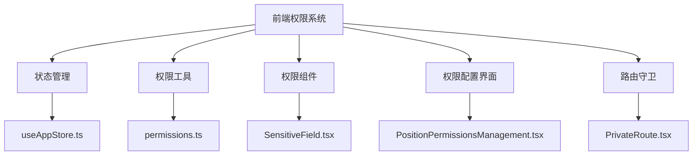
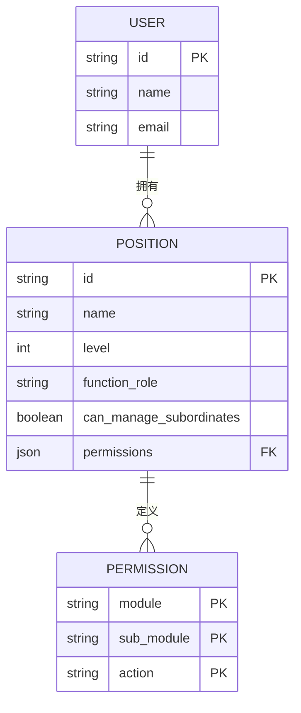
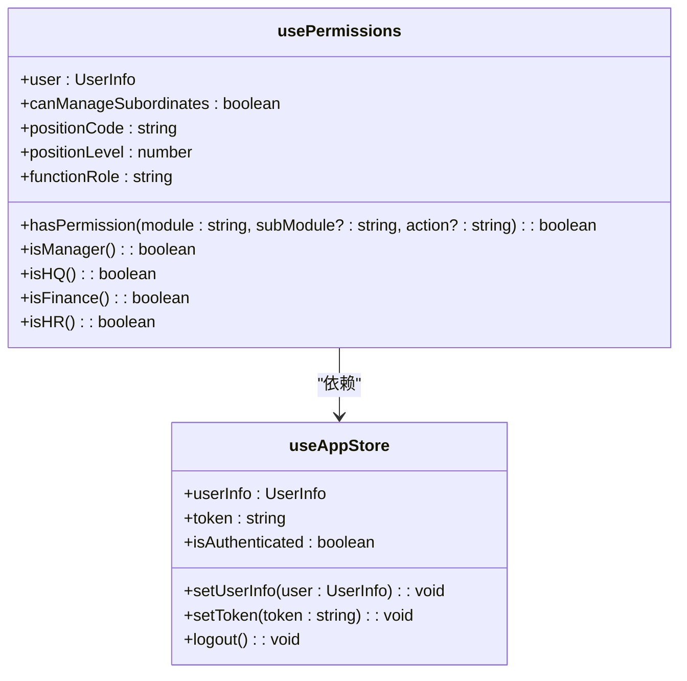
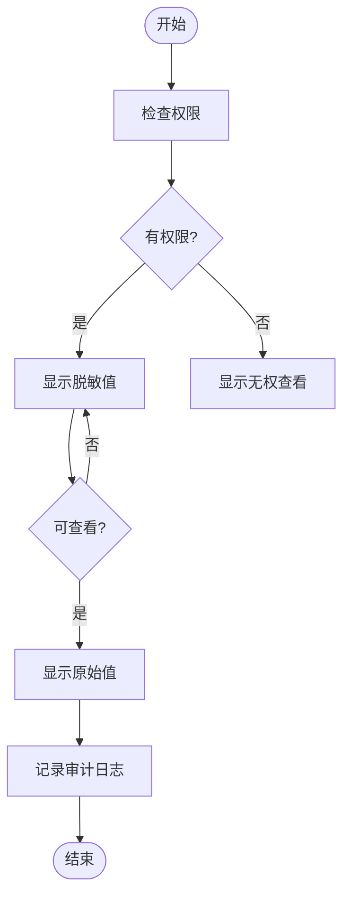
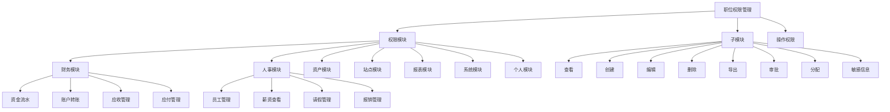
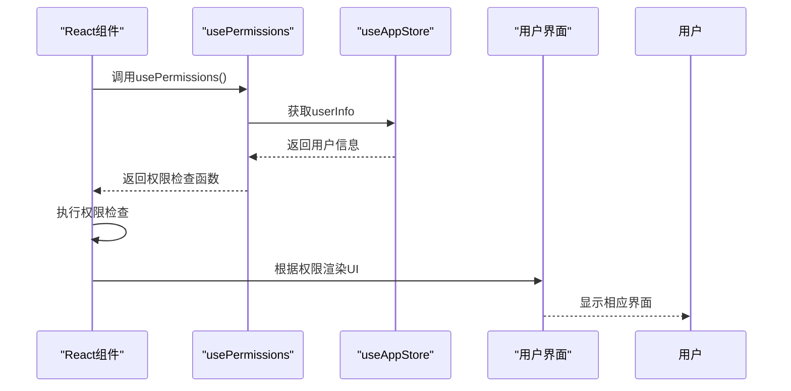
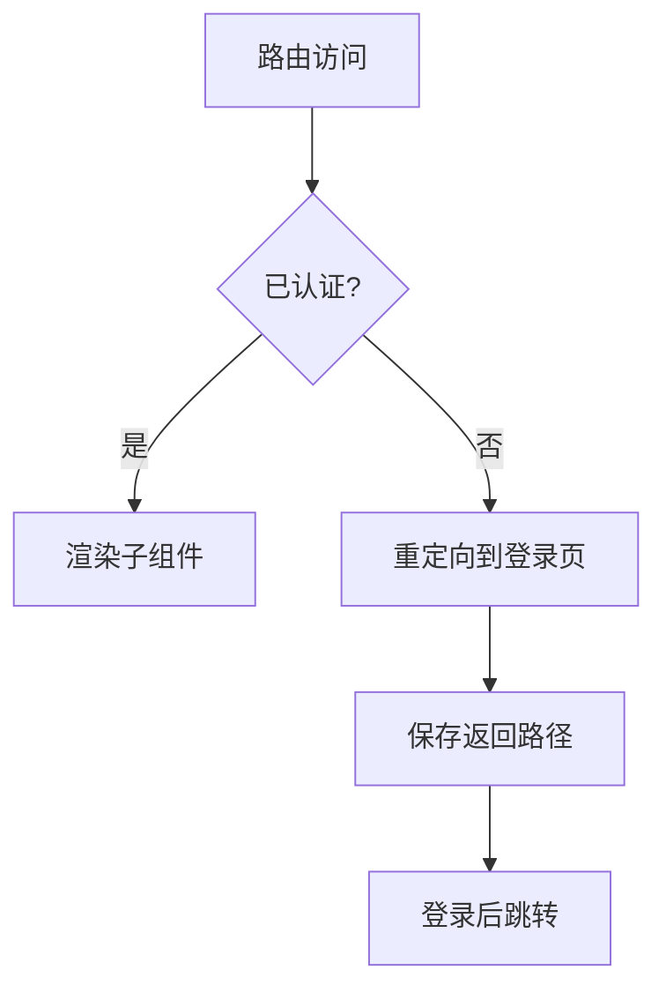

# 前端权限控制实现

<cite>
**本文档引用文件**  
- [useAppStore.ts](file://frontend/src/store/useAppStore.ts)
- [permissions.ts](file://frontend/src/utils/permissions.ts)
- [SensitiveField.tsx](file://frontend/src/components/SensitiveField.tsx)
- [PositionPermissionsManagement.tsx](file://frontend/src/features/system/pages/PositionPermissionsManagement.tsx)
- [EmployeeManagement.tsx](file://frontend/src/features/hr/pages/EmployeeManagement.tsx)
- [Flows.tsx](file://frontend/src/features/finance/pages/Flows.tsx)
- [MyProfile.tsx](file://frontend/src/features/my/pages/MyProfile.tsx)
- [Dashboard.tsx](file://frontend/src/features/dashboard/pages/Dashboard.tsx)
- [PrivateRoute.tsx](file://frontend/src/router/PrivateRoute.tsx)
</cite>

## 目录
1. [项目结构](#项目结构)
2. [核心权限机制](#核心权限机制)
3. [usePermissions Hook详解](#usepermissions-hook详解)
4. [敏感信息控制组件](#敏感信息控制组件)
5. [职位权限配置界面](#职位权限配置界面)
6. [权限控制最佳实践](#权限控制最佳实践)
7. [路由守卫实现](#路由守卫实现)

## 项目结构

前端权限控制系统主要分布在以下几个关键目录和文件中：



**Diagram sources**  
- [useAppStore.ts](file://frontend/src/store/useAppStore.ts)
- [permissions.ts](file://frontend/src/utils/permissions.ts)
- [SensitiveField.tsx](file://frontend/src/components/SensitiveField.tsx)
- [PositionPermissionsManagement.tsx](file://frontend/src/features/system/pages/PositionPermissionsManagement.tsx)
- [PrivateRoute.tsx](file://frontend/src/router/PrivateRoute.tsx)

**Section sources**
- [useAppStore.ts](file://frontend/src/store/useAppStore.ts)
- [permissions.ts](file://frontend/src/utils/permissions.ts)
- [SensitiveField.tsx](file://frontend/src/components/SensitiveField.tsx)
- [PositionPermissionsManagement.tsx](file://frontend/src/features/system/pages/PositionPermissionsManagement.tsx)
- [PrivateRoute.tsx](file://frontend/src/router/PrivateRoute.tsx)

## 核心权限机制

系统采用基于职位的权限控制（RBAC）模型，权限数据存储在用户信息的职位对象中。权限结构采用三级分层：模块（module）→ 子模块（subModule）→ 操作（action）。



**Diagram sources**  
- [useAppStore.ts](file://frontend/src/store/useAppStore.ts)
- [permissions.ts](file://frontend/src/utils/permissions.ts)

**Section sources**
- [useAppStore.ts](file://frontend/src/store/useAppStore.ts#L4-L65)
- [permissions.ts](file://frontend/src/utils/permissions.ts#L3-L12)

## usePermissions Hook详解

`usePermissions` 是系统核心的权限检查Hook，它从全局状态 `useAppStore` 中获取用户权限数据，并提供一系列便捷的权限检查方法。



**Diagram sources**  
- [useAppStore.ts](file://frontend/src/store/useAppStore.ts#L11-L65)
- [permissions.ts](file://frontend/src/utils/permissions.ts#L51-L98)

**Section sources**
- [useAppStore.ts](file://frontend/src/store/useAppStore.ts#L11-L65)
- [permissions.ts](file://frontend/src/utils/permissions.ts#L51-L98)

### 权限检查方法

`usePermissions` 提供了多种权限检查方法：

- `hasPermission(module, subModule, action)`: 检查用户是否具有指定操作权限
- `isManager()`: 检查用户是否为管理者（可管理下属）
- `isHQ()`: 检查用户是否为总部人员
- `isFinance()`: 检查用户是否为财务人员
- `isHR()`: 检查用户是否为人力资源人员

这些方法基于用户职位信息中的权限配置进行判断，为前端组件提供灵活的权限控制能力。

## 敏感信息控制组件

`SensitiveField` 组件用于控制敏感信息的显示，基于权限属性实现动态显示控制。



**Diagram sources**  
- [SensitiveField.tsx](file://frontend/src/components/SensitiveField.tsx#L7-L83)

**Section sources**
- [SensitiveField.tsx](file://frontend/src/components/SensitiveField.tsx#L7-L83)

### 组件特性

`SensitiveField` 组件具有以下特性：

1. **权限控制**: 通过 `permission` 属性指定所需权限
2. **脱敏显示**: 支持多种脱敏模式（薪资、电话、地址等）
3. **审计日志**: 当用户查看敏感信息时自动记录审计日志
4. **交互体验**: 提供显示/隐藏切换按钮，提升用户体验

该组件在员工管理、薪资查看等涉及敏感信息的场景中广泛应用。

## 职位权限配置界面

`PositionPermissionsManagement` 页面提供了可视化配置职位权限矩阵的功能。



**Diagram sources**  
- [PositionPermissionsManagement.tsx](file://frontend/src/features/system/pages/PositionPermissionsManagement.tsx#L28-L86)

**Section sources**
- [PositionPermissionsManagement.tsx](file://frontend/src/features/system/pages/PositionPermissionsManagement.tsx#L1-L454)

### 配置功能

该界面提供以下配置功能：

1. **权限矩阵**: 以表格形式展示所有职位的权限配置
2. **权限摘要**: 显示每个职位的权限概要信息
3. **权限详情**: 展开查看详细的权限配置
4. **权限编辑**: 通过模态框编辑职位权限
5. **批量操作**: 支持刷新、启用/禁用等操作

权限配置采用三级结构：模块 → 子模块 → 操作，支持全选、半选等交互模式。

## 权限控制最佳实践

在React组件中使用权限控制的最佳实践包括条件渲染、按钮级权限控制等。



**Diagram sources**  
- [EmployeeManagement.tsx](file://frontend/src/features/hr/pages/EmployeeManagement.tsx#L43-L46)
- [Flows.tsx](file://frontend/src/features/finance/pages/Flows.tsx#L176-L189)

**Section sources**
- [EmployeeManagement.tsx](file://frontend/src/features/hr/pages/EmployeeManagement.tsx#L1-L200)
- [Flows.tsx](file://frontend/src/features/finance/pages/Flows.tsx#L1-L200)

### 实际应用示例

#### 条件渲染

在员工管理页面中，根据权限决定是否显示编辑按钮：

```typescript
const canEdit = hasPermission('hr', 'employee', 'update')
// 根据canEdit值决定是否渲染编辑按钮
```

#### 按钮级权限控制

在财务流水页面中，根据权限控制按钮的显示和禁用状态：

```typescript
<Button 
  type="primary" 
  onClick={handleCreate}
  disabled={!hasPermission('finance', 'flow', 'create')}
>
  新建记账
</Button>
```

#### 敏感信息控制

在员工信息展示中，使用 `SensitiveField` 组件控制敏感信息的显示：

```tsx
<SensitiveField 
  value={employee.phone} 
  type="phone" 
  permission="hr.employee.view_sensitive" 
  entityId={employee.id} 
  entityType="employee" 
/>
```

## 路由守卫实现

系统通过 `PrivateRoute` 组件实现路由守卫，确保只有认证用户才能访问受保护的路由。



**Diagram sources**  
- [PrivateRoute.tsx](file://frontend/src/router/PrivateRoute.tsx#L1-L16)

**Section sources**
- [PrivateRoute.tsx](file://frontend/src/router/PrivateRoute.tsx#L1-L16)

### 守卫逻辑

路由守卫的实现逻辑包括：

1. **双重验证**: 同时检查 `isAuthenticated` 标志和实际的 `token`、`userInfo` 存在性
2. **防止篡改**: 即使localStorage被手动篡改，也能阻止未授权访问
3. **路径保存**: 在重定向到登录页时保存原始访问路径，登录后可返回原页面

这种实现方式确保了系统的安全性，防止了通过修改本地存储绕过权限检查的可能性。